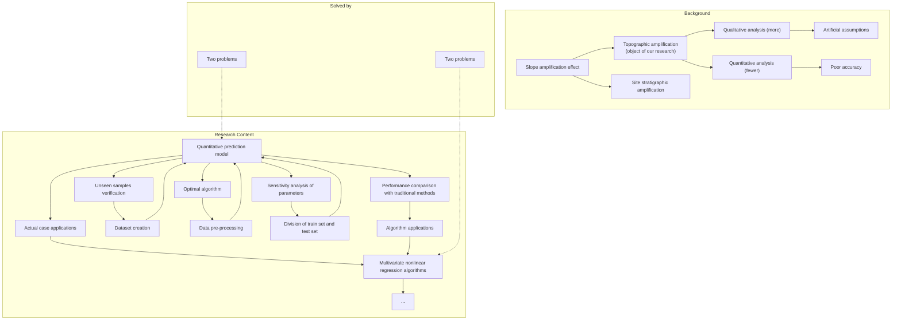
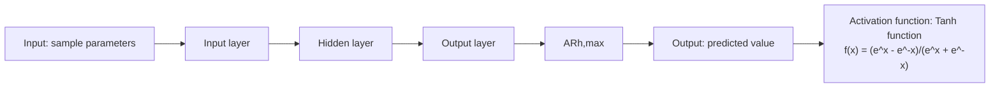

# Prediction framework of slope topographic amplification on seismic acceleration based on machine learning algorithms

Shiyuan Ju a,b , Jinqing Jia a,b,\* , Xuegang Pan a,b

a School of Civil Engineering, Dalian University of Technology, Dalian, 116024, China  
b State Key Laboratory of Coastal and Offshore Engineering, Dalian University of Technology, Dalian, 116024, China

## A R T I C L E I N F O

## Keywords:

Machine learning

Slope topographic amplification

Prediction framework

Multivariate nonlinear regression

Quantitative analysis

## A B S T R A C T

Slope topographic amplification of peak seismic acceleration leads to more severe seismic damage to nearby buildings, so its quantitative prediction is required for engineering applications. However, prior quantitative studies are fewer and use traditional regression methods, which require subjective assumptions and have lower accuracy. To solve this problem, artificial intelligence regression algorithms were firstly attempted to establish a predictive model for slope topographic amplification. In this model, slope inclination, slope height, and frequency of seismic waves were taken as parameters, and amplification ratio was taken as prediction target. Then, the multivariate nonlinear relationship between the prediction target and the sample parameters was established using artificial intelligence regression algorithms. Compared with the traditional prediction method, the determination coefficient of the present model is improved by 17.84%–32.60%, and the root mean square error is reduced by 30.05%–77.36%. In addition, the effect of different regression algorithms on the prediction model was investigated, and the influence of each parameter on the topographic amplification was analyzed. Finally, the proposed prediction model was applied to three practical earthquake cases, which confirmed that it can fill the gap in quantitatively predicting the slope topographic amplification and provide a guide for seismic design in engineering.

## 1. Introduction

As an irregular topography, the slope has a great influence on the seismic ground motion (Bouckovalas and Papadimitriou, 2005; Del Gaudio and Wasowski, 2007; Del Gaudio et al., 2014; Trifunac, 2016). During an earthquake, the slope can amplify or weaken ground motion metrics, such as peak ground acceleration (PGA). As a result, the peak acceleration is unevenly distributed in space, with buildings near the slope suffering significantly different seismic damage. In general, the ground acceleration is amplified at a distance behind the slope crest (Bouckovalas and Papadimitriou, 2005; Tripe et al., 2013; Zhang et al., 2018), where buildings are often located, as shown in Fig. 1. Therefore, the acceleration amplification caused by the slope will aggravate the catastrophic consequences brought by the earthquake. This phenomenon has been proved by many seismic damage investigations, such as the 1989 Loma Prieta earthquake (Wald et al., 1991; Hartzell et al., 1994), the 1995 Egion earthquake (Athanasopoulos et al., 1999), the 1999 Parnitha earthquake (Gazetas et al., 2002) and the 2008 Wenchuan earthquake (Yin et al., 2009). In summary, it is necessary to investigate the slope amplification effect of ground acceleration (see Fig. 2).

The slope amplification effect includes two parts: topographic amplification and site stratigraphic amplification, both of which are influenced by many factors respectively (Rizzitano et al., 2014; Luo et al., 2020; Shabani and Ghanbari, 2020). The factors influencing the slope amplification effect include ground surface geometry, soil profiles and high impedance contrast between different layers, soil mechanical properties (heterogeneity and nonlinear behavior), and characteristics of the seismic motion.

Ashford et al. (1997) indicated that the topographic amplification and site stratigraphic amplification are unrelated. Therefore, the topographic amplification and site stratigraphic amplification are usually decoupled in investigations of topographic amplification. This decoupling is reflected in the definition of the topographic amplification measures, such as amplification ratio (AR), topographic aggravation factor (TAF) and spectral acceleration amplification (Rizzitano et al., 2014). For example, amplification ratio (AR) is defined as the ratio of two-dimensional to one-dimensional peak ground accelerations (PGA). The amplification ratio of any point i on the ground surface can be calculated as the following formula:

area

| Distance (m) | Peak ground acceleration \((m/s^{2})\) |
| --- | --- |
| 0 | ~1.5 |
| ~1.5 | ~1.5 |
| ~3.0 | ~1.5 |
| ~4.5 | ~1.5 |
| ~6.0 | ~1.5 |
| ~7.5 | ~1.5 |
| ~9.0 | ~1.5 |
| ~10.5 | ~1.5 |
| ~12.0 | ~1.5 |
| ~13.5 | ~1.5 |
| ~15.0 | ~1.5 |
| ~16.5 | ~1.5 |
| ~18.0 | ~1.5 |
| ~19.5 | ~1.5 |
| ~21.0 | ~1.5 |
| ~22.5 | ~1.5 |
| ~24.0 | ~1.5 |
| ~25.5 | ~1.5 |
| ~27.0 | ~1.5 |
| ~28.5 | ~1.5 |
| ~30.0 | ~1.5 |
| ~31.5 | ~1.5 |
| ~33.0 | ~1.5 |
| ~34.5 | ~1.5 |
| ~36.0 | ~1.5 |
| ~37.5 | ~1.5 |
| ~39.0 | ~1.5 |
| ~40.5 | ~1.5 |
| ~42.0 | ~1.5 |
| ~43.5 | ~1.5 |
| ~45.0 | ~1.5 |
| ~46.5 | ~1.5 |
| ~48.0 | ~1.5 |
| ~49.5 | ~1.5 |
| ~51.0 | ~1.5 |
| ~52.5 | ~1.5 |
| ~54.0 | ~1.5 |
| ~55.5 | ~1.5 |
| ~57.0 | ~1.5 |
| ~58.5 | ~1.5 |
| ~60.0 | ~1.5 |
| ~61.5 | ~1.5 |
| ~63.0 | ~1.5 |
| ~64.5 | ~1.5 |
| ~66.0 | ~1.5 |
| ~67.5 | ~1.5 |
| ~69.0 | ~1.5 |
| ~70.5 | ~1.5 |
| ~72.0 | ~1.5 |
| ~73.5 | ~1.5 |
| ~75.0 | ~1.5 |
| ~76.5 | ~1.5 |
| ~78.0 | ~1.5 |
| ~79.5 | ~1.5 |
| ~81.0 | ~1.5 |
| ~82.5 | ~1.5 |
| ~84.0 | ~1.5 |
| ~85.5 | ~1.5 |
| ~87.0 | ~1.5 |
| ~88.5 | ~1.5 |
| ~90.0 | ~1.5 |
| ~91.5 | ~1.5 |
| ~93.0 | ~1.5 |
| ~94.5 | ~1.5 |
| ~96.0 | ~1.5 |
| ~97.5 | ~1.5 |
| ~99.0 | ~1.5 |
| 100 | 2~4 (oscillating) |

Fig. 1. Slope amplification effect of ground acceleration.

text_image

Rayleigh wave
reflected P wave
Rayleigh wave
reflected SV wave
incident SV wave
incident SV wave
incident SV wave

Fig. 2. Complex wave field composed of incident SV waves, reflected SV waves, reflected P waves and diffracted Rayleigh waves in slopes.

$$
A R _ {i} = a _ {i} / a _ {i, f f} \tag {1}
$$

where ARi is the amplification ratio of point i, ai is the PGA of point i obtained by two-dimensional seismic response analysis, ai,ff is the PGA of the one-dimensional free field with the same height as point i.

Until now, many researchers have studied the slope topographic amplification. In most of these studies, qualitative parametric analyses have been used to assess the influence of various factors on the topographic amplification effect (Bouckovalas and Papadimitriou, 2005; Assimaki and Kausel, 2007; Tripe et al., 2013; Rizzitano et al., 2014; Bararpour et al., 2016; Tsai and Lin, 2018; Zhang et al., 2018; Li et al. 2019, 2022). In terms of the soil layer of slopes, most parametric studies have used a single, homogeneous soil layer and considered a linear behavior for materials. This is because the effects of complex soil profiles, soil heterogeneity and nonlinear behavior are site stratigraphic amplification and have been decoupled from the investigated topographic amplification.

In terms of input seismic motions, parametric studies use simplified seismic motions rather than actual ground motions. This is because the site stratigraphic amplification (the soil profiles and mechanical properties) is difficult to decouple (Griffiths and Bollinger, 1979; Rovelli et al., 2002). Even if the site stratigraphic amplification is separated, a few site-specific results contribute little to establishing relationships between topographic amplification measures and influencing factors.

In the above parametric studies, researchers have obtained qualitative relationships between topographic amplification measures (e.g., AR) and influencing parameters by varying parameter values, while the principles of topographic amplification are discussed. Since the site stratigraphic amplification is decoupled, many researchers believe that the incoming vertically propagating shear waves (SV waves) are reflected by the slope free surface, resulting in reflected P waves, reflected SV waves and Rayleigh waves on the top free surface, which eventually leads to topographic amplification.

The parameters involved in several parametric studies are summarized in Table 1. Since the stratigraphic amplification has been decoupled in the topographic amplification measures, the parameters related to the soil profile, mechanical properties are not considered.

Nevertheless, the above qualitative studies no longer meet the needs of the engineering community. Due to the high computational cost and complicated process of numerical simulation for specific project (Semblat et al., 2000; Abdullah, 2018), engineers tend to establish quantitative relationships between topographic amplification measures (e.g., AR) and influencing parameters.

Until now, most of the current studies on slope topographic amplification just qualitatively analyze the effects of each parameter (Tripe et al., 2013; Rizzitano et al., 2014; Bararpour et al., 2016; Zhang et al., 2018; Li et al. 2019, 2022). In contrast, few studies provide quantitative predicts of slope topographic amplification based on numerical simulation results (Assimaki et al., 2005; Bouckovalas and Papadimitriou, 2005; Shabani and Ghanbari, 2020).

The few existing quantitative studies still fail to meet the need for accurate prediction of topographic amplification in seismic design, because the existing quantitative studies use traditional regression methods. The topographic amplification is influenced by multiple parameters, as well as involving the complex physical phenomena of wave diffraction. As a result, the establishment of quantitative relationship between topographic amplification and each parameter is a multivariate nonlinear regression problem, which is unsolvable by traditional

Table 1 The parameters involved in the previous parametric investigations.

<table><tr><td rowspan="2">Researchers</td><td rowspan="2">Year</td><td colspan="5">Parameters</td></tr><tr><td>Slope angle</td><td>Slope height</td><td>Frequency</td><td>Wavelength</td><td>Number of cycles</td></tr><tr><td>Bouckovalas and Papadimitriou</td><td>2005</td><td>✓</td><td>✓</td><td></td><td>✓</td><td>✓</td></tr><tr><td>Rizzitano et al.</td><td>2014</td><td>✓</td><td></td><td>✓</td><td></td><td></td></tr><tr><td>Zhang et al.</td><td>2018</td><td>✓</td><td>✓</td><td>✓</td><td></td><td>✓</td></tr><tr><td>Li et al.</td><td>2019</td><td>✓</td><td>✓</td><td>✓</td><td></td><td></td></tr><tr><td>Li et al.</td><td>2022</td><td>✓</td><td>✓</td><td></td><td></td><td></td></tr></table>

flowchart

Fig. 3. Flow chart for the investigation of slope topographic amplification.

regression methods.

As a result, there are two problems need to be addressed in existing quantitative studies of topographic amplification.

1. The regression function form in the traditional method is subjectively assumed by researchers.  
2. Capturing the complex nonlinear quantitative relationships in topographic amplification through simple regression functional forms limits accuracy.

With the development of artificial intelligence technology, some regression algorithms in artificial intelligence can accurately capture nonlinear relationships in multiple regression problems by using nonlinear activation functions. A data-driven accurate regression model can be built using these algorithms without artificial assumptions. In recent years, some researchers have attempted to apply these algorithms to solve different problems, such as prediction of ground motions (Nayek and Gade, 2022; Cheng et al., 2023) and prediction of slope stability (Huang et al., 2020).

In order to solve the two problems in existing quantitative studies of topographic amplification and to satisfy the need for accurate prediction of amplification ratio in engineering design, artificial intelligence regression algorithms are firstly applied to the quantitative study of slope topographic amplification. In the present study, a topographic amplification prediction model based on multivariate nonlinear regression algorithms is proposed. The accuracy of the prediction model based on this quantitative relationship is evaluated by a variety of performance metrics, and the generalization is verified by the five-fold cross-validation. In addition, the differences between prediction models based on various algorithms were compared, and the sensitivity of each parameter was investigated through parameter combinations. Finally, the topographic amplification prediction model was applied to several practical earthquake cases, which confirmed that the proposed method can fulfill the requirement for accurate quantitative prediction of slope topographic amplification in the seismic design of buildings near slopes. The flow chart of the present investigation is shown in Fig. 3.

## 2. Establishment of prediction model for topographic amplification

A prediction model for slope topographic amplification was proposed in the present investigation. The prediction model treats a slope as a sample, the parameters of which are obtained by parameterizing the influence factors. Multiple slopes with varying parameters then constitute a dataset. Furthermore, the multivariate nonlinear regression algorithms are subsequently applied to establish the quantitative relationship between topographic amplification measure (e.g. AR) and parameters. Such a quantitative relationship made it possible to predict the amplification ratio of a slope with certain parameters in engineering applications.

Since all quantitative relationships require a number of samples with different influence parameters, a dataset needs to be created in which each data (sample) represents a slope model. As mentioned in the introduction, two categories of parameters influence slope topographic amplification: the surface geometry parameters and the seismic motion characteristic parameters. Based on the results of previous parametric studies, the five influence parameters (slope angle, slope height, frequency, wavelength, number of cycles) in Table 1 were selected in the present study. The most commonly used amplification ratio (AR) was chosen as the topographic amplification measure, which is defined by Eq. (1) above. The maximum horizontal amplification ratio of the whole ground surface $A R _ { h , m a x }$ is used as the object of prediction. In this way, each sample can be stored as a vector $\overrightarrow { d } ( p _ { 1 } , p _ { 2 } , p _ { 3 } , p _ { 4 } , p _ { 5 } , A R _ { h , m a x } )$ , where $p _ { 1 } , p _ { 2 } , p _ { 3 } , p _ { 4 } , p _ { 5 }$ are the geometry and input motion parameters of this slope.

As explained in the introduction, the data should be obtained using homogeneous stratigraphy, considering the linear behavior of the material and not using actual seismic records to exclude site stratigraphic amplification. Considering that the quality of the numerical model has an important influence on the data, the created grid should be assessed in the numerical simulation, and key parameters such as orthogonal quality and skew should be investigated (Fatchurrohman and Chia, 2017; Krzywanski et al. 2020a, 2020b). In addition, the dataset should satisfy the following two conditions. First, the numerical simulation methods used to obtain the samples are uniform. Second, the samples should cover a comprehensive range.

According to the above requirements, a series of numerical simulation results about slope topographic amplification from “The effects of slope topography on acceleration amplification and interaction between slope topography and seismic input motion” published by Zhang et al., in 2018 were cited to generate the dataset in this investigation.

Zhang et al. used the finite difference software FLAC 8.0 to establish a series of two-dimensional numerical slope models. The geometrical parameters of the slopes involved in the dataset were slope angle α and slope height H. The slope angle varied from 10◦ to 45◦, while the slope height varied from 20 m to 90 m. The geometry of slopes is shown in Fig. 4.

text_image

L₁
α
H
L₂
D
L

Fig. 4. Geometry parameters of slopes in the dataset.

Table 2 Range and distribution of parameters influencing topographic amplification.

<table><tr><td>Parameter</td><td>Range</td><td>Representative values</td></tr><tr><td> $\alpha(^{\circ})$ </td><td>10–45</td><td> $10^{\circ},\ 15^{\circ},\ 20^{\circ},\ 25^{\circ},\ 30^{\circ},\ 35^{\circ},\ 40^{\circ},\ 45^{\circ}$ </td></tr><tr><td> $H(m)$ </td><td>20–90</td><td>20, 30, 40, 50, 60, 70, 80, 90</td></tr><tr><td> $fr(Hz)$ </td><td>1–10</td><td>1, 2, 3, 4, 5, 6, 7, 8, 9, 10</td></tr><tr><td> $\lambda(m)$ </td><td>31–310</td><td>31, 34.4, 38.8, 44.3, 51.7, 62, 77.5, 103.3, 155, 310</td></tr><tr><td> $N$ </td><td>1–12</td><td>1, 2, 4, 6, 12</td></tr></table>

In the present investigation, the ground motion parameters include frequency $f r ,$ wavelength $\lambda ,$ and number of cycles N, with the relationship between them shown as Eq. (2). The frequency variation range is 1 Hz–10 Hz, the wavelength varied with the frequency, and the cycle number has five cases of $N = 1 , 2 , 4 , 6 , 1 2$ .

$$
\lambda = V _ {s} / f r \tag {2}
$$

where λ is the wavelength of the input SV wave, $f r$ is the frequency of the input wave, $V _ { s }$ is the shear wave velocity of soil.

Hence, numerical simulation results of 187 slope models conducted by Zhang et al. (2018) generated 187 samples with different parameters, each sample including five parameters, namely slope angle $\alpha ,$ slope height $H ,$ frequency $f r ,$ wavelength $\lambda ,$ and number of cycles $N ,$ as well as the $A R _ { h , m a x } .$ . The specific values and ranges for these parameters are provided in Table $^ { 2 . }$ It can be seen from Table 2 that the values of each parameter are uniform and the range covers most of the engineering cases.

Once the dataset is obtained, it is necessary to normalize the parameters. The ranges of different parameters vary greatly due to different measurement units. By mapping each parameter to the range [0,1] through normalization, the statistical distribution of samples can be preserved, thus avoiding the influence of the parameter magnitudes on the regression results. For the jth parameter of the sample, the normalization process can be performed by Eq. (3).

$$
p _ {j, n} = \left(p _ {j} - p _ {j, m i n}\right) / \left(p _ {j, m a x} - p _ {j, m i n}\right) \tag {3}
$$

where $p _ { j , n }$ denotes the normalized jth parameter, p denotes the jth parameter before normalization, $p _ { j , m a x }$ denotes the maximum value of the jth parameter in dataset, $p _ { j , m i n }$ denotes the minimum value of the jth parameter in dataset.

The prediction model of topographic amplification needs to be trained with samples from the dataset, while some additional samples that the model has never seen before are needed to evaluate the generalizability of the model and prevent overfitting. Therefore, the dataset is normally divided into two mutually exclusive parts, called the training set and the test set, respectively. Cross-validation enables estimation of the model’s performance on unseen data. It helps to avoid overfitting, where the model fits the training data too closely but fails to generalize to new data. By assessing the model’s performance on multiple subsets of the data, cross-validation provides a more reliable evaluation metric. In situations where the available data is limited, cross-validation becomes even more crucial. It allows us to make the most out of the available data by using it efficiently for both training and evaluation. Cross-validation provides a better estimate of the model’s performance even with smaller datasets.

K-fold cross-validation is a commonly used model evaluation technique in machine learning. The advantages of K-fold cross-validation include its ability to make efficient use of limited data. It reduces the impact of chance on model evaluation, providing more robust performance estimation. In this study, the five-fold cross-validation was used for the division of the dataset and the subsequent model evaluation. Therefore, the samples in dataset were randomly divided into training and test sets in the ratio of 8:2. The model is trained on the training set and then evaluated using the test set, which is repeated five times. Finally, the average of the five validation results is computed as the final performance metric of the model.

The principle of the proposed prediction model is to establish a quantitative relationship between the topographic amplification measure and influencing parameters using a multivariate nonlinear regression algorithm. In this quantitative relationship, the topographic amplification measure can be expressed as a function of the input parameters, as shown in Eq. (4).

$$
A R _ {h, m a x} = f (\alpha , H, f r, \lambda , N) \tag {4}
$$

The final step of developing the topographic amplification prediction model is to establish this quantitative relationship using multivariate nonlinear regression algorithms. In the present study, four different multivariate nonlinear regression algorithms, including support vector regression (SVR), random forest regression (RFR), back propagation neural network regression (BPNNR), and radial basis function neural network regression (RBFNNR), were applied to develop the topographic amplification prediction models.

The model based on support vector regression was labeled as the support vector regression model (SVRM). The principle of SVR is to find a regression plane in the space composed of five-dimensional sample data (corresponding to $\alpha , H , f r , \lambda , N )$ so that all samples have the shortest distance from the plane, thus prediction the $A R _ { h , m a x }$ of samples. Therefore, the distance from data points to the regression plane is used as the loss function in SVR. In addition, the kernel function plays a critical role in transforming the data into a higher-dimensional feature space. Previous studies have shown that the prediction of slope topographic amplification is a multivariate nonlinear regression problem. Thus the linear kernel function cannot be selected. In addition, the existing studies using the traditional polynomial regression method have shown poor results, therefore the polynomial kernel function cannot be selected either. As a result, Gaussian kernel (RBF kernel) was selected for SVRM in this study.

flowchart

Fig. 5. Structure of the BPNNM for topographic amplification prediction.

The model based on random forest regression was labeled as the random forest regression model (RFRM). This model establishes multiple unrelated decision trees by randomly selecting sample data and parameters $( \boldsymbol { \mathrm { e . g . ~ } } \alpha , H , f r , \lambda , N )$ in order to obtain predicted $A R _ { h , m a x }$ in a parallel approach. Each decision tree can derive a predicted $A R _ { h , m a x }$ from the selected samples and parameters, and the predicted $A R _ { h , m a x }$ of the whole forest is obtained by averaging the prediction values of all trees.

line

| Slope angle | Real value | Predicted value |
| --- | --- | --- |
| 10 | ~1.08 | ~1.07 |
| 15 | ~1.14 | ~1.20 |
| 20 | ~1.26 | ~1.33 |
| 25 | ~1.44 | ~1.44 |
| 30 | ~1.54 | ~1.52 |
| 35 | ~1.54 | ~1.55 |
| 40 | ~1.50 | ~1.53 |
| 45 | ~1.45 | ~1.46 |

line

| Slope height (m) | Real value | Predicted value |
| --- | --- | --- |
| 20 | ~1.18 | ~1.19 |
| 30 | ~1.29 | ~1.29 |
| 40 | ~1.39 | ~1.38 |
| 60 | ~1.51 | ~1.51 |
| 70 | ~1.55 | ~1.54 |
| 80 | ~1.56 | ~1.56 |
| 90 | ~1.57 | ~1.56 |

line

| Frequency of input motion (Hz) | Blue (Circle) | Red (Star) |
| --- | --- | --- |
| 1 | ~1.14 | ~1.14 |
| 2 | ~1.11 | ~1.11 |
| 3 | ~1.24 | ~1.27 |
| 4 | ~1.33 | ~1.33 |
| 5 | ~1.40 | ~1.39 |
| 6 | ~1.46 | ~1.44 |
| 7 | ~1.51 | ~1.51 |
| 8 | ~1.55 | ~1.56 |
| 9 | ~1.58 | ~1.58 |
| 10 | ~1.61 | ~1.59 |

Fig. 6. The prediction results of unseen samples: (a) $A R _ { h , m a x }$ versus slope angle; (b) $A R _ { h , m a x }$ versus slope height; (c) $A R _ { h , m a x }$ versus frequency.

The model based on back propagation neural network regression was labeled as the back propagation neural network model (BPNNM). In this study, the architecture pattern of the BP neural network used in this study is chosen based on a series testing. Since a single hidden layer BP neural network is sufficient to capture nonlinear regression relation ships, the main hyperparameter to be determined is the number of hidden neurons. According to the grid search method, the first step is to determine the range of hyperparameters. The number of hidden neurons is between 5 (input layer size) and 10 (twice the input layer size). Next, we explored the space of possible hyperparameters. The impact of the number of hidden neurons on the model performance was evaluated through a 5-fold cross-validation and evaluation metric. Here, no significant improvement in model performance was found by increasing the number of hidden neurons. In order to balance model performance and training time, the BPNNM in the present study is a three-layer structure of $5 \times 5 \times 1$ , as shown in Fig. 5. It should be mentioned that the hyperparameter optimization of neural networks does not involve the learning rate, which is a limitation of this study.

The model based on radial basis function neural network regression was labeled as the radial basis function neural network model (RBFNNM). Radial basis function (RBF) neural network is a three-layer feedforward neural network structure with only one hidden layer. Un like BP neural network, the hidden layer transformation function of RBF neural network is a Gaussian function of the local response. The acti vation function of the hidden layer is a radial basis function, with the output being a linear combination of the hidden layer neurons, so RBFNNM can approximate any nonlinear regression function.

## 3. Results and discussion

## 3.1. Performance evaluation of the prediction model

In this section, the results of the prediction model for slope topographic amplification are analyzed. The superiority of the proposed model is verified by the comparison with the traditional quantitative prediction model.

The relationship between the $A R _ { h , m a x }$ predicted by SVRM and influencing parameters is shown in $\mathrm { F i g . } \ 6 .$ The relationship between the predicted $A R _ { h , m a x }$ and wavelength λ as well as the number of cycles N is not shown. Because there is a constant relationship between the frequency $f r$ and wavelength λ of the input motion, and there are too few samples with different number of cycles. The x-axis of Fig. 6 is a certain parameter of the samples, while the y-axis is the $A R _ { h , m a x } .$ . The blue circles in Fig. 6 indicate the $A R _ { h , m a x }$ predicted by SVRM, while the red stars indicate the true $A R _ { h , m a x }$ corresponding to the parameter of x-axis. It can be seen from the figure that the predicted values are very close to the true values, which indicates that the prediction model can successfully predict topographic amplification.

Fig. 6(a) shows the predicted $A R _ { h , m a x }$ versus slope angles, that is, the topographic amplification ratio increases with the increase of slope angle when it is small. The predicted $A R _ { h , m a x }$ versus slope heights is shown in ${ \mathrm { F i g } } . 6 ( \mathbf { b } ) , { \mathrm { i . e . } } ,$ the increase of slope height makes the topographic amplification more obvious. Fig. 6(c) shows the predicted $A R _ { h , m a x }$ versus frequencies of input motion. As the frequency increases, the $A R _ { h , m a x }$ consequently increases. The above variation rules of the predicted $A R _ { h , m a x }$ with parameters are consistent with the conclusions of previous qualitative parametric analyses of topographic amplification, which confirms the reasonability of the proposed model (Rizzitano et al., 2014; Zhang et al., 2018; Li et al., 2022).

The main objective of the present study is to address the two prob lems in the traditional quantitative analysis of topographic amplification: artificial subjective assumptions in the regression function form and low accuracy. The multivariate nonlinear regression algorithms has solved the problem of artificially assuming the regression function form. Next, it is necessary to evaluate whether the accuracy of the proposed model is improved compared to the traditional model. Until now, the widely cited and recognized is the quantitative relationship proposed by Bouckovalas and Papadimitriou (2005). Therefore, it was used to compare the performance with the prediction model proposed in this study.

Numerous metrics can be used to evaluate the performance of prediction models, the most commonly applied of which are the coefficient of determination R-squared $( \mathrm { R } ^ { 2 } )$ , the root mean square error (RMSE) and the mean absolute error (MAE). Therefore, they were also used in the present investigation to evaluate the model performance. $\mathrm { R } ^ { 2 }$ is calculated by Eqs. (5)–(7).

$$
R ^ {2} = (T S S - R S S) / T S S \tag {5}
$$

$$
T S S = \sum_ {i = 1} ^ {n} (y _ {i} - \bar {y}) ^ {2} \tag {6}
$$

$$
R S S = \sum_ {i = 1} ^ {n} (y _ {i} - \widehat {y} _ {i}) ^ {2} \tag {7}
$$

where TSS denotes the total sum of squares, RSS denotes the residual sum of squares, $y _ { i }$ denotes the ith real value, y denotes the average of real values, $\widehat { y } _ { i }$ denotes the ith predicted value, n denotes the number of samples.

RMSE can well measure the error between the predicted value and the true value, reflecting the accuracy of the prediction. The smaller the RMSE, the smaller the error of the prediction model. RMSE is calculated as Eq. (8).

$$
R M S E = \sqrt {\sum_ {i = 1} ^ {n} (y _ {i} - \widehat {y} _ {i}) ^ {2} / n} \tag {8}
$$

where $y _ { i }$ denotes the real value, $\widehat { y } _ { i }$ denotes the relative predicted value, n denotes the number of samples.

The mean absolute error (MAE) is another metric that describes the error of the prediction model. MAE is calculated as Eq. (9).

$$
M A E = \sum_ {i = 1} ^ {n} | y _ {i} - \widehat {y} _ {i} | / n \tag {9}
$$

where $y _ { i } , { \widehat { y } } _ { i } ,$ , n have the same denotation as in Eq. (8).

Bouckovalas and Papadimitriou (2005) were the first to realize the necessary to establish quantitative relationships between each parameter and $A R _ { h , m a x }$ . They proposed an approximate prediction model for the amplification effect of slope topography by using the traditional regression method with an artificially specified functional form. The conventional quantitative prediction model proposed by Bouckovalas and Papadimitriou is abbreviated as BCRM, with the regression function shown in Eqs. (10)–(14).

$$
A R _ {h, m a x} = 1 + F _ {A h} (H / \lambda) G _ {A h} (\alpha / 9 0) H _ {A h} (\xi) J _ {A h} (N) \tag {10}
$$

$$
F _ {A h} (H / \lambda) = (H / \lambda) ^ {0. 4} \tag {11}
$$

Table 3 The standard deviation of the relative errors of each model.

<table><tr><td rowspan="2">Metrics</td><td colspan="2">SVRM</td><td colspan="2">RFRM</td><td colspan="2">BPNNM</td><td colspan="2">RBFNNM</td></tr><tr><td>Training set</td><td>Test set</td><td>Training set</td><td>Test set</td><td>Training set</td><td>Test set</td><td>Training set</td><td>Test set</td></tr><tr><td>STDRE</td><td>2.73%</td><td>3.21%</td><td>2.43%</td><td>3.28%</td><td>2.15%</td><td>2.38%</td><td>1.29%</td><td>2.82%</td></tr></table>

line

| Sample | Real value | Predicted value |
| --- | --- | --- |
| 1 | ~1.08 | ~1.13 |
| 5 | ~1.43 | ~1.42 |
| 10 | ~1.54 | ~1.43 |
| 15 | ~1.57 | ~1.52 |
| 20 | ~1.45 | ~1.49 |
| 25 | ~1.13 | ~1.06 |
| 30 | ~1.12 | ~1.20 |
| 35 | ~1.10 | ~1.27 |
| 40 | ~1.18 | ~1.32 |
| 45 | ~1.36 | ~1.33 |
| 50 | ~1.45 | ~1.36 |
| 55 | ~1.38 | ~1.39 |
| 60 | ~1.49 | ~1.40 |
| 65 | ~1.43 | ~1.43 |
| 70 | ~1.54 | ~1.42 |
| 75 | ~1.48 | ~1.46 |
| 80 | ~1.59 | ~1.48 |
| 85 | ~1.63 | ~1.48 |
| 90 | ~1.65 | ~1.50 |
| 95 | ~1.71 | ~1.52 |
| 100 | ~1.59 | ~1.52 |
| 105 | ~1.14 | ~1.18 |
| 110 | ~1.12 | ~1.25 |
| 115 | ~1.08 | ~1.30 |
| 120 | ~1.05 | ~1.34 |
| 125 | ~1.28 | ~1.38 |
| 130 | ~1.44 | ~1.43 |
| 135 | ~1.49 | ~1.48 |
| 140 | ~1.54 | ~1.52 |
| 145 | ~1.57 | ~1.56 |
| 150 | ~1.58 | ~1.58 |
| 155 | ~1.57 | ~1.57 |
| 160 | ~1.59 | ~1.60 |
| 165 | ~1.62 | ~1.62 |
| 170 | ~1.60 | ~1.64 |
| 175 | ~1.42 | ~1.42 |
| 180 | ~1.43 | ~1.42 |

Fig. 7. The prediction results of BCRM on Data-all.

bar

| Model | Training set \((R^{2})\) | Test set \((R^{2})\) | Data-all \((R^{2})\) |
| :--- | :--- | :--- | :--- |
| SVRM | 0.95 | 0.94 | — |
| RFRM | 0.93 | 0.88 | — |
| BPNNM | 0.96 | 0.95 | — |
| RBFNNM | 0.99 | 0.92 | — |
| BCRM | — | — | 0.74 |

Fig. 8. R2 of BCRM compared with those of each prediction model in this study.

$$
G _ {A h} (\alpha / 9 0) = \left[ (\alpha / 9 0) ^ {2} + 2 (\alpha / 9 0) ^ {6} \right] / \left[ (\alpha / 9 0) ^ {3} + 0. 0 2 \right] \tag {12}
$$

$$
H _ {A h} (\xi) = 1 / (1 + 0. 9 \xi) \tag {13}
$$

$$
J _ {A h} (N) = 0. 2 2 5 \tag {14}
$$

where $\xi$ denotes the damping ratio, which is 5% in all the datasets of the present study.

In Bouckovalas and Papadimitriou’s publication, the performance evaluation metric for the BCRM is the standard deviation of the relative errors (STDRE), which ranges from 29 to 40%. Therefore, this metric was also calculated for the prediction models proposed in this study, as shown in Table 3. As can be seen in Table 3, this error metric of either regression model in the present study is only about ten percent of that of BCRM. This indicates that the performance of the proposed models is significantly better than that of the traditional prediction models.

In addition, since the regression function of the BCRM has been provided, the BCRM was reproduced and applied to the sample in the present study. The prediction results of BCRM are presented in Fig. 7, from which it can be seen that the predefined regression equation in BCRM reflects the variation pattern of topographic amplification to some extent. However, its accuracy is much lower than those of the prediction model proposed in this study as shown in Fig. 6.

bar

| Model | Training set (RMSE) | Test set (RMSE) | Data-all (RMSE) |
| :--- | :--- | :--- | :--- |
| SVRM | 0.04 | 0.047 | — |
| RFRM | 0.048 | 0.066 | — |
| BPNNM | 0.034 | 0.04 | — |
| RBFNNM | 0.021 | 0.045 | — |
| BCRM | — | — | 0.095 |

Fig. 9. RMSE of BCRM compared with those of each prediction model in this study.

Then, the performance evaluation metrics of BCRM were calculated and compared with those of the models in this study, as shown in Figs. 8 and 9. It can be seen from these figures that the $\dot { \mathrm { R } } ^ { 2 }$ of the prediction models proposed in this study improved by 17.84%–32.60% compared to that of BCRM. In addition, the RMSE of the proposed models were reduced by 30.05%–77.36% compared to that of BCRM. In summary, the above results demonstrate that the prediction model proposed in this study successfully solves the problem of low accuracy in previous quantitative studies of topographic amplification.

## 3.2. Performance comparison of different prediction models

The essential part of the topographic amplification prediction model is multivariate nonlinear regression algorithms. Therefore, instead of subjectively choosing a multivariate nonlinear regression algorithm, the performance of different algorithms should be analyzed and discussed.

In this section, the influence of different regression algorithms on the prediction of slope topographic amplification will be analyzed. The studied models include SVRM, RFRM, BPNNM, and RBFNNM. The performance of the prediction models is evaluated by accuracy and whether overfitting occurs.

The accuracy of the prediction models can be reflected by the performance evaluation metrics from the 5-fold cross-validation. The average model evaluation metrics are listed in Table 4. Since the samples in the test set are never seen by the prediction model, the metrics on the test set in Table 4 better reflect the performance of the prediction model when applied in practice. Higher $\mathrm { R } ^ { 2 }$ indicates that the prediction model can reflect the distribution characteristics of the true values and is more accurate. As can be seen from Table $^ { 4 , }$ the lowest $\mathrm { R } ^ { 2 }$ is for RFRM, a higher $\mathrm { R } ^ { 2 }$ for SVRM, and the highest $\mathrm { R } ^ { 2 }$ for BPNNM and RBFNNM, with RBFNNM performing worse than BPNNM on the test set. The average error of each model in Table 4 reflects similar results. The two errors, RMSE and MAE, of the models are RBFNNM, BPNNM, SVRM, RFRM in the order of smallest to largest, while RBFNNM has larger errors than BPNNM on the test set.

Table 4 The average performance evaluation metrics of each model.

<table><tr><td rowspan="2">Metrics</td><td colspan="2">SVRM</td><td colspan="2">RFRM</td><td colspan="2">BPNNM</td><td colspan="2">RBFNNM</td></tr><tr><td>Training set</td><td>Test set</td><td>Training set</td><td>Test set</td><td>Training set</td><td>Test set</td><td>Training set</td><td>Test set</td></tr><tr><td> $R^2$ </td><td>0.9542</td><td>0.9378</td><td>0.9328</td><td>0.8770</td><td>0.9642</td><td>0.9534</td><td>0.9868</td><td>0.9173</td></tr><tr><td>RMSE</td><td>0.0398</td><td>0.0474</td><td>0.0483</td><td>0.0663</td><td>0.0341</td><td>0.0400</td><td>0.0215</td><td>0.0454</td></tr><tr><td>MAE</td><td>0.0237</td><td>0.0297</td><td>0.0373</td><td>0.0524</td><td>0.0235</td><td>0.0293</td><td>0.0148</td><td>0.0254</td></tr></table>

  
Fig. 10. The best prediction results among five replicate tests of each model.

The accuracy of the prediction models can also be visualized in the regression scatter plots as in Figs. 10 and 11. The x-axis of these two figures represents the true value of the horizontal topographic amplification ratio $A R _ { h , m a x } ,$ while the y-axis represents the $A R _ { h , m a x }$ predicted by the prediction model based on the parameters of each sample, while each point in these figures represents a sample with a certain group of parameters. The black dashed line in these figures is a 1:1 line, indicating that the predicted and true values are the exact same. Therefore, the closer the data points are to this line, the better the prediction is. As can be seen from Figs. 10 and 11, the dispersion of data points of BPNNM and RBFNNM is much lower than that of SVRM and RFRM. In other words, the prediction results of BPNNM and RBFNNM are more accurate, which is also consistent with the conclusions derived from the average performance evaluation metrics (see Fig. 12).

Optimization is a key factor in the algorithm that may affect the accuracy (Thanh et al. 2021, 2022, 2023; Yang et al., 2021). Since random initial weights and biases may make the performance of the neural network unstable, it may even lead to falling into a local optimum. This problem can be avoided by optimizing the initial weights and biases of the neural network using genetic algorithm. Therefore, the combination of genetic algorithm with BP neural network was also experimented. However, the test results show no significant performance improvement after optimization.

The importance of studying whether overfitting occurs is significant. Overfitting refers to the phenomenon where a model performs well on the training data but poorly on new data. This can result in a lack of generalizability in the model’s predictions for unknown data. A common method for identifying overfitting is to compare the performance differences between the training and test sets based on the cross-validation results, which are shown in Table 4. In terms of $\mathrm { R } ^ { 2 } ,$ the performance of SVRM on the test set is reduced by 1.72%, RFRM by 5.98%, BPNNM by 1.12%, and RBFNNM by 7.04% compared to the performance on the training set. As a result, SVRM and BPNNM have the lowest probability of overfitting, while RFRM and RBFNNM are higher in probability of overfitting.

  
Fig. 11. The worst prediction results among five replicate tests of each model.

Considering the accuracy and generalization of each model, RFRM has the lowest accuracy, SVRM and BPNNM and RBFNNM have higher accuracy, but RBFNNM has poor generalizability and may be overfitted. The above findings show that the prediction models based on different regression algorithms have slightly different performances, but all of them are able to fulfill the quantitative prediction. This indicates that the proposed quantitative prediction framework for topographic magnification generalizes well and does not depend on a particular algorithm.

## 3.3. Sensitivity analysis of parameters influencing topographic amplification

In this study, the dataset containing five parameters has been created, in which the parameters received more attention. Nevertheless, these parameters do not have the same contribution on the topographic amplification, some of them may have minimal influence. Therefore, it was necessary to conduct a sensitivity analysis to quantify the influence of each parameter on topographic amplification.

The parameters are combined to generate five sub-datasets, with an invariant parameter in each sub-dataset. Prediction models were developed using each sub-dataset, then the model performance metrics were used to quantify the influence of each parameter. The details of each dataset are listed in Table 5.

In order to investigate the effect of each parameter on the prediction of topographic amplification, the prediction results obtained from BPNNM on different data sets were compared, as shown in Table 6. The samples in Data-na have constant slope angles (45◦). Obviously, the distribution characteristics of the data learned by the BPNNM were incomplete as the effect of slope angles was not considered. Because of this, the $\mathrm { R } ^ { 2 }$ is significantly lower on the test set which represents a real application. The RMSE of the prediction model developed with Data-na shows similar results. Due to the missing parameters, RMSE as error improved by 27.06% over Data-all on the test set. The slope heights of the samples in Data-nh are constant (50 m). Similar to Data-na, the $\mathrm { R } ^ { 2 }$ on the test set is significantly lower. In terms of RMSE, the RMSE on the test set is improved by 25.29% compared to that of Data-all. For Data-nf, which does not consider the effect of frequency, the prediction results have become completely unreliable. The $\mathrm { R } ^ { 2 }$ indicating the accuracy of the model even falls below $^ { 0 , }$ with RMSE as error greatly improved both on the training and test sets. The RMSE improves 169.93% over that of Data-all on the test set. On the one hand, it is due to the non-negligible effect of frequency on the topographic amplification. On the other hand, it may also be because the number of samples in Data-nf is greatly reduced after excluding the effect of frequency and is no longer

  
Fig. 12. The performance evaluation metrics of each model in five replicate tests.

sufficient for training the prediction model. Unlike the above datasets, the prediction results on Data-nn do not differ much from those on Dataall. The change of $\mathrm { R } ^ { 2 }$ does not exceed 1% after excluding the effect brought by the number of cycles. In terms of errors, the RMSE was even reduced by 1.42%. This indicates that the number of cycles has a small influence on the topographic amplification. Similar results were obtained in the qualitative study by Bouckovalas and Papadimitriou (2005), i.e., slope angle, slope height, and wavelength (frequency) have a significant influence on $A R _ { h , m a x } ,$ while the number of cycles has little effect.

Table 5 Details of each dataset generated by combinations of parameters.

<table><tr><td>Datasets</td><td>Variable parameters</td><td>Invariant parameter</td><td>Invariant parameter value</td></tr><tr><td>Data-all</td><td> $\alpha, H, fr, \lambda, N$ </td><td>-</td><td>-</td></tr><tr><td>Data-na</td><td> $H, fr, \lambda, N$ </td><td> $\alpha$ </td><td>45°</td></tr><tr><td>Data-nh</td><td> $\alpha, fr, \lambda, N$ </td><td> $H$ </td><td>50 m</td></tr><tr><td>Data-nf</td><td> $\alpha, H, \lambda, N$ </td><td> $fr$ </td><td>6 Hz</td></tr><tr><td>Data-nn</td><td> $\alpha, H, fr, \lambda$ </td><td> $N$ </td><td>12</td></tr></table>

The influence of each parameter on the topographic amplification is reflected not only in the accuracy but also in the stability. The RMSE for each dataset are shown in Fig. 13. It is observed in Fig. 13 that neglecting the influence of either parameter leads to a greater variability between each prediction and a decrease of the stability, especially on the test set. Among the parameters, frequency has the most significant effect on stability, followed by slope angle and slope height, while the number of cycles has the least effect on model’s stability.

Considering the accuracy and stability of the prediction models, the frequency of the input wave has the greatest influence on the topographic amplification. The influence of slope and slope height on the topographic amplification is not negligible, while the number of cycles has the least influence. The results of the sensitivity analyses demonstrate the different effects of each parameter on topographic amplification, which provide a reference for further optimization (e.g., dimensionality reduction) of the prediction model in the future.

It is important to mention that explainable AI techniques can also be applied for sensitivity analysis and have the advantage of improving model transparency. No application of explainable AI techniques is a limitation of this study and also a future research direction.

## 4. Application of prediction models in practical cases

The sample data used to establish prediction model are simplified compared to practical earthquake cases. Although these simplifications are necessary, the impact of these simplifications on the application of predictive models to practical earthquake cases is essential to investigate. To examine the influence of these simplifications on the prediction model accuracy, SVRM was used to predict $A R _ { h , m a x }$ for three practical earthquake cases.

## 4.1. Adames area during the athens earthquake

The Athens earthquake occurred on 7 September 1999. Gazetas et al. investigated the topographic amplification of a 30◦ with the slope height of 40 m slope in the Adames area during the Athens earthquake (Gazetas et al., 2002). The topographic amplification factor of this slope was simulated to be 1.3–1.5 by using actual seismic records and numerical simulations based on the real stratigraphy of the site.

The predominant period of the Athen earthquake is $0 . 1 { - } 0 . 2 s ,$ the soil shear wave velocity varies with depth in the ranges from 350 to 600 m/s. Therefore, the seismic motion frequency in this case is 5–10 Hz and the wavelength is 35–120 m. According to the ground motion records, the number of excitation cycles N is 2–4. The above parameters were input into the trained SVRM and the predicted $A R _ { h , m a x }$ ranged from 1.2857 to 1.4709.

## 4.2. Aigio northern area during the aigion earthquake

The Aigion earthquake occurred on 15 June 1995. Bouckovalas et al. investigated the topographic amplification of a 45◦ with the slope height of 80 m slope in the northen part of Aigio during the Aigion earthquake (Bouckovalas et al., 1999). According to the results of this specific case study, the topographic amplification factor of the slope is about 1.4.

Table 6 The average performance evaluation metrics of different datasets.

<table><tr><td rowspan="2">Metrics</td><td colspan="2">Data-all</td><td colspan="2">Data-na</td><td colspan="2">Data-nh</td><td colspan="2">Data-nf</td><td colspan="2">Data-nn</td></tr><tr><td>Training set</td><td>Test set</td><td>Training set</td><td>Test set</td><td>Training set</td><td>Test set</td><td>Training set</td><td>Test set</td><td>Training set</td><td>Test set</td></tr><tr><td> $R^2$ </td><td>0.9642</td><td>0.9534</td><td>0.9715</td><td>0.8923</td><td>0.9543</td><td>0.9234</td><td>0.3471</td><td>-0.0425</td><td>0.9713</td><td>0.9501</td></tr><tr><td>RMSE</td><td>0.0341</td><td>0.0400</td><td>0.0283</td><td>0.0508</td><td>0.0384</td><td>0.0501</td><td>0.0889</td><td>0.1079</td><td>0.0298</td><td>0.0394</td></tr></table>

bar

| Category | Training set (RMSE) | Test set (RMSE) |
| --- | --- | --- |
| Data-all | ~0.038 | ~0.030 |
| Data-all | ~0.030 | ~0.025 |
| Data-all | ~0.052 | ~0.043 |
| Data-all | ~0.033 | ~0.052 |
| Data-all | ~0.033 | ~0.033 |
| Data-all | ~0.040 | ~0.040 |
| Data-na | ~0.025 | ~0.027 |
| Data-na | ~0.044 | ~0.025 |
| Data-na | ~0.026 | ~0.036 |
| Data-na | ~0.096 | ~0.036 |
| Data-na | ~0.056 | ~0.033 |
| Data-nh | ~0.070 | ~0.031 |
| Data-nh | ~0.033 | ~0.033 |
| Data-nh | ~0.025 | ~0.040 |
| Data-nh | ~0.063 | ~0.022 |
| Data-nh | ~0.074 | ~0.044 |
| Data-nh | ~0.052 | ~0.052 |
| Data-nf | ~0.182 | ~0.182 |
| Data-nf | ~0.152 | ~0.152 |
| Data-nf | ~0.228 | ~0.135 |
| Data-nf | ~0.132 | ~0.132 |
| Data-nf | ~0.024 | ~0.026 |
| Data-nf | ~0.182 | ~0.182 |
| Data-nf | ~0.152 | ~0.152 |
| Data-nf | ~0.228 | ~0.135 |
| Data-nf | ~0.132 | ~0.132 |
| Data-nf | ~0.132 | ~0.132 |
| Data-nf | ~0.132 | ~0.132 |
| Data-nf | ~0.132 | ~0.132 |
| Data-nf | ~0.132 | ~0.132 |
| Data-nf | ~0.132 | ~0.132 |
| Data-nn | ~0.41 | ~0.18 |
| Data-nn | ~0.18 | ~0.18 |
| Data-nn | ~0.28 | ~0.28 |
| Data-nn | ~0.46 | ~0.46 |
| Data-nn | ~0.28 | ~0.28 |
| Data-nn | ~0.66 | ~0.66 |
| Data-nn | ~0.41 | ~0.41 |
| Data-nn | ~0.41 | ~0.41 |
| Data-nn | ~0.41 | ~0.41 |
| Data-nn | ~0.41 | ~0.41 |
| Data-nn | ~0.41 | ~0.41 |
| Data-nn | ~0.41 | ~0.41 |
| Data-nn | ~0.41 | ~0 33 |
| Data-nn | — | — |
| Data-nn | — | — |
| Data-nn | — | — |
| Data-nn | — | — |
| Data-nn | — | — |
| Data-nn | — | — |
| Data-nn | — | — |
| Data-nn | — | — |
| Data-nn | — | — |
| Data-nn | — | — |
| Data-nn | — | — |
| Data-nn | — | — |

Fig. 13. The performance evaluation metrics for each dataset in five replicate tests.

The predominant period of the Aigion earthquake is $0 . 4 \mathrm { - } 0 . 5 s ,$ the soil shear wave velocity varies with depth in the ranges from 400 to 1000 m/ s. Correspondingly, the seismic motion frequency of the Aigion earthquake is 2–2.5 Hz and the wavelength is 160–500 m. According to the ground motion records, the number of excitation cycles N is 2–3. The above parameters were input into the trained SVRM and the predicted $A R _ { h , m a x }$ ranged from 1.1925 to 1.3695.

## 4.3. ‘Dekelia’ hotel area during the athens earthquake

The Athens earthquake occurred on 7 September 1999. Athanasopoulos et al. investigated the topographic amplification of a 16◦ with the slope height of 35 m slope near the Kifissos river during the Athens earthquake (Athanasopoulos et al., 2001). According to the results of this specific case study, the topographic amplification factor of the slope varies with the excitation frequency and does not exceed 1.35.

The predominant period of the Athen earthquake is 0.1–0.2s, the soil shear wave velocity varies with depth in the ranges from 400 to 600 m/s. Therefore, the seismic motion frequency in this case is 5–10 Hz and the wavelength is 40–120 m. According to the ground motion records, the number of excitation cycles N is 2–4. The above parameters were input into the trained SVRM and the predicted $A R _ { h , m a x }$ ranged from 1.1733 to 1.2318.

Due to the simplification of parameters and the exclusion of site stratigraphic amplification, the prediction results do not exactly match the estimated results of site-specific post-earthquake case analysis. However, the topographic amplification prediction model can predict similar results based on simplified parameters as those based on geological investigation and complex numerical simulations.

## 5. Conclusions

In the present study, a prediction model for slope topographic amplification is proposed. This model is based on artificial intelligence regression algorithms that can accurately predict topographic amplification without predefined regression functional forms. Compared to the previous studies, the accuracy of the proposed model is also significantly improved. Subsequently, a series of studies were conducted on the proposed model. The results demonstrated that the prediction model generalized well to different regression algorithms, while the sensitivity to each influence parameter varied. Based on the results of above investigations, the following conclusions were drawn.

(1) The proposed topographic amplification prediction models can predict similar results to those based on post-earthquake geological investigation and complex numerical simulations.  
(2) Compared with the results of conventional quantitative analyses, the proposed prediction model improved $\mathrm { R } ^ { \bar { 2 } }$ by 17.84%–32.60% and reduced RMSE by 30.05%–77.36%.  
(3) When applying different regression algorithms, the proposed prediction model framework was able to complete the prediction with RMSE lower than 7% in all cases.  
(4) In this study, the prediction models based on different regression algorithms have different accuracy and generalizability.  
(5) Both the input wave correlation parameters and the slope geometry parameters have unignorable influences on the topographic amplification, but the number of cycles has the least influence, almost none.

The above conclusions indicated that the proposed quantitative prediction model is simple, does not require artificial assumptions and has higher accuracy. Therefore, the present study solves the problems in existing quantitative studies and satisfies the requirement for accurate prediction of amplification ratios in engineering design.

As an attempt to apply regression algorithms in the study of slope topographic amplification, this study still has some limitations. For example, how to parameterize the more complex slopes in practical engineering applications; whether the site amplification effect can be incorporated into the model; whether the optimization algorithm can be used to determine the optimal hyperparameters and so on. These are all possible future research directions for this study.

## CRediT authorship contribution statement

Shiyuan Ju: Conceptualization, Data curation, Investigation, Methodology, Writing – original draft. Jinqing Jia: Conceptualization, Funding acquisition, Supervision. Xuegang Pan: Data curation, Investigation.

## Declaration of competing interest

The authors declare that they have no known competing financial interests or personal relationships that could have appeared to influence the work reported in this paper.

## Data availability

Data will be made available on request.

## Acknowledgements

This work was supported by the National Natural Science Foundation of China (Grant No. 52278332).

## APPENDIX A

This appendix presents a categorization of the literature survey related to slope topography amplification which is summarized in Table A1.

Table A.1 Literature surveys related to slope topography amplification

<table><tr><td>References</td><td>Research area</td><td>Research type</td><td>Methodology</td></tr><tr><td>Griffiths and Bollinger (1979)</td><td>Slope amplification</td><td>Qualitative</td><td>/</td></tr><tr><td>Wald et al. (1991)</td><td>Seismic damage investigations</td><td>/</td><td>/</td></tr><tr><td>Hartzell et al. (1994)</td><td>Seismic damage investigations</td><td>/</td><td>/</td></tr><tr><td>Ashford et al. (1997)</td><td>Slope amplification</td><td>Qualitative</td><td>/</td></tr><tr><td>Athanasopoulos et al. (1999)</td><td>Seismic damage investigations</td><td>/</td><td>/</td></tr><tr><td>Gazetas et al. (2002)</td><td>Seismic damage investigations</td><td>/</td><td>/</td></tr><tr><td>Rovelli et al. (2002)</td><td>Seismic damage investigations</td><td>/</td><td>/</td></tr><tr><td>Bouckovalas and Papadimitriou (2005)</td><td>Slope amplification</td><td>Quantitative</td><td>Traditional regression</td></tr><tr><td>Assimaki and Kausel (2007)</td><td>Slope amplification</td><td>Qualitative</td><td>/</td></tr><tr><td>Yin et al. (2009)</td><td>Seismic damage investigations</td><td>/</td><td>/</td></tr><tr><td>Tripe et al. (2013)</td><td>Slope amplification</td><td>Qualitative</td><td>/</td></tr><tr><td>Rizzitano et al. (2014)</td><td>Slope amplification</td><td>Qualitative</td><td>/</td></tr><tr><td>Bararpour et al. (2016)</td><td>Slope amplification</td><td>Qualitative</td><td>/</td></tr><tr><td>Tsai and Lin (2018)</td><td>Slope amplification</td><td>Qualitative</td><td>/</td></tr><tr><td>Zhang et al. (2018)</td><td>Slope amplification</td><td>Qualitative</td><td>/</td></tr><tr><td>Li et al. (2019)</td><td>Slope amplification</td><td>Qualitative</td><td>/</td></tr><tr><td>Luo et al. (2020)</td><td>Slope amplification</td><td>Qualitative</td><td>/</td></tr><tr><td>Shabani and Ghanbari (2020)</td><td>Slope amplification</td><td>Quantitative</td><td>Design curves</td></tr><tr><td>Li et al. (2022)</td><td>Slope amplification</td><td>Qualitative</td><td>/</td></tr></table>

## References

Abdullah, S.M., 2018. On linear site amplification behavior of crustal and subduction interface earthquakes in Japan: (1) regional effects, (2) best proxy selection. Bull. Earthq. Eng. 17, 119–139.  
Ashford, S.A., Sitar, N., Lysmer, J., Deng, N., 1997. Topographic effects on the seismic response of steep slopes. Bull. Seismol. Soc. Am. 87 (3), 701–709.  
Assimaki, D., Kausel, E., Gazetas, G., 2005. Soil-dependent topographic effects: a case study from the 1999 Athens Earthquake. Earthq. Spectra 21 (4), 926–966.  
Assimaki, D., Kausel, E., 2007. Modified topographic amplification factors for a singlefaced slope due to kinematic soil-structure interaction. J. Geotech. Geoenviron. Eng. 133 (11), 1414–1431.  
Athanasopoulos, G.A., Pelekis, P.C., Leonidou, E.A., 1999. Effects of surface topography on seismic ground response in the Egion (Greece) 15 June 1995 earthquake. Soil Dynam. Earthq. Eng. 18, 135–149.  
Athanasopoulos, G.A., Pelekis, P.C., Xenaki, V.C., 2001. Topography effects in the Athens 1999 earthquake: the case of hotel Dekelia. In: Proceedings of Fourth International Conference on Recent Advances in Geotechnical Earthquake Engineering and Soil Dynamics. San Diego, March (in CDROM).  
Bararpour, M., Janalizade, A., Tavakoli, H.R., 2016. The effect of 2D slope and valley on  
Bouckovalas, G.D., Gazetas, G., Papadimitriou, A.G., 1999. Geotechnical aspects of the Aegion (Greece) earthquake. Proceedings of second international conference on geotechnical earthquake engineering, Lisbon, June. 2, 739–748.  
Bouckovalas, G.D., Papadimitriou, A.G., 2005. Numerical evaluation of slope topography effects on seismic ground motion. Soil Dynam. Earthq. Eng. 25, 547–558.  
Cheng, Y., Wang, J.F., He, Y., 2023. Prediction models of newmark sliding displacement of slopes using deep neural network and mixed-effect regression. Comput. Geotech. 156, 105264.  
Del Gaudio, V., Wasowski, J., 2007. Directivity of slope dynamic response to seismic shaking. Geophys. Res. Lett. 34 (12), L12301.  
Del Gaudio, V., Muscillo, S., Wasowski, J., 2014. What we can learn about slope response to earthquakes from ambient noise analysis: an overview. Eng. Geol. 182, 182–200.  
Fatchurrohman, N., Chia, S.T., 2017. Performance of hybrid nano-micro reinforced mg metal matrix composites brake calliper: simulation approach. IOP Conf. Ser. Mater. Sci. Eng. 257, 12060.  
Gazetas, G., Kallou, P.V., Psarropoulos, P.N., 2002. Topography and soil effects in the M-S5.9 Parnitha (Athens) earthquake: the case of Adames. Nat. Hazards 27, 133–169.  
Griffiths, D.W., Bollinger, G.A., 1979. The effect of Appalachian mountain topography on seismic waves. Bull. Seismol. Soc. Am. 69 (4), 1081–1105.  
Hartzell, S.H., Carver, D.L., King, K.W., 1994. Initial investigation of site and topographic effects at Robinwood Ridge, California. Bull. Seismol. Soc. Am. 84, 1336–1349.  
Huang, S., Huang, M., Lyu, Y., 2020. An improved KNN-based slope stability prediction model. Adv. Civ. Eng. 2020, 8894109.  
Krzywanski, J., Sztekler, K., Szubel, M., Siwek, T., Nowak, W., Mika, L., 2020a. A comprehensive three-dimensional analysis of a large-scale multi-fuel CFB boiler burning coal and syngas. Part 1. The CFD model of a large-scale multi-fuel CFB combustion. Entropy-Switz 22 (9), 964.  
Krzywanski, J., Sztekler, K., Szubel, M., Siwek, T., Nowak, W., Mika, L., 2020b. A comprehensive, three-dimensional analysis of a large-scale, multi-fuel, CFB boiler burning coal and syngas. Part 2. Numerical simulations of coal and syngas Cocombustion. Entropy-Switz 22 (8), 856.  
Li, H., Liu, Y., Liu, L., Liu, B., Xia, X., 2019. Numerical evaluation of topographic effects on seismic response of single-faced rock slopes. Bull. Eng. Geol. Environ. 78, 1873–1891.  
Li, Y., Wang, G., Wang, Y., 2022. Parametric investigation on the effect of sloping topography on horizontal and vertical ground motions. Soil Dynam. Earthq. Eng. 159, 107346.  
Luo, Y., Fan, X., Huang, R., Wang, Y., Yunus, A.P., Havenith, H.B., 2020. Topographic and near-surface stratigraphic amplification of the seismic response of a mountain slope revealed by field monitoring and numerical simulations. Eng. Geol. 271, 105607.  
Nayek, P.S., Gade, M., 2022. Artificial neural network-based fully data-driven models for prediction of newmark sliding displacement of slopes. Neural Comput. Appl. 34 (11), 9191–9203.  
Rizzitano, S., Cascone, E., Biondi, G., 2014. Coupling of topographic and stratigraphic effects on seismic response of slopes through 2D linear and equivalent linear analyses. Soil Dynam. Earthq. Eng. 67, 66–84.  
Rovelli, A., Caserta, A., Marra, F., Ruggiero, V., 2002. Can seismic waves Be trapped inside an inactive fault zone? The case study of nocera Umbra, Central Italy. Bull. Seismol. Soc. Am. 92 (6), 2217–2232.  
Semblat, J.F., Duval, A.M., Dangla, P., 2000. Numerical analysis of seismic wave amplification in Nice (France) and comparisons with experiments. Soil Dynam. Earthq. Eng. 19, 347–362.  
Shabani, M.J., Ghanbari, A., 2020. Design curves for prediction of amplification factor in the slope topography considering nonlinear behavior of soil. Indian Geotech. J. 50 (6), 907–924.  
Thanh, S.T., Minh, H.L., Samir, K., Seyedali, M., Magd, A.W., Thanh, C.L., 2021. F020Forecasting of excavation problems for high-rise building in Vietnam using planet optimization algorithm. Sci Rep-UK 11 (1).  
Thanh, S.T., Hoang, L.M., Seyedali, M., Magd, A.W., Thanh, C.L., 2022. A new movement strategy of grey wolf optimizer for optimization problems and structural damage identification. Adv. Eng. Software 173, 103276.  
Thanh, S.T., Hoang, L.M., Magd, A.W., Thanh, C.L., 2023. A new metaheuristic algorithm: shrimp and Goby association search algorithm and its application for  
damage identification in large-scale and complex structures. Adv. Eng. Software 176, 103363.  
Trifunac, M.D., 2016. Site conditions and earthquake ground motion - a review. Soil Dynam. Earthq. Eng. 90, 88–100.  
Tsai, C.C., Lin, C.H., 2018. Prediction of earthquake-induced slope displacements considering 2D topographic amplification and flexible sliding mass. Soil Dynam. Earthq. Eng. 113, 25–34.  
Tripe, R., Kontoe, S., Wong, T.K.C., 2013. Slope topography effects on ground motion in the presence of deep soil layers. Soil Dynam. Earthq. Eng. 50, 72–84.  
Wald, D.J., Helmberger, D.V., Heaton, T.H., 1991. Rupture model of the 1989 Loma Prietaearthquake from the inversion of strong-motion and broadband teleseismic data. Bull. Seismol. Soc. Am. 81, 1540–1572.  
Yang, Y., Chen, H., Heidari, A.A., Gandomi, A.H., 2021. Hunger games search: visions, conception, implementation, deep analysis, perspectives, and towards performance shifts. Expert Syst. Appl. 177, 114864.  
Yin, Y., Wang, F., Sun, P., 2009. Landslide hazards triggered by the 2008 Wenchuan earthquake, Sichuan, China. Landslides 6, 139–152.  
Zhang, Z., Fleurisson, J.A., Pellet, F., 2018. The effects of slope topography on acceleration amplification and interaction between slope topography and seismic input motion. Soil Dynam. Earthq. Eng. 113, 420–431.