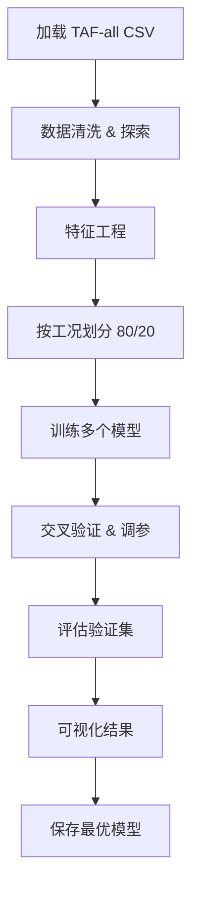

# 机器学习预测 TAF 地形放大系数 — 实施方案

## 1. 问题定义

**目标**: 构建代理模型 (Surrogate Model)，基于地形几何参数和观测位置，预测水平地形放大系数 (TAF_h)，从而替代耗时的 Abaqus 有限元模拟。

### 输入特征 (Features)
| 特征 | 含义 | 取值范围 |
|------|------|----------|
| `h` | 边坡高度 (m) | 10, 50, 100, 200, 400 |
| `i` | 坡面角度 (°) | 15, 30, 45, 60, 75 |
| `angle` | 地震波入射角 (°) | 0, 5, 10, 15, 20, 25, 30 |
| `x/h` | 归一化水平距离 | 0.0 ~ 8.0 (步长 0.05, 共 162 个点) |

### 输出目标 (Target)
| 目标 | 含义 | 典型范围 |
|------|------|----------|
| `TAF_h` | 水平地形放大系数 | ≈ 0.7 ~ 2.0 |

### 数据规模
- 工况组合: 5 × 5 × 7 = **175 组**
- 每组观测点: **162 个** (x/h = 0.0 ~ 8.0)
- 地震波类型: 3 种 (El_Centro, Loma_Prieta, Northridge)
- 总数据量: 175 × 162 = **28,350 行** (每种地震波)

## 2. 数据来源

优先使用已汇总的文件:
```
E:\Abaqus\fuke-ALL\1-TAF_grouped\TAF-El_Centro-all.csv
```
格式: `h, i, angle, x/h, TAF_h, folder, csv_path`

> [!TIP]
> 先使用 **El_Centro** 一种地震波构建模型，验证有效后再扩展到多地震波融合。

## 3. 特征工程

### 基础特征 (直接使用)
- `h`, `i`, `angle`, `x/h`

### 衍生特征 (增强模型表达能力)
- `log_h` = log10(h) — 对数尺度的高度
- `i_rad` = i × π / 180 — 角度转弧度
- `angle_rad` = angle × π / 180
- `tan_i` = tan(i_rad) — 坡面的切线值
- `h_ratio` = h / 400 — 归一化高度
- `slope_ratio` = i / 75 — 归一化坡角

### 交互特征
- `h × tan_i` — 高度与坡度的交互
- `angle × (x/h)` — 入射角与位置的交互

## 4. 模型选择

### 方案 A: 梯度提升树 (推荐首选)
- **XGBoost** 或 **LightGBM**
- 优势: 对表格数据效果优秀，自带特征重要性，训练快速
- 适合本项目: 特征维度低 (4~10), 数据量适中

### 方案 B: 随机森林
- 作为基线对比模型
- 优势: 不容易过拟合，无需过多调参

### 方案 C: 神经网络 (MLP)
- 多层全连接网络
- 适合更复杂的非线性映射
- 需要更多调参

### 方案 D: 多模型集成
- 最终可组合多个模型进行 Stacking 或 Blending

## 5. 训练/验证划分策略

> [!IMPORTANT]
> 划分方式对模型泛化能力至关重要

### 策略一: 随机划分 (简单验证)
- 按行随机 80/20 划分
- 适合: 验证模型在已见工况的插值能力

### 策略二: 按工况划分 (推荐 ✅)
- 按 `(h, i, angle)` 组合划分，整个工况要么全在训练集，要么全在验证集
- 175 个工况 → 140 训练 + 35 验证
- 适合: 验证模型对**未见过的参数组合**的预测能力 (真正的泛化)

### 策略三: 留一法交叉验证
- 留出一个 `h` 值或 `angle` 值的所有工况作验证
- 最严格，验证模型的**外推能力**

## 6. 评估指标

| 指标 | 公式 | 用途 |
|------|------|------|
| R² | 决定系数 | 整体拟合优度 |
| MAE | 平均绝对误差 | 平均偏差 |
| RMSE | 均方根误差 | 对大误差敏感 |
| Max Error | 最大绝对误差 | 最坏情况 |
| MAPE | 平均绝对百分比误差 | 相对误差 |

## 7. 可视化输出

1. **预测 vs 真实值散点图** (Parity plot)
2. **残差分布直方图**
3. **特征重要性柱状图**
4. **不同工况下的 TAF 曲线对比** (预测 vs FEM)
5. **误差随各参数变化的趋势图**

## 8. 实施步骤



## 9. 需要你确认的问题

1. **地震波选择**: 先用 El_Centro 单独建模，还是直接合并三种地震波？
2. **划分策略**: 你更倾向于哪种训练/验证划分方式？
3. **模型偏好**: 优先使用哪种模型？(推荐先用 XGBoost)
4. **是否已安装**: `scikit-learn`, `xgboost`, `lightgbm` 等库？
