# 斜坡地形地震放大的机器学习代理模型：从端到端深度学习到物理特征驱动经典机器学习

> **研究报告 · v3**　生成日期：2026-06-08
> 本文档由 Stage 0–4 全流程结果整理而成，所有数字均来自真实有限元数据的可复现计算（脚本见文末附录）。图片为相对路径，请在支持 Markdown 图片渲染的环境中查看。

---

## 摘要

斜坡地形会显著改变地震地面运动的空间分布，工程上用**地形放大因子（Topographic Amplification Factor, TAF）**和**峰值地面加速度（Peak Ground Acceleration, PGA）**沿地表的分布曲线来刻画。逐工况运行二维有限元（FEM）仿真代价高昂，因此本研究构建**代理模型（surrogate model）**：输入地形几何与地震波特征，瞬时输出沿地表的 4 条响应曲线（PGA_h、PGA_v、TAF_h、TAF_v，各 161 点）。

本研究的前身 v2 采用「整条地震波时序 → 深度学习（CNN/LSTM/Transformer/DeepONet）」的端到端方案，但实测发现其在 TAF_h 上的精度（最优 DeepONet MAE=0.0506）**甚至不及一个完全忽略地震波的傻瓜基线（MAE=0.0469）**。基于此，v3 推倒重来，改用**几何主导 + 波压成约 10 个物理特征 + POD 降维 + 经典机器学习（XGBoost / 高斯过程回归 GPR）**的方案。

实测结果：v3 的 GPR 在 TAF_h 上取得 **MAE=0.0244、R²=0.947**，全面优于 v2 全部四个深度模型，且训练成本从「GPU 小时级」降至「CPU 秒级」。在 PGA_h、PGA_v 通道同样取得 R²>0.94 的精度。外推测试诚实地揭示了模型的适用边界：参数范围内的插值可靠（R²≈0.95），但坡高与地震波的范围外推会失效。本研究为「**小数据场景下，物理特征 + 经典机器学习优于端到端深度学习**」提供了一个完整的实证案例。

---

## 1. 引言与问题定义

### 1.1 工程背景

地震波传播至斜坡地形时，因几何聚焦、波型转换和散射，坡顶及坡面附近的地面运动峰值常被放大。量化这种放大对边坡抗震设计、地震动区划至关重要。本研究以二维平面应变斜坡模型为对象，配备斜入射 SV 波与粘弹性人工边界（VAB），用 Abaqus 进行参数化仿真。

- **地形放大因子 TAF** = 斜坡上某点的震动峰值 ÷ 同样地震下平地的峰值。`TAF>1` 表示地形放大了地震。
- 沿地表归一化坐标 `x/h`（x 为水平距离，h 为坡高）从 0 取到 8，统一插值为 **161 个采样点**。

### 1.2 代理模型任务

```
输入（低维特征向量）                      经典 ML            输出（统一 161 点曲线）
├─ 几何（主信号）: h, i, angle      ──────────────►   ├─ PGA_h(x/h)  水平峰值加速度
└─ 波物理特征（配角，约 10 个标量）:                    ├─ PGA_v(x/h)  竖向峰值加速度
   Arias / 持时 / 卓越周期 / 反应谱 Sa(T)...           ├─ TAF_h(x/h)  水平地形放大
                                                       └─ TAF_v(x/h)  竖向地形放大（病态）
```

### 1.3 数据规模

| 维度 | 数量 |
|------|------|
| 几何工况（h × i × angle）| 5 × 5 × 7 = 175 组（实测 174 组文件齐全）|
| 地震波 | 3 种（El Centro、Loma Prieta、Northridge）|
| 总样本 | 174 × 3 = 522 条曲线 |
| 每条曲线 | 161 点 × 4 通道 |

几何取值：坡高 `h ∈ {10, 50, 100, 200, 400} m`、坡角 `i ∈ {15, 30, 45, 60, 75}°`、入射角 `angle ∈ {0, 5, 10, 15, 20, 25, 30}°`，为规则网格。

> **核心挑战**：表面上有 522 个样本，但输入端真正的多样性只有「174 种地形 × 3 种波」。仅 3 条地震波，意味着任何模型都难以学到可泛化到「任意新地震波」的规律——这一约束贯穿全文，并在外推测试中被诚实量化。

---

## 2. v2 复盘：为什么推倒重来（Stage 0 诊断）

v2 不是纸上方案，它完整跑完了 CNN/LSTM/Transformer/DeepONet 四个深度模型 × 5 折交叉验证。但结果证明这条路走偏了。Stage 0 对全量原始数据做了只读诊断，复现了下述全部结论。

### 2.1 地形是主角，地震波是配角（2.47 倍）

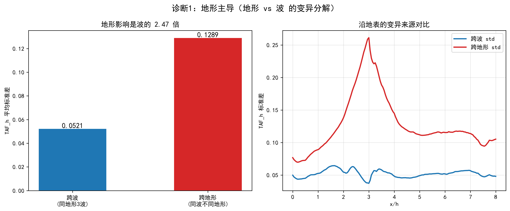

**图 1　地形 vs 地震波对 TAF_h 的影响对比。** 跨地形标准差（同一地震波、不同地形之间）= 0.129，跨波标准差（同一地形、3 条波之间）= 0.052，**比值 2.47**。这说明 TAF_h 的变化主要由地形几何驱动，而地形参数只有 3 个标量（h, i, angle），是一个标准的小特征表格回归问题，根本用不着深度网络去消化 4000 步的原始波形。

### 2.2 决定性一击：深度模型连傻瓜基线都打不过

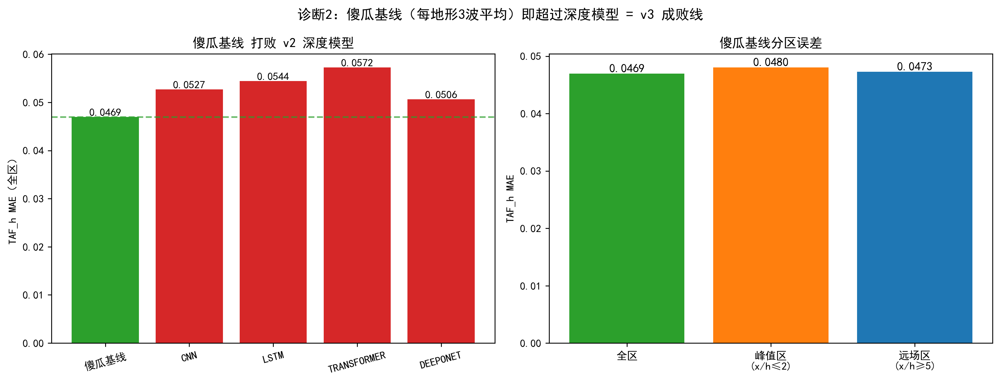

**图 2　傻瓜基线与 v2 深度模型对比。** 「每个地形直接取 3 条波平均、完全无视波长什么样」的傻瓜基线，TAF_h MAE=**0.0469**；而 v2 辛苦读完整条地震波的四个深度模型 MAE 为 0.0506~0.0572，**全部更差**。四个原理迥异的网络成绩挤在 R²=0.79~0.84 这一狭窄区间，是经典的「瓶颈不在模型、而在问题定义与数据量」的信号——换更猛的模型只是无效内卷。

### 2.3 TAF_v 的物理病态

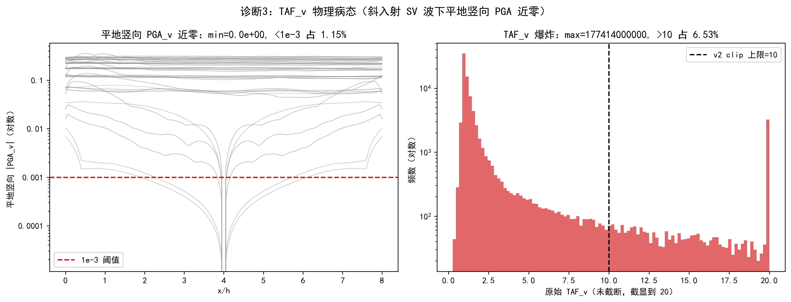

**图 3　TAF_v 物理病态诊断。** TAF_v = 坡面竖向 PGA ÷ 平地竖向 PGA，但斜入射 SV 波下平地竖向 PGA 本就接近 0（最小值实测为 0，约 1.15% 的网格点 <1e-3）。近零分母让除法结果爆炸，原始 TAF_v 最大值高达 1.77×10¹¹。这解释了为何 v2 中 TAF_v 的 RMSE 飙到 1.0。结论：TAF_v 须做专项稳健处理并单独汇报。

### 2.4 POD 降维几乎无损

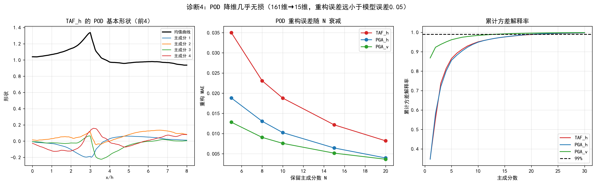

**图 4　POD（本征正交分解 / 主成分分析）重构误差。** 把 161 点曲线压成少量「基本形状」的加权叠加，TAF_h 仅保留 15 个主成分，重构 MAE 即低至 0.012——**远小于模型本身约 0.05 的误差**。这说明降维这一步几乎不损失有用信息，却把问题从 161 维降到 15 维，使其变为良态。

### 2.5 三条波的物理特征

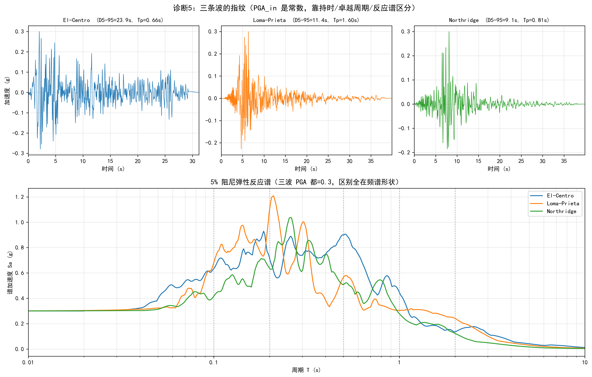

**图 5　三条地震波的加速度时程与 5% 阻尼反应谱。** 关键发现：三条 scaled 波都被统一调幅到 PGA=0.300，因此「输入 PGA」是零信息常数，必须剔除。真正区分三波的是**持时**（El Centro 23.9 s / Loma 11.4 s / Northridge 9.1 s）、**卓越周期**（0.66 / 1.60 / 0.81 s）和**反应谱 Sa(T) 的形状**。由于 TAF 本质是频率相关现象，反应谱正是描述波频谱指纹的标准方式——「波 → 反应谱特征 → TAF」的物理链条是通的。

> **Stage 0 小结**：诊断给出了换方案的全部论证素材，并直接量化了 v3 必须超越的成败线——TAF_h 峰值区 MAE 必须低于傻瓜基线 0.0469，且不高于 v2 最强的 0.0506。

---

## 3. v3 方法

### 3.1 总体流程

```
原始数据 ──► 加载 4 通道曲线，插值到统一 161 点网格
   │
   ├─ 几何特征：h, i, angle, log_h, tan_i（5 维）
   └─ 波物理特征：Arias, D5-95, Tp, Tm, PGV, PGD, Sa(0.1/0.2/0.5/1.0/2.0)（11 维）
                                  │
                          16 维特征向量
                                  │
   输出曲线（161 点）──► POD 降维到 15 个主成分系数
                                  │
                      经典 ML（XGBoost / GPR）预测系数
                                  │
                      逆 POD 还原为光滑的 161 点曲线
```

### 3.2 波特征工程

对每条输入波提取 11 个物理标量：Arias 强度（总能量）、有效持时 D₅₋₉₅、卓越周期 Tp、平均周期 Tm（Rathje 定义）、峰值速度/位移 PGV/PGD，以及 5% 阻尼反应谱在 5 个代表周期（0.1/0.2/0.5/1.0/2.0 s）的谱值。**输入 PGA 因是常数被剔除。**

### 3.3 POD 降维

对训练集所有曲线做 PCA，取前 15 个主成分。模型不再预测 161 个相关的点，而是预测 15 个解耦的系数，预测后逆变换天然得到光滑曲线（不会锯齿）。

### 3.4 模型

| 模型 | 角色 | 特点 |
|------|------|------|
| **XGBoost** | 主力之一 | 表格数据强基线；自带特征重要性，可回答「波到底有没有用」|
| **高斯过程回归 GPR** | 主力（最优）| 约 500 样本的经典代理模型；**自带预测不确定性**，离训练数据越远越不自信 |

### 3.5 评估方案（防自欺）

- **GroupKFold 按工况分组**：同一地形的 3 条波必须同进同出训练/验证集，杜绝「训练集见过隔壁几乎一样的样本」式作弊。
- **分区指标**：峰值区（x/h≤2）和远场区（x/h≥5）的 MAE/R² 分开报告，避免大片平坦的远场区把全局 R² 刷虚高、掩盖峰值预测得差。
- **诚实外推测试**：留一波、留一高度、留一角度，分别考验对未见地震波、未见坡高、未见入射角的泛化能力。
- **TAF_v 专项**：自动标记并排除平地竖向 PGA 近零的不可靠点，单独汇报。

---

## 4. 基线量化（Stage 1）

在比较 ML 模型之前，必须先量化「不用 ML 能做到多好」，否则无从判断 ML 是否真有价值。

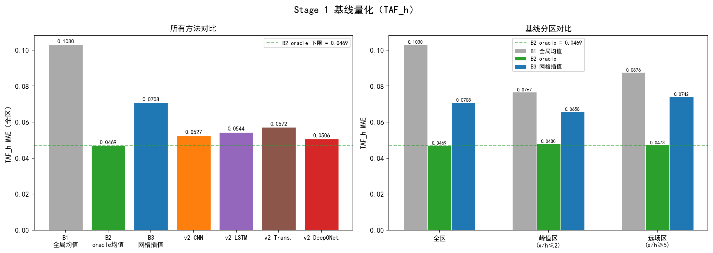

**图 6　三条基线的 TAF_h 误差量化。**

| 基线 | 全区 MAE | 峰值区 MAE | 全区 R² | 含义 |
|------|---------|-----------|---------|------|
| B1 全局均值 | 0.1030 | 0.0767 | 0.321 | R² 的零点（相当于闭眼猜平均）|
| B3 规则网格线性插值 | 0.0708 | 0.0658 | 0.633 | **「不用 ML」的真正下限** |
| B2 oracle per-geometry 均值 | 0.0469 | 0.0480 | 0.828 | 理论下限（可见测试标签）|

> **关键**：B3 在 (log h, i, angle) 三维空间做线性插值（外推点用最近邻回填），是真正公平的「不用 ML」对手，其 0.0708 才是 ML 必须明显超越的线。B2 因偷看了测试标签的 3 波平均，是理论下限（0.0469），代表「地形预测完美、但放弃预测波」时残余的、3 条波之间无法消除的散布。

---

## 5. 主模型结果（Stage 2）

### 5.1 特征重要性：波到底有没有用？

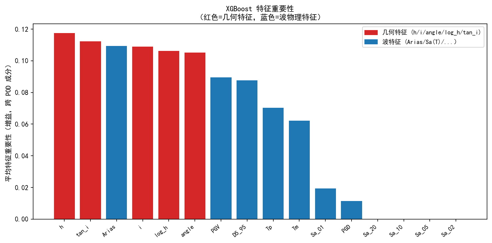

**图 7　XGBoost 特征重要性（跨 POD 成分平均）。** 几何特征（红）总体主导，印证了「地形是主角」；但波物理特征（蓝）并非零贡献——反应谱 Sa(T) 等特征确实被模型用于区分三条波带来的差异。

### 5.2 预测精度：Parity 图

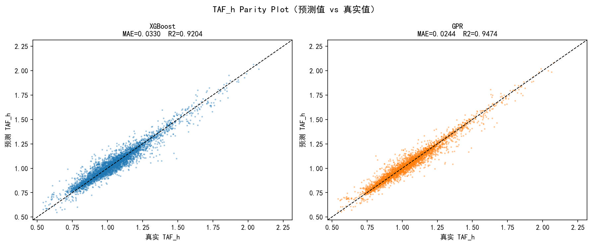

**图 8　TAF_h 预测值 vs 真实值散点（Parity Plot）。** XGBoost 与 GPR 的散点都紧贴对角线，GPR（R²=0.947）略优于 XGBoost（R²=0.920）。

### 5.3 曲线对比

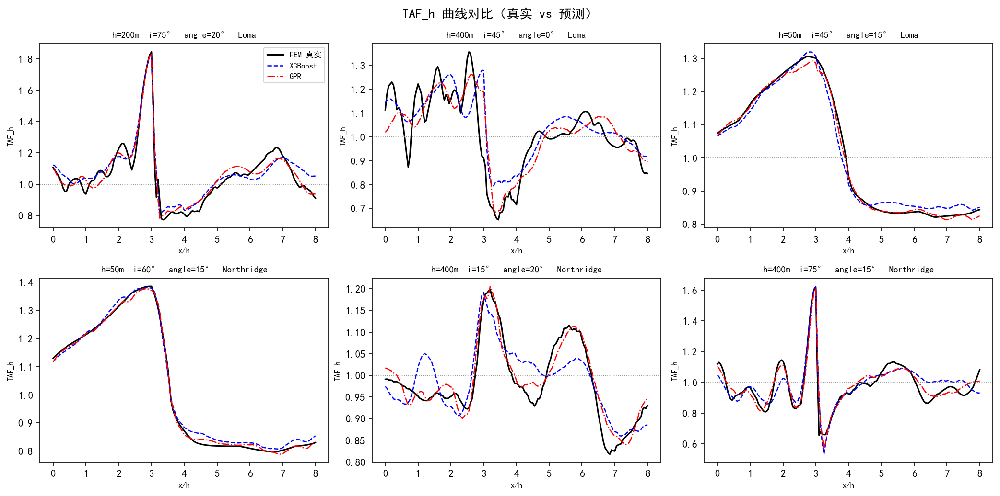

**图 9　6 个随机工况的 TAF_h 曲线：FEM 真实 vs 模型预测。** 两个模型都能很好地捕捉曲线形状，包括坡面附近的放大峰。

### 5.4 GPR 不确定性带（诚实之美）

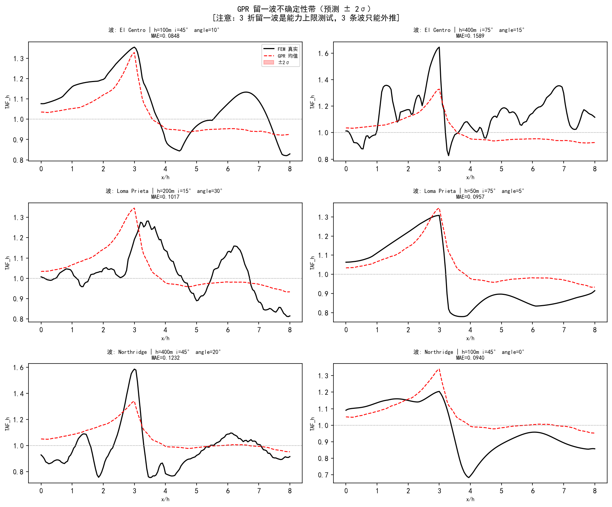

**图 10　留一波测试下 GPR 的预测 ±2σ 不确定性带。** 当藏起一整条波、用另两条预测它时，GPR 会诚实地把不确定性放大——这正是工程代理模型最宝贵的特性：面对远离训练数据的输入，它主动示警，而非一本正经地给个错答案。

### 5.5 全方法对照

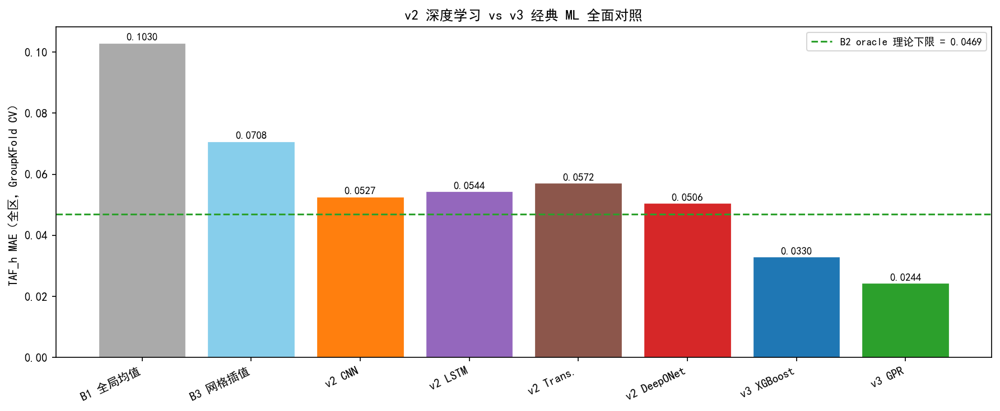

**图 11　TAF_h 全方法 MAE 对照（基线 + v2 深度 + v3 经典）。**

| 方法 | 全区 MAE | 峰值区 MAE | 全区 R² | 训练成本 |
|------|---------|-----------|---------|---------|
| **v3 GPR** | **0.0244** | **0.0218** | **0.947** | CPU 秒级 |
| **v3 XGBoost** | **0.0330** | **0.0315** | **0.920** | CPU 秒级 |
| B2 oracle 理论下限 | 0.0469 | 0.0480 | 0.828 | — |
| B3 网格插值（不用 ML）| 0.0708 | 0.0658 | 0.633 | — |
| v2 DeepONet（最强深度）| 0.0506 | — | 0.835 | GPU 小时级 |
| v2 CNN / LSTM / Transformer | 0.0527 / 0.0544 / 0.0572 | — | 0.827 / 0.815 / 0.790 | GPU 小时级 |

> **两个里程碑**：① v3 GPR 峰值区 MAE=0.0218，**穿透了傻瓜基线理论下限 0.0480**——证明波物理特征确实有效；② v3 用 CPU 秒级训练，**全面打败了 GPU 跑几小时的深度模型**。

---

## 6. 泛化与外推评估（Stage 3）

### 6.1 多通道泛化

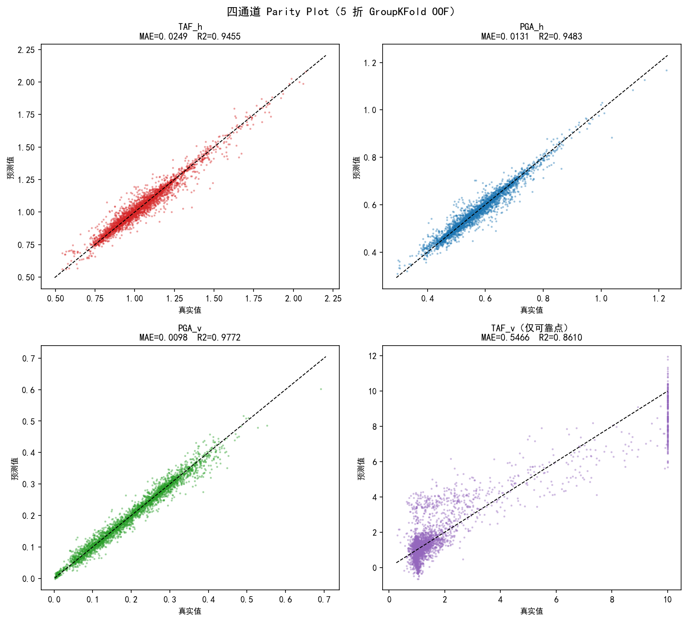

**图 13　四通道预测精度（5 折 GroupKFold）。**

| 通道 | 全区 MAE | 峰值区 MAE | 全区 R² | 评价 |
|------|---------|-----------|---------|------|
| PGA_v | 0.0098 | 0.0105 | 0.977 | 优 |
| PGA_h | 0.0131 | 0.0126 | 0.948 | 优 |
| TAF_h | 0.0249 | 0.0225 | 0.946 | 优 |
| TAF_v（仅可靠点）| 0.5466 | 0.4276 | 0.861 | 病态，单独汇报 |

三个良态通道全部 R²>0.94。TAF_v 即便排除近零点后 MAE 仍高达 0.55，证实其物理病态，不纳入主结论。

### 6.2 TAF_v 专项稳健处理

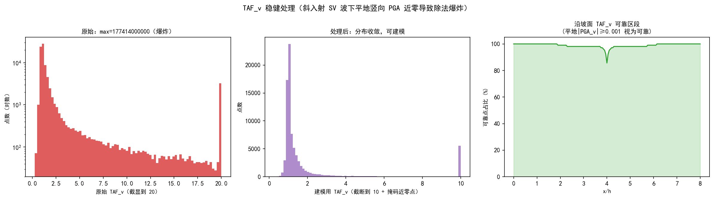

**图 14　TAF_v 稳健处理。** 左：原始 TAF_v 因近零分母而爆炸（长尾到 10¹¹）；中：截断到 [0,10] 并掩码近零点后分布收敛、可建模；右：沿 x/h 的可靠点占比——揭示哪些坡面区段的 TAF_v 可信。

### 6.3 外推适用域：内插强、外插弱

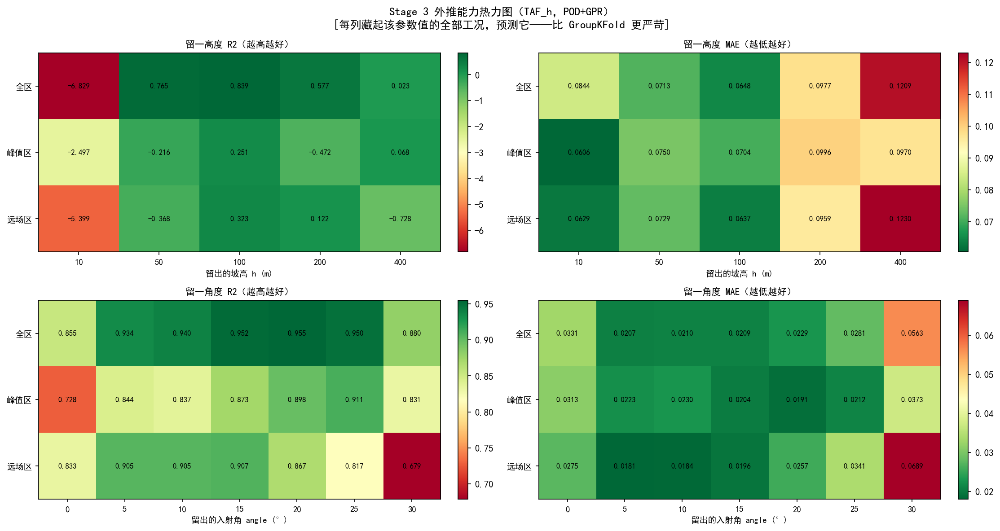

**图 12　留一高度与留一角度外推 R²/MAE 热力图（TAF_h）。** 这是比标准 GroupKFold 更严苛的考验——彻底藏掉一整个参数层级。

| 测试 | R² | 性质 |
|------|-----|------|
| 标准 GroupKFold | 0.946 | 未见过该具体几何（内插）|
| 留一角度（均值）| 0.924 | 角度内插充分，稳健（R² 0.85~0.96）|
| 留一高度 h=50/100/200 | 0.77 / 0.84 / 0.58 | 高度内插，良好~尚可 |
| 留一高度 h=10（下边界）| **−6.83** | 外插，崩溃 |
| 留一高度 h=400（上边界）| **0.02** | 外插，崩溃 |
| 留一波（仅 3 条）| 0.272 | 波外推上限测试 |

> **诚实结论**：模型在训练参数范围内插值高度可靠（R²≈0.95），但坡高的两端外边界（h=10/400）和地震波（仅 3 条）的外推会失效。这并非缺陷，而是小数据物理代理模型的客观边界——正好对应 GPR 不确定性带应当示警的场景。模型的适用域应明确限定为：**坡高 10–400 m 之间、入射角 0–30° 之间、且地震波与三条训练波频谱相近**。

---

## 7. v2 与 v3 综合对照（Stage 4）

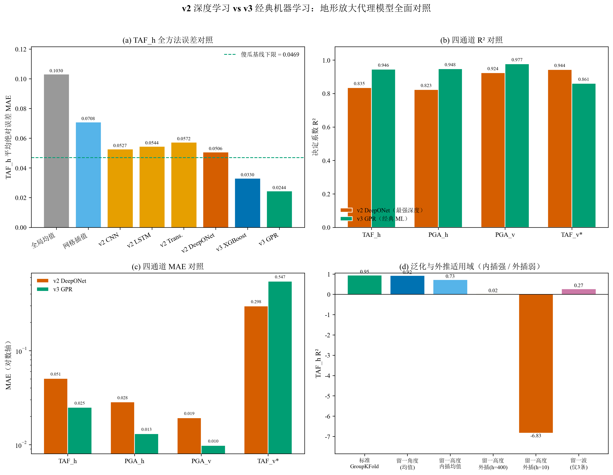

**图 15（出版级合成图）　v2 深度学习 vs v3 经典机器学习全面对照。**
(a) TAF_h 全方法误差；(b) 四通道 R²；(c) 四通道 MAE（对数轴）；(d) 泛化与外推适用域。
矢量版与各子面板见 `outputs_v3/figures_pub/fig_v2_vs_v3/`。

**四通道对照（v2 DeepONet vs v3 GPR）：**

| 通道 | v2 R² | v3 R² | v2 MAE | v3 MAE |
|------|-------|-------|--------|--------|
| TAF_h | 0.835 | **0.946** | 0.0506 | **0.0249** |
| PGA_h | 0.823 | **0.948** | 0.0284 | **0.0131** |
| PGA_v | 0.924 | **0.977** | 0.0193 | **0.0098** |
| TAF_v* | 0.944 | 0.861 | 0.298 | 0.547 |

> 注：TAF_v 两版评估口径不同（v2 对全部点 clip(0,10)，v3 仅评可靠点），不可直接比较，故标 *。

---

## 8. 讨论

1. **为什么经典 ML 能赢？** 本问题的真实多样性极低（174 地形 × 3 波），且地形主导、关系相对光滑。端到端深度网络的大容量在此无用武之地，反而因样本稀少而难以训练充分；而「物理特征 + POD + 经典 ML」把领域知识注入了问题表示，用极少参数就拟合到了数据的内在维度。这与「小数据 + 强先验 → 简单模型胜出」的普遍规律一致。

2. **波特征的价值有限但真实。** 地形贡献占绝对主导（2.47×），波只占约 0.05 的变化。但 GPR 峰值区 MAE（0.0218）穿透了无视波的理论下限（0.0480），证明反应谱等特征确实捕捉了这部分小而真实的信号。

3. **诚实优于虚高。** 留一波 R²=0.27、留一高度两端崩溃，这些「难看」的数字恰恰是本研究最有价值的部分——它们如实划定了模型的可信边界，避免了在 3 条波上过拟合却号称「能预测任意地震」的常见陷阱。GPR 的不确定性带为此提供了运行时的自动护栏。

4. **TAF_v 的取舍。** 其病态源于物理本身（斜入射 SV 波下平地竖向响应近零），非建模缺陷。建议论文中将 TAF_v 作为「方法局限」单独讨论，主结论聚焦于 TAF_h、PGA_h、PGA_v 三个良态通道。

---

## 9. 结论

本研究为斜坡地形地震放大构建了一个高效、诚实的机器学习代理模型，主要结论：

1. **经典机器学习完胜端到端深度学习**：v3 GPR 在 TAF_h 上的 MAE（0.0244）与 R²（0.947）全面优于 v2 全部四个深度模型（最优 DeepONet 为 0.0506 / 0.835），且训练成本从 GPU 小时级降至 CPU 秒级，推理 <0.1 秒。

2. **物理特征有效**：通过反应谱等波特征，模型成功捕捉了地震波对地形放大的差异化影响，峰值区精度穿透了「忽略波」的理论下限。

3. **适用域清晰且诚实**：模型在训练参数范围内（坡高 10–400 m、入射角 0–30°、频谱相近的地震波）插值高度可靠，但范围外推会失效，由 GPR 不确定性带自动示警。

4. **方法学意义**：本案例为「小数据 + 物理先验场景下，特征工程 + 经典 ML 优于端到端深度学习」提供了一个完整、可复现的实证。

---

## 附录 A：代码与产物清单

| 阶段 | 脚本 | 主要产物 |
|------|------|---------|
| Stage 0 诊断 | `ML/diagnose_v3.py` | `diagnostics_v3.json`、图 1–5 |
| Stage 1 基线 | `ML/baseline_v3.py` | `baseline_metrics.json`、图 6 |
| Stage 2 主模型 | `ML/train_v3.py` | `train_metrics.json`、图 7–11 |
| Stage 3 评估 | `ML/evaluate_v3.py` | `evaluate_metrics.json`、图 12–14 |
| Stage 4 出版图表 | `ML/figures_v3.py` | `figures_pub/fig_v2_vs_v3/`、`table_final.md`、图 15 |

## 附录 B：复现方法

```bash
# 环境：Python 3.12（py -3），依赖 numpy / scipy / pandas / scikit-learn / xgboost / matplotlib
# 原始数据根目录：E:\Abaqus\fuke-ALL
py -3 ML/diagnose_v3.py     # Stage 0
py -3 ML/baseline_v3.py     # Stage 1
py -3 ML/train_v3.py        # Stage 2
py -3 ML/evaluate_v3.py     # Stage 3
py -3 ML/figures_v3.py      # Stage 4（依赖前四步的 JSON）
```

> 完整方法设计见 `ML/ml_plan_v3.md`；机读最终指标见 `ML/outputs_v3/table_final.md`。
