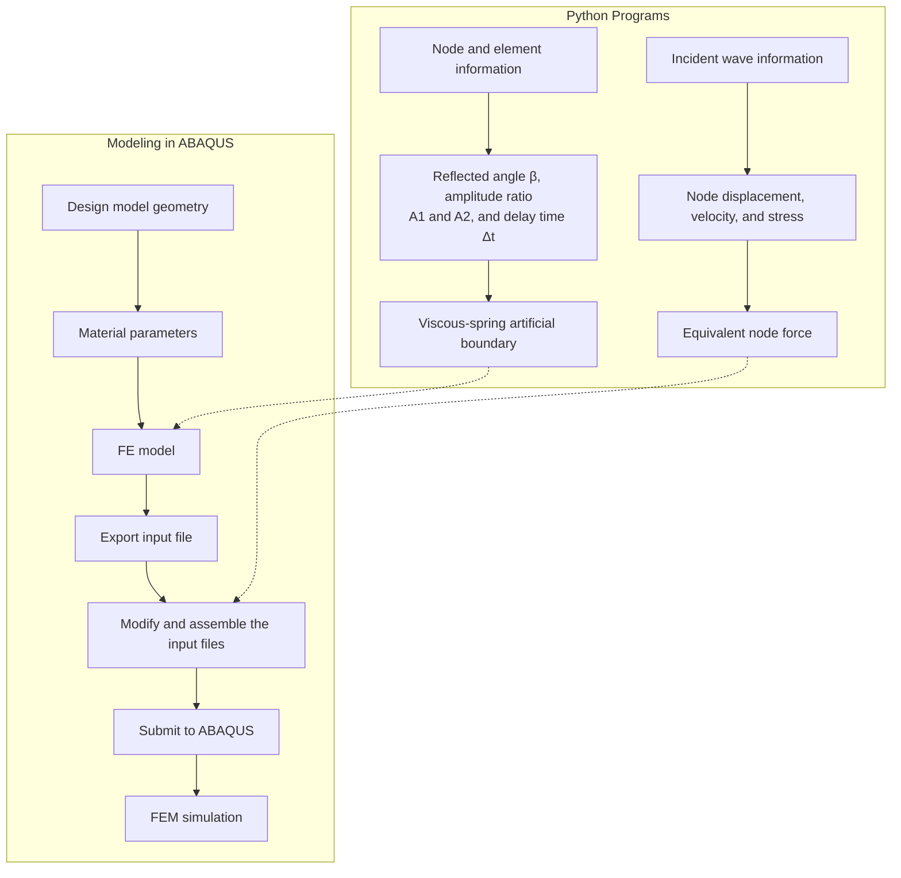

# Numerical evaluation of ground motion amplification of rock slopes under obliquely incident seismic waves

Hui Shen a,b , Yaqun Liu a,b,\* , Haibo Li a,b , Bo Liu a,b , Xiang Xia a,b , Chong Yu a,b

a State Key Laboratory of Geomechanics and Geotechnical Engineering, Institute of Rock and Soil Mechanics, Chinese Academy of Sciences, Wuhan, Hubei, 430071, China

b University of Chinese Academy of Sciences, Beijing, 100049, China

## A R T I C L E I N F O

Keywords:

Rock slope

Dynamic response

Wave propagation

Seismic amplification

Oblique incidence

Spectral response

## A B S T R A C T

The incident angle of the seismic waves has a significant influence on the seismic response of rock slopes. However, the details of the interactions between oblique seismic waves and slopes are not well understood. The objective of this study is to quantitatively evaluate the amplification of the peak ground acceleration (PGA) and spectral acceleration (SA) of rock slopes under obliquely incident seismic waves. The incident wave field was implemented in the commercial software ABAQUS based on the equivalent nodal force method and viscousspring artificial boundary theory. Two test examples simulating the propagation of oblique SV waves were used to verify the validity and accuracy of the proposed method. An extensive parametric study consisting of 375 simulation cases was performed by considering the slope height, slope angle, and incident angle of the seismic waves. The results reveal that for different incident waves, the maximum amplification factors of PGA and SA under oblique incidence of seismic waves are generally 1.4–2.2 and 1.7–1.9 times those under vertical incidence, respectively. Statistical analysis of the amplification factors indicated that the amplification effects were not positively correlated with slope height, but generally increased with increasing slope angle and incident angle of the seismic waves. In contrast, the spectral periods corresponding to the maximum SA amplification factors showed a strong positive correlation with the slope height but were less sensitive to the slope angle and incident angle of the seismic waves. The findings emphasized the significance of slope geometry and incident direction of seismic waves in ground motion amplification, which may provide quantitative insights and useful references for seismic design in slope engineering.

## 1. Introduction

Interactions among seismic waves, slope topography, and materials may produce complex local ground motions [1]. One significant site-specific effect is topographic amplification, in which the interaction of ground motion with topographic irregularities leads to increased ground acceleration [2–4]. This phenomenon can potentially increase the risk of landslides or be responsible for slope failures, as reported in post-earthquake surveys [1,5,6], making it an important factor to consider in slope engineering. In addition, the amplification of seismic waves by surface topography has often been observed as one of the main causes of intensive damage to buildings and retaining structures on top of ridges and slopes [7], indicating that topographic amplification is also important for the seismic design of structures. Therefore, understanding and quantifying the ground motion amplification of slopes has been the focus of geotechnical and earthquake engineering for decades.

Investigations of seismic amplification in ridge or slope topographies fall into two general categories: observations from earthquakes and numerical simulations. In the first category, examples include observations in the 1971 San Fernando earthquake [8], the 1989 Loma Prieta earthquake [9], the 1994 Northridge earthquake [10], the 1999 Chi-Chi earthquake [1] and Athens earthquake [3], and the 2008 Wunchuan earthquake [11]. The observational evidence indicated that seismic motion was significantly amplified in convex topographies, such as ridges or slopes. Although direct field observations remain challenging due to the uncertainty of seismic events and sparse field data, numerical methods have been well developed and offer new insights into earthquake-slope interactions [12]. Numerous numerical simulations have been conducted to investigate the amplification of ground motion on ridges and slopes. These numerical methods can be grouped into four types: 1) finite difference method-based approaches (FDM), which are simple to apply but have difficulties in modeling the complex topography [13–18]; 2) finite element-based methods (FEM) which are commonly used in investigating amplification of seismic ground motions [3,19–21]; 3) discrete element-based methods (DEM), which can explicitly include discontinuities in numerical models when performing dynamic analysis [12,22]; 4) spectral element-based methods (SEM), which have the advantage of high accuracy and parallel computation in modeling seismic wave propagation [7,23–26]. A summary of these numerical studies on the ground motion amplification of hillslopes is presented in Table 1. Based on the information presented in Table 1, the factors that influence the amplification phenomenon can be separated into three groups: 1) geometrical conditions (i.e., topography), 2) stratigraphic conditions (e.g., subsurface soil conditions), and 3) geological conditions (e.g., geological discontinuities). Although amplification phenomena depend on many factors, most studies focus on the effects of coupling between topography and stratigraphy on ground motion amplification.

Table 1 Summary of typical numerical studies on ground motion amplification for hillslopes.

<table><tr><td>Numerical method</td><td>Model dimension</td><td>Model variables</td><td>Input wave and direction</td><td>Reference</td></tr><tr><td rowspan="6">FDM</td><td>2D</td><td>slope height; slope angle; soil damping ratio; incident wave frequency and duration</td><td>modified Gabor wavelet; vertical</td><td>Bouckovalas and Papadimitriou [13]</td></tr><tr><td>2D</td><td>slope surface topography; subsurface soils; incident wave frequency</td><td>Ricker wavelet; vertical</td><td>Bourdeau and Havenith [14]</td></tr><tr><td>2D</td><td>slope height; slope angle; incident wave frequency</td><td>Gabor wavelet; vertical</td><td>Zhang et al. [18]</td></tr><tr><td>2D</td><td>slope angle; incident angle and amplitude of seismic waves</td><td>El Centro earthquake wave; inclined</td><td>Fan et al. [16]</td></tr><tr><td>3D</td><td>subsurface soils</td><td>Mexico City earthquake wave; vertical</td><td>Mayoral et al. [17]</td></tr><tr><td>2D</td><td>shear-wave velocity and thickness of the subsurface soils</td><td>six realistic earthquake records; vertical</td><td>Ding et al. [15]</td></tr><tr><td rowspan="4">FEM</td><td>2D</td><td>soil stratigraphy; material heterogeneity</td><td>Ricker wavelet; vertical</td><td>Assimaki et al. [3]</td></tr><tr><td>2D</td><td>slope angle; incident wave frequency</td><td>Synthetic accelerogram; vertical</td><td>Di Fiore [19]</td></tr><tr><td>2D</td><td>slope angle; bedrock depths; incident wave frequency</td><td>modified Gabor wavelet; vertical</td><td>Tripe et al. [21]</td></tr><tr><td>2D</td><td>slope angle; surficial layer thickness</td><td>Boumerdes earthquake wave; vertical</td><td>Messaoudi et al. [20]</td></tr><tr><td rowspan="2">DEM</td><td>2D</td><td>slope height and topography; material contrasts; discontinuities</td><td>Ricker wavelet; vertical</td><td>Gischig et al. [12]</td></tr><tr><td>2D</td><td>slope surface topography; material contrasts; discontinuities</td><td>Ricker wavelet; vertical</td><td>Wolter et al. [22]</td></tr><tr><td rowspan="5">SEM</td><td>3D</td><td>topography and geology conditions</td><td>point sources</td><td>Lee et al. [25]</td></tr><tr><td>3D</td><td>subsurface soil depth; incident wave frequency</td><td>Ricker wavelet; vertical</td><td>Wang et al. [7]</td></tr><tr><td>3D</td><td>topography and underground geological settings</td><td>seven realistic earthquake records; vertical</td><td>Primofiore et al. [26]</td></tr><tr><td>3D</td><td>soil stratigraphy</td><td>six realistic earthquake records; vertical</td><td>Huang et al. [24]</td></tr><tr><td>3D</td><td>soil nonlinearity</td><td>rupture process</td><td>Chen et al. [23]</td></tr></table>

text_image

Coseismic landslides
Epicenter

Fig. 1. Sketch map of the “back slope effect”, adapted from Xu et al. [31].

text_image

FEM
mesh
Boundary node
K_T
C_T
C_N
K_N

Fig. 2. Illustration of the viscous-spring artificial boundary.

The possible interactions among the seismic inputs, slope topography, and stratigraphic conditions also depend on seismic properties such as amplitude level, frequency composition, and directivity. The vast majority of previous studies (Table 1) have considered the variation in the amplitude and frequency content of seismic excitations when evaluating the amplification effect of slopes; however, the influences of the oblique incidence of seismic waves are less considered (i.e., they assume that the seismic waves propagate vertically). Theoretical studies have demonstrated that the amplification functions associated with topographic features such as ridges and hills become more asymmetric and intense as the angle of the incident waves increases [2,27]. Furthermore, field observations have illustrated the significance of inclined seismic waves in interpreting seismic amplification or evaluating co-seismic landslides. For example, Vahdani and Wikstrom ¨ [28] analyzed the response of the Tarzana strong-motion site during the 1994

text_image

Free surface
Lx
y
α
SV
SV
P
SV
SV
l(x0,y0)
SV
P
SV
Lx
x
Right boundary
Left boundary
Wavefront at t=0
Computational domain
Δt1=y0cos α/cs
Δt2=(2Ly-y0)cos α/cs
Δt3=(Ly-y0)/(cp cos β)+
(Ly-(Ly-y0)tan α tan β)cos α/cs
S1=G/cs sin 2α,S2=-1,S3=λ+2G sin²β/cp
S4=G/cs cos 2α,S5=1,S6=G sin 2β/cp
Δt1=x0sin α/cs
Δt2=(2Ly+x0tan α)cos α/cs
Δt3=Ly/(cp cos β)+
(Ly cos α + x0 sin α - Ly tan β sin α)/cs
S1=G/cs cos 2α,S2=1,S3=G sin 2β/cp,
S4=-G/cs sin 2α,S5=-1,S6=λ+2G cos²β/cp

Fig. 3. The schematic diagram of the SV wave arriving at the truncated boundary. The Δt1, Δt2, and $\Delta t _ { 3 }$ in the formulas denote the time lag of incident SV waves, reflected SV waves, and reflected P waves, respectively. $S _ { 1 }$ to $S _ { 6 }$ are all boundary-dependent variables used to calculate the associated stress at boundary nodes.

flowchart

Fig. 4. Flowchart for implementation of obliquely incident SV waves in ABAQUS.

Northridge earthquake. Their results indicated that the local geology and topography could only partially account for the observed ground motion amplification. The PGA and response spectra at a point near the edge of the ridge were in good agreement with the recorded values when the incident angle of the SV waves was assumed to be 30◦ from the vertical. Alfaro et al. [29] back-analyzed the Lorca rockslide event and related its occurrence to both seismic amplification and the interaction between seismic waves and local topography. Their results indicated that the specific interaction between the topography and obliquely propagating seismic waves was important. Oral et al. [30] performed two-dimensional modeling of the nonlinear site response under oblique incident waves to interpret the amplification pattern observed in the Kathmandu Basin during the 2015 Gorkha earthquake. They found that the spatial distribution of the peak ground motion amplitudes along the basin was highly sensitive not only to soil nonlinearity but also to the wave incidence angle and direction. In addition, Xu et al. [31] analyzed the spatial distribution of large-scale landslides triggered by the 2008 Wenchuan earthquake, and the results indicated that the density of landslides on slopes whose dip direction was the same as the travel direction of the seismic wave was obviously higher than that on slopes facing the seismic source, which showed a notable “back slope effect”, as illustrated in Fig. 1. Similar effects on the site response have been observed in the 2013 Lushan earthquake [32]. Nevertheless, the influence of the interaction between the slope and obliquely incident seismic waves on the ground-motion amplification of slopes is not well understood. Moreover, few parametric studies have evaluated the possible role of the incident angle of seismic waves in the seismic amplification of slope topography. Therefore, the role of the propagation direction of seismic waves in site response requires further study.

(a)  

text_image

y
A(1000, 1000)
θs = 15°
B(1000, 500)
1000m
x
2000m
(b)

line

| Time (s) | Displacement (m) |
| --- | --- |
| 0 | 0.00 |
| ~0.2 | 0.10 |
| ~0.3 | 0.00 |
| 1.5 | 0.00 |

Fig. 5. (a) The semi-infinite space model for validating the input method, and (b) the displacement time history used for exciting the model.

text_image

t = 0.30 s
Incident
SV-waves
y
x
15°

text_image

t = 0.87 s
15°
Incident
SV-waves
29°
Reflected
P-waves

heatmap

| Feature | Magnitude |
| --- | --- |
| Reflected SV-waves | N/A |
| Reflected P-waves | N/A |

text_image

t = 1.17 s
Reflected
SV-waves
15°
29°
Reflected
P-waves
Element (m)
0.0

Fig. 6. Displacement contours of semi-infinite space under inclined SV waves.

The main purpose of this study was to quantitatively evaluate the ground motion amplification of rock slopes under obliquely incident seismic waves. The numerical study employed the equivalent nodal force method and artificial boundary theory; the seismic input method was implemented using the commercial finite element-based software package ABAQUS. First, the seismic input method for oblique SV waves was verified using two examples. Subsequently, a set of two-dimensional (2D) slope models with various slope heights and angles was established for numerical simulations, and a comprehensive parametric study was conducted by considering the variations in slope geometry and incident angle of seismic waves. Three earthquake records were adopted as the input excitations for each slope model, and at least four incident angles of these waves, including vertical and oblique incidences, were considered. Finally, the amplification of the peak ground acceleration (PGA) and spectral acceleration (SA) along the slope surface were analyzed to obtain a continuous assessment of the amplification effects and to provide qualitative and quantitative insights into the phenomenon. Well aware that earthquake-slope interactions are naturally complex, our conceptual slope geometry and material properties have been kept as simple as possible for three reasons: 1) to focus on topographic effects alone and avoid the complex coupling of stratigraphy and topography amplification, 2) to facilitate the quantitative description of slope topography through simple parameters (e.g., slope heights and angles), and 3) to allow direct comparison of the obtained amplification factors with those suggested in seismic code provisions.

## 2. Methodology outline

## 2.1. Incident wave field implementation

## 2.1.1. Governing equations

According to Liu et al. [33] and Huang et al. [34], seismic waves can be converted into equivalent nodal forces at the boundary nodes of a model. The governing equations for this method are as follows.

The total wave field is decomposed into a free-wave field (denoted by superscript f) and a scattering wave field (denoted by superscript s). The total displacement and stress are expressed as follows:

  
Fig. 7. Horizontal and vertical displacement time histories at observation points A and B.

$$
\boldsymbol {u} = \boldsymbol {u} ^ {s} + \boldsymbol {u} ^ {f} \tag {1a}
$$

$$
\boldsymbol {\sigma} = \boldsymbol {\sigma} ^ {f} + \boldsymbol {\sigma} ^ {s} \tag {1b}
$$

On the artificial boundary, the motion equation can be expressed as,

$$
m \ddot {\boldsymbol {u}} + c \dot {\boldsymbol {u}} + k \boldsymbol {u} = A \sigma \tag {2}
$$

where m is the lumped mass of the boundary node, c and k represent the damping and stiffness coefficients, respectively, and A represents the influence area of all the elements around the node.

The boundary stress corresponding to the scattered-field motion is described as a function of the displacement and velocity fields as

$$
\boldsymbol {\sigma} ^ {s} = - K \boldsymbol {u} ^ {s} - C \dot {\boldsymbol {u}} ^ {s} \tag {3}
$$

where K and C are the coefficients of the viscous-spring artificial boundary introduced in Section 2.1.2.

Substituting Equations (1) and (3) into Equation (2), the motion equation of a node at an artificial boundary can be expressed as:

$$
m \ddot {\boldsymbol {u}} + (c + A C) \dot {\boldsymbol {u}} + (k + A K) \boldsymbol {u} = A (\boldsymbol {\sigma} ^ {f} + K \boldsymbol {u} ^ {f} + C \dot {\boldsymbol {u}} ^ {f}) \tag {4}
$$

The right side of Equation (4) shows the equivalent nodal force F in the artificial boundary nodes induced by the free-field motion, which is given as follows:

$$
\boldsymbol {F} = \left(K \boldsymbol {u} ^ {f} + C \dot {\boldsymbol {u}} ^ {f} + \boldsymbol {\sigma} ^ {f}\right) A \tag {5}
$$

Assuming that the subscript i represents the Cartesian coordinate components and i = 1, 2 corresponds to x, y in the 2D problem, the equivalent nodal force at boundary node l can be given as follows:

$$
F _ {l i} = \big (K _ {l i} u _ {l i} ^ {f} + C _ {l i} \dot {u} _ {l i} ^ {f} + \sigma_ {l i} ^ {f} \big) A _ {l} \tag {6}
$$

## 2.1.2. The viscous-spring artificial boundary

In near-field wave motion analysis, a truncated domain with nonreflecting boundaries is generally introduced such that the reflecting waves can pass through the artificial absorbing boundary towards the far field. The viscous-spring boundary [35] is a typical artificial boundary that is physically equivalent to a series of spring-damper units attached to boundary nodes, as shown in Fig. 2. The elastic spring coefficient K and damping coefficient C are expressed as follows:

$$
K _ {N} = \frac {1}{1 + a} \frac {\lambda + 2 G}{2 r}, C _ {N} = b \rho c _ {p} \tag {7a}
$$

$$
K _ {T} = \frac {1}{1 + a} \frac {G}{2 r}, C _ {T} = b \rho c _ {s} \tag {7b}
$$

where the subscripts N and T denote the normal direction and tangential direction, respectively; λ is the Lam´e’s first parameter; G is the shear modulus; r represents the distance between the wave source and the artificial boundary; and $c _ { p } = \sqrt { ( \lambda + 2 G ) / \rho }$ and $c _ { s } = \sqrt { G / \rho }$ stand for the compression wave velocity and the shear wave velocity in the medium, respectively. a and b are dimensionless coefficients with suggested values of 0.8 and 1.1, respectively [35].

## 2.1.3. Equivalent nodal force on the artificial boundary

The incidence of SH waves has been studied more frequently because it is mathematically simple and does not involve conversion into other wave types. In contrast, SV waves involve mode conversions, which often result in amplification values exceeding those of SH waves [3]. Many studies have also shown that a zone exists in the vicinity of a slope where the incident seismic motion is highly amplified, owing to the combined effect of primary SV waves and diffracted Rayleigh waves [2, 3,13]. In addition, 2D models were used for the numerical simulation in this study, where in-plane shear waves, that is SV waves, were more likely to manifest constructive or deconstructive effects that would control the wave amplitude [36], hence the SV wave was adopted as the incident wave in this study. As shown in Fig. 3, the incident SV wave with angle α decomposed into a reflected SV wave with the same angle α and a reflected P wave with angle β. The reflection angle β is determined by the following equation:

$$
\beta = \arcsin \left(\frac {c _ {p} \sin \alpha}{c _ {s}}\right) \tag {8}
$$

The amplitude ratio between reflected waves and incident waves can be expressed as follows:

$$
A _ {1} = \frac {c _ {s} ^ {2} \sin 2 \alpha \sin 2 \beta - c _ {p} ^ {2} \cos^ {2} 2 \alpha}{c _ {s} ^ {2} \sin 2 \alpha \sin 2 \beta + c _ {p} ^ {2} \cos^ {2} 2 \alpha} \tag {9a}
$$

$$
A _ {2} = \frac {2 c _ {p} c _ {s} \sin 2 \alpha \cos 2 \alpha}{c _ {s} ^ {2} \sin 2 \alpha \sin 2 \beta + c _ {p} ^ {2} \cos^ {2} 2 \alpha} \tag {9b}
$$

where $A _ { 1 }$ represents the amplitude ratio of the reflected SV wave to the incident SV wave and $A _ { 2 }$ represents the amplitude ratio of the reflected P wave to the incident SV wave. Taking the boundary node l $( x _ { 0 } , y _ { 0 } )$ as an example, the displacement is [37]:

$$
\left\{ \begin{array}{c} u _ {l x} ^ {f} (t) = u _ {0} (t - \Delta t _ {1}) \cos \alpha - A _ {1} u _ {0} (t - \Delta t _ {2}) \cos \alpha \\ + A _ {2} u _ {0} (t - \Delta t _ {3}) \sin \beta \\ u _ {l y} ^ {f} (t) = - u _ {0} (t - \Delta t _ {1}) \sin \alpha - A _ {1} u _ {0} (t - \Delta t _ {2}) \sin \alpha \\ - A _ {2} u _ {0} (t - \Delta t _ {3}) \cos \beta \end{array} \right. \tag {10}
$$

where the subscripts x and y represent the coordinate components, and u0(t) indicates the displacement time history of the incident SV waves. Assuming that the height and width of the truncated region are $L _ { y }$ and $L _ { x } ,$ respectively, Δt represents the time delay of the incident waves propagating from the wavefront at t = 0 to the truncated boundary, as shown in Fig. 3.

The associated stress at boundary node $l \left( x _ { 0 } , y _ { 0 } \right)$ ) can be derived as follows:

  
(a)

  
（c）  
Fig. 8. The snapshots of the displacement field of the slope under the oblique incidence of SV waves from (a) ABAQUS and (b) SPECFEM2D. (c) Seismogram synthetics of horizontal and vertical acceleration from ABAQUS and SPECFEM2D. The schematic diagram of the slope model is shown on the left side of each subplot, and the acceleration time histories at points A and B are highlighted by red and blue lines, respectively.

  
Fig. 9. Horizontal and vertical acceleration time histories at observation points A and B of the slope model.

text_image

Upper ground surface
#1
h
#2
Inclined surface
i
#3
Lower ground surface
Direction of
wave propagation
θs
Incident SV waves
FE domains of
interest
Artificial boundary
2h
y
x

Fig. 10. Schematic view of the 2D slope model for the numerical analysis.

Table 2 Material parameters for the simulated rock slope.

<table><tr><td>Density ρ(kg/m3)</td><td>Elastic modulus E(GPa)</td><td>Poisson&#x27;s ratio μ</td><td>Shear wave velocity  $c_s$  (m/s)</td><td>Pressure wave velocity  $c_p$  (m/s)</td></tr><tr><td>2650</td><td>32</td><td>0.25</td><td>2198</td><td>3807</td></tr></table>

$$
\left\{ \begin{array}{l} \sigma_ {l x} ^ {f} (t) = S _ {1} (\dot {u} _ {0} (t - \Delta t _ {1}) + S _ {2} A _ {1} \dot {u} _ {0} (t - \Delta t _ {2})) + S _ {3} A _ {2} \dot {u} _ {0} (t - \Delta t _ {3}) \\ \sigma_ {l y} ^ {f} (t) = S _ {4} (\dot {u} _ {0} (t - \Delta t _ {1}) + S _ {5} A _ {1} \dot {u} _ {0} (t - \Delta t _ {2})) + S _ {6} A _ {2} u _ {0} (t - \Delta t _ {3}) \end{array} \right. \tag {11}
$$

where $S _ { 1 }$ to $S _ { 6 }$ are all boundary-dependent variables (shown in Fig. 3), and $\dot { u } _ { 0 } ( t )$ indicates the velocity time history of the incident SV waves. Finally, the equivalent nodal force at the boundary node is obtained by substituting Equations (7), (10) and (11) into Equation (6).

According to the above equations, the seismic input method for the oblique incidence of SV waves was implemented in the commercial software package ABAQUS, associated with a set of self-developed Python programs. A flowchart of the input of the SV waves implemented in ABAQUS is illustrated in Fig. 4.

Table 3 Input motions used in the study.

<table><tr><td>Earthquake wave</td><td>Maximum acceleration (g)</td><td>Predominant period  $T_p^*(s)$ </td><td>Mean frequency  $f_m^*(Hz)$ </td><td>Dominant frequency  $f_d^*(Hz)$ </td></tr><tr><td>El Centro</td><td>0.30</td><td>0.26</td><td>1.69</td><td>1.46</td></tr><tr><td>Northridge</td><td>0.30</td><td>0.26</td><td>1.82</td><td>1.22</td></tr><tr><td>Loma Prieta</td><td>0.30</td><td>0.22</td><td>1.54</td><td>0.51</td></tr></table>

\*Note. The predominant period $( T _ { p } )$ is the period at which the maximum spectral acceleration occurs in an acceleration response spectrum calculated at 5 % damping. According to Rathje et al. [42] the mean period $\left( T _ { m } \right)$ is the best simplified frequency content characterization parameter, being estimated as $T _ { m } = \frac { \sum C _ { i } ^ { 2 } / f _ { i } } { \sum C _ { i } ^ { 2 } } ;$ T , where $C _ { i }$ are the Fourier amplitudes, and fi represents the discrete Fourier transform frequencies between 0.25 and 20 Hz. Hence the mean frequency is calculated as $f _ { m } = 1 / T _ { m }$ . The dominant frequency $( f _ { d } )$ is the frequency corresponding to the maximum Fourier amplitude.

## 2.2. Verification

## 2.2.1. Test example 1

The overall accuracy of the numerical approach was verified through comparison with analytical solutions for the seismic response of a semiinfinite space. As shown in Fig. 5a, the semi-infinite space was truncated into a finite computational domain with a height of 1000 m and width of 2000 ${ \mathfrak { m } } ,$ and two observation points, A and B, are labeled in the figure. The domain was subjected to an obliquely incident SV wave at an angle of 15◦. The domain had an elastic modulus of 20 GPa, Poisson’s ratio of 0.3, and a mass density of 2500 kg/m3 . An impulse wave was adopted as the incident SV wave, as shown in Fig. 5b, and defined as follows:

$$
P (\tau) = 1 6 P _ {0} \left[ G (\tau) - 4 G \left(\tau - \frac {1}{4}\right) + 6 G \left(\tau - \frac {1}{2}\right) - 4 G \left(\tau - \frac {3}{4}\right) + G (\tau - 1) \right] \tag {12}
$$

where $\tau = t / T , G ( \tau ) = \tau ^ { 3 } H ( \tau ) , H ( \tau )$ ) is a Heaviside function; the amplitude of impulse $\begin{array} { r } { P _ { 0 } = 0 . } \end{array}$ 1 m and the duration of impulse $T = 0 . 3 \ : s .$ .

Fig. 6 shows the contours of the displacement magnitude at different arrival moments of the obliquely incident SV wave. This clearly indicates the decomposition of the incident SV wave after it reached the free surface. This also indicates that the viscous-spring artificial boundary can effectively absorb the reflected wave at the truncated boundary. A typical comparison between the numerical results and analytical solutions of the displacement components of observation points A and B is shown in Fig. 7. The analytical solutions were calculated using the theory of elastic wave propagation [38]. The numerical results agree well with the theoretical solutions, indicating that the proposed wave input method is appropriate for modeling the propagation of obliquely incident SV waves in a semi-infinite space.

## 2.2.2. Test example 2

To demonstrate the applicability of the seismic input method to slope models, the seismic response of a step-like slope model under an obliquely incident SV wave with an angle of 15◦ was calculated using both the proposed method and the open-source software package SPECFEM2D [39] for comparison purposes. SPECFEM2D (latest version 8.1.0, available at https://github.com/SPECFEM/specfem2d address) is a 2D spectral element solver that can simulate forward seismic wave propagation in 2D elastic media with absorbing boundary conditions. It is a command-line program without a graphical user interface and is based on a command-driven workflow. Part of the source code of SPECFEM2D was modified and the program was recompiled in this study, which made it feasible to directly compare the numerical results from SPECFEM2D with those of the proposed method. The material parameters of the slope model with a height of 200 m and an angle of 45◦ were the same as those of the rectangular model in test example 1. A Ricker wavelet with a central frequency of 8 Hz and an amplitude of 1 $\mathbf { m } / \mathbf { s } ^ { 2 }$ was adopted as the incident SV wave. Observation points A and B of the slope model and snapshots of the displacement field of the slope under obliquely incident SV wave are shown in Fig. 8. The different arrival moments of the SV wave are shown in the upper-left corner of each subplot. Since the post-processing of the SPECFEM2D results was based on a series of self-developed Python programs, the display style of the results between the two methods was not identical. Nevertheless, it can be still found that the displacement field snapshots obtained from the proposed method are similar to those from SPECFEM2D. Additionally, it is observed that the scattering waves due to the irregular topography can be absorbed perfectly by the viscous-spring artificial boundary, implying that it works as well as the absorbing boundary conditions in SPECFEM2D.

  
Fig. 11. (a) Input acceleration time histories used to excite slope models, (b) corresponding Fourier amplitude spectra, and (c) corresponding 5 % damped elastic response spectra.

The seismogram syntheses of the horizontal and vertical accelerations along the slope surface from ABAQUS and SPECFEM2D are compared in Fig. 8c. The horizontal and vertical acceleration time histories at Points A and B are marked with thick red and blue lines, respectively. It can be found that the synthetics of horizontal and vertical acceleration surface response from ABAQUS are similar to that from SPECFEM2D. To further compare the differences between the results obtained by the two methods, Fig. 9 plots the horizontal acceleration A1 and vertical acceleration A2 of observation points A and B obtained using the proposed methods and SPECFEM2D. It can be seen that the present numerical results are in good agreement with those of SPECFEM2D. Therefore, in analyzing slope topography, the method proposed in this study can efficiently and accurately model the propagation of obliquely incident seismic waves.

## 3. Numerical model

## 3.1. 2D slope model

A 2D step-like slope model with height h and angle i is shown in Fig. 10. Various slope heights and angles were considered in the design of the slope geometry to create different topographic features. The total length and thickness of the model were set as 8h and 3h respectively. A viscous-spring artificial boundary was applied to the slope models, which were used for the energy dissipation at the truncated boundary and rapid convergence of the numerical results. To mark the location of the slope surface, #1, #2, and #3 were labeled in the model to represent the slope crest, middle of the slope surface, and slope toe, respectively. The distance behind the slope crest was set as 3h. The origin of the coordinate system was located at the lower left corner of the model, and the x-axis was parallel to the bottom of the model. The typical material parameters of the rock slopes used in this study were recommended by the Standard for Engineering Classification of Rock Mass (National Code of China, GB/T 50218-2014 [40]), as listed in Table 2.

## 3.2. Model design for simulations

Twenty-five slope configurations with different geometries were developed to investigate the effects of different influencing factors on the dynamic response of a rock slope. More specifically, the slope height (h) was varied from 10 m to 400 m, and the slope angle (i) was in the range of 15◦- 75◦.

To eliminate the influence of the specificity of a single seismic wave and generalize the obtained results, three commonly used earthquake records, the El Centro, Northridge, and Loma Prieta waves, were adopted as input excitations. These seismic waves have similar predominant periods and mean frequencies but different dominant frequencies. Then, the earthquake records were scaled to a uniform PGA of 0.30 g. To avoid the numerical distortion of the propagating wave, Kuhlemeyer and Lysmer [41] suggested that the element size (Δl) must be smaller than approximately one-tenth of the shortest wavelength (λ) associated with the highest frequency component of the input wave $( \mathrm { i . e . , } \ \Delta l \leq \lambda / \ 1 0 )$ . Because the shortest wavelength was inversely proportional to the maximum frequency, low-pass filtering with a cutoff frequency of 15 Hz was applied to the seismic waves to control the maximum element size of the model. The details of the input motions used in this study are presented in Table 3. The acceleration time history, Fourier amplitude, and 5 % damped elastic response spectra of the seismic waves are illustrated in Fig. 11.

  
Fig. 12. Distribution of (a) horizontal and (b) vertical PGA along the slope surface for the slope configuration with $h = 1 0 0 m , i = 4 5 ^ { \circ }$ . (The vertical dashed lines #1 and #3 denote the location of the slope crest and slope toe, respectively).

For slopes with Poisson’s ratio $\mu = 0 . 2 5 ,$ , the critical incidence of SV

wave is calculated as:

$$
\theta_ {c r} = \arcsin \left(\frac {c _ {s}}{c _ {p}}\right) \approx 3 5. 3 ^ {\circ} \tag {13}
$$

Hence, in this study, the maximum incident angle of the seismic wave was determined to be 30◦. It is noteworthy that for a given seismic excitation, various incident angles (θ varies from 0◦ to 30◦) were considered in each slope model, including vertical incidence $( \theta _ { s } = 0 ^ { \circ } )$ . A total of 375 numerical simulations were conducted in the parametric study to identify the significance levels of the main influential factors.

  
$\overbrace { \phantom { \left. \sum \cdots \cdots \theta _ { s } = 0 ^ { \circ } \cdots \theta _ { s } = 1 0 ^ { \circ } - - \theta _ { s } = 2 0 ^ { \circ } - \theta _ { s } = 3 0 ^ { \circ } \right|}  } ^ { \substack { \qquad } }$

Fig. 13. Variation of the PGA amplification factor with the normalized horizontal coordinates of the ground surface for different slope geometries.  
  
El Centro Loma Prieta Northridge

Fig. 14. Variation of the maximum PGA with slope angle i and slope height h under different seismic excitations.

(a) h =50 m  
  
$( \mathrm { b } ) h = 1 0 0 \mathrm { m }$  
Fig. 15. Variation of maximum PGA amplification factor with incident angle θs under different seismic excitations.

## 4. The amplification of ground acceleration

## 4.1. Peak ground acceleration

Fig. 12 shows the variations in the horizontal and vertical peak ground accelerations (PGA) with the normalized coordinates of the ground surface for different incident conditions. The three dashed lines in each subplot indicate the distribution of the PGA subjected to three seismic excitations, whereas the solid line indicates the corresponding mean value of the PGA. In the horizontal direction, the peak values of the individual horizontal PGA appeared near the slope crest, and the values of the PGA decayed rapidly on the inclined slope surface (i.e., the area between #1 and #3). It was also found that the peaks of the mean value of horizontal PGA increased as the incident angle $\theta _ { s }$ increased. In addition, the vertical PGA fluctuated heavily along the ground surface, and the mean values of the vertical PGA tended to increase with increasing incident angle. However, the PGA in the vertical direction was generally less than that in the horizontal direction because the incident SV waves mainly cause horizontal vibrations on the ground surface. Therefore, the primary goal of this study was to investigate the horizontal seismic response of a rock slope.

## 4.2. PGA amplification

For a given incident angle, the shapes of the horizontal PGA curves were similar, even under different seismic excitations, as shown in Fig. 12a. Consequently, the PGA amplification of the surface ground motion under the excitation of the El Centro wave was taken as an example to analyze the amplification pattern of the PGA. Assimaki et al.

[3] proposed a normalized peak acceleration as an amplification indicator called the “topographic amplification factor” (TAF) to identify the amplification of seismic ground motion. The TAF is defined as the ratio of the horizontal PGA at the ground surface to the horizontal PGA of the free field, which is a function of the horizontal coordinates of the ground surface:

$$
\mathrm{TAF} (x) = \frac {a _ {h , m a x} ^ {x}}{a _ {h , m a x} ^ {f f}} \tag {14}
$$

where $a _ { h , m a x } ^ { x }$ represents the horizontal PGA at the ground surface with horizontal coordinates of $x ,$ and $a _ { h , m a x } ^ { f f }$ represent the horizontal PGA of the free field.

Fig. 13 shows the variation of the PGA amplification factor with the normalized horizontal coordinates of the ground surface. The results indicated that the incident angle of the seismic waves, slope height, and slope angle significantly affected the amplification factor. The TAF curves along the ground surface generally show an increasing trend followed by a decreasing trend, with the decreasing section mainly occurring on the inclined surface, which is similar to the distribution of the horizontal PGA. It was also found that the ground motion was deamplified at the slope toe and that the maximum amplification occurred near the slope crest. The PGA amplification factor decreases rapidly with increasing distance from the slope crest. For a given slope geometry, a higher amplification was observed in the case of oblique incidence than that under vertical incidence. In addition, it is also noteworthy that steeper slopes can significantly amplify the PGA under oblique incidence. Taking h = 200 m, $\theta _ { s } = 3 0 ^ { \circ }$ as an example, the maximum value of TAF $( \mathrm { T A F } _ { m a x } )$ is only 1.8 in the case of i = 15◦, while

  
Fig. 16. The statistics of $\mathrm { T A F } _ { \mathrm { m a x } }$ from all cases are grouped by (a) seismic excitation and its incident angle, (b) slope height, and (c) slope angle.

Table 4 The statistical results of $\mathrm { T A F } _ { \mathrm { m a x } }$ under different incident conditions.

<table><tr><td>Excitation</td><td colspan="2">El Centro wave</td><td colspan="2">Northridge wave</td><td colspan="2">Loma Prieta wave</td></tr><tr><td>Incident angle (°)</td><td>Maximum TAFmax</td><td>Mean TAFmax</td><td>Maximum TAFmax</td><td>Mean TAFmax</td><td>Maximum TAFmax</td><td>Mean TAFmax</td></tr><tr><td>0</td><td>1.481</td><td>1.172</td><td>1.429</td><td>1.157</td><td>1.484</td><td>1.177</td></tr><tr><td>5</td><td>1.571</td><td>1.195</td><td>-</td><td>-</td><td>-</td><td>-</td></tr><tr><td>10</td><td>1.705</td><td>1.219</td><td>1.640</td><td>1.244</td><td>1.743</td><td>1.289</td></tr><tr><td>15</td><td>2.005</td><td>1.335</td><td>-</td><td>-</td><td>-</td><td>-</td></tr><tr><td>20</td><td>2.001</td><td>1.360</td><td>2.299</td><td>1.464</td><td>1.832</td><td>1.335</td></tr><tr><td>25</td><td>2.319</td><td>1.508</td><td>-</td><td>-</td><td>-</td><td>-</td></tr><tr><td>30</td><td>3.224</td><td>1.775</td><td>2.712</td><td>1.648</td><td>2.074</td><td>1.444</td></tr></table>

$\mathrm { T A F } _ { m a x }$ rapidly increases to 2.75 in the case of $i = 6 0 ^ { \circ }$ , which increases by approximately 53 %. For a high slope with steep inclination (e.g., $h =$ $4 0 0 \mathrm { m } , i \geq 3 0 ^ { \circ } )$ , the TAF fluctuates intensely at the upper and lower ground surface under oblique incidence. In particular, at the lower ground surface, $\mathrm { T A F } _ { m a x }$ in some cases is almost equal to or greater than that at the slope crest. This may be attributed to the complex wave interference and superposition at the long-inclined slope face, which in turn generates stronger Rayleigh waves at the ground surface. In general, an increase of approximately 0.3–1.5 in $\mathrm { T A F } _ { m a x }$ under oblique incidence is observed in comparison to that under vertical incidence, indicating that the PGA amplification may be seriously underestimated in some cases if only the vertical incidence is considered.

The variations of the maximum PGA $( \mathrm { P G } \mathbf { A } _ { m a x } )$ ) with slope angle i and height h under different seismic excitations are plotted in Fig. 14. The left column of the figure shows the results of vertical incidence, and the right column of the figure shows the results of oblique incidence. For vertical incidence $( \theta _ { s } = 0 ^ { \circ } )$ , it can be found that, generally, $\mathrm { P G A } _ { m a x }$ almost monotonically increased with increasing slope height when the slope height $h \leq 1 0 0 ~ \mathrm { m } ,$ and $\mathrm { P G A } _ { m a x }$ fluctuated when the slope height $h > 1 0 0 \mathrm { m }$ . In the case of oblique incidence $( \theta _ { s } = 3 0 ^ { \circ } )$ , the $\mathrm { P G A } _ { m a x }$ were greater than those under vertical incidence, indicating that the maximum PGA along the slope surface will be underestimated if only the vertical incidence was considered. It was also noted that $\mathrm { P G A } _ { m a x }$ generally increased with the slope height and slope angle, despite different seismic excitations. Additionally, Fig. 15 plots the variations of the maximum PGA amplification factor $\mathrm { T A F } _ { m a x }$ with incident angle $\theta _ { s }$ . It can be seen from the figure that the amplification patterns are similar for a 50 m high slope, i.e., $\mathrm { T A F } _ { m a x }$ increases with the increasing incident angle $\theta _ { s }$ and slope angle i. For a 100 m high slope, although the $\mathrm { T A F } _ { m a x }$ still increased as the slope angle increased, three different amplification patterns were observed under three different seismic excitations. This phenomenon may be attributed to the discrepancies between the frequency contents of these waves because the frequency-dependent incident wavelength is more sensitive to the slope height than the slope angle [2,43].

  
Fig. 17. Contour plots and line plots of the 5 % damped acceleration response spectra under (a) El Centro wave, (b) Northridge wave, and (c) Loma Prieta wave.

## 4.3. Statistical analyses

The grouped bar charts of $\mathrm { T A F _ { \mathrm { m a x } } }$ for all the slope models under different seismic excitations are plotted in Fig. 16a, and the corresponding maximum and mean values of $\mathrm { T A F _ { \mathrm { m a x } } }$ are listed in Table 4. In addition, the results of $\mathrm { T A F _ { \mathrm { m a x } } }$ from all cases were grouped by the slope height h and slope angle i, as shown in Fig. 16b and $\mathbf { c } ,$ respectively.

Fig. 16a indicates that the maximum and mean values of $\mathrm { T A F _ { \mathrm { m a x } } }$ increased with the incident angle, although the model was excited by different seismic waves. It was also found that $\mathrm { T A F } _ { \mathrm { m a x } }$ under vertically incident waves were uniformly distributed in the range of 1.0–1.5 for all three seismic excitations. However, the seismic response of the slope was distinct under obliquely incident waves, especially at a large incident angle $\theta _ { s }$ . Taking the incident angle $\theta _ { s } = 3 0 ^ { \circ }$ as an example, under the excitation of the El Centro wave, the maximum value and mean value of $\mathrm { T A F _ { m a x } }$ were 3.2 and 1.8, respectively. Under the Loma Prieta wave incidence, the corresponding values were only 2.1 and 1.4, respectively. A similar phenomenon was observed by Li et al. [4] who demonstrated that different seismic excitations can cause completely different amplification patterns on slopes even if they have the same geometry. Hence, a single seismic excitation may lead to an underestimation or overestimation of the ground-motion amplification of rock slopes, and seismic excitations with different frequency compositions are suggested when performing a dynamic analysis of slopes.

  
Fig. 18. Variation of the maximum spectral accelerations with slope geometry parameters and incident angle of seismic waves.

Fig. 16b shows that the maximum and mean values of $\mathrm { T A F _ { \mathrm { m a x } } }$ first increase and then decrease with increasing slope height h. In other words, they were not positively correlated with the slope height, which is similar to the results of previous numerical investigations of topographic effects $[ 4 , 1 8 ]$ . The statistical results also show that the $\mathrm { P G A }$ amplification was most pronounced for a 200 m high slope. This may be associated with the interaction between the slope height h and the wavelength of the incident wave λ [43]. Previous studies have revealed that the seismic response of a single-faced slope has a critical height $H _ { c r }$ under vertically incident motion, where $H _ { c r }$ can be estimated using the expression $H _ { c r } = 0 . 1 7 – 0 . 2 1 \lambda$ [44] or $H _ { c r } \approx 0 . 2 \lambda$ [45], and the seismic response pattern is different when the slope height is less than or greater than $H _ { c r } .$ In this work, the normalized slope height (h/λ) was in the range of $0 . 1 4 \mathrm { - } 0 . 1 7$ (using the mean frequency of seismic waves to calculate) when the critical height $H _ { c r }$ was identified as 200 m, implying that the range of normalized height corresponding to the critical height was slightly less than 0.2 when the obliquely incident wave was taken into account. In addition, the relationship between $\mathrm { T A F } _ { \mathrm { m a x } }$ and the slope angle is illustrated in Fig. 16c. It was observed that $\mathrm { T A F _ { \mathrm { m a x } } }$ x generally increased with increasing slope angle, indicating that a steeper slope may aggravate topographic amplification.

## 5. The amplification of response spectra

## 5.1. Spectral acceleration

In addition to the PGA, the significance of the spectral characteristics of ground motion has long been recognized $[ 4 6 , 4 7 ]$ . Hence, the response spectra of the slopes were also analyzed under various seismic excitations to capture the characteristics of the frequency dependence of topographic amplification. A slope model with a configuration of $h =$ 100 $\mathrm { m } , i = 4 5 ^ { \circ }$ was considered as an example. Fig. 17 shows the contour plots of the 5 % damped spectral acceleration (SA) with spectral periods and normalized horizontal coordinates $x / h .$ . The SA at the slope crests $( S \mathbf { A } _ { c r e s t } )$ are shown on the right side of the figure. The spectral periods were recorded on a logarithmic scale on the axis.

The contour plots of the SA response spectra show that the SA behind the slope crest was uniformly distributed along the ground surface under vertical incidence. In the case of oblique incidence, the maximum SA was mainly concentrated near the slope crest and its amplitude decayed significantly as the distance from the slope crest increased. The results of $\mathbf { S A } _ { c r e s t }$ show that the period corresponding to the maximum SA under different incident angles is approximately the same as the predominant period of the incident seismic wave. This finding is similar to that of a previous study by Fan et al. [16]. They found that the incident angle of seismic waves affected the reflection wave field in the slope; however, the predominant period of the response spectrum of the rock slopes was not sensitive to the incident angle. The results also clearly show that $S \mathsf { A } _ { c r e s t }$ under oblique incidence was greater than that under vertical incidence; however, the spectral shapes and trends of the $S \mathsf { A } _ { c r e s t }$ curves were similar for a specific seismic excitation, whether at vertical or oblique incidence. In other words, the trend and shape of the response spectra remained insensitive to the incident angle of seismic waves.

The above analysis of spectral acceleration reveals the influence of the incident angle on $S A _ { c r e s t }$ . The maximum values of $S \mathbf { A } \left( S \mathbf { A } _ { m a x } \right)$ under the El Centro wave excitation are plotted in Fig. 18. For 50 m high slopes, $\mathbf { S A } _ { m a x }$ increased with the increase of incident angle $\theta _ { s } ,$ but the slope angle had no significant effect on it. For 100 m high slopes, $\mathtt { S A } _ { m a x }$ showed a tendency to decrease and then increase with increasing incident angle $\theta _ { s } ,$ and the minimum occurred at an incident angle $\theta _ { s } = 1 0 ^ { \circ }$ . For 200 m and 400 m high slopes, $\mathbf { S A } _ { m a x }$ both increased with increasing slope angle i and incident angle $\theta _ { s } ,$ but their growth patterns were slightly different. In summary, the $\mathtt { S A } _ { m a x }$ was closely related to the slope geometry and incident angle of the seismic waves, which should be considered in the seismic design of structures on slopes.

  
(a)

scatter

| \(\theta s ({}^{\circ})\) | Slope crest | Middle of slope surface | Slope toe |
| --- | --- | --- | --- |
| 0 | ~1.3 | ~1.15 | ~1.05 |
| 5 | ~1.65 | ~1.15 | ~1.15 |
| 10 | ~1.65 | ~1.45 | ~1.1 |
| 15 | ~1.7 | ~1.7 | ~1.15 |
| 20 | ~1.9 | ~1.8 | ~1.35 |
| 25 | ~2.25 | ~2.15 | ~1.6 |
| 30 | ~2.2 | ~2.2 | ~1.65 |

scatter

| \(\theta s ({}^{\circ})\) | Slope crest | Middle of slope surface | Slope toe |
| --- | --- | --- | --- |
| 0 | ~1.65 | ~1.2 | ~1.1 |
| 5 | ~1.85 | ~1.35 | ~1.15 |
| 10 | ~1.85 | ~1.65 | ~1.1 |
| 15 | ~2.05 | ~1.95 | ~1.2 |
| 20 | ~2.35 | ~2.1 | ~1.45 |
| 25 | ~2.7 | ~2.4 | ~1.65 |
| 30 | ~3.1 | ~2.7 | ~1.7 |

(b)  
Fig. 19. (a) Contour plots of the spectral amplification factor (SAF) for slope models with different angles. (b) Variation of the peak SAF with the incident angle θs for different locations of the slope surface.

## 5.2. SA amplification

Another useful measure of seismic amplification is the spectral ratio of the horizontal acceleration spectra to the corresponding free-field response [43]. Spectral acceleration amplification factors are widely used to assess the resonance of structures and sites $[ 1 7 , 4 8 ]$ , to provide revision for seismic codes [49,50], and to explain the results of field observations after earthquakes $[ 2 6 , 5 1 ]$ .

In this study, the spectral amplification factor $\mathbf { \cal { S A F } } ( x , T )$ was defined as a function of the surface location x and spectral period T. It was evaluated from the horizontal component of the 5 % damped acceleration response spectrum $\mathsf { S A } ^ { x }$ , and the reference ground motion for the site $\operatorname { s A } ^ { f f } { \big . }$

$$
\mathrm{SAF} (x, T) = \frac {\mathrm{SA} ^ {x} (T)}{\mathrm{SA} ^ {f f} (T)} \tag {15}
$$

where superscript ff represents the free field. $\mathsf { S A } ^ { x }$ and $\mathsf { S A } ^ { f f }$ were computed for the same spectral period. The spectral periods considered range from $T = 0 . 0 1 – 1 0 s$ .

Fig. 19a shows the contour plots of SAF under El Centro wave excitation with various slope angles i and incident angles $\theta _ { s }$ . The period corresponding to the maximum SAF was correlated with the predominant period of the input seismic excitation and was not sensitive to the incident angle. The SA on the entire inclined slope surface was almost amplified, and the maximum SAF $( S \mathrm { A F } _ { m a x } )$ appeared near the slope crest. To further show the patterns of spectral amplification, Fig. 19b plots the variation of the peak values of SAF $( S \mathbf { A } \mathbf { F } _ { p e a k } )$ at different locations (i.e., the slope toe, the middle of the slope surface, and the slope crest) with incident angles $\theta _ { s }$ . The overall ${ \mathrm { S A F } } _ { p e a k }$ at different locations increases with increasing incident angle $\theta _ { s } ,$ and the magnitude of ${ \mathrm { S A F } } _ { p e a k }$ for a steeper slope is apparently larger than that for a flatter slope. It was also found that an increase in the slope angle had a negligible effect on the SAF at the slope toe, but had a significant effect on the SAF at the middle of the slope surface and the slope crest. The SAF at the slope crest $( S \mathbf { A } \mathbf { F } _ { c r e s t } )$ under different seismic excitations at various incident angles are shown in Fig. 20. The amplification effect became more evident as the slope angle increased. For a given seismic excitation, the shapes of the $S \mathrm { A F } _ { c r e s t }$ curves were similar at different slope angles. However, different seismic excitations caused large differences in amplification, particularly at oblique incidence. Take the incident angle $\theta _ { s } = 3 0 ^ { \circ }$ as an example. Under El Centro wave excitation, $\mathtt { S A F } _ { c r e s t }$ was 2.1 when $i = 3 0 ^ { \circ }$ , whereas $S \mathrm { A F } _ { c r e s t }$ increased to 3.1 when $i = ~ 6 0 ^ { \circ } .$ , with a growth rate of approximately 48 %. While under Northridge wave excitation, $S \mathrm { A F } _ { c r e s t }$ was 1.8 and 2.25 when $i = 3 0 ^ { \circ }$ and $i = 6 0 ^ { \circ } ,$ , respectively, and the growth rate was only 25 %. In summary, a steep slope under oblique incidence can significantly amplify the spectral acceleration at the slope surface; hence, the incident angle of the seismic waves should be considered in the spectral design of steep slopes.

  
Fig. 20. Variation of $S \mathrm { A F _ { c r e s t } }$ with the spectral period for slopes with $i = 6 0 ^ { \circ }$ (thick lines) and $i = 3 0 ^ { \circ }$ (thin lines) under seismic excitations of (a) El Centro wave, (b) Northridge wave, and (c) Loma Prieta wave.

To quantify the effect of slope height on spectral amplification, Fig. 21 shows the contour plots and line plots of SAF under El Centro wave excitation with various slope heights h and incident angles $\theta _ { s }$ . The SAF increased rapidly with the incident angle for a given slope height. Additionally, the slope height had a considerable influence not only on the peak SAF but also on the corresponding period. The variation of the peak values of ${ \bf S A F } \left( { \bf S A F } _ { p e a k } \right)$ at different locations with incident angles $\theta _ { s }$ is plotted in Fig. 21b. It is clear that the magnitude of $S A \mathrm { F } _ { p e a k }$ for a higher slope was significantly greater than that for a lower slope, and that the increase in the slope height had a significant effect on the SAF, not only at the middle of the slope surface and the slope crest but also at the slope toe. Furthermore, Fig. 22 shows the $S \mathrm { A F } _ { c r e s t }$ curves for different slope heights h and incident angles θ to show the differences in periods corresponding to the maximum SAF at the slope crest. For a low slope (e.g., $h = 5 0 \mathrm { m } ) ,$ , the pronounced amplification was mainly concentrated in short periods $( 0 . 1 s < T < 0 . 5 s )$ and very short periods $( T < 0 . 1 s )$ . For a high slope $( \mathrm { e } . 8 . , h = 4 0 0 \mathrm { m } )$ , pronounced amplification was concentrated over long periods $( T = 0 . 5 – 1 . 0 \ s )$ . Therefore, the difference in slope height may cause distinct seismic responses or resonance effects of structures on the top of ridges and slopes, particularly in the case of oblique incidence.

## 5.3. Statistical analyses

The grouped bar charts in Fig. 23a show the statistical distribution of $\mathtt { S A F } _ { m a x }$ for all the slope models subjected to the three seismic excitations. Table 5 and Table 6 list the maximum and mean values of $\mathrm { S A F } _ { m a x } ,$ , as well as the periods and slope geometry parameters corresponding to the maximum values.

Although the maximum and mean values of $\mathtt { S A F } _ { m a x }$ increase with increasing incident angle, which is similar to the amplification pattern of $\mathrm { T A F } _ { m a x } ,$ the differences between PGA and spectral amplification cannot be neglected. The PGA amplification of the slopes under the Loma Prieta wave incidence was the smallest (in terms of the overall distribution of $\mathrm { T A F } _ { m a x } )$ compared with those under the other two excitations (Fig. 16a). However, the spectral amplification under the Northridge wave excitation in ${ \mathrm { F i g } } .$ . 23a became the smallest (in terms of the overall distribution of $\mathbf { S A F } _ { m a x } ) _ { : }$ , implying that the PGA response was not identical to the spectral response and that they should both be analyzed to evaluate the seismic response of the slopes.

The variations in $\mathtt { S A F } _ { m a x }$ with slope height h and slope angle i are shown in Fig. 23b and $\mathbf { c } ,$ respectively. The most susceptible slope heights, which correspond to the maximum and mean values of $\mathrm { S A F } _ { m a x } ,$ were 100 and 200 m, respectively (Fig. 23b). However, the spectral amplification steadily increased with increasing slope angle, which

  
(a)

scatter

| \(\theta s ({}^{\circ})\) | Slope crest | Middle of slope surface | Slope toe |
| --- | --- | --- | --- |
| 0 | ~1.2 | ~1.15 | ~1.25 |
| 5 | ~1.3 | ~1.15 | ~1.15 |
| 10 | ~1.4 | ~1.15 | ~1.05 |
| 15 | ~1.4 | ~1.25 | ~1.1 |
| 20 | ~1.5 | ~1.4 | ~1.15 |
| 25 | ~1.6 | ~1.55 | ~1.25 |
| 30 | ~1.65 | ~1.6 | ~1.35 |

scatter

| \(\theta s ({}^{\circ})\) | Slope crest | Middle of slope surface | Slope toe |
| --- | --- | --- | --- |
| 0 | ~1.6 | 1.0 | ~1.2 |
| 5 | ~1.6 | ~1.25 | ~1.05 |
| 10 | ~1.85 | ~1.45 | ~1.1 |
| 15 | ~2.0 | ~1.65 | ~1.1 |
| 20 | ~2.05 | ~1.75 | ~1.25 |
| 25 | ~2.25 | ~1.95 | ~1.35 |
| 30 | ~2.3 | ~2.1 | ~1.55 |

(b)  
Fig. 21. (a) Contour plots of SAF for slope models with different heights. (b) Variation of peak SAF with the incident angle θ for different locations of the slope surface.

demonstrates another amplification pattern in comparison with the PGA amplification (Fig. 23c). For spectral amplification, the critical height of the slope can also be estimated as approximately 0.14–0.17 times the incident wavelength based on the slope height corresponding to the mean value of $\mathtt { S A F } _ { m a x }$ shown in Fig. 23b. This phenomenon may be explained by the resonance between the slope and seismic waves. According to Bray and Travasarou [52], the fundamental period of the site (T ) can be estimated using the expression $T _ { s } = 2 . 6 H / V _ { s }$ (H is the slope height and $V _ { s }$ is the shear wave velocity). For a 200 m high slope, the fundamental period of the site $T _ { s }$ was 0.24 s, which occurred near the predominant period of the incident waves $( T _ { p } = 0 . 2 2 – 0 . 2 6 s )$ (Table 3). To further investigate the periods corresponding to the maximum SAF, the distribution of the spectral periods for slope heights between 50 and 400 m is shown in Fig. 24. The mean and maximum periods corresponding to the maximum spectral amplification showed a strong positive correlation with the slope height but were less sensitive to the slope angle and incident angle of the seismic waves.

## 6. Discussion

This study quantitatively investigates the effects of slope height, slope angle, and incident angle of seismic waves on the ground motion amplification of rock slopes. The input method for inclined seismic waves is implemented and verified in ABAQUS. The amplification patterns of PGA and SA along the slope surface are analyzed, and the amplification factors under the oblique and vertical incidence of seismic waves are evaluated from a statistical perspective. Topographic amplification associated with the slope geometry has been extensively reported in previous studies [4,13,18,21], the numerical results in this study suggest that the incident angle of seismic waves also plays an important role in seismic amplification.

  
Fig. 22. Variation of $S _ { \mathrm { A F _ { c r e s t } } }$ with the spectral period for slopes with $h = 4 0 0$ m (thick lines) and $h = 5 0$ m (thin lines) under seismic excitations of (a) the El Centro wave, (b) the Northridge wave, and (c) the Loma Prieta wave.

One of the typical applications of the amplification factor is to provide useful guidance for seismic design in slope engineering, since topographic amplification has been considered in some seismic design codes such as the European seismic code (Eurocode 8 [53], denoted EC8), the 2008 Italian seismic code (NTC08 [54]), and the 2010 Chinese seismic code (GB50011-2010 [55]). EC8 prescribes a frequency-independent topographic amplification factor $s _ { T }$ for the design spectra and the verification of the seismic stability of slopes. In EC8, the factor $S _ { T }$ depended on the slope angle and topographic features. More specifically, the recommended values $S _ { T } \geq 1$ .4 should be used near the top of the slopes for average slope angles ${ > } 3 0 ^ { \circ }$ , and $S _ { T } \geq 1 . 2$ should be used for sites near the top edge or gentler slope angles. Similarly, the Italian seismic code NTC08 sets four topographic categories according to the height and angle of the topographic features [56]. The topographic amplification factors proposed in NTC08 range from 1.0 to 1.4. Based on field observations and 2D numerical analyses, the Chinese code GB50011-2010 also proposes a topographic amplification factor of 1.1–1.6 according to the heights and average slope angles of the topographic irregularities.

The maximum values of TAF and SAF $\mathrm { ( T A F _ { m a x } }$ and $\operatorname { S A F } _ { \operatorname* { m a x } } )$ obtained from the numerical simulations were compared with the topographic amplification factors suggested by the seismic code provisions (EC8, NTC08, and GB50011–2010), as shown in Fig. 25. The numerical results in Sections 4 and 5 show that $\mathrm { T A F _ { m a x } }$ and $\mathtt { S A F } _ { \mathtt { m a x } }$ from different seismic excitations are in the range of 1.0–3.22 and 1.1–3.73, respectively. It can be observed that the amplification factor of 1.1–1.6 suggested by GB50011–2010 appears to cover most of the $\mathrm { T A F } _ { \mathrm { m a x } }$ for the incident angle of seismic waves $\theta _ { s } \le 2 0 ^ { \circ }$ , whereas the amplification factor of 1.0–1.4 suggested by NTC08 can only cover the $\mathrm { T A F } _ { \mathrm { m a x } }$ for the vertically incident waves $( \mathrm { i . e . , } \theta _ { s } = 0 ^ { \circ } )$ . Nonetheless, in the case of $\theta _ { s } = 3 0 ^ { \circ }$ , most of the obtained $\mathrm { T A F } _ { \mathrm { m a x } }$ is larger than the upper limit proposed in GB50011–2010 and NTC08, which suggests that the amplification factor of 1.1–1.6 or 1.0–1.4 could be inadequate for some cases of obliquely incident waves. On the other hand, it is also found that the EC8 recommendations generally serve as a lower limit of $\mathrm { T A F } _ { \mathrm { m a x } }$ of numerical results at $\theta _ { s } \geq 2 0 ^ { \circ }$ . The distribution of $\mathtt { S A F } _ { \mathtt { m a x } }$ in Fig. 25b shows a stronger “oblique incidence effect” that the amplification factor suggested by GB50011–2010 and NTC08 can only cover part of the numerical results. In addition, the amplification factor suggested by EC8 represents the lower bound for most $\mathtt { S A F _ { m a x } }$ of the numerical results. In summary, the amplification factors suggested by GB50011–2010 and NTC08 typically underestimate the amplification effect of oblique waves, and the underestimation is even greater if the comparison is drawn in terms of spectral amplification. It is recommended that the effects of oblique waves be considered in seismic codes such as GB50011–2010 and NTC08 to provide a more conservative amplification factor for seismic design. However, reliable and detailed field measurements are required to improve the provision of seismic codes, in addition to numerical simulations.

It should be noted that homogeneous 2D slope models were used in this study to investigate the ground motion amplification. However, seismic amplification is also related to the subsurface stratigraphy [48, 57–60]. The amplification factors obtained from the numerical results of this study may have been underestimated because the coupled effects of topography and underlying soil conditions on seismic amplification were neglected [61,62]. Additionally, the three-dimensional (3D) effects of topography or heterogeneities on amplification patterns cannot be considered in this work because 2D models were used for numerical simulations. The effects of the model dimensionality on the amplification of seismic waves were investigated by Poursartip and Kallivokas [63]. Their results showed that 1D models greatly underestimate the effects of topography and heterogeneity on the seismic amplification; 2D models are better, but they also generally underestimate the response; 3D models estimate seismic amplification reasonably in the presence of topography and complex stratification. Recently, other numerical studies also have shown discrepancies in seismic amplification between 2D and 3D models, and the results obtained from 3D analyses are generally greater than those obtained from 2D analyses [7,26]. In summary, the ground motion amplification from numerical results may be underestimated because stratigraphic effects and three-dimensional effects were not considered in this work, and further studies involving these effects are necessary to explore the influence of the coupling of different factors on seismic amplification.

  
Fig. 23. The statistics of $\operatorname { S A F } _ { \operatorname* { m a x } }$ from all cases are grouped by (a) seismic excitation and its incident angle, (b) slope height, and (c) slope angle.

Table 5 The statistical results of $\mathtt { S A F } _ { \mathrm { m a x } }$ and the corresponding period and slope geometry parameters under excitation of the El Centro wave.

<table><tr><td>Incident angle (°)</td><td>Maximum  $\mathrm{SAF}_{\max }$ </td><td>Period (s)</td><td>h(m)</td><td>i(°)</td><td>Mean  $\mathrm{SAF}_{\max }$ </td></tr><tr><td>0</td><td>1.979</td><td>0.235</td><td>200</td><td>45</td><td>1.565</td></tr><tr><td>5</td><td>2.177</td><td>0.985</td><td>400</td><td>75</td><td>1.686</td></tr><tr><td>10</td><td>2.394</td><td>0.985</td><td>400</td><td>75</td><td>1.672</td></tr><tr><td>15</td><td>2.579</td><td>0.985</td><td>400</td><td>75</td><td>1.769</td></tr><tr><td>20</td><td>2.839</td><td>0.985</td><td>400</td><td>75</td><td>1.857</td></tr><tr><td>25</td><td>3.303</td><td>1.010</td><td>400</td><td>75</td><td>2.071</td></tr><tr><td>30</td><td>3.716</td><td>0.210</td><td>100</td><td>75</td><td>2.258</td></tr></table>

Table 6 The statistical results of $\mathtt { S A F _ { m a x } }$ and the corresponding period and slope geometry parameters under the excitations of the Northridge wave and the Loma Prieta wave.

<table><tr><td>Excitation</td><td>Incident angle (°)</td><td>Maximum  $\mathrm{SAF}_{\max }$ </td><td>Period (s)</td><td>h (m)</td><td>i (°)</td><td>Mean  $\mathrm{SAF}_{\max }$ </td></tr><tr><td rowspan="4">Northridge wave</td><td>0</td><td>1.818</td><td>0.435</td><td>400</td><td>45</td><td>1.435</td></tr><tr><td>10</td><td>2.077</td><td>0.185</td><td>100</td><td>75</td><td>1.592</td></tr><tr><td>20</td><td>2.476</td><td>0.510</td><td>200</td><td>75</td><td>1.750</td></tr><tr><td>30</td><td>3.120</td><td>0.510</td><td>200</td><td>75</td><td>2.164</td></tr><tr><td rowspan="4">Loma Prieta wave</td><td>0</td><td>2.234</td><td>0.860</td><td>400</td><td>75</td><td>1.646</td></tr><tr><td>10</td><td>2.200</td><td>0.460</td><td>200</td><td>75</td><td>1.702</td></tr><tr><td>20</td><td>2.783</td><td>0.485</td><td>200</td><td>75</td><td>1.944</td></tr><tr><td>30</td><td>3.733</td><td>0.235</td><td>100</td><td>75</td><td>2.315</td></tr></table>

## 7. Conclusions

This study analyzed the influence of the incident angle of seismic waves on the dynamic response of rock slopes. PGA and SA amplifications at the ground surface were quantitatively evaluated through parametric studies using numerical modeling. The following conclusions were drawn.

boxplot

| h (m) | Q1 | Q2 (Median) | Q3 | Min | Max |
| --- | --- | --- | --- | --- | --- |
| ~40 | ~0.05 | ~0.08 | ~0.12 | ~0.01 | ~0.23 |
| ~60 | ~0.05 | ~0.07 | ~0.10 | ~0.01 | ~0.23 |
| ~90 | ~0.15 | ~0.18 | ~0.22 | ~0.03 | ~0.33 |
| ~120 | ~0.15 | ~0.18 | ~0.22 | ~0.05 | ~0.35 |
| ~180 | ~0.27 | ~0.35 | ~0.43 | ~0.01 | ~0.53 |
| ~240 | ~0.45 | ~0.52 | ~0.58 | ~0.15 | ~0.62 |
| ~360 | ~0.46 | ~0.66 | ~0.85 | ~0.01 | ~1.32 |
| ~440 | ~0.98 | ~1.02 | ~1.32 | ~0.15 | ~1.35 |

boxplot

| \(i ({}^{\circ})\) | Q1 | Q2 (Median) | Q3 | Min | Max |
| --- | --- | --- | --- | --- | --- |
| 15 | ~0.17 | ~0.32 | ~0.46 | ~0.01 | ~1.16 |
| 30 | ~0.11 | ~0.22 | ~0.34 | ~0.00 | ~1.31 |
| 45 | ~0.16 | ~0.31 | ~0.46 | ~0.00 | ~1.31 |
| 60 | ~0.18 | ~0.34 | ~0.51 | ~0.00 | ~1.28 |
| 75 | ~0.21 | ~0.37 | ~0.55 | ~0.03 | ~1.06 |

(b）

boxplot

| \(\theta s ({}^{\circ})\) | Q1 | Q2 (Median) | Q3 | Min | Max |
| --- | --- | --- | --- | --- | --- |
| 0 | ~0.15 | ~0.25 | ~0.35 | ~0.05 | ~0.95 |
| 5 | ~0.18 | ~0.30 | ~0.45 | ~0.08 | ~1.00 |
| 10 | ~0.18 | ~0.32 | ~0.48 | ~0.05 | ~1.05 |
| 15 | ~0.25 | ~0.40 | ~0.58 | ~0.10 | ~1.02 |
| 20 | ~0.22 | ~0.38 | ~0.52 | ~0.02 | ~1.15 |
| 25 | ~0.22 | ~0.35 | ~0.50 | ~0.08 | ~1.02 |
| 30 | ~0.18 | ~0.32 | ~0.50 | ~0.02 | ~1.32 |

（c）  
Fig. 24. The statistics of spectral periods corresponding to the maximum spectral amplification are grouped by (a) slope height, (b) slope angle, and (c) incident angle of seismic waves.

1. The amplification factors of PGA and SA generally increased with increasing incident angle of the seismic waves.  
2. The maximum PGA amplification factor and spectral amplification factor under oblique incidence were in the range of 2.1–3.2 and $3 . 1 { - } 3 . 7 ,$ which were 1.4–2.2 and 1.7–1.9 times those under vertical incidence, respectively.  
3. PGA and SA amplification generally increased with increasing slope angle but were not positively correlated with slope height. More specifically, the amplification effect was most obvious when the slope height was approximately 0.14–0.17 times the incident wavelength.  
4. The spectral periods corresponding to the maximum spectral amplification showed a strong positive correlation with the slope height but were less sensitive to the slope angle and incident angle of the seismic waves.  
5. A comparison of the amplification factors between the numerical results and seismic code provisions (EC8, NTC08, and GB50011–2010) indicates that the range of the amplification factors proposed by GB50011–2010 and NTC08 may be insufficient to describe the topographic effects associated with obliquely incident seismic waves, whereas the amplification factor suggested by EC8 is in general agreement with the lower bounds of $\mathrm { T A F } _ { \mathrm { m a x } }$ and $\mathtt { S A F _ { m a x } }$ of the numerical results.

It should be noted that the lack of observational and instrumented evidence for calibrating the findings of this numerical simulation is an obvious shortcoming in generalizing the results with the improvement of code provisions. Nonetheless, this study is a useful attempt to explore the significance of slope geometry and the incident angle of seismic waves in ground motion amplification, which may provide some new insights into earthquake-slope interactions.

## CRediT authorship contribution statement

Hui Shen: Writing – original draft, Software, Data curation. Yaqun Liu: Writing – review & editing, Funding acquisition, Conceptualization. Haibo Li: Supervision, Resources. Bo Liu: Visualization, Investigation. Xiang Xia: Software. Chong Yu: Validation.

## Declaration of Competing Interest

The authors declare that they have no known competing financial interests or personal relationships that could have appeared to influence the work reported in this paper.

## Data availability

Data will be made available on request.

scatter

| Series | \(\theta s ({}^{\circ}) (\)range) | TAFmax (range) |
| --- | --- | --- |
| Blue | 0~35 | 1.0~2.3 |
| Green | 25~35 | 1.0~3.3 |
| Red | 5~25 | 1.0~1.8 |
| Grey | -5~5 | 1.0~1.6 |

(a) PGAamplification  

scatter

| Series | \(\theta s ({}^{\circ}) (\)range) | SAF_max (range) |
| --- | --- | --- |
| GB50011-2010 | -5~5 | 1.1~2.3 |
| EC8 | 15~35 | 1.2~3.7 |
| NTC08 | 15~25 | 1.0~1.4 |

(b) Spectral amplification  
Fig. 25. Comparison between the (a) $\mathrm { T A F } _ { \mathrm { m a x } }$ and (b) $\mathtt { S A F _ { m a x } }$ from numerical simulations and the amplification factors proposed in seismic code provisions.

## Acknowledgments

This study is funded by the National Natural Science Foundation of China under Grant Nos. 42277176 and 51679231.

## References

[1] Sepúlveda SA, Murphy W, Petley DN. Topographic controls on coseismic rock slides during the 1999 Chi-Chi earthquake, Taiwan. Q J Eng Geol Hydrogeol 2005; 38(2):189–96. https://doi.org/10.1144/1470-9236/04-062.  
[2] Ashford SA, Sitar N. Analysis of topographic amplification of inclined shear waves in a steep coastal bluff. Bull Seismol Soc Am 1997;87(3):692–700. https://doi.org/ 10.1785/BSSA0870030692.  
[3] Assimaki D, Gazetas G, Kausel E. Effects of local soil conditions on the topographic aggravation of seismic motion: parametric investigation and recorded field evidence from the 1999 Athens earthquake. Bull Seismol Soc Am 2005;95(3): 1059–89. https://doi.org/10.1785/0120040055.  
[4] Li H, Liu Y, Liu L, Liu B, Xia X. Numerical evaluation of topographic effects on seismic response of single-faced rock slopes. Bull Eng Geol Environ 2019;78(3): 1873-91. https://doi.0rg/10.1007/s10064-017-1200-7.  
[5] Harp EL, Jibson RW. Anomalous concentrations of seismically triggered rock falls in Pacoima Canyon: are they caused by highly susceptible slopes or local amplification of seismic shaking? Bull Seismol Soc Am 2002;92(8):3180–9. https:// doi.org/10.1785/0120010171.  
[6] Sepúlveda SA, Murphy W, Jibson RW, Petley DN. Seismically induced rock slope failures resulting from topographic amplification of strong ground motions: the case of Pacoima Canyon, California. Eng Geol 2005;80(3–4):336–48. https://doi. org/10.1016/j.enggeo.2005.07.004.  
[7] Wang G, Du C, Huang D, Jin F, Koo RC, Kwan JS. Parametric models for 3D topographic amplification of ground motions considering subsurface soils. Soil Dynam Earthq Eng 2018;115:41–54. https://doi.org/10.1016/j. soildyn.2018.07.018.  
[8] Trifunac MD, Hudson DE. Analysis of the pacoima dam accelerogram—san Fernando, California, earthquake of 1971. Bull Seismol Soc Am 1971;61:1393–411. https://doi.org/10.1785/bssa0610051393.  
[9] Hartzell SH, Carver DL, King KW. Initial investigation of site and topographic effects at Robinwood Ridge, California. Bull Seismol Soc Am 1994;84:1336–49. https://doi.org/10.1785/bssa0840051336.  
[10] Gao S, Liu H, Davis PM, Knopoff L. Localized amplification of seismic waves and correlation with damage due to the Northridge earthquake: evidence for focusing in Santa Monica. Bull Seismol Soc Am 1996;86:S209–30. https://doi.org/10.1785/ bssa08601bs209.  
[11] He J, Qi S, Wang Y, Saroglou C. Seismic response of the Lengzhuguan slope caused by topographic and geological effects. Eng Geol 2020;265:105431. https://doi. org/10.1016/j.enggeo.2019.105431.  
[12] Gischig VS, Eberhardt E, Moore JR, Hungr O. On the seismic response of deepseated rock slope instabilities—insights from numerical modeling. Eng Geol 2015; 193:1–18. https://doi.org/10.1016/j.enggeo.2015.04.003.  
[13] Bouckovalas GD, Papadimitriou AG. Numerical evaluation of slope topography effects on seismic ground motion. Soil Dynam Earthq Eng 2005;25(7–10):547–58. https://doi.org/10.1016/j.soildyn.2004.11.008.  
[14] Bourdeau C, Havenith HB. Site effects modelling applied to the slope affected by the Suusamyr earthquake (Kyrgyzstan, 1992). Eng Geol 2008;97(3–4):126–45. https://doi.org/10.1016/j.enggeo.2007.12.009.  
[15] Ding Y, Wang G, Yang F. Parametric investigation on the effect of near-surface soil properties on the topographic amplification of ground motions. Eng Geol 2020; 273:105687. https://doi.org/10.1016/j.enggeo.2020.105687.  
[16] Fan G, Zhang LM, Li XY, Fan RL, Zhang JJ. Dynamic response of rock slopes to oblique incident SV waves. Eng Geol 2018;247:94–103. https://doi.org/10.1016/j. enggeo.2018.10.022.  
[17] Mayoral JM, De la Rosa D, Tepalcapa S. Topographic effects during the September 19, 2017 Mexico city earthquake. Soil Dynam Earthq Eng 2019;125:105732. https://doi.org/10.1016/j.soildyn.2019.105732.  
[18] Zhang Z, Fleurisson JA, Pellet F. The effects of slope topography on acceleration amplification and interaction between slope topography and seismic input motion. Soil Dynam Earthq Eng 2018;113:420–31. https://doi.org/10.1016/j. soildyn.2018.06.019.  
[19] Di Fiore V. Seismic site amplification induced by topographic irregularity: results of a numerical analysis on 2D synthetic models. Eng Geol 2010;114:109–15. https://doi.org/10.1016/j.enggeo.2010.05.006.  
[20] Messaoudi A, Mezouar N, Laouami N, Hadid M. Topographic effects on seismic responses of steep sloped superficially weathered rock: the case of ‘Rocher Noir’ at Boumerdes city in Algeria. J Seismol 2020;25:141–61. https://doi.org/10.1007/ s10950-020-09958-9.  
[21] Tripe R, Kontoe S, Wong TKC. Slope topography effects on ground motion in the presence of deep soil layers. Soil Dynam Earthq Eng 2013;50:72–84. https://doi. org/10.1016/j.soildyn.2013.02.011.  
[22] Wolter A, Gischig V, Stead D, Clague JJ. Investigation of geomorphic and seismic effects on the 1959 Madison Canyon, Montana, landslide using an integrated field, engineering geomorphology mapping, and numerical modelling approach. Rock Mech Rock Eng 2016;49(6):2479–501. https://doi.org/10.1007/s00603-015- 0889-5.  
[23] Chen Z, Huang D, Wang G. Large-scale ground motion simulation of the 2016 Kumamoto earthquake incorporating soil nonlinearity and topographic effects. Earthq Eng Struct Dynam 2023;52:956–78. https://doi.org/10.1002/eqe.3795.  
[24] Huang D, Sun P, Jin F, Du C. Topographic amplification of ground motions incorporating uncertainty in subsurface soils with extensive geological borehole data. Soil Dynam Earthq Eng 2021;141:106441. https://doi.org/10.1016/j. soildyn.2020.106441.  
[25] Lee SJ, Komatitsch D, Huang BS, Tromp J. Effects of topography on seismic-wave propagation: an example from northern Taiwan. Bull Seismol Soc Am 2009;99(1): 314–25. https://doi.org/10.1785/0120080020.  
[26] Primofiore I, Baron J, Klin P, Laurenzano G, Muraro C, Capotorti F, Vessia G. 3D numerical modelling for interpreting topographic effects in rocky hills for Seismic Microzonation: the case study of Arquata del Tronto hamlet. Eng Geol 2020;279: 105868. https://doi.org/10.1016/j.enggeo.2020.105868.  
[27] Yuan X, Liao ZP. Surface motion of a cylindrical hill of circular—arc cross-section for incident plane SH waves. Soil Dynam Earthq Eng 1996;15:189–99. https://doi. org/10.1016/0267-7261(95)00040-2.  
[28] Vahdani S, Wikstrom ¨ S. Response of the Tarzana strong motion site during the 1994 Northridge earthquake. Soil Dynam Earthq Eng 2002;22(9–12):837–48. https://doi.org/10.1016/S0267-7261(02)00106-9.  
[29] Alfaro P, Delgado J, García-Tortosa FJ, Giner JJ, Lenti L, Lopez-Casado ´ C, Scarascia Mugnozza G. The role of near-field interaction between seismic waves and slope on the triggering of a rockslide at Lorca (SE Spain). Nat Hazards Earth Syst Sci 2012; 12(12):3631–43. https://doi.org/10.5194/nhess-12-3631-2012.  
[30] Oral E, Ayoubi P, Ampuero JP, Asimaki D, Bonilla LF. Kathmandu Basin as a local modulator of seismic waves: 2-D modelling of non-linear site response under obliquely incident waves. Geophys J Int 2022;231:1996–2008. https://doi.org/ 10.1093/gji/ggac302.  
[31] Xu Q, Zhang S, Li W. Spatial distribution of large-scale landslides induced by the 5.12 Wenchuan earthquake. J Mt Sci 2011;8(2):246–60. https://doi.org/10.1007/ s11629-011-2105-8.  
[32] Zhao B, Wang YS, Su LJ, Luo YH, Zhang J. Directional seismic response to the complex topography: a case study of 2013 Lushan Ms 7.0 earthquake. J Mt Sci 2020;17(9):2049–67. https://doi.org/10.1007/s11629-020-6038-y.  
[33] Liu J, Du Y, Du X, Wang Z, Wu J. 3D viscous-spring artificial boundary in time domain. Earthq Eng Eng Vib 2006;5:93–102. https://doi.org/10.1007/s11803- 006-0585-2.  
[34] Huang JQ, Du XL, Zhao M, Zhao X. Impact of incident angles of earthquake shear (S) waves on 3-D non-linear seismic responses of long lined tunnels. Eng Geol 2017; 222:168–85. https://doi.org/10.1016/j.enggeo.2017.03.017.  
[35] Du XL, Zhao M, Wang J. A stress artificial boundary in FEA for near-field wave problem. Chin J Theor Appl Mech 2006;38(1):49–56 (In Chinese).  
[36] Oral E, G´elis C, Bonilla LF. 2-D P-SV and SH spectral element modelling of seismic wave propagation in non-linear media with pore-pressure effects. Geophys J Int 2019;217:1353–65. https://doi.org/10.1093/gji/ggz041.  
[37] Huang J, Zhao X, Zhao M, Du X, Wang Y, Zhang C, Zhang C. Effect of peak ground parameters on the nonlinear seismic response of long lined tunnels. Tunn Undergr Space Technol 2020;95:103175. https://doi.org/10.1016/j.tust.2019.103175.  
[38] Du XL. Theories and methods of wave motion for engineering. Beijing: Science Press; 2009 (In Chinese).  
[39] Tromp J, Komatitsch D, Liu Q. Spectral-element and adjoint methods in seismology. Commun Comput Phys 2008;3(1):1–32. https://doi.org/10.1111/ j.1365-246X.2009.04429.x.  
[40] National Code of China. Standard for engineering classification of rock masses, GB/ T 50218-2014. Beijing: Ministry of Housing and Urban–Rural. 2014.  
[41] Kuhlemeyer RL, Lysmer J. Finite element method accuracy for wave propagation problems. J Soil Mech Found Div 1973;99(5):421–7. https://doi.org/10.1061/ JSFEAQ.0001885.  
[42] Rathje EM, Abrahamson NA, Bray JD. Simplified frequency content estimates of earthquake ground motions. J Geotech Geoenviron 1998;124(2):150–9. https:// doi.org/10.1061/(Asce)1090-0241(1998)124:2(150).  
[43] Assimaki D, Kausel E, Gazetas G. Wave propagation and soil–structure interaction on a cliff crest during the 1999 Athens Earthquake. Soil Dynam Earthq Eng 2005; 25(7–10):513–27. https://doi.org/10.1016/j.soildyn.2004.11.031.  
[44] Qi S, He J, Zhan Z. A single surface slope effects on seismic response based on shaking table test and numerical simulation. Eng Geol 2022;306:106762. https:// doi.org/10.1016/j.enggeo.2022.106762.  
[45] Ashford SA, Sitar N, Lysmer J, Deng N. Topographic effects on the seismic response of steep slopes. Bull Seismol Soc Am 1997;87(3):701–9. https://doi.org/10.1785/ BSSA0870030701.  
[46] Baker JW, Allin Cornell C. A vector-valued ground motion intensity measure consisting of spectral acceleration and epsilon. Earthq Eng Struct Dynam 2005;34 (10):1193–217. https://doi.org/10.1002/eqe.474.  
[47] Sgobba S, Lanzano G, Pacor F, Felicetta C. An empirical model to account for spectral amplification of pulse-like ground motion records. Geosciences 2020;11 (1):15. https://doi.org/10.3390/geosciences11010015.  
[48] Hailemikael S, Lenti L, Martino S, Paciello A, Rossi D, Mugnozza GS. Groundmotion amplification at the Colle di Roio ridge, central Italy: a combined effect of stratigraphy and topography. Geophys J Int 2016;206(1):1–18. https://doi.org/ 10.1093/gji/ggw120.  
[49] Pitilakis K, Riga E, Anastasiadis A, Fotopoulou S, Karafagka S. Towards the revision of EC8: proposal for an alternative site classification scheme and associated intensity dependent spectral amplification factors. Soil Dynam Earthq Eng 2019; 126:105137. https://doi.org/10.1016/j.soildyn.2018.03.030.  
[50] Poggi V, Edwards B, F¨ah D. Development of hazard-and amplification-consistent elastic design spectra. Soil Dynam Earthq Eng 2019;126:105118. https://doi.org/ 10.1016/j.soildyn.2018.03.011.  
[51] Veeraraghavan S, Coleman JL, Bielak J. Simulation of site and topographic effects on ground motion in Los Alamos, NM mesas. Geophys J Int 2020;220(3):1504–20. https://doi.org/10.1093/gji/ggz448.  
[52] Bray JD, Travasarou T. Simplified procedure for estimating earthquake-induced deviatoric slope displacements. J Geotech Geoenviron 2007;133(4):381–92. https://doi.org/10.1061/(Asce)1090-0241(2007)133:4(381).  
[53] Eurocode 8. Design provisions for earthquake resistance of structures — Part 5: foundations, retaining structures and geotechnical aspects, ENV 1998–5. Brussels: CEN European Committee for Standardisation; 2003.  
[54] NTC 2008. Nuove Norme Tecniche per le Costruzioni, Gazzetta Ufficiale n. 29 Suppl. n. 2008;30.  
[55] Ministry of Construction of P.R. China. Code for seismic design of buildings, GB50011–2010. Beijing, China: China Architecture & Building Press; 2010 (in Chinese).  
[56] Gallipoli MR, Bianca M, Mucciarelli M, Parolai S, Picozzi M. Topographic versus stratigraphic amplification: mismatch between code provisions and observations during the L’Aquila (Italy, 2009) sequence. Bull Earthq Eng 2013;11:1325–36. https://doi.org/10.1007/s10518-013-9446-3.  
[57] Graizer V. Low-velocity zone and topography as a source of site amplification effect on Tarzana hill, California. Soil Dynam Earthq Eng 2009;29(2):324–32. https:// doi.org/10.1016/j.soildyn.2008.03.005.  
[58] Luo Y, Fan X, Huang R, Wang Y, Yunus AP, Havenith HB. Topographic and nearsurface stratigraphic amplification of the seismic response of a mountain slope revealed by field monitoring and numerical simulations. Eng Geol 2020;271: 105607. https://doi.org/10.1016/j.enggeo.2020.105607.  
[59] Rizzitano S, Cascone E, Biondi G. Coupling of topographic and stratigraphic effects on seismic response of slopes through 2D linear and equivalent linear analyses. Soil Dynam Earthq Eng 2014;67:66–84. https://doi.org/10.1016/j. soildyn.2014.09.003.  
[60] Zhang Z, Fleurisson JA, Pellet FL. A case study of site effects on seismic ground motions at Xishan Park ridge in Zigong, Sichuan, China. Eng Geol 2018;243: 308–19. https://doi.org/10.1016/j.enggeo.2018.07.004.  
[61] Asimaki D, Mohammadi K. On the complexity of seismic waves trapped in irregular topographies. Soil Dynam Earthq Eng 2018;114:424–37. https://doi.org/10.1016/ j.soildyn.2018.07.020.  
[62] Pagliaroli A, Lanzo G, D’Elia B. Numerical evaluation of topographic effects at the nicastro ridge in southern Italy. J Earthqu Eng 2011;15:404–32. https://doi.org/ 10.1080/13632469.2010.501892.  
[63] Poursartip B, Kallivokas LF. Model dimensionality effects on the amplification of seismic waves. Soil Dynam Earthq Eng 2018;113:572–92. https://doi.org/ 10.1016/j.soildyn.2018.06.012.