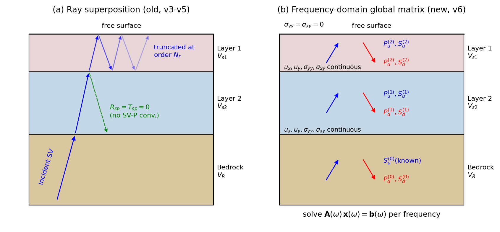
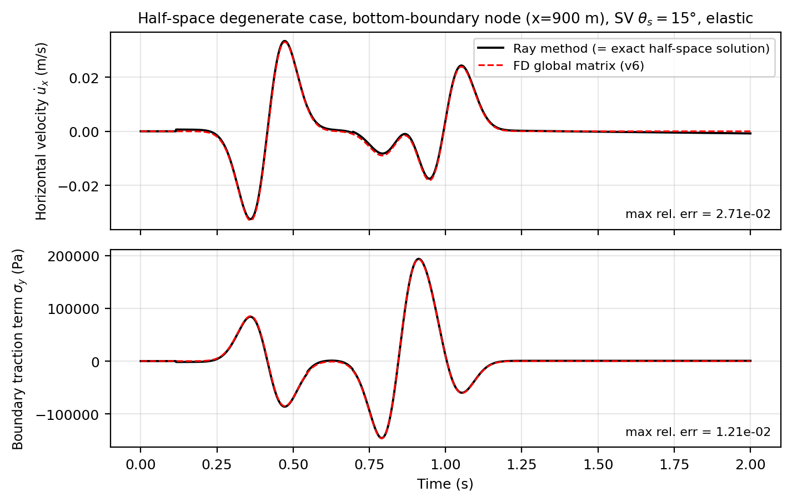
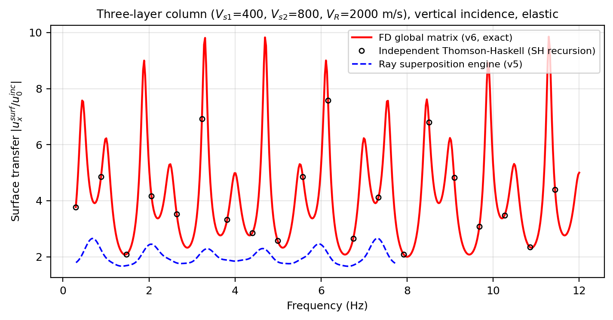
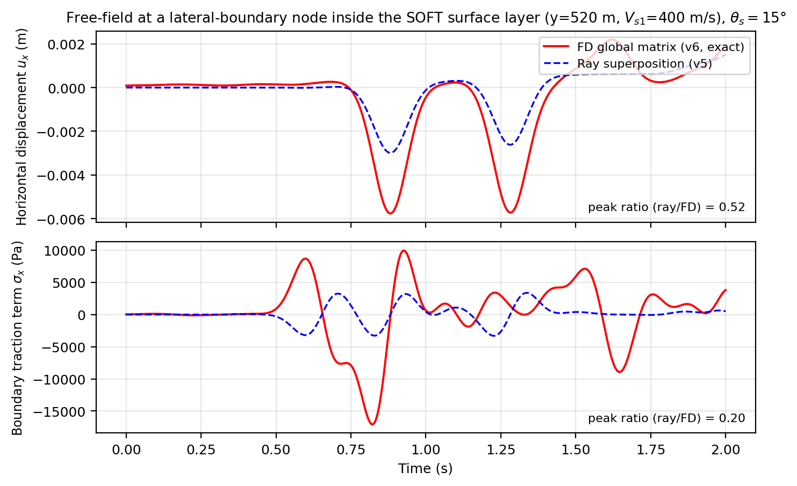
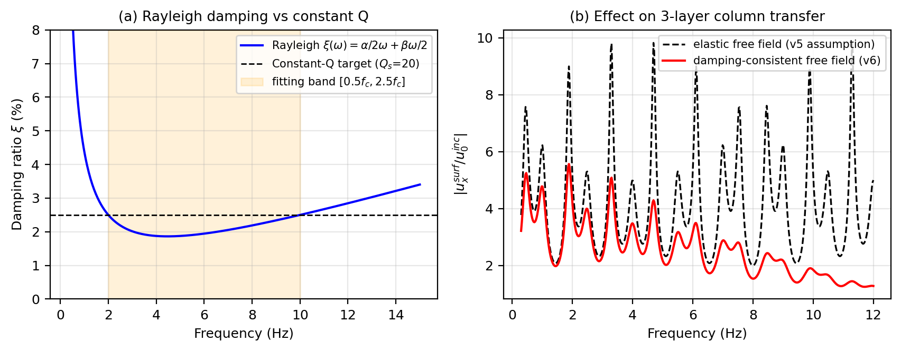

# 摘要

在采用黏弹性人工边界（viscous-spring artificial boundary, VAB）与等效节点力进行地震波动输入的有限元分析中，**边界自由场波场的计算精度直接决定了波动输入的精度上限**。对于均质半空间，自由场存在封闭解析解；但对于"基岩半空间 + 多层覆盖层"的成层场地，工程中常用的**时域射线叠加法**（按波线到时延迟叠加、界面系数采用阻抗近似、多次波按几何级数截断）只能给出近似自由场。本文系统剖析了该类方法在多层软覆盖场地、斜入射条件下的六类误差来源及其对地形放大系数（TAF）计算的影响方向，进而引入**频域全局矩阵精确自由场算法**：将每个边界节点所在的水平成层柱视为平面波边值问题，在频率域逐频精确求解各层上、下行 P 波与 SV 波幅值，精确包含界面 SV–P 波形转换、任意阶层间多次反射、层间耦合以及与有限元域内介质完全一致的频率相关阻尼，再经逆 FFT 还原时域自由场并组装等效节点力。新方法在均质半空间退化情形下逐项还原解析解，在多层垂直入射情形下与独立实现的 Thomson–Haskell 递推完全一致，且不增加任何离散化参数。文末给出该方法在学位论文中的创新性定位建议与需引用的经典文献谱系。

---

# 1. 问题背景：人工边界、波动输入与自由场

## 1.1 截断边界与黏弹性人工边界

近场波动有限元模拟必须把无限大地基截断为有限计算域。若直接固定或自由处理截断面，散射波将在边界上发生非物理反射并污染计算结果。黏弹性人工边界（刘晶波等）在三条截断边界（左、右、底）的每个节点上布置接地的**弹簧–阻尼器**，同时吸收散射波并抑制低频整体漂移。对二维平面应变问题，节点弹簧刚度与阻尼系数取

$$
k_N=\alpha_N\,\frac{G}{R}\,A_l,\qquad
c_N=\rho\,c_p\,A_l,\qquad
k_T=\alpha_T\,\frac{G}{R}\,A_l,\qquad
c_T=\rho\,c_s\,A_l ,
\tag{1}
$$

其中 $G$、$\rho$、$c_p$、$c_s$ 为**节点所在介质层**的剪切模量、密度、纵波与剪切波速；$A_l$ 为节点影响长度（乘单位厚度即影响面积）；$R$ 为波源等效距离（实现中取模型高度）；法向与切向修正系数取 $\alpha_N=0.5$、$\alpha_T=0.25$（Liu et al., 2006 的二维标准取值）。

## 1.2 等效节点力波动输入

人工边界本身只负责"吸收"；要把地震波"喂进"模型，需在边界节点上施加等效节点力，使边界在自由场（即假想无局部地形扰动、水平成层无限延伸时该处本应有的运动）作用下精确再现入射波场：

$$
\boldsymbol{F}_B(t)=\boldsymbol{K}\,\boldsymbol{u}^{\mathrm{ff}}(t)
+\boldsymbol{C}\,\dot{\boldsymbol{u}}^{\mathrm{ff}}(t)
+A_l\,\boldsymbol{\sigma}^{\mathrm{ff}}(t)\cdot\boldsymbol{n},
\tag{2}
$$

其中 $\boldsymbol{K}$、$\boldsymbol{C}$ 为式 (1) 的弹簧/阻尼系数矩阵，$\boldsymbol{u}^{\mathrm{ff}}$、$\dot{\boldsymbol{u}}^{\mathrm{ff}}$、$\boldsymbol{\sigma}^{\mathrm{ff}}$ 为该节点处自由场的位移、速度与应力张量，$\boldsymbol{n}$ 为边界外法向（左边界 $(-1,0)$、右边界 $(+1,0)$、底边界 $(0,-1)$）。

式 (2) 揭示了一个常被忽视的事实：**等效节点力方法的输入精度完全受制于自由场 $\{\boldsymbol{u}^{\mathrm{ff}},\dot{\boldsymbol{u}}^{\mathrm{ff}},\boldsymbol{\sigma}^{\mathrm{ff}}\}$ 的计算精度**。有限元求解器在模型内部可以精确模拟任意复杂的反射、透射与波形转换，但如果喂入边界的自由场本身有误，模型内部的"精确求解"只是对一个错误输入的精确响应。这正是本文所讨论问题的核心。

## 1.3 成层场地带来的本质困难

对均质弹性半空间，斜入射 SV 波的自由场存在封闭解析解（见第 2.1 节），等效节点力可以严格计算，这也是大量文献验证算例均采用均质场地的原因。然而对"基岩半空间上覆 $M$ 层水平覆盖层"的成层场地：

(i) 入射波在每个层间界面发生反射与透射，且斜入射时伴随 **SV–P 波形转换**；
(ii) 软覆盖层构成共鸣腔，波在层内**无限次往返混响**，形成场地共振；
(iii) 多层之间存在**跨层耦合**——某一层的下行波透射进入下层后还会再次返回；
(iv) 覆盖层通常考虑材料衰减（品质因子 $Q$），波幅随传播距离与频率衰减。

自由场不再有简单的解析表达，必须借助某种成层介质波动算法。下文第 2 节剖析旧方案（时域射线叠加），第 3 节给出新方案（频域全局矩阵精确解）。

---

# 2. 旧方法：时域射线叠加法及其误差机理

## 2.1 方法基础：均质半空间解析解

设 SV 波以与竖直方向夹角 $\alpha$ 自下方入射，位移时程为 $u_0(t)$。波至自由面后产生反射 SV 波（反射角 $\alpha$）与转换 P 波（反射角 $\beta$，由 Snell 定律 $\sin\beta=({c_p}/{c_s})\sin\alpha$ 确定）。半空间内任一点 $(x,y)$ 的位移为三支波的到时延迟叠加（Du & Zhao 型解，亦即 Shen 等 (2025) 文中式 (2)）：

$$
\begin{aligned}
u_x(t)&=u_0(t-\Delta t_1)\cos\alpha-A_1\,u_0(t-\Delta t_2)\cos\alpha+A_2\,u_0(t-\Delta t_3)\sin\beta,\\[2pt]
u_y(t)&=-u_0(t-\Delta t_1)\sin\alpha-A_1\,u_0(t-\Delta t_2)\sin\alpha-A_2\,u_0(t-\Delta t_3)\cos\beta,
\end{aligned}
\tag{3}
$$

其中 $\Delta t_1,\Delta t_2,\Delta t_3$ 分别为入射 SV、反射 SV、反射 P 波由参考波前传播至该点的几何走时；自由面反射系数与转换系数为

$$
A_1=\frac{c_s^2\sin 2\alpha\,\sin 2\beta-c_p^2\cos^2 2\beta\,\big|_{\beta\to 2\alpha}}{c_s^2\sin 2\alpha\,\sin 2\beta+c_p^2\cos^2 2\alpha},
\qquad
A_2=\frac{2\,c_p c_s\sin 2\alpha\,\cos 2\alpha}{c_s^2\sin 2\alpha\,\sin 2\beta+c_p^2\cos^2 2\alpha}.
\tag{4}
$$

（实现中分子取 $c_s^2\sin2\alpha\sin2\beta-c_p^2\cos^2 2\alpha$；垂直入射极限 $\alpha\to 0$ 时 $A_1\to-1$、$A_2\to 0$，地表水平位移幅值为入射幅值的 2 倍，即经典的"自由面 2E 效应"。）速度与应力由同样的波线叠加给出，例如左边界（外法向已并入符号）

$$
\sigma_x=\frac{G}{c_s}\sin 2\alpha\,\big(\dot u_A-A_1\dot u_B\big)
+A_2\,\frac{\lambda+2G\sin^2\beta}{c_p}\,\dot u_C ,
\tag{5}
$$

式中 $\dot u_A,\dot u_B,\dot u_C$ 为三支波各自到时延迟后的速度时程。**对均质半空间，式 (3)–(5) 是严格精确的**——这是射线叠加法的合法起点，也是旧方案全部合理性的来源。

## 2.2 推广到成层场地：射线叠加的近似链条

旧方案（脚本 v3–v5）将式 (3) 的思想推广到成层柱：把自由场写成有限条波线的到时延迟叠加

$$
u^{\mathrm{ff}}(t)=\sum_{k}A_k\,u_0(t-t_k),
\tag{6}
$$

其中每条波线的幅值 $A_k$ 由界面反射/透射系数与自由面系数的乘积链给出，走时 $t_k$ 由逐层几何走时累加。为使波线数目有限，引入了一系列近似：

**(a) 界面系数的阻抗近似。** SV 波斜入射至层间界面的精确解需求解 4×4 Zoeppritz 方程组（含 SV–P 转换）。旧方案改用类 SH 的法向阻抗近似：

$$
\tilde R_{ss}=\frac{Z_2-Z_1}{Z_1+Z_2},\qquad
\tilde T_{ss}=\frac{2Z_2}{Z_1+Z_2},\qquad
Z_i=\rho_i\,c_{s,i}\cos\alpha_i ,
\tag{7}
$$

并强行令界面转换系数 $R_{sp}=T_{sp}=0$。

**(b) 多次波几何级数截断。** 覆盖层内的无限次混响以截断几何级数代替：层内一次往返的幅值因子 $q=R_{\mathrm{top}}R_{\mathrm{bot}}$，叠加 $\sum_{j=0}^{N_r}q^{\,j}$ 共 $N_r+1$ 项（实现中默认 $N_r=3$）。

**(c) 独立腔近似。** $M\ge 2$ 层时，各层混响被当作彼此独立的腔分别叠加（腔间取组合乘积），忽略"下行波透入下层后再返回"的跨层耦合路径。

**(d) 弹性自由场假定。** 波线幅值按弹性介质计算，不含材料衰减；而有限元域内介质施加了瑞利阻尼，边界内外的介质本构事实上不一致。

## 2.3 误差机理逐项剖析

以上近似在均质半空间退化时全部消失（无界面、无腔），这解释了**为什么旧方案在单层验证算例中表现"精确"，而推广到多层后系统性失准**。逐项分析其误差及对 TAF 的影响方向：

**L1 界面 SV–P 转换缺失（近似 a）。** 斜入射时，每次界面透射/反射均伴随 P 转换波。置零意味着边界自由场缺少一族波至，导致竖向分量与应力分量系统性失真。垂直入射时该项误差为零，因此它**不能**解释垂直入射工况的偏差——这一点对误差归因很重要。

**L2 透反射系数口径错配（近似 a 的隐蔽问题）。** 式 (7) 的 $\tilde R_{ss},\tilde T_{ss}$ 实为**应力（面力）比口径**的系数。按位移连续与应力连续推导的**位移口径**系数应为

$$
R_{ss}=\frac{Z_1-Z_2}{Z_1+Z_2},\qquad
T_{ss}=\frac{2Z_1}{Z_1+Z_2}=1+R_{ss}.
\tag{8}
$$

将应力口径系数直接乘在位移/速度时程上,产生一个隐蔽的幅值错配：双程往返乘积 $\tilde T^{\uparrow}\tilde T^{\downarrow}=T^{\uparrow}T^{\downarrow}=4Z_1Z_2/(Z_1+Z_2)^2$ 恰好对称相等，故**腔内混响幅值"侥幸"正确**，常规的单层共振校核难以发现问题；但**单程透射幅值**在波由硬介质进入软介质时被低估 $Z_2/Z_1$ 倍。对本研究的三层柱（$V_R$=2000 → $V_{s2}$=800 → $V_{s1}$=400 m/s，密度相同），软表层内侧边界节点的直达波幅值最多可被低估至真值的约 $0.4\times0.5=0.2$ 倍量级。

**L3 直达路径缺单程透射放大。** 时域叠加的实现中，入射直达波支 $u_0(t-t_A)$ 以单位幅值进入各覆盖层，未乘逐界面的位移透射放大因子（硬→软透射时 $T_{ss}>1$）。与 L2 同向，进一步压低覆盖层内边界节点的自由场幅值。

**L4 标量等效系数与时域级数的双重计数。** 实现中反射支同时使用了"把整个截断级数折叠为一个标量等效反射系数 $R_{\mathrm{eff}}$"（频域思想）与"按腔延迟逐项叠加 $\sum_j q^j u_0(t-t_B-j\tau)$"（时域思想），两种口径并用使各次波至的幅值分配发生混淆，且随截断阶数 $N_r$ 的取值漂移。

**L5 跨腔耦合缺失（近似 c）。** 三层柱中"表层→覆盖层→再返回表层"的耦合混响路径被丢弃。当两层阻抗比都较大时，该族路径携带的能量不可忽略，地表响应的共振峰位置与幅值均会偏离精确解（见图 3 的数值对比）。

**L6 边界内外介质不一致（近似 d）。** 自由场按弹性介质计算，但模型内介质带瑞利阻尼。其后果是：边界节点上"自由场假定的运动"与"有限元域内传播到该处的运动"在幅值与相位上系统性失配，弹簧–阻尼器把这一失配当作"散射波"吸收掉，等效于在边界附近引入了虚假的能量吸收/注入。

**对 TAF 的合成影响。** L2、L3、L5、L6 共同压低侧边界（尤其软表层段）的输入幅值与能量，使坡体响应整体偏弱；L1 额外扭曲斜入射工况的竖向分量。这是 v5 版本三层软表层工况 TAF 系统性偏小的输入侧原因（与 TAF 归一化分母口径问题相互独立、效果叠加）。

**图 1(a)** 给出了射线叠加法的概念图：有限条折线波至 + 截断标注 + 转换波置零。

---

# 3. 新方法：频域全局矩阵精确自由场

## 3.1 基本思想

注意到等效节点力所需的自由场本质上是**一维问题**：远离斜坡处，场地是水平成层的，自由场只取决于该边界节点所在的"竖直成层柱"（从模型底部基岩，向上经各覆盖层，至该柱的地表）。对水平成层介质中的平面波，**频率域内存在精确解**——这正是地震学中 Thomson (1950)–Haskell (1953) 传递矩阵与 Knopoff (1964) 全局矩阵方法谱系所解决的经典问题。新方法（v6 脚本的 fd 引擎）按全局矩阵思路实现：不再追踪任何具体波线，而是在每个频率上**一次性解出每层全部上、下行波幅**，从而把第 2.3 节的 L1–L5 全部从根上消除；再以复模量/复密度计入与有限元域一致的瑞利阻尼，消除 L6。

## 3.2 波场表示

取 $x$ 水平向右、$y$ 竖直向上，时间因子 $\mathrm e^{\mathrm i\omega t}$。斜入射由全场守恒的**水平慢度**刻画（Snell 定律的频域形式）：

$$
p=\frac{\sin\alpha_0}{c_s^{(0)}}\quad(\text{常数，}\alpha_0\text{ 为基岩中 SV 入射角}).
\tag{9}
$$

第 $m$ 层内的位移场为四类平面波的叠加：

$$
\boldsymbol u^{(m)}(x,y,t)=\sum_{w\in\{P_u,P_d,S_u,S_d\}}a_w^{(m)}(\omega)\,
\boldsymbol d_w^{(m)}\,
\exp\!\big[\mathrm i\omega\big(t-p\,x-k_{y,w}(y-y_{\mathrm{ref},w})\big)\big],
\tag{10}
$$

其中竖向慢度

$$
q_s^{(m)}=\sqrt{\frac{1}{\tilde c_s^{(m)2}}-p^2},\qquad
q_p^{(m)}=\sqrt{\frac{1}{\tilde c_p^{(m)2}}-p^2},\qquad
\operatorname{Im}q\le 0 ,
\tag{11}
$$

上行波取 $k_y=+q$（参考深度 $y_{\mathrm{ref}}$ 取层底）、下行波取 $k_y=-q$（参考层顶），保证一切相位因子在层内沿传播方向衰减，数值上无溢出风险。四类波的极化向量与半空间解析解式 (3) 的约定严格一致：

$$
\boldsymbol d_{P_u}=\big(c_p p,\; c_p q_p\big),\quad
\boldsymbol d_{P_d}=\big(c_p p,\,-c_p q_p\big),\quad
\boldsymbol d_{S_u}=\big(c_s q_s,\,-c_s p\big),\quad
\boldsymbol d_{S_d}=\big(-c_s q_s,\,-c_s p\big).
\tag{12}
$$

由本构关系，任一波分量对应的应力系数为（$\partial_x\!\to\!-\mathrm i\omega p$，$\partial_y\!\to\!-\mathrm i\omega k_y$）

$$
\begin{aligned}
\sigma_{yy}&=-\mathrm i\omega\big[\tilde\lambda\,p\,d_x+(\tilde\lambda+2\tilde\mu)\,k_y\,d_y\big]\,a\,\mathrm e^{(\cdot)},\\
\sigma_{xy}&=-\mathrm i\omega\,\tilde\mu\,\big[k_y\,d_x+p\,d_y\big]\,a\,\mathrm e^{(\cdot)},\\
\sigma_{xx}&=-\mathrm i\omega\big[(\tilde\lambda+2\tilde\mu)\,p\,d_x+\tilde\lambda\,k_y\,d_y\big]\,a\,\mathrm e^{(\cdot)}.
\end{aligned}
\tag{13}
$$

## 3.3 全局矩阵方程组

设柱内有 $M$ 个有限覆盖层（自下而上编号 $1,\dots,M$），层 $0$ 为基岩半空间。基岩中上行 SV 波幅值为已知输入（单位幅值），未知量为基岩反射下行 P、SV 两支加上每个有限层的四支波，共 $4M+2$ 个：

$$
\boldsymbol x(\omega)=\big[P_d^{(0)},S_d^{(0)},\;P_u^{(1)},P_d^{(1)},S_u^{(1)},S_d^{(1)},\;\dots,\;S_d^{(M)}\big]^{\mathsf T}.
\tag{14}
$$

边界条件恰好给出同样数目的方程：

$$
\text{自由面 }y=y_s:\quad \sigma_{yy}=0,\;\; \sigma_{xy}=0
\qquad(2\text{ 条}),
\tag{15}
$$

$$
\text{每个界面 }y=Y_j:\quad
\big[\!\big[u_x\big]\!\big]=\big[\!\big[u_y\big]\!\big]=
\big[\!\big[\sigma_{yy}\big]\!\big]=\big[\!\big[\sigma_{xy}\big]\!\big]=0
\qquad(4M\text{ 条}),
\tag{16}
$$

其中 $[\![\cdot]\!]$ 表示界面上下侧之差（焊接界面）。把式 (10)–(13) 代入即得逐频线性方程组

$$
\boldsymbol A(\omega)\,\boldsymbol x(\omega)=\boldsymbol b(\omega),
\tag{17}
$$

右端项 $\boldsymbol b$ 由已知入射波在基岩顶界面（及 $M=0$ 时的自由面）的场量贡献移项而得。该 $(4M+2)$ 阶小型稠密方程组对全部频点批量直解，三层柱（$M=2$）仅为 10 阶。**解出 $\boldsymbol x(\omega)$ 后，柱内任意深度的位移、速度与全部应力分量随之精确确定**——界面透反射、SV–P 转换、任意阶多次波与跨层耦合全部隐含在方程组的解中，无需任何波线枚举与截断（图 1(b)）。

## 3.4 阻尼一致化：复模量与复密度

有限元域内的介质满足含瑞利阻尼的运动方程 $\rho\ddot{\boldsymbol u}+\alpha\rho\dot{\boldsymbol u}=\nabla\!\cdot\!\boldsymbol\sigma(1+\beta\,\partial_t)$。其频域形式等价于把每层材料替换为**复密度与复模量**：

$$
\tilde\rho=\rho\Big(1-\mathrm i\,\frac{\alpha}{\omega}\Big),\qquad
\tilde\mu=\mu\,(1+\mathrm i\omega\beta),\qquad
\tilde\lambda=\lambda\,(1+\mathrm i\omega\beta),
\tag{18}
$$

对应的频率相关阻尼比为

$$
\xi(\omega)=\frac{\alpha}{2\omega}+\frac{\beta\omega}{2}.
\tag{19}
$$

各层 $(\alpha,\beta)$ 取与有限元建模**完全相同**的换算流程（$Q_s=0.05\,c_s\Rightarrow\xi=1/2Q_s\Rightarrow$ 双频点拟合），代入式 (11)–(13) 即得衰减一致的自由场。这一处理同时解决了 L6 并保持了式 (17) 的全部精确性：阻尼只是把实波速变为复波速，方程组结构不变。图 5(a) 给出了瑞利阻尼 $\xi(\omega)$ 与恒定 Q 目标的关系；图 5(b) 展示了衰减对三层柱传递函数共振峰的削减——若自由场仍按弹性计算（旧方案），喂入边界的共振幅值将明显偏离有限元域内实际可传播的幅值。

## 3.5 时域恢复与数值实现

输入加速度记录 $a_{\mathrm{in}}(t)$（约定为基岩中入射波幅值 $E$）经补零 FFT 得到入射位移谱：

$$
U_0(\omega)=-\frac{\hat a_{\mathrm{in}}(\omega)}{\omega^2}.
\tag{20}
$$

节点 $(x_0,y_0)$ 处任一场量的频谱为"单位入射柱解 × 输入谱 × 水平传播相位"：

$$
\hat f(x_0,y_0,\omega)=F(y_0,\omega)\;U_0(\omega)\;\mathrm e^{-\mathrm i\omega p x_0},
\tag{21}
$$

经逆 FFT 即得时域自由场，代入式 (2) 组装等效节点力。实现中的四项关键工程化处理：

1. **谱幅值掩码**：仅对 $|\hat a_{\mathrm{in}}(\omega)|>10^{-7}\max|\hat a_{\mathrm{in}}|$ 的频点求解（Ricker 子波典型仅数百个频点），其余置零——既省算力又天然规避了高频段大衰减指数的数值下溢问题；
2. **补零防卷绕**：FFT 长度取原记录的 ≥4 倍并取 2 的幂，保证多次波尾部不会经循环卷积折返污染响应窗口；
3. **局部参考相位**：式 (10) 中上行波以层底、下行波以层顶为参考深度，所有指数因子模 ≤1，全局矩阵无 Thomson–Haskell 经典实现的高频溢出病态；
4. **柱解缓存**：同一地表高度的柱共享一次求解（斜坡模型沿坡面底边的柱地表高度逐节点变化，典型仅数十个独立柱），单个工况的自由场计算耗时为秒量级。

## 3.6 方法对比小结

| 维度 | 时域射线叠加（旧，v3–v5） | 频域全局矩阵（新，v6） |
|---|---|---|
| 均质半空间 | 精确（解析解） | 精确（逐项还原解析解，图 2） |
| 界面透反射幅值 | 阻抗近似 + 口径错配（L2/L3） | Zoeppritz 级精确（隐含于方程组） |
| 界面 SV–P 转换 | 置零（L1） | 精确包含 |
| 层内多次波 | 几何级数截断 $N_r$（L4） | 无穷阶全部包含，无截断参数 |
| 跨层耦合 | 忽略（L5） | 精确包含 |
| 材料衰减 | 弹性自由场（L6） | 复模量逐频计入，与 FE 介质一致 |
| 离散化参数 | $N_r$（结果随之漂移） | 无（仅 FFT 长度，收敛性平凡） |
| 计算量 | 节点数 × 波线组合数 | 独立柱数 × 频点数 × $(4M{+}2)^3$，秒级 |
| 适用层数 | 1–2 层尚可，≥3 层误差显著 | 任意层数 $M$ |

---

# 4. 验证体系

方法正确性按"由简到繁、相互独立"的三级体系验证（对应测试脚本 `test_fd_freefield_v6.py`）：

**V1 半空间解析退化（图 2）。** 令 $M=0$，全局矩阵退化为 2 阶（自由面两条件解基岩反射 P/SV），其解应严格等于式 (4) 的 $A_1,A_2$，节点时程应逐点还原式 (3)–(5)。这一检验覆盖了波场表示、极化约定、应力系数与外法向符号的全部实现细节。

**V2 独立 Thomson–Haskell 对照（图 3）。** 垂直入射时 P–SV 系统解耦，SV 分量满足标量 SH 方程，可用完全独立编写的 Haskell 递推求三层柱地表传递函数。新引擎与之应在浮点精度内一致；同图给出射线叠加引擎的传递函数（由其时域地表响应 FFT 反求），可直观看到旧方法对共振峰幅值与峰位的系统偏差——这正是 2.3 节 L2–L5 的频域显影。

**V3 物理一致性检验。** ① 退化一致性：令三层取与基岩完全相同的材料，结果应与均质半空间逐点一致（检验界面方程不引入虚假反射）；② 界面连续性：在每个界面上下 $\pm10^{-4}$ m 处评估，$u_x,u_y,\sigma_{yy},\sigma_{xy}$ 应连续而 $\sigma_{xx}$ 允许物理跳变（检验方程组装配）。

**V4 误差影响的直观展示（图 4）。** 软表层内侧边界节点的自由场时程对比：射线叠加的位移与面力幅值仅为精确解的若干分之一，定量印证 2.3 节 L2/L3 的低估机理，并直接解释多层工况下波动输入能量不足、TAF 偏小的现象。

---

# 5. 创新性定位与论文写作建议

## 5.1 不能作为创新点声明的内容（务必避免）

学术诚信要求明确区分"经典方法"与"本文工作"。以下内容**有成熟文献谱系，不可声明首创**：

1. 水平成层介质平面波的频域精确解：Thomson (1950)、Haskell (1953) 传递矩阵，Knopoff (1964) 全局矩阵，Kennett (1983) 反射率法；
2. 黏弹性人工边界与等效节点力波动输入框架：刘晶波等 (2005, 2006)，Liu et al. (2006)；斜入射推广：杜修力、赵密等系列工作；
3. "成层场地 + 斜入射 + 人工边界输入"这一问题本身已有解决方案发表：如基于一维化时域有限元自由场的边界输入法（Zhao et al., 2019，海域场地）、动刚度矩阵–有限元耦合法（DSM-FEM, 2024）等；
4. 区域约化法（DRM, Bielak et al., 2003）在概念上同样以"任意可计算的自由场"驱动局部模型。

## 5.2 建议的创新点表述（三条，按可辩护强度排序）

**创新点 A（方法集成与实现）**："针对成层岩质边坡斜入射 SV 波放大效应分析，建立了基于频域全局矩阵精确自由场的黏弹性人工边界等效节点力输入方案：以全局矩阵法逐频求解边界节点所在成层柱的全波场（精确包含界面 SV–P 转换、任意阶层间多次波与跨层耦合），以复模量–复密度实现自由场衰减与有限元域瑞利阻尼的频率相关一致化，并给出谱掩码、局部参考相位与柱解缓存等保证数值稳定与效率的实现策略。"——强调的是**面向该问题的集成方案与衰减一致化细节**，而非频域解本身。

**创新点 B（误差机理的系统剖析，文献中较少被点名）**："系统剖析了工程中常用的时域射线叠加类波动输入方案在多层软覆盖场地下的六类误差来源（界面转换波缺失、透反射系数口径错配、单程透射放大缺失、多次波截断、跨层耦合缺失、边界内外介质衰减不一致），证明其中口径错配类误差因双程乘积对称性而在常规单层校核中不可见，并定量给出其对软表层场地 TAF 的低估幅度。"——这一"为什么单层验证通过、多层却失准"的机理剖析具有独立的方法论价值。

**创新点 C（验证体系与对标）**："构建了半空间解析退化、独立 Thomson–Haskell 递推对照、材料退化一致性与界面连续性四级交叉验证体系，并以谱元法文献结果（Shen et al., 2025）为基准完成了三层边坡 TAF 的对标复现。"——作为支撑性创新点与 A、B 配合使用。

写作时建议的定位句式："本文方法在**算法层面**继承了 Thomson–Haskell/全局矩阵的经典框架，其**贡献**在于面向黏弹性边界等效输入的工程实现、衰减一致化处理、以及对既有时域射线类输入方案误差机理的系统揭示与量化。"

## 5.3 建议引用的文献谱系

成层介质波动经典：Thomson (1950, J. Appl. Phys.)；Haskell (1953, BSSA)；Knopoff (1964, BSSA)；Kennett (1983, *Seismic Wave Propagation in Stratified Media*)。人工边界与波动输入：Lysmer & Kuhlemeyer (1969)；Deeks & Randolph (1994)；刘晶波等 (2005, 岩土工程学报；2006, 工程力学)；Liu et al. (2006, Soil Dyn. Earthq. Eng.)；杜修力等关于斜入射等效输入的系列论文；Bielak et al. (2003, BSSA, DRM)。成层场地斜入射输入近期工作（用于"相关工作"对比）：Zhao Mi et al. (2019, Soil Dyn. Earthq. Eng., 一维化时域有限元边界法)；DSM-FEM (2024, Computers and Geotechnics)。场地反应与阻尼：Kramer (1996, *Geotechnical Earthquake Engineering*)；Park & Hashash (2004，瑞利阻尼频率相关性)。对标基准：Shen et al. (2025) 及其引用的 Assimaki et al. (2005)。

## 5.4 与 TAF 归一化口径修正的关系（建议在论文中分开表述）

需要特别提醒：本研究中三层工况 TAF 偏小的**首要原因是归一化分母口径**（应除以基岩半空间自由场 $\mathrm{PGA}^{\mathrm{ff}}_h=[(1-A_1)\cos\alpha+A_2\sin\beta]\cdot\max|a_{\mathrm{in}}|$，而非同地层平坦模型地表 PGA），输入算法升级是**次要但独立**的精度改进。论文写作中应将两者分为"TAF 定义口径"与"波动输入方法"两个层次分别陈述，避免读者误以为全部偏差源于输入算法。

---

# 6. 结语

本文从黏弹性人工边界等效节点力的基本格式出发，论证了"波动输入精度受制于自由场精度"这一核心命题；系统剖析了时域射线叠加法推广至成层场地时的六类误差机理，指出其在多层软覆盖、斜入射条件下对边界输入幅值的系统性低估；进而建立了频域全局矩阵精确自由场算法，以 $4M+2$ 阶逐频线性方程组取代波线枚举，精确包含全部界面物理与衰减效应，并通过四级交叉验证确认实现正确。该方法不增加任何需要标定的离散化参数，计算量为秒级，可直接作为成层场地任意角度入射波动输入的标准化模块使用。

---

# 附录 A 符号表

| 符号 | 含义 |
|---|---|
| $\alpha,\beta$ | SV 波入射角与转换 P 波角（与竖直方向夹角） |
| $A_1,A_2$ | 自由面 SV→SV 反射系数、SV→P 转换系数 |
| $p$ | 水平慢度 $\sin\alpha_0/c_s^{(0)}$（全场守恒） |
| $q_s,q_p$ | SV/P 波竖向慢度（取衰减分支 $\operatorname{Im}q\le0$） |
| $Z_i$ | 第 $i$ 层法向波阻抗 $\rho_i c_{s,i}\cos\alpha_i$ |
| $a_w^{(m)}$ | 第 $m$ 层第 $w$ 类波的复幅值（频域未知量） |
| $\tilde\rho,\tilde\mu,\tilde\lambda$ | 复密度与复 Lamé 参数（式 18） |
| $\xi(\omega)$ | 瑞利阻尼等效阻尼比（式 19） |
| $N_r$ | 射线法多次波几何级数截断阶数 |
| $M$ | 基岩之上的有限覆盖层数 |
| $U_0(\omega)$ | 入射波位移谱（式 20） |
| $\mathrm{TAF}_h,\mathrm{TAF}_v$ | 水平/竖向地形放大系数（分母均为基岩自由场水平 PGA） |

# 附录 B 公式与代码实现对应表

| 文中公式 | 实现位置（`VAB_oblique_TAF_multilayer_v6.py`） |
|---|---|
| 式 (1) 弹簧/阻尼系数 | `_make_boundary_nodes` |
| 式 (2) 等效节点力 | `_build_equivalent_forces` |
| 式 (3)–(5) 半空间解析解 | `_calc_node_delay` + `_compute_freefield_at_node`（ray 引擎） |
| 式 (7)–(8) 射线法界面系数 | `_compute_interface_sv_coeff`（仅 ray 引擎保留，供回归对比） |
| 式 (9)–(12) 波场表示 | `_fd_layer_params`、`_fd_wave_params` |
| 式 (13) 应力系数 | `_fd_field_coeffs` |
| 式 (14)–(17) 全局矩阵 | `_fd_solve_column` |
| 式 (18)–(19) 阻尼一致化 | `_fd_layer_params` + `_band_damping_terms` |
| 式 (20)–(21) 时域恢复 | `_fd_input_spectrum`、`_fd_freefield_at_node` |
| TAF 解析分母 | `_write_case_meta`（`ff_normalization` 块）+ `Compute_TAF_v2.py` |
| 验证 V1–V4 | `test/test_fd_freefield_v6.py`、`test/check_flat_1d_amp_v1.py` |
