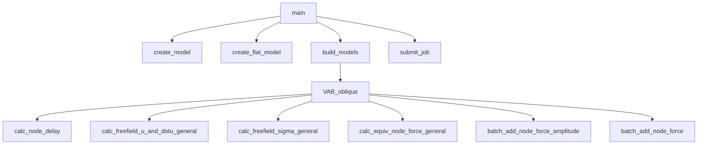
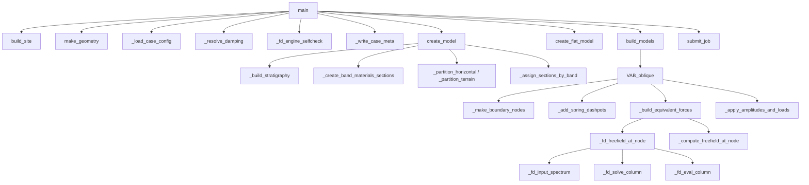
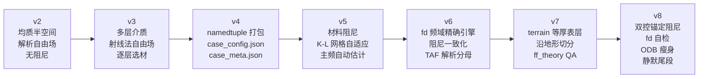

# 从 v2 到 v8：二维斜坡 SV 波斜入射有限元建模脚本升级报告

> **基线版本**：[VAB_oblique_TAF_v2.py](file:///c:/Users/12462/Documents/Code/AbqScripts/Modeling/Single/VAB_oblique_TAF_v2.py)（1180 行，56 KB）  
> **目标版本**：[VAB_oblique_TAF_multilayer_v8.py](file:///c:/Users/12462/Documents/Code/AbqScripts/Modeling/Multi/VAB_oblique_TAF_multilayer_v8.py)（2479 行，176 KB）  
> **整理日期**：2026-06-12

---

## 一、总体架构演进

| 维度 | v2（单层基线） | v8（多层终版） |
|------|---------------|---------------|
| 介质模型 | 均质弹性半空间（单一材料） | 基岩半空间 + 任意数有限层（1/2/3…层） |
| 自由场算法 | 弹性半空间解析公式 | 频域精确全局矩阵法（fd 引擎）+ 射线法（ray 引擎，对比回归用） |
| 材料阻尼 | 无 | Rayleigh 阻尼（双频拟合或仅刚度比例），支持逐层 Q 衰减 |
| 几何参数化 | 三段式固定比例（`h`, `3h`, `8h`） | 独立参数（`H_minus_h`, `h_over_H`, `left_flat`, `total_L`） |
| 网格策略 | 手动指定 + 频率波长取较小值 | Kuhlemeyer-Lysmer 自适应 + 手动上限 + 下限兜底 |
| 时间步控制 | 无 | dt 充分性校验 + 自动重采样 |
| 数据结构 | 裸标量散传 + numpy 列索引 | `namedtuple` 打包（`Material`, `Site`, `Geometry`, `BoundaryNode`, `FreeFieldCtx`） |
| 配置管理 | 内联字典 | `case_config.json` 注入覆盖 + 深合并 |
| 元数据输出 | 无 | `case_meta.json`（工况参数/TAF 分母/理论台阶/自检误差） |
| 表层几何 | 仅水平分层 | 水平分层 `horizontal` + 沿地形等厚铺设 `terrain` |
| 单元类型 | CPE4（硬编码） | CPE4 / CPE4R 可配置 |
| 平坦对照模型 | 必须运行 | `run_flat` 可配置（v6 起 TAF 分母改为解析值，flat 仅作 QA） |
| ODB 输出 | 全场全时程 | 地表节点集全时程 + 整体场降频（`surface_only` 瘦身） |
| Py2/Py3 兼容 | 无特殊处理 | `_ensure_str` 递归 unicode→str + `io.open` 编码指定 |
| 代码规模 | ~1180 行 | ~2479 行（含完整注释） |

---

## 二、核心物理模型升级

### 2.1 从均质半空间到任意层状介质

**v2 基线**：整个模型域采用单一材料（杨氏模量、泊松比、密度），材料参数通过 `material_cfg` 字典中的四个标量定义。自由场解析解直接使用半空间 SV 波入射的反射系数 $A_1$（SV→SV）和 $A_2$（SV→P）：

$$A_1 = \frac{c_s^2 \sin 2\alpha \sin 2\beta_p - c_p^2 \cos^2 2\alpha}{c_s^2 \sin 2\alpha \sin 2\beta_p + c_p^2 \cos^2 2\alpha}$$

**v8 升级**：引入 `Site` = `(bedrock, layers, bedrock_thickness)` 结构化场地模型，支持：

- **单层**：`layers=[]`，全场均质基岩，自动退化为 v2 行为
- **双层**：`layers=[覆盖层]`，基岩 + 覆盖层
- **多层**：`layers=[表层, 覆盖层, ...]`，从上到下排列的任意数有限层

每个有限层由 `Material` 命名元组定义（`cs`, `vv`, `density`, `thickness`, `name`），波速通过 `velocity_ratio`（相对基岩的波速比）间接指定，确保层间波速关系的物理一致性。

### 2.2 频域精确自由场引擎（fd 引擎）

这是 v8 相对于 v2 最核心的物理模型升级，从 v6 版本开始引入。

**v2 基线**：自由场计算基于半空间解析公式，对每个边界节点按三段延迟到时（入射 SV $t_A$、反射 SV $t_B$、反射 P $t_C$）进行时域波形叠加：

```
ux = u(tA)·cos α − A1·u(tB)·cos α + A2·u(tC)·sin βp
uy = −u(tA)·sin α − A1·u(tB)·sin α − A2·u(tC)·cos βp
```

该公式仅适用于均质弹性半空间，无法处理层间界面的波反射/透射与模式转换。

**v8 升级**：引入基于 **Thomson-Haskell 全局矩阵法**的频域精确自由场求解器（`_fd_solve_column` → `_fd_eval_column` → `_fd_freefield_at_node`）：

1. **物理完整性**：
   - 界面处 SV↔P 模式转换精确包含（不做阻抗近似）
   - 任意阶多次波自然蕴含于全局矩阵求解中（无截断误差）
   - 层间耦合效应精确处理
   - 瑞利阻尼以复模量/复密度在频域精确引入：$\tilde{\rho} = \rho(1-i\alpha/\omega)$，$\tilde{\mu} = \mu(1+i\omega\beta)$

2. **方程体系**：
   - 未知量：基岩反射 P/SV + 每个有限层的上/下行 P 与 SV（共 $4M+2$ 个，$M$ = 有限层数）
   - 方程：顶部自由面 $\sigma_{yy}=\sigma_{xy}=0$（2 条）+ 每个界面 $u_x/u_y/\sigma_{yy}/\sigma_{xy}$ 连续（$4M$ 条）
   - 极化约定与半空间退化逐项还原 v2 公式（验证见 `_fd_engine_selfcheck`）

3. **数值策略**：
   - 上行波参考层底、下行波参考层顶的相位约定，确保所有相位因子在层内为衰减方向（数值稳定）
   - 输入波 FFT 补零 4 倍防时域卷绕
   - 仅求解幅值谱 > `spectrum_tol`×max 的频点（其余置零），节省高频计算
   - 柱解缓存（同地表高度柱复用）与输入谱缓存（全模型共享）

4. **退化一致性**：
   - 半空间退化（$M=0$）时，fd 引擎逐项还原 v2 的解析公式
   - 射线法（ray 引擎）保留用于回归对比，通过 `freefield_cfg['engine']` 切换

### 2.3 射线法多层推广（ray 引擎）

作为 fd 引擎的对比回归路径，v8 同时包含了射线法的多层推广：

- **等效反射系数递归**：`_effective_refl_coeffs` 从自由面向下递归，将多层土合并为自由面的等效 SV 反射率 $R_{ss}^{eff}$ 和转换率 $R_{sp}^{eff}$
- **腔体混响叠加**：`_column_cavities` + `_superpose_paths` 将各有限层视为独立谐振腔，按几何级数截断阶数（`MAX_REFLECT_ORDER=3`）枚举所有反弹路径
- **穿层走时累加**：有限层侧边节点的到时改用逐段垂直走时累加 `_tt(column, y_lo, y_hi, 'SV')`
- **层内材料一致化**：有限层侧边节点的应力/位移投影改用本层 $\alpha/\beta/G/c_s/\lambda/c_p$（v2 统一用基岩标量，存在口径矛盾）

### 2.4 材料阻尼体系

**v2**：无材料阻尼，纯弹性分析。

**v8**：完整的粘弹性阻尼框架，通过 `damping_cfg` 配置：

| 阻尼特性 | 实现细节 |
|---------|---------|
| Q 值换算 | $Q = q_{s,factor} \times c_s$（论文 coarse-grain 法），基岩 $Q_{bedrock} \approx 999$（近无衰减） |
| 阻尼比 | $\xi = 1/(2Q)$ |
| Rayleigh 系数 | 双频拟合：$\alpha = 2\xi\omega_1\omega_2/(\omega_1+\omega_2)$，$\beta = 2\xi/(\omega_1+\omega_2)$ |
| 拟合锚定（v8） | `'dual'` 模式：$f_1 = \min(f_{1,factor} \cdot f_c,\ f_{site})$，场地基频 $f_{site} = 1/(4\sum d_i/V_{s,i})$ |
| 自由场一致性 | fd 引擎的复模量阻尼与 Abaqus FE 介质的 Rayleigh 阻尼严格同口径 |

其中 **双控锚定**（v8 新增）是关键改进：瑞利阻尼拟合下限 $f_1$ 取输入波主频因子与场地基频中的较小者，确保拟合频带同时覆盖场地共振频率与输入卓越频率，避免因阻尼在场地基频处过拟合或欠拟合导致的响应偏差。

---

## 三、几何参数化重构

### 3.1 参数定义体系

**v2**：采用直接几何参数（`h=50m`, `i=30°`），模型尺寸通过固定比例推算：
```python
H_lower = 2.0 * h     # 下垫面高度
H_flat  = 3.0 * h     # 平坦模型总高度
total_L = 8.0 * h     # 总模型长度
left_flat = 3.0 * h   # 左平台长度
```

**v8**：采用无量纲参数化体系（`Geometry` 命名元组），解耦各尺寸间的硬比例约束：
```python
geometry_cfg = {
    'H_minus_h': 200.0,        # 斜坡高度差 H − h (m)
    'i': 45.0,                 # 斜坡倾角 (度)
    'h_over_H': 0.5,           # 深度比 h/H
    'total_L': 1800.0,         # 总模型长度 (m)
    'left_flat': 1000.0,       # 上平台长度 (m)
    'bedrock_thickness': 200.0, # 基岩层厚度 (m)
}
```

其中 $H = (H-h)/(1-h/H)$ 为总覆盖层厚度，$h = H - (H-h)$ 为下部覆盖层高度。`bedrock_thickness` 定义基岩界面高程，使有限层的空间分布完全由层厚自洽确定。

### 3.2 几何派生量统一

`make_geometry` 函数一次性计算全部派生量（`H`, `h`, `H_upper`, `H_lower`, `H_flat`, `w_slope`, `layer_interfaces`），通过 `Geometry` 命名元组在全流程中传递，消除了 v2 中多处重复计算相同几何量的冗余。

### 3.3 表层几何模式（v7 新增）

`surface_geometry` 配置支持两种表层几何：

- **`horizontal`**（默认）：表层水平分布，上下界为固定高程水平线，与 v2 行为一致
- **`terrain`**：表层沿地形等厚铺设，上下界跟随地表起伏，切分线为三段折线（上平台-坡面-下平台）

`_band_bounds_at` 函数统一处理三类带定位（`elevation`/`depth`/`fill`），使建模切分、截面分配、边界弹簧选材、自由场柱构造四处口径一致。

---

## 四、网格与时间步自适应

### 4.1 网格尺寸自适应

**v2**：
```python
mesh_size_auto = cs / (f_max * n_per_wave)   # 按频率波长
mesh_size = min(mesh_size_auto, mesh_size_manual)  # 取较小值
```

**v8**：基于 **Kuhlemeyer-Lysmer 准则**的自适应网格划分：

$$\Delta l_{max} = \frac{c_{s,min}}{n_{epw} \times f_{max}},\quad f_{max} = f_{max,factor} \times f_c$$

其中 $c_{s,min}$ 取全部层中最小剪切波速（最软层），$n_{epw}=10$，$f_{max,factor}=2.5$。网格尺寸受 `min_size=0.5m` 兜底（防止过软层导致计算量爆炸），且不超过手动指定上限 `mesh_size`。

### 4.2 时间步校验与自动重采样

**v2**：无时间步校验。

**v8**：`time_cfg` 配置提供安全护栏：
- 校验条件：`steps_per_period = (1/f_max)/dt ≥ min_steps_per_fmax_period`（默认 20 步/周期）
- 不满足时自动重采样：`dt_new = (1/f_max)/min_steps`，通过 `np.interp` 升采样加速度记录
- 当前标准 Ricker 输入（dt=0.001s）远超门槛，此机制仅在换用粗采样输入时触发

### 4.3 单元类型可配置

**v2**：硬编码 `CPE4`（平面应变四节点全积分单元）。

**v8**：通过 `mesh_cfg['elem']` 配置，支持 `'CPE4'`（默认全积分）和 `'CPE4R'`（减缩积分，可加速但需注意沙漏模态）。

---

## 五、数据结构与工程化改进

### 5.1 命名元组参数打包

v2 采用裸标量散传（函数签名包含 `cs`, `vv`, `density`, `angle` 等大量独立参数），v8 通过五个 `namedtuple` 结构化打包：

| 命名元组 | 字段 | 用途 |
|---------|------|------|
| `Material` | `cs`, `vv`, `density`, `thickness`, `name` | 单层材料输入 |
| `Site` | `bedrock`, `layers`, `bedrock_thickness` | 场地分层 |
| `Geometry` | 6 个输入项 + 7 个派生项 | 斜坡几何 |
| `BoundaryNode` | `label`, `x`, `y`, `influence`, `kn`, `cn`, `kt`, `ct` | 边界节点 |
| `FreeFieldCtx` | 场地/几何/分层/角度/波速/时程/阻尼... | 等效力计算上下文 |

### 5.2 场地分层带构造

`_build_stratigraphy` 将场地分层展开为"从下到上"的标称材料带列表（`[基岩带, 覆盖层带, 表层带, ...]`），每条带携带名称、材料、上下界 y 坐标及定位方式标记（`elevation`/`depth`/`fill`）。该分层带贯穿建模全流程：

1. 材料/截面创建（`_create_band_materials_sections`）
2. 面切分与截面分配（`_partition_horizontal` / `_partition_terrain` + `_assign_sections_by_band`）
3. 边界弹簧选材（`pick_material`）
4. 自由场柱构造（`_build_column`）

### 5.3 配置注入机制

**v2**：所有参数硬编码在脚本内联字典中，修改参数需编辑源代码。

**v8**：引入 `case_config.json` 注入机制：
- 工况文件夹下放置 JSON 文件即可覆盖默认配置
- 支持部分覆盖（只改入射角）或整体替换（改层数/几何/网格/阻尼）
- `_deep_merge` 递归合并字典（子键级别），列表（如 `layers`）整体替换
- `_ensure_str` 递归将 Py2 下 `json.load` 产生的 `unicode` 转为原生 `str`（Abaqus C++ API 要求）

### 5.4 工况元数据输出

**v2**：无元数据输出，工况参数仅存在于脚本运行日志。

**v8**：`_write_case_meta` 将工况参数固化为 `case_meta.json`，内容包括：

| 元数据块 | 内容 |
|---------|------|
| `geometry` | 几何参数 + 坡顶/坡脚 x 坐标 |
| `bedrock` / `layers` | 逐层材料参数 |
| `derived` | 波速比、模型类型、无量纲频率 $a_0$ |
| `damping` | 逐层 Q/ξ/α/β 阻尼参数 |
| `ff_normalization` | TAF 解析分母（$PGA_{ff,h} = factor_h \times \max|a_{input}|$） |
| `ff_theory`（v7） | 远场一维理论台阶 TAF（fd 引擎计算，QA 锚点） |
| `selfcheck`（v8） | fd 引擎自检误差 |

该元数据是后处理脚本（`Compute_TAF_v2/v3`）的唯一数据源，避免跨模块参数口径漂移。

---

## 六、数值健壮性与质量保障

### 6.1 fd 引擎建模前自检（v8 新增）

`_fd_engine_selfcheck` 在每次建模前自动执行两项解析对拍（毫秒级开销）：

1. **半空间退化**：均质基岩柱（Vs=2000），近垂直入射，检验地表水平位移 $|u_x| = 2.0$（自由面放大效应）。相对误差应 < $10^{-3}$。
2. **单层 SH 校验**：200m 覆盖层（Vs=800）+ 基岩（Vs=2000），1 Hz 单频，$|u_x|$ 对比 SH 解析解 $2/|\cos(kh) + i\alpha\sin(kh)|$。相对误差应 < $10^{-3}$。

任一项超阈值即抛出 `RuntimeError` 中止建模，防止 fd 引擎被无意修改后静默产出错误等效力。

### 6.2 远场理论台阶自动 QA

`_write_case_meta` 中利用 fd 引擎对左（上平台）/ 右（下平台）远场柱计算一维地表 PGA 理论值，并写入 `ff_theory` 块。下游 `Compute_TAF_v3` 自动核对 FE 远场平台 TAF 与理论值的偏差（容许 ±5%），任何网格/阻尼/引擎回归当场暴露。

### 6.3 临界角校验（v8 硬化）

**v2**：仅比较入射角与临界角，超过时抛出通用异常。

**v8**：
- 达到或超过基岩 SV→P 临界角 $\alpha_{crit} = \arcsin(c_s/c_p)$ 时**拒绝建模**（超临界后自由面反射 P 为非均匀波，ray 引擎实角公式与 TAF 解析分母 `factor_h` 均失效）
- 入射角 > 30°（论文工况上限）时输出告警日志，提示结果须谨慎使用

### 6.4 积分基线校正

**v2**：加速度直接梯形积分为速度（`np.cumsum`），无任何趋势校正。

**v8**：`_integrate_acc_to_velocity` 先去除加速度零频偏移（均值），积分后用线性最小二乘拟合并扣除速度的线性趋势项，抑制低频漂移（位移 = 速度/(iω) 会放大低频误差）。

### 6.5 等效系数缓存

**v2**：无缓存机制，相同延迟的信号会重复构造。

**v8**：多级缓存策略：
- `_REFL_COEFF_CACHE`：等效反射/转换系数缓存（键为柱地表高度+入射角，同一柱地表高度复用）
- `_FD_SOLVER_CACHE`：fd 柱解缓存（同地表高度柱复用）+ 输入谱缓存（全模型共享）
- `_make_delay_cache`：延迟信号缓存（按离散步数缓存，跨节点复用减少重复构造）

---

## 七、建模流程优化

### 7.1 边界弹簧系数逐层取材

**v2**：所有边界节点统一使用相同材料参数计算弹簧刚度和阻尼系数：
```python
kn = GG / 2 / ymax        # 全场统一刚度
cn = density * cp          # 全场统一阻尼
```

**v8**：`pick_material(x, y)` 按节点坐标查找所在材料带，返回该带材料参数，弹簧/阻尼系数使用本层材料计算（`_make_boundary_nodes`），确保边界条件与局部介质性质匹配。

### 7.2 材料分区切分

**v2**：仅在坡底高程水平切分一次（分为上下两部分），单一截面分配。

**v8**：
1. **垂直切分**：坡顶线和坡脚线（`left_flat` 和 `left_flat + w_slope`），将模型分为三列
2. **水平切分**：基岩界面及各固定层间界面（`_partition_horizontal`）
3. **沿地形切分**（terrain 模式）：`_partition_terrain` 按埋深绘制三段折线切分
4. **按质心分配截面**：`_assign_sections_by_band` 遍历所有面，按质心 (x,y) 通过 `_band_bounds_at` 落入对应材料带

### 7.3 分析步配置优化

**v2**：
```python
application=MODERATE_DISSIPATION  # 中等数值耗散
```

**v8**：
```python
application=TRANSIENT_FIDELITY    # 瞬态保真（α≈-0.05），降低数值阻尼
```

改用 `TRANSIENT_FIDELITY` 使物理材料阻尼（Rayleigh）主导能量耗散，避免数值阻尼对高频响应的过度衰减。

### 7.4 ODB 瘦身（v8 新增）

`run_cfg['surface_only']=True` 时：
- 新建 `F-Output-Surface` 请求：仅对 `TOP_SURFACE` 节点集输出 `(A, U)` 全时程
- 整体 `F-Output-1` 频率设为极大值（几乎只输出首末帧）
- 效果：ODB 体积骤降，同时保留频域传递函数 $H(f)$ 提取所需的地表全时程

### 7.5 静默尾段（v8 新增）

`time_cfg['tail_seconds']` 控制分析步与 fd 自由场时窗同步延长一段静默时间，便于：
- 捕捉坡体混响衰减过程
- 频域传递函数 $H(f)$ 提取时避免时窗截断效应

---

## 八、函数架构对比

### 8.1 v2 核心函数调用链



> **特征**：`VAB_oblique` 为单个巨型函数（~560 行），内部嵌套定义了 `delay_signal`、`make_delay_cache`、`pad_to`、`calc_freefield_u_and_dotu_general`、`calc_freefield_sigma_general`、`calc_equiv_node_force_general` 等多个内部函数。

### 8.2 v8 核心函数调用链



> **特征**：`VAB_oblique` 精简为调度器（~170 行），物理计算、边界施加、载荷创建分别提取为独立函数，自由场引擎通过 `engine` 配置在 fd/ray 间切换。

---

## 九、新增辅助功能函数清单

以下函数为 v8 新增，v2 中不存在：

| 函数 | 版本 | 用途 |
|------|------|------|
| `_script_path` / `_script_name` / `_script_dir` | v4+ | 安全获取脚本路径（Abaqus 内核可能无 `__file__`） |
| `_safe_arcsin` | v3+ | 对 arcsin 输入截断，避免浮点超界 |
| `_ensure_str` | v4+ | Py2/Py3 unicode 兼容 |
| `_compute_elastic_modulus_from_wave_speed` | v3+ | 波速→弹性模量反算 |
| `_compute_material_params` | v3+ | 统一计算 G/E/λ/cp/cs |
| `_estimate_dominant_freq` | v5+ | FFT 估计输入波主频 |
| `_damping_ratio_from_q` | v5+ | Q→ξ 换算 |
| `_rayleigh_coeffs` | v5+ | ξ→Rayleigh (α,β) 换算 |
| `_resolve_damping` | v5+ | 阻尼配置解析（补全 fc） |
| `_site_fundamental_freq` | v8 | 场地基频估算（垂直走时法） |
| `_compute_interface_sv_coeff` | v3+ | 层间 SV 反射/透射系数 |
| `_compute_free_surface_sv_coeff` | v3+ | 自由面 SV 反射/转换系数 |
| `_compute_free_surface_p_coeff` | v3+ | 自由面 P 反射/转换系数 |
| `_integrate_acc_to_velocity` | v5+ | 梯形积分+基线校正 |
| `_surface_y_at` | v3+ | 按 x 查地表 y 高程 |
| `_build_stratigraphy` | v3+ | 场地分层带构造 |
| `_band_bounds_at` | v7 | 按柱地表换算带上下界 |
| `make_geometry` / `make_flat_geometry` | v3+ | 几何构造与派生 |
| `build_site` | v3+ | 由配置构建场地对象 |
| `_build_column` / `_column_seg` / `_seg_at` | v3+ | 节点所在成层柱构造 |
| `_effective_refl_coeffs` / `_column_cavities` | v3+ | 等效反射系数递归与混响腔 |
| `_superpose_paths` | v3+ | 多腔混响叠加 |
| `_calc_node_delay`（重构） | v3+ | 支持覆盖层段的到时计算 |
| `_delay_signal` / `_make_delay_cache` / `_pad_to` | v3+ | 从内部函数提取为模块级 |
| `_fd_*` 系列（8 个函数） | v6+ | 频域精确自由场全局矩阵法 |
| `_fd_engine_selfcheck` | v8 | fd 引擎解析对拍自检 |
| `_max_element_size` | v5+ | K-L 准则自适应网格 |
| `_interface_partitions` | v7 | 材料界面切分（水平+沿地形） |
| `_create_band_materials_sections` | v3+ | 逐带材料/截面创建 |
| `_partition_horizontal` / `_partition_terrain` | v7 | 面切分工具 |
| `_assign_sections_by_band` | v3+ | 按质心落带分配截面 |
| `_make_boundary_nodes` | v3+ | 边界节点构建（含逐层选材） |
| `_add_spring_dashpots` | v3+ | 弹簧-阻尼器施加（从 VAB_oblique 提取） |
| `_build_equivalent_forces` | v3+ | 等效力计算（从 VAB_oblique 提取） |
| `_apply_amplitudes_and_loads` | v3+ | 幅值与载荷施加（从 VAB_oblique 提取） |
| `_band_damping_terms` | v6 | 各带瑞利阻尼系数表 |
| `_deep_merge` | v4+ | 配置字典递归合并 |
| `_load_case_config` | v4+ | case_config.json 注入 |
| `_write_case_meta` | v4+ | case_meta.json 元数据写出 |
| `_meta_f` / `_meta_material` / `_damping_meta` | v4+ | 元数据格式化辅助 |

---

## 十、配置参数对比总表

### 10.1 v2 配置

```python
material_cfg = {
    'angle': 30,
    'elastic_modulus': 32e9,
    'poisson_ratio': 0.25,
    'density': 2650,
}
geometry_cfg = {
    'h': 50, 'i': 30,
    'mesh_size_manual': 4, 'f_max': 15, 'n_per_wave': 10,
}
job_cfg = {
    'variables': ('U', 'V', 'A'), 'frequency': 1,
    'num_cpus': 7, 'memory_percent': 90,
}
```

### 10.2 v8 配置（7 个独立配置块）

| 配置块 | 新增项 | 说明 |
|-------|-------|------|
| `material_cfg` | `surface_geometry`, `bedrock{}`, `layers[]` | 分层材料 + 表层几何模式 |
| `geometry_cfg` | `H_minus_h`, `h_over_H`, `left_flat`, `total_L`, `bedrock_thickness` | 无量纲参数化 |
| `job_cfg` | （同 v2） | 作业参数 |
| `damping_cfg` | `enable`, `method`, `qs_factor`, `q_bedrock`, `fc`, `f1_factor`, `f2_factor`, `anchor` | 阻尼体系（v8 新增 `anchor: 'dual'`） |
| `mesh_cfg` | `auto`, `elems_per_wavelength`, `fmax_factor`, `min_size`, `elem` | 网格自适应 |
| `time_cfg` | `check`, `min_steps_per_fmax_period`, `resample_if_violate`, `tail_seconds` | 时间步校验 + 静默尾段 |
| `freefield_cfg` | `engine`, `include_damping`, `spectrum_tol`, `fcut`, `pad_factor` | 自由场引擎 |
| `run_cfg` | `run_flat`, `surface_only` | 运行控制 + ODB 瘦身 |

---

## 十一、版本演进路线总结



> 每个版本在前一版基础上保持向后兼容——单层场地（`layers=[]`）在 v8 中严格退化为 v2 行为。
