DOI：10.16285/j.rsm.2022.1494

# 地震波斜入射下岩质边坡放大效应的数值模拟研究

申 辉 1, 2，刘亚群 1, 2，刘 博 1, 2，李海波 1, 2

（1. 中国科学院武汉岩土力学研究所 岩土力学与工程国家重点实验室，湖北 武汉 430071；2. 中国科学院大学，北京 100049）

摘 要：近源地震中，地震波入射角对岩质边坡的放大效应影响显著。基于黏弹性人工边界理论和等效节点力原理，结合有限单元法建立了可以考虑地震 SV波和P波斜入射的地震动输入方法，研究了岩质边坡的坡角、地震波入射角以及入射波类型对边坡放大效应的影响规律。边坡峰值地面加速度（peak ground acceleration，简称PGA）放大系数结果表明，若仅考虑地震波垂直入射的情况，边坡的动力放大效应可能会被严重低估。此外，边坡坡角的变化和入射波类型的改变也对边坡的放大效应有显著的影响。将计算得到的 PGA 放大系数与相关规范中建议的放大系数对比发现，规范建议值在一些情况下低估了放大效应。边坡坡顶的加速度频谱结果显示，地震波入射角对坡顶加速度傅里叶谱的主频影响较小，但对其傅里叶谱的幅值影响较大。随着 SV波入射角的增大，坡顶水平加速度傅里叶谱幅值整体上变化不显著，而竖向加速度傅里叶谱幅值逐渐增大；随着P波入射角的增大，坡顶竖向加速度傅里叶谱幅值逐渐减小而水平向幅值逐渐增大。引入谱比曲线定量评估了不同入射条件下边坡坡顶的谱放大效应，获得了坡顶谱比峰值的变化规律。

关 键 词：岩质边坡；地震波入射角；地震响应；地形效应；P 波；SV 波

中图分类号：TU445

文献标识码：A

文章编号：1000－7598 (2023) 07－2129－14

# Numerical study on the amplification effect of rock slopes under oblique incidence of seismic waves

SHEN Hui1, 2, LIU Ya-qun1, 2, LIU Bo1, 2, LI Hai-bo1, 2

(1. State Key Laboratory of Geomechanics and Geotechnical Engineering, Institute of Rock and Soil Mechanics, Chinese Academy of Sciences, Wuhan, Hubei 430071, China; 2. University of Chinese Academy of Sciences, Beijing 100049, China)

Abstract: The influence of the incident angle of seismic waves on the amplification effect of rock slopes is obvious in near-source earthquakes. Based on the theory of viscous-spring artificial boundary and the principle of equivalent nodal force, a seismic input method for oblique incidence of seismic SV and P waves is established and implemented in the finite element method. Various influencing factors such as slope inclination, incident angle of seismic wave, and type of incident wave are considered, and then a numerical study is conducted to investigate the amplification effect of rock slopes. The results of the peak ground acceleration (PGA) amplification factor of the slope show that the amplification effect of the rock slope may be significantly underestimated if only the vertical incidence of seismic waves is considered. In addition, the slope inclination and the type of incident wave also have a significant influence on the amplification effect. By comparing the calculated results of the PGA amplification factor with those suggested by the Code for Seismic Design of Buildings (GB50011―2010), it is found that the values suggested by the seismic code may underestimate the amplification effect in some cases. The results of the spectral characteristics of the acceleration at the slope crest reveal that the incident angle of the seismic waves has little effect on the main frequency of the Fourier spectrum but has a significant effect on the Fourier amplitude. As the incident angle of the SV-wave increases, the Fourier amplitude of vertical acceleration at the slope crest increases, while the variation of Fourier amplitude of horizontal acceleration is not obvious. As the incident angle of P-wave increases, the Fourier amplitude of vertical acceleration at the slope crest decreases while that of horizontal acceleration increases. Finally, the spectral ratio curve is introduced to quantitatively evaluate the effects of different influencing factors on the spectral amplification of slope crest, and the variation pattern of the peak spectral ratio under different incident conditions is obtained.

Keywords: rock slope; incident angle of seismic wave; seismic response; topographic effect; P-wave; SV-wave

## 1 引 言

地震是最具破坏性的自然灾害之一，对人民群众的生命和财产安全构成巨大威胁，特别是在山地丘陵地带，地震往往诱发崩塌、滑坡、泥石流等次生灾害，造成严重的人员伤亡和财产损失。大量震后灾害调查和研究表明[1-3]，不规则地形，如突出的山梁、陡崖，高耸孤立的山丘、陡坡等，会对地震波的传播和散射过程产生重大影响。相较于平坦的地形，地震作用下不规则地形的地面运动通常会被放大，从而产生更严重的震害。边坡作为一类不规则场地，地形放大效应是影响其地震动力响应的重要因素。因此，研究地震作用下边坡的地形放大效应可以更好地理解其动力响应机制，为抗震设计提供重要的参考价值和工程应用价值。

大多数关于边坡放大效应的调查和分析，包括场观测[4-6]、振动台模型试验[7-9]以及数值模拟[10-12]，均假设地震波是垂直入射的。一般来说，对于深源地震，地震波在传播过程中经过不同地层的多次透反射后，可以认为最终到达地面时是垂直入射的。然而，对于浅源地震，由于存在近场效应，应当考虑地震波入射角对局部地形的影响[13]。尤其对于硬岩场地，如对基岩质量要求极高的核电站、水电站场地等，浅源地震波到达地面时其入射方向通常与地面存在一定角度，斜入射的地震波可能会导致地面产生剧烈的竖向运动[14]。

2008年“5.12”汶川大地震由于地震震级高、持续时间长、震源深度浅，诱发数万处崩滑地质灾害[15]。黄润秋等[16]对汶川地震后距断层一定范围的85 处大（巨）型滑坡的滑动方向进行了统计，发现大型滑坡的滑动方向总体上与发震断层的走向垂直或大角度斜角，即地震波和地面运动的强度具有显著的方向性。Xu 等[17]通过对汶川地震诱发的 112处大规模滑坡统计发现，其中 80%的滑坡位于地震断层 5 km 的范围内，且面向地震波斜坡上的大型滑坡密度明显高于与地震波传播方向同向的斜坡，即地震波的“方向效应”明显。另外，在其他地震中也观察到了类似地震波的方向效应对局部地形产生的影响，如2013年的四川芦山地震[18]和2009年的意大利 L’Aquila 地震[19]。除了地震调查之外，许多数值模拟结果同样揭示了地震波入射角对边坡地形放大效应的影响。丁海平等[20]采用有限元法和透射人工边界相结合的数值模拟方法，研究了陡坎地形在P波斜入射时，入射角度、入射方向和坡角变化等参数对地震波传播的影响，讨论了不同地震波作用下地震动峰值放大系数的变化规律，结果显示，斜入射的情况较垂直入射的更加复杂。Fan 等[21]使用有限差分法建立了地震荷载作用下 3 组不同坡角的岩质边坡的数值模型，并考虑地震波入射角的变化，其结果表明斜入射的地震波会对边坡的动力响应产生重要影响。尹超等[22]建立了多组 SV 波斜入射下的双面边坡模型，其结果显示地震波入射角度对坡体地形放大效应的影响是显著的，且最大的加速度放大系数与地震波的入射方向有关。类似的考虑地震波入射角对边坡地形效应影响的还有车伟[23]、周国良[24]等的研究。尽管如此，由于边坡的放大效应受边坡几何形状、边坡岩性、地震波入射角、地震波类型等众多因素影响，地震波与边坡的相互作用机制仍有待进一步探究。鉴于岩质边坡动力响应问题的复杂性，对岩质边坡放大效应规律的研究和定量化的参数分析仍需进一步积累完善。

本文采用黏弹性人工边界与等效节点力相结合的地震动输入方法，基于商业有限元软件ABAQUS建立了岩质边坡的数值模型，综合考虑地震波入射角（垂直入射和斜入射）、入射波类型（地震 SV 波和 P 波）及边坡坡角的变化对岩质边坡地形放大效应的影响，研究了不同影响因素下边坡峰值地面加速度放大系数的变化规律以及坡顶加速度的频谱特性，并引入了谱比曲线来定量评估坡顶的谱放大效应，以期为岩质边坡场地的工程抗震提供一定的参考。

## 2 数值模型建立与验证

## 2.1 地震动输入方法

## 2.1.1 黏弹性人工边界

在近场波动问题中，通常需要设置人工边界来吸收边界反射波的能量。本文采用杜修力等[25]提出的黏弹性人工边界，物理上相当于在边界节点处施加一系列一端固定的弹簧−阻尼器元件。对于二维问题，人工边界节点处法向和切向的弹簧刚度系数$K _ { \mathrm { N } } , ~ K _ { \mathrm { T } }$ 以及阻尼系数 $C _ { \mathrm { N } } , \ C _ { \mathrm { T } }$ 分别为

$$
K _ {\mathrm{N}} = \frac {1}{1 + A} \frac {\lambda + 2 G}{2 r}, C _ {\mathrm{N}} = B \rho c _ {\mathrm{p}} \tag {1}
$$

$$
K _ {\mathrm{T}} = \frac {1}{1 + A} \frac {G}{2 r}, C _ {\mathrm{T}} = B \rho c _ {\mathrm{s}} \tag {2}
$$

式中： 为拉梅常数；G 为剪切模量； $\rho$ 为介质密度； $c _ { \mathrm { p } } = \sqrt { \left( \lambda + 2 G \right) / \rho }$ 和 $c _ { \mathrm { s } } = \sqrt { G / \rho }$ ，分别为 P 波和 S 波波速；r 可简单取为近场几何中心到人工边界点的距离；系数A 和B 的建议值[25]分别为0.8和1.1。

## 2.1.2 边界的等效节点力

对于人工边界外的无限域，总波场可以分解为自由波场与散射波场两部分[26]。地震动输入可转化为作用于人工边界上的集中力荷载，人工边界节点l的等效节点力由下式确定：

$$
f _ {l i} = (K _ {l i} u _ {l i} ^ {\mathrm{F}} + c _ {l i} \dot {u} _ {l i} ^ {\mathrm{F}} + \sigma_ {l i} ^ {\mathrm{F}}) A _ {l} \tag {3}
$$

式中： $f _ { l i }$ 为在自由波场条件下边界节点 l 在方向 i上需要施加的荷载； $K _ { l i }$ 和 $c _ { l i }$ 为结点 l 方向 i 的黏弹性人工边界参数； $u _ { l i } ^ { \mathrm { F } }$ 和 $\dot { u } _ { l i } ^ { \mathrm { F } }$ 分别为结点l 方向i的位移和速度； $\sigma _ { l i } ^ { \mathrm { F } }$ 为自由场波动产生的应力场； $A _ { l }$ 为人工边界面上结点l的影响面积。

根据式（1）～（3），可以结合有限元法建立边坡数值模型及人工黏弹性边界，并将地震荷载转化为施加在人工边界节点处的等效节点力来实现地震动的输入。SV 波和 P 波加载时的等效节点力转换计算公式略有不同，其实现原理可分别参考文献[27]和文献[28]，此处不再赘述。

## 2.2 地震动输入方法的验证

在二维均匀弹性半空间截取长为 2 000 m、高为1 000 m的有限区域作为计算区域，并在计算区域的顶部和中部分别设置监测点 A 和 B，如图 1(a)所示。计算区域介质的密度 $\dot { \rho } = 2 ~ 5 0 0 ~ \mathrm { k g } / \mathrm { m } ^ { 3 }$ ，弹性模量 $E = 2 0 \mathrm { G P a }$ ，泊松比 $\nu = 0 . 3$ ，SV波和 P波波速分别为 1 754 m/s 和 3 282 m/s。在截断边界处设置黏弹性人工边界，考虑入射角为 $1 5 ^ { \mathrm { { \circ } } }$ 的 SV 波和入射角为 $2 5 ^ { \mathrm { { \circ } } }$ 的 P 波进行加载，入射波均采用短持时脉冲荷载，其定义如下：

$$
\begin{array}{l} P (\tau) = 1 6 P _ {0} \Bigg [ G (\tau) - 4 G \Bigg (\tau - \frac {1}{4} \Bigg) + 6 G \Bigg (\tau - \frac {1}{2} \Bigg) - \\ \left. 4 G \left(\tau - \frac {3}{4}\right) + G (\tau - 1) \right] \tag {4} \\ \end{array}
$$

式中： $\tau { = } t / T ,$ ，t为时间，T为脉冲持时，这里取 $t =$ 1.5 s， $T { = } 0 . 3 ~ \mathrm { s } ;$ ； $G ( \tau ) = \tau ^ { 3 } H ( \tau )$ ，H( )为 Heaviside 函数； $P _ { 0 }$ 为荷载幅值，这里取 $P _ { 0 } = 0 . 1 \mathrm { ~ m ~ }$ 。荷载波形如图1(b)所示。

图2(a)和2(b)分别给出了模型在 SV波和 P波斜入射下不同时刻的位移场云图。从图 2中可以明显看到 SV 波和 P 波的入射及反射过程，说明建立的地震动输入方法可以很好地模拟 SV 波和 P 波在半空间的传播过程。此外，在截断边界处没有发生波的反射，说明在截断边界处设置的黏弹性人工边界可以较好地吸收边界反射波的能量。图 3 和图 4分别给出了计算模型在 SV 波和 P 波斜入射下监测点处 x 和 y 方向的位移时程曲线（分别用 $U _ { x }$ 和 $U _ { y }$ 表示），并与基于波动理论获得的理论解[29]进行了对比。从图中可以看出，理论解与数值解吻合较好，说明建立的地震动输入方法具有良好的模拟精度。

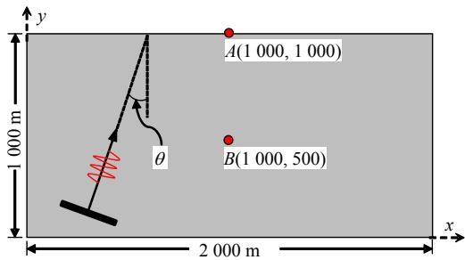

text_image

y
A(1 000, 1 000)
B(1 000, 500)
θ
1 000 m
2 000 m
x

(a) 场地计算模型

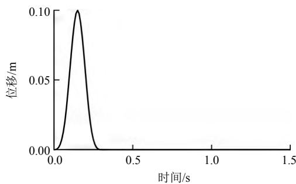

line

| 时间/s | 位移/m |
| --- | --- |
| 0.0 | 0.00 |
| ~0.15 | 0.10 |
| ~0.3 | 0.00 |

(b) 脉冲荷载位移时程曲线  
图 1 场地计算模型及荷载位移时程  
Fig.1 Computational model and displacement time-history of an impulsive load

## 2.3 边坡数值模型的建立

图 5 显示了一个简化的二维均质岩体边坡模型，由于不考虑边坡在地震荷载作用下发生滑动破坏，因此将边坡岩体视为弹性体进行计算，边坡模型的材料力学参数如表1所示。边坡模型的高度h=100 m，坡角 $i = 3 0 ^ { \mathrm { o } } \sim 7 5 ^ { \mathrm { o } }$ ，模型总长度为 $2 0 h \ =$ 2 000 m，总厚度为 $3 h = 3 0 0 \mathrm { m }$ ，坡顶后方的平台宽度保持为 10h不变，图中坡顶和坡脚位置已用 1#和2#标记。坐标系的原点建立在模型的左下角，水平向为 x 轴，垂直向为 y 轴。在模型的截断边界处设置黏弹性人工边界，采用 El Centro地震波从模型的左侧以角度 入射。地震波的幅值设置为 0.3g，并进行15 Hz低通滤波，其时程曲线和傅里叶幅值谱如图6所示。由于输入波的频率成分和介质的波速特性都会影响波传播的数值精度，因此采用Kuhlemeyer 等[30]建议的方法来计算满足有限元中波传播精度的单元尺寸，并以此对模型进行单元离散。另外，为了与垂直入射对比，每个边坡模型均考虑了 4 组地震波入射角，其中 3 组为斜入射，1组为垂直入射。

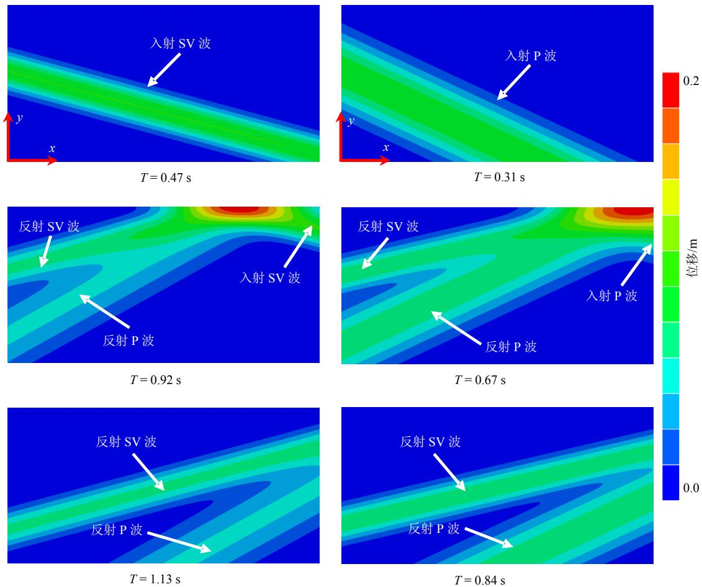  
(a) SV 波 15º斜入射  
(b) P 波 25º斜入射  
图 2 SV波和P波斜入射时半空间位移场云图

Fig.2 Displacement contours of semi-infinite space subjected to obliquely incident SV- and P-waves  
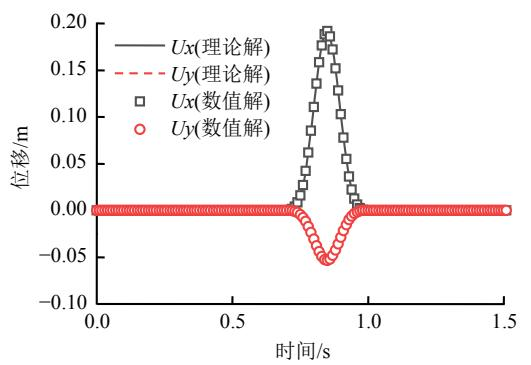

line

| 时间/s | Ux(理论解)/m | Uy(理论解)/m | Ux(数值解)/m | Uy(数值解)/m |
| --- | --- | --- | --- | --- |
| 0.0 | 0.0 | 0.0 | 0.0 | 0.0 |
| 0.1 | 0.0 | 0.0 | 0.0 | 0.0 |
| 0.2 | 0.0 | 0.0 | 0.0 | 0.0 |
| 0.3 | 0.0 | 0.0 | 0.0 | 0.0 |
| 0.4 | 0.0 | 0.0 | 0.0 | 0.0 |
| 0.5 | 0.0 | 0.0 | 0.0 | 0.0 |
| 0.6 | 0.0 | 0.0 | 0.0 | 0.0 |
| 0.7 | ~0.01 | ~-0.01 | ~0.01 | ~-0.01 |
| 0.8 | ~0.11 | ~-0.05 | ~0.11 | ~-0.05 |
| 0.85 | ~0.19 | ~-0.06 | ~0.19 | ~-0.06 |
| 0.9 | ~0.11 | ~-0.05 | ~0.11 | ~-0.05 |
| 1.0 | 0.0 | 0.0 | 0.0 | 0.0 |
| 1.1 | 0.0 | 0.0 | 0.0 | 0.0 |
| 1.2 | 0.0 | 0.0 | 0.0 | 0.0 |
| 1.3 | 0.0 | 0.0 | 0.0 | 0.0 |
| 1.4 | 0.0 | 0.0 | 0.0 | 0.0 |
| 1.5 | 0.0 | 0.0 | 0.0 | 0.0 |

(a) 监测点 A

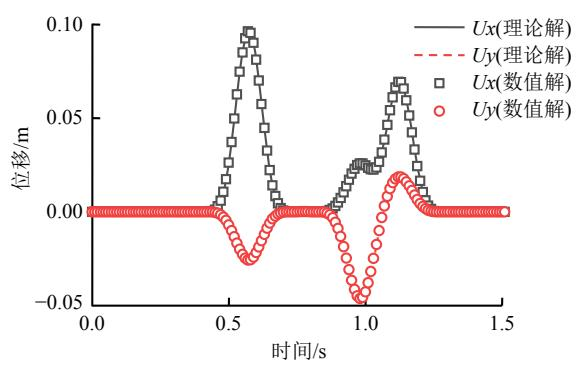

line

| 时间/s | Ux(理论解) | Uy(理论解) | Ux(数值解) | Uy(数值解) |
| --- | --- | --- | --- | --- |
| 0.0 | 0.00 | 0.00 | 0.00 | 0.00 |
| 0.5 | ~0.01 | ~-0.01 | ~0.01 | ~-0.01 |
| 0.6 | ~0.10 | ~-0.03 | ~0.10 | ~-0.03 |
| 0.7 | ~0.02 | ~-0.01 | ~0.02 | ~-0.01 |
| 0.8 | ~0.01 | ~-0.01 | ~0.01 | ~-0.01 |
| 0.9 | ~0.02 | ~-0.02 | ~0.02 | ~-0.02 |
| 1.0 | ~0.03 | ~-0.05 | ~0.03 | ~-0.05 |
| 1.1 | ~0.07 | ~-0.02 | ~0.07 | ~-0.02 |
| 1.2 | ~0.04 | ~-0.01 | ~0.04 | ~-0.01 |
| 1.3 | ~0.01 | ~-0.01 | ~0.01 | ~-0.01 |
| 1.5 | 0.00 | 0.00 | 0.00 | 0.00 |

(b) 监测点 B  
图 3 SV波斜入射下监测点处的位移时程曲线  
Fig.3 Time-history curves of displacement at observation points under obliquely incident SV-wave

## 3 边坡加速度放大系数的分布特征

## 3.1 加速度放大系数

## 3.1.1 定义

为了定量评估地震激励下边坡模型表面的放大效应，参考文献[1，10]中对于放大系数的定义，本文定义放大系数为监测点的峰值地面加速度（peak ground acceleration，简称 PGA）与自由场的峰值加速度之比。对于 SV 波入射和 P 波入射的情况，因入射波的振动方向不同，其放大系数的计算方式有所不同。对于 SV 波入射的情况，水平放大系数 $\mathrm { H A F _ { s } }$ 和竖向放大系数 $\mathrm { V A F _ { s } }$ 分别为

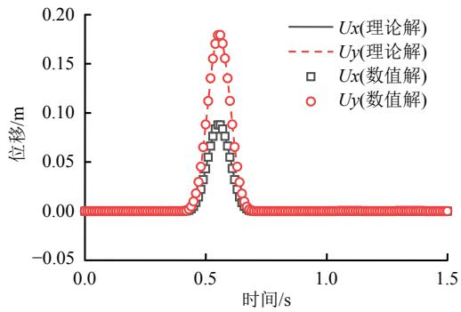

scatter

| 时间/s | Ux(理论解)/m | Uy(理论解)/m | Ux(数值解)/m | Uy(数值解)/m |
| --- | --- | --- | --- | --- |
| 0.0 | 0.0 | 0.0 | 0.0 | 0.0 |
| 0.1 | 0.0 | 0.0 | 0.0 | 0.0 |
| 0.2 | 0.0 | 0.0 | 0.0 | 0.0 |
| 0.3 | 0.0 | 0.0 | 0.0 | 0.0 |
| 0.4 | ~0.01 | ~0.01 | ~0.01 | ~0.01 |
| 0.5 | ~0.08 | ~0.18 | ~0.08 | ~0.18 |
| 0.6 | ~0.01 | ~0.01 | ~0.01 | ~0.01 |
| 0.7 | 0.0 | 0.0 | 0.0 | 0.0 |
| 0.8 | 0.0 | 0.0 | 0.0 | 0.0 |
| 0.9 | 0.0 | 0.0 | 0.0 | 0.0 |
| 1.0 | 0.0 | 0.0 | 0.0 | 0.0 |
| 1.1 | 0.0 | 0.0 | 0.0 | 0.0 |
| 1.2 | 0.0 | 0.0 | 0.0 | 0.0 |
| 1.3 | 0.0 | 0.0 | 0.0 | 0.0 |
| 1.4 | 0.0 | 0.0 | 0.0 | 0.0 |
| 1.5 | 0.0 | 0.0 | 0.0 | 0.0 |

(a) 监测点 A  
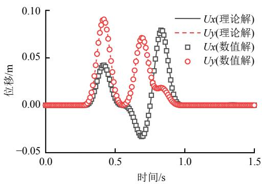

line

| 时间/s | Ux(理论解) (m) | Uy(理论解) (m) | Ux(数值解) (m) | Uy(数值解) (m) |
| --- | --- | --- | --- | --- |
| 0.0 | 0.00 | 0.00 | 0.00 | 0.00 |
| 0.25 | 0.00 | 0.00 | 0.00 | 0.00 |
| 0.4 | ~0.04 | ~0.09 | ~0.04 | ~0.09 |
| 0.5 | ~0.01 | ~0.01 | ~0.01 | ~0.01 |
| 0.6 | ~-0.03 | ~0.03 | ~-0.03 | ~0.03 |
| 0.7 | ~-0.03 | ~0.07 | ~-0.03 | ~0.07 |
| 0.8 | ~0.06 | ~0.02 | ~0.06 | ~0.02 |
| 1.0 | 0.00 | 0.00 | 0.00 | 0.00 |
| 1.5 | 0.00 | 0.00 | 0.00 | 0.00 |

(b) 监测点 B  
图 4 P 波斜入射下监测点处的位移时程曲线

Fig.4 Time-history curves of displacement at observation points under obliquely incident P-wave  
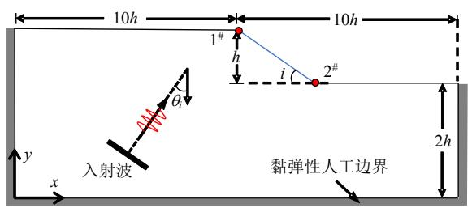

text_image

10h
10h
1#
h
i
2#
y
x
入射波
黏弹性人工边界
2h

图 5 岩质边坡有限元模型  
Fig.5 Finite element model of rock slope

表 1 岩体材料的力学参数  
Table 1 Mechanical parameters of rock material

<table><tr><td>密度 $/\left( {\mathrm{{kg}} \cdot {\mathrm{m}}^{-3}}\right)$ </td><td>弹性模量/GPa</td><td>泊松比</td><td>剪切波速 $/\left( {\mathrm{m} \cdot {\mathrm{s}}^{-1}}\right)$ </td><td>压缩波速 $/\left( {\mathrm{m} \cdot {\mathrm{s}}^{-1}}\right)$ </td></tr><tr><td>2 650</td><td>33</td><td>0.20</td><td>2 278</td><td>3 720</td></tr></table>

$$
\mathrm{HAF} _ {\mathrm{s}} = \frac {a _ {\mathrm{h,max}} ^ {x}}{a _ {\mathrm{h,max}} ^ {\mathrm{ff}}}, \mathrm{VAF} _ {\mathrm{s}} = \frac {a _ {\mathrm{v,max}} ^ {x}}{a _ {\mathrm{h,max}} ^ {\mathrm{ff}}} \tag {5}
$$

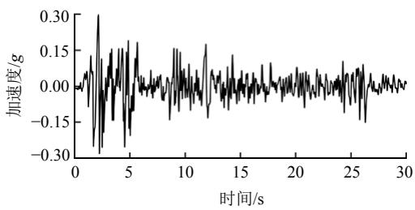

line

| 时间/s | 加速度/g |
| --- | --- |
| 0 | ~0.00 |
| 2 | ~0.30 |
| 5 | ~0.18 |
| 10 | ~0.15 |
| 15 | ~0.14 |
| 20 | ~0.12 |
| 25 | ~0.12 |
| 30 | ~0.02 |

(a) 加速度时程  
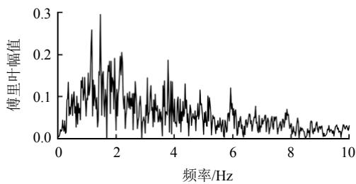

spectrogram

| 频率/Hz | 傅里叶幅值 |
| --- | --- |
| 0 | ~0.02 |
| 1 | ~0.15 |
| 1.5 | ~0.30 |
| 2 | ~0.18 |
| 4 | ~0.19 |
| 6 | ~0.12 |
| 8 | ~0.07 |
| 10 | ~0.03 |

(b) 傅里叶谱  
图 6 输入地震波的加速度时程及傅里叶谱  
Fig.6 Acceleration time-history and Fourier spectrum of input seismic wave

式中：a 为地面加速度，其下标 h 和 v 分别表示水平向和竖直向，max表示峰值；而上标x和ff分别为水平坐标为x 的监测点和自由场监测点。

类似地，对于 P 波入射下，竖向放大系数 $\mathrm { V A F _ { p } }$ 和水平放大系数 $\mathrm { H A F _ { p } }$ 分别为

$$
\mathrm{VAF} _ {\mathrm{p}} = \frac {a _ {\mathrm{v,max}} ^ {x}}{a _ {\mathrm{v,max}} ^ {\mathrm{ff}}}, \mathrm{HAF} _ {\mathrm{p}} = \frac {a _ {\mathrm{h,max}} ^ {x}}{a _ {\mathrm{v,max}} ^ {\mathrm{ff}}} \tag {6}
$$

## 3.1.2 规范建议值

我国《建筑抗震设计规范》（GB50011―2010）[31]（后文均简称《规范》）中规定：对复杂地形或地形变化明显的建筑场地，应估计不利地段对设计地震动参数的放大作用。规范中考虑局部突出地形对地震动参数的放大作用，根据宏观震害经验和对不同地形地质条件的形体所进行的二维地震反应分析结果，归纳出了各种地形地震放大系数 $\varphi$ 的计算公式：

$$
\varphi = 1 + \xi \alpha \tag {7}
$$

式中： $\alpha$ 为局部突出地形地震影响系数的增大幅度，与突出地形的高度 H 以及坡降角度的正切 H/L 有关，一般来说，边坡愈陡，其顶部的放大效应相应加大； $\xi$ 为附加调整系数，与场址距突出地形边缘的距离 $L _ { 1 }$ 与坡高 H 的比值有关，即离陡坎和边坡顶部边缘的距离愈大，地震反应相对减小。根据《规范》[31]中的相关规定，对于本文坡高 $H = 1 0 0 \mathrm { m }$ 的岩质边坡，相关系数 和 的取值如图7所示。

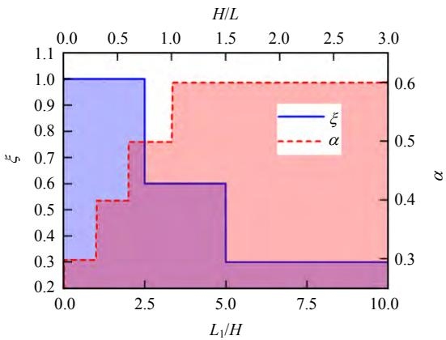

area

| L1/H | \(\xi\) | \(\alpha\) |
| --- | --- | --- |
| 0.0~2.5 | 1.0 | 0.3 |
| 2.5~5.0 | 0.6 | 0.5 |
| 5.0~10.0 | 0.3 | 0.6 |

图 7 系数 和 建议的取值  
Fig.7 Suggested values for coefficients  and

## 3.2 SV波入射下的结果

图 8 给出了地震 SV 波垂直入射（ 为 $0 ^ { \circ } ~ )$ ）和斜入射下 $( \theta _ { \mathrm { s } }$ 分别为 10º、20º、 $3 0 ^ { \circ } ~ )$ ）不同坡角边坡表面的水平和竖向 PGA 放大系数的分布曲线。图中边坡坡顶和坡脚的位置由竖向黑色虚线标记（坡顶的位置在 $x / h = 1 0$ 处，以1#表示，坡脚的位置以2#表示）。

从图 8 可以看出，水平 PGA 放大系数的峰值均出现在坡顶附近，且在边坡的斜坡面上迅速衰减，直至在坡脚处出现转折，并在坡脚后方逐渐趋于稳定。在坡顶后方，水平 PGA 放大系数随着离坡顶距离的增大而减小。对于坡角相同的边坡，坡顶附近的水平放大效应在地震波斜入射的情况下明显大于垂直入射的情况，且其峰值随着入射角的增大而增大。这说明若仅考虑垂直入射的情况可能会严重低估边坡的地震响应。另一方面，随着坡角的增加，水平放大效应也有较明显增强，特别是在较大角度斜入射时（如入射角 $\theta _ { \mathrm { s } } \mathrm { \geqslant } 2 0 ^ { \circ }$ ）尤为明显。

竖向 PGA 放大系数整体上随着入射角的增大而增大，且随着边坡坡角的增大其峰值逐渐增大，并向坡顶的位置靠近。例如，在坡角 $i { \leqslant } 6 0 ^ { \circ }$ 时，竖向 PGA 放大系数 VAFs≤1.0，而在 $i = 7 5 ^ { \mathrm { { o } } }$ 的情况下，$\mathrm { V A F _ { s } }$ 的最大值达到了 1.32 左右。尽管在陡坡坡顶附近有较强的竖向放大效应，但是坡顶后方竖向放大系数的衰减速度比水平向的更快，竖向 PGA 放大系数曲线几乎在坡顶后方0.1h～0.2h 的范围便趋于稳定。

为了与规范建议值进行对比，根据式（7）计算得到的地震放大系数同样绘制于图8 中，以阶梯状的红色实线表示。可以看出，在考虑 SV 波斜入射的情况下，数值计算得到的坡顶后方水平 PGA放大系数的分布在 $i { \leqslant } 4 5 ^ { \mathrm { { o } } }$ 时与《规范》[31]建议的地震放大系数吻合较好。但是在 $i > 4 5 ^ { \mathrm { o } }$ 的情况下，坡顶后方一倍 h 距离的范围内水平放大系数明显高于《规范》[31]建议的放大系数。这是因为《规范》[31]中对于突出地形坡降角度正切H/L≥1.0（即 $i { \geq } 4 5 ^ { \circ } ~ )$ 的情况均归为一类（见图7），这可能导致一定程度上低估了这类陡坡（如 $i = 6 5 ^ { \mathrm { o } }$ ， $7 5 ^ { \circ }$ ）的水平放大效应。因此，建议规范进一步扩大或细分这一部分规定的范围。竖向 PGA 放大系数的分布均在规范建议值的范围内，若采用《规范》[31]建议的放大系数会高估竖向的放大，根据上述对竖向放大的衰减分析，建议《规范》[31]对陡坡 $( i > 4 5 ^ { \mathrm { o } }$ ）坡顶附近的竖向放大重点关注。

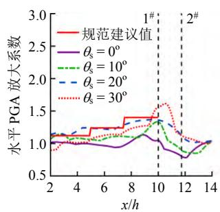

line

| x/h | 规范建议值 | \(\theta s = 0{}^{\circ}\) | \(\theta s = 10{}^{\circ}\) | \(\theta s = 20{}^{\circ}\) | \(\theta s = 30{}^{\circ}\) |
| --- | --- | --- | --- | --- | --- |
| 2 | ~1.15 | ~1.05 | ~1.15 | ~1.15 | ~0.9 |
| 4 | ~1.15 | ~1.05 | ~1.15 | ~1.25 | ~1.05 |
| 6 | ~1.25 | ~1.0 | ~1.15 | ~1.25 | ~1.15 |
| 8 | ~1.4 | ~1.05 | ~1.25 | ~1.35 | ~1.25 |
| 10 | ~1.4 | ~1.1 | ~1.35 | ~1.35 | ~1.6 |
| 12 | ~1.15 | ~0.8 | ~0.9 | ~1.15 | ~1.15 |
| 14 | ~1.05 | ~1.05 | ~1.05 | ~1.05 | ~1.05 |

(a) i = 30º

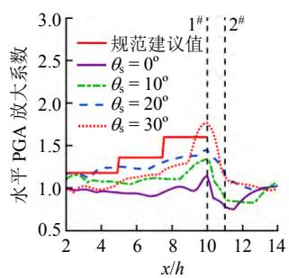

line

| x/h | 规范建议值 | \(\theta s = 0{}^{\circ}\) | \(\theta s = 10{}^{\circ}\) | \(\theta s = 20{}^{\circ}\) | \(\theta s = 30{}^{\circ}\) |
| --- | --- | --- | --- | --- | --- |
| 2 | ~1.2 | ~1.0 | ~1.0 | ~1.2 | ~1.0 |
| 4 | ~1.2 | ~1.0 | ~1.1 | ~1.25 | ~1.1 |
| 6 | ~1.4 | ~0.95 | ~1.15 | ~1.25 | ~1.15 |
| 8 | ~1.6 | ~1.05 | ~1.3 | ~1.4 | ~1.3 |
| 10 | ~1.6 | ~1.35 | ~1.35 | ~1.5 | ~1.75 |
| 12 | ~1.0 | ~0.8 | ~0.85 | ~0.95 | ~1.05 |
| 14 | ~1.05 | ~1.05 | ~1.05 | ~1.05 | ~1.05 |

(b) i = 45º

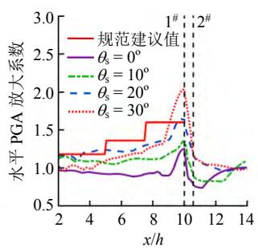

line

| x/h | 规范建议值 | \(\theta s = 0{}^{\circ}\) | \(\theta s = 10{}^{\circ}\) | \(\theta s = 20{}^{\circ}\) | \(\theta s = 30{}^{\circ}\) |
| --- | --- | --- | --- | --- | --- |
| 2 | ~1.2 | ~1.0 | ~1.2 | ~1.2 | ~1.2 |
| 4 | ~1.2 | ~1.0 | ~1.1 | ~1.2 | ~1.0 |
| 6 | ~1.4 | ~0.95 | ~1.15 | ~1.25 | ~1.2 |
| 8 | ~1.6 | ~0.95 | ~1.2 | ~1.35 | ~1.3 |
| 10 | ~1.6 | ~1.3 | ~1.35 | ~1.6 | ~2.0 |
| 12 | ~0.8 | ~0.8 | ~0.85 | ~0.95 | ~1.05 |
| 14 | ~1.0 | ~1.0 | ~1.1 | ~1.0 | ~1.0 |

(c) i = 60º

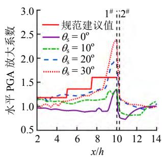

line

| x/h | 规范建议值 | \(\theta s = 0{}^{\circ}\) | \(\theta s = 10{}^{\circ}\) | \(\theta s = 20{}^{\circ}\) | \(\theta s = 30{}^{\circ}\) |
| --- | --- | --- | --- | --- | --- |
| 2 | ~1.2 | ~1.0 | ~1.2 | ~1.2 | ~1.2 |
| 4 | ~1.2 | ~0.95 | ~1.1 | ~1.2 | ~1.1 |
| 6 | ~1.4 | ~0.95 | ~1.15 | ~1.25 | ~1.2 |
| 8 | ~1.6 | ~0.95 | ~1.2 | ~1.35 | ~1.35 |
| 10 | ~1.6 | ~1.35 | ~1.35 | ~1.9 | ~2.4 |
| 12 | ~1.05 | ~0.85 | ~0.85 | ~1.05 | ~1.05 |
| 14 | ~1.05 | ~1.05 | ~1.15 | ~1.05 | ~1.05 |

(d) i = 75º

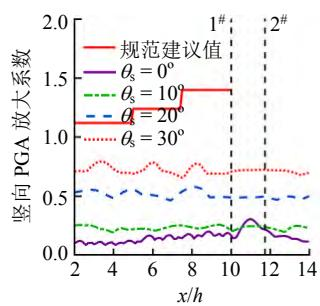

line

| x/h | 规范建议值 | \(\theta s = 0{}^{\circ}\) | \(\theta s = 10{}^{\circ}\) | \(\theta s = 20{}^{\circ}\) | \(\theta s = 30{}^{\circ}\) |
| --- | --- | --- | --- | --- | --- |
| 2 | ~1.15 | ~0.1 | ~0.25 | ~0.55 | ~0.75 |
| 4 | ~1.15 | ~0.1 | ~0.2 | ~0.55 | ~0.8 |
| 6 | ~1.25 | ~0.15 | ~0.25 | ~0.55 | ~0.75 |
| 8 | ~1.4 | ~0.15 | ~0.25 | ~0.6 | ~0.8 |
| 10 | ~1.4 | ~0.15 | ~0.25 | ~0.55 | ~0.7 |
| 12 | ~1.4 | ~0.25 | ~0.25 | ~0.55 | ~0.75 |
| 14 | ~1.4 | ~0.15 | ~0.25 | ~0.55 | ~0.75 |

(e) i = 30º

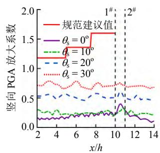

line

| x/h | 规范建议值 | \(\theta s=0{}^{\circ}\) | \(\theta s=10{}^{\circ}\) | \(\theta s=20{}^{\circ}\) | \(\theta s=30{}^{\circ}\) |
| --- | --- | --- | --- | --- | --- |
| 2 | ~1.2 | ~0.15 | ~0.3 | ~0.55 | ~0.7 |
| 4 | ~1.2 | ~0.15 | ~0.3 | ~0.6 | ~0.8 |
| 6 | ~1.35 | ~0.2 | ~0.25 | ~0.55 | ~0.7 |
| 8 | ~1.6 | ~0.25 | ~0.25 | ~0.6 | ~0.75 |
| 10 | ~1.6 | ~0.25 | ~0.25 | ~0.55 | ~0.7 |
| 12 | ~1.6 | ~0.2 | ~0.25 | ~0.55 | ~0.7 |
| 14 | ~1.6 | ~0.15 | ~0.25 | ~0.5 | ~0.7 |

(f) i = 45º

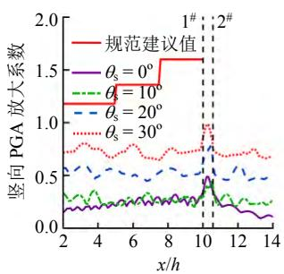

line

| x/h | 规范建议值 | \(\theta s = 0{}^{\circ}\) | \(\theta s = 10{}^{\circ}\) | \(\theta s = 20{}^{\circ}\) | \(\theta s = 30{}^{\circ}\) |
| --- | --- | --- | --- | --- | --- |
| 2 | ~1.2 | ~0.15 | ~0.35 | ~0.6 | ~0.75 |
| 4 | ~1.2 | ~0.2 | ~0.3 | ~0.55 | ~0.8 |
| 6 | ~1.4 | ~0.25 | ~0.3 | ~0.55 | ~0.7 |
| 8 | ~1.4 | ~0.25 | ~0.3 | ~0.55 | ~0.75 |
| 10 | ~1.6 | ~0.3 | ~0.3 | ~0.55 | ~0.75 |
| 11 | ~1.6 | ~0.45 | ~0.45 | ~0.75 | ~1.0 |
| 12 | ~1.6 | ~0.25 | ~0.3 | ~0.55 | ~0.7 |
| 14 | ~1.6 | ~0.15 | ~0.3 | ~0.5 | ~0.7 |

(g) i = 60º

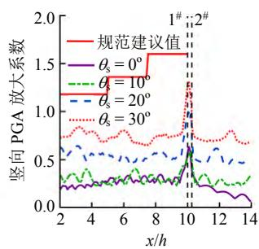

line

| x/h | 规范建议值 | \(\theta s = 0{}^{\circ}\) | \(\theta s = 10{}^{\circ}\) | \(\theta s = 20{}^{\circ}\) | \(\theta s = 30{}^{\circ}\) |
| --- | --- | --- | --- | --- | --- |
| 2 | ~0.75 | ~0.25 | ~0.35 | ~0.65 | ~0.75 |
| 4 | ~0.75 | ~0.25 | ~0.35 | ~0.65 | ~0.85 |
| 6 | ~0.75 | ~0.30 | ~0.35 | ~0.60 | ~0.80 |
| 8 | ~1.60 | ~0.30 | ~0.35 | ~0.60 | ~0.75 |
| 10 | ~1.60 | ~0.65 | ~0.65 | ~0.95 | ~1.30 |
| 12 | ~1.60 | ~0.25 | ~0.35 | ~0.65 | ~0.75 |
| 14 | ~1.60 | ~0.10 | ~0.35 | ~0.50 | ~0.75 |

(h) $i = 7 5 ^ { \mathrm { o } }$  
图 8 不同入射角的 SV波入射下边坡表面的水平和竖向PGA放大系数的分布  
Fig.8 Distributions of horizontal and vertical PGA amplification factors along slope surfaces under SV-wave incidence with different angles

表 2 给出了在 SV 波不同入射条件下边坡表面的峰值 PGA 放大系数。根据表 2 的结果，图 9 绘制了地震 SV 波入射下水平和竖向放大系数的峰值随入射角 $\theta _ { \mathrm { s } }$ 和坡角i的变化趋势，由图表可见：

（1）水平和竖向 PGA 放大系数的峰值均随着入射角和坡角的增大而增大。  
（2）水平向的 PGA 放大系数的峰值显著大于竖向的。水平 PGA放大系数的峰值在1.133～2.382之间，而竖向 PGA放大系数的峰值在0.330～1.315之间，且其仅在 $i = 7 5 ^ { \mathrm { { o } } }$ ， $\theta _ { \mathrm { { s } } } = 3 0 ^ { \circ }$ 时超过1.0。

表 2 SV波入射下峰值 PGA放大系数  
Table 2 Peak values of PGA amplification factors under SV-wave incidence

<table><tr><td rowspan="2">方向</td><td rowspan="2">SV波入射角/(°)</td><td colspan="4">坡角i/(°)</td></tr><tr><td>30°</td><td>45°</td><td>60°</td><td>75°</td></tr><tr><td rowspan="4">水平向</td><td>0</td><td>1.133</td><td>1.143</td><td>1.253</td><td>1.346</td></tr><tr><td>10</td><td>1.334</td><td>1.341</td><td>1.354</td><td>1.358</td></tr><tr><td>20</td><td>1.366</td><td>1.451</td><td>1.646</td><td>1.923</td></tr><tr><td>30</td><td>1.616</td><td>1.768</td><td>2.035</td><td>2.382</td></tr><tr><td rowspan="4">竖直向</td><td>0</td><td>0.330</td><td>0.398</td><td>0.490</td><td>0.632</td></tr><tr><td>10</td><td>0.426</td><td>0.426</td><td>0.454</td><td>0.588</td></tr><tr><td>20</td><td>0.577</td><td>0.610</td><td>0.778</td><td>0.996</td></tr><tr><td>30</td><td>0.794</td><td>0.789</td><td>0.982</td><td>1.315</td></tr></table>

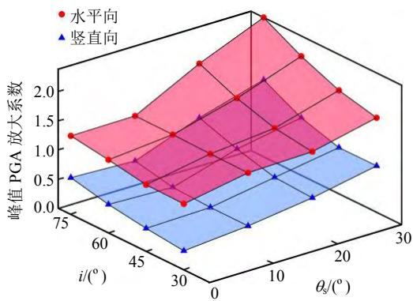

surface_3d

| \(\theta s/({}^{\circ})\) | \(i/({}^{\circ})\) | Peak PGA放大系数 (Horizontal) | Peak PGA放大系数 (Vertical) |
| --- | --- | --- | --- |
| 0 | 75 | ~1.25 | ~0.55 |
| 0 | 60 | ~0.85 | ~0.10 |
| 0 | 45 | ~0.45 | ~-0.25 |
| 0 | 30 | ~0.10 | ~-0.60 |
| 10 | 75 | ~1.60 | ~0.85 |
| 10 | 60 | ~1.25 | ~0.40 |
| 10 | 45 | ~0.95 | ~-0.15 |
| 10 | 30 | ~0.65 | ~-0.45 |
| 20 | 75 | ~2.25 | ~1.60 |
| 20 | 60 | ~1.90 | ~1.05 |
| 20 | 45 | ~1.40 | ~0.55 |
| 20 | 30 | ~1.00 | ~0.20 |
| 30 | 75 | ~1.55 | ~1.55 |
| 30 | 60 | ~1.35 | ~1.05 |
| 30 | 45 | ~1.00 | ~0.75 |
| 30 | 30 | ~0.75 | ~0.75 |

图 9 SV波入射下的峰值 PGA 放大系数的分布  
Fig.9 Distributions of peak values of PGA amplification factors under SV wave incidence

## 3.3 P 波入射下的结果

图10给出了在不同入射角的地震P波激励下，边坡竖向和水平 PGA 放大系数沿边坡表面的分布曲线。可以看出，随着坡角的增加，竖向 PGA 放大系数的峰值从坡顶逐渐向坡顶后方偏移。当 P波入射角 $\theta _ { \mathrm { p } }$ 在 $0 ^ { \mathrm { o } } \sim 4 0 ^ { \mathrm { o } }$ 的范围时，竖向放大系数峰值向坡顶后方偏移的距离较短，且其大小随坡角的增加没有产生明显差异；当 P波入射角 $\theta _ { \mathrm { p } } = 6 0 ^ { \circ }$ 时，竖向放大系数的峰值产生明显后移，位置出现在坡顶后方 $6 h { \sim } 7 h$ 的位置，且其大小随坡角的增大而显著增长。由此可见，地震P波入射下，使边坡的竖向放大发生显著变化的入射角可能存在相应的阈值，超过此阈值会使边坡的竖向放大效应迅速增强。

P波入射下边坡的水平PGA放大系数 $\mathrm { H A F _ { p } }$ 的分布及衰减特征与 SV 波入射下的类似，不同之处在于 $\mathrm { H A F _ { p } }$ 整体上随入射角的增加而迅速增大。例如， $\theta _ { \mathrm { p } } = 0 ^ { \circ }$ 时， $\mathrm { H A F _ { p } }$ 的峰值仅在 0.2～0.3 左右，而当 $\theta _ { \mathrm { p } } = 6 0 ^ { \circ }$ 时， $\mathrm { H A F _ { p } }$ 的峰值快速增长到了 3.1～4.0。因此，在研究地震 P波垂直入射的影响时，其水平放大效应可以忽略，而考虑斜入射的影响时，地震P 波所引起的水平放大效应占据主导地位需要着重考虑。

通过将数值计算得到的 PGA 放大系数与规范的建议值（图10 中的阶梯状红色实线）进行对比发现：竖向 PGA 放大系数基本在规范建议值的范围内，但在 P波大角度 $( \theta _ { \mathrm { p } } = 6 0 ^ { \circ } \ )$ ）斜入射陡坡 $( i > 4 5$ º）时，在坡顶后方 $2 . 5 h { \sim } 4 . 0 h$ 的范围内 $\mathrm { V A F _ { p } }$ 的峰值比规范建议值偏大；水平 PGA 放大系数在 P 波入射角 $\theta _ { \mathrm { p } } \leqslant 4 0 ^ { \circ }$ 时与《规范》[31]建议的范围吻合较好，但在 $\theta _ { \mathrm { p } } = 6 0$ 时，水平 PGA放大系数比规范建议值大 1～2 倍。因此，建议《规范》[31]在考虑 P波入射下边坡的水平和竖向放大效应时，应当根据入射角的大小进行分类，同时对边坡坡角进行细分，避免造成放大系数的过大或过小估计。

图 11 给出了地震 P 波激励下，边坡水平和竖向 PGA 放大系数的峰值随入射角和坡角的变化，表3给出了P波的不同入射条件下边坡表面的峰值PGA放大系数，可以看出：

（1）水平 PGA 放大系数的峰值随着 P 波入射角的增大而显著增大，其值的变化范围在 0.256～3.982 之间。  
（2）竖向 PGA 放大系数的峰值总体上变化不大，其值的变化范围在1.097～1.532之间。  
（3）P 波入射角在 $0 ^ { \mathrm { o } } \sim 2 0 ^ { \mathrm { o } }$ 时，以竖向放大为主，而入射角在 $4 0 ^ { \mathrm { o } } \sim 6 0 ^ { \mathrm { o } }$ 时，以水平放大为主。

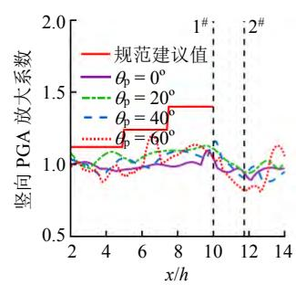

line

| x/h | 规范建议值 | \(\theta p = 0{}^{\circ}\) | \(\theta p = 20{}^{\circ}\) | \(\theta p = 40{}^{\circ}\) | \(\theta p = 60{}^{\circ}\) |
| --- | --- | --- | --- | --- | --- |
| 2 | ~1.13 | ~1.05 | ~1.05 | ~1.05 | ~1.05 |
| 4 | ~1.13 | ~0.98 | ~1.08 | ~1.05 | ~0.92 |
| 6 | ~1.25 | ~0.98 | ~1.05 | ~1.05 | ~0.95 |
| 8 | ~1.40 | ~1.02 | ~1.12 | ~1.12 | ~1.12 |
| 10 | ~1.40 | ~1.05 | ~1.15 | ~1.15 | ~1.15 |
| 12 | ~1.40 | ~0.92 | ~0.95 | ~0.95 | ~0.85 |
| 14 | ~1.40 | ~0.98 | ~1.00 | ~1.00 | ~1.00 |

(a) i = 30º

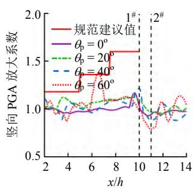

line

| x/h | 规范建议值 | \(\theta p = 0{}^{\circ}\) | \(\theta p = 20{}^{\circ}\) | \(\theta p = 40{}^{\circ}\) | \(\theta p = 60{}^{\circ}\) |
| --- | --- | --- | --- | --- | --- |
| 2 | 1.2 | ~1.0 | ~1.0 | ~1.0 | ~1.0 |
| 3 | 1.2 | ~1.0 | ~1.1 | ~1.0 | ~0.9 |
| 4 | 1.2 | ~1.0 | ~1.0 | ~1.0 | ~0.9 |
| 5 | 1.2 | ~1.0 | ~1.0 | ~1.0 | ~1.0 |
| 6 | 1.2 | ~1.0 | ~1.0 | ~1.0 | ~1.0 |
| 7 | 1.6 | ~1.0 | ~1.1 | ~1.0 | ~1.3 |
| 8 | 1.6 | ~1.0 | ~1.1 | ~1.0 | ~1.1 |
| 9 | 1.6 | ~1.0 | ~1.1 | ~1.0 | ~1.1 |
| 10 | 1.6 | ~1.2 | ~1.2 | ~1.2 | ~1.2 |
| 11 | 1.6 | ~0.9 | ~0.9 | ~0.9 | ~0.8 |
| 12 | 1.6 | ~0.9 | ~0.9 | ~0.9 | ~0.9 |
| 13 | 1.6 | ~1.0 | ~1.0 | ~0.9 | ~1.1 |
| 14 | 1.6 | ~1.0 | ~1.0 | ~0.9 | ~1.0 |

(b) i = 45º

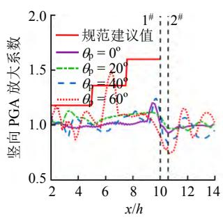

line

| x/h | 规范建议值 | \(\theta p = 0{}^{\circ}\) | \(\theta p = 20{}^{\circ}\) | \(\theta p = 40{}^{\circ}\) | \(\theta p = 60{}^{\circ}\) |
| --- | --- | --- | --- | --- | --- |
| 2 | 1.15 | 1.0 | 1.0 | 1.0 | 1.0 |
| 3 | 1.15 | ~1.0 | ~1.1 | ~1.0 | ~1.0 |
| 4 | 1.15 | ~1.0 | ~1.0 | ~1.0 | ~0.9 |
| 5 | 1.15 | ~1.0 | ~1.0 | ~1.0 | ~1.0 |
| 6 | 1.35 | ~1.0 | ~1.05 | ~1.0 | ~1.05 |
| 7 | 1.35 | ~1.0 | ~1.05 | ~1.05 | ~1.4 |
| 8 | 1.6 | ~1.05 | ~1.1 | ~1.05 | ~1.4 |
| 9 | 1.6 | ~1.05 | ~1.15 | ~1.05 | ~1.4 |
| 10 | 1.6 | ~1.2 | ~1.25 | ~1.25 | ~1.2 |
| 11 | 1.6 | ~0.95 | ~0.95 | ~0.95 | ~0.75 |
| 12 | 1.6 | ~1.0 | ~1.05 | ~1.05 | ~1.0 |
| 13 | 1.6 | ~1.0 | ~1.05 | ~1.05 | ~1.0 |
| 14 | 1.6 | ~1.0 | ~1.05 | ~1.05 | ~1.0 |

(c) i = 60º

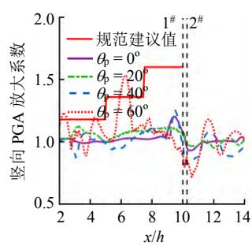

line

| x/h | 规范建议值 | \(\theta b = 0{}^{\circ}\) | \(\theta b = 20{}^{\circ}\) | \(\theta b = 40{}^{\circ}\) | \(\theta b = 60{}^{\circ}\) |
| --- | --- | --- | --- | --- | --- |
| 2 | ~1.2 | ~1.0 | ~1.0 | ~1.0 | ~1.0 |
| 3 | ~1.2 | ~1.0 | ~1.1 | ~1.0 | ~1.0 |
| 4 | ~1.2 | ~1.0 | ~1.0 | ~0.9 | ~1.0 |
| 5 | ~1.2 | ~1.0 | ~1.0 | ~1.0 | ~1.0 |
| 6 | ~1.4 | ~1.0 | ~1.1 | ~1.0 | ~1.0 |
| 7 | ~1.4 | ~1.0 | ~1.1 | ~1.0 | ~1.0 |
| 8 | ~1.6 | ~1.0 | ~1.1 | ~1.0 | ~1.0 |
| 9 | ~1.6 | ~1.0 | ~1.1 | ~1.0 | ~1.0 |
| 10 | ~0.8 | ~0.8 | ~0.8 | ~0.8 | ~0.8 |
| 11 | ~1.0 | ~1.0 | ~1.0 | ~1.0 | ~1.0 |
| 12 | ~1.0 | ~1.0 | ~1.0 | ~1.0 | ~1.0 |
| 13 | ~1.0 | ~1.0 | ~1.0 | ~1.0 | ~1.0 |
| 14 | ~1.0 | ~1.0 | ~1.0 | ~1.0 | ~1.0 |

(d) i = 75º

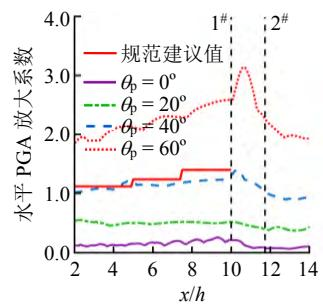

line

| x/h | 规范建议值 | \(\theta p = 0{}^{\circ}\) | \(\theta p = 20{}^{\circ}\) | \(\theta p = 40{}^{\circ}\) | \(\theta p = 60{}^{\circ}\) |
| --- | --- | --- | --- | --- | --- |
| 2 | ~1.15 | ~0.15 | ~0.6 | ~1.05 | ~2.0 |
| 4 | ~1.15 | ~0.15 | ~0.5 | ~1.1 | ~1.9 |
| 6 | ~1.3 | ~0.2 | ~0.55 | ~1.2 | ~2.3 |
| 8 | ~1.4 | ~0.25 | ~0.55 | ~1.25 | ~2.5 |
| 10 | ~1.4 | ~0.3 | ~0.55 | ~1.3 | ~2.6 |
| 12 | ~0.15 | ~0.15 | ~0.45 | ~1.0 | ~2.2 |
| 14 | ~0.15 | ~0.15 | ~0.45 | ~0.95 | ~2.0 |

(e) i = 30º

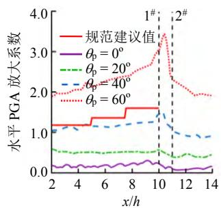

line

| x/h | 规范建议值 | \(\theta p = 0{}^{\circ}\) | \(\theta p = 20{}^{\circ}\) | \(\theta p = 40{}^{\circ}\) | \(\theta p = 60{}^{\circ}\) |
| --- | --- | --- | --- | --- | --- |
| 2 | ~1.2 | ~0.15 | ~0.6 | ~1.1 | ~1.9 |
| 3 | ~1.2 | ~0.15 | ~0.6 | ~1.1 | ~2.0 |
| 4 | ~1.2 | ~0.15 | ~0.6 | ~1.1 | ~2.0 |
| 5 | ~1.35 | ~0.15 | ~0.55 | ~1.2 | ~2.1 |
| 6 | ~1.35 | ~0.15 | ~0.55 | ~1.2 | ~2.2 |
| 7 | ~1.35 | ~0.15 | ~0.55 | ~1.25 | ~2.3 |
| 8 | ~1.65 | ~0.25 | ~0.55 | ~1.3 | ~2.5 |
| 9 | ~1.65 | ~0.25 | ~0.55 | ~1.35 | ~2.7 |
| 10 | ~1.65 | ~0.25 | ~0.6 | ~1.45 | ~3.4 |
| 11 | ~1.65 | ~0.15 | ~0.45 | ~1.2 | ~2.4 |
| 12 | ~1.65 | ~0.15 | ~0.45 | ~1.0 | ~2.2 |
| 13 | ~1.65 | ~0.15 | ~0.45 | ~0.95 | ~2.0 |
| 14 | ~1.65 | ~0.15 | ~0.45 | ~0.95 | ~2.0 |

(f) i = 45º

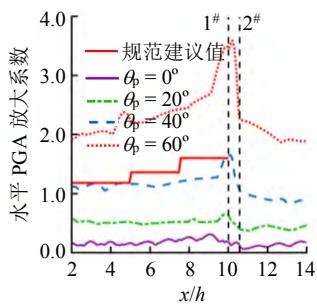

line

| x/h | 规范建议值 | \(\theta p = 0{}^{\circ}\) | \(\theta p = 20{}^{\circ}\) | \(\theta p = 40{}^{\circ}\) | \(\theta p = 60{}^{\circ}\) |
| --- | --- | --- | --- | --- | --- |
| 2 | ~1.2 | ~0.15 | ~0.6 | ~1.1 | ~2.0 |
| 4 | ~1.2 | ~0.15 | ~0.55 | ~1.15 | ~2.1 |
| 6 | ~1.4 | ~0.2 | ~0.55 | ~1.2 | ~2.3 |
| 8 | ~1.65 | ~0.25 | ~0.6 | ~1.3 | ~2.7 |
| 10 | ~1.7 | ~0.3 | ~0.7 | ~1.4 | ~3.7 |
| 12 | ~0.1 | ~0.1 | ~0.45 | ~1.0 | ~2.0 |
| 14 | ~0.15 | ~0.2 | ~0.45 | ~0.9 | ~1.9 |

(g) i = 60º

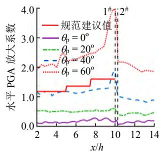

line

| x/h | 规范建议值 | \(\theta p = 0{}^{\circ}\) | \(\theta p = 20{}^{\circ}\) | \(\theta p = 40{}^{\circ}\) | \(\theta p = 60{}^{\circ}\) |
| --- | --- | --- | --- | --- | --- |
| 2 | ~1.2 | ~0.15 | ~0.55 | ~1.15 | ~2.0 |
| 4 | ~1.2 | ~0.15 | ~0.55 | ~1.15 | ~2.1 |
| 6 | ~1.4 | ~0.15 | ~0.55 | ~1.2 | ~2.3 |
| 8 | ~1.65 | ~0.25 | ~0.6 | ~1.3 | ~2.7 |
| 10 | ~1.65 | ~0.25 | ~0.6 | ~1.35 | ~3.9 |
| 12 | ~1.9 | ~0.25 | ~0.45 | ~0.95 | ~2.2 |
| 14 | ~1.9 | ~0.25 | ~0.45 | ~0.95 | ~2.2 |

(h) $i = 7 5 ^ { \mathrm { o } }$  
图 10 不同入射角的 P波入射下边坡表面的水平和竖向 PGA放大系数的分布

Fig.10 Distributions of horizontal and vertical PGA amplification factors along slope surfaces under P-wave incidence with different angles  
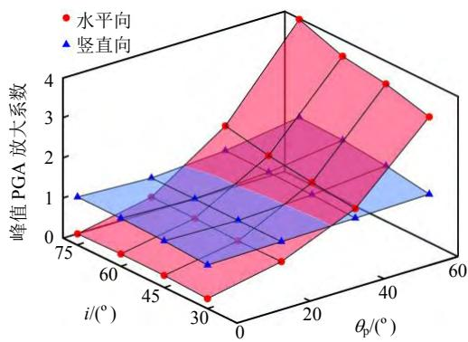

surface_3d

| \(i/({}^{\circ})\) | \(\theta p/({}^{\circ})\) | Peak PGA放大系数 (Horizontal) | Peak PGA放大系数 (Vertical) |
| --- | --- | --- | --- |
| 75 | 0 | ~0.1 | ~1.0 |
| 60 | 0 | ~0.2 | ~0.5 |
| 45 | 0 | ~0.3 | ~0.0 |
| 30 | 0 | ~0.4 | ~-0.5 |
| 75 | 20 | ~2.8 | ~1.5 |
| 60 | 20 | ~1.4 | ~0.5 |
| 45 | 20 | ~1.1 | ~0.0 |
| 30 | 20 | ~1.6 | ~-0.5 |
| 75 | 40 | ~4.5 | ~1.8 |
| 60 | 40 | ~2.0 | ~0.5 |
| 45 | 40 | ~1.4 | ~0.0 |
| 30 | 40 | ~1.8 | ~-0.5 |
| 75 | 60 | ~3.0 | ~1.1 |
| 60 | 60 | ~2.0 | ~0.5 |
| 45 | 60 | ~1.4 | ~0.0 |
| 30 | 60 | ~1.8 | ~-0.5 |

图 11 P 波入射下的 PGA放大系数及峰值  
Fig.11 Distributions of peak values of PGA amplification factors under P-wave incidence

表 3 P 波入射下峰值 PGA放大系数  
Table 3 Peak values of PGA amplification factors under P-wave incidence

<table><tr><td rowspan="2">方向</td><td rowspan="2">P波入射角/(°)</td><td colspan="4">放大系数</td></tr><tr><td>i=30°</td><td>i=45°</td><td>i=60°</td><td>i=75°</td></tr><tr><td rowspan="4">水平向</td><td>0</td><td>0.256</td><td>0.305</td><td>0.310</td><td>0.284</td></tr><tr><td>20</td><td>0.628</td><td>0.614</td><td>0.648</td><td>0.647</td></tr><tr><td>40</td><td>1.398</td><td>1.522</td><td>1.661</td><td>1.873</td></tr><tr><td>60</td><td>3.139</td><td>3.433</td><td>3.593</td><td>3.982</td></tr><tr><td rowspan="4">竖直向</td><td>0</td><td>1.097</td><td>1.168</td><td>1.202</td><td>1.204</td></tr><tr><td>20</td><td>1.128</td><td>1.125</td><td>1.131</td><td>1.124</td></tr><tr><td>40</td><td>1.161</td><td>1.213</td><td>1.243</td><td>1.253</td></tr><tr><td>60</td><td>1.207</td><td>1.384</td><td>1.493</td><td>1.532</td></tr></table>

## 4 边坡动力响应的频谱分析

## 4.1 SV波入射下的结果

## 4.1.1 坡顶及坡后的傅里叶谱

以 $i = 4 5 ^ { \mathrm { o } }$ 的边坡为例，图12 给出了不同角度的 SV波入射下，边坡坡顶及坡顶后方500 m处监测点水平和竖向加速度的傅里叶幅值谱。用于加载的 El Centro 地震波的主频为 1.7 Hz，在图中用竖向的虚线标记。可以看到，由于 SV 波的传播方向与振动方向垂直，因此在垂直入射或小角度斜入射时，相同条件下坡面水平向的振动会明显强于竖直向。表 4 统计了地震 SV 波入射下坡顶加速度傅里叶幅值谱的峰值。

SV 波入射下，坡顶水平和竖向加速度的主频受斜入射角度的影响较小，其值均在入射波主频附近。坡顶后方监测点的水平加速度傅里叶幅值整体上较坡顶处的有所下降。随着入射角的增大，坡顶处水平加速度的傅里叶谱幅值和形状均没有发生明显改变。坡顶竖向加速度的傅里叶谱的幅值随着入射角的增大而明显增大。坡顶后方监测点竖向加速度的傅里叶谱幅值与坡顶处相比并没有显著下降，反而在某些情况下 $( \theta _ { \mathrm { s } } = 1 0 ^ { \mathrm { o } } \textrm { , } 2 0 ^ { \mathrm { o } } \textrm { ) }$ ）其高频部分 $( 5 \sim$ 9 Hz）的傅里叶幅值比坡顶处的更大。

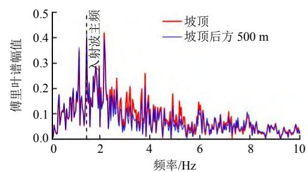

line

| 频率/Hz | 坡顶 (傅里叶谱幅值) | 坡顶后方 500 m (傅里叶谱幅值) |
| --- | --- | --- |
| 0 | ~0.02 | ~0.03 |
| 1 | ~0.15 | ~0.18 |
| 2 | ~0.42 | ~0.43 |
| 3 | ~0.18 | ~0.15 |
| 4 | ~0.26 | ~0.22 |
| 5 | ~0.12 | ~0.10 |
| 6 | ~0.14 | ~0.12 |
| 7 | ~0.08 | ~0.07 |
| 8 | ~0.06 | ~0.05 |
| 9 | ~0.04 | ~0.03 |
| 10 | ~0.03 | ~0.02 |

(a) 水平向， $\theta _ { \mathrm { { s } } } = 0 ^ { \mathrm { { o } } }$

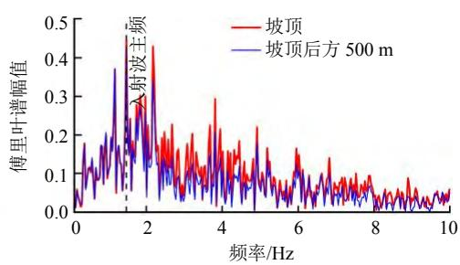

line

| 频率/Hz | 坡顶 (傅里叶谱幅值) | 坡顶后方 500 m (傅里叶谱幅值) |
| --- | --- | --- |
| 0 | ~0.05 | ~0.05 |
| 1.5 | ~0.48 | ~0.38 |
| 2 | ~0.32 | ~0.28 |
| 4 | ~0.30 | ~0.22 |
| 6 | ~0.17 | ~0.12 |
| 8 | ~0.08 | ~0.05 |
| 10 | ~0.06 | ~0.05 |

(b) 水平向， $\theta _ { \mathrm { s } } = 1 0 ^ { \mathrm { o } }$

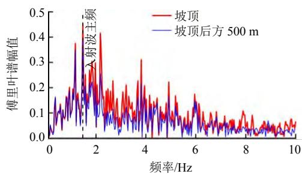

line

| 频率/Hz | 坡顶 (傅里叶谱幅值) | 坡顶后方 500 m (傅里叶谱幅值) |
| --- | --- | --- |
| 0 | ~0.03 | ~0.02 |
| 1.5 | ~0.45 | ~0.38 |
| 2 | ~0.42 | ~0.25 |
| 4 | ~0.31 | ~0.18 |
| 6 | ~0.17 | ~0.14 |
| 8 | ~0.11 | ~0.05 |
| 10 | ~0.06 | ~0.03 |

(c) 水平向， $\theta _ { \mathrm { s } } = 2 0 ^ { \circ }$

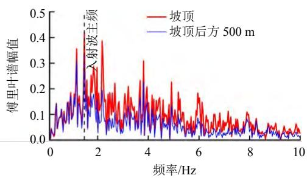

line

| 频率/Hz | 坡顶 (傅里叶谱幅值) | 坡顶后方 500 m (傅里叶谱幅值) |
| --- | --- | --- |
| 0 | ~0.02 | ~0.03 |
| 1 | ~0.18 | ~0.15 |
| 2 | ~0.25 | ~0.12 |
| 4 | ~0.15 | ~0.10 |
| 6 | ~0.08 | ~0.05 |
| 8 | ~0.05 | ~0.03 |
| 10 | ~0.03 | ~0.02 |

(d) 水平向， $\theta _ { \mathrm { s } } = 3 0 ^ { \mathrm { o } }$

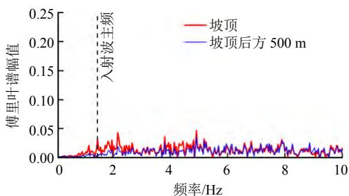

line

| 频率/Hz | 坡顶 (傅里叶谱幅值) | 坡顶后方 500 m (傅里叶谱幅值) |
| --- | --- | --- |
| 0 | ~0.00 | ~0.00 |
| 1 | ~0.01 | ~0.00 |
| 2 | ~0.03 | ~0.01 |
| 3 | ~0.02 | ~0.01 |
| 4 | ~0.02 | ~0.01 |
| 5 | ~0.03 | ~0.02 |
| 6 | ~0.02 | ~0.01 |
| 7 | ~0.02 | ~0.01 |
| 8 | ~0.02 | ~0.02 |
| 9 | ~0.01 | ~0.01 |
| 10 | ~0.02 | ~0.01 |

(e) 竖直向， $\theta _ { \mathrm { { s } } } = 0 ^ { \mathrm { { o } } }$

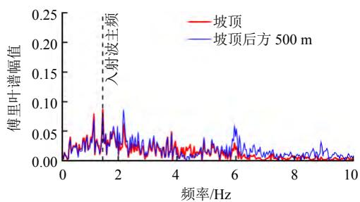

line

| 频率/Hz | 坡顶 (傅里叶谱幅值) | 坡顶后方 500 m (傅里叶谱幅值) |
| --- | --- | --- |
| 0 | ~0.01 | ~0.01 |
| 1.5 | ~0.09 | ~0.08 |
| 2 | ~0.03 | ~0.04 |
| 4 | ~0.03 | ~0.02 |
| 6 | ~0.03 | ~0.06 |
| 8 | ~0.01 | ~0.02 |
| 10 | ~0.01 | ~0.01 |

(f) 竖直向， $\theta _ { \mathrm { s } } = 1 0 ^ { \mathrm { o } }$

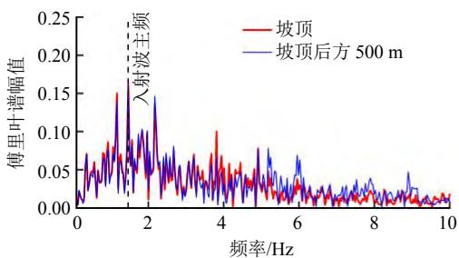

line

| 频率/Hz | 坡顶 (傅里叶谱幅值) | 坡顶后方 500 m (傅里叶谱幅值) |
| --- | --- | --- |
| 0 | ~0.01 | ~0.01 |
| 1.2 | ~0.15 | ~0.14 |
| 1.6 | ~0.18 | ~0.17 |
| 2.2 | ~0.14 | ~0.14 |
| 3.9 | ~0.10 | ~0.09 |
| 5.8 | ~0.03 | ~0.04 |
| 7.8 | ~0.02 | ~0.03 |
| 9.8 | ~0.02 | ~0.02 |

(g) 竖直向， $\theta _ { \mathrm { s } } = 2 0 ^ { \mathrm { o } }$

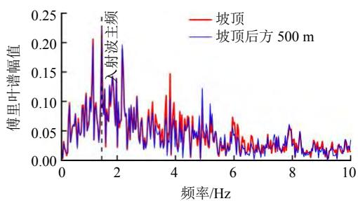

line

| 频率/Hz | 坡顶 (傅里叶谱幅值) | 坡顶后方 500 m (傅里叶谱幅值) |
| --- | --- | --- |
| 0 | ~0.01 | ~0.01 |
| 1 | ~0.21 | ~0.23 |
| 2 | ~0.14 | ~0.19 |
| 3 | ~0.08 | ~0.07 |
| 4 | ~0.15 | ~0.06 |
| 5 | ~0.06 | ~0.12 |
| 6 | ~0.07 | ~0.04 |
| 7 | ~0.03 | ~0.03 |
| 8 | ~0.03 | ~0.06 |
| 9 | ~0.02 | ~0.02 |
| 10 | ~0.03 | ~0.04 |

(h) 竖直向， $\theta _ { \mathrm { s } } = 3 0 ^ { \circ }$  
图 12 不同角度 SV波入射下坡顶及坡顶后方监测点加速度的傅里叶谱  
Fig.12 Fourier spectra at the slope crest and the observation point behind the crest under SV-wave incidence

表 4 SV波入射下坡顶加速度傅里叶幅值谱的峰值  
Table 4 Peak values of the Fourier amplitude of the acceleration at the slope crest under SV-wave incidence

<table><tr><td rowspan="2">方向</td><td rowspan="2">SV波入射角/(°)</td><td colspan="4">加速度傅里叶幅值谱的峰值</td></tr><tr><td> $i = 30^{\circ}$ </td><td> $i = 45^{\circ}$ </td><td> $i = 60^{\circ}$ </td><td> $i = 75^{\circ}$ </td></tr><tr><td rowspan="4">水平向</td><td>0</td><td>0.407</td><td>0.419</td><td>0.435</td><td>0.454</td></tr><tr><td>10</td><td>0.438</td><td>0.445</td><td>0.459</td><td>0.476</td></tr><tr><td>20</td><td>0.438</td><td>0.450</td><td>0.459</td><td>0.471</td></tr><tr><td>30</td><td>0.408</td><td>0.418</td><td>0.432</td><td>0.441</td></tr><tr><td rowspan="4">竖直向</td><td>0</td><td>0.038</td><td>0.047</td><td>0.081</td><td>0.133</td></tr><tr><td>10</td><td>0.079</td><td>0.087</td><td>0.098</td><td>0.134</td></tr><tr><td>20</td><td>0.153</td><td>0.162</td><td>0.173</td><td>0.187</td></tr><tr><td>30</td><td>0.214</td><td>0.221</td><td>0.235</td><td>0.247</td></tr></table>

## 4.1.2 坡顶的谱放大

为了进一步得到频域范围内边坡地形对地震的放大程度，引入谱比曲线来定量分析和评估边坡的谱放大效应。由于 PGA 放大的峰值主要集中在坡顶附近，因此计算分析边坡的谱放大时以坡顶处的为例。参照巴振宁等[32]的定义，谱比定义为边坡地表地震动与输入地震动的傅里叶谱之比。需要注意的是，本文采用了一种常用的地震波谱平滑算法——Konno-Ohmachi 算法[33]对坡顶处的和输入的加速度傅里叶幅值谱进行平滑处理后再计算谱比，以便更清晰地反映谱比放大曲线的变化趋势。

图 13 给出了 i 分别为 $3 0 ^ { \mathrm { { o } } }$ 和 $7 5 ^ { \mathrm { { \circ } } }$ 的边坡坡顶处的水平和竖向谱比曲线。从图中可以看出，入射角和坡角均会对边坡坡顶的谱比曲线产生较大的影响，且水平向的谱放大显著大于竖直向的，这也与3.2节中的 PGA放大系数的分布特征相对应。水平向的谱比曲线在低频段（ $( < 3 \ : \mathrm { H z } )$ ）上呈上升趋势，在之后的频率范围内都呈波动状态，且其值在整个频段上都大于 1，即表现出对地震动的放大作用。对于竖向谱比曲线，在边坡坡度较缓时，竖向谱比随着入射角的增大而增大，但谱比曲线在整个频段上波动不大，且其值基本上小于 1，没有表现出明显的放大；在边坡坡度较陡时，竖向的谱比在 3～10 Hz的范围内表现出对地震动的放大效应。另外，对于陡坡来说，SV 波入射角越大，竖向开始产生放大（即竖向谱比等于1时）所对应的频率越小，如 $\theta _ { \mathrm { { s } } } = 0 ^ { \circ }$ 时，竖向开始产生放大所对应的频率大约为5.8 Hz，而 $\theta _ { \mathrm { { s } } } = 3 0 ^ { \circ }$ 时，其对应频率减小到约 2.4 Hz。总的来说，在分析地震 SV 波入射下岩质边坡的动力响应时，除了要考虑水平向的谱放大之外，对于陡坡还应考虑竖向的谱放大。

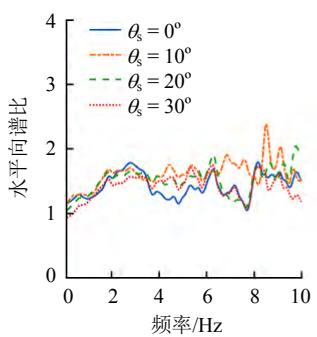

line

| 频率/Hz | \(\theta s=0{}^{\circ}\) | \(\theta s=10{}^{\circ}\) | \(\theta s=20{}^{\circ}\) | \(\theta s=30{}^{\circ}\) |
| --- | --- | --- | --- | --- |
| 0 | ~1.1 | ~1.1 | ~1.0 | ~1.0 |
| 2 | ~1.6 | ~1.6 | ~1.6 | ~1.5 |
| 4 | ~1.3 | ~1.6 | ~1.5 | ~1.5 |
| 6 | ~1.4 | ~1.7 | ~1.8 | ~1.5 |
| 8 | ~1.1 | ~1.5 | ~1.5 | ~1.3 |
| 10 | ~1.5 | ~1.6 | ~2.0 | ~1.2 |

(a) 水平向， $i = 3 0 ^ { \mathrm { o } }$

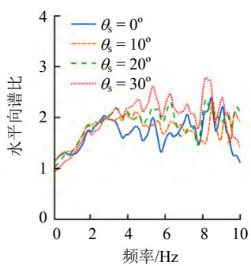

line

| 频率/Hz | \(\theta s = 0{}^{\circ}\) | \(\theta s = 10{}^{\circ}\) | \(\theta s = 20{}^{\circ}\) | \(\theta s = 30{}^{\circ}\) |
| --- | --- | --- | --- | --- |
| 0 | ~1.0 | ~1.0 | ~1.0 | ~1.0 |
| 2 | ~1.8 | ~1.8 | ~1.8 | ~1.8 |
| 4 | ~1.6 | ~2.0 | ~2.1 | ~2.1 |
| 6 | ~1.7 | ~1.9 | ~2.1 | ~2.3 |
| 8 | ~1.5 | ~1.5 | ~1.5 | ~2.7 |
| 10 | ~1.1 | ~1.9 | ~2.1 | ~1.5 |

(b) 水平向， $i = 7 5 ^ { \mathrm { o } }$

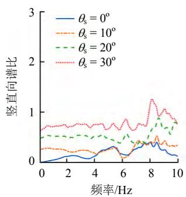

line

| 频率/Hz | \(\theta s = 0{}^{\circ}\) | \(\theta s = 10{}^{\circ}\) | \(\theta s = 20{}^{\circ}\) | \(\theta s = 30{}^{\circ}\) |
| --- | --- | --- | --- | --- |
| 0 | ~0.05 | ~0.25 | ~0.45 | ~0.65 |
| 2 | ~0.15 | ~0.25 | ~0.50 | ~0.70 |
| 4 | ~0.10 | ~0.20 | ~0.45 | ~0.75 |
| 6 | ~0.15 | ~0.15 | ~0.40 | ~0.75 |
| 8 | ~0.35 | ~0.45 | ~0.75 | ~1.25 |
| 10 | ~0.15 | ~0.35 | ~0.75 | ~0.85 |

(c) 竖直向，i = 30º

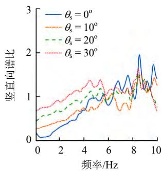

line

| 频率/Hz | \(\theta s=0{}^{\circ}\) | \(\theta s=10{}^{\circ}\) | \(\theta s=20{}^{\circ}\) | \(\theta s=30{}^{\circ}\) |
| --- | --- | --- | --- | --- |
| 0 | ~0.15 | ~0.25 | ~0.45 | ~0.7 |
| 1 | ~0.05 | ~0.35 | ~0.6 | ~0.8 |
| 2 | ~0.25 | ~0.45 | ~0.75 | ~0.95 |
| 3 | ~0.45 | ~0.6 | ~0.9 | ~1.1 |
| 4 | ~0.65 | ~0.75 | ~1.05 | ~1.25 |
| 5 | ~1.0 | ~0.85 | ~1.2 | ~1.35 |
| 6 | ~0.9 | ~1.05 | ~1.15 | ~1.1 |
| 7 | ~1.35 | ~0.85 | ~1.15 | ~1.15 |
| 8 | ~1.45 | ~1.15 | ~1.25 | ~1.2 |
| 9 | ~1.95 | ~1.35 | ~1.35 | ~1.3 |
| 10 | ~1.45 | ~1.25 | ~0.85 | ~0.7 |

(d) 竖直向， $i = 7 5 ^ { \mathrm { o } }$  
图 13 SV波入射下边坡坡顶水平和竖向傅里叶谱比曲线  
Fig.13 Horizontal and vertical spectral ratio curves at the slope crest under SV-wave incidence

图 14 显示了不同入射角下边坡坡顶水平和竖向谱比的峰值随坡角的变化。可以看出，坡顶水平峰值谱比总体上随着坡角的增大而增大。此外，SV波斜入射下水平向谱比的峰值总体上比垂直入射时大。相同坡角条件下，斜入射和垂直入射时水平峰值谱比的差异可达 0.5～1.2，若仅考虑地震 SV 波垂直入射可能会低估边坡坡顶处的谱放大效应。对于竖向，SV 波垂直入射时，竖向谱比峰值随坡角的增大持续增大；而 SV 波斜入射时，竖向谱比峰值随坡角的增大呈现先减小后增大的趋势。在坡角$i \geq 6 0 ^ { \mathrm { o } }$ 时，可不用考虑斜入射对竖向谱放大的影响，此时垂直入射所产生的放大是主要的。

## 4.2 P 波入射下的结果

## 4.2.1 坡顶及坡后的傅里叶谱

图 15 给出了不同角度的 P 波入射下， $i = 4 5 ^ { \mathrm { o } }$ 的边坡坡顶及坡顶后方500 m的水平和竖向傅里叶幅值谱的分布。表5 给出了地震 P波入射下坡顶加速度傅里叶幅值谱的峰值。可以明显看出，P 波入射角对坡顶的水平向和竖直向动力响应的影响均较大，其水平加速度傅里叶谱的幅值随入射角的增大而增大，而竖向加速度傅里叶谱的幅值随入射角的增大而减小。对于水平向来说，坡顶后方的傅里叶谱幅值整体上比坡顶处的小，而对于竖直向来说，二者没有显著差异。P 波入射下的坡顶加速度的主频基本不随入射角的改变而改变，与 SV 波入射时的规律类似。地震 P波垂直入射时，主要产生的是竖向振动，因此竖向加速度傅里叶谱的幅值远大于水平向的。而随着P波入射角的增大，坡顶水平加速度傅里叶幅值谱产生明显增大，且逐渐超过相同入射条件下的坡顶竖向加速度傅里叶谱的幅值。

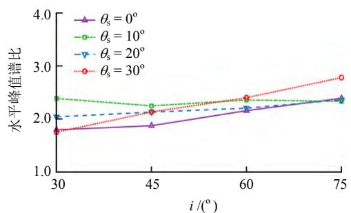

line

| \(i ({}^{\circ})\) | \(\theta s = 0{}^{\circ}\) | \(\theta s = 10{}^{\circ}\) | \(\theta s = 20{}^{\circ}\) | \(\theta s = 30{}^{\circ}\) |
| --- | --- | --- | --- | --- |
| 30 | ~1.75 | ~2.4 | ~2.0 | ~1.75 |
| 45 | ~1.85 | ~2.25 | ~2.15 | ~2.15 |
| 60 | ~2.15 | ~2.25 | ~2.2 | ~2.4 |
| 75 | ~2.4 | ~2.35 | ~2.4 | ~2.8 |

(a) 水平向  
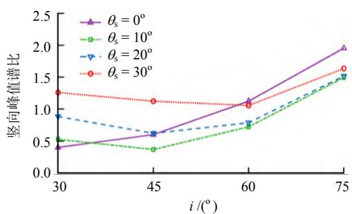

line

| \(i ({}^{\circ})\) | \(\theta s = 0{}^{\circ}\) | \(\theta s = 10{}^{\circ}\) | \(\theta s = 20{}^{\circ}\) | \(\theta s = 30{}^{\circ}\) |
| --- | --- | --- | --- | --- |
| 30 | ~0.4 | ~0.55 | ~0.9 | ~1.3 |
| 45 | ~0.65 | ~0.4 | ~0.65 | ~1.15 |
| 60 | ~1.15 | ~0.75 | ~0.8 | ~1.1 |
| 75 | 2.0 | 1.5 | 1.5 | 1.65 |

(b) 竖直向  
图 14 SV波入射下边坡坡顶水平和竖向的峰值谱比  
Fig.14 Variations of horizontal and vertical peak spectral ratios at the slope crest under SV-wave incidence

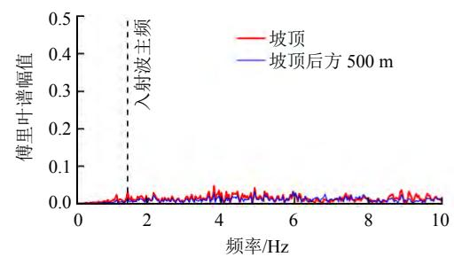

line

| 频率/Hz | 坡顶 (傅里叶谱幅值) | 坡顶后方 500 m (傅里叶谱幅值) |
| --- | --- | --- |
| 0 | ~0.01 | ~0.01 |
| 1.5 | ~0.03 | ~0.01 |
| 2 | ~0.02 | ~0.01 |
| 4 | ~0.04 | ~0.01 |
| 6 | ~0.03 | ~0.02 |
| 8 | ~0.02 | ~0.01 |
| 10 | ~0.02 | ~0.01 |

(a) 水平向， $\theta _ { \mathrm { p } } = 0 ^ { \mathrm { o } }$

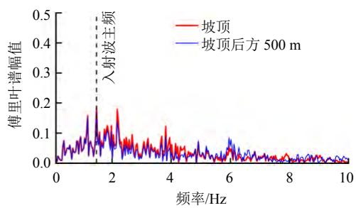

line

| 频率/Hz | 坡顶 (傅里叶谱幅值) | 坡顶后方 500 m (傅里叶谱幅值) |
| --- | --- | --- |
| ~1.5 | ~0.18 | ~0.16 |
| ~2.2 | ~0.18 | ~0.14 |
| ~3.9 | ~0.12 | ~0.08 |
| ~6.0 | ~0.08 | ~0.08 |

(b) 水平向， $\theta _ { \mathrm { p } } = 2 0 ^ { \mathrm { o } }$

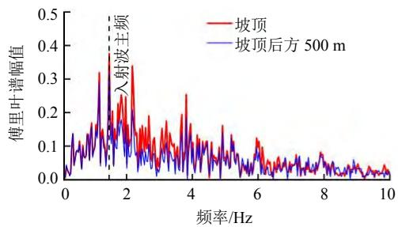

line

| 频率/Hz | 坡顶 (傅里叶谱幅值) | 坡顶后方 500 m (傅里叶谱幅值) |
| --- | --- | --- |
| 0 | ~0.02 | ~0.02 |
| 1.5 | ~0.38 | ~0.32 |
| 2 | ~0.25 | ~0.15 |
| 4 | ~0.25 | ~0.15 |
| 6 | ~0.12 | ~0.08 |
| 8 | ~0.08 | ~0.06 |
| 10 | ~0.03 | ~0.02 |

(c) 水平向， $\theta _ { \mathrm { p } } = 4 0 ^ { \circ }$

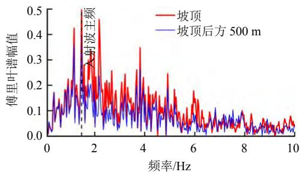

line

| 频率/Hz | 坡顶 (傅里叶谱幅值) | 坡顶后方 500 m (傅里叶谱幅值) |
| --- | --- | --- |
| 0 | ~0.03 | ~0.04 |
| 1 | ~0.22 | ~0.18 |
| 2 | ~0.47 | ~0.15 |
| 3 | ~0.15 | ~0.12 |
| 4 | ~0.35 | ~0.26 |
| 5 | ~0.18 | ~0.12 |
| 6 | ~0.18 | ~0.12 |
| 7 | ~0.08 | ~0.06 |
| 8 | ~0.08 | ~0.06 |
| 9 | ~0.06 | ~0.04 |
| 10 | ~0.06 | ~0.04 |

(d) 水平向， $\theta _ { \mathrm { p } } = 6 0 ^ { \mathrm { o } }$

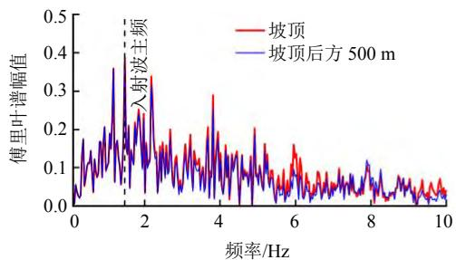

line

| 频率/Hz | 坡顶 (傅里叶谱幅值) | 坡顶后方 500 m (傅里叶谱幅值) |
| --- | --- | --- |
| 0 | ~0.04 | ~0.03 |
| 1.5 | ~0.40 | ~0.36 |
| 2 | ~0.25 | ~0.24 |
| 4 | ~0.29 | ~0.28 |
| 6 | ~0.16 | ~0.15 |
| 8 | ~0.12 | ~0.11 |
| 10 | ~0.04 | ~0.03 |

(e) 竖直向， $\theta _ { \mathrm { p } } = 0 ^ { \mathrm { o } }$

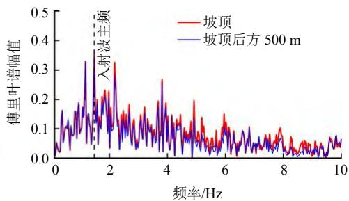

line

| 频率/Hz | 坡顶 (傅里叶谱幅值) | 坡顶后方 500 m (傅里叶谱幅值) |
| --- | --- | --- |
| 0 | ~0.04 | ~0.03 |
| 1.5 | ~0.18 | ~0.16 |
| 2 | ~0.32 | ~0.28 |
| 4 | ~0.27 | ~0.26 |
| 6 | ~0.15 | ~0.14 |
| 8 | ~0.10 | ~0.09 |
| 10 | ~0.06 | ~0.05 |

(f) 竖直向， $\theta _ { \mathrm { p } } = 2 0 ^ { \mathrm { o } }$

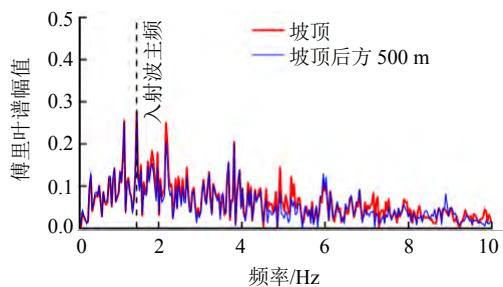

line

| 频率/Hz | 坡顶 (傅里叶谱幅值) | 坡顶后方 500 m (傅里叶谱幅值) |
| --- | --- | --- |
| 0 | ~0.02 | ~0.02 |
| 1.5 | ~0.28 | ~0.26 |
| 2.3 | ~0.25 | ~0.18 |
| 4 | ~0.20 | ~0.19 |
| 6 | ~0.13 | ~0.12 |
| 10 | ~0.03 | ~0.02 |

(g) 竖直向， $\theta _ { \mathrm { p } } = 4 0 ^ { \circ }$

line

| 频率/Hz | 坡顶 (傅里叶谱幅值) | 坡顶后方 500 m (傅里叶谱幅值) |
| --- | --- | --- |
| 0 | ~0.02 | ~0.02 |
| 1.5 | ~0.18 | ~0.16 |
| 2 | ~0.15 | ~0.14 |
| 4 | ~0.05 | ~0.06 |
| 6 | ~0.03 | ~0.04 |
| 8 | ~0.02 | ~0.02 |
| 10 | ~0.03 | ~0.02 |

(h) 竖直向， $\theta _ { \mathrm { p } } = 6 0 ^ { \mathrm { o } }$  
图 15 不同角度 P波入射下坡顶及坡顶后方监测点加速度的傅里叶谱  
Fig.15 Fourier spectra at the slope crest and the observation point behind the crest under P-wave incidence

表 5 P波入射下坡顶加速度傅里叶幅值谱的峰值  
Table 5 Peak values of the Fourier amplitude of the acceleration at the slope crest under P-wave incidence

<table><tr><td rowspan="2">方向</td><td rowspan="2">P波入射角/(°)</td><td colspan="4">加速度傅里叶幅值谱的峰值</td></tr><tr><td> $i = 30^{\text{o}}$ </td><td> $i = 45^{\text{o}}$ </td><td> $i = 60^{\text{o}}$ </td><td> $i = 75^{\text{o}}$ </td></tr><tr><td rowspan="4">水平向</td><td>0</td><td>0.046</td><td>0.048</td><td>0.045</td><td>0.043</td></tr><tr><td>20</td><td>0.179</td><td>0.186</td><td>0.189</td><td>0.192</td></tr><tr><td>40</td><td>0.363</td><td>0.376</td><td>0.388</td><td>0.399</td></tr><tr><td>60</td><td>0.485</td><td>0.505</td><td>0.523</td><td>0.538</td></tr><tr><td rowspan="4">竖直向</td><td>0</td><td>0.392</td><td>0.388</td><td>0.387</td><td>0.389</td></tr><tr><td>20</td><td>0.372</td><td>0.366</td><td>0.360</td><td>0.353</td></tr><tr><td>40</td><td>0.291</td><td>0.279</td><td>0.267</td><td>0.255</td></tr><tr><td>60</td><td>0.190</td><td>0.175</td><td>0.159</td><td>0.145</td></tr></table>

## 4.2.2 坡顶的谱放大

类似的，我们计算了 P 波入射下坡角为 $3 0 ^ { \mathrm { o } }$ 和75º的边坡坡顶的水平向和竖直向谱比，并绘制于图

16中。从图中可以看出，陡坡坡顶处的水平向和竖直向的谱比总体上均比缓坡坡顶处的大。相同坡角下，水平向的谱比随着P波入射角的增大而增大，而竖直向的谱比随着入射角的增大而减小。当入射角 $\theta _ { \mathrm { p } }$ 为 $0 ^ { \mathrm { o } } , ~ 2 0 ^ { \mathrm { o } }$ 时，水平向谱比总体上在整个频段范围内都小于 1，而竖直向谱比总体上在整个频段内都大于 1，即此时主要考虑竖向的谱放大而可以忽略水平向谱放大。当入射角 $\theta _ { \mathrm { p } }$ 为 40º、60º时，水平向谱比总体上在整个频段内都大于 1，即水平向的谱放大效应不可忽略，且水平向的谱放大效应随着入射角的增大显著增强；竖向谱比主要受边坡坡度的影响，主要表现在：坡度较缓时，竖向在整个频段上没有表现出较强的放大；坡度较陡时，竖向在8～10 Hz的高频范围内表现出较强的放大。

图 17 显示了不同入射角下边坡坡顶水平和竖向谱比的峰值随坡角的变化。可以看出，P 波垂直入射时，水平和竖向的峰值谱比随坡角的增大先增大后减小，而斜入射时其峰值谱比随坡角的增大呈增大的趋势。综上可知，在P波小角度入射时需主要考虑坡顶的竖向谱放大效应，而在 P波大角度入

line

| 频率/Hz | \(\theta p = 0{}^{\circ}\) | \(\theta p = 20{}^{\circ}\) | \(\theta p = 40{}^{\circ}\) | \(\theta p = 60{}^{\circ}\) |
| --- | --- | --- | --- | --- |
| 0 | ~0.05 | ~0.5 | ~0.9 | ~1.1 |
| 2 | ~0.1 | ~0.65 | ~1.3 | ~1.7 |
| 4 | ~0.25 | ~0.55 | ~1.2 | ~1.6 |
| 6 | ~0.4 | ~0.45 | ~1.1 | ~1.5 |
| 8 | ~0.3 | ~0.5 | ~1.2 | ~1.4 |
| 10 | ~0.5 | ~0.4 | ~1.1 | ~1.9 |

(a) i = 30º

line

| 频率/Hz | \(\theta p=0{}^{\circ}\) | \(\theta p=20{}^{\circ}\) | \(\theta p=40{}^{\circ}\) | \(\theta p=60{}^{\circ}\) |
| --- | --- | --- | --- | --- |
| 0 | ~0.05 | ~0.5 | ~1.0 | ~1.2 |
| 2 | ~0.15 | ~0.75 | ~1.5 | ~2.0 |
| 4 | ~0.25 | ~0.75 | ~1.6 | ~2.4 |
| 6 | ~0.25 | ~0.6 | ~1.5 | ~2.3 |
| 8 | ~0.35 | ~0.7 | ~1.6 | ~2.5 |
| 10 | ~0.35 | ~0.9 | ~1.1 | ~2.1 |

(b) i = 75º

line

| 频率/Hz | \(\theta p=0{}^{\circ}\) | \(\theta p=20{}^{\circ}\) | \(\theta p=40{}^{\circ}\) | \(\theta p=60{}^{\circ}\) |
| --- | --- | --- | --- | --- |
| 0 | ~1.15 | ~1.10 | ~0.85 | ~0.55 |
| 2 | ~1.35 | ~1.25 | ~1.00 | ~0.65 |
| 4 | ~1.50 | ~1.45 | ~1.15 | ~0.75 |
| 6 | ~1.60 | ~1.40 | ~1.25 | ~0.65 |
| 8 | ~1.65 | ~1.35 | ~1.15 | ~0.60 |
| 10 | ~1.30 | ~1.60 | ~1.05 | ~0.95 |

(c) i = 30º

line

| 频率/Hz | \(\theta p = 0{}^{\circ}\) | \(\theta p = 20{}^{\circ}\) | \(\theta p = 40{}^{\circ}\) | \(\theta p = 60{}^{\circ}\) |
| --- | --- | --- | --- | --- |
| 0 | ~1.2 | ~1.15 | ~0.85 | ~0.55 |
| 1 | ~1.3 | ~1.2 | ~0.9 | ~0.55 |
| 2 | ~1.35 | ~1.25 | ~0.9 | ~0.5 |
| 3 | ~1.5 | ~1.35 | ~0.95 | ~0.45 |
| 4 | ~1.6 | ~1.45 | ~0.95 | ~0.3 |
| 5 | ~1.65 | ~1.5 | ~1.1 | ~0.6 |
| 6 | ~1.7 | ~1.6 | ~1.3 | ~0.8 |
| 7 | ~1.4 | ~1.45 | ~1.2 | ~0.6 |
| 8 | ~1.0 | ~1.9 | ~1.6 | ~0.7 |
| 9 | ~2.0 | ~2.3 | ~1.7 | ~1.3 |
| 10 | ~1.6 | ~1.8 | ~1.6 | ~1.4 |

(d) $i = 7 5 ^ { \mathrm { o } }$

图 16 P波入射下边坡坡顶水平和竖向傅里叶谱比曲线  
Fig.16 Horizontal and vertical spectral ratio curves at the slope crest under P-wave incidence  

line

| \(坡角/({}^{\circ})\) | \(\theta p=0{}^{\circ}\) | \(\theta p=20{}^{\circ}\) | \(\theta p=40{}^{\circ}\) | \(\theta p=60{}^{\circ}\) |
| --- | --- | --- | --- | --- |
| 30 | ~0.75 | ~0.75 | ~1.8 | ~2.0 |
| 45 | ~1.0 | ~0.8 | ~1.6 | ~2.15 |
| 60 | ~0.85 | ~0.95 | ~1.7 | ~2.4 |
| 75 | ~0.45 | ~0.9 | ~1.9 | ~2.6 |

(a) 水平向

line

| \(坡角/({}^{\circ})\) | \(\theta p=0{}^{\circ}\) | \(\theta p=20{}^{\circ}\) | \(\theta p=40{}^{\circ}\) | \(\theta p=60{}^{\circ}\) |
| --- | --- | --- | --- | --- |
| 30 | ~1.9 | ~1.8 | ~1.4 | ~1.0 |
| 45 | ~2.2 | ~2.2 | ~1.6 | ~1.0 |
| 60 | ~2.3 | ~2.3 | ~1.8 | ~1.1 |
| 75 | ~2.1 | ~2.4 | ~1.9 | ~1.5 |

(b) 竖直向  
图 17 P波入射下边坡坡顶水平和竖向的峰值谱比  
Fig.17 Variations of horizontal and vertical peak spectral ratios at the slope crest under P-wave incidence

射时需主要考虑坡顶的水平向谱放大效应。

## 5 结 论

本文采用黏弹性人工边界和等效节点力方法，建立了可以考虑地震波斜入射的岩质边坡有限元模型，系统调查了边坡坡角、地震波入射角及入射波类型对边坡地形放大效应的影响，主要得出以下结论：

（1）边坡坡角、地震波入射角及入射波类型均对边坡的地形放大效应有较大影响。地震 SV 波入射下，水平和竖向 PGA 放大系数的峰值均出现在坡顶附近，其值随着地震波入射角和坡角的增大而增大。地震 P 波入射下，水平 PGA 放大系数的峰值出现在坡顶附近，其值随着坡角和入射角的增大而增大，而竖向 PGA 放大系数的峰值在坡顶和坡顶后方一定距离的范围内均有出现。

（2）通过比较地震波垂直入射和斜入射下的PGA放大系数发现，若仅考虑垂直入射的情况，边坡放大效应可能会被严重低估。  
（3）基于本文研究结果与相关规范的比较发现：目前规范在某些情况下低估了边坡地形效应的影响，建议考虑地震波入射角及入射波类型对重要工程局部突出地形地震响应的影响，并细化放大系数对坡度的规定。

（4）地震波入射角对坡顶加速度傅里叶谱的主频影响较小，而对其幅值影响较大。SV波入射下，随着入射角的增大，坡顶水平向加速度傅里叶谱幅值整体上变化不显著而竖向幅值逐渐增大；P 波入射下，随着入射角的增大，坡顶竖向傅里叶谱幅值逐渐减小而水平向幅值逐渐增大。

（5）地震 SV 波入射时，坡顶以水平向的谱放大效应为主，同时对于陡坡坡顶的竖向谱放大效应也应当关注；而地震P波入射下，应主要考虑P波小角度入射时坡顶的竖向谱放大效应以及P波大角度入射时坡顶的水平向谱放大效应。

## 参 考 文 献

[1] ASSIMAKI D, GAZETAS G, KAUSEL E. Effects of local soil conditions on the topographic aggravation of seismic motion: parametric investigation and recorded field evidence from the 1999 Athens earthquake[J]. Bulletin of the Seismological Society of America, 2005, 95(3): 1059-1089.  
[2] HE J, QI S, WANG Y, et al. Seismic response of the Lengzhuguan slope caused by topographic and geological effects[J]. Engineering Geology, 2020, 265: 105431.  
[3] ZHANG Z, FLEURISSON J A, PELLET F L. A case study of site effects on seismic ground motions at Xishan Park ridge in Zigong, Sichuan, China[J]. Engineering Geology, 2018, 243: 308-319.  
[4] 罗永红, 王运生. 汶川地震诱发山地斜坡震动的地形 放大效应[J]. 山地学报, 2013, 31(2): 200-210. LUO Yong-hong, WANG Yun-sheng. Mountain slope ground motion topography amplification effect induced by Wenchuan earthquake[J]. Journal of Mountain Science, 2013, 31(2): 200-210.  
[5] SEPÚLVEDA S A, MURPHY W, JIBSON R W, et al. Seismically induced rock slope failures resulting from topographic amplification of strong ground motions: the case of Pacoima Canyon, California[J]. Engineering Geology, 2005, 80(3-4): 336-348.  
[6] VEERARAGHAVAN S, COLEMAN J L, BIELAK J. Simulation of site and topographic effects on ground motion in Los Alamos, NM mesas[J]. Geophysical Journal International, 2020, 220(3): 1504-1520.  
[7] 吴多华, 刘亚群, 李海波, 等. 地震荷载作用下顺层岩体边坡动力放大效应和破坏机制的振动台试验研究[J].岩石力学与工程学报, 2020, 39(10): 1945-1956.WU Duo-hua, LIU Ya-qun, LI Hai-bo, et al. Shaking tabletests on seismic amplification and failure mechanism of a  
layered rock slope[J]. Chinese Journal of Rock Mechanics and Engineering, 2020, 39(10): 1945-1956.  
[8] 杨长卫, 张建经, 刘飞成. 双面岩质高陡边坡加速度高 程放大效应的时频分析方法[J]. 岩石力学与工程学报, 2014, 33(增刊 2): 3699-3706. YANG Chang-wei, ZHANG Jian-jing, LIU Fei-cheng. Time-frequency analysis method of amplification effect of acceleration of high and steep hill with two-side rock slopes[J]. Chinese Journal of Rock Mechanics and Engineering, 2014, 33(Suppl.2): 3699-3706.  
[9] SONG D, LIU X, HUANG J, et al. Seismic cumulative failure effects on a reservoir bank slope with a complex geological structure considering plastic deformation characteristics using shaking table tests[J]. Engineering Geology, 2021, 286: 106085.  
[10] BOUCKOVALAS G D, PAPADIMITRIOU A G. Numerical evaluation of slope topography effects on seismic ground motion[J]. Soil Dynamics and Earthquake Engineering, 2005, 25(7-10): 547-558.  
[11] ZHANG Z, FLEURISSON J A, PELLET F. The effects of slope topography on acceleration amplification and interaction between slope topography and seismic input motion[J]. Soil Dynamics and Earthquake Engineering, 2018, 113: 420-431.  
[12] LI H, LIU Y, LIU L, et al. Numerical evaluation of topographic effects on seismic response of single-faced rock slopes[J]. Bulletin of Engineering Geology and the Environment, 2019, 78(3): 1873-1891.  
[13] ALFARO P, DELGADO J, GARCÍA-TORTOSA F J, et al. The role of near-field interaction between seismic waves and slope on the triggering of a rockslide at Lorca (SE Spain)[J]. Natural Hazards and Earth System Sciences, 2012, 12(12): 3631-3643.  
[14] SIGAKI T, KIYOHARA K, SONO Y, et al. Estimation of earthquake motion incident angle at rock site[C]// Proceedings of 12th World Conference on Earthquake Engineering. Auckland: [s. n.], 2000.  
[15] 黄润秋. 汶川8.0级地震触发崩滑灾害机制及其地质力 学模式[J]. 岩石力学与工程学报, 2009, 28(6): 1239-1249. HUANG Run-qiu. Mechanism and geomechanical modes of landslide hazards triggered by wenchuan 8.0 earthquake[J]. Chinese Journal of Rock Mechanics and Engineering, 2009, 28(6): 1239-1249.  
[16] 黄润秋, 李为乐. 汶川大地震触发地质灾害的断层效应分析[J]. 工程地质学报, 2009, 17(1): 19-28.HUANG Run-qiu, LI Wei-le. Fault effect analysis of  
geo-hazard trigged by wenchuan earthquake[J]. Journal of Engineering Geology, 2009, 17(1): 19-28.  
[17] XU Q, ZHANG S, LI W. Spatial distribution of large-scale landslides induced by the 5.12 Wenchuan earthquake[J]. Journal of Mountain Science, 2011, 8(2): 246-260.  
[18] ZHAO B, WANG Y S, SU L J, et al. Directional seismic response to the complex topography: a case study of 2013 Lushan Ms 7.0 earthquake[J]. Journal of Mountain Science, 2020, 17(9): 2049-2067.  
[19] PACOR F, GALLOVIČ F, PUGLIA R, et al. Diminishing high-frequency directivity due to a source effect: empirical evidence from small earthquakes in the Abruzzo region, Italy[J]. Geophysical Research Letters, 2016, 43(10): 5000-5008.  
[20] 丁海平, 于彦彦, 郑志法. P 波斜入射陡坎地形对地面 运动的影响[J]. 岩土力学, 2017, 38(6): 1716-1724, 1732. DING Hai-ping, YU Yan-yan, ZHENG Zhi-fa. Effects of scarp topography on seismic ground motion under inclined P waves[J]. Rock and Soil Mechanics, 2017, 38(6): 1716-1724, 1732.  
[21] FAN G, ZHANG L M, LI X Y, et al. Dynamic response of rock slopes to oblique incident SV waves[J]. Engineering Geology, 2018, 247: 94-103.  
[22] 尹超, 李伟华, 赵成刚. SV 波斜入射下坡体地形放大 效应的研究[J]. 振动工程学报, 2020, 33(5): 971-984. YIN Chao, LI Wei-hua, ZHAO Cheng-gang. Research of slope topographic amplification subjected to obliquely incident SV-waves[J]. Journal of Vibration Engineering, 2020, 33(5): 971-984.  
[23] 车伟, 罗奇峰. 复杂地形条件下地震波的传播研究[J]. 岩土工程学报, 2008, 30(9): 1333-1337. CHE Wei, LUO Qi-feng. Seismic wave propagation in complex topography[J]. Chinese Journal of Geotechnical Engineering, 2008, 30(9): 1333-1337.  
[24] 周国良, 李小军, 侯春林, 等. SV波入射下河谷地形地 震动分布特征分析[J]. 岩土力学, 2012, 33(4): 1161- 1166. ZHOU Guo-liang, LI Xiao-jun, HOU Chun-lin, et al. Characteristic analysis of ground motions of canyon topography under incident SV seismic waves[J]. Rock and Soil Mechanics, 2012, 33(4): 1161-1166.  
[25] 杜修力, 赵密, 王进廷. 近场波动模拟的一种应力人工边界[J]. 力学学报, 2006, 38(1): 49-56.DU Xiu-li, ZHAO Mi, WANG Jin-ting. A stress boundaryin FEA for near-field wave problem[J]. Chinese Journalof Theoretical and Applied Mechanics, 2006, 38(1):  
49-56.  
[26] 黄景琦, 杜修力, 田志敏, 等. 斜入射 SV 波对地铁车站地震响应的影响[J]. 工程力学, 2014, 31(9): 81-88,103.HUANG Jing-qi, DU Xiu-li, TIAN Zhi-min, et al. Effectof the oblique incidence of seismic SV waves on the seismicresponse of subway station structure[J]. EngineeringMechanics, 2014, 31(9): 81-88, 103.  
[27] 杜修力, 黄景琦, 赵密, 等. SV波斜入射对岩体隧道洞身段地震响应影响研究[J]. 岩土工程学报, 2014, 36(8):1400-1406.DU Xiu-li, HUANG Jing-qi, ZHAO Mi, et al. Effect ofoblique incidence of SV waves on seismic response ofportal sections of rock tunnels[J]. Chinese Journal ofGeotechnical Engineering, 2014, 36(8): 1400-1406.  
[28] HUANG J, ZHAO X, ZHAO M, et al. Effect of peak ground parameters on the nonlinear seismic response of long lined tunnels[J]. Tunnelling and Underground Space Technology, 2020, 95: 103175.  
[29] 杜修力. 工程波动理论与方法[M]. 北京: 科学出版社,2009.DU Xiu-li. Theories and methods of wave motion forengineering[M]. Beijing: Science Press, 2009.  
[30] KUHLEMEYER R L, LYSMER J. Finite element method accuracy for wave propagation problems[J]. Journal of the Soil Mechanics and Foundations Division, 1973, 99(5): 421-427.  
[31] 中华人民共和国住房和城乡建设部. GB50011―2010 建筑抗震设计规范[S]. 北京: 中国建筑工业出版社, 2016. Ministry of Housing and Urban-Rural Development of the People’s Republic of China. GB50011―2010 Code for seismic design of buildings[S]. Beijing: China Architecture and Building Press, 2016.  
[32] 巴振宁, 吴孟桃, 梁建文. 坡体几何参数与弹性模量对 岩质斜坡地震动力响应的影响: IBEM 求解[J]. 岩石力 学与工程学报, 2019, 38(8): 1578-1592. BA Zhen-ning, WU Meng-tao, LIANG Jian-wen. Influence of geometric parameters and elastic modulus on seismic dynamic response of rock slopes by IBEM[J]. Chinese Journal of Rock Mechanics and Engineering, 2019, 38(8): 1578-1592.  
[33] KONNO K, OHMACHI T. Ground-motion characteristics estimated from spectral ratio between horizontal and vertical components of microtremor[J]. Bulletin of the Seismological Society of America, 1998, 88(1): 228-241.