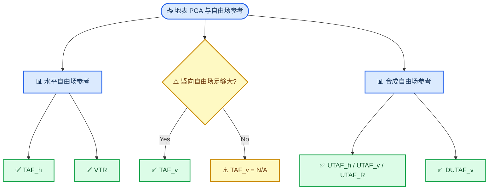

# TAF 定义与竖向归一化方案

_用于 Hybrid 坡地地表响应后处理与论文方法口径选择，版本 v1。_

---

## 📋 核心结论

竖向 TAF 的困难不在代码，而在分母含义。若定义为“竖向地形响应 / 竖向自由场响应”，则入射角为 0° 时自由场竖向响应为 0，传统竖向分量 TAF 必然无定义。为了让所有工况可比较，后处理脚本现在同时输出现有定义、传统分量定义、竖向转换定义、合成自由场统一分母定义和竖向增量定义。

建议测试阶段全部保留；论文正式定稿时，优先考虑使用 `TAF_h`、`VTR`、`UTAF_v`、`UTAF_R` 和 `DUTAF_v` 这几类互补指标。

## 📚 符号约定

后处理脚本对每个地表节点计算以下基础量。

| 符号 | CSV 列 | 含义 |
| --- | --- | --- |
| \(A_h^{topo}\) | `PGA_h` | 含地形模型水平向峰值加速度 |
| \(A_v^{topo}\) | `PGA_v` | 含地形模型竖向峰值加速度 |
| \(A_R^{topo}\) | `PGA_R` | 含地形模型合成峰值加速度，脚本按时程计算 \(\max_t\sqrt{a_h^2+a_v^2}\) |
| \(A_{h0}^{ff}\) | `FF_PGA_h0` | 基准自由面水平参考，等于 `factor_h × PGA_in` |
| \(A_h^{ff}\) | `FF_PGA_h` | 同侧一维自由场水平 PGA，等于 `taf_h(side) × FF_PGA_h0` |
| \(A_v^{ff}\) | `FF_PGA_v` | 同侧一维自由场竖向 PGA，等于 `taf_v(side) × FF_PGA_h0` |
| \(A_R^{ff}\) | `FF_PGA_R` | 同侧一维自由场合成参考，等于 \(\sqrt{(A_h^{ff})^2+(A_v^{ff})^2}\) |

其中“同侧”沿用当前脚本规则：坡顶平台和坡面使用 `left` 一维柱参考，坡脚平台使用 `right` 一维柱参考。

> ⚠️ **注意：** 当前 `FF_PGA_R` 由自由场水平与竖向 PGA 标量合成，属于可从现有 `case_meta.json` 直接得到的统一参考。若后续一维自由场输出完整水平/竖向时程，可把 \(A_R^{ff}\) 升级为严格的 \(\max_t\sqrt{(a_h^{ff})^2+(a_v^{ff})^2}\)。

## 📊 现有定义

这些列保持向后兼容，不改变旧图和旧分析的含义。

| CSV 列 | 公式 | 含义 | 适用性 |
| --- | --- | --- | --- |
| `AF_h` | \(A_h^{topo}/A_{h0}^{ff}\) | 水平响应相对基准水平自由面输入的总放大 | 全工况 |
| `AF_v` | \(A_v^{topo}/A_{h0}^{ff}\) | 竖向响应相对基准水平自由面输入的归一化强度 | 全工况 |
| `TAF_h` | \(A_h^{topo}/A_h^{ff}\) | 水平分量相对同侧水平自由场的地形放大 | 全工况 |
| `TAF_v` | \(A_v^{topo}/A_v^{ff}\) | 竖向分量相对同侧竖向自由场的地形放大 | 仅 \(A_v^{ff}\) 足够大时 |
| `V_over_H` | \(A_v^{topo}/A_h^{topo}\) | 同点竖横峰值比 | 全工况，但不是放大系数 |

`TAF_v` 使用 `TAFV_GUARD = 0.05` 保护。当 `taf_v(side) <= 0.05` 时，脚本输出 `NaN`，不使用小量分母硬除。

## 🔍 新增定义

新增列用于比较不同论文口径，测试后可以按论文主线保留少数核心指标。

| CSV 列 | 公式 | 解释 | 推荐用途 |
| --- | --- | --- | --- |
| `TAF_h_comp` | \(A_h^{topo}/A_h^{ff}\) | 传统水平分量 TAF；当前等同于 `TAF_h` | 明确“分量口径”命名 |
| `TAF_v_comp` | \(A_v^{topo}/A_v^{ff}\) | 传统竖向分量 TAF；当前等同于 `TAF_v` | 与 `TAF_v` 对照，0° 时为 `NaN` |
| `VTR` | \(A_v^{topo}/A_h^{ff}\) | 竖向地形转换系数，表示竖向响应占同侧水平自由场参考的比例 | 解释 0° 入射时的竖向生成效应 |
| `UTAF_h` | \(A_h^{topo}/A_R^{ff}\) | 统一分母水平响应系数 | 横、竖、合成响应同分母比较 |
| `UTAF_v` | \(A_v^{topo}/A_R^{ff}\) | 统一分母竖向响应系数 | 全工况竖向响应强度比较 |
| `UTAF_R` | \(A_R^{topo}/A_R^{ff}\) | 统一分母合成响应系数 | 总运动强度放大比较 |
| `TAF_R` | \(A_R^{topo}/A_R^{ff}\) | 合成 TAF，当前作为 `UTAF_R` 的别名输出 | 若论文更想使用 TAF 命名 |
| `DUTAF_v` | \((A_v^{topo}-A_v^{ff})/A_R^{ff}\) | 竖向地形增量系数，剥离自由场本已有竖向响应 | 判断地形额外诱发的竖向响应 |

## 🎯 论文口径建议

如果最终想保留一套简洁、审稿人容易接受的指标体系，可以考虑：

- `TAF_h`：水平向地形放大主指标
- `TAF_v_comp`：传统竖向分量放大，仅在非病态分母下报告
- `VTR`：竖向地形转换主指标，尤其用于 0° 入射
- `UTAF_v`：全工况统一分母下的竖向响应强度
- `UTAF_R` 或 `TAF_R`：合成响应总强度指标
- `DUTAF_v`：地形额外诱发竖向响应的辅助解释指标

我不建议把 `VTR` 直接命名为传统竖向 `TAF_v`。更稳妥的写法是：传统竖向分量 TAF 只在竖向自由场参考不为零时定义；对于所有工况，另采用竖向转换系数和统一分母系数描述地形诱发竖向响应。

## ⚙️ 脚本实现位置

本次实现集中在以下脚本中：

| 文件 | 改动 |
| --- | --- |
| `Postprocess/Hybrid/Postprocess_All_surface_v2.py` | 新增指标计算、CSV 输出、sgrid 重采样字段、单工况综合图动态排版 |
| `Postprocess/Hybrid/Plot_Hybrid_surface_v2.py` | 新增跨工况独立分图字段 |
| `test/Hybrid/test_postprocess_all_surface_v2.py` | 增加 0°/竖向自由场为零的指标测试 |

测试阶段建议重点看 `VTR`、`UTAF_v`、`UTAF_R`、`DUTAF_v` 四条曲线是否比传统 `TAF_v` 更稳定、更符合你对地形诱发竖向运动的物理判断。
