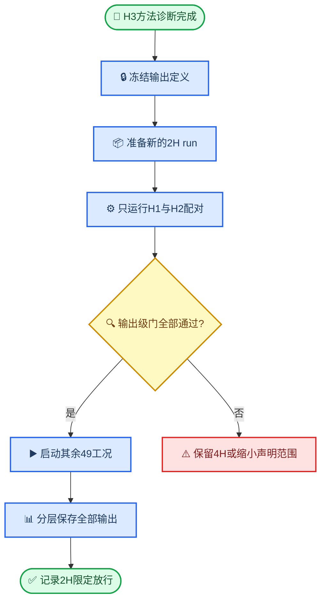

# H均质坡2H净空误差缓解与生产策略

*研究对象：H均质坡 `global_upper` 模型；本文保留2H净空误差的历史诊断与原缓解建议。用户随后决定接受该偏差，J0英文期刊支线不再采用本文的独立2H/4H放行要求。结论日期：2026-07-28。*

---

## 🎯 结论

> **执行状态更新：** 本文中的误差数值、输出分层和“不能宣称2H已收敛”仍然有效，但H1/H2独立配对和失败后退回4H的建议不再是J0执行门。J0全部工况固定为2H，旧`run-006`保持未启动；具体工况和运行顺序以[第四章与第六章英文期刊论文一月实施计划](../计划文档/第四章与第六章英文期刊论文一月实施计划.md)为准。

`2H` 作为后续生产候选是合理折中，但必须按输出层使用：

1. **坡体与坡顶侧 `s≤1` 的原始复 FRF 已在 H3 诊断例通过原门槛。** 未进行任何频率或空间平滑时，`log|H|` RMSE/P95 为 `0.04836/0.09733`，相位 RMSE/P95 为 `0.04814/0.09388 rad`。
2. **完整表面的固定频带 RMS 幅值可以使用。** 六个预定义频带全部满足相对差 P95 `≤5%`、最大值 `≤10%`；最不利 `2–4 Hz` 为 `4.697%/7.506%`。
3. **完整表面的水平工程指标可以使用。** 水平 PGA 与 `TAF_h_comp` 的相对差 P95/最大值均为 `3.168%/5.129%`，合成 PGA 为 `3.536%/5.227%`。竖向 PGA/TAF 的 P95 为 `6.429%`，尚未通过同一 `5%` 门槛，不能一并放行。
4. **完整 `s∈[-4,4]、0.5–10 Hz` 原始复 FRF 仍不通过。** `log|H|` RMSE/P95 为 `0.08822/0.13004`；原始数组必须保留，但不得宣称其逐点反共振位置与 `4H` 收敛。
5. **平滑不作为原始 FRF 修正，但可增加一个明确命名的派生量。** 完整表面不存在同时满足配对门和参考失真门的平滑方案；固定 `σ=0.10 Hz、s≤2.8` 的“近坡面带宽平均 FRF”覆盖 `681/801` 个空间点，配对 RMSE/P95 为 `0.04529/0.07493`，且 `4H` 自身失真为 `0.04304/0.06383`、complex NRMSE 为 `0.03892`。该量不得改称原始 FRF，并须通过 H1/H2 独立确认。
6. **J0不再以独立确认阻塞生产。** 当前H3仍只能记为`diagnostic_completed`，其误差不能外推成全部工况的收敛证明；但用户已接受这一不确定性。旧`run-006`的51份配置保持`planned`且不再启动，J0在独立新目录重新生成统一2H工况。既有`run-005`继续冻结，不覆盖其4H证据。

从算力收益看，当前 H3 单例由 `4H` 的 `135264` 个单元、`10.63 h`，降至 `2H` 的 `100264` 个单元、`5.99 h`，墙钟时间节省约 `43.7%`。`2H` 只比 `1H` 多约 `0.30 h`，却保留了 `1H` 相对 `4H` 约 `94%` 的节时收益；若 `run-006` 的 51 个工况成本相近，相对全部重跑 `4H` 理论节省约 `237 h`。

## 📊 已有证据

### 原域门结果

| 候选域 | 单元数 | 总耗时 | `log|H|` RMSE | `|Δlog|H||` P95 | 相位 RMSE/P95 | TAF P95/最大值 | 结论 |
| --- | ---: | ---: | ---: | ---: | ---: | ---: | --- |
| `1H` | 82,764 | 5.69 h | 0.09959 | 0.16422 | 0.12219/0.16516 rad | 3.796%/5.353% | 幅值门失败 |
| `2H` | 100,264 | 5.99 h | 0.08822 | 0.13004 | 0.09180/0.12810 rad | 3.168%/5.129% | 幅值门失败 |
| `4H` | 135,264 | 10.63 h | 参考 | 参考 | 参考 | 参考 | 现行生产域 |

可复核证据分别位于：

- `Run/ch4_H_domain_convergence/run-001/H计算域收敛门.json` 与 `case-HD-H3-000001/surface_results.npz`；
- `Run/ch4_H_domain_convergence/run-002/H计算域收敛门.json` 与 `case-HD-H3-000002/surface_results.npz`；
- `Run/ch4_H_homogeneous_baseline/run-005/case-H3-000006/surface_results.npz`；
- 三个工况各自的 `slope_frame_ssi_full_v2.log`，用于复核单元数和墙钟时间。

`1H→2H→4H` 并非单调 Cauchy 收敛：相对 `4H` 的 `1H`、`2H` 误差图相关性只有 `0.379`（对数幅值）和 `0.267`（相位），`2H` 比 `1H` 更接近 `4H` 的复数点只占约 `61.4%`。因此不能采用 Richardson 外推、统一比例系数或单例差值表把 `1H` 修正成 `4H`。

### 误差的频率与空间位置

| 频段 | `1H→4H` `log|H|` RMSE | `2H→4H` `log|H|` RMSE | 判断 |
| --- | ---: | ---: | --- |
| 0.5–1 Hz | 0.01099 | 0.01319 | 很小 |
| 1–2 Hz | 0.03899 | 0.04501 | 接近门内 |
| 2–4 Hz | 0.18070 | 0.13556 | 主导失败 |
| 4–6 Hz | 0.09214 | 0.11868 | 仍受影响 |
| 6–8 Hz | 0.05457 | 0.04036 | 接近门槛 |
| 8–10 Hz | 0.04740 | 0.04313 | 门内 |

`1H` 的高误差主要出现在 `2.594–2.777 Hz` 和 `2.915–4.868 Hz`，逐频最大值位于 `3.6776 Hz`。空间上，坡脚平台 `s∈[1,4]` 的 `log|H|` RMSE/P95 为 `0.14290/0.24714`，明显高于坡顶平台的 `0.06074/0.11833` 和坡面的 `0.05669/0.10450`；热点集中在 `s≈2.74–2.98`。

低幅值凹口数量不多，却支配了对数误差：`4H |H|<0.5` 的点只占 `3.68%`，贡献了约 `60.7%` 的 `1H log|H|` 误差平方。典型点 `s=2.76、f=3.8608 Hz` 处，`|H|` 分别为 `0.23898/0.14117/0.00157`（`1H/2H/4H`）。这说明主要问题是窄反共振位置随计算域变化，而不是整体幅值偏置；对应的全域复数 NRMSE 为 `6.28%`，也说明对数门对深凹口非常敏感。

当前 `qa_reflection` 状态为 `not_computed`，所以严谨表述应是：**证据支持“边界位置相关的有限域干涉主导”，但尚未直接测得边界反射系数。** 该判断还受到以下证据支持：净空是三域唯一改量；凹口随域长移动；地下节点也存在差异；加窗和截尾无效。

## ✅ 2H输出分层实测

本轮新增 `test/Batch/evaluate_ch4_H_2H_mitigation.py`，只读取既有 `2H/4H`
规范 NPZ，不调用 Abaqus，不改写 `surface_results.npz`。机器可读结果写入
`Run/ch4_H_domain_convergence/run-002/H2H误差缓解诊断.json`，状态为
`diagnostic_completed`。

| 输出层 | 空间与频率范围 | P95或RMSE | 最大值或P95 | 诊断 |
| --- | --- | ---: | ---: | --- |
| 原始复 FRF | `s∈[-4,4]`、`0.5–10 Hz` | RMSE `0.08822` | P95 `0.13004` | 不通过 |
| 原始复 FRF | `s≤1`、`0.5–10 Hz` | RMSE `0.04836` | P95 `0.09733` | 通过 |
| 频带 RMS 幅值 | 全表面、六个固定频带 | 最差 P95 `4.697%` | 最差最大值 `7.506%` | 全部通过 |
| 水平 PGA/TAF | 全表面 | P95 `3.168%` | 最大值 `5.129%` | 通过 |
| 合成 PGA | 全表面 | P95 `3.536%` | 最大值 `5.227%` | 通过 |
| 竖向 PGA/TAF | 全表面 | P95 `6.429%` | 最大值 `7.497%` | P95不通过 |
| 近坡面带宽平均 FRF | `s≤2.8`、`σ=0.10 Hz` | RMSE `0.04529` | P95 `0.07493` | 派生量诊断通过 |

`TAF_h_comp` 与水平 PGA 使用同一且不随计算域变化的解析分母，因此两者相对差
相同，不能计作两条相互独立的验证证据；合成 PGA 是另一项输出。

固定频带 RMS 定义为：

$$
H_{\mathrm{RMS}}(B,s)=
\sqrt{\frac{1}{N_B}\sum_{f_k\in B}|H(f_k,s)|^2}
$$

频带预先固定为 `0.5–1`、`1–2`、`2–4`、`4–6`、`6–8` 和 `8–10 Hz`。
该量保留频带整体放大强度，但不承担窄反共振频率的逐点解释。六个频带中，
`2–4 Hz` 最不利，P95/最大相对差仍只有 `4.697%/7.506%`。

`s≤1` 不是删除离群点：它恰好对应完整坡顶平台、坡面和坡脚棱点，整体保留
`501/801` 个统一空间点。被排除的是坡脚棱以外的下平台 `s>1`；该区域仍保留
PGA、TAF、频带 RMS 和原始 FRF 文件，只是不对其原始逐频 FRF 作 `4H` 收敛声明。
由于该 ROI 是在 H3 结果后确定，必须在独立代表工况上保持边界不变地复核一次，
才能升级为正式生产口径。

## 🧪 数据处理能做什么

### 平滑筛选结果

频率平均采用输入谱能量加权的交叉谱/自谱高斯平均；参考失真是平滑后 `4H`
相对原始 `4H` 的变化。所有结果都只作为带宽平均诊断，不覆盖原始 FRF。

| 方法 | `2H/4H` RMSE/P95 | `4H`参考失真 RMSE/complex NRMSE | 判断 |
| --- | ---: | ---: | --- |
| 不平滑 | `0.08822/0.13004` | `0/0` | 完整原始FRF失败 |
| 频率 `σ=0.05 Hz` | `0.07973/0.11546` | `0.01630/0.01175` | 失真小，但仍失败 |
| 频率 `σ=0.075 Hz` | `0.07143/0.10089` | `0.03318/0.02406` | 仍失败 |
| 频率 `σ=0.10 Hz` | `0.06182/0.08499` | `0.05300/0.04022` | 配对RMSE和参考失真均超限 |
| 频率 `σ=0.15 Hz` | `0.04343/0.05778` | `0.10281/0.08094` | 数值过门但严重改变参考，拒绝 |
| 空间 `σ_s=0.10` | `0.08740/0.12677` | `0.09069/0.06423` | 几乎无改善且引入失真 |

没有任何平滑候选同时满足原始配对门和参考失真门。`σ=0.05 Hz` 可作为明确
标注的展示辅助线，但所有统计、机器学习标签和放行判断继续读取未平滑 NPZ。
此前对 `1H` 的 Tukey、尾段截短、Hann 和 Welch 试验同样不能恢复峰谷位置。

### 可保留的带宽平均派生量

完整表面强行平滑不可用，但预注册为独立产品的“近坡面带宽平均 FRF”可以继续
验证。它采用输入谱能量加权的交叉谱/自谱高斯平均，固定 `σ=0.10 Hz`，空间边界
固定为 `s≤2.8`，保留 `681/801=85.019%` 的空间点。H3 诊断结果如下：

| 检查对象 | `log|H|` RMSE/P95 | 相位 RMSE/P95 | complex NRMSE | 判断 |
| --- | ---: | ---: | ---: | --- |
| `2H` 对带宽平均 `4H` | `0.04529/0.07493` | `0.04712/0.07399 rad` | `0.03361` | 配对通过 |
| 带宽平均 `4H` 对原始 `4H` | `0.04304/0.06383` | `0.04348/0.06097 rad` | `0.03892` | 参考失真可接受 |

空间终点 `s=2.8`、核宽和输入谱权重都不得在查看 H1/H2 结果后调整。即使该派生
量独立验证通过，它也只支持有限带宽下的近坡面响应，不支持完整表面逐频原始 FRF
收敛。它是可选输出，失败时不自动否定已独立通过的原始 `s≤1`、频带 RMS 和水平
工程量，但自身必须撤回。

### 允许进入2H生产协议的方案

以下方案保持不同名称、门槛和用途，同时保留完整原始数据：

- **原始复 FRF 机理层**：只在预注册 `s≤1` 区域使用，保留 `0.5–10 Hz` 全频带和复数相位，不作平滑。
- **频带 RMS 全表面层**：固定六个频带，分析总体放大能量和频带迁移，不解释频带内部窄凹口位置。
- **水平工程指标层**：全表面使用 PGA、`TAF_h_comp` 和合成 PGA；竖向量另设独立门，当前不随水平量自动放行。
- **近坡面带宽平均层**：固定 `σ=0.10 Hz、s≤2.8`，单独命名和保存参数；它是可选派生量，不覆盖原始 FRF。
- **幅值加权训练损失**：生产阶段可直接由 `2H` 标签计算 `w=|H_{2H}|`；H3 全表面的加权对数幅值 RMSE/P95 为 `0.04591/0.08134`。该权重只降低窄低幅凹口对优化器的支配，不删标签、不改变未加权验收指标。`|H|²` 权重虽可把诊断 RMSE 进一步降至约 `0.03773`，但会更强地压低凹口权重，只保留为敏感性分析。
- **稀疏多保真层**：未来可用少量成对 `4H` 学习条件化差异和不确定性，但本轮只有一个 H3 配对，不能训练或验证修正器。至少应把不同坡角或入射角的 `4H` 配对留作完全未参与拟合的盲测。

## 🧱 边界优化优先级

### 已完成：现有黏弹性边界的物理约束筛选

经典黏性边界以 `ρc_p`、`ρc_s` 表示法向和切向阻抗，但对斜入射 P–SV 转换和宽角度散射并非无反射边界。[^1] White 能量边界和后续修正方法的目标也是降低多角度入射下的反射，而不是把单一阻尼系数解释成“全吸收”。[^2]

现有 `Modeling/slope_frame_ssi_full_v2.py` 已提供：

- `dashpot_normal_scale`、`dashpot_tangential_scale`；
- `spring_normal_scale`、`spring_tangential_scale`；
- 等效自由场荷载 `K u_ff + C v_ff + A σ_ff` 与同组 `K、C` 边界反力配对。

因此，改变 `K、C` 会保持背景自由场的代数闭合，同时改变散射波吸收，是最小侵入的可调杠杆。候选不应直接在 H3 曲线上大范围拟合，而应先在独立反射基准上筛选，最多保留以下少量物理方案：

| 方案 | 法/切向阻尼缩放 | 法/切向弹簧缩放 | 用途 |
| --- | ---: | ---: | --- |
| 当前基线 | `1.0/1.0` | `1.0/1.0` | 对照 |
| 脚本中的标准 Liu 候选 | `1.0/1.0` | `2.0/2.0` | 最低成本筛选 |
| Liu–Shen 参数化候选 | `1.1/1.1` | `1.94444/1.11111` | 按 `a=0.8、b=1.1、ν=0.3` 复现[^3] |
| 多角度能量最优候选 | 由独立反射基准求得 | 保持理论约束 | 降低 `0°–60°` 最坏反射 |

第三章已有 Liu–Shen 参数化配置，但外部图像基准只表现为小幅变化，未通过该外部对拍。第三章平场 F1 中 `spring_scale=2.0` 的三测点幅值 NRMSE 约为 `0.25%–0.45%`，但该轮还同时修正了时间轴，不能把改善全部归因于弹簧系数。因此两者都只是便宜且有理论来源的候选，不能预设它们能消除完整表面 FRF 差距。若需要判断弹簧项是否主导反射，可把 `spring_scale=0` 作为纯黏性机理对照，但不把它直接设为生产候选。

## 🔍 独立反射筛选实测

已新增单文件入口 `test/Batch/Autorun_H_boundary_reflection.py`，并在
`test/Abaqus/ch4_H_boundary_reflection/run-004/` 完成独立混合波筛选。模型采用
H3 材料、`3.5 Hz` Ricker 点力、45° 法/切向混合激励和三个观测点；小域宽
`1853.6 m`，远场参考域宽 `10000 m`。六个算例的 `.sta` 均含
`THE ANALYSIS HAS COMPLETED SUCCESSFULLY`，无致命 `.msg` 模式和残留 `.lck`。

| 边界方案 | `2–5 Hz` 联合 NRMSE | 相对基线改善 | 时域峰值比 P95 | 筛选判断 |
| --- | ---: | ---: | ---: | --- |
| 固定边界坏对照 | `0.42993` | — | `3.02930` | 证明基准能识别强反射 |
| 当前基线 | `0.09642` | `0%` | `0.44181` | 对照 |
| 标准 Liu | `0.09469` | `1.80%` | `0.43819` | 最优，但低于继续阈值 |
| Liu–Shen | `0.09705` | `-0.65%` | `0.44578` | 略差 |
| 纯黏性 | `0.09839` | `-2.04%` | `0.44521` | 略差 |

坏对照的频带残差约为当前基线的 `4.46` 倍，超过预注册的 `1.5` 倍灵敏度要求，
说明该基准不是“所有边界都给出相同结果”。然而最佳候选只改善 `1.80%`，远低于
预注册的 `10%` 继续阈值，筛选状态为 `coefficient_insensitive`。因此：

- 该结果只记为 `diagnostic_completed`，不等于 H3 的 `2H` 正式放行；
- 不再运行 H3 系数扫参，也不为这些候选追加新的 `4H` 配对；
- 旧软土分层模型中的大范围吸收系数扫描同样未显著改变峰值响应，可作为跨模型的
  旁证，但其观测量不同，不能替代本轮 H3 频带诊断；
- 本轮只覆盖一个混合激励和中心频率，不能据此声称得到全角度真实反射系数；它足以
  执行本轮低成本候选的停止规则，却不足以验证 DRM、CALM 或其他新边界体系。

启动失败的 `run-002`、`run-003` 保留作审计记录；`run-004` 经断点续跑完成全部
求解和汇总。正式数值以 `boundary_reflection_summary.json` 为准。

### 下一优先级：DRM入射与渐变吸收层分离

现有海绵层不宜直接打开。此前 P1 横向海绵试验虽使观察窗指标变化小于 2%，却把右端诊断由 `6.26%` 恶化为 `12.59%`；更根本的问题是当前输入位于外边界，入射波和散射波都会经过材料阻尼层。当前自动宽度约为 `0.08×域宽`，五级线性分档采用单元中心值，内缘第一档已含约 3% 附加阻尼，并非从零连续进入。这可能由材料分档自身产生反射。

低成本系数筛选已经失败。若完整表面高分辨复 FRF 必须由 `2H` 生产，较合理的中期方案是：

1. 在研究区外建立内部 DRM 等效力界面；
2. 将已知入射场移到该界面；
3. DRM 外只让外行散射波进入渐增 CALM/Caughey 阻尼层；
4. 最外边界继续用黏弹性边界兜底。

DRM 负责把入射场与外部吸收区解耦，CALM 才能主要吸收散射波。[^4][^5] 现有自由场引擎已能生成位移、速度和应力，但完整 DRM 还需要正确构造界面单元质量、刚度耦合的等效力，属于中等规模实现，不应与本轮低成本系数筛选混在一起。

### 不作为本轮首选

- **现有海绵层直接启用**：已有反例，且会衰减入射场。
- **Abaqus `CINPE4` 无限元**：官方说明其动力吸收主要仍是法/切向速度比例牵引，理想透射依赖平面体波正交入射；对斜坡的宽角度 P、SV 和表面波不构成确定升级。[^6]
- **弹性 PML/CPML**：理论性能强，但 Abaqus 原生 PML 文档面向声学外域；平面应变弹性 PML 通常需要 UEL、附加状态变量及非对称矩阵，不适合作为当前单文件 Python 流程的快速修复。[^7]
- **高阶局部传输边界**：能处理传播角和 P–SV 耦合，但通常需要专门边界单元或 UEL，实施成本接近方法开发。
- **再建传统一维自由场柱**：当前边界已采用自由场相对运动结构；自由场输入本身不能自动吸收坡体散射波。

## 🧭 2H放行路线

### 阶段A：冻结方法

H3 已用于选择 ROI、频带和输出门，因此只承担方法开发，不再把同一 H3 的通过结果
当作独立验证。冻结内容如下：

| 输出 | 冻结范围 | 门槛 |
| --- | --- | --- |
| 原始复 FRF | `s≤1`、`0.5–10 Hz` | 幅值 RMSE/P95 `≤0.05/0.10`；相位 RMSE/P95 `≤0.20/0.35 rad` |
| 频带 RMS | 全表面、六个固定频带 | 每频带相对差 P95/最大 `≤5%/10%` |
| 水平 PGA/TAF | 全表面 | 相对差 P95/最大 `≤5%/10%` |
| 近坡面带宽平均 FRF | `s≤2.8`、`σ=0.10 Hz` | 可选派生量；配对满足原 FRF 门，且 `4H` 自身 complex NRMSE `≤0.05` |
| 完整原始复 FRF | 全表面 | 只作诊断，不参与2H限定放行 |
| 竖向 PGA/TAF | 全表面 | 独立报告，当前不参与水平主线放行 |

### 阶段B：独立配对

`run-006` 已生成 51 份 `2H` 冻结配置且没有求解产物。首批只运行两个代表工况：
`H1-000035` 和 `H2-000006`，分别与
`run-005` 中现有 `4H` 规范 NPZ 配对。它们未参与 H3 方法选择，可以作为独立确认；
不需要再运行新的 `4H`。两组均通过上表的全部必需门后，才启动同一 run 中其余
49 个工况。
旧 `run-005` 保留原样，不覆盖配置、清单、散列或状态。

### 阶段C：停止条件

- 任一必需输出依靠删频段、删点、幅值地板或强平滑才通过：拒绝该做法。
- H1 或 H2 的 `s≤1` 原始 FRF 失败：不把 H3 的 ROI 结果推广到全 H 池；可继续使用已独立通过的工程输出，或退回 `4H`。
- 任一固定频带 RMS 或水平 PGA/TAF 失败：停止 `2H` 正式生产，不在查看结果后移动频带边界。
- 两个独立配对通过：在已准备的 `2H` run 中启动其余 49 个工况；状态写成“限定输出放行”，不得简写为“完整原始 FRF 域收敛通过”。

## 💡 算力保底方案

若两个独立配对未能支持 `2H` 的限定输出协议，保留 `4H` 物理距离、只粗化外侧净空区，通常比继续移动人工边界更低风险。

当前均质单层模型虽然配置了 `graded=True`，代码因 `len(strat)=1` 实际采用全域 `4 m` 均匀网格。H3 在 `10 Hz` 的最短 S 波长约为 `200 m`，外侧 `4 m` 网格约有 50 单元/波长，明显存在远场过解析空间。保持研究区 `4 m`、把额外 `2H–4H` 净空渐增到 `12–16 m`，粗估可把 `4H` 单元数从 `135k` 降至约 `96k` 量级，同时保留大域传播距离。该数字只是几何估算，必须重新做网格质量、频散和同配置收敛验证。

此方案不是 `2H`，但若独立输出级验证失败，它比用数据处理掩盖高分辨 FRF 偏差更可靠。

## 📌 原技术建议与当前执行决定

原技术建议是采用“原始数据不动、解释范围分层”的2H生产定义；当前J0仍保留原始数组、派生量命名和诚实表述，但取消2H/4H独立放行：

- **主机理输出**：`s≤1` 的未平滑原始复 FRF，保留幅值和相位。
- **全表面输出**：固定六频带 RMS、水平 PGA、`TAF_h_comp` 和合成 PGA。
- **可选派生输出**：固定 `σ=0.10 Hz、s≤2.8` 的近坡面带宽平均 FRF，单独命名并独立验收。
- **诊断输出**：全表面原始复 FRF 和竖向 PGA/TAF，完整保存但不作已收敛主结论。
- **显示辅助**：如需更平顺的曲线，只允许另绘 `σ≤0.05 Hz` 的明确标注辅助线；统计和训练标签仍取原始数据。
- **J0执行条件**：不再运行旧`run-006`的H1/H2配对，也不新增4H参考；直接按J0分阶段入口运行统一2H工况。
- **论文限制**：把完整表面水平复FRF称为统一2H有限元模型输出，并单列已知净空敏感性；不得写成2H相对4H已收敛。
- **未来重开条件**：只有用户另行决定重新研究计算域敏感性时，才恢复远场渐粗4H或独立配对方案；J0不会自动触发该路线。

当前路线接受2H的已知偏差以换取约43.7%的代表工况墙钟节省，同时继续区分“代理模型对2H标签的误差”和“2H数值域本身的误差”两个不同命题。

## 📚 参考资料

[^1]: Lysmer, J., & Kuhlemeyer, R. L. (1969). *Finite Dynamic Model for Infinite Media*. https://doi.org/10.1061/JMCEA3.0001144
[^2]: White, W., Valliappan, S., & Lee, I. K. (1977). *Unified Boundary for Finite Dynamic Models*. https://doi.org/10.1061/JMCEA3.0002285
[^3]: Liu, J., et al. (2006). *A 3D viscous-spring artificial boundary in time domain*. https://doi.org/10.1007/s11803-006-0585-2 ; Shen, et al. (2024). https://doi.org/10.1016/j.soildyn.2024.108488
[^4]: Bielak, J., Loukakis, K., Hisada, Y., & Yoshimura, C. (2003). *Domain Reduction Method for Three-Dimensional Earthquake Modeling in Localized Regions, Part I: Theory*. https://doi.org/10.1785/0120010251
[^5]: Semblat, J.-F., Lenti, L., & Gandomzadeh, A. (2011). *A simple multi-directional absorbing layer method to simulate elastic wave propagation in unbounded domains*. https://doi.org/10.1002/nme.3035
[^6]: Dassault Systèmes. *Infinite Elements—Abaqus 2024 Documentation*. https://docs.software.vt.edu/abaqusv2024/English/SIMACAEELMRefMap/simaelm-c-infinite.htm
[^7]: Dassault Systèmes. *Acoustic, Shock, and Coupled Acoustic-Structural Analysis—Abaqus 2024 Documentation*. https://docs.software.vt.edu/abaqusv2024/English/SIMACAEANLRefMap/simaanl-c-acoustic.htm
