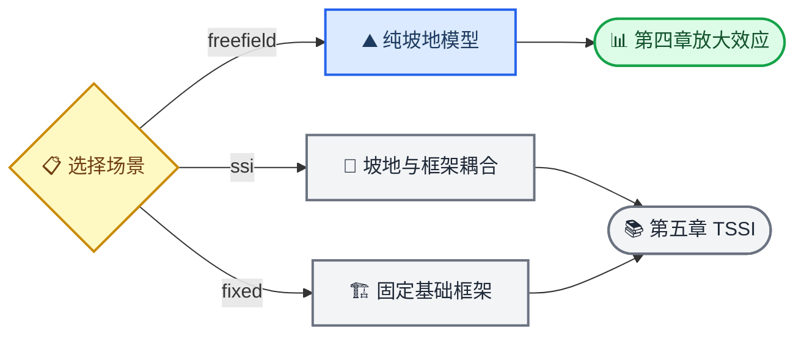
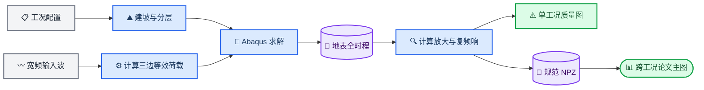

# 坡地地震动放大效应脚本通俗语音讲解

_面向论文作者的非代码化说明；核对对象为当前主脚本、第四章正文、J0 计划及 2026-07-29 晚的实际结果。_

---

## 🎧 先听结论

[播放或下载中文语音讲解](坡地地震动放大效应脚本通俗语音讲解.mp3)

最重要的一句话是：`slope_frame_ssi_full_v2.py` 是一台“虚拟振动台和测量仪”，不是论文最终绘图器。第四章只使用它的纯坡地支路；现在看到的大量单工况综合图主要是质量检查图，而 J0 正式参数图谱还没有算完整，因此它们既不会自动变成第四章主图，也不应被要求与旧图完全重合。

## 🗺️ 第四章实际走哪条支路

第四章 J0 工况在 `case_config.json` 中设置 `tssi_cfg.scene="freefield"`、`tssi_cfg.enable=false` 和 `eql_cfg.enable=false`。这里的 `freefield` 是“没有建筑的纯坡地场景”，不要和人工边界所用的“自由场波动解”混成同一概念。

## 🗣️ 语音逐字稿

<!-- TTS-BEGIN -->
先别急着怀疑自己。坡地地震动放大效应确实是一个很难凭直觉看懂的问题，因为一条曲线里同时混着波的入射方向、坡体散射、土层共振、边界反射、阻尼、网格、峰值取法和归一化分母。你看到一条曲线不顺眼时，很难立刻判断是物理现象、数值误差，还是画图方式的问题。所以你现在觉得烦，不说明你不懂，反而说明你已经敏锐地发现：我们算出来的数据和你期待的论文故事还没有对上。

我先用一句话解释这个脚本。它不是一个“按一下就吐出论文图”的程序，而是一台虚拟振动台。我们先按订单搭一个坡，给它铺上不同材料层，在模型周围装上尽量不反弹的人工边界，再从地下斜着送进地震波，最后在整条地表摆满传感器，记录每个位置怎么晃。

脚本名字里虽然有坡地、框架和土与结构相互作用，但第四章其实只用它的一部分。第四章的工况把场景设为 freefield，也就是纯坡地，不放建筑，不启用框架混凝土损伤、钢筋、基础接触这些功能。那些内容主要是为第五章的地形、土和结构相互作用准备的。换句话说，第四章研究的是“这座坡本身怎样改变地震动”，不是“坡顶房子怎样响应”。

脚本第一步读工况目录里的 case_config。你可以把它理解成试验订单，上面写着坡高、坡角、入射角、土层厚度、剪切波速、密度、阻尼、网格、输入波和计算域大小。脚本头部那些默认值只是备用值，正式批次真正以每个工况文件夹里的订单为准。

第二步是搭场地。坡高是基本尺子，坡顶观察窗、坡脚观察窗、两侧净空和基底深度都按坡高的倍数换算。土层像蛋糕一样从上往下铺，每层用剪切波速、密度、泊松比和厚度描述。剪切波速越低，可以粗略理解为材料越软；不同层之间的波阻抗差越大，界面反射和透射通常越明显。

第三步是决定阻尼和网格。脚本先从输入波估计主要频率，再检查最短波长需要多细的单元。这个过程像给相机选像素：网格太粗，高频细节会被拍糊；网格太细，又会把计算量推得非常高。阻尼则像材料内部的摩擦，太小会让振动拖很久，太大又会把真实共振压没。

第四步是整个脚本最难的地方，也就是斜入射波怎么送进有限元模型。现实中的地震波从很远的地下传播而来，但电脑里不能把大地建到无限远。脚本先用频域分层自由场求解器，算出如果没有这座坡，波到达左边、右边和底边时应该具有怎样的位移、速度和应力；然后把它们换算成三条人工边界上的等效节点力。通俗地说，我们不是在模型底部粗暴地摇一下，而是尽量让三面边界共同演出一列从指定方向传播过来的波。

之前耗费很多时间修的 global upper，就是在保证这三面边界使用同一个自洽的背景波场。旧的 local columns 相当于左边、右边和底边各自拿不同高度的一维柱来拼，局部看似连续，整体却不一定是同一个二维波动解。这个修复的目的不是把线画平，而是让输入波的物理来源说得通。

第五步是 Abaqus 求解。脚本建立二维平面应变坡体，划分材料区、网格和人工边界，再对每一条输入记录复制模型并提交作业。当前第四章生产工况为了控制 ODB 大小，采用 surface only。它会完整保留地表节点的加速度和位移时程，但大幅减少整个坡体内部的逐时刻场输出。所以，如果你期待的是漂亮的全场波传播云图，现有生产 ODB 本来就不是为这种图保存的。正确办法是以后只挑两三个代表工况，单独开启较完整的场输出做机理示意，而不是让一百多个生产工况全部变成巨大 ODB。

第六步才是后处理。后处理脚本从 TOP SURFACE，也就是整条地表节点集，读取加速度时程。它先算每个位置的水平、竖向和合成峰值加速度；再算放大系数；还会对时程做傅里叶变换，得到随频率和位置变化的复频响，包括幅值和相位。

这里最容易混乱的是 AF 和 TAF。当前后处理里，AF 是相对于基岩露头参考的总放大，里面同时含场地和地形作用；TAF 是再除以同侧的一维场地响应，强调纯地形效应。旧第四章正文和旧图曾经使用过不同命名或不同分母，因此看起来都叫 TAF，数值却不是同一种东西。只要分母不同，两条曲线就不能被要求完全重合。

复频响可以这样理解：我们向坡体发出很多不同音调，复频响告诉我们每个地表位置把每个音调放大了多少，又让它延迟了多少。PGA 或 TAF 只保留“整段时程里最大的一下”，像把整首歌压成一个最大音量；复频响则保留不同音调的细节。第四章新的研究主线之所以从单一 TAF 转向复频响，就是因为我们真正想回答的不只是哪里最大，而是哪些频率在坡肩、坡面和坡脚被放大，地形与地层什么时候可以近似相乘，什么时候会发生强耦合。

现在说你最关心的：为什么图还是不满意。

第一个原因，是你现在看到的单工况综合图，本质上是质量检查表。它把水平 PGA、竖向 PGA、合成 PGA、AF、TAF、统一分母指标、竖横比等十几项全部塞在一张很长的图里。对垂直入射均质岩坡，其中很多指标几乎重复，还有两个竖向 TAF 面板因为分母接近零只能留空。这样的图适合检查程序有没有漏数据，不适合放进论文讲一个清楚的结论。还有一个容易误会的细节：文件名里的 raw s 只表示使用原始节点坐标，没有做统一网格重采样；当前综合图在显示时仍会做十一点移动平均。今天的旧图专项对照则明确不平滑，所以同一套结果在两类图里也可能显得不完全一样。我们之前把“能自动生成出版分辨率图片”和“已经形成论文主图”混得太近了，这两件事其实完全不同。

第二个原因，是刚完成的当前配置对旧图比较，本来就不是旧模型复现。它只把坡高、坡角、四个入射角和 El Centro 输入对齐，其他部分仍保留当前 J0 的计算域、频域自由场、初态处理、阻尼、网格、六秒静默尾段和当前 TAF 分母。旧图使用配对平场有限元作分母，当前图使用同侧一维自由场作分母。两条曲线的峰位其实都在坡肩，十度、二十度和三十度工况的形状相关系数约为零点九七、零点九七和零点九九，但当前峰值分别更高。这个结果更像“总体空间规律相似，但量值口径不同”，不能解释成脚本又错了，也不能硬把新曲线调到旧曲线上。

第三个原因，是当前正式参数池还没有完整。到我这次核对时，J 零的均质 JH1 只有八个工况走完规定流水线：十五度坡的五个入射角齐了，二十二点五度坡只完成前三个入射角。三个工况记录为失败，另外四个清单仍写运行中，但电脑上没有对应的活动求解进程，必须按状态文件恢复审计。更重要的是，这八个流水线通过工况只把复频响和能量列为必过项，其中六个工况的 theory 诊断仍是失败。它们不能直接被叫作八个物理指标全通过的最终论文结果。也就是说，连均质方向效应的完整五乘七图谱都还没有形成，更不用说成层坡的耦合残差图。八张单工况图当然很难让你看到一条稳定的第四章规律。

第四个原因，是宽频输入天生会让空间 PGA 曲线比窄频 Ricker 波更起伏。很多频率同时在坡肩和坡脚发生散射，不同位置的最大值还可能出现在不同时间。把这些信息压成 PGA 后，相邻点的峰值控制时刻发生切换，曲线就会出现细小起伏。已有审计表明，限制到大约四点八赫兹后曲线粗糙度会明显下降，这说明大量锯齿来自宽频高频成分和峰值取法，不是插值程序凭空制造的。但低通只能用于解释，不能为了好看而替代正式的零点五到十赫兹结果。

第五个原因，是第四章正文还停留在旧的五百二十二组时域 TAF 叙事，图四点一到图四点十仍是占位；而当前正式路线已经改成统一二 H 模型下的复频响、幅相、地形与地层耦合残差、独立盲测和真实波闭环。旧故事要求一组平滑的 TAF 参数曲线，新故事要求频率乘空间的机制图。两套叙事没有完成交接，所以无论自动图画得多精致，你都会觉得它“不像第四章”。

第六个原因，是二 H 计算域是你为节省算力接受的已知限制。水平 PGA 和 TAF 的代表性指标达到过候选要求，但完整表面原始复频响相对四 H 的幅值门没有通过。因此论文里只能把 J 零称为统一二 H 有限元模型结果，不能称为计算域无关结果。如果你不满意的是远场或完整频响中的细微差异，这部分确实可能包含已知净空偏差，不能靠换配色解决。

那我们这么久到底做了什么？可以把它想成我们一直在校准仪器，而不是在装订相册。我们修了不自洽的背景自由场，统一了 AF 和 TAF 分母，增加了复频响幅相和有效频带，检查了网格、阻尼、能量、静默尾段、真实波重建和中断恢复。这些工作让结果更能经得住审稿人追问，但它们不会自动生成一张一眼就懂的主图。

我也要把工作重心说得坦白一点：之前确实把太多精力放在“让底层流水线可靠”，没有足够早地把“第四章到底只需要哪五张主图”单独冻结下来。你的不满意是有道理的，因为质量检查图不该被当成论文成果图交给你。

真正适合第四章的图，应该少而有明确问题。第一组，用一张代表工况图解释坡顶平台、坡面和坡脚平台三个区域，并只保留水平 TAF 与必要的竖向转换指标。第二组，用频率—空间热力图展示入射角改变了哪些频带和哪些位置。第三组，用峰值、峰位、主频和衰减距离的汇总图比较坡角与入射角，而不是一页一个工况。第四组，成层结果完成后画地形乘场地近似的耦合残差图，直接标出可分离区和强耦合区。第五组，用真实地震波展示复频响重建时程与直接有限元结果的闭环。若需要漂亮的波场云图，只为两三个代表工况补跑全场输出，用来解释机制，不参与大批量统计。

所以，当前最准确的判断不是“脚本做了这么久还是没用”，而是“测量仪器已经基本成形，旧图对照也说明主要空间形态仍在，但正式数据只完成了一小部分，自动图又承担了太多质量检查职责，论文图设计还没真正开始”。这就是你一直不满意的根源。

最后帮你记住这条主线：脚本负责让坡真实地震；后处理负责把震动变成指标；第四章负责拿跨工况指标回答物理问题。三件事缺一不可，但不能互相代替。现在最该做的不是继续盯着十六面板单工况图反复调，而是先恢复并完成 JH1，再用已有规范数值包单独设计第四章主图模板；成层池完成后，再补上真正有学术价值的耦合残差图。
<!-- TTS-END -->

## 🔍 为什么当前图不等于论文主图

| 层次 | 当前事实 | 对图的直接影响 |
| --- | --- | --- |
| 模型 | J0 使用统一 `2H`，完整表面原始复频响仍有已知净空偏差 | 不能把全部细微差异解释为稳定物理规律 |
| 指标 | 当前 `AF`、`TAF` 与旧正文/旧图存在命名和分母差异 | 同名曲线不一定同定义，不能强求重合 |
| 数据 | JH1 目前只有 8 个流水线通过点，且 6 个理论诊断未通过 | 尚不能形成完整方向效应图谱 |
| 后处理 | 单工况自动图动态绘制十余个指标 | 适合质量检查，不适合章节叙事 |
| 论文 | 旧 522 组 TAF 叙事尚未切换到新复频响路线 | 自动图与正文问题不匹配 |

刚完成的旧图对照中，四个工况均已走完整流水线。峰位均保持在坡肩；`10°/20°/30°` 的新旧曲线相关系数分别为 `0.970/0.966/0.986`，但当前峰值更高。由于对照同时保留了当前模型协议和当前分母，这只能证明“主要空间形态仍相近、量值发生系统变化”，不能作为同定义误差或复现检验。

`surface_response_raw_s_*` 中的 `raw_s` 只表示原始节点坐标未重采样，当前绘图仍会对每个地表分段做显示平滑；专项旧图对照明确采用不平滑原始曲线。比较两类图时必须先统一这一显示口径。

## 📊 第四章真正需要的最小图组

1. 代表工况的三段地表响应图：只保留水平 `TAF`、竖向转换量和关键位置
2. JH1 入射角的频率—空间 `|H|` 与相位图
3. 坡角、入射角对峰值、峰位、主频和衰减距离的汇总图
4. JL1/L2 的幅值残差与相位残差耦合分区图
5. JW0 真实波“复频响重建—直接有限元”闭环图

现有十六面板图继续作为单工况 QA 附件，不承担第四章核心论证。若需要波传播云图，只补跑少量代表工况的全场输出；生产池继续保留 `surface_only=true`。

## 📍 本次核对的状态边界

截至 2026-07-29 22:45 左右：

- J0 `run-002` 有 `8` 个 `pipeline_passed`
- 这 8 个工况仅要求 `frf + energy` 通过，其中 `6` 个的 `theory` 诊断为 `failed`
- 有 `3` 个 `model_failed`
- 有 `4` 个清单标记为 `model_running`，但未发现相应活动求解进程，不能称为正在计算
- 其余为 `planned` 或受学习曲线、锁模、边界与最终评估门控制
- 当前配置对旧图的 `run-002` 为 `4/4 pipeline_passed`

这些状态只代表本次实时核对，后续应以 `run_manifest.json`、`.sta/.msg/.lck` 和活动进程重新审计。

## 🔗 源码与证据入口

- [统一建模脚本](../../Modeling/slope_frame_ssi_full_v2.py)
- [当前后处理脚本](../../Postprocess/Postprocess_All_surface_v2.py)
- [第四章正文](../论文材料/章节Markdown/第4章_坡地地震动放大效应参数化分析.md)
- [第四章与第六章工况指导计划](../计划文档/第四章参数分析与第六章机器学习工况指导计划.md)
- [H 均质坡锯齿曲线建模审计](H均质坡锯齿曲线建模审计.md)
- [当前配置旧图对照工况说明](当前配置旧图对照工况说明.md)
- [当前配置与旧图叠加图](../../Run/ch4_current_config_reference_check/run-002/comparison/TAF-El_Centro-old-vs-current-config-overlay.png)
- [当前配置与旧图描述性差异](../../Run/ch4_current_config_reference_check/run-002/comparison/当前配置与旧图TAF描述性差异.csv)
