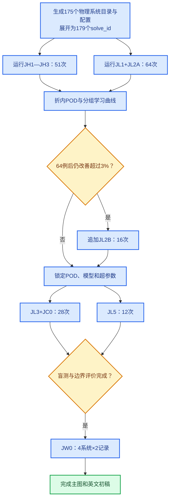

# 第四章与第六章英文期刊论文一月实施计划

_研究周期：约一个月；数值域：统一采用2H侧向净空；更新日期：2026-07-28_

---

## 方案结论

本论文采用“**两层坡地形—地层耦合机理 + 物理引导复频响代理**”作为主线，不另写一篇仅替换机器学习算法的均质坡预测论文。论文借鉴[Ju等2024年论文](../参考文献/Ju_等___2024___Prediction_framework_of_slope_topographic_amplification_on_seismic_acceleration_based_on_machine_lea/Ju%20等%20-%202024%20-%20Prediction%20framework%20of%20slope%20topographic%20amplification%20on%20seismic%20acceleration%20based%20on%20machine%20lea.md)“数值数据库—代理模型—参数分析—工程验证”的组织方式，但不照搬其变量、模型、图表或结论。

相对该类标量最大放大系数预测论文，本研究的增量限定为：

- 输入为坡角、SV波入射角、厚度比、波速比和密度比五个物理变量；
- 输出为完整表面上的水平复频响场，频率和空间是输出坐标而不是伪独立样本；
- 显式比较直接频响、去除一维地层响应后的频响和地形—地层乘性残差；
- 采用按完整物理工况和几何组划分的交叉验证；
- 使用四个未见几何组的冻结盲测、结构化边界挑战和真实波直接有限元闭环；
- 报告校准不确定性和风险—拒绝关系，不用单一全局`R²`代替证据链。

## 2H计算域的论文口径

用户已明确接受2H净空带来的已知偏差，因此本批次不再运行任何新增4H工况，也不设置2H/4H放行门。所有工况均使用`side_clearance=2.0`，由同一配置、网格、输入和后处理协议生成。

这一决定改变的是计算预算，不改变科学表述：

- 可以把完整表面水平复频响作为“统一2H有限元模型”的学习标签；
- 可以评价代理模型相对2H有限元数据的误差；
- 不得写成“2H相对4H已经收敛”或“计算域误差可忽略”；
- 已知H3诊断中的完整表面误差作为论文数值局限保留；
- 竖向响应只作探索性结果，论文主线保持为水平复频响和水平工程指标；
- 若审稿要求计算域敏感性，只能引用现有1H/2H/4H诊断并如实说明，不重新把诊断失败改写为通过。

## 论文问题与可降级结论

论文回答三个问题：

1. 厚度比、波速比、密度比、坡角和入射角如何共同改变水平复频响的峰值、相位和空间迁移？
2. 地形响应与一维地层响应在哪些区域近似可分离，在哪些区域出现显著耦合？
3. 物理残差代理能否在未见几何、预设边界和两条真实波上优于直接代理或简单乘积基线？

如果物理残差模型没有优于直接代理，论文仍可降级为“乘积分解的适用区与失效区”。如果64个开发工况不足且学习曲线仍有实质改善，可追加16个JL2B；若80个开发工况后仍不稳定，应收窄参数域或改为预测固定频带RMS，不继续堆叠模型或把盲测回灌训练。

## 工况预算

| 池 | 设计 | 目录数 | 动力求解数 | 数据角色 |
| --- | --- | ---: | ---: | --- |
| JH1 | `7`个坡角×`5`个入射角，`h=200 m` | 35 | 35 | 均质地形开发基线 |
| JH2 | `5`个几何原型×`h=100/400 m` | 10 | 10 | 尺度一致性分组验证 |
| JH3 | `i=67.5°/75°`×`theta=0°/15°/30°` | 6 | 6 | 陡坡边界 |
| JL1 | `4`个几何—入射锚点×`6`个材料状态 | 24 | 24 | 可解释机理切片 |
| JL2A | H1几何组内的`40`个确定性低差异材料点 | 40 | 40 | 主开发集 |
| JL2B | 第二批`16`个确定性低差异点 | 16 | `0`或`16` | 学习曲线条件扩展 |
| JL3 | `4`个H1网格外几何×`6`个冻结材料点 | 24 | 24 | 最终域内盲测 |
| JC0 | JL3四个未见几何的均质坡 | 4 | 4 | 盲测配对均质Oracle |
| JL5 | 坡角、入射、厚度和材料四类边界×`3`点 | 12 | 12 | OOD风险—拒绝评价 |
| JW0 | `4`个既有系统×`2`条真实波 | 4 | 8 | 时程、PGA和绝对反应谱闭环 |
| **合计** | JL2B不运行/运行 | **159/175** | **163/179** | 一个月基础路线/条件上限 |

JL1的六个材料状态为：

| 状态 | `d/h` | `r_v` | `r_rho` | 用途 |
| --- | ---: | ---: | ---: | --- |
| 薄层弱对比 | 0.20 | 0.80 | 0.85 | 弱耦合端 |
| 薄层强对比 | 0.20 | 0.30 | 0.85 | 薄层共振 |
| 密度低水平 | 0.80 | 0.55 | 0.75 | 与下一行严格配对 |
| 密度高水平 | 0.80 | 0.55 | 0.95 | 识别密度独立效应 |
| 中厚中对比 | 1.10 | 0.55 | 0.85 | 参数域内部 |
| 厚层强对比 | 2.00 | 0.30 | 0.85 | 强耦合端 |

JL2A和JL2B分别采用显式索引段的三维Halton序列生成`d/h`、`r_v`和`r_rho`，不依赖随机库版本。JL3参数在求解前生成并散列，但在模型协议锁定前保持`sealed_model_lock`，不得产生或读取标签。

JC0是JL3未见几何的事后均质Oracle，不是盲测模型的可用输入。JL3上的M2/M3预测必须使用仅由训练数据拟合的均质地形代理；JC0精确`H_topo`只能在盲测预测冻结后用于误差归因和“代理基线误差—耦合残差误差”分账，不能提前替换代理预测。

## 分阶段执行



JH与核心开发集不再受净空科学门阻塞，可以立即运行。JL2B只在完整物理工况分组学习曲线仍有超过约3%的实质改善时启动。JL3、JC0和JL5必须等到POD维数规则、频率—空间权重、缩放、模型族、超参数范围和停止规则全部锁定后运行。JW0在盲测和边界评价完成且模型未回调后启动。

## 机器学习最小配置

开发阶段只保留能够回答论文问题的模型：

- `B1`：`H_1D×H_topo`物理乘积基线；
- `B2`：最近邻或简单插值基线；
- `B3`：Ridge预测折内POD系数；
- `M1`：直接学习`H_2D`；
- `M2`：学习去除一维地层响应后的场；
- `M3`：学习地形—地层乘性耦合残差；
- ARD-GPR作为主不确定性模型，XGBoost作为非线性交互对照。

所有模型使用同一物理工况划分。POD、幅值权重、标准化、缺失处理、物理基线拟合和超参数选择全部在训练折内完成。频率点和空间点不能拆成独立样本；SHAP只能作为模型关联解释，不能写成因果机制。

## 一个月排期

| 周次 | 数值任务 | 写作任务 | 决策点 |
| --- | --- | --- | --- |
| 第1周 | 启动JH1—JH3和JL1 | Introduction、方法框架、数值模型 | 检查长批次稳定性和磁盘增长 |
| 第2周 | 完成JL1与JL2A | 参数域、数据协议、机理图脚本 | 形成64例分组学习曲线 |
| 第3周 | 决定是否运行JL2B；模型锁定后运行JL3、JC0、JL5 | 代理模型、盲测和UQ结果 | 不依据JL3回调模型 |
| 第4周 | 运行JW0并完成直接FE对拍 | Results、Discussion、Abstract和全文整合 | 形成可投稿初稿或明确降级稿 |

现有代表工况表明2H、`h=200 m`单例约需6小时；以4个求解槽估算，163次基础路线的纯求解墙钟时间约为10—17天，分层强对比和失败重算可能继续增加。该估算只用于排期，不是完成承诺。

成功清理后每个工况仍可能保留约0.62 GiB的CAE、NPZ和Excel；完整批次应预留约100 GiB以上。入口在每个阶段执行磁盘预检，成功工况删除ODB等重型过程文件，但保留CAE、STA、MSG、DAT、日志和规范结果；失败工况不自动清理。

每个预期`record_id`必须同时具有成功STA、无显式`***ERROR`的MSG和非空ODB，且目录记录集合与配置完全一致，才能进入后处理；后处理状态也必须逐记录一一对应。JW0双波目录只完成一条记录时不会被标记为通过。入口还会在每次后续阶段启动前复核采样清单散列、人工门绑定和前置工况实际状态。

## 论文主图与最低交付

建议主图为：

1. 数值模型、2H统一计算域和参数定义；
2. JH1均质坡频率—空间复频响及JH2尺度一致性；
3. JL1耦合幅值/相位残差和可分离—强耦合区域；
4. 折内POD模态、学习曲线及B1/B3/M1/M2/M3比较；
5. JL3逐工况盲测误差、代表场和失败个案；
6. 区间校准与JL5风险—拒绝曲线；
7. JW0代理重构与直接有限元的时程、PGA和绝对反应谱对拍。

最低可投稿证据链包括：64个开发工况、24个冻结盲测、12个结构化边界工况和8次真实波直接有限元闭环。JL2B不是最低交付，不能为了扩大样本量延迟盲测和工程闭环。

## 目录与启动命令

正式入口为：

```text
Run/Auto_ch4/Autorun_ch4_J0_v1.py
```

全部配置统一生成到：

```text
Run/ch4_J0_journal_one_month/run-002/
```

旧`Run/ch4_H_homogeneous_baseline/run-006`不得启动；其历史配置和状态不作为J0阶段门或数据来源。J0 `run-001`是在最终恢复锁补丁前生成的未求解准备快照，来源散列已失效，同样不得启动；当前唯一有效J0批次为`run-002`。

准备配置不会启动Abaqus：

```powershell
python "C:\Users\12462\Documents\Code\AbqScripts\Run\Auto_ch4\Autorun_ch4_J0_v1.py" --prepare-only
```

先检查将领取的工况：

```powershell
python "C:\Users\12462\Documents\Code\AbqScripts\Run\Auto_ch4\Autorun_ch4_J0_v1.py" "C:\Users\12462\Documents\Code\AbqScripts\Run\ch4_J0_journal_one_month\run-002" --run-stage homogeneous --dry-run
```

启动均质池和核心开发池：

```powershell
python "C:\Users\12462\Documents\Code\AbqScripts\Run\Auto_ch4\Autorun_ch4_J0_v1.py" "C:\Users\12462\Documents\Code\AbqScripts\Run\ch4_J0_journal_one_month\run-002" --run-stage homogeneous
python "C:\Users\12462\Documents\Code\AbqScripts\Run\Auto_ch4\Autorun_ch4_J0_v1.py" "C:\Users\12462\Documents\Code\AbqScripts\Run\ch4_J0_journal_one_month\run-002" --run-stage core
```

长阶段可用`--max-cases 16`拆成固定队列小批次；再次运行同一阶段只领取仍处于`planned`的工况，不自动重试失败工况。

外层进程中断后，使用`--recover-stage <阶段> --dry-run`先检查，再执行不带`--dry-run`的同一命令。恢复模式只重分类已有完整结果或重新运行后处理，不重新提交Abaqus求解；失败状态仍需人工诊断。正式`run-stage`与`recover-stage`共用run级跨进程独占锁，原进程仍存活时第二个写入进程会在改变状态或启动后处理前失败，避免并发覆盖同一NPZ、Excel和状态文件。若父进程被强杀，残留的`active`所有者记录会继续禁止自动接管；只有人工确认旧Autorun及其`abaqus python`后处理均已退出后，才允许在实际运行或恢复命令中显式增加`--acknowledge-stale-owner`，接管证据会写回锁状态文件。

---

_当前状态：2026-07-28已在`Run/ch4_J0_journal_one_month/run-002/`实际生成175个统一2H物理系统目录，并展开为179个`solve_id`；基础路线为163次，JL2B为16次条件扩样。预生产清单状态为`passed`，51个均质与64个核心开发目录为`planned`，其余60个目录仍受学习曲线或锁模门控制。审计确认ODB、STA、MSG、CAE、NPZ和Excel均为0，`abaqus_started=false`，因此当前仅可称“工况已生成”，不得称“求解已开始”或“数据已完成”。_
