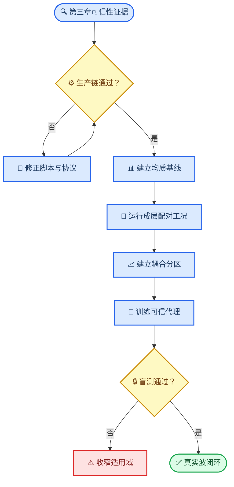
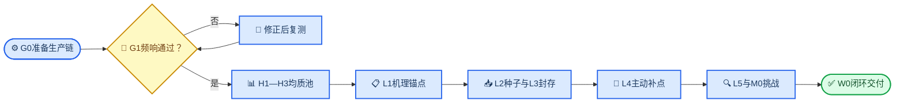
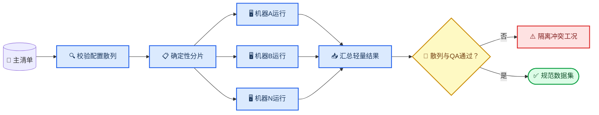

# 数值模拟全流程工况设计方案

_面向第4章机理分析与第6章可信代理建模的当前批准方案，2026-07-17_

---

## 📋 方案定位与执行状态

### Material Passport

| 字段 | 值 |
| --- | --- |
| Origin Skill | `academic-research-suite/experiment-agent` |
| Origin Mode | `plan` |
| Origin Date | `2026-07-17T20:44:57+08:00` |
| Verification Status | `UNVERIFIED` |
| Version Label | `ch4_ch6_case_plan_metrics_storage_20260717` |

本方案只规划第4章“坡地地震动放大效应参数化分析”和第6章“机器学习代理模型”所需工况，并包含支撑两章结论所必需的频响闭环、配对基线、盲测和复现工况。第5章TSSI工况暂不纳入；待TSSI有限元模型、指标和验证链单独敲定后，再形成独立方案。

> 📌 **当前状态：** 工况设计已更新，尚未授权大规模求解。正式批跑前必须先通过本方案的G0生产准备与G1复频响闸门。

原方案已原样归档至[2026-07-17_原数值模拟全流程工况设计方案.md](归档/2026-07-17_原数值模拟全流程工况设计方案.md)，归档文件SHA-256为`5494B4938AA4C7E98604E06FADC75F03AE2312EF0ECCC952CE4CB916CE248AAE`。本文件自本次更新后成为第4、6章工况数量、数据划分和执行顺序的唯一依据。

| 项目 | 本方案处理 |
| --- | --- |
| 第4章均质坡规律 | 重新建立无量纲复频响基线 |
| 第4章成层坡规律 | 两层主池、配对均质基线和多层挑战池 |
| 第6章代理模型 | 复频响、物理残差、冻结盲测和校准不确定性 |
| 既有v3机器学习结果 | 冻结为历史基线，不与新数据混训 |
| TSSI与结构响应 | 暂停，不占用本方案预算 |
| 真非线性土体 | 不进入第6章；EQL仅为第4章条件扩展 |

本方案遵循“先证明计算链可信，再扩大参数空间”的顺序。数值模型可信度按[第三章数值模型与可信性验证实施计划](第三章数值模型与可信性验证实施计划.md)管理；复频响技术细节参考[边坡地震响应机器学习后续实施方案](边坡地震响应机器学习后续实施方案.md)。计算固体力学模型的可信度应由验证、确认和不确定性证据共同支撑，而不能由工况数量替代。[^1]

## 🎯 研究问题与论文证据链

### 中心科学问题

第4章与第6章共同围绕以下问题展开：

> 对斜入射线性成层坡地，地层放大与地形放大在什么频率—空间—参数条件下可以近似相乘，何时产生不可忽略的耦合；能否用带有校准不确定性和适用域拒识的代理模型预测这种耦合？

该定位不宣称首次研究斜入射坡地或首次提出地形—地层分解。既有研究已系统考察斜入射均质岩坡，也已有工作提出地形、地层与谷地效应的近似乘积分解。[^2][^3] 本论文的增量应落在复数全场残差、可分离边界、独立盲测和可信代理模型上。

### 预注册研究问题

| 编号 | 研究问题 | 主要证据 |
| --- | --- | --- |
| RQ4-1 | 均质坡复频响如何随坡角、入射角和无量纲频率变化 | H1、H2、H3 |
| RQ4-2 | 厚度比、波速比和密度比分别如何改变共振峰与空间分布 | L1、L2 |
| RQ4-3 | 地形与地层效应何时近似可分离，何时强耦合 | C0、L1—L5 |
| RQ4-4 | 多层、波速倒转和EQL会如何改变线性两层结论的适用边界 | M0、N0 |
| RQ6-1 | 直接频响、`H_1D`残差和乘性耦合残差中哪一种最可学习 | L1—L4 |
| RQ6-2 | 代理模型能否在固定盲测和未见真实波上保持频域、时域精度 | L3、W0 |
| RQ6-3 | 不确定性和确定性范围门能否可靠识别不可用输入 | L5、M0 |

### 预注册假设

- H1：在固定线性系统中，不同宽频激励提取的复频响在共同有效频带内一致
- H2：当一维场地主峰与均质地形主峰接近时，耦合残差显著增大
- H3：分别保留波速比与密度比，比仅使用阻抗比更能解释残差变化
- H4：学习物理残差比直接学习总频响具有更低盲测误差或更窄校准区间
- H5：拓扑超出“两层体系”时，必须由确定性适用域规则拒绝，不能只依靠GPR方差

### 证据链



## ⚙️ 统一物理定义与参数域

### 主研究边界

第4、6章共享数据必须满足以下条件：

- 二维平面应变坡地自由场
- `tssi_cfg.scene='freefield'`，不建立结构
- 土体线弹性，`eql_cfg.enable=False`
- 基岩与覆盖层材料、阻尼、网格、时间步和静默尾段在生产批次内冻结
- 仅允许输入时程变化，不允许输入波主频反向改变阻尼或网格
- 每个成层工况均有可追溯的`H_1D`和相同坡角、入射角的`H_topo`基线

### 复频响与耦合残差

以施加的基岩上行SV波加速度谱为唯一参考，定义水平和竖向复频响：

\[
H_{2D,k}(f,s)=\frac{\widehat A_{\mathrm{surface},k}(f,s)}
{\widehat A_{\mathrm{incident}}(f)},\qquad k\in\{x,z\}
\]

同一成层剖面的一维自由场频响记为`H_1D(f)`；相同`h,i,\theta`但去除覆盖层后的均质坡复频响记为`H_topo(f,s)`。复数耦合比定义为

\[
R_c(f,s)=\frac{H_{2D,x}(f,s)}
{H_{1D}(f)H_{\mathrm{topo}}(f,s)}
\]

并分别分析

\[
r_A(f,s)=\ln|R_c(f,s)|,\qquad
r_\phi(f,s)=\operatorname{wrap}\{\arg R_c(f,s)\}.
\]

第4章以`r_A`和`r_\phi`共同判断可分离性；第6章比较直接学习`H_2D`、学习`H_2D/H_1D`和学习`R_c`三条路线。只保存幅值而不保存相位的数据不得进入新数据集。

### 复频响、傅里叶谱与反应谱的指标层级

傅里叶谱放大系数和反应谱放大系数均纳入考察，但不能与复频响并列为三个互相独立的主目标。三者按“机理主指标—幅值派生指标—工程解释指标”组织：

| 层级 | 指标 | 主要作用 | 使用范围 | 第6章角色 |
| --- | --- | --- | --- | --- |
| 机理主指标 | 复频响`H_k(f,s)`及`R_c(f,s)` | 同时保留幅值和相位，识别共振、传播与地形—地层耦合 | G1、H1—H3、L1—L5、C0、M0、R0 | 主学习目标 |
| 幅值派生指标 | 傅里叶谱放大系数`FSAF_k(f,s)` | 直观展示不同频带的放大、去放大和主峰迁移 | 从所有有效复频响直接派生 | 不单独训练，作为`|H|`视图和论文图件 |
| 工程解释指标 | 5%阻尼`RSAF_x(T,s;g)`与`URSAF_z(T,s;g)` | 将频域机制映射到不同结构周期下的工程需求 | G1与W0直接闭环；N0直接计算；其余线性工况按冻结记录由`H`重构 | 预测复频响后的下游验证指标，不作为首轮训练标签 |
| 补充标量 | PGA、PGV、Arias强度、峰值位置与既有TAF | 与历史结果、规范表达和时域峰值对接 | W0、N0及代表性机理工况 | 仅作辅助评价 |

以同一基岩上行波为分母时，傅里叶谱放大系数就是复频响的幅值：

\[
FSAF_{\mathrm{inc},k}(f,s)=
\frac{|\widehat A_{\mathrm{surface},k}(f,s)|}
{|\widehat A_{\mathrm{incident}}(f)|}
=|H_{2D,k}(f,s)|.
\]

若考察相对同地层一维自由场的二维附加效应，则另定义

\[
FSAF_{\mathrm{1D},x}(f,s)=
\frac{|\widehat A_{2D,x}(f,s)|}
{|\widehat A_{1D,x}(f)|}.
\]

因此`FSAF`不是新的独立数据样本，也不能替代相位信息；规范数据只保留一份复`H`，绘图和统计时由`|H|`确定性派生`FSAF`，避免两份幅值数据失配。

对指定地震记录`g`和阻尼比`zeta=5%`，统一采用弹性单自由度伪加速度反应谱`PSA`，正文记为`S_a`；`T=0`不混入谱网格，PGA另行报告。同时采用两种反应谱放大口径：

\[
RSAF_{\mathrm{rock},x}(T,s;g)=
\frac{S_{a,2D,x}(T,s;g)}{S_{a,\mathrm{rock,ff},x}(T;g)},
\qquad
RSAF_{\mathrm{1D},x}(T,s;g)=
\frac{S_{a,2D,x}(T,s;g)}{S_{a,1D,x}(T;g)}.
\]

前者表示相对均质岩基自由场的总放大，后者表示相对同地层一维自由场的二维附加放大。竖向自由场在垂直入射时可能接近零，因此竖向分量不定义病态的同分量谱比；另用水平岩基自由场为统一分母定义`URSAF_z=S_a,2D,z/S_a,rock,ff,x`，并同时报告绝对`S_a,z`。周期范围初定为`0.10—2.00 s`的40个对数等距点，并单列`0.10、0.20、0.50、1.00、2.00 s`；G1后按复频响共同有效频带冻结最终范围。`RSAF`依赖具体波形，不能把不同记录的结果伪装成同一个系统固有属性。

响应谱层面的可分离误差定义为

\[
r_{Sa}(T,s;g)=\ln\frac{S_{a,2D}(T,s;g)}{S_{a,\mathrm{sep}}(T,s;g)},
\]

其中`S_a,sep`必须由`H_1D(f)H_topo(f,s)A_inc(f)`反变换得到分离近似时程后再计算。由于反应谱含时域极值运算，不允许直接把两个标量反应谱放大系数相乘来代替该过程。

当前[Postprocess_All_surface_v2.py](../../Postprocess/Postprocess_All_surface_v2.py)已完成增量升级：`compute_complex_H`在候选物理频带内保存复数`H`、输入谱和显式`valid_mask`，无效频点为复`NaN`；`FSAF_inc=|H|`由同一数组确定性派生并通过CSV回读一致性检查；原先容易误解的`H_topo_h`已改名为`FSAF_station_h`，只表示同侧端点参考台站谱比，不冒充匹配均质坡`H_topo`。脚本同时用Newmark平均加速度法计算5%阻尼`PSA`、`RSAF_rock`、`RSAF_1D`和`URSAF_z`，并保存完整周期网格与关键周期结果。规范数组统一进入`surface_results.npz` schema 2，旧`H_surface_*`/`H_topo_h`文件仅保留读取兼容。

反应谱参考文件接口固定在`case_config.json`的`run_cfg.response_spectrum_cfg`内，不新增生产配置顶层键：

```json
{
  "run_cfg": {
    "qa_cfg": {
      "required": ["theory", "reflection", "mesh", "time", "domain", "energy", "external", "frf", "response_spectrum"],
      "min_frf_valid_bins": 8
    },
    "response_spectrum_cfg": {
      "enable": true,
      "damping_ratio": 0.05,
      "period_min": 0.10,
      "period_max": 2.00,
      "period_count": 40,
      "key_periods": [0.10, 0.20, 0.50, 1.00, 2.00],
      "denominator_ratio": 1e-8,
      "reference_min_coverage": 0.99,
      "reference_files": {
        "<record_id>": {
          "rock": "<同一记录的均质岩基自由场 time-acc 两列文件>",
          "one_d_left": "<左侧同地层一维自由场 time-acc 两列文件>",
          "one_d_right": "<右侧同地层一维自由场 time-acc 两列文件>"
        }
      }
    }
  }
}
```

三个参考文件必须覆盖ODB观测时窗；默认覆盖率低于99%即不通过反应谱协议。缺文件、覆盖不足或谱分母过小时，绝对`PSA`仍保留，但对应`RSAF/URSAF`为`NaN`且`valid_mask=False`，不得回退到`factor_h×input`、当前`theory_acc_h`或epsilon分母。若左右地层完全一致，可用`one_d`显式指定左右共用的同一个真实一维参考文件。

规范NPZ的核心键按记录写为`frf_<record>_*`与`rsa_<record>_*`：前者包含`frequency`、`H_surface_h/v`、`H_surface_over_1D_h`、`H_station_h`、各自`valid_mask`和复数`sgrid_H_*`；后者包含`period`、`key_period`、`PSA_surface_h/v`、三类放大系数、各自有效掩码、真实参考时程与`sgrid_*`。`quality_json`记录FFT长度、频带、掩码阈值、FSAF一致性、Newmark参数、参考来源和覆盖率。

### 输入变量与输出坐标

`eta`或无量纲频率不再作为单个工况级输入。每个物理工况的输入为

\[
X=[i,\theta,d/h,r_v,r_\rho],
\quad
r_v=V_{s,c}/V_{s,b},
\quad
r_\rho=\rho_c/\rho_b .
\]

输出是定义在无量纲频率—空间坐标上的函数：

\[
Y=H(\xi_f,s),\qquad \xi_f=fh/V_{s,b}.
\]

频率点和空间点是同一物理工况的输出坐标，不得拆成相互独立的训练样本。泊松比和阻尼先固定，再通过L1c判断是否需要升级为七维扩展模型。

### 主参数域

| 参数 | 主研究域 | 结构化水平 | 处理原则 |
| --- | --- | --- | --- |
| 坡高`h` | 200 m | 50、100、200、400 m | 200 m用于生产；其余仅验证尺度一致性 |
| 坡角`i` | 15°—60° | 15°、22.5°、30°、37.5°、45°、52.5°、60° | 67.5°、75°仅作边界挑战 |
| 入射角`theta` | 0°—30° | 0°、5°、10°、15°、20°、25°、30° | 必须低于临界角并留2°裕度 |
| 厚度比`d/h` | 0.20—2.00 | 0.20、0.35、0.50、0.80、1.10、1.50、2.00 | 0.10、2.50仅作边界挑战 |
| 波速比`r_v` | 0.30—0.80 | 0.30—0.80，步长0.10 | 与密度比独立采样 |
| 密度比`r_rho` | 0.75—0.95 | 0.75—0.95，步长0.05 | 不再由阻抗比替代 |
| 覆盖层泊松比 | 固定0.35 | 0.25、0.35、0.40 | L1c鲁棒性检查 |
| 覆盖层阻尼比 | 固定0.03 | 0.01、0.03、0.05 | L1c鲁棒性检查 |
| 分层形态 | 水平层界面 | `horizontal` | `terrain`放入M0 |
| 基岩参数 | `Vs=2000 m/s`、`rho=2500 kg/m3`、`nu=0.30` | 固定 | 不进入主采样 |

候选工况若触发临界角、几何净空、薄层网格或材料合法性约束，应记录拒绝原因，并从同一确定性序列继续补点，直到各数据池达到目标数量。

### 频率与空间输出

- 目标绝对频带初定为0.5—10 Hz；G1结束后以所有代表工况的共同有效频带冻结正式范围
- 同时保存`f`、`xi_f=fh/Vs_b`和`fh/Vs_c`，避免不同参考波速导致解释混乱
- 空间采用坡顶平台120点、坡面60点、坡脚平台80点，共260点
- 重采样前单独保存原始节点上的峰值、峰位和近峰区宽度，避免插值削峰
- 水平`H_x`为第6章主目标；竖向`H_z`作为次目标并保留有效谱掩码，不定义病态的竖向比值分母
- `FSAF=|H|`由复频响确定性派生，沿用完全相同的频带掩码和空间网格
- 5%阻尼`RSAF`初定使用`0.10—2.00 s`周期网格，并同时保存`record_id`、参考口径和阻尼比
- `RSAF`分母低于冻结阈值的周期点写入无效掩码，不用epsilon分母制造假放大峰

### 可分离判据

在打开盲测集之前，以第三章数值不确定性和G1频响一致性结果冻结`u_A`与`u_phi`。初始工程阈值为

\[
\tau_A=\max[\ln(1.10),3u_A],\qquad
\tau_\phi=\max[0.20\ \mathrm{rad},3u_\phi].
\]

| 分区 | 幅值条件 | 相位条件 |
| --- | --- | --- |
| 近似可分离 | `P95(|r_A|)<=tau_A` | 圆周RMSE`<=tau_phi` |
| 过渡区 | 仅一个条件超限 | 需要独立工况复核 |
| 强耦合 | 两个条件均超限 | 必须在L3盲测中重复出现 |

阈值只能在G1后、L3盲测解封前调整一次，调整必须依据数值误差下限并留下变更记录，不能为改善结果而放宽。

## 🧪 工况池与样本预算

### 总体预算

本方案把计算资源优先投入严格配对、冻结盲测、真实波闭环和跨机器复现。核心线性路线的上限约为2895次动力求解；条件扩展N0增加120次，总上限约3015次。配置散列去重后实际数量可略低，但不得以去重为由减少盲测或挑战工况。

| 类别 | 物理工况 | 动力求解上限 | 主要用途 |
| --- | ---: | ---: | --- |
| G0—G1生产与频响闸门 | 8 | 48 | 证明复频响链可用 |
| H1—H3均质基线 | 99 | 99 | 第4章均质规律、尺度与边界 |
| L1—L5两层主池 | 1432 | 1432 | 第4章机理、第6章训练与评估 |
| C0匹配均质对照 | 最多948个唯一对照 | 948 | 构造`H_topo`与`R_c` |
| M0多层挑战 | 96 | 96 | 第4章适用边界、第6章确定性拒识 |
| W0真实波闭环 | 40×6 | 240 | 时域闭环与未见波验证 |
| R0跨机器重复 | 16×2 | 32 | 多机一致性 |
| N0 EQL条件扩展 | 24×5 | 120 | 第4章强度边界，不进入第6章 |

### G0—G1生产与复频响闸门

选取8个代表物理系统：均质坡2个、弱对比薄层2个、中等对比2个、强对比厚层2个。每个系统运行：

1. 三种相互独立且共同覆盖目标频带的宽频合成激励
2. 一种激励的幅值缩放副本
3. 两条不参与频响提取的真实记录

共`8×6=48`次求解。G1通过后，从三种候选激励中冻结一个标准生产激励；后续每个线性物理工况原则上只运行一次。

### H1—H3均质基线

| 池 | 设计 | 数量 | 用途 |
| --- | --- | ---: | --- |
| H1 | 7个坡角×7个入射角，`h=200 m` | 49 | 连续均质频响图谱 |
| H2 | 从H1选12个原型，追加`h=50/100/400 m` | 36 | 验证无量纲尺度一致性 |
| H3 | `i=67.5/75°`×7个入射角 | 14 | 坡角边界与拒识测试 |

H2不作为36个独立训练样本；同一无量纲原型必须保持同组，专门用于检验不同绝对尺度下`H(xi_f,s)`是否一致。

### L1结构化机理锚点

L1提供第4章可以直接解释的控制切片，不由主动学习替代。

| 子池 | 设计 | 数量 | 主要回答 |
| --- | --- | ---: | --- |
| L1a | 6个`(i,theta)`组合×7个`d/h`×6个`r_v`，`r_rho=0.85` | 252 | 厚度—波速与双重共振 |
| L1b | 6个`(i,theta)`组合×6个`r_v`×5个`r_rho`，`d/h=0.80` | 180 | 同阻抗异材料是否可辨 |
| L1c | 8个代表基准×3个泊松比×3个阻尼比 | 72 | 固定材料简化是否成立 |

L1a和L1b使用以下6个几何—入射组合：

\[
(15^\circ,0^\circ),\ (30^\circ,15^\circ),\
(45^\circ,0^\circ),\ (45^\circ,30^\circ),\
(60^\circ,15^\circ),\ (60^\circ,30^\circ).
\]

L1c若显示泊松比或阻尼对关键区`P95(|r_A|)`的效应超过`tau_A`，则启动七维条件扩展；否则第6章继续使用固定泊松比和阻尼的五维主模型。

### L2—L5连续采样与评估

| 池 | 生成方式 | 数量 | 是否训练 |
| --- | --- | ---: | --- |
| L2种子集 | 五维扰动Sobol序列，种子`20260717` | 512 | 是 |
| L3冻结盲测 | 独立扰动Sobol序列，种子`20260718` | 128 | 否 |
| L4主动补点 | 三批，每批64 | 0—192 | 是 |
| L5结构化边界 | 四类挑战，每类24 | 96 | 否 |

L3在任何POD、特征缩放、模型选择和主动学习之前生成并封存。L5四类边界为：

- 坡角边界：`i=67.5°`或`75°`
- 入射边界：`theta=27°—30°`且接近允许上界
- 厚度边界：`d/h=0.10`或`2.50`
- 材料边界：`r_v=0.25/0.85`或`r_rho=0.70/1.00`

每类边界用独立确定性序列在其余主域变量上分层取24点；若候选违反临界角或几何合法性约束，则按固定顺序补取，不得人工挑选“容易收敛”的工况。

主研究域外的L5工况只用于界定失效边界，不得回灌训练后再报告为“外推测试”。

### C0严格配对均质对照

每个L1—L5成层工况必须能够关联到相同`h,i,theta`的均质坡对照。连续采样产生新`i,theta`组合时，同时生成对应`H_topo`工况；相同配置散列的均质对照只运行一次并复用。

C0的上限按948个唯一`(h,i,theta)`组合预留。若后续决定不用乘性残差作为第6章主模型，这些对照仍用于第4章可分离性分析，不视为无效计算。

C0必须继承母工况的数据角色：L2对应对照可用于训练，L3对应对照与L3一起封存，L5对应对照只用于边界评估。不得把盲测成层工况的精确`H_topo`提前放入均质代理训练集。

### M0、W0、R0与N0

M0包含四类多层或拓扑挑战，每类24个，共96个：

- 两个覆盖层的正常递增剖面
- 波速倒转剖面
- 薄软或薄硬夹层
- `horizontal`与`terrain`分层形态对照

M0先冻结24个两层基准原型，再对每个原型生成四类拓扑变体，形成严格配对的96个工况。M0不进入第6章训练。第6章首先根据`n_layers`和`surface_geometry`做确定性拒识，再报告代理模型在强制输入这些工况时的失效表现。

W0从H1、L3、L5和M0中分层冻结40个代表工况，每个工况运行6条未用于频响提取的真实记录，共240次。工况清单和记录清单均须在第6章模型训练前冻结。记录按低/中/高主频、短/长持时和近/远场谱形覆盖选择；在线性主研究中统一幅值只用于数值闭环，不把记录数量误写成独立材料样本。

R0选16个代表工况，在两台不同电脑上各运行一次，当前预算为32次。两台电脑必须使用相同Abaqus版本、求解精度、脚本提交、配置和输入文件；若无法统一，`machine_id`必须作为数值区组记录，并扩大重复检查。每增加一台生产电脑，追加同一组16次校准运行，追加量不计入3015次基准预算。

N0为条件扩展：从主池选24个软土或强耦合代表工况，在0.05g、0.10g、0.20g、0.40g和0.80g下运行EQL，共120次。N0只回答线性规律的强度适用边界，不进入复频响代理训练，也不与线性`H`合并。

## 🔄 分阶段执行与硬闸门

### 阶段顺序



### G0生产准备

在启动任何正式求解前，必须完成：

- 从[Autorun_template_v2.py](../../Batch/Autorun_template_v2.py)按数据池派生正式`Batch/Autorun_ch4_<pool>_v1.py`，但不得直接把当前模板当作生产入口
- 配置段只能使用`material_cfg`、`geometry_cfg`、`damping_cfg`、`mesh_cfg`、`time_cfg`、`freefield_cfg`、`run_cfg`、`eql_cfg`和`tssi_cfg`
- 对未知配置键、缺失必需键、重复`case_id`和非法临界角立即失败，不允许静默忽略
- 强制`tssi_cfg.scene='freefield'`、`eql_cfg.enable=False`、`run_cfg.critical_angle_check=True`
- 显式冻结`damping_cfg.fc`、网格、时间步、总时长、静默尾段和输出频率
- 后处理已升级为复频响、相位、有效频带掩码、`FSAF`派生视图、5%阻尼反应谱与质量JSON；原`H_topo_h`已更名为参考台站谱比，避免与匹配均质坡`H_topo`混淆
- 每条用于`RSAF`的记录必须保存同一输入下的均质岩基自由场与匹配一维成层参考谱；不得用单个自由面PGA系数或当前`theory_acc_h`近似整条反应谱分母
- 求解或后处理失败时保留ODB和日志；仅在完整QA通过、轻量产物校验成功后删除大文件
- 每个工况写出配置散列、脚本散列、输入散列、Git提交和运行状态

G0至少用12个只建模或短时工况验证配置注入，`case_meta.json`必须逐项与主清单一致。

### G1频响验收

| 检查 | 初始门槛 | 失败处理 |
| --- | --- | --- |
| 不同宽频激励的`log|H|` | 加权RMSE`<=5%` | 检查频带、窗口、阻尼与网格 |
| 不同激励的相位 | 圆周RMSE`<=0.20 rad` | 检查时间零点和相位展开 |
| 幅值缩放不变性 | 系统漂移`<=2%` | 检查线性材料与归一化 |
| `FSAF`派生一致性 | 有效频带内与`|H|`相对差`<=1e-8` | 检查复数存储和掩码是否错位 |
| 远场一维对拍 | 幅值`<=5%`且相位`<=0.20 rad` | 检查自由场和边界 |
| 两条真实波闭环 | 关键指标达到预注册门槛 | 禁止扩大L2 |

真实波闭环的初始目标为：PGA/PGV中位相对误差不超过5%、95分位不超过10%；关键周期Sa中位误差不超过8%、95分位不超过15%；Arias强度中位误差不超过8%；峰值位置误差不超过`0.10h`。最终门槛可在G1后依据已验证数值误差下限调整一次。

### 主动学习停止条件

L4每批64个工况，候选评分同时考虑：

- 复频响重构到原空间后的加权预测方差
- 与已有工况的最小距离和批次多样性
- 坡肩、坡面和共振频带权重
- 预计求解成本与历史失败概率

满足以下任一条件时停止补点：

1. 已完成三批，共192个工况
2. 连续两批的折内复频响误差改善均小于2%，且校准覆盖率没有实质改善
3. 新增高不确定性点集中在主研究域外，应改为收窄适用域而非继续填充

L3盲测误差不得用于主动学习停止判断。

## 📊 第4章分析与结果组织

### 章节证据映射

| 第4章内容 | 使用工况 | 核心输出 |
| --- | --- | --- |
| 均质坡方向效应 | H1 | `H_topo(xi_f,s)`、`FSAF`图谱、峰值与峰位 |
| 无量纲尺度验证 | H2 | 跨`h`复频响差异 |
| 陡坡适用边界 | H3、L5 | 误差与拒识边界 |
| 厚度—波速耦合 | L1a | 共振峰、空间迁移和交互效应 |
| 波速—密度可辨识性 | L1b | 同阻抗异频响对照 |
| 材料简化鲁棒性 | L1c | 泊松比、阻尼效应量 |
| 连续参数机制图 | L2、L4 | 全局敏感性与耦合分区 |
| 独立确认 | L3 | 分区图确认率与误判工况 |
| 多层与强度边界 | M0、N0 | 结论适用范围及强度相关`RSAF`迁移 |
| 时域与工程谱闭环 | W0 | PGA、PGV、Sa、`RSAF`、Arias和峰位 |

### 主要分析指标

第4章不得只报告单点`TAF_max`。至少同时报告：

- `H_x`和`H_z`的幅值、相位及有效频带
- 与`|H|`同源的`FSAF_inc`和`FSAF_1D`频率—空间分布，不将其重复计为独立证据
- W0和N0的5%阻尼水平`RSAF_rock`、`RSAF_1D`、竖向`URSAF_z`及`r_Sa`；按记录分别报告并汇总中位数与离散性
- 坡肩、坡面、坡脚和远场分区的加权误差
- 原始节点上的峰值、峰位、近峰区宽度和坡后衰减距离
- 一维场地主峰`f_site`与均质地形主峰`f_topo`的频率接近度
- `r_A`、`r_phi`、可分离分类和超阈值频率—空间面积
- 基于物理工况分组的效应量、置信区间和全局敏感性

发现性分析使用H1、L1、L2和L4；L3只进行一次确认性检验。频率点与空间点不作为独立重复，置信区间和重采样以物理工况为基本单元。涉及大量频率—空间比较时，优先使用预注册的全局指标；局部显著性图必须控制多重比较。

### 可形成的论文结论

只有证据闭环后，才允许形成以下层级的结论：

1. 在已验证参数域内，量化斜入射均质坡的复频响规律
2. 区分厚度比、波速比和密度比的独立作用及交互
3. 给出近似可分离、过渡和强耦合参数区
4. 证明或否定“一维场地×均质地形”乘积近似的适用范围
5. 说明两层结论向多层、分层形态和EQL扩展时的失效方式

在独立外部坡地基准仍未闭环的情况下，可以报告已验参数邻域内的数值规律，但不能直接提出普适规范修订系数。

## 🧠 第6章数据集与代理模型

### 数据集角色

| 数据池 | 第6章角色 | 是否可见 |
| --- | --- | --- |
| H1 | 独立均质代理与物理基线 | 训练可见 |
| H2 | 尺度一致性测试 | 整组划分 |
| L1 | 机理锚点 | L1a/b可见；L1c按扩展门处理 |
| L2 | 主训练种子 | 训练可见 |
| L3 | 最终域内盲测 | 全流程封存 |
| L4 | 主动学习补点 | 训练可见 |
| L5 | 结构化边界评估 | 不训练 |
| C0 | 均质配对基线 | 继承母工况划分 |
| M0 | 拓扑适用域挑战 | 不训练 |
| W0 | 未见波时域闭环 | 不训练 |

既有v3的522个时域TAF样本保留为历史基线，不与新复频响数据拼接。v3回答“已知三波条件下的几何插值”，新数据回答“线性系统复频响及未见波重建”，两者不能共用精度口径。

第6章采用两个相互衔接但不混为一个输入空间的代理：均质代理`S_topo: [i,theta] -> H_topo`由H1和训练角色的C0构建；两层代理`S_layered: [i,theta,d/h,r_v,r_rho] -> H_2D`或物理残差由L1a/b、L2和L4构建。均质工况不通过虚构`d/h=0`、`r_v=1`并入两层模型，避免在退化面引入不连续编码。

### 模型比较顺序

| 编号 | 方法 | 作用 |
| --- | --- | --- |
| B0 | 解析`H_1D` | 无二维地形的物理下限 |
| B1 | `H_1D×H_topo` | 近似可分离物理基线 |
| B2 | 最近邻或规则插值 | 非机器学习查表基线 |
| M1 | 直接学习复`H_2D` | 判断原始任务难度 |
| M2 | 学习`H_2D/H_1D` | 去除一维层状主峰 |
| M3 | 学习复耦合比`R_c` | 主创新候选 |

每种机器学习方法必须使用同一数据划分。二维POD、频率—空间权重、标准化、缺失处理、物理基线拟合和超参数选择全部在训练折内完成。GPR为主力不确定性模型，XGBoost作为非线性对照和特征归因模型；若最终训练工况超过精确GPR的稳定规模，稀疏近似必须先在同一子集上与精确GPR对拍。

第4章可使用每个工况的精确FEM配对`H_topo`计算物理耦合残差；第6章评估可部署的M3时，测试折和L3必须使用由训练折拟合的`S_topo`预测值。测试工况的精确`H_topo`只作为事后误差分解的Oracle对照，不能作为模型输入。

第6章首轮不另建`FSAF`代理，因为它与`|H|`完全同源；另建模型只会重复标签并制造不一致。`RSAF`也不作为首轮高维训练目标，而是将预测复频响作用于W0未见记录、重构时程后计算，用于检验代理模型能否保持工程反应谱意义。只有后续工程应用明确要求绕过时程重构，才考虑增加低维`RSAF`专用代理，并必须与复频响路线在同一盲测集上比较。

### 评估协议

- 内层模型选择：按无量纲物理原型分组的五折交叉验证
- 外层域内评估：一次性解封L3的128个工况
- 结构化外推：L5四类边界分别报告，不汇总成单一高分
- 拓扑拒识：M0先执行规则门，再观察模型失效
- 未见波验证：W0以预测复频响乘以真实波谱，经IFFT重建时程

主要指标包括：

- 有效频带`log|H|`的MAE和95分位误差
- 相位圆周RMSE与复数NRMSE
- 坡肩、坡面、坡脚和远场分区误差
- 重建后的PGA、PGV、Sa、Arias强度和峰值位置误差
- `FSAF`频带峰值、峰频和频带积分误差，以及5%阻尼`RSAF`的周期分区误差
- 80%与95%预测区间的实际覆盖率、平均宽度和失配位置
- 可分离分类的准确率、召回率和边界混淆

不得以全空间平均`R2`单独证明模型可用。

### 适用域与盲测纪律

适用域判定按以下顺序执行：

1. 拓扑门：仅接受均质或单覆盖层+基岩
2. 物理门：检查坡角、入射角、厚度比、材料范围和临界角
3. 距离门：检查到训练设计的距离和凸包位置
4. 不确定性门：使用经L3校准的区间宽度与覆盖率

L3及其C0配对对照只允许在数据协议、POD维数选择规则、模型族、超参数搜索范围和停止条件全部冻结后解封一次。若解封后修改模型并再次使用L3选型，原L3立即降级为开发集，必须重新生成独立盲测集。

## 💾 多机运行与数据治理

### 正式工况目录与命名

所有会进入论文正文、图表或第6章数据集的有限元工况及产物统一放入`Run/`。`test/Abaqus/`只保存不进入正文的临时诊断，二者不得混用。第6章直接复用第4章的有限元数据与主清单，不复制一套`ch6`模拟目录。

```text
Run/
├─ ch4_00_case_registry/
│  └─ master_manifest.csv
└─ ch4_<task_id>_<english_name>/
   └─ run-###/
      ├─ run_manifest.json
      ├─ results/
      └─ case-<pool_id>-<six_digit_seq>/
         ├─ case_config.json
         ├─ case_meta.json
         ├─ surface_results.npz
         ├─ surface_results.xlsx
         └─ logs_and_optional_odb
```

命名规则如下：

- 研究单元目录采用`ch4_<task_id>_<english_name>`，例如`ch4_G1_frequency_gate`、`ch4_L2_sobol_seed`和`ch4_W0_real_wave_closure`
- `english_name`只用小写英文与下划线，不加`v1/v2`；版本由Git提交和清单散列管理
- 每次正式启动自动创建不可变的`run-###`；失败、补算或配置修正均递增编号，不覆盖旧run
- `case_id`固定为`<pool_id>-<six_digit_seq>`，例如`L2-000173`，目录名为`case-L2-000173`
- 几何、材料与波动参数全部写入主清单和`case_config.json`，不再把全部浮点参数塞入长目录名；`config_sha256`负责识别同名异配置
- 一个`case_id`表示一个物理系统；不同输入记录和强度使用`record_id`与`solve_id=<case_id>__<record_id>`区分，不伪装成独立材料工况
- 正式批处理入口由[Autorun_template_v2.py](../../Batch/Autorun_template_v2.py)派生并放在`Batch/`；`test/Batch/`只放临时测试入口

### 单一主清单

所有电脑必须从同一个`master_manifest.csv`领取工况，不允许各自在本地重新随机采样。主清单至少包含：

| 字段 | 作用 |
| --- | --- |
| `case_id`、`solve_id`、`record_id`、`pool_id`、`split` | 物理工况、动力求解和数据角色 |
| `run_id`、`case_dir`、`attempt_id` | 正式Run目录与重算追踪 |
| `config_sha256`、`input_sha256` | 防止同名异配置 |
| `model_git_commit`、脚本散列 | 固定代码版本 |
| `shard_id`、`machine_id` | 多机分片与追踪 |
| `abaqus_version`、求解精度 | 识别机器区组 |
| `status`、`failure_reason` | 支持恢复与失败审计 |
| `result_sha256`、QA字段 | 合并前完整性校验 |

### 多机分片与合并



### 运行规则

- 正文相关原始Abaqus工况与产物放入`Run/ch4_<task_id>_<english_name>/run-###/case-<case_id>/`
- 正式启动入口放入`Batch/Autorun_ch4_<pool>_v1.py`，由普通Python接收对应的`run-###`绝对路径
- `test/Batch/`与`test/Abaqus/`只用于不进入论文正文的临时诊断；若某测试结果转为正文证据，必须在新的正式run中按冻结配置复现
- 每台电脑开始分片前先运行同一组机器校准工况
- 分片按主清单中的`shard_id`执行，禁止按文件夹发现顺序临时分配
- 工况状态采用`planned/running/solved/processed/passed/failed`，写入必须原子化
- 失败工况不得被新运行覆盖；修复后使用新的`attempt_id`
- ODB只有在`processed`和全部必需QA通过后才可删除
- 规范数据集以复频响NPZ、`valid_mask`、质量JSON、元数据和主清单为准；`FSAF`由`|H|`派生，`RSAF`必须附带周期网格、阻尼比、`record_id`与参考口径，CSV幅值表仅用于人工检查
- 每台电脑可根据许可证、内存和CPU设置1—2个并发任务，但同一工况的`num_cpus`和求解精度必须统一

R0跨机器重复的初始一致性门槛为：`log|H|`加权差不超过2%，相位圆周RMSE不超过0.05 rad。超限时不得简单平均，应先确认Abaqus版本、处理器架构、求解精度、脚本提交和输入散列。

## ⚠️ 风险、停止条件与变更规则

| 风险 | 触发信号 | 决策 |
| --- | --- | --- |
| 配置未真正注入 | `case_meta`与主清单不一致 | 停止全部求解，修复G0 |
| 频响依赖激励 | G1幅值或相位超限 | 禁止生成L2 |
| 匹配基线缺失 | 无法构造同`i,theta`的`H_topo` | 工况不得进入残差分析 |
| L1c材料效应过大 | 超过可分离阈值 | 启动七维扩展，不掩盖效应 |
| 参数区失败集中 | 某局部求解失败率超过5% | 暂停该区并诊断，不直接删点 |
| M3没有增益 | 盲测不优于M2 | 保留第4章残差分析，第6章采用M2 |
| 不确定性失配 | 95%区间覆盖明显不足 | 校准或保形化，禁止发布“可信区间” |
| 主动学习只追逐域外点 | 高分候选集中在边界外 | 收窄适用域，不盲目扩样 |
| 多机结果不一致 | R0超限 | 将机器作为区组并重新校准 |
| TSSI混入数据 | `scene!='freefield'` | 立即隔离，禁止进入第4、6章 |

工况预算是上限，不是必须耗尽的配额。允许在主动学习达到停止条件后少跑L4；不允许减少L3、L5、W0和R0来换取更多训练样本。

任何参数域、阈值、数据划分或模型目标的变更必须同时记录：

- 变更时间与理由
- 变更前后定义
- 受影响的`case_id`
- 是否已查看盲测结果
- 是否需要重新生成盲测集

## ✍️ 实施清单、同步规则与依据

### 当前任务清单

- [x] 归档原全流程工况设计方案
- [x] 冻结第4、6章共享研究问题和工况池
- [x] 冻结复频响—傅里叶谱—反应谱三级指标及正式`Run/`命名规则
- [ ] 修复并验证生产批处理入口
- [x] 升级复频响、`FSAF/RSAF`后处理与质量协议（普通Python、Abaqus Python 2.7协议及既有ODB端到端链路测试通过，物理验收仍由G1完成）
- [ ] 生成G0配置注入测试和G1的48次闸门工况
- [ ] G1通过后生成完整主清单、L3盲测密封清单和多机分片
- [ ] 依次运行H1—H3、L1、L2、L4、L5与M0
- [ ] 锁定模型后解封L3，并执行W0与R0
- [ ] 主线完成后再决定是否运行N0

### 文档同步规则

- 本方案负责工况数量、参数域、数据角色和阶段状态
- [边坡地震响应机器学习后续实施方案](边坡地震响应机器学习后续实施方案.md)继续负责复频响、POD、GPR与数据协议细节；其中旧150工况预算由本方案替代
- 第4章和第6章正文当前保留既有结果，不立即把计划数量写成已完成数据
- G1通过并冻结主清单后，更新第4章`4.2.4`和第6章`6.2`的数据来源
- 每完成一个工况池，必须同步本文件状态、主清单统计和论文中相应的“已完成/待完成”表述

### 当前接口

- [全流程有限元模拟模板](../../Batch/Autorun_template_v2.py)
- [统一坡地建模脚本](../../Modeling/slope_frame_ssi_full_v2.py)
- [当前地表后处理脚本](../../Postprocess/Postprocess_All_surface_v2.py)
- [当前结果汇总脚本](../../Postprocess/Collect_All_results_v2.py)
- [第4章Markdown](../论文材料/章节Markdown/第4章_坡地地震动放大效应参数化分析.md)
- [第6章Markdown](../论文材料/章节Markdown/第6章_基于机器学习的坡地地震动放大效应预测模型.md)

### 外部依据

[^1]: ASME. (2019, reaffirmed 2025). “V&V 10 — Standard for Verification and Validation in Computational Solid Mechanics.” https://www.asme.org/codes-standards/find-codes-standards/standard-for-verification-and-validation-in-computational-solid-mechanics

[^2]: Shen, et al. (2024). “Numerical evaluation of ground motion amplification of rock slopes under obliquely incident seismic waves.” `Soil Dynamics and Earthquake Engineering`, 178, 108488. https://doi.org/10.1016/j.soildyn.2024.108488

[^3]: di Lernia, et al. (2024). “Approximate decoupling of topographic, stratigraphic and valley effects on the peak seismic acceleration.” `Soil Dynamics and Earthquake Engineering`, 183, 108758. https://doi.org/10.1016/j.soildyn.2024.108758

---

_维护状态：指标层级与正式Run存放规则已修订，等待G0生产链和后处理升级以及G1频响闸门执行。_
