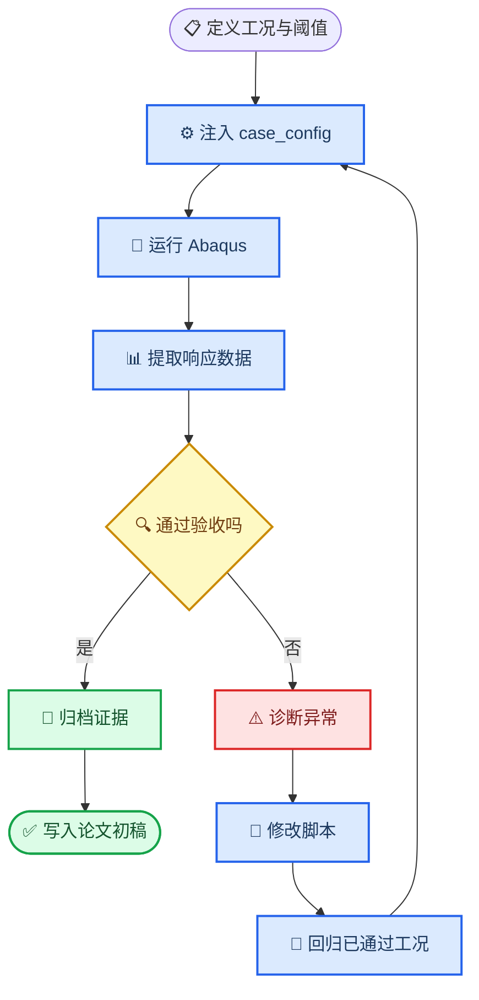

# 第三章数值模型与可信性验证实施计划

_适用对象：斜入射成层坡地有限元模型；目的：从零建立“模拟—诊断—修复—回归—成文”的第三章执行链。_

---

## 🎯 研究边界与交付目标

第三章暂定为“斜入射成层坡地地震响应有限元模型与可信性验证”。本章不讨论参数规律、机器学习精度或结构响应，只交付一个可复现的数值试验平台：在规定的二维连续介质、稳定振动响应和目标频带范围内，能够正确施加斜入射输入、控制离散与截断误差，并输出后续章节可直接使用的统一响应数据。

本计划将既有脚本仅视为待检验的初始实现，不将任何既有工况结果、结论或既有“验证通过”记录作为本章证据。所有进入论文的数值、图表和表述，均须由本计划下新建的工况重新生成并通过对应验收门槛。

## 📋 章节—试验单元矩阵

| 单元 | 对应小节 | 要解决的问题 | 最小模拟集 | 通过条件 | 允许写入论文的内容 |
| --- | --- | --- | --- | --- |
| U0 | 执行前置 | Autorun、Abaqus、建模和后处理能否在独立目录闭环 | 1 个均质基准工况 | 退出码为 0；日志、`case_meta.json`、ODB 后处理数据齐全 | 仅作为内部准备，不单列论文结果 |
| U1 | 3.2—3.3 | 物理边界、几何、分层与观测体系是否被准确实现 | 坡地与平坦对照各 1 组 | 几何尺寸、材料分区、节点集与观测点均通过程序化检查 | 模型范围、假定、几何和材料参数 |
| U2 | 3.4 | 斜入射输入与人工边界是否正确 | 均质半空间、平坦成层场地各 1—2 组 | 与解析解或独立一维解的目标量相对误差不超过 2% | 输入方法、边界处理与适用范围 |
| U3 | 3.5 | 网格、时间步、计算域和阻尼是否造成不可接受误差 | 每项 3 档，共 9—12 组 | 关键响应在两次细化间变化不超过 5%；无非物理高频振荡 | 数值离散准则与最终参数取值 |
| U4 | 3.6.1—3.6.3 | 远场退化、边界反射和内部一致性是否满足要求 | 目标坡地 3—5 组 | 远场与理论解误差不超过 5%；反射波不污染目标响应窗 | 内部验证证据与误差预算 |
| U5 | 3.6.4 | 复杂二维坡地结果是否与独立公开基准一致 | 至少 1 组未参与调参的公开基准 | 峰值、主频和空间分布均满足预先定义的比较指标 | 外部验证证据与局限 |
| U6 | 3.7 | 数据是否可重复、可追溯并可供第4章使用 | U0—U5 通过工况的回归集 | 清单、配置、脚本哈希、输出字段和回归比较全部一致 | 观测体系、输出协议和数据管线 |

## 🔄 单元闭环

每个单元都遵循同一闭环。失败不是自动重跑的理由；必须先保存异常证据、定位原因、记录修改，再进行针对性回归。

## ⚙️ 目录、脚本与数据约定

与论文正文相关的第三章模拟产物统一放在 `Run/ch3_<单元编号>_<名称>/`，各单元控制脚本统一放在 `Batch/`；`test/Abaqus/` 仅用于不进入论文正文的临时诊断。控制脚本以 `Batch/Autorun_P1_v1.py` 的“系统 Python 启动 Autorun、Autorun 再调用 `abaqus cae noGUI=`”模式为基础，并固定使用下列 Hybrid v2 链：`Modeling/Hybrid/slope_frame_ssi_full_v2.py` → `Postprocess/Hybrid/Postprocess_All_surface_v2.py` → `Postprocess/Hybrid/Collect_All_results_v2.py` → `Postprocess/Hybrid/Plot_Hybrid_surface_v2.py`。其中建模脚本的 `tssi_cfg.scene` 是三胞胎场景开关；第三章坡地地震动平台的 U0—U6 默认使用 `freefield`，不把框架非线性响应混入场地效应验证。

| 产物 | 位置 | 作用 |
| --- | --- | --- |
| 单元 Autorun | `Batch/Autorun_ch3_<编号>_<名称>_v1.py` | 创建工况目录、复制脚本、写入配置、调用 Abaqus、调用后处理 |
| 工况配置 | 每个工况目录的 `case_config.json` | 唯一的参数注入来源，禁止正则替换主脚本参数 |
| 运行日志 | 每个工况目录的 `*.log`、`*.msg`、`*.sta` | 判断求解、边界和后处理异常的原始证据 |
| 元数据 | 每个工况目录的 `case_meta.json` | 记录脚本、材料、几何、网格、阻尼和输入波信息 |
| 指标表 | 单元根目录的 `results/` | 保存由 `surface_results.npz` 展开的清单、可比较的峰值、频率、误差和收敛指标 |
| 单元记录 | `docs/技术文档/第三章数值模型验证记录.md` | 记录问题、修改、回归结果和论文写入状态 |

如果问题只涉及当前主脚本的局部缺陷，则直接在当前版本修复并记录影响范围；如果需要改变模型架构、配置协议或后处理数据结构，则新建下一版建模脚本，并让全部已通过单元在新版本下回归。任何修改不得覆盖已归档的原始失败日志。

## 🔍 验收与诊断规则

### 误差比较口径

所有误差必须在工况定义时指定比较量、比较区间和分母。峰值比较使用相对误差，频域比较使用目标频带内的幅值与主频偏差，空间分布比较使用归一化坐标上的曲线误差。不得仅用“曲线看起来相近”作为通过依据。

| 检验类型 | 主比较量 | 预设阈值 | 失败后的首要排查方向 |
| --- | --- | --- | --- |
| 解析或独立一维对照 | 峰值、相位、主频 | 相对误差 ≤ 2% | 输入幅值、相位延迟、材料参数和单位 |
| 网格或时间步收敛 | 坡顶、坡脚、远场的峰值与主频 | 两次细化差异 ≤ 5% | 单元尺寸、输出采样、时间步与频带 |
| 域尺寸与边界 | 目标窗响应、远场响应、反射到达时刻 | 差异 ≤ 5%，且无提前反射污染 | 侧向净空、底部深度、边界参数与节点排序 |
| 外部二维基准 | 峰值、峰位、主频、归一化空间曲线 | 比较指标在试验前写入单元记录 | 几何口径、输入定义、阻尼、测点映射 |
| 回归测试 | 已通过工况的关键指标 | 与冻结基线差异为 0 或有书面物理解释 | 修改范围、配置兼容性、后处理字段 |

### 异常分类

| 类型 | 典型证据 | 处理方式 |
| --- | --- | --- |
| 配置或路径错误 | 找不到输入波、未读取配置、文件名冲突 | 修复 Autorun 或配置协议后重跑当前单元 |
| Abaqus 建模错误 | CAE 异常、集合为空、赋材或载荷失败 | 修复建模脚本，先运行最小基准工况 |
| 求解稳定性问题 | `*.msg` 中增量异常、能量异常、作业中止 | 调整数值控制，但不得通过无依据的阻尼掩盖问题 |
| 后处理错误 | ODB 可打开但指标缺失、坐标映射错误 | 修复后处理，并对原 ODB 重提取后再决定是否重算 |
| 物理不一致 | 与解析、独立解或公开基准显著偏离 | 保留偏离，追溯模型假定；不得为贴合曲线而事后调参 |

## 📚 小节写作与图表安排

论文正文只使用通过对应验收门槛的结果。每一节按“问题—处理—判据—证据—边界”写成连续段落，不把运行日志、参数字典或未解释的曲线直接搬入正文。

| 小节 | 正文任务 | 建议图表 | 写入条件 |
| --- | --- | --- | --- |
| 3.1 引言 | 说明本章在“输入理论—参数化分析”之间的作用 | 无 | 完成章节边界定义 |
| 3.2 研究对象与假定 | 交代二维、材料、入射和研究范围 | 图3.1：模型问题示意 | U1 通过 |
| 3.3 几何与介质模型 | 说明几何参数、分层、坐标和测点 | 图3.2、表3.1 | U1 通过 |
| 3.4 输入与边界 | 说明第2章方法如何落实到有限元模型 | 图3.3：边界与输入示意 | U2 通过 |
| 3.5 数值离散控制 | 说明网格、时间步、阻尼和计算域的选择依据 | 表3.2、图3.4 | U3 通过 |
| 3.6 可信性验证 | 依次给出输入、收敛、边界和外部基准证据 | 图3.5—图3.8、表3.3 | U4 与 U5 通过 |
| 3.7 观测与数据协议 | 定义输出变量、坐标归一化、命名和质检流程 | 图3.9、表3.4 | U6 通过 |
| 3.8 小结 | 仅概括平台能力与适用边界 | 无 | U0—U6 全部通过 |

## ✍️ 首轮执行顺序

第一轮只执行 U0，不进入网格扫描或外部基准。先新建 `Autorun_ch3_00_smoke_v1.py`，在 `Run/ch3_00_smoke/` 中注入一个均质、低复杂度、单一输入波的 `freefield` 工况，验证以下链条：Autorun 能创建独立目录；`case_config.json` 被建模脚本读取；Abaqus 作业正常结束；ODB 后处理产生 `surface_results.npz`；收集器把 NPZ 内的记录写入 `results/index.csv`；绘图脚本输出独立分图；元数据与日志齐全。

U0 通过后，才创建 U1 的几何和测点程序化检查。后续单元严格串行：U2 通过前不做 U3，U3 与 U4 通过前不做 U5。每个单元完成时更新本计划、验证记录和论文初稿；如果新修改影响已通过单元，则回归集必须重新通过。

## 🧾 执行状态

| 单元 | 状态 | 已归档证据 | 结论与后续约束 |
| --- | --- | --- | --- |
| U0 | 功能通过 | `Run/ch3_00_smoke/run-005/`、`docs/技术文档/第三章数值模型验证记录.md` | 四脚本闭环、NPZ 收集和图件输出均已通过；最小域工况的远场 QA 为 `suspect=True`，只可作为执行基准，绝不可作为边界有效性证据或写入正文。 |
| U1 | 通过 | `Run/ch3_01_geometry_observation/run-001/`、`docs/技术文档/第三章数值模型验证记录.md` | 两层沿地形分区、无量纲几何换算、TOP_SURFACE、CREST_REF 与 501 点三段坐标均通过；第3.2—3.3节已写入修订稿并完成 Word 分页渲染校验。 |
| U2 | 通过 | `Run/ch3_02_input_boundary/run-001/`—`run-003/`、`Run/ch3_02_input_boundary/u2_paired_validation_report.json` | 双向配对证明偏差随传播下游侧交换，并非固定侧边界错误；+15° 左上游误差0.79%，−15° 右上游误差1.82%，均满足预设2%门槛。第3.4节允许写入。 |
| U3a | 运行中 | `Batch/Autorun_ch3_03_mesh_convergence_v1.py`、`Run/ch3_03_numerical_convergence/run-001/` | 12 m、8 m、6 m 三级网格仅改变单元尺寸；以6 m为参考，要求8 m整曲线 L2 相对差与 AR_max 相对差均不超过5%。 |
| U3b—U6 | 未开始 | — | U3a 通过后继续时间步、计算域与阻尼单因素收敛试验。 |

## ⚠️ 停止条件与人工决策点

“脚本没有问题”在数值研究中应定义为“在已声明的工况范围内，通过预设的功能、数值和外部验证门槛”，而不是声称不存在任何未知缺陷。若连续两轮修复仍不能解释同一物理偏离，或需要改变研究对象、材料本构、输入定义和验收阈值中的任一项，应停止自动修复并形成备选方案，请研究者作出方法学决策。

在单个 Abaqus 命令首次启动前，Autorun、输出路径、预期产物和最长运行时间必须明确。所有之后的重跑仅在存在明确的异常诊断与修复记录时进行，避免无目的地消耗计算资源。

## 🔗 相关仓库入口

- [Hybrid v2 坡地建模脚本](../../Modeling/Hybrid/slope_frame_ssi_full_v2.py)
- [Hybrid v2 单工况后处理脚本](../../Postprocess/Hybrid/Postprocess_All_surface_v2.py)
- [Hybrid v2 结果收集脚本](../../Postprocess/Hybrid/Collect_All_results_v2.py)
- [Hybrid v2 绘图脚本](../../Postprocess/Hybrid/Plot_Hybrid_surface_v2.py)
- [Autorun 运行模式参考](../../Batch/Autorun_P1_v1.py)
- [第三章修订稿](../论文材料/边坡地震动放大效应研究论文初稿（整合修订）.docx)
