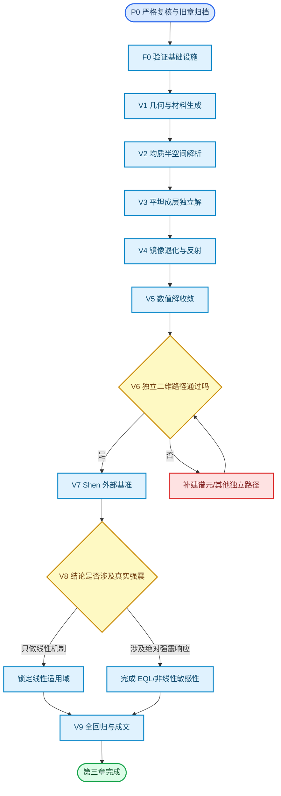
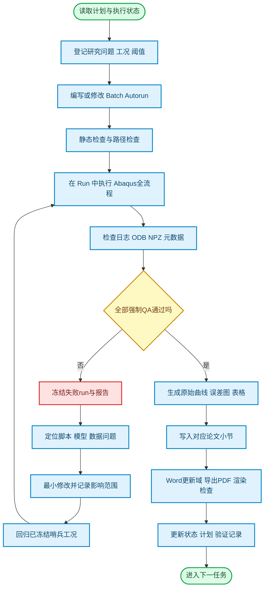

# 第三章数值模型与可信性验证实施计划

> 计划状态：**研究者已于 2026-07-12 明确要求继续执行；P0 与复用 Skill 已闭环，当前执行 F0-1。**
> 执行状态：`第三章执行状态.json` 的 `execution_hold.enabled=false`；F0-1 当前只做验证基础设施实现与静态回归，尚未授权正式求解。
> 当前禁止事项：不得继续 U3b/U3c 求解，不得把旧 U0—U3 结果写成正式方法有效性证据。
> 唯一机器状态入口：[`第三章执行状态.json`](第三章执行状态.json)
> 严格审查依据：[`第三章严格审查与重构论证.md`](../技术文档/第三章严格审查与重构论证.md)
> 文档校验状态：新 Word 工作稿已通过 OpenXML、章节边界、旧结论扫描、Word 原生域更新和 55 页 PDF 视觉复核；第三章位于第26—27页，第四章从第28页开始。

## 🎯 研究目标与论证边界

第三章暂定题目为“斜入射成层坡地有限元模型与可信性验证”。本章的任务不是提前给出坡高、坡角、入射角和地层参数的影响规律，而是建立一套可复现、误差受控、具有独立证据的二维线性场地数值平台，为第4章参数分析和第6章机器学习标签提供可信数据源。

正式结论限定在二维平面应变、线弹性/小应变、指定频带、指定入射角和几何参数域内。未完成匹配的现场、振动台或非线性确认前，不得将结果表述为真实强震下任意边坡的绝对放大值，也不得直接提出工程设计系数。

本章采用 ASME V&V 10 所倡导的计算模型可信性思路，将证据分为实现验证、数值解验证、独立基准和适用性边界，不再用“脚本能运行”或“曲线看起来合理”概括方法有效性。[^asme-vv]

## 📚 新的章节结构

### 3.1 研究目标、验证问题与适用边界

说明第三章在“第2章波动输入理论—第4章参数规律—第6章机器学习”之间的作用，并列出本章要回答的验证问题。

### 3.2 控制方程、基本假定与模型范围

交代二维平面应变、线弹性材料、SV 波、临界角、阻尼表示和不包含的破坏机制。

### 3.3 有限元模型与数据协议

- 3.3.1 无量纲几何与成层介质
- 3.3.2 单元、网格、分析步和输出
- 3.3.3 斜入射等效输入与人工边界
- 3.3.4 阻尼、观测坐标与响应指标

### 3.4 可信性框架、工况选择与评价准则

- 3.4.1 实现验证、解验证和模型适用性的区分
- 3.4.2 代表性/控制性工况的选择原则
- 3.4.3 误差指标、事前门槛和误差预算

### 3.5 端到端实现验证

- 3.5.1 几何、材料与观测生成检查
- 3.5.2 均质半空间解析解对比
- 3.5.3 平坦成层场地独立一维对比
- 3.5.4 方向镜像、同材退化与边界反射

### 3.6 数值解收敛与误差控制

- 3.6.1 控制工况与最短波长
- 3.6.2 网格、时间步和单元类型
- 3.6.3 计算域、观测窗和边界影响
- 3.6.4 阻尼、能量和最终误差预算

### 3.7 独立二维交叉验证与公开基准

- 3.7.1 独立二维方法/跨求解器对比
- 3.7.2 Shen 2024 均质坡地代表工况
- 3.7.3 Shen 2025 成层坡地代表工况
- 3.7.4 统一误差指标与外部一致性结论

### 3.8 可复现性、适用范围与局限

- 3.8.1 配置、数据、脚本哈希和回归集
- 3.8.2 线性幅值缩放与非线性决策边界
- 3.8.3 二维、频带、材料与工程外推限制

### 3.9 本章小结

只总结已通过全部门槛的平台能力，不写未完成任务。

## 🔗 可信性证据链

## ⚙️ 固定脚本链与目录规则

所有论文正文相关的 Abaqus 产物放在 `Run/`，所有论文 Autorun 放在 `Batch/`。`test/Abaqus/` 只允许保存不进入论文正文的临时诊断。正式验证固定使用以下四脚本链：

1. `Modeling/Hybrid/slope_frame_ssi_full_v2.py`
2. `Postprocess/Hybrid/Postprocess_All_surface_v2.py`
3. `Postprocess/Hybrid/Collect_All_results_v2.py`
4. `Postprocess/Hybrid/Plot_Hybrid_surface_v2.py`

若验证基础设施需要新增“平坦验证模式”、原始时程、能量或 QA 字段，应在当前 v2 做兼容性局部扩展；只有改变配置协议、数据结构或模型架构时才新建下一代码版本。任何版本切换都必须让已经冻结的回归集重新通过。

单元目录统一为 `Run/ch3_<任务编号>_<英文名称>/run-###/`。每个 run 必须含：`case_config.json`、`case_meta.json`、建模/求解/后处理日志、`surface_results.npz`、验收报告和图件。无效或失败运行不得覆盖；报告必须显式写 `status=invalid/failed` 和失败原因。

## 🧱 F0：正式验证前的基础设施门禁

F0 未通过前不得启动新的论文验证求解。需要完成以下改造：

| 子任务 | 必须完成的能力 | 验收条件 |
| --- | --- | --- |
| F0-1 | 在 Hybrid v2 恢复显式 `validation_geometry=flat`，不以极小坡高代替平坦场地 | 平坦外形、层界面、测点和边界集合通过程序检查；生产坡地默认行为不变 |
| F0-2 | 建立不调用生产脚本 `_fd_solve_column()` 的独立半空间/层状参考程序 | 独立程序有解析退化单元测试、输入输出说明和固定基准 |
| F0-3 | 在 NPZ 保存地表/地下代表点双分量原始时程、理论时程、幅相误差、反射窗与能量历史 | 无需 CSV 中转即可由 NPZ 重算全部指标 |
| F0-4 | 将单一 `suspect` 拆成 `qa_theory/qa_reflection/qa_mesh/qa_time/qa_domain/qa_energy/qa_external` | `overall_pass` 为所有强制门槛逻辑合取，任何一项失败不得被其他 QA 覆盖 |
| F0-5 | Collect 展开 dt、单元、阻尼、域尺寸、脚本哈希和各 QA 字段 | 汇总索引可独立审计每个 run 的配置与状态 |
| F0-6 | 为纯坡地 freefield 模型增加人工能量、内能、动能、阻尼耗能和外力功等可用历史输出 | 至少控制工况可计算人工能量比和相对能量残差 |
| F0-7 | Autorun 基线引用改为清单+哈希，不再硬编码复用 `run-001` | 版本或配置不一致时中止，而不是混算 |
| F0-8 | 把 EQL 异常回退线性改为论文生产模式下失败即中止 | 名义 EQL 工况不可能悄然变成线性 |

F0 完成后先运行一个不进入论文的最小回归，确认原 U0 四脚本链和现有坡地默认行为没有漂移。

## 🧪 正式验证工况矩阵

### V1：几何、材料与观测生成检查

V1 采用 12 个免求解或最小建模工况，覆盖坡高最小/中值/最大、坡角缓/中/陡、均质/单层/双层、水平/沿坡等厚分层、薄软层、同材人工分层以及净空/深度边界值。

每个工况程序化检查：几何公式、分层厚度和面积、材料赋予、无重叠/空面、TOP_SURFACE、CREST_REF、代表点、边界节点顺序、最小/最大网格尺寸、长宽比和畸变单元。V1 只证明生成器实现，不以响应幅值作判据。

### V2：均质半空间解析解—Abaqus 端到端验证

采用 15 个真正平坦均质半空间工况：

- 入射角：-30°、-15°、0°、15°、30°；
- Ricker 中心频率：2、4、8 Hz；
- 每例至少设置 3 个地表点和 2 个地下点；
- 比较水平/竖向位移或加速度时程、峰值、到时/互相关时滞、Fourier 幅值和相位、峰后残差。

该矩阵同时检验方向符号、自由表面 SV-P 转换、角点、底边与两侧边界、时间延迟和正负角镜像。

### V3：平坦成层场地独立一维对比与退化

核心 16 例由 4 类剖面×2 个入射角×2 个频率状态构成：

| 剖面 | 设计目的 |
| --- | --- |
| L1 低阻抗差单层 | 检查弱反射和近均质极限 |
| L2 强阻抗差单层 | 检查强透反射和共振 |
| L3 薄软表层+中等下覆层 | 检查最短波长与薄层解析 |
| L4 硬表层+软下覆层/双层 | 检查复杂多次反射与反共振 |

两类入射为 0° 与 15°；两类频率按各剖面的第一共振频率取“远离共振”和“接近共振/高频控制”。另设 4 个同材退化工况：一条/两条人工界面×0°/15°，所有层材料完全相同。

参考解必须由独立程序生成，不能调用生产 FD 引擎。比较双分量时程、传递函数幅相、主共振频率、峰值和同材退化误差。

### V4：人工边界反射、负对照与方向对称

默认边界反射评价复用 V2 中角度 0°、15°、30°与频率2、4、8 Hz的 9 例，采用可分离的直达波/反射波时窗，报告反射到时、幅值比、频带反射谱和等效能量比。

另增加 H0、L2、L3 三个 `dashpot_scale=0` 故意反射负对照。负对照必须显著恶化，才能证明指标和报警逻辑具有检出能力。现有 U2 正负 15°坡地结果只作为辅助方向诊断，不计入 V4 正式通过数。

### V5：数值解收敛、单元与阻尼

选择三个控制场景：

| 控制场景 | 物理特征 | 控制风险 |
| --- | --- | --- |
| C1 | 均质、0°、4 Hz、缓/中坡 | 基本退化和低频基线 |
| C2 | 强阻抗差成层、30°、8 Hz、陡坡 | 最短波长、强 SV-P 转换、近入射上限 |
| C3 | 薄软层、15°、接近场地共振 | 薄层网格、共振、阻尼与多次反射 |

每个控制场景执行：

- 网格按 `Δl/λ_min` 约 1/6、1/10、1/15、1/22.5 四档设计；
- 时间步按最高控制频率每周期约 10、20、40、80 步四档真实重采样；
- 若序列单调，报告 Richardson 外推、观测阶次和 GCI；若不单调，保留四档并解释色散或峰位跳动；
- C2、C3 比较 CPE4R、CPE4、CPE8R，检查人工能量、锁定和网格畸变；
- C2、C3 的侧向净空取 2h/4h/6h，底部固定 5h；底部深度取 3h/5h/7h，侧向固定 4h；每个场景 5 个唯一域组合；
- C2、C3 分别取目标阻尼 0%、1%、3%、5%，并在一个强成层场景比较 `input/dual/perband` 锚定；
- 用细时间轴 ODB 离线截断三个分析时长、三个输出采样率，检查静默尾段和频谱分辨率，不把输出采样与求解时间步混为一谈。

预计 V5 约 40 个唯一 Abaqus 工况；中间基准档在各因素之间复用，不进行无必要的完整笛卡尔积。

### V6：独立二维方法与跨求解器

严格目标要求至少完成一种**独立二维数值方法**，优先 SPECFEM2D 谱元法，建议 3 类坡体×4 类输入共 12 例：缓坡均质、陡坡均质、典型软弱成层坡，分别接受垂直低频、垂直高频、中等斜入射和近上限斜入射高频。

当前机器未发现 SPECFEM2D、OpenSees 可执行环境。环境安装或编译属于后续明确决策点，不在 P0 阶段擅自执行。

OpenSees 可作为 8 例跨有限元求解器增强矩阵：坡角30°/60°×均质/强成层×入射0°/15°。由于仓库现有 OpenSees 实现与旧 Abaqus 共享自由场和人工边界公式，它只能检查单元组装、积分和求解器依赖，不能替代独立二维方法。

### V7：Shen 2024/2025 外部基准

Shen 2024 采用“核心 8 例 + 扩展至 12 例”的代表矩阵：坡高50/200 m、坡角30°/60°、入射0°/30°形成8例，再用中心几何补充不同记录和中间入射角。原文报告的参数研究总数为375，不再沿用旧正文“525/522组复现”的说法。[^shen-2024]

Shen 2025 至少选择 12 例，覆盖坡角、无量纲频率、弱/强阻抗差、软/硬表层、薄/厚表层以及0°/15°入射。该文自身的两项验证仍为均质材料，因此本论文必须把成层外部基准与 V3 的独立一维验证联合解释，不能用文献趋势替代理论对比。[^shen-2025]

若文献没有原始数据，先锁定图件、坐标转换、数字化重复误差和比较窗。每条曲线至少报告 NRMSE、峰值误差、峰位误差和主频误差；参数趋势以秩相关或方向一致性量化。

### V8：线性适用性与非线性决策

先做 3 个控制场景×3 个输入幅值共9例线性幅值缩放回归，确认归一化响应在数值容差内重合。

若论文只讨论理想化二维线性机制，V8 在明确限制真实强震外推后可以结束。若论文要讨论“真实世界放大削弱”、给出强震绝对放大或让 ML 预测强度相关响应，则必须增加至少3类场地×3个幅值的 EQL/非线性敏感性，并与独立一维等效线性程序对比；EQL 失败必须中止，禁止回退为线性。

## 📏 统一指标与事前门槛

下列阈值是项目工作门槛，不宣称为普适规范。任何调整必须在查看目标比较结果前写入决策记录，并证明仍满足“数值不确定度不超过拟解释最小物理效应约三分之一”的原则。

| 验证层 | 强制指标 | 初始门槛 |
| --- | --- | --- |
| 均质解析端到端 | 双分量峰值、时程 NRMSE、互相关时滞、目标频带幅相 | 峰值≤2%；NRMSE≤3%；时滞≤1—2输出步；相位≤5° |
| 成层独立一维 | 传递函数幅值、相位、共振频率、峰值 | 幅值 NRMSE≤5%；主频≤3%；峰值≤5% |
| 同材退化/镜像 | 完整时程与空间曲线 | 相对差≤2% |
| 网格/时间/域尺寸 | 空间曲线 L2、AR_max、峰位、主频、VTR/UTAF_v | 中/细档原则上≤2%；峰位≤0.02h；数值不确定度≤最小效应的1/3 |
| 人工边界 | 反射幅值/能量、到时、目标窗响应变化 | 预登记上限；目标窗变化≤2%；负对照显著恶化 |
| 单元/能量 | 人工能量比、相对能量残差、网格畸变 | 人工能量比原则上≤5%；异常单元为0或有解释 |
| 独立二维方法 | 多测点时程、坡面曲线、峰值、峰位、主频 | 曲线和峰值容差在首个盲算前冻结；不得只看云图 |
| 文献复现 | 数字化不确定度、曲线 NRMSE、峰值/峰位、趋势 | 核心指标全部达标后才可使用“复现” |
| 线性幅值缩放 | 归一化时程/TAF重合 | 曲线差≤0.5% |

若首次负对照无法被上述指标识别，说明指标本身失效，应先修指标而不是继续跑生产矩阵。

## 🔄 每个任务的自动执行闭环

每次运行前必须在 `第三章执行状态.json` 将任务设为 `in_progress`，并登记预期工况数、关键阈值和 Autorun 路径。求解器退出码为0不是通过；必须检查 Abaqus 状态、ODB完整性、NPZ字段、脚本/配置哈希和全部 QA。

失败后禁止无解释自动重跑。必须保存失败 run、写明根因假设、修改文件、影响范围和回归集合。若修改主脚本、后处理协议或 QA 逻辑，至少回归 V2 均质解析哨兵、V3 成层哨兵和 V5 控制工况各一例。

## ✍️ 任务—论文写入顺序

| 任务通过 | 允许写入的小节 | 必须生成的图表 |
| --- | --- | --- |
| F0 + V1 | 3.2、3.3.1—3.3.4 的方法描述 | 模型示意、材料/网格检查表，不写响应结论 |
| V2—V4 | 3.4、3.5 | 解析/FE 时程及误差、层状传函、镜像、反射与负对照 |
| V5 | 3.6 | 四档收敛图、GCI/不确定度、域尺寸、阻尼曲线、能量表、最终参数表 |
| V6—V7 | 3.7 | 跨方法多面板图、Shen 数字化误差带、统一指标表 |
| V8 | 3.8 | 线性缩放图；若需要则加线性/EQL差异图和适用域表 |
| V9 全回归 | 3.9 和第1章研究内容同步修改 | 证据—结论映射表、回归清单 |

每一小节按“验证问题—为何必要—工况选择—参数与可复现入口—评价指标和阈值—结果—问题解释—结论及支撑范围”写成连续学术段落。未通过任务只写入验证记录，不得进入论文正文。

## 🧾 当前进度与旧结果处置

| 项目 | 当前状态 | 处置 |
| --- | --- | --- |
| P0 严格复核、旧章归档、计划重建 | **已完成并获研究者确认** | 严格审查、重构前完整论文备份、新章节骨架、Skill、执行状态和 Word 原生分页校验均已闭环 |
| U0 | 基础设施历史证据 | 保留四脚本闭环；不计入正式验证 |
| U1 | 单例诊断证据 | 保留检查器素材；V1 扩为12例后重新判定 |
| U2 | 方向诊断证据 | 降级；V2—V4完成前不得标记输入/边界通过 |
| U3a | 易工况预试验 | 降级；不得冻结8 m生产网格 |
| U3b | 预试验/失败报告 | run-002标无效，run-003冻结；不继续修复或重跑 |
| F0-1 | **进行中** | 恢复显式 `validation_geometry=flat`；完成后检查平坦外形、层界面、测点/边界集合和默认坡地回归 |
| F0-2—V9 | 未开始 | F0-1 静态回归门槛通过后依次执行，不跳步 |

旧计划已归档为 `docs/计划文档/归档/2026-07-12_第三章原实施计划.md`；重构前第三章 Word 内容也已独立归档。任何 Agent 接手时必须以本文件和 `第三章执行状态.json` 为准，不从旧计划推断下一任务。

## 🛑 人工决策点与停止条件

以下情况禁止 Agent 自行扩大研究范围：

1. 是否安装/编译 SPECFEM2D 或 OpenSees；当前只记录运行时缺失。
2. 是否将 EQL/非线性对照纳入第三章强制门槛；取决于最终结论是否跨越线性机制边界。
3. 是否引入现场或振动台数据；只有几何、材料、输入和相似关系足够匹配时才有验证价值。
4. 需要改变研究对象、临界角范围、材料本构、目标频带或已经冻结的验收阈值。

若同一物理偏离经两轮有证据的修复仍不能解释，或负对照与正常模型无法被指标区分，应停止求解并形成方法学备选方案。不得通过增加阻尼、缩短时窗、删除异常点或放宽阈值获得“通过”。

## 🔗 复用入口

- [第三章执行状态](第三章执行状态.json)
- [第三章严格审查与重构论证](../技术文档/第三章严格审查与重构论证.md)
- [第三章验证记录](../技术文档/第三章数值模型验证记录.md)
- [第三章重构工作稿](../论文材料/边坡地震动放大效应研究论文初稿（第三章重构）.docx)
- [第三章有限元验证工作流 Skill](../../.agents/skills/chapter3-fe-validation-workflow/SKILL.md)
- [Hybrid v2 建模脚本](../../Modeling/Hybrid/slope_frame_ssi_full_v2.py)
- [Hybrid v2 单工况后处理](../../Postprocess/Hybrid/Postprocess_All_surface_v2.py)
- [Hybrid v2 结果收集](../../Postprocess/Hybrid/Collect_All_results_v2.py)
- [Hybrid v2 绘图](../../Postprocess/Hybrid/Plot_Hybrid_surface_v2.py)

[^asme-vv]: ASME, *V&V 10 - Standard for Verification and Validation in Computational Solid Mechanics*, 2019, reaffirmed 2025, https://www.asme.org/codes-standards/find-codes-standards/standard-for-verification-and-validation-in-computational-solid-mechanics 。
[^shen-2024]: Shen H. et al., “Numerical evaluation of ground motion amplification of rock slopes under obliquely incident seismic waves,” *Soil Dynamics and Earthquake Engineering*, 178, 108488, 2024, https://doi.org/10.1016/j.soildyn.2024.108488 。
[^shen-2025]: Shen H. et al., “The combined amplification effects of topography and stratigraphy of layered rock slopes under vertically and obliquely incident seismic waves,” *Soil Dynamics and Earthquake Engineering*, 193, 109331, 2025, https://doi.org/10.1016/j.soildyn.2025.109331 。
