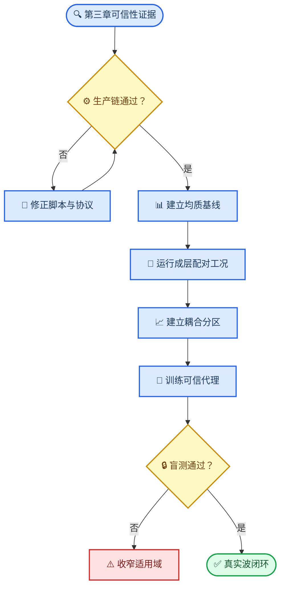
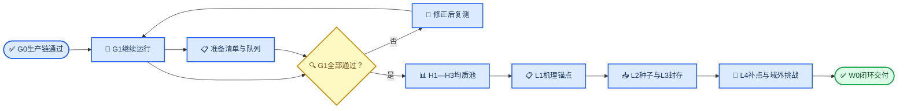
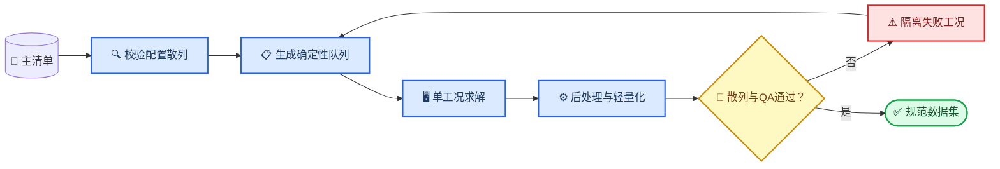

# 第四章参数分析与第六章机器学习工况指导计划

_用于第4章参数分析与第6章机器学习数据生产、验证和复现的指导性计划，2026-07-20_

---

## 📋 方案定位与执行状态

### Material Passport

| 字段 | 值 |
| --- | --- |
| Origin Skill | `academic-research-suite/experiment-agent` |
| Origin Mode | `plan` |
| Origin Date | `2026-07-18T22:40:38+08:00` |
| Verification Status | `VERIFIED`：G0与G1b已通过；G1r组合宽频闸门已通过、8个真实波工况预生产就绪，正文主池尚未放行 |
| Version Label | `ch4_ch6_guidance_plan_20260718` |

本文是第4章“坡地地震动放大效应参数化分析”和第6章“机器学习代理模型”的**工况指导文件**，负责规定研究问题、参数域、工况池、阶段门、数据角色、运行目录和论文证据映射。它不是计算结果报告，也不以计划数量替代论文实证结果。

第5章及TSSI的工况、指标、验证链和运行安排不在本文中预留编号或计算预算，后续另行建立独立指导方案。第6章直接复用第4章有限元数据，不另建一套重复的`ch6`模拟工况。

> 📌 **当前决策：G1r真实波阶段可以由用户手动启动，正文主池仍不放行。** S2细网格单因素诊断在原门槛下通过，三个测点的水平相位RMSE降至`0.06874/0.06191/0.05474 rad`。组合宽频闸门以H1/W1/M2的10单元结果和S2的20单元结果通过；8个真实波目录已按该网格规则刷新并保持`planned`，必须使用`--run-real-only`，不得重跑宽频工况。

### 当前放行判断

截至2026-07-20，本次核验得到以下事实；完整计算、诊断方法和逐系统数据见[G1复频响闸门阶段验收与整改报告](../技术文档/G1复频响闸门阶段验收与整改报告.md)：

| 证据 | 当前事实 | 判定 |
| --- | --- | --- |
| G0配置注入 | `run-003`中12/12工况状态为`passed`，包含非法顶层键的预期拦截 | **通过**，不再作为下一阶段阻塞项 |
| G1求解进度 | `run-002`中8/8物理系统、48/48动力作业均已完成；8套NPZ和Excel齐全 | **流程完成**，不等于科学验收通过 |
| 幅值缩放不变性 | 8个系统中2 Hz的0.1g/0.2g最大复数相对漂移约`4.5e-7` | **8/8通过** |
| 4 Hz与8 Hz一致性 | 8个系统的`log|H|` RMSE为0.0064—0.2225，相位RMSE为0.0056—0.2677 rad；强对比厚层2个系统超限 | **6/8通过，整体未通过** |
| 2 Hz与4 Hz一致性 | `log|H|` RMSE为0.0340—0.4609，相位RMSE为0.0296—0.5517 rad | **仅2/8同时通过**，主因是未衰减响应被2 s时窗截断 |
| 共同有效频带 | 当前三类合成激励的已见共同有效区约为0.98—4.76 Hz | **未冻结**，尚不能支撑既定0.5—10 Hz目标 |
| `FSAF=|H|`一致性 | 48条记录最大相对误差约为`5.1e-15` | **通过** |
| `RSAF`与真实波闭环 | 当前配置未提供岩基自由场和同地层一维参考时程，质量状态为`partial` | **未通过**，不能据现有`passed`状态宣称响应谱闭环 |
| G1b尾段收敛 | `run-001`的3 s/6 s均完成；0.5—10 Hz内`log|H|` RMSE=`0.00431`、相位RMSE=`0.00431 rad`，6 s末段响应P95=`0.00124` | **通过**，冻结6 s，不追加9 s |
| G1b输入一致性 | 修正后A/B的速度趋势斜率约为`10^-17 m/s²`，名义/有效输入频谱RMSE约为`10^-9`，0.5—10 Hz有效率均为100% | **通过**，修正后输入可进入8次代表系统复算 |
| G1b正式跨激励复算 | `run-002`中8/8工况完成；4个系统的0.5—10 Hz覆盖率均为99.68%，`log|H|` RMSE为`1.49e-5—0.00201`，相位RMSE为`1.40e-5—0.00205 rad`，末段P95最大为`0.00480` | **4/4系统通过**，冻结G1b配置并转入G1r与真实波闭环 |
| G1r预生产检查 | `run-001`已生成4类剖面×3条输入的12/12工况、24条岩基/一维参考时程及逐工况审计；单机并发上限为4 | **准备通过**，不等于G1r科学闸门通过 |
| G1r宽频科学闸门 | 4/4工况完成求解与后处理；H1/W1/M2通过，S2在`x/L=0.25/0.50`的水平相位RMSE为`0.11993/0.11024 rad`，略超`0.10 rad`，第三测点为`0.09967 rad` | **3/4通过，整体未通过**；真实波不启动 |
| G1r S2定向诊断 | 20单元结果的水平相位RMSE为`0.06874/0.06191/0.05474 rad`，较10单元下降42.69%—45.08%；幅值和复数误差同步下降 | **通过**；支持累计数值频散解释 |
| G1r真实波组合放行 | H1/W1/M2使用已通过的10单元准则，S2使用验证后的20单元准则；8/8目录、参考时程、配置散列与闭环门槛已刷新 | **预生产通过**；由用户手动启动，正文主池仍等待真实波结果 |

进度状态以[G0运行清单](../../Run/ch4_G0_config_injection/run-003/run_manifest.json)、[既有G1运行清单](../../Run/ch4_G1_frequency_gate/run-002/run_manifest.json)、[G1b正式运行清单](../../Run/ch4_G1b_frequency_gate/run-002/run_manifest.json)和[G1r运行清单](../../Run/ch4_G1r_reference_gate/run-001/run_manifest.json)为证据；G1b逐系统结果见[宽频跨激励验收报告](../../Run/ch4_G1b_frequency_gate/run-002/G1b宽频跨激励验收报告.md)。既有G1的幅相区间是诊断性复算；G1b和G1r均采用事前冻结门槛，不在看到结果后放宽限值。

这里的`run_manifest.json`中`passed`表示求解与后处理流程完成，不等同于G1科学验收通过。正式放行必须另有汇总验收报告，逐项计算跨激励幅相误差、响应谱闭环和完整QA。

### G1问题的通俗解释与整改清单

可以把G1理解为“给后续数百个工况校准一把尺子”。有限元模型负责产生响应，后处理用不同输入波测量同一个系统的复频响；在线性条件下，只要输入在某个频带内有足够能量、时窗和相位处理正确，不同输入波量出的`H(f,s)`应基本相同。现在这把尺子在中频段已经较稳定，但在低频、频带两端和反应谱参考口径上还没有校准完整。

| 现象 | 通俗含义 | 当前最可能的环节 | 必须修改或补齐的内容 |
| --- | --- | --- | --- |
| 4 Hz与8 Hz在前6类系统接近、强对比厚层超限 | 主链在响应能充分落入时窗时稳定，长周期系统仍会被截断 | 2 s总时长不足，SYS-S1/S2末段仍有显著混响 | 保留前6类为局部证据，强对比系统纳入尾段收敛复算 |
| 2 Hz与4 Hz在6/8系统中超限 | 2 Hz脉冲峰值放在1.0 s，峰后可用时长比4 Hz少0.75 s | SYS-S2最晚地表峰值到1.954 s，末10%响应P95仍约75%，属于确定性截断 | 不能仅重新后处理；以最不利系统冻结3/6/必要时9 s静默尾段，再做宽频复算 |
| 共同有效区仅约0.98—4.76 Hz | 当前NPZ只能可靠说明约1—4.8 Hz，不能支撑已写的0.5—10 Hz | 旧后处理把首条2 Hz得到的阻尼`fc`兼作频响上限，硬截到约5 Hz | v2已增加独立`frf_fmax_hz`；G1b用覆盖0.4—12 Hz的两条独立宽频信号验收0.5—10 Hz |
| `RSAF`质量为`partial` | 已算出地表绝对反应谱，但“放大多少”的分母尚不存在 | 缺少同一输入下的岩基自由场和同地层一维自由场时程 | 补跑或导入真实参考时程，并在`response_spectrum_cfg.reference_files`中显式绑定 |
| 清单显示`passed` | 软件流程跑完且轻量产物生成成功 | 运行状态定义 | 另出G1科学验收汇总，不能把`passed`直接写成论文验证通过 |
| 48条汇总`qa_status=failed` | 多个第三章QA未在G1配置中显式绑定，RSAF参考也缺失 | G1配置与质量状态语义不完整 | 区分`not_evaluated`与真实失败，G1b/G1r显式配置必需闸门 |

因此，当前不需要推倒重建主模型，也不需要重做已经通过的G0或整批重跑48次。整改顺序固定为：保留现有G1诊断证据 → 在4个代表系统上做9—10次自适应G1b宽频复算 → 用12次G1r平场工况验证岩基/一维参考库 → 完成真实波闭环 → 冻结频带、尾段、窗函数、阻尼锚点、时间步和QA配置 → 形成最终验收报告。只有最后一步通过后，才启动正文工况。

| 现在可以做 | G1正式通过后再做 |
| --- | --- |
| 冻结H/L/C/M/W/R/N各池的参数定义与数据角色 | 启动H1—H3和L1主池的正式单机批跑 |
| 生成并散列L2/L3/L5候选清单；L3只封存元数据，不生成标签 | 生成L2训练标签并开展POD/代理模型开发 |
| 准备`Run/Auto_ch4/`正式入口、单机队列和断点恢复规则 | 解封任何盲测结果或据此调整工况域 |
| 补齐G1参考时程、验收汇总器和必要的定向复算 | 删除G1及预生产工况的ODB和失败证据 |
| 必要时运行少量`pilot`工况，但不得计入论文数据集 | 将`pilot`结果写成第4章或第6章正式结果 |

原方案已原样归档至[2026-07-17_原数值模拟全流程工况设计方案.md](归档/2026-07-17_原数值模拟全流程工况设计方案.md)，归档文件SHA-256为`5494B4938AA4C7E98604E06FADC75F03AE2312EF0ECCC952CE4CB916CE248AAE`。本文件自本次更新后成为第4、6章工况数量、数据划分和执行顺序的唯一依据。

| 项目 | 本方案处理 |
| --- | --- |
| 第4章均质坡规律 | 重新建立无量纲复频响基线 |
| 第4章成层坡规律 | 两层主池、配对均质基线和多层挑战池 |
| 第6章代理模型 | 复频响、物理残差、冻结盲测和校准不确定性 |
| 既有v3机器学习结果 | 冻结为历史基线，不与新数据混训 |
| 第5章TSSI与结构响应 | 不属于本文，另行规划且不占用本文预算 |
| 真非线性土体 | 不进入第6章；EQL仅为第4章条件扩展 |

本文遵循“先证明计算链可信，再扩大参数空间”的顺序。数值模型可信度以[第3章斜入射成层坡地有限元模型与可信性验证](../论文材料/章节Markdown/第3章_斜入射成层坡地有限元模型与可信性验证.md)为事实依据；复频响、机器学习与论文验收细节参考[边坡地震响应机器学习研究与实施计划](边坡地震响应机器学习研究与实施计划.md)。计算固体力学模型的可信度应由验证、确认和不确定性证据共同支撑，而不能由工况数量替代。[^1]

## 🎯 研究问题与论文证据链

### 中心科学问题

第4章与第6章共同围绕以下问题展开：

> 对斜入射线性成层坡地，地层放大与地形放大在什么频率—空间—参数条件下可以近似相乘，何时产生不可忽略的耦合；能否用带有校准不确定性和适用域拒识的代理模型预测这种耦合？

该定位不宣称首次研究斜入射坡地或首次提出地形—地层分解。既有研究已系统考察斜入射均质岩坡，也已有工作提出地形、地层与谷地效应的近似乘积分解。[^2][^3] 本论文的增量应落在复数全场残差、可分离边界、独立盲测和可信代理模型上。

### 预注册研究问题

| 编号 | 研究问题 | 主要证据 |
| --- | --- | --- |
| RQ4-1 | 均质坡复频响如何随坡角、入射角和无量纲频率变化 | H1、H2、H3 |
| RQ4-2 | 厚度比、波速比和密度比分别如何改变共振峰与空间分布 | L1、L2 |
| RQ4-3 | 地形与地层效应何时近似可分离，何时强耦合 | C0、L1—L5 |
| RQ4-4 | 多层、波速倒转和EQL会如何改变线性两层结论的适用边界 | M0、N0 |
| RQ6-1 | 直接频响、`H_1D`残差和乘性耦合残差中哪一种最可学习 | L1—L4 |
| RQ6-2 | 代理模型能否在固定盲测和未见真实波上保持频域、时域精度 | L3、W0 |
| RQ6-3 | 不确定性和确定性范围门能否可靠识别不可用输入 | L5、M0 |

### 预注册假设

- HP1：在固定线性系统中，不同宽频激励提取的复频响在共同有效频带内一致
- HP2：当一维场地主峰与均质地形主峰接近时，耦合残差显著增大
- HP3：分别保留波速比与密度比，比仅使用阻抗比更能解释残差变化
- HP4：学习物理残差比直接学习总频响具有更低盲测误差或更窄校准区间
- HP5：拓扑超出“两层体系”时，必须由确定性适用域规则拒绝，不能只依靠GPR方差

### 证据链



## ⚙️ 统一物理定义与参数域

### 主研究边界

第4、6章共享数据必须满足以下条件：

- 二维平面应变坡地自由场
- `tssi_cfg.scene='freefield'`，不建立结构
- 土体线弹性，`eql_cfg.enable=False`
- 基岩与覆盖层材料、阻尼、网格、时间步和静默尾段在生产批次内冻结
- 仅允许输入时程变化，不允许输入波主频反向改变阻尼或网格
- 每个成层工况均有可追溯的`H_1D`和相同坡角、入射角的`H_topo`基线

### 复频响与耦合残差

以施加的基岩上行SV波加速度谱为唯一参考，定义水平和竖向复频响：

\[
H_{2D,k}(f,s)=\frac{\widehat A_{\mathrm{surface},k}(f,s)}
{\widehat A_{\mathrm{incident}}(f)},\qquad k\in\{x,z\}
\]

同一成层剖面的一维自由场频响记为`H_1D(f)`；相同`h,i,\theta`但去除覆盖层后的均质坡复频响记为`H_topo(f,s)`。复数耦合比定义为

\[
R_c(f,s)=\frac{H_{2D,x}(f,s)}
{H_{1D}(f)H_{\mathrm{topo}}(f,s)}
\]

并分别分析

\[
r_A(f,s)=\ln|R_c(f,s)|,\qquad
r_\phi(f,s)=\operatorname{wrap}\{\arg R_c(f,s)\}.
\]

第4章以`r_A`和`r_\phi`共同判断可分离性；第6章比较直接学习`H_2D`、学习`H_2D/H_1D`和学习`R_c`三条路线。只保存幅值而不保存相位的数据不得进入新数据集。

### 复频响、傅里叶谱与反应谱的指标层级

傅里叶谱放大系数和反应谱放大系数均纳入考察，但不能与复频响并列为三个互相独立的主目标。三者按“机理主指标—幅值派生指标—工程解释指标”组织：

| 层级 | 指标 | 主要作用 | 使用范围 | 第6章角色 |
| --- | --- | --- | --- | --- |
| 机理主指标 | 复频响`H_k(f,s)`及`R_c(f,s)` | 同时保留幅值和相位，识别共振、传播与地形—地层耦合 | G1、H1—H3、L1—L5、C0、M0、R0 | 主学习目标 |
| 幅值派生指标 | 傅里叶谱放大系数`FSAF_k(f,s)` | 直观展示不同频带的放大、去放大和主峰迁移 | 从所有有效复频响直接派生 | 不单独训练，作为`|H|`视图和论文图件 |
| 工程解释指标 | 5%阻尼`RSAF_x(T,s;g)`与`URSAF_z(T,s;g)` | 将频域机制映射到不同结构周期下的工程需求 | G1与W0直接闭环；N0直接计算；其余线性工况按冻结记录由`H`重构 | 预测复频响后的下游验证指标，不作为首轮训练标签 |
| 补充标量 | PGA、PGV、Arias强度、峰值位置与既有TAF | 与历史结果、规范表达和时域峰值对接 | W0、N0及代表性机理工况 | 仅作辅助评价 |

以同一基岩上行波为分母时，傅里叶谱放大系数就是复频响的幅值：

\[
FSAF_{\mathrm{inc},k}(f,s)=
\frac{|\widehat A_{\mathrm{surface},k}(f,s)|}
{|\widehat A_{\mathrm{incident}}(f)|}
=|H_{2D,k}(f,s)|.
\]

若考察相对同地层一维自由场的二维附加效应，则另定义

\[
FSAF_{\mathrm{1D},x}(f,s)=
\frac{|\widehat A_{2D,x}(f,s)|}
{|\widehat A_{1D,x}(f)|}.
\]

因此`FSAF`不是新的独立数据样本，也不能替代相位信息；规范数据只保留一份复`H`，绘图和统计时由`|H|`确定性派生`FSAF`，避免两份幅值数据失配。

对指定地震记录`g`和阻尼比`zeta=5%`，统一采用弹性单自由度伪加速度反应谱`PSA`，正文记为`S_a`；`T=0`不混入谱网格，PGA另行报告。同时采用两种反应谱放大口径：

\[
RSAF_{\mathrm{rock},x}(T,s;g)=
\frac{S_{a,2D,x}(T,s;g)}{S_{a,\mathrm{rock,ff},x}(T;g)},
\qquad
RSAF_{\mathrm{1D},x}(T,s;g)=
\frac{S_{a,2D,x}(T,s;g)}{S_{a,1D,x}(T;g)}.
\]

前者表示相对均质岩基自由场的总放大，后者表示相对同地层一维自由场的二维附加放大。竖向自由场在垂直入射时可能接近零，因此竖向分量不定义病态的同分量谱比；另用水平岩基自由场为统一分母定义`URSAF_z=S_a,2D,z/S_a,rock,ff,x`，并同时报告绝对`S_a,z`。周期范围初定为`0.10—2.00 s`的40个对数等距点，并单列`0.10、0.20、0.50、1.00、2.00 s`；G1后按复频响共同有效频带冻结最终范围。`RSAF`依赖具体波形，不能把不同记录的结果伪装成同一个系统固有属性。

响应谱层面的可分离误差定义为

\[
r_{Sa}(T,s;g)=\ln\frac{S_{a,2D}(T,s;g)}{S_{a,\mathrm{sep}}(T,s;g)},
\]

其中`S_a,sep`必须由`H_1D(f)H_topo(f,s)A_inc(f)`反变换得到分离近似时程后再计算。由于反应谱含时域极值运算，不允许直接把两个标量反应谱放大系数相乘来代替该过程。

当前[Postprocess_All_surface_v2.py](../../Postprocess/Postprocess_All_surface_v2.py)已完成增量升级：`compute_complex_H`在候选物理频带内保存复数`H`、输入谱和显式`valid_mask`，无效频点为复`NaN`；`frf_fmax_hz`允许论文频带独立于阻尼主频冻结，末段RMS/峰值统计和可选质量门用于拦截未衰减即截断的时程；`FSAF_inc=|H|`由同一数组确定性派生并通过CSV回读一致性检查；原先容易误解的`H_topo_h`已改名为`FSAF_station_h`，只表示同侧端点参考台站谱比，不冒充匹配均质坡`H_topo`。脚本同时用Newmark平均加速度法计算5%阻尼`PSA`、`RSAF_rock`、`RSAF_1D`和`URSAF_z`，并保存完整周期网格与关键周期结果。规范数组统一进入`surface_results.npz` schema 2，旧`H_surface_*`/`H_topo_h`文件仅保留读取兼容。

反应谱参考文件接口固定在`case_config.json`的`run_cfg.response_spectrum_cfg`内，不新增生产配置顶层键：

```json
{
  "run_cfg": {
    "qa_cfg": {
      "required": ["theory", "reflection", "mesh", "time", "domain", "energy", "external", "frf", "response_spectrum"],
      "min_frf_valid_bins": 8,
      "frf_fmax_hz": 12.0,
      "frf_tail_fraction": 0.10,
      "max_frf_tail_rms_ratio": 0.02
    },
    "response_spectrum_cfg": {
      "enable": true,
      "damping_ratio": 0.05,
      "period_min": 0.10,
      "period_max": 2.00,
      "period_count": 40,
      "key_periods": [0.10, 0.20, 0.50, 1.00, 2.00],
      "denominator_ratio": 1e-8,
      "reference_min_coverage": 0.99,
      "reference_files": {
        "<record_id>": {
          "rock": "<同一记录的均质岩基自由场 time-acc 两列文件>",
          "one_d_left": "<左侧同地层一维自由场 time-acc 两列文件>",
          "one_d_right": "<右侧同地层一维自由场 time-acc 两列文件>"
        }
      }
    }
  }
}
```

三个参考文件必须覆盖ODB观测时窗；默认覆盖率低于99%即不通过反应谱协议。缺文件、覆盖不足或谱分母过小时，绝对`PSA`仍保留，但对应`RSAF/URSAF`为`NaN`且`valid_mask=False`，不得回退到`factor_h×input`、当前`theory_acc_h`或epsilon分母。若左右地层完全一致，可用`one_d`显式指定左右共用的同一个真实一维参考文件。

规范NPZ的核心键按记录写为`frf_<record>_*`与`rsa_<record>_*`：前者包含`frequency`、`H_surface_h/v`、`H_surface_over_1D_h`、`H_station_h`、各自`valid_mask`和复数`sgrid_H_*`；后者包含`period`、`key_period`、`PSA_surface_h/v`、三类放大系数、各自有效掩码、真实参考时程与`sgrid_*`。`quality_json`记录FFT长度、频带、掩码阈值、FSAF一致性、Newmark参数、参考来源和覆盖率。

### 输入变量与输出坐标

`eta`或无量纲频率不再作为单个工况级输入。每个物理工况的输入为

\[
X=[i,\theta,d/h,r_v,r_\rho],
\quad
r_v=V_{s,c}/V_{s,b},
\quad
r_\rho=\rho_c/\rho_b .
\]

输出是定义在无量纲频率—空间坐标上的函数：

\[
Y=H(\xi_f,s),\qquad \xi_f=fh/V_{s,b}.
\]

频率点和空间点是同一物理工况的输出坐标，不得拆成相互独立的训练样本。泊松比和阻尼先固定，再通过L1c判断是否需要升级为七维扩展模型。

### 主参数域

| 参数 | 主研究域 | 结构化水平 | 处理原则 |
| --- | --- | --- | --- |
| 坡高`h` | 200 m | 50、100、200、400 m | 200 m用于生产；其余仅验证尺度一致性 |
| 坡角`i` | 15°—60° | 15°、22.5°、30°、37.5°、45°、52.5°、60° | 67.5°、75°仅作边界挑战 |
| 入射角`theta` | 0°—30° | 0°、7.5°、15°、22.5°、30° | 必须低于临界角并留2°裕度 |
| 厚度比`d/h` | 0.20—2.00 | 0.20、0.35、0.50、0.80、1.10、1.50、2.00 | 0.10、2.50仅作边界挑战 |
| 波速比`r_v` | 0.30—0.80 | L1取0.30、0.45、0.60、0.80；L2连续采样 | 与密度比独立采样 |
| 密度比`r_rho` | 0.75—0.95 | 0.75—0.95，步长0.05 | 不再由阻抗比替代 |
| 覆盖层泊松比 | 固定0.35 | 0.25、0.35、0.40 | L1c鲁棒性检查 |
| 覆盖层阻尼比 | 固定0.03 | 0.01、0.03、0.05 | L1c鲁棒性检查 |
| 分层形态 | 水平层界面 | `horizontal` | `terrain`放入M0 |
| 基岩参数 | `Vs=2000 m/s`、`rho=2500 kg/m3`、`nu=0.30` | 固定 | 不进入主采样 |

候选工况若触发临界角、几何净空、薄层网格或材料合法性约束，应记录拒绝原因，并从同一确定性序列继续补点，直到各数据池达到目标数量。

### 频率与空间输出

- 论文目标绝对频带仍以0.5—10 Hz为候选；当前G1已见共同有效区仅约0.98—4.76 Hz，不能提前把目标频带写成已验证范围
- G1结束前必须二选一并留痕：补充宽频激励与信号链以覆盖0.5—10 Hz；或依据工程周期需求收窄正式频带并同步删去无法由该频带可靠重建的短周期`RSAF`
- 若保留`T=0.10 s`反应谱终点，复频响上限原则上应覆盖约10 Hz及必要裕度；仅有约5 Hz上限时，不得声称已完成`T=0.10 s`的频响重建闭环
- 同时保存`f`、`xi_f=fh/Vs_b`和`fh/Vs_c`，避免不同参考波速导致解释混乱
- 空间采用坡顶平台120点、坡面60点、坡脚平台80点，共260点
- 重采样前单独保存原始节点上的峰值、峰位和近峰区宽度，避免插值削峰
- 水平`H_x`为第6章主目标；竖向`H_z`作为次目标并保留有效谱掩码，不定义病态的竖向比值分母
- `FSAF=|H|`由复频响确定性派生，沿用完全相同的频带掩码和空间网格
- 5%阻尼`RSAF`初定使用`0.10—2.00 s`周期网格，并同时保存`record_id`、参考口径和阻尼比
- `RSAF`分母低于冻结阈值的周期点写入无效掩码，不用epsilon分母制造假放大峰

### 可分离判据

在打开盲测集之前，以第三章数值不确定性和G1频响一致性结果冻结`u_A`与`u_phi`。初始工程阈值为

\[
\tau_A=\max[\ln(1.10),3u_A],\qquad
\tau_\phi=\max[0.20\ \mathrm{rad},3u_\phi].
\]

| 分区 | 幅值条件 | 相位条件 |
| --- | --- | --- |
| 近似可分离 | `P95(|r_A|)<=tau_A` | 圆周RMSE`<=tau_phi` |
| 过渡区 | 仅一个条件超限 | 需要独立工况复核 |
| 强耦合 | 两个条件均超限 | 必须在L3盲测中重复出现 |

阈值只能在G1后、L3盲测解封前调整一次，调整必须依据数值误差下限并留下变更记录，不能为改善结果而放宽。

## 🧪 工况池与样本预算

### 总体预算

本方案按**单台电脑、逐级放行、适量覆盖**重新定额。节省计算量不靠删除盲测和物理对照，而靠四项设计：均质几何库复用为成层坡匹配基线、L1子池去除重复组合、L2按学习曲线分批扩展、L4只做定向补点。计入G1r的1次S2细网格诊断后，核心线性路线为568—704次动力求解，推荐目标为636次；其中现有G1的48次已经完成，后续新增核心求解约520—656次。条件扩展N0增加32次，含N0的总范围为600—736次，硬上限较原3031次减少约77%，同时保留足够的五维训练、分组盲测和工程闭环余量。

这里的568次是中等规模的起步预算，不是极限压缩版，也不是保证模型必然达到某个精度的承诺。L2先运行128个样本；若学习曲线在160个样本后已经进入平台，应停止扩样，若仍明显下降，最多扩到192个L2样本和64个L4补点。不得为了追求样本数提前解封L3。

| 类别 | 物理工况 | 动力求解上限 | 主要用途 |
| --- | ---: | ---: | --- |
| G0—G1生产与频响闸门 | 8个既有系统、4个定向复算系统、4个参考剖面 | 71 | 现有48次、G1b实际10次、G1r正式12次及S2细网格诊断1次 |
| H1—H3均质基线 | 51 | 51 | 第4章均质规律、尺度与陡坡边界 |
| L1—L5两层主池 | 376—504 | 376—504 | 第4章机理、第6章训练、盲测与OOD |
| C0匹配均质对照 | 8—16个新增对照 | 8—16 | 大部分直接复用H1/H3，仅补盲测和必要新几何 |
| M0多层挑战 | 4类×6原型 | 24 | 两层结论的拓扑适用边界与确定性拒识 |
| W0真实波闭环 | 8个系统×4条记录 | 32 | 未见波时域和反应谱闭环 |
| R0同机干净复现 | 6 | 6 | 检查长周期单机生产链的可重复性 |
| N0 EQL条件扩展 | 8个系统×4级强度 | 32 | 可选；第4章强度边界，不进入第6章 |

预算核算采用唯一动力求解数：G1b已实际使用10次，G1r在12次正式工况外增加1次S2细网格诊断，故G0—G1固定为71次。起步线性链为`71+51+376+8+24+32+6=568`；推荐方案取`L2=160、L4=32`并预留12个C0，共636次；线性硬上限为`71+51+504+16+24+32+6=704`。L1b和L1c复用的基准、H1/H3复用的C0均不重复计数。

第6章两层代理实际可见的独立物理工况为272个起步、336个推荐、400个硬上限，分别由`L1a+L1b+L2+L4`组成。每个工况输出的是一整个频率—空间复数场，经POD后学习少量模态系数；这一规模既适合中小样本GPR，也为五维交互、分组交叉验证和学习曲线保留余量。频率点和空间点不能虚增为独立样本。模型能否达到论文目标由分组学习曲线和48个封存盲测工况决定，而不是由预先承诺的高`R²`决定。

### G0—G1生产与复频响闸门

选取8个代表物理系统：均质坡2个、弱对比薄层2个、中等对比2个、强对比厚层2个。现有G1每个系统运行：

1. 三种中心频率为2/4/8 Hz的Ricker探针激励
2. 一种激励的幅值缩放副本
3. 两条不参与频响提取的真实记录

现有计算共`8×6=48`次求解，已经全部完成。由于2/4/8 Hz Ricker的共同有效区未覆盖既定目标，且强对比系统的2 s时窗存在确定性截断，三条中心频率不同的Ricker不能视为已经完成全频带独立验证。G1b选SYS-H1、SYS-W1、SYS-M2和SYS-S2，分别覆盖均质、弱对比、中等对比和最不利强对比厚层；使用两条覆盖`0.4—12 Hz`、幅值谱受控且相位独立的多正弦信号，正式验收`0.5—10 Hz`。先在SYS-S2上用信号A比较3 s与6 s静默尾段，若未达到末段残振和频响收敛门槛则只追加9 s；冻结尾段后才运行信号B，其余3个系统各运行A/B两条信号。因此G1b为9次，最不利情况下10次，不再对8个系统整批复算。

G1b尾段试算使用的首版A采用Schroeder相位、`dt=0.001 s`、有效激励时长`8.191 s`和PGA=`0.1g`，散列为`6b98cfdf...0844`；该物理文件已保留在`run-001`的两个工况目录中。首版B未参与求解。正式生产输入继续使用相同相位设计与采样参数，但在生成阶段增加速度趋势双约束；输入文件、生成参数、首版追溯散列和当前SHA-256统一记录于[宽频输入清单](../../Wave/Impulse/Acceleration/G1b_frequency_gate/g1b_multisine_manifest.json)。尾段试算与正式复算均由[单机批处理入口](../../Run/Auto_ch4/Autorun_ch4_G1b.py)管理；`run-001`保留2次尾段试算，`run-002`保留单机并发4完成的8次正式复算，ODB均继续保留。

首个工况曾暴露输入一致性问题：建模脚本对加速度积分所得速度执行线性去趋势，而首版A的趋势斜率为`0.01646 m/s²`；若后处理仍使用原始加速度作FRF分母，个别低频点可产生约7.6%和`0.095 rad`差异。整改没有改写FRF定义，而是在现有生成器中加入两个端点为零、积分为零的平滑校正基函数，同时消除积分速度线性拟合的斜率和截距。修正后A/B的速度趋势斜率分别为`2.16e-17/1.14e-18 m/s²`，截距分别为`7.69e-17/-2.32e-17 m/s`；名义输入与建模有效输入在0.5—10 Hz的`log`幅值RMSE分别为`8.55e-10/1.80e-10`，相位RMSE分别为`1.11e-9/1.17e-10 rad`。两条信号的有效频点率均为100%，相位相干度为`0.0486`，生成清单状态为`passed`。

`run-001`已于2026-07-19完成两次求解与后处理。原汇总器因同时识别原始节点复频响和`s-grid`派生场而退出，修复记录筛选并通过`--analyze-only`恢复后，获得623个共同有效频点和261037个复频响点：`log|H|` RMSE=`0.004308`，相位圆周RMSE=`0.004308 rad`，6 s末段响应P95=`0.001243`，均显著低于`0.02/0.05 rad/0.02`门槛。因此正式静默尾段冻结为6 s，不追加9 s。

`run-002`已于2026-07-20完成SYS-S2、SYS-H1、SYS-W1和SYS-M2各A/B两次正式复算，8/8工况的ODB、NPZ和Excel齐全。4个系统的0.5—10 Hz共同有效覆盖率均为`99.68%`；`log|H|` RMSE为`1.49e-5—0.002013`，相位圆周RMSE为`1.40e-5—0.002047 rad`，末段响应P95最大值为SYS-S2-B的`0.004801`，均通过预设的`95%/0.05/0.20 rad/0.02`门槛。计入`run-001`两次尾段试算后，G1b总量为10次且科学闸门通过。

为避免`RSAF`参考时程成为表外计算，另设G1r参考库验证12次：选择均质岩基H1、弱对比W1、中等对比M2和强对比S2四个一维剖面，分别施加一条冻结宽频信号和两条真实记录，采用`run_cfg.validation_geometry='flat'`完成平场有限元对拍。程序先运行4个宽频工况并形成组合放行门，只有独立复频响、平场几何、末段残振与RSAF参考协议全部通过，用户才可用`--run-real-only`手动启动8个真实波工况；两个阶段均为单机最多并发4，不自动重试，也不自动删除ODB。

G1r真实波输入不复用旧文件中“数值峰值0.3但物理单位为g”的含混写法。El Centro与Loma Prieta均在生成阶段明确换算为`0.3g=2.943 m/s²`，低通至12 Hz、重采样为`dt=0.001 s`并做端点渐消与速度趋势双约束；当前SHA-256分别为`b4d475a1...03e4`和`a56f7a42...424a`。参考解显式纳入与生产模型一致的逐层Rayleigh阻尼，并把15 Hz设为参考计算上限；两条真实波15 Hz以上能量占比分别为`9.39e-8`和`7.21e-7`，因此该截断不改变0.5—10 Hz验收目标。

`run-001`已完成12/12预生产检查：所有工况均包含唯一输入文件、岩基参考、同地层一维参考、参考生成审计和局部配置。科学验收在三个内部测点`x/L=0.25/0.50/0.75`比较有限元与独立一维解的幅值NRMSE、相位圆周RMSE、复数NRMSE和峰频误差，并要求0.5—10 Hz覆盖率不低于90%、末段P95不超过0.02、平场顶面高差不超过`10^-5 m`且RSAF精确参考协议通过。通过后，岩基和同地层一维参考时程可按“剖面散列×输入散列”复用，不再为每个二维坡地工况另起Abaqus求解；若改为逐条Abaqus平场求解，则新增求解必须另行计入预算，不能隐含在W0中。

4个宽频工况已全部完成求解和后处理。H1、W1、M2在三个测点均通过；S2的水平幅值NRMSE为`1.42%—1.75%`、复数NRMSE为`6.21%—7.08%`、峰频误差为0，垂向指标、100%频带覆盖、平场几何、RSAF参考覆盖和末段P95=`0.000271`也均通过，但其三个测点的水平相位圆周RMSE为`0.11993/0.11024/0.09967 rad`，前两点略超事前`0.10 rad`门槛。因此宽频阶段按`3/4`判为整体未通过，批处理按预注册逻辑未启动8个真实波工况。

独立排查表明，生产模型中的一维频域公式与独立参考程序在0.5—10 Hz同频复核的幅值、相位和复数误差均约为`10^-15`量级，未发现符号、阻尼或归一化公式错误。S2相位差随频率近似线性累积，等效为`3.70—4.55 ms`时延；20单元诊断在门槛不变时把三个测点的水平相位RMSE降至`0.06874/0.06191/0.05474 rad`，相对下降42.69%—45.08%，幅值NRMSE和复数NRMSE也分别下降33.05%—36.68%与41.50%—43.57%。因此累计数值频散解释得到单因素诊断支持，详见[G1r S2细网格诊断验收报告](../../Run/ch4_G1r_reference_gate/run-001/G1r_S2细网格诊断验收报告.md)。G1r真实波对H1/W1/M2冻结10单元、对S2冻结20单元；该分剖面规则不得直接外推为正文全参数域网格规则。

真实波阶段在看到结果前增加PGA、PGV、关键周期Sa、Arias强度和峰值时刻闭环。PGA/PGV相对误差中位数与P95门槛为`5%/10%`，Sa为`8%/15%`，Arias中位数不超过8%，峰值时刻绝对误差P95不超过`0.10 s`。8个真实波目录已完成预生产刷新且仍为`planned`；只有用户手动执行`--run-real-only`才会启动，不会重跑宽频工况。

G1正式通过后，从G1b激励中冻结一个标准生产激励；现有Ricker结果保留为局部频带诊断、缩放和复核证据。后续每个线性物理工况原则上只运行一次。

### H1—H3均质基线

| 池 | 设计 | 数量 | 用途 |
| --- | --- | ---: | --- |
| H1 | 7个坡角×5个入射角，`h=200 m` | 35 | 均质频响图谱，同时作为主几何库 |
| H2 | 从H1选5个低/中/高坡角与入射组合，追加`h=100/400 m` | 10 | 验证无量纲尺度一致性 |
| H3 | `i=67.5/75°`×`theta=0/15/30°` | 6 | 陡坡边界与拒识测试 |

H1取`i=15/22.5/30/37.5/45/52.5/60°`和`theta=0/7.5/15/22.5/30°`。H2不作为10个独立训练样本；同一无量纲原型必须保持同组，专门用于检验不同绝对尺度下`H(xi_f,s)`是否一致。L1、L2和常规L4优先从H1的35个几何组合中取值，使同一个H1结果可直接复用为匹配均质对照。

### L1结构化机理锚点

L1提供第4章可以直接解释的控制切片，不由主动学习替代。

| 子池 | 设计 | 数量 | 主要回答 |
| --- | --- | ---: | --- |
| L1a | 4个`(i,theta)`组合×7个`d/h`×4个`r_v`，`r_rho=0.85` | 112 | 厚度—波速与双重共振 |
| L1b | 复用L1a的`d/h=0.80、r_rho=0.85`基准，只新增`r_rho=0.75/0.95` | 32个新增 | 波速与密度是否可辨，避免重复16个基准 |
| L1c | 6个代表基准各做2个泊松比与2个阻尼单因素扰动 | 24个新增 | 固定材料简化是否成立 |

L1a和L1b使用以下4个低、中、高几何—入射组合：

\[
(15^\circ,0^\circ),\ (30^\circ,15^\circ),\
(45^\circ,22.5^\circ),\ (60^\circ,30^\circ).
\]

L1a取`d/h=0.20/0.35/0.50/0.80/1.10/1.50/2.00`和`r_v=0.30/0.45/0.60/0.80`。L1b沿用这4个`r_v`，以`r_rho=0.75/0.85/0.95`形成完整三水平切片，其中中间水平直接复用L1a结果。L1c不做`3×3`全因子试验，而在6个覆盖弱/中/强对比与薄/中/厚层的基准上分别改变`nu=0.25/0.40`和阻尼比`0.01/0.05`；默认`nu=0.35、阻尼比=0.03`的结果从L1a/L1b复用。

L1c若显示泊松比或阻尼对关键区`P95(|r_A|)`的效应超过`tau_A`，则启动七维条件扩展；否则第6章继续使用固定泊松比和阻尼的五维主模型。

### L2—L5连续采样与评估

| 池 | 生成方式 | 数量 | 是否训练 |
| --- | --- | ---: | --- |
| L2种子集 | H1几何库内均衡分配`i,theta`，材料三维采用扰动Sobol序列；先128，再按32递增 | 128—192 | 是 |
| L3冻结盲测 | 8个未进入H1的几何组×6个独立材料组合，种子`20260718` | 48 | 否 |
| L4主动补点 | 最多两批，每批32；优先改变材料参数，必要时增加新几何 | 0—64 | 是 |
| L5结构化边界 | 四类挑战，每类8 | 32 | 否 |

L3在任何POD、特征缩放、模型选择和主动学习之前生成并封存。L5四类边界为：

- 坡角边界：`i=67.5°`或`75°`
- 入射边界：`theta=27°—30°`且接近允许上界
- 厚度边界：`d/h=0.10`或`2.50`
- 材料边界：`r_v=0.25/0.85`或`r_rho=0.70/1.00`

每类边界用独立确定性序列在其余主域变量上分层取8点，覆盖弱/中/强材料对比与低/高入射组合；若候选违反临界角或几何合法性约束，则按固定顺序补取，不得人工挑选“容易收敛”的工况。32个L5工况用于比较四类典型失效模式，但仍不支持对整个域外空间作概率性结论。

主研究域外的L5工况只用于界定失效边界，不得回灌训练后再报告为“外推测试”。

### C0严格配对均质对照

每个L1—L5成层工况必须能够关联到相同`h,i,theta`的均质坡对照。L1、L2和常规L4优先使用H1的35个几何组合，L5的陡坡组合优先复用H3，因此绝大部分C0不需要新增求解。

C0为L3的8个封存几何组追加严格配对均质坡；若开发集内部证据明确表明几何插值不足，L4最多允许增加8个新几何组并同步增加8个C0。因此C0新增求解范围为8—16。若后续决定不用乘性残差作为第6章主模型，这些对照仍用于第4章可分离性分析，不视为无效计算。

C0必须继承母工况的数据角色：L2对应对照可用于训练，L3对应对照与L3一起封存，L5对应对照只用于边界评估。不得把盲测成层工况的精确`H_topo`提前放入均质代理训练集。

### M0、W0、R0与N0

M0包含四类多层或拓扑挑战，每类6个代表原型，共24个：

- 两个覆盖层的正常递增剖面
- 波速倒转剖面
- 薄软或薄硬夹层
- `horizontal`与`terrain`分层形态对照

M0从覆盖弱/中/强对比、薄/中/厚层的6个已完成两层原型出发，对每个原型生成四类拓扑变体，形成24个严格配对工况。M0不进入第6章训练。第6章首先根据`n_layers`和`surface_geometry`做确定性拒识，再报告代理模型在强制输入这些工况时的失效表现。该规模用于比较典型拓扑失效，不用于估计多层地层总体误差分布。

W0从H1、L3、L5和M0中分层冻结8个代表系统，每个系统运行4条未用于G1调参和频响提取的真实记录，共32次。8个系统至少覆盖均质、弱对比、中等耦合、强耦合、两个域内盲测原型、参数边界和多层拒识；4条记录覆盖低/中/高主频、短/长持时和不同谱形。工况清单和记录清单均须在第6章模型训练前冻结。在线性主研究中统一幅值只用于数值闭环，不把记录数量误写成独立材料样本。

R0不再做跨机器重复。在线性主池完成后，从均质、弱对比、中等耦合、强耦合、盲测和边界工况中各选1个，在同一台电脑的新`run-###`目录中按冻结提交、配置和输入重新运行，共6次。R0只检验长周期单机生产链在干净目录中的可重复性，不能写成跨平台或跨软件验证。

N0为条件扩展：从主池选8个软土或强耦合代表工况，在0.05g、0.10g、0.20g和0.40g下运行EQL，共32次。N0只回答线性规律的强度适用边界，不进入复频响代理训练，也不与线性`H`合并；若核心线性路线尚未闭环，N0不启动。

## 🔄 分阶段执行与硬闸门

### 阶段顺序



### G0生产准备

G0已由`Run/ch4_G0_config_injection/run-003/`完成12个配置注入工况并通过。以下条目从“待完成任务”转为后续所有正式入口必须继承的生产约束：

- [Autorun_template_v2.py](../../Batch/Autorun_template_v2.py)只作为全流程模板；论文正文相关的正式入口按数据池派生到`Run/Auto_ch4/Autorun_ch4_<pool>_v1.py`，不得直接把模板当作生产入口
- 配置段只能使用`material_cfg`、`geometry_cfg`、`damping_cfg`、`mesh_cfg`、`time_cfg`、`freefield_cfg`、`run_cfg`、`eql_cfg`和`tssi_cfg`
- 对未知配置键、缺失必需键、重复`case_id`和非法临界角立即失败，不允许静默忽略
- 强制`tssi_cfg.scene='freefield'`、`eql_cfg.enable=False`、`run_cfg.critical_angle_check=True`
- 保证`damping_cfg.fc`、网格、时间步、总时长、静默尾段和输出频率均可显式注入、记录并参与散列；其中`fc`、尾段和正式频带的最终数值由G1冻结
- 后处理已升级为复频响、相位、有效频带掩码、`FSAF`派生视图、5%阻尼反应谱与质量JSON；原`H_topo_h`已更名为参考台站谱比，避免与匹配均质坡`H_topo`混淆
- 每条用于`RSAF`的记录必须保存同一输入下的均质岩基自由场与匹配一维成层参考谱；不得用单个自由面PGA系数或当前`theory_acc_h`近似整条反应谱分母
- 求解或后处理失败时保留ODB和日志；仅在完整QA通过、轻量产物校验成功后删除大文件
- 每个工况写出配置散列、脚本散列、输入散列、Git提交和运行状态

G0的通过不能替代G1。后续若修改配置合并、路径、清理条件、模型入口或顶层键白名单，必须重新运行G0回归检查；仅修改主清单中的参数取值且未触及上述逻辑时，不重复创建新的G0阶段。

### G1频响验收

G1当前为“**8/8系统、48/48求解完成，科学验收未通过**”。完整复算表明缩放不变性和`FSAF`恒等关系通过，4 Hz/8 Hz为6/8系统通过，2 Hz/4 Hz仅2/8系统通过。根因是2 Hz脉冲峰值较晚且`time_cfg.tail_seconds=0.0`，最不利系统的响应峰值几乎落在2 s分析结束处；同时旧后处理把首条记录得到的`fc≈2 Hz`兼作频响上限，全部结果被截到约5 Hz。后处理v2已将`frf_fmax_hz`与阻尼`fc`解耦并增加尾段质量门，但缺失尾段必须通过9—10次G1b重新求解，RSAF参考仍须由12次G1r验证。详见[G1阶段验收与整改报告](../技术文档/G1复频响闸门阶段验收与整改报告.md)。

| 检查 | 初始门槛 | 失败处理 |
| --- | --- | --- |
| 不同宽频激励的`log|H|` | 加权RMSE`<=5%` | 检查频带、窗口、阻尼与网格 |
| 不同激励的相位 | 圆周RMSE`<=0.20 rad` | 检查时间零点和相位展开 |
| 幅值缩放不变性 | 系统漂移`<=2%` | 检查线性材料与归一化 |
| `FSAF`派生一致性 | 有效频带内与`|H|`相对差`<=1e-8` | 检查复数存储和掩码是否错位 |
| 远场一维对拍 | 幅值`<=5%`且相位`<=0.20 rad` | 检查自由场和边界 |
| 两条真实波闭环 | 关键指标达到预注册门槛 | 禁止扩大L2 |

G1汇总验收至少补齐以下工作：

1. 对8个系统统一计算三类合成激励的成对`log|H|`与相位误差，不能以单条记录自己的`qa_frf_pass`代替跨激励一致性
2. 对2 Hz激励执行去均值/去趋势、窗函数、静默尾段和截断位置敏感性检查，确认差异来自输入有效带、有限时窗还是模型残余振动
3. 明确标准生产激励及其共同有效频带；若无法覆盖0.5—10 Hz，先调整激励或正式收窄论文目标，再运行主池
4. 在`run_cfg.qa_cfg.required`中显式加入`frf`与`response_spectrum`，并在`run_cfg.response_spectrum_cfg.reference_files`配置真实岩基自由场和匹配一维参考
5. 对两条真实波比较“直接有限元结果—复频响重建结果”的PGA、PGV、`Sa`、Arias强度和峰值位置误差
6. 汇总第三章理论、反射、网格、时间、计算域、能量和外部对照QA；任何未配置项必须标记`not_evaluated`，不能把流程完成写成物理通过
7. 输出冻结的频带、窗函数、尾段、相位零点、掩码规则、误差下限和生产配置散列

真实波闭环的初始目标为：PGA/PGV中位相对误差不超过5%、95分位不超过10%；关键周期Sa中位误差不超过8%、95分位不超过15%；Arias强度中位误差不超过8%；峰值位置误差不超过`0.10h`。最终门槛可在G1后依据已验证数值误差下限调整一次。

### 分批扩样与主动学习停止条件

L2不是一次性跑满192个。先运行128个种子工况，完成B0—B3、M1—M3的折内学习曲线；只有交叉验证误差、关键物理分组覆盖或校准稳定性仍明显不足时，才依次追加32个，最多达到192个。达到160个后，若相对128个的加权主误差改善小于3%，且关键分组P95误差与区间覆盖率没有实质恶化，则停止L2扩样。

L4每批32个工况，最多两批。候选评分同时考虑：

- 复频响重构到原空间后的加权预测方差
- 与已有工况的最小距离和批次多样性
- 坡肩、坡面和共振频带权重
- 预计求解成本与历史失败概率

满足以下任一条件时停止补点：

1. 已完成两批，共64个工况
2. 任一批加入后，折内复频响误差改善小于2%，且校准覆盖率没有实质改善
3. 新增高不确定性点集中在主研究域外，应改为收窄适用域而非继续填充

L3盲测误差不得用于主动学习停止判断。

## 📊 第4章分析与结果组织

### 章节证据映射

| 第4章内容 | 使用工况 | 核心输出 |
| --- | --- | --- |
| 均质坡方向效应 | H1 | `H_topo(xi_f,s)`、`FSAF`图谱、峰值与峰位 |
| 无量纲尺度验证 | H2 | 跨`h`复频响差异 |
| 陡坡适用边界 | H3、L5 | 误差与拒识边界 |
| 厚度—波速耦合 | L1a | 共振峰、空间迁移和交互效应 |
| 波速—密度可辨识性 | L1b | 同阻抗异频响对照 |
| 材料简化鲁棒性 | L1c | 泊松比、阻尼效应量 |
| 连续参数机制图 | L2、L4 | 全局敏感性与耦合分区 |
| 独立确认 | L3 | 分区图确认率与误判工况 |
| 多层与强度边界 | M0、N0 | 结论适用范围及强度相关`RSAF`迁移 |
| 时域与工程谱闭环 | W0 | PGA、PGV、Sa、`RSAF`、Arias和峰位 |

### 正文更新顺序

当前第4章Markdown仍包含“522组均质时域工况”和“78组LHS成层工况”的既有表述，这些内容可作为历史结果或先导研究保留，但不能与本文的新复频响工况池混写。正文按以下顺序更新：

| 触发条件 | 第4章更新内容 | 暂时不能写入的内容 |
| --- | --- | --- |
| G1正式通过 | 在4.2中冻结复频响、`FSAF/RSAF`、频带、空间网格和参考口径 | 不写任何H/L池结果 |
| H1—H3完成 | 重写4.3均质坡复频响、尺度一致性和边界规律 | 不把旧522组的TAF精度直接当作新频响证据 |
| L1与C0完成 | 重写4.4控制变量切片、可分离性和双重共振机制 | 不写全局参数分区 |
| L2/L4完成且L3未解封 | 形成探索性全局敏感性与耦合分区 | 不引用L3确认结果 |
| L3一次性解封 | 写入确认率、失败区和结论边界 | 不再据L3回调阈值或工况域 |
| W0/M0/N0完成 | 增补工程谱闭环、多层与强度适用边界 | EQL不得写成真非线性本构结论 |

### 主要分析指标

第4章不得只报告单点`TAF_max`。至少同时报告：

- `H_x`和`H_z`的幅值、相位及有效频带
- 与`|H|`同源的`FSAF_inc`和`FSAF_1D`频率—空间分布，不将其重复计为独立证据
- W0和N0的5%阻尼水平`RSAF_rock`、`RSAF_1D`、竖向`URSAF_z`及`r_Sa`；按记录分别报告并汇总中位数与离散性
- 坡肩、坡面、坡脚和远场分区的加权误差
- 原始节点上的峰值、峰位、近峰区宽度和坡后衰减距离
- 一维场地主峰`f_site`与均质地形主峰`f_topo`的频率接近度
- `r_A`、`r_phi`、可分离分类和超阈值频率—空间面积
- 基于物理工况分组的效应量、置信区间和全局敏感性

发现性分析使用H1、L1、L2和L4；L3只进行一次确认性检验。频率点与空间点不作为独立重复，置信区间和重采样以物理工况为基本单元。涉及大量频率—空间比较时，优先使用预注册的全局指标；局部显著性图必须控制多重比较。

### 可形成的论文结论

只有证据闭环后，才允许形成以下层级的结论：

1. 在已验证参数域内，量化斜入射均质坡的复频响规律
2. 区分厚度比、波速比和密度比的独立作用及交互
3. 给出近似可分离、过渡和强耦合参数区
4. 证明或否定“一维场地×均质地形”乘积近似的适用范围
5. 说明两层结论向多层、分层形态和EQL扩展时的失效方式

在独立外部坡地基准仍未闭环的情况下，可以报告已验参数邻域内的数值规律，但不能直接提出普适规范修订系数。

## 🧠 第6章数据集与代理模型

### 数据集角色

| 数据池 | 第6章角色 | 是否可见 |
| --- | --- | --- |
| H1 | 独立均质代理与物理基线 | 训练可见 |
| H2 | 尺度一致性测试 | 整组划分 |
| L1 | 机理锚点 | L1a/b可见；L1c按扩展门处理 |
| L2 | 主训练种子 | 训练可见 |
| L3 | 最终域内盲测 | 全流程封存 |
| L4 | 主动学习补点 | 训练可见 |
| L5 | 结构化边界评估 | 不训练 |
| C0 | 均质配对基线 | 继承母工况划分 |
| M0 | 拓扑适用域挑战 | 不训练 |
| W0 | 未见波时域闭环 | 不训练 |

既有v3的522个时域TAF样本保留为历史基线，不与新复频响数据拼接。v3回答“已知三波条件下的几何插值”，新数据回答“线性系统复频响及未见波重建”，两者不能共用精度口径。

第6章采用两个相互衔接但不混为一个输入空间的代理：均质代理`S_topo: [i,theta] -> H_topo`由H1和训练角色的C0构建；两层代理`S_layered: [i,theta,d/h,r_v,r_rho] -> H_2D`或物理残差由L1a/b、L2和L4构建。均质工况不通过虚构`d/h=0`、`r_v=1`并入两层模型，避免在退化面引入不连续编码。

### 正文更新顺序

当前第6章Markdown中的522个TAF样本、POD+GPR结果和留一外推结果属于已完成的v3历史基线。它们应保留为方法可行性与问题诊断证据；只有新复频响数据完成相应阶段门后，才把第6章主线升级为v4。

| 触发条件 | 第6章允许推进的内容 | 禁止事项 |
| --- | --- | --- |
| G1正式通过 | 冻结数据字典、复数表示候选、有效掩码和评价指标 | 不训练正式POD或代理 |
| L2首批完成 | 仅在开发集内比较B0—B3与M1—M3，绘制学习曲线 | 不读取L3/L5标签 |
| L4停止条件满足 | 锁定频带、POD、模型、超参数范围和评价脚本 | 不以L3误差继续补点 |
| L3一次性解封 | 报告域内盲测、校准覆盖率和误差分区 | 不把L3重新并入训练后仍称盲测 |
| L5/W0/M0/R0完成 | 报告OOD拒识、未见波闭环和同机干净复现 | 不用单一全局`R²`替代完整证据链 |

### 模型比较顺序

| 编号 | 方法 | 作用 |
| --- | --- | --- |
| B0 | 解析`H_1D` | 无二维地形的物理下限 |
| B1 | `H_1D×H_topo` | 近似可分离物理基线 |
| B2 | 最近邻或规则插值 | 非机器学习查表基线 |
| M1 | 直接学习复`H_2D` | 判断原始任务难度 |
| M2 | 学习`H_2D/H_1D` | 去除一维层状主峰 |
| M3 | 学习复耦合比`R_c` | 主创新候选 |

每种机器学习方法必须使用同一数据划分。二维POD、频率—空间权重、标准化、缺失处理、物理基线拟合和超参数选择全部在训练折内完成。GPR为主力不确定性模型，XGBoost作为非线性对照和特征归因模型；若最终训练工况超过精确GPR的稳定规模，稀疏近似必须先在同一子集上与精确GPR对拍。

第4章可使用每个工况的精确FEM配对`H_topo`计算物理耦合残差；第6章评估可部署的M3时，测试折和L3必须使用由训练折拟合的`S_topo`预测值。测试工况的精确`H_topo`只作为事后误差分解的Oracle对照，不能作为模型输入。

第6章首轮不另建`FSAF`代理，因为它与`|H|`完全同源；另建模型只会重复标签并制造不一致。`RSAF`也不作为首轮高维训练目标，而是将预测复频响作用于W0未见记录、重构时程后计算，用于检验代理模型能否保持工程反应谱意义。只有后续工程应用明确要求绕过时程重构，才考虑增加低维`RSAF`专用代理，并必须与复频响路线在同一盲测集上比较。

### 评估协议

- 内层模型选择：按无量纲物理原型分组的五折交叉验证
- 外层域内评估：一次性解封L3的48个工况；进行配对总体与预注册分组评价，不据此作高分辨率总体推断
- 结构化外推：L5四类边界分别报告，不汇总成单一高分
- 拓扑拒识：M0先执行规则门，再观察模型失效
- 未见波验证：W0以预测复频响乘以真实波谱，经IFFT重建时程

主要指标包括：

- 有效频带`log|H|`的MAE和95分位误差
- 相位圆周RMSE与复数NRMSE
- 坡肩、坡面、坡脚和远场分区误差
- 重建后的PGA、PGV、Sa、Arias强度和峰值位置误差
- `FSAF`频带峰值、峰频和频带积分误差，以及5%阻尼`RSAF`的周期分区误差
- 80%与95%预测区间的实际覆盖率、平均宽度和失配位置
- 可分离分类的准确率、召回率和边界混淆

不得以全空间平均`R2`单独证明模型可用。

### 适用域与盲测纪律

适用域判定按以下顺序执行：

1. 拓扑门：仅接受均质或单覆盖层+基岩
2. 物理门：检查坡角、入射角、厚度比、材料范围和临界角
3. 距离门：检查到训练设计的距离和凸包位置
4. 不确定性门：使用经L3校准的区间宽度与覆盖率

L3及其C0配对对照只允许在数据协议、POD维数选择规则、模型族、超参数搜索范围和停止条件全部冻结后解封一次。若解封后修改模型并再次使用L3选型，原L3立即降级为开发集，必须重新生成独立盲测集。

## 💾 单机运行与数据治理

### 正式工况目录与命名

所有会进入论文正文、图表或第6章数据集的有限元工况及产物统一放入`Run/`。`test/Abaqus/`只保存不进入正文的临时诊断，二者不得混用。第6章直接复用第4章的有限元数据与主清单，不复制一套`ch6`模拟目录。

```text
Run/
├─ Auto_ch4/
│  └─ Autorun_ch4_<pool>_v1.py
├─ ch4_00_case_registry/
│  └─ master_manifest.csv
└─ ch4_<task_id>_<english_name>/
   └─ run-###/
      ├─ run_manifest.json
      ├─ results/
      └─ case-<pool_id>-<six_digit_seq>/
         ├─ case_config.json
         ├─ case_meta.json
         ├─ surface_results.npz
         ├─ surface_results.xlsx
         └─ logs_and_optional_odb
```

命名规则如下：

- 研究单元目录采用`ch4_<task_id>_<english_name>`，例如`ch4_G1_frequency_gate`、`ch4_L2_sobol_seed`和`ch4_W0_real_wave_closure`
- `english_name`只用小写英文与下划线，不加`v1/v2`；版本由Git提交和清单散列管理
- 每次正式启动自动创建不可变的`run-###`；失败、补算或配置修正均递增编号，不覆盖旧run
- `case_id`固定为`<pool_id>-<six_digit_seq>`，例如`L2-000173`，目录名为`case-L2-000173`
- 几何、材料与波动参数全部写入主清单和`case_config.json`，不再把全部浮点参数塞入长目录名；`config_sha256`负责识别同名异配置
- 一个`case_id`表示一个物理系统；不同输入记录和强度使用`record_id`与`solve_id=<case_id>__<record_id>`区分，不伪装成独立材料工况
- 正式批处理入口由[Autorun_template_v2.py](../../Batch/Autorun_template_v2.py)派生并放在`Run/Auto_ch4/`；`Batch/`保留模板，`test/Batch/`只放临时测试入口

### 单一主清单

所有正式工况必须由同一个`master_manifest.csv`按固定队列顺序领取，不允许运行时重新随机采样。主清单至少包含：

| 字段 | 作用 |
| --- | --- |
| `case_id`、`solve_id`、`record_id`、`pool_id`、`split` | 物理工况、动力求解和数据角色 |
| `run_id`、`case_dir`、`attempt_id` | 正式Run目录与重算追踪 |
| `config_sha256`、`input_sha256` | 防止同名异配置 |
| `model_git_commit`、脚本散列 | 固定代码版本 |
| `queue_order`、`priority`、`estimated_runtime` | 单机排序、优先级和工期估计 |
| `host_fingerprint`、`abaqus_version`、求解精度 | 固定本机环境并识别中途漂移 |
| `status`、`failure_reason` | 支持恢复与失败审计 |
| `result_sha256`、QA字段 | 合并前完整性校验 |

### 单机队列与断点恢复



### 运行规则

- 正文相关原始Abaqus工况与产物放入`Run/ch4_<task_id>_<english_name>/run-###/case-<case_id>/`
- 正式启动入口放入`Run/Auto_ch4/Autorun_ch4_<pool>_v1.py`，由普通Python接收对应的`run-###`绝对路径
- `test/Batch/`与`test/Abaqus/`只用于不进入论文正文的临时诊断；若某测试结果转为正文证据，必须在新的正式run中按冻结配置复现
- 正式生产只使用当前这台电脑；不建立跨机器分片，不在其他电脑复制或继续同一正式run
- G1b正式8工况在本机最多并发4个Abaqus任务；后续主池是否沿用并发4，应根据本批次的内存、许可证与稳定性记录再冻结
- 启动器每次只领取`planned`或明确允许重试的工况；重启后依据主清单状态续跑，禁止按文件夹发现顺序临时分配
- 工况状态采用`planned/running/solved/processed/passed/failed`，写入必须原子化
- 失败工况不得被新运行覆盖；修复后使用新的`attempt_id`
- ODB只有在`processed`和全部必需QA通过后才可删除
- 规范数据集以复频响NPZ、`valid_mask`、质量JSON、元数据和主清单为准；`FSAF`由`|H|`派生，`RSAF`必须附带周期网格、阻尼比、`record_id`与参考口径，CSV幅值表仅用于人工检查
- 每个正式run开始时记录本机指纹、Abaqus版本、CPU数、求解精度、脚本散列和输入散列；系统或软件环境变化后新建run，不与旧run混写

R0同机干净复现的初始一致性门槛为：`log|H|`加权差不超过2%，相位圆周RMSE不超过0.05 rad。超限时不得简单平均，应先确认求解精度、脚本提交、输入散列、线程数和中间文件污染。

## ⚠️ 风险、停止条件与变更规则

| 风险 | 触发信号 | 决策 |
| --- | --- | --- |
| 配置未真正注入 | `case_meta`与主清单不一致 | 停止全部求解，修复G0 |
| 把流程状态当成科学验收 | `run_manifest`为`passed`但跨激励、QA或参考闭环缺失 | 保留流程状态，另出G1验收报告；不得放行主池 |
| 频响依赖激励 | G1幅值或相位超限 | 禁止生成L2 |
| 匹配基线缺失 | 无法构造同`i,theta`的`H_topo` | 工况不得进入残差分析 |
| L1c材料效应过大 | 超过可分离阈值 | 启动七维扩展，不掩盖效应 |
| 参数区失败集中 | 某局部求解失败率超过5% | 暂停该区并诊断，不直接删点 |
| M3没有增益 | 盲测不优于M2 | 保留第4章残差分析，第6章采用M2 |
| 不确定性失配 | 95%区间覆盖明显不足 | 校准或保形化，禁止发布“可信区间” |
| 主动学习只追逐域外点 | 高分候选集中在边界外 | 收窄适用域，不盲目扩样 |
| 单机环境漂移或干净复现不一致 | R0超限或本机指纹变化 | 隔离新旧run，核对版本、线程数、脚本和输入散列后重算代表工况 |
| TSSI混入数据 | `scene!='freefield'` | 立即隔离，禁止进入第4、6章 |

工况预算是分阶段上限，不是必须耗尽的配额。L2先跑128个，L4可以为零，N0可以不启动；L3、L5、W0和R0构成最小可信性证据链，不用它们换取更多训练样本。若568次起步预算仍超出可用工期，应先按学习曲线停止L2/L4，再考虑收窄论文参数域或结论范围，而不是取消盲测和闭环。

任何参数域、阈值、数据划分或模型目标的变更必须同时记录：

- 变更时间与理由
- 变更前后定义
- 受影响的`case_id`
- 是否已查看盲测结果
- 是否需要重新生成盲测集

## ✍️ 实施清单、同步规则与依据

### 当前任务清单

- [x] 归档原全流程工况设计方案
- [x] 将本文件重新定位为第4章参数分析与第6章机器学习的工况指导计划
- [x] 明确第5章/TSSI另行规划，不占用本文编号与预算
- [x] 冻结第4、6章共享研究问题和工况池
- [x] 冻结复频响—傅里叶谱—反应谱三级指标及正式`Run/`命名规则
- [x] 修复并验证生产批处理入口
- [x] 升级复频响、`FSAF/RSAF`后处理与质量协议（普通Python、Abaqus Python 2.7协议及既有ODB端到端链路测试通过，物理验收仍由G1完成）
- [x] 完成G0配置注入测试，`run-003`中12/12工况通过
- [x] 生成并完成G1的48次闸门求解，核对48/48作业及8套后处理产物
- [x] 完成跨激励幅相、有效频带和末段残振诊断，定位2 s时窗截断与`fc`频带耦合
- [x] 在后处理v2中解耦`frf_fmax_hz`并增加末段残振质量门
- [x] 生成并验收G1b两条宽频独立相位输入，建立单机并发4与散列清单
- [x] 完成SYS-S2信号A的3 s/6 s尾段收敛试算，冻结6 s且不追加9 s
- [x] 关闭速度基线校正与FRF分母之间的输入一致性门，冻结修正后A/B散列
- [x] 完成`run-002`中4类代表系统×A/B共8次正式复算并通过跨激励闸门（计入`run-001`两次尾段试算后G1b总量为10次）
- [ ] 完成G1r的12次平场参考库科学闸门（组合宽频闸门已通过；8个真实波工况预生产就绪，等待用户手动启动）
- [ ] 补齐G1岩基/一维参考、尾段收敛、共同频带冻结和正式汇总验收报告
- [ ] 在G1整改期间生成主清单草案、L3/L5密封元数据清单和单机队列；不得生成盲测标签
- [ ] 依次运行H1—H3、L1、L2、L4、L5与M0
- [ ] 锁定模型后解封L3，并执行W0与R0
- [ ] 主线完成后再决定是否运行N0

### 文档同步规则

- 本方案负责工况数量、参数域、数据角色和阶段状态
- [边坡地震响应机器学习研究与实施计划](边坡地震响应机器学习研究与实施计划.md)负责论文定位、复频响学习、POD、模型基线、盲测、UQ/OOD与数据协议；工况数量仍以本方案为唯一依据
- 第4章和第6章正文当前保留既有结果，不立即把计划数量写成已完成数据
- G1通过并冻结主清单后，更新第4章`4.2.4`和第6章`6.2`的数据来源
- 每完成一个工况池，必须同步本文件状态、主清单统计和论文中相应的“已完成/待完成”表述

### 当前接口

- [全流程有限元模拟模板](../../Batch/Autorun_template_v2.py)
- [统一坡地建模脚本](../../Modeling/slope_frame_ssi_full_v2.py)
- [当前地表后处理脚本](../../Postprocess/Postprocess_All_surface_v2.py)
- [G1r单机两级闸门入口](../../Run/Auto_ch4/Autorun_ch4_G1r.py)
- [当前结果汇总脚本](../../Postprocess/Collect_All_results_v2.py)
- [第4章Markdown](../论文材料/章节Markdown/第4章_坡地地震动放大效应参数化分析.md)
- [第6章Markdown](../论文材料/章节Markdown/第6章_基于机器学习的坡地地震动放大效应预测模型.md)

### 外部依据

[^1]: ASME. (2019, reaffirmed 2025). “V&V 10 — Standard for Verification and Validation in Computational Solid Mechanics.” https://www.asme.org/codes-standards/find-codes-standards/standard-for-verification-and-validation-in-computational-solid-mechanics

[^2]: Shen, et al. (2024). “Numerical evaluation of ground motion amplification of rock slopes under obliquely incident seismic waves.” `Soil Dynamics and Earthquake Engineering`, 178, 108488. https://doi.org/10.1016/j.soildyn.2024.108488

[^3]: di Lernia, et al. (2024). “Approximate decoupling of topographic, stratigraphic and valley effects on the peak seismic acceleration.” `Soil Dynamics and Earthquake Engineering`, 183, 108758. https://doi.org/10.1016/j.soildyn.2024.108758

---

_维护状态：本文已转为第4章与第6章工况指导计划；G0、G1b和G1r组合宽频闸门均已通过。8个真实波工况已完成预生产刷新，等待用户用`--run-real-only`手动启动；正文主池尚未放行。工况预算为单机568—704次核心线性求解。_
