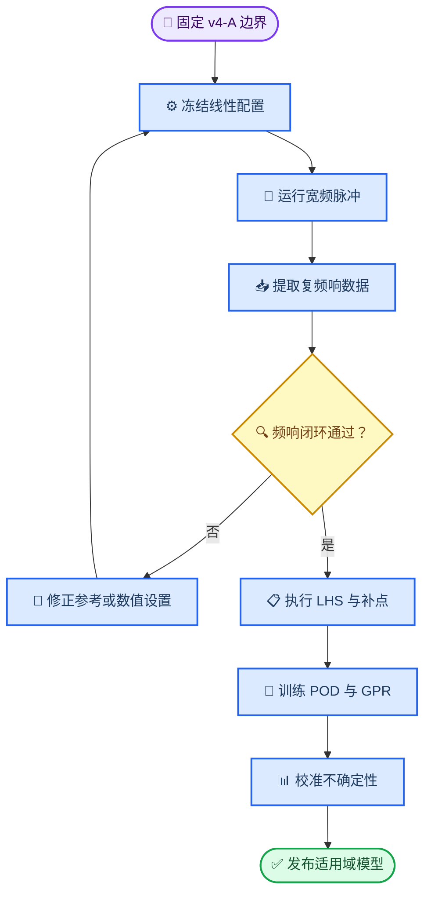

# 边坡地震响应机器学习 v4 后续实施方案

_面向均质成果收束、成层场地频响代理与后续 SSI 扩展的实施基线（2026-07-10）_

> 📌 **2026-07-17 同步说明：** 本文件继续作为复频响、POD、GPR和数据协议的技术依据；阶段1原“150个物理工况”预算已由[数值模拟全流程工况设计方案](数值模拟全流程工况设计方案.md)替代。TSSI/SSI分支暂缓，不纳入当前第4、6章数据生产。

---

## 📋 定位与总体目标

本方案定义机器学习 v4 的研究边界、数据协议、验证闸门和交付顺序。v4 不再把“几何 + 三条既有地震波 → PGA/TAF 曲线”的高精度插值结果，外推解释为对任意新波的通用预测能力；而是将主问题重写为：在**线性、时不变、边界条件固定**的条件下，学习成层斜坡地表的复频率响应，并对未参与建模的真实波完成时域闭环验证。

| 项目 | v3 已完成结论 | v4 要回答的问题 |
| --- | --- | --- |
| 代理对象 | 三条已知波下的 PGA/TAF 曲线 | 与输入波解耦的复频响 `H(f, s)` |
| 主要优势 | 几何插值精度高、经典 ML 优于端到端深度学习 | 对新波响应的可复核重建能力 |
| 主要边界 | 留一波泛化弱，不能宣称任意波预测 | 先验证频响闭环，再扩展参数空间 |
| 主结论通道 | `TAF_h`、`PGA_h`、`PGA_v` | 水平/竖向复频响与重建后的工程指标 |

> 📌 **v3 的定位冻结为基线。** 其 GroupKFold 结果用于说明“已知三波条件下的几何插值能力”；留一波结果只用于界定旧任务的波外推边界，不再通过增加波特征或更复杂模型继续调优。

### 研究问题与成功条件

1. 对固定的线性成层斜坡系统，宽频脉冲提取的 `H(f, s)` 是否在有效频带内稳定，且不依赖脉冲频率与幅值？
2. 以 `H(f, s)` 重建未参与提取的真实地震波响应后，能否在坡面关键区保持可接受的 PGA、Sa、Arias 强度和峰值位置误差？
3. 引入无量纲几何—地层特征、解析一维自由场基线和主动学习后，是否能以有限 Abaqus 工况覆盖目标参数域，并给出校准后的不确定性？

---

## 🎯 研究边界与建模分支

### v4-A：地形—场地频响代理（本方案主线）

v4-A 的标签只描述纯坡地地表运动，不引入建筑结构。所有用于频响学习的工况均以 [slope_frame_ssi_full_v2.py](../../Modeling/Hybrid/slope_frame_ssi_full_v2.py) 为唯一建模入口，并固定以下配置语义。

| 配置项 | v4-A 规定 | 原因 |
| --- | --- | --- |
| `tssi_cfg.scene` | `freefield` | 强制关闭框架，标签只含地形—场地响应 |
| `eql_cfg.enable` | `False` | 保持线性时不变，保证传递函数定义成立 |
| `damping_cfg.fc` | 全部工况使用同一预设值 | 禁止随输入波主频重算瑞利阻尼 |
| `mesh_cfg` 与 `time_cfg` | 按目标有效频带一次性冻结 | 禁止不同脉冲因网格或时间步不同而产生数值差异 |
| `run_cfg.surface_only` | `True` | 保留 `TOP_SURFACE` 全时程，控制 ODB 体积 |
| `time_cfg.tail_seconds` | 先经收敛试验确定，再固定 | 降低自由振动截断造成的频谱泄漏 |

### v4-B：坡顶结构—SSI 代理（后续独立扩展）

当使用 `scene='ssi'` 时，框架周期、质量、阻尼、基础尺寸、接触和材料非线性都会改变响应。该分支的输入必须显式加入结构参数，输出应定义为楼层、基础或 SSI 放大指标；不得与 v4-A 的纯坡地 `H(f, s)` 混入同一训练集。

> ⚠️ **非线性不属于 v4-A 的频响假设。** EQL 或后续本构非线性会使有效刚度和阻尼随输入幅值、频率成分改变。其合理路线是建立“地震动特征 + 物理参数 → 非线性响应”的独立代理，而不是复用线性 `H(f, s)`。

---

## ⚙️ 频响目标与数据协议

### 统一物理定义

以模型施加的基岩上行入射 SV 波加速度谱为唯一参考，定义：

\[
H_{2D}(f, s)=\frac{\widehat{A}_{\mathrm{surface}}(f,s)}{\widehat{A}_{\mathrm{incident}}(f)}
\]

同时以同一参考得到一维成层自由场响应 `H_1D(f)`。地形效应可作为派生量：

\[
T_{\mathrm{topo}}(f,s)=\frac{H_{2D}(f,s)}{H_{1D}(f)}
\]

机器学习不得只拟合幅值。每个输出单元至少保留 `log|H|` 与相位信息；推荐把相位表示为展开后的相位残差，或以实部、虚部联合建模。重建时通过复数频响与新波谱相乘，再 IFFT 回到时域。`Sa(T)` 只能作为重建时程后的工程评价指标，不能替代 `H(f,s)` 参与 IFFT。

### 无量纲输入与输出坐标

| 类别 | v4-A 变量 | 处理原则 |
| --- | --- | --- |
| 几何 | 坡角 `i`、入射角 `θ` | 连续采样，角度限制在临界角以下 |
| 地层厚度 | `d/h` | 首阶段仅一层覆盖层 + 基岩 |
| 波速 | `V_s,cover/V_s,bedrock` | 与厚度共同决定共振，不能只由阻抗比替代 |
| 密度 | `ρ_cover/ρ_bedrock` | 与波速比独立保留，避免同阻抗异共振不可辨识 |
| 阻尼 | `ξ_cover`、`ξ_bedrock` | 先固定或低维采样；每个试验批次必须固定定义 |
| 空间坐标 | 三段拓扑坐标 `s` | 复用现有坡顶平台—坡面—坡脚平台对齐方式 |
| 频率坐标 | `ξ_f=f·h/V_s,ref` | 每个频点对应一个无量纲频率，不能用单个参考频率代替整条频响 |

### 现有后处理的继承与升级

[Postprocess_All_surface_v2.py](../../Postprocess/Hybrid/Postprocess_All_surface_v2.py) 已能从 `TOP_SURFACE` 时程提取幅值传函、写出 `H_surface_*`，并重采样为三段 `s` 网格。因此 v4 不重写地表提取和空间对齐，而是做下列增量升级。

| 现有能力 | v4 升级要求 | 计划产物 |
| --- | --- | --- |
| `|FFT(A_out)|/|FFT(A_in)|` 幅值比 | 计算并保留复数频响、相位和有效频带掩码 | `H_complex_*_<record>.npz` |
| 输入谱幅值掩码 | 写出频率、窗口、补零、参考类型和低信噪频点原因 | `transfer_quality_<record>.json` |
| 三段 `s` 重采样 | 同步重采样实部、虚部或幅值、相位 | `sgrid_H_complex_*_<record>.npz` |
| `case_meta.json` | 写入配置散列、网格、阻尼、参考信号和后处理版本 | `data_manifest_v4.csv` |

`npz` 为复数频响的规范存储格式；原有 CSV 幅值文件继续保留，服务旧图表和人工抽查。每个数据样本须包含 `case_id`、`record_id`、配置散列、特征、`s` 网格、`ξ_f` 网格、复频响和 `valid_mask`。

---

## 🔄 实施闭环

v4 的顺序以“频响闭环是否通过”为硬闸门。未通过时只能修正建模、参考定义或后处理，不能直接扩大 LHS 工况。

---

## 🧪 阶段 0：频响可行性闸门

### 工况与输入设计

先选取 6 个代表性物理工况：均质坡、弱对比薄覆盖层和强对比厚覆盖层各 2 个，并覆盖中等与不利几何组合。每个工况按以下顺序运行：

1. 3 个中心频率不同、共同覆盖目标频带的宽频 Ricker 脉冲
2. 其中 1 个脉冲的幅值缩放副本
3. 2 条未参与频响提取的真实地震波直接 FEM

该阶段约产生 36 条动力作业。所有作业必须使用相同的材料、阻尼、网格、分析时长和输出频率；脉冲只能改变输入时程，不能触发材料阻尼或网格规则改变。

### 验收指标与处理分支

| 检查 | 初始验收阈值 | 未通过时的优先动作 |
| --- | --- | --- |
| 脉冲间 `|H|` 一致性 | 有效频带内相对差 ≤ 5% | 检查参考信号、窗函数、静默尾段和频率掩码 |
| 脉冲间相位一致性 | 圆周 RMSE ≤ 0.20 rad | 检查时间零点、重采样和相位展开 |
| 幅值缩放不变性 | 有效频带内无系统性漂移 | 确认线性材料、关闭 EQL、固定阻尼 |
| 新波闭环 | 关键区 PGA、Sa、Arias 与峰位误差满足预注册阈值 | 先修正 `H` 提取，再评估目标频带与网格 |
| 远场一维对拍 | 与 `H_1D` 理论基线一致 | 检查自由场、人工边界和层间参数 |

> 📌 阈值应在首个网格—时间步收敛试验后写入结果记录；只能基于数值误差下限收紧，不能在查看新波结果后放宽。

---

## 📊 阶段 1：参数采样与数据治理

### 150 个物理工况的固定预算

| 数据用途 | 数量 | 是否进入训练 | 说明 |
| --- | ---: | --- | --- |
| LHS 种子集 | 80 | 是 | 覆盖 v4-A 的连续参数域 |
| 固定盲测集 | 20 | 否 | 在任何调参与主动学习前锁定 |
| 主动学习补点 | 50 | 是 | 分两批选择，每批 25 个 |
| 真实波闭环 | 10–15 个盲测工况 | 否 | 每个工况额外运行两条新波，仅用于端到端验证 |

每个物理工况用通过阶段 0 的标准宽频输入提取一次频响。真实波闭环是额外计算预算，不能回灌到训练、PCA、超参数选择或主动学习候选池中。

### 主动学习规则

主动学习不采用“单点最大 GPR 方差”规则。每轮候选按频率—空间加权的重构方差排序，再施加最小点间距、批次多样性、可运行性和预计计算成本约束。权重优先覆盖坡面和坡顶拐点附近，以及工程关注频带；固定盲测集始终不可见。

### 质量门与可追溯性

| 门槛 | 必需证据 |
| --- | --- |
| 建模完成 | `case_meta.json`、配置散列、求解日志与 ODB 成功状态 |
| 后处理完成 | 复频响文件、质量 JSON、三段 `s` 网格一致性检查 |
| 入库完成 | `data_manifest_v4.csv` 中有唯一 `case_id`，无缺失关键特征 |
| 可复现 | 固定随机种子、训练/验证/盲测清单和脚本版本同时保存 |

---

## 🧠 阶段 2：代理建模、验证与不确定性

### 模型比较顺序

| 编号 | 方法 | 作用 |
| --- | --- | --- |
| B0 | 解析 `H_1D` | 无 ML 的物理基线 |
| M1 | 直接学习复频响 | 判断原始问题难度 |
| M2 | 学习相对 `H_1D` 的幅值/相位残差 | v4 主力候选，降低层状共振负担 |
| M3 | `H_1D × H_topo` 残差 | 仅当 `H_topo` 基线可折内获得时启用 |

每个方法均采用二维 POD：先在训练折内对频率—空间响应面降维，再以 GPR 预测模态系数。XGBoost 用于非线性关系与特征归因对照，不替代 GPR 的不确定性。PCA、标准化、缺失值处理、物理基线和超参数优化均必须在训练折内完成。

### 验证设计

| 层级 | 划分方法 | 回答的问题 |
| --- | --- | --- |
| 内层验证 | 按 `case_id` 的 GroupKFold | 参数域内插值与模型选择 |
| 外层盲测 | 固定 20 个物理工况 | 未见参数组合的最终精度 |
| 结构化外推 | 留边界区间、留材料组合 | 适用域边界是否清晰 |
| 波闭环 | 未见真实波的直接 FEM | 频响乘谱—IFFT 是否真实有效 |

主要指标必须同时覆盖频域和时域：有效频带 `log|H|` 误差、相位误差、重建后的 PGA/PGV、指定阻尼 Sa、Arias 强度、峰值位置及坡面关键区误差。不得用全空间平均 R² 单独作为达标依据。

### 不确定性量化

GPR 的模态方差须传播回频率—空间域，并在固定盲测集上报告 80% 与 95% 区间覆盖率、区间宽度和失配工况。现有 v3 留一波不确定性数组的布尔索引写回问题应在归档修订中单独修复；v4 不以未校准的 `±2σ` 图作为工程适用域结论。

---

## ⚠️ 风险、决策规则与停止条件

| 风险 | 触发信号 | 决策规则 |
| --- | --- | --- |
| 频响对脉冲不稳定 | 阶段 0 一致性失败 | 停止 LHS，先固定阻尼/网格并修正复频响提取 |
| 参数维度过高 | 盲测误差不降或 UQ 持续过宽 | 先固定泊松比与部分阻尼，仅扩展一层覆盖层 |
| `H_topo` 残差无增益 | M3 不优于 M2 | 不采用乘性残差主线，保留 `H_1D` 基线 |
| 竖向比值病态 | 自由场竖向分母接近零 | 不训练 `TAF_v`，改存原始竖向响应与可靠性标签 |
| SSI 混入纯坡地标签 | `scene='ssi'` 或结构参数变化 | 立即剔出 v4-A 数据集，转入独立 v4-B 分支 |
| UQ 未校准 | 95% 覆盖率显著偏离 95% | 增加残差校准或保形预测区间，禁止仅按方差选点 |

---

## ✍️ 实施产物与任务清单

### 计划新增或升级的代码产物

| 位置 | 计划产物 | 职责 |
| --- | --- | --- |
| `Postprocess/Hybrid/` | `Postprocess_All_surface_v3.py` | 在 v2 基础上输出复频响、相位和质量掩码 |
| `Postprocess/Hybrid/` | `Collect_All_results_v3.py` | 汇总复频响清单和配置散列 |
| `ML/v4/` | `build_dataset_v4.py` | 读取清单、检查数据契约并生成训练数据 |
| `ML/v4/` | `train_v4.py` | 折内 POD、GPR/XGBoost 对照与模型保存 |
| `ML/v4/` | `evaluate_v4.py` | 盲测、闭环、UQ 校准和适用域报告 |
| `ML/v4/` | `active_learning_v4.py` | 候选评分、批次多样化和选点清单 |
| `test/Hybrid/` | `test_transfer_function_v1.py` | 普通 Python 下验证复频响、相位、重采样和数据契约 |

### 阶段检查清单

- [ ] 冻结 v3 的数据划分、指标和论文表述边界
- [ ] 完成 v4-A 统一 `case_config.json` 模板并锁定线性配置
- [ ] 升级后处理为复频响与质量文件，完成纯 Python 单元测试
- [ ] 运行阶段 0 的脉冲一致性、幅值不变性与新波闭环试验
- [ ] 记录并批准阶段 0 验收结论后，再创建 80 个 LHS 种子工况
- [ ] 锁定 20 个盲测工况及其随机种子，不参与后续选点
- [ ] 完成两轮主动学习、外层盲测与 UQ 覆盖率报告
- [ ] 仅在 v4-A 完成后，另立 v4-B SSI 代理实施方案

---

## 🔗 现有资料与接口

- [v3 实施方案](../../ML/v3/ml_plan_v3.md)
- [v3 完整结果报告](../../ML/v3/outputs_v3/REPORT_v3.md)
- [项目级机器学习建模与操作指南](边坡地震响应机器学习建模与操作指南.md)
- [统一 Hybrid 建模入口](../../Modeling/Hybrid/slope_frame_ssi_full_v2.py)
- [现有地表后处理与三段坐标重采样](../../Postprocess/Hybrid/Postprocess_All_surface_v2.py)
- [现有跨工况结果收集器](../../Postprocess/Hybrid/Collect_All_results_v2.py)

_维护原则：本文件记录 v4 的当前批准路线；阶段完成、阈值调整或范围变更后，应同步更新相应状态、数据预算和交付清单。_
