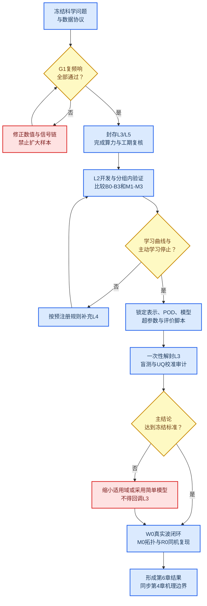

# 边坡地震响应机器学习研究与实施计划

_机器学习 v4 论文适用性与学术性审查稿｜2026-07-18_

> **审查结论：有条件通过。** v4 适合作为毕业论文第6章的主升级方向，但其学术价值不在于“使用了机器学习”，而在于围绕斜入射成层坡地的地形—地层可分离性与耦合残差，建立复频响代理、冻结盲测、时域闭环、校准不确定性和确定性域外拒绝组成的完整证据链。G1复频响闸门未通过前，不得启动正式主样本生产，也不得把v4写成已完成成果。

本文是当前唯一有效的机器学习研究与实施计划。工况数量、参数域、数据角色和阶段状态以[第四章参数分析与第六章机器学习工况指导计划](第四章参数分析与第六章机器学习工况指导计划.md)为唯一依据；本文负责论文定位、学术边界、机器学习协议和验收逻辑，不重复维护易漂移的工况总数。

---

## 📋 审查记录与当前状态

### Material Passport

| 字段 | 内容 |
| --- | --- |
| Origin Skill | `academic-research-suite / experiment-agent` |
| Mode | `plan` |
| Date | 2026-07-18 |
| Verification Status | `UNVERIFIED`：v4尚未完成；既有v3指标、现行代码接口与G0运行状态已核验 |

### 当前事实基线

| 对象 | 已核验状态 | 对本计划的约束 |
| --- | --- | --- |
| v3历史模型 | 522个样本，`TAF_h`全体测试`MAE=0.02488`、`R²=0.9455`；留一高度和留一地震波外推明显退化 | 保留为历史基线和问题诊断，不与v4新目标混训 |
| G0配置注入 | 12个测试工况均通过 | 只证明配置可达模型，不等于复频响物理验收 |
| G1频响闸门 | 截至本次审查尚无最终验收报告 | 未通过前禁止扩大L2训练池 |
| 建模源 | [`Modeling/slope_frame_ssi_full_v2.py`](../../Modeling/slope_frame_ssi_full_v2.py) | 是当前唯一建模事实源；旧文档中的`Modeling/Multi/...v8.py`已失效 |
| 后处理源 | [`Postprocess/Postprocess_All_surface_v2.py`](../../Postprocess/Postprocess_All_surface_v2.py) | 已输出复`H`、`valid_mask`、FSAF/RSAF及质量信息；旧“待开发后处理脚本”表述已失效 |
| v4代码 | 尚未建立正式训练目录 | 本文仅批准研究路线，不自动授权创建新的脚本版本后缀 |

### 审查后的总判断

| 维度 | 判断 | 必须补强的部分 |
| --- | --- | --- |
| 毕业论文适用性 | 高 | 第4章先给出可分离性和耦合机理，第6章再学习其映射 |
| 科学问题清晰度 | 高 | 始终围绕“何时可分离、何时需耦合残差、何时拒绝预测” |
| 方法新颖性 | 中等偏高、组合式 | 不宣称POD、GPR、SHAP或坡地机器学习本身首创 |
| 数据可识别性 | 修订后可接受 | 分开`r_v`与`r_\rho`；频率是输出坐标，不是工况特征 |
| 验证严谨性 | 有条件可接受 | 必须完成冻结盲测、未见波形闭环、校准覆盖率和OOD拒绝 |
| 工程可行性 | 单机分阶段可执行 | 以适量代表集起步；L2和L4只在学习曲线证明有必要时扩展 |
| 当前完成度 | 计划阶段 | v4不得替代第6章中已有v3实证结果 |

## 🎯 论文定位与研究边界

### 中心科学问题

第4章和第6章共同回答：

> 对线性斜入射成层坡地，二维复频响在什么参数区间可近似分解为一维成层响应与均质地形响应的乘积，什么条件下出现不可忽略的耦合；能否构建一个在适用域内准确、在适用域外主动拒绝，并能给出可信不确定性的代理模型？

这一定位把机器学习从“插值工具”转化为物理假设检验和工程快速预测的后半段。第4章负责机制与边界，第6章负责压缩、预测、验证和拒绝。

### 研究对象

- 主对象：线性、二维、斜入射、均质坡与两层坡地的水平复频响`H_x(\xi_f,s)`。
- 次对象：竖向复频响`H_z(\xi_f,s)`，用于分析斜入射转换效应，但不构造病态的竖向同分量比值。
- 主要输入：坡角`i`、入射角`\theta`、相对层厚`d/h`、剪切波速比`r_v`和密度比`r_\rho`。
- 输出坐标：无量纲频率`\xi_f=fh/V_{s,b}`和无量纲空间位置`s`。
- 工程闭环：由预测复频响重建未参与训练的真实地震波响应，再评价PGA、PGV、反应谱、Arias强度和峰值位置。

### 明确排除

- TSSI、结构响应和第5章问题不进入v4训练域。
- 等效线性工况只用于第4章适用性边界，不与线性数据混合训练。
- 多层地层只作为结构化OOD挑战，不伪装成两层插值样本。
- 坡高`h`在正式生产中固定；额外坡高只用于尺度一致性核验，不重新引入v3的高度外推问题。
- 地震波`T_p/T_s`、峰值和频谱特征不作为线性系统复频响的工况输入。真实波只用于闭环验证。

### v3与v4在论文中的角色

| 版本 | 论文角色 | 可以支持的结论 | 不应承担的结论 |
| --- | --- | --- | --- |
| v3 | 已完成的历史基线与预研究 | POD代理可在既有样本分布内重建TAF；暴露高度和波形外推风险 | 不能证明复频响泛化、成层耦合、相位可信或OOD安全 |
| v4 | 条件满足后成为第6章主模型 | 复频响与耦合残差预测、冻结盲测、时域闭环、UQ与OOD | 在G1或盲测未完成时不能写成结果 |

若论文定稿前v4未完成全部硬门槛，应保留v3为第6章现有实证，把v4降级为“经审查的后续研究方案”，不得用计划替代结果。

## 🔍 学术性审查与贡献边界

### 已有研究划定的边界

坡地放大标量的机器学习预测已有研究，因此“首次用机器学习预测边坡地震放大”不能作为创新点。[^1] 地形—地层耦合的二维数值研究也已存在，并已覆盖线性/等效线性及斜入射参数分析，因此“首次考虑耦合”或“首次研究斜入射成层坡”同样风险很高。[^2][^3] POD与高斯过程组合也是成熟的降阶代理方法，不能单独构成论文创新。[^4]

### 可成立的组合式贡献

1. **目标贡献**：把沿坡面全场的复频响而非单一峰值作为统一学习对象，同时保留幅值、相位、频率和空间位置。
2. **物理贡献**：显式检验`H_{2D}\approx H_{1D}H_{topo}`的成立边界，并以复耦合残差`R_c=H_{2D}/(H_{1D}H_{topo})`描述偏离。
3. **建模贡献**：在同一冻结划分下比较直接学习、去除一维响应和学习耦合残差三条路线，回答物理分解是否真正降低学习难度。
4. **验证贡献**：把独立盲测、未见真实波时域闭环、同机干净复现、拓扑挑战、校准不确定性和OOD拒绝纳入同一协议。
5. **论文贡献**：给出“可直接采用乘积近似—需要数据驱动修正—应拒绝外推”的分区，而不只报告一个全局`R²`。

### 不允许的强表述

- 不以“首次”“填补空白”表述未经系统文献检索证明的优先权。
- 不把SHAP排序写成因果机制；机理证据来自第4章控制变量切片、全局敏感性和可重复物理现象。
- 不以随机点划分的高`R²`证明外推能力。
- 不把规范经验公式与复频响模型放在不同目标上比较后宣称“优于规范”。
- 不把缺少一致输入、地层和参考台站的震害案例写成定量外部验证。
- 不把零填充视为消除频谱泄漏；泄漏、窗函数、静默尾段和时间零点必须在G1中验证。

## ❓ 研究问题、假设与判定

### 研究问题

- **RQ6-1：目标选择。** 直接学习`H_{2D}`、学习`H_{2D}/H_{1D}`或学习`R_c`，哪一条在相同数据和盲测条件下最准确、最稳定？
- **RQ6-2：闭环能力。** 预测的复频响能否重建未参与训练的真实地震波时域与反应谱指标？
- **RQ6-3：可信边界。** 不确定性与OOD门控能否识别未见参数组合、物理域外输入和多层拓扑？
- **RQ6-4：学术增量。** 相比物理乘积、插值和简单线性降阶基线，复杂模型是否带来超过数值误差下限的增益？

### 可证伪假设

| 编号 | 假设 | 主要证据 | 否证后处理 |
| --- | --- | --- | --- |
| H6-1 | 在弱对比、薄层或低频区，`R_c`接近1，乘积近似足够 | 第4章配对切片、L3盲测 | 明确缩小可分离区域 |
| H6-2 | 在强对比、厚层、临界角附近或特定频带，耦合残差显著 | L1机理池、L3重复出现 | 若不成立，降低“耦合模型”贡献权重 |
| H6-3 | 去除`H_{1D}`或学习`R_c`比直接学习`H_{2D}`更节省样本 | 学习曲线、配对盲测误差 | 采用更简单的M1/M2，不强行保留M3 |
| H6-4 | 校准后的区间在ID数据上达到名义覆盖率，并在OOD附近变宽 | L3覆盖率、L5风险—拒绝曲线 | 改用残差/保形校准或只输出点预测与拒绝 |
| H6-5 | 频域代理可在未见波形上闭合工程指标 | W0直接求解与重建对比 | 限制结论为频域插值，不宣称时域工程可用 |

判定阈值必须在G1给出数值误差下限后、解封L3前冻结。任何阈值修改都要留下原因、日期和散列，不能根据盲测结果反向调整。

## 🧾 数据定义与防泄漏协议

### 输入与输出

两层坡工况输入定义为

\[
\mathbf{x}=[i,\theta,d/h,r_v,r_\rho],\qquad
r_v=V_{s,c}/V_{s,b},\qquad
r_\rho=\rho_c/\rho_b.
\]

均质坡代理输入定义为

\[
\mathbf{x}_{topo}=[i,\theta].
\]

主输出为离散频率—空间网格上的复频响

\[
H_{2D,k}(\xi_f,s)=
\frac{\widehat A_{\mathrm{surface},k}(\xi_f,s)}
{\widehat A_{\mathrm{incident}}(\xi_f)},\qquad k\in\{x,z\}.
\]

主残差定义为

\[
R_c(\xi_f,s)=
\frac{H_{2D,x}(\xi_f,s)}
{H_{1D}(\xi_f)H_{topo}(\xi_f,s)}.
\]

频率`\xi_f`与位置`s`是输出场坐标，不是彼此独立的训练样本。统计划分、交叉验证和置信区间的基本单位始终是完整物理工况。

### 数据角色

| 数据池 | 角色 | 能否参与拟合 |
| --- | --- | --- |
| G0/G1 | 生产链与复频响验收 | 否 |
| H1—H3 | 均质物理基线、尺度与边界 | 仅用于`S_{topo}`开发 |
| L1 | 机理锚点与参数切片 | 可进入开发集，但必须保留切片身份 |
| L2 | 主训练与内部交叉验证 | 是 |
| L3 | 冻结独立盲测 | 否；模型锁定前不可解封 |
| L4 | 主动学习补点 | 是；选择规则必须只用开发集信息 |
| L5 | 结构化OOD挑战 | 否；只评价拒绝和风险 |
| C0 | 与分层工况匹配的均质对照 | 用于构造`H_{topo}`与残差 |
| W0 | 未见真实波时域闭环 | 否 |
| M0/R0 | 多层拓扑挑战/同机干净复现 | 否 |
| N0 | 等效线性适用性扩展 | 否；不进入第6章训练 |

各池的精确数量、参数范围和执行顺序只在[第四章参数分析与第六章机器学习工况指导计划](第四章参数分析与第六章机器学习工况指导计划.md)维护。

### 复输出表示

在开发集内部比较以下两类表示，不预先指定优胜者：

1. 堆叠`Re(H)`与`Im(H)`，直接保证相位连续但尺度可能不均。
2. `log|H|`与圆周相位残差的正余弦表示，改善幅值动态范围但需严格处理低幅值点和相位重建。

选择规则如下：

- 只在所有代表工况共同有效频带和`valid_mask=True`的单元比较。
- 掩码、尺度变换、POD基、模态数和超参数全部在训练折内拟合。
- 主选择指标同时包含`log|H|`误差、相位圆周误差和复数NRMSE。
- 时域重建使用`rfft/irfft`一致的单边谱约定，显式检查实信号所需的共轭对称与时间零点。
- 盲测集不得用于选择复数表示、模态数、频带或网格。

### G1必须补足的信号处理证据

当前`valid_mask`主要依据输入谱能量判定，不等同于统计意义上的相干函数。G1必须额外比较：

- 去均值/去趋势是否改变有效频带；
- 窗函数、静默尾段和截断位置对幅相的敏感性；
- 不同宽频激励间的复频响一致性；
- 幅值缩放不变性；
- 远场一维对拍和两条真实波的直接—重建闭环；
- 时间零点与相位展开规则。

只有上述证据满足[第四章参数分析与第六章机器学习工况指导计划](第四章参数分析与第六章机器学习工况指导计划.md#g1频响验收)中的门槛，复频响才可进入机器学习数据集。

### 防泄漏硬规则

1. 物理工况整体划分；同一工况的频率、空间点、分量和派生指标不得跨训练/验证/测试集。
2. L3清单在模型开发前生成、散列并密封；解封前冻结特征、频带、POD、模型、超参数范围和评价脚本。
3. 对M3，测试工况的`H_{topo}`必须由只在训练折拟合的`S_{topo}`预测；精确匹配的`H_{topo}`只允许作为解封后的oracle诊断。
4. 任何标准化、缺失处理、POD和超参数搜索都在折内完成。
5. 主动学习只读取L2/L4开发信息，不读取L3或L5标签。
6. v3与v4因目标、输入和数据协议不同，不混训、不拼接后报告单一指标。

## 🧠 模型、基线与解释

### 必须同场比较的路线

| 编号 | 路线 | 作用 |
| --- | --- | --- |
| B0 | 一维成层响应`H_{1D}` | 最低物理基线 |
| B1 | `H_{1D}H_{topo}` | 可分离物理基线，也是论文核心假设 |
| B2 | 最近邻/线性或径向插值 | 判断复杂机器学习是否必要 |
| B3 | Ridge预测POD系数 | 简单、可解释的统计基线 |
| M1 | 直接学习`H_{2D}` | 端到端基线 |
| M2 | 学习`H_{2D}/H_{1D}` | 去除一维成层主效应 |
| M3 | 学习`R_c` | 只学习地形—地层耦合残差 |

B0—B3、M1—M3必须使用同一物理工况划分和同一评价脚本。若复杂模型不能稳定优于B1/B3，应选择更简单路线，并把“乘积近似已足够”的结果作为科学结论，而不是失败。

### 候选学习器

- 主候选：带ARD核的GPR，用于中小样本POD系数预测与原生不确定性。
- 对照候选：XGBoost或等价树模型，用于非线性与交互对照。
- 简单基线：Ridge/Elastic Net，防止把数据规律误判为复杂模型贡献。
- POD模态数由训练折累计能量与重建误差共同决定，不沿用v3固定值。

只有在预注册基线完成后，才考虑额外神经网络。样本规模不足时，不以增加网络复杂度替代物理设计和盲测。

### 不确定性与OOD

不确定性不是“GPR均值±2σ”的默认图形，而是需要验证的预测对象：

- 在开发集完成方差缩放、残差校准或保形校准；
- 在L3分别报告80%和95%区间的经验覆盖率、平均宽度和分组覆盖率；
- 区间失配时先校准，不把未经校准的方差称为置信度；
- OOD门控按拓扑规则、物理参数边界、训练分布距离和预测不确定性四层执行；
- 多层地层、域外参数和非法临界角由确定性规则直接拒绝；
- L5用于绘制风险—覆盖率/风险—拒绝率曲线，不用来反向训练门槛。

### 可解释性边界

SHAP或置换重要性只用于描述模型在给定数据分布中的关联和交互。论文中的物理解释必须回到：

- 第4章的单因素控制切片；
- Sobol或等价全局敏感性；
- 幅值与相位空间图；
- 可分离/过渡/强耦合分区；
- 具有重复工况支持的临界角、层厚和材料对比效应。

## ✅ 验证层级与成功标准

### 四层验证

| 层级 | 数据 | 回答的问题 |
| --- | --- | --- |
| 内部验证 | L2分组嵌套交叉验证 | 模型和表示如何选择 |
| 冻结盲测 | L3 | 未见参数组合上的真实泛化 |
| 结构化OOD | L5及非法域输入 | 模型能否拒绝不该预测的问题 |
| 工程与复现 | W0、M0、R0 | 未见波形能否闭环、域外拓扑能否拒识、单机流程能否复现 |

### 主次终点

| 类型 | 指标 | 判定方式 |
| --- | --- | --- |
| 主终点 | L3上按物理工况加权的`log|H_x|` MAE | 与最强预注册基线做配对比较 |
| 关键次终点 | 相位圆周RMSE、复数NRMSE、P95误差 | 不允许只优化幅值牺牲相位 |
| 空间终点 | 坡肩、坡面、坡脚、远场分区误差 | 防止全局平均掩盖局部失效 |
| 工程终点 | PGA、PGV、Sa、Arias、峰值位置 | W0直接求解与频响重建对比 |
| 可信度终点 | 80%/95%覆盖率、区间宽度、风险—拒绝曲线 | 证明区间经过校准且拒绝有效 |
| 机理终点 | 可分离分类、`R_c`幅相误差 | 回答第4章与第6章共同科学问题 |

### 冻结判定规则

1. G1全部指标通过后，由其数值误差下限定义最小有意义改进`\delta_A`和`\delta_\phi`。
2. 主模型只有在L3上相对最强基线的配对工况bootstrap 95%置信区间支持改进，且改进超过预注册的最小有意义阈值，才称为“显著提升”。
3. 若幅值提升但相位或关键工程指标显著恶化，只能称为局部提升。
4. 80%和95%区间的整体及关键分组覆盖率均需报告；允许偏差在解封L3前预注册。
5. 所有bootstrap以物理工况为重采样单位；频率—空间单元不能伪装成独立大样本。
6. 探索性参数切片应报告效应量与区间；多重比较结果与预注册主终点分开呈现。

单机适量方案的统计目标是判断“是否达到工程上有意义的改进”和定位典型失效区，而不是检出极小差异。盲测样本有限时，优先报告逐工况配对差值、效应量、区间和失败个案；若区间过宽，应把结论写成“不确定”或收窄适用域，不用频率—空间点数伪造统计功效。

## 🔄 执行阶段与阶段门

### 阶段0：复频响可用性

- 完成G1全套激励一致性、缩放、远场对拍和真实波闭环。
- 冻结共同有效频带、窗函数、尾段、相位和掩码规则。
- **停止条件：** 任一硬门超限，返回数值/信号链，不生成主训练池。

### 阶段1：协议冻结与可行性复核

- 生成并散列L2/L3/L4/L5清单；L3、L5只保留元数据角色，不暴露标签。
- 估算单工况用时、磁盘、许可证、单机队列长度和断点恢复成本。
- 现行适量工况预算采用“起步集—推荐集—硬上限”三级口径，不视为必须无条件跑满的任务数。
- 若需调整工况数量，必须先依据覆盖度、学习曲线和计算资源形成变更记录，再同步更新唯一工况方案；不得在盲测后删减困难区域。

### 阶段2：基线与小规模预实验

- 先完成B0—B3，再比较M1—M3。
- 在开发集内选择复输出表示、POD模态数、核函数和超参数范围。
- 形成学习曲线，检查误差是否已接近G1数值下限。

### 阶段3：主训练与主动学习

- 运行L2主开发池；按预注册准则选择L4补点。
- 主动学习重点覆盖高不确定性、强耦合边界和高误差区域，但保留空间填充约束，避免只追逐异常点。
- 停止条件沿用唯一工况方案中的学习曲线与覆盖度规则。

### 阶段4：锁模与盲测

- 锁定代码提交、数据散列、特征、POD、模型、随机种子和评价脚本。
- 一次性解封L3；失败后不得把L3重新并入训练再称“盲测”。
- 输出全部主次终点、分区结果、误差个案和置信区间。

### 阶段5：可信性闭环

- L5评价OOD拒绝，不追求强制预测。
- W0用未见真实波比较直接有限元结果与复频响重建。
- M0用于检验两层代理面对多层或分层形态变化时能否正确拒识，R0用于同一台电脑、干净目录和冻结配置下的重复运行。
- 现场案例只有在输入、地层、几何和参考口径可比时才进入定量验证，否则只作定性讨论。

### 阶段6：论文固化

- 第4章先写清可分离边界和耦合机制，再在第6章引用。
- 第6章同时报告成功、失败、拒绝和适用域，不只展示最佳图。
- 保存可复现清单、数据散列、模型卡、盲测审计和绘图脚本。

## 📚 与毕业论文的章节衔接

### 证据链分工

| 章节 | 对v4的输入 | 该章必须完成的输出 |
| --- | --- | --- |
| 第3章 | 数值模型可信性、网格/边界/阻尼/时间步误差 | G1阈值的数值误差下限 |
| 第4章 | H1—H3、L1、C0及相关对照 | 可分离边界、耦合机理、物理基线与参数敏感性 |
| 第5章 | 无 | TSSI保持独立，不污染v4研究边界 |
| 第6章 | L2—L5、W0、M0、R0及第4章物理结论 | 可信代理、盲测、UQ/OOD、时域闭环和单机可复现性 |

### 建议的第6章结构

1. `6.1` 问题定义、研究边界与组合式贡献；
2. `6.2` 数据来源、数据角色、冻结盲测与防泄漏协议；
3. `6.3` 复频响表示、有效掩码与POD降阶；
4. `6.4` 物理基线及M1/M2/M3代理模型；
5. `6.5` 冻结盲测、不确定性校准与OOD拒绝；
6. `6.6` 未见真实波时域/反应谱闭环及工程指标；
7. `6.7` 与v3对照、失败模式、适用域和局限性。

### 论文写作判据

- **可以写成主结果：** G1、L3、W0和UQ/OOD证据全部闭合。
- **只能写成有限结论：** L3通过但W0或UQ未闭合，应限制为数值频响代理。
- **只能写成展望：** G1未通过、未完成独立盲测，或只有随机划分结果。

## ⚠️ 主要风险与降级路线

| 风险 | 早期信号 | 处理与可发表的降级结论 |
| --- | --- | --- |
| G1激励依赖 | 不同激励的幅相超限 | 修正信号链；未通过前停止v4 |
| 总工况超出论文工期 | 单例耗时/失败率超预算 | 保留盲测、基线和机理锚点，按预注册学习曲线缩减开发池 |
| M3不优于M1/M2 | 残差并未降低复杂度 | 采用更简单模型，并报告可分离假设的边界 |
| 测试基线泄漏 | 测试使用精确`H_{topo}` | 重做fold-safe`S_{topo}`；oracle只作事后上限 |
| 相位不稳定 | 低幅值区跳变或时间零点漂移 | 缩小共同有效域，采用圆周表示并报告掩码 |
| UQ欠覆盖 | 95%区间明显低于名义覆盖 | 残差/保形校准；仍失败则不声称概率可信 |
| 高全局分数掩盖局部失效 | 坡肩或临界角P95很高 | 分区报告并设置局部拒绝域 |
| 真实案例不可比 | 缺少一致输入或参考台站 | 仅定性讨论，以W0闭环和M0适用域挑战作为核心数值证据 |
| SHAP与机理冲突 | 重要性随折变化大 | 降级为描述性结果，以控制试验和敏感性为准 |

论文的最小完整闭环不是“跑完最多工况”，而是：可信数值链、明确物理问题、至少一个强物理基线、严格独立盲测、一个未见波形闭环，以及诚实的适用域。扩充样本、主动学习和更多模型属于增强项，不能替代这些核心证据。

## 🗂️ 实施接口、产物与归档

### 当前有效接口

- 工况与阶段：[第四章参数分析与第六章机器学习工况指导计划](第四章参数分析与第六章机器学习工况指导计划.md)
- 建模：[`Modeling/slope_frame_ssi_full_v2.py`](../../Modeling/slope_frame_ssi_full_v2.py)
- 后处理：[`Postprocess/Postprocess_All_surface_v2.py`](../../Postprocess/Postprocess_All_surface_v2.py)
- 汇总：[`Postprocess/Collect_All_results_v2.py`](../../Postprocess/Collect_All_results_v2.py)
- 绘图：[`Postprocess/Plot_Hybrid_surface_v2.py`](../../Postprocess/Plot_Hybrid_surface_v2.py)
- v3历史报告：[`ML/v3/outputs_v3/REPORT_v3.md`](../../ML/v3/outputs_v3/REPORT_v3.md)
- 第6章当前正文：[第6章：基于机器学习的坡地地震动放大效应预测模型](../论文材料/章节Markdown/第6章_基于机器学习的坡地地震动放大效应预测模型.md)

执行获批后可建立`ML/v4/`研究目录，但具体脚本名和版本后缀须另行确认。至少应固化：

- 数据清单、角色、散列和生成提交；
- 共同频带、网格、掩码和参考口径；
- 训练/验证/盲测/OOD清单；
- 折内预处理与POD配置；
- 基线、候选模型、超参数空间和随机种子；
- 盲测前的锁模记录；
- 全部主次指标、区间、失败样本和拒绝记录；
- 可复现环境与一键评价入口。

### 本次旧文档归档

以下四份文件已退出活动计划区，保存在[`归档/2026-07-18_机器学习计划整合前/`](归档/2026-07-18_机器学习计划整合前/)：

- `边坡地震响应机器学习操作指南.md`：旧v2执行手册；
- `边坡地震响应机器学习后续实施方案.md`：原v4频响计划；
- `边坡地震响应机器学习建模与操作指南.md`：旧项目级操作指南；
- `边坡地震响应机器学习研究方案.md`：早期概念方案。

归档文件只用于追溯，不再作为工况数、路径、脚本接口或论文表述的依据。

## 📌 执行检查表

- [x] 核验四份旧机器学习计划的重叠、过时路径与矛盾口径
- [x] 核验当前建模、后处理、v3指标与G0/G1状态
- [x] 重新界定v4在毕业论文中的学术贡献和适用边界
- [x] 统一机器学习数据、模型、验证、UQ与OOD协议
- [x] 归档四份旧文档并建立单一活动计划
- [ ] 完成G1并形成正式验收报告
- [ ] 冻结共同有效频带、数值误差下限和ML成功阈值
- [ ] 完成单机分阶段运行前的算力、工期、存储和断点恢复复核
- [ ] 密封L3/L5清单后启动L2开发
- [ ] 锁模后一次性完成L3、W0、M0和R0
- [ ] 用实测结果更新第4章和第6章，不用计划数字替代结果

---

[^1]: Ju, S., Jia, J., & Pan, X. (2024). Prediction framework of slope topographic amplification on seismic acceleration based on machine learning algorithms. *Engineering Applications of Artificial Intelligence*, 133(B), 108143. [https://doi.org/10.1016/j.engappai.2024.108143](https://doi.org/10.1016/j.engappai.2024.108143)
[^2]: Rizzitano, S., Cascone, E., & Biondi, G. (2014). Coupling of topographic and stratigraphic effects on seismic response of slopes through 2D linear and equivalent linear analyses. *Soil Dynamics and Earthquake Engineering*, 67, 66–84. [https://doi.org/10.1016/j.soildyn.2014.09.003](https://doi.org/10.1016/j.soildyn.2014.09.003)
[^3]: Shen, H., Liu, Y., Li, X., Li, H., Wang, L., & Huang, W. (2025). The combined amplification effects of topography and stratigraphy of layered rock slopes under vertically and obliquely incident seismic waves. *Soil Dynamics and Earthquake Engineering*, 193, 109331. [https://doi.org/10.1016/j.soildyn.2025.109331](https://doi.org/10.1016/j.soildyn.2025.109331)
[^4]: Guo, M., & Hesthaven, J. S. (2018). Reduced order modeling for nonlinear structural analysis using Gaussian process regression. *Computer Methods in Applied Mechanics and Engineering*, 341, 807–826. [https://doi.org/10.1016/j.cma.2018.07.017](https://doi.org/10.1016/j.cma.2018.07.017)
