# 成层坡地地震动放大效应的幅值—相位联合表征、代理预测与真实地震动重构[^1]

李****1，王****1

（1. 重庆大学 土木工程学院，重庆 400045）

摘 要：成层坡地地震动放大同时受地形散射、覆盖层传播和斜入射相位差控制，传统峰值加速度（PGA）等标量指标难以保留频率—空间响应中的相位关系。基于黏弹性人工边界、频域自由场输入和宽频多正弦系统识别，建立了15° SV波斜入射下的二维线弹性成层坡地模型，并将全地表水平复频响函数 $G_h(f,s)$ 定义为二维地表复谱相对于左侧上平台一维自由场的比值。针对4个均质坡、64个成层坡及12个训练外中间参数组合，研究了坡角、覆盖层厚度比和波速比的影响，并构建本征正交分解—高斯过程代理模型。结果表明，统一参考场显著削弱了坡脚处由分母切换造成的非物理突变；16条厚度序列中有9条峰值放大呈非单调变化，固定坡角和波速比时主峰频率最大跨度为7.3 Hz；无量纲特征频率与中位绝对相位、群时延修正的Spearman相关系数分别为−0.940和−0.922，明显强于其与净幅值修正幅度的相关（−0.300）。代理模型在五折交叉验证和训练外组合上的中位加权复数误差分别为27.1%和26.4%，提高POD截断阶数可以降低中位误差，但不能消除误差上尾。采用El Centro、Kobe和Chi-Chi记录开展的10个体系—记录闭环表明，重构时程的中位归一化均方根误差为9.8%，相关系数为0.995，PGA误差为2.5%，峰值时刻误差为0.002 s；但10个组合中有4个、全部地表位置中有52.8%的时程误差超过10%。软厚覆盖层、坡面—下平台及高频区域仍需有限元复核。

关键词：成层坡地；地形效应；复频响函数；相位；代理模型；地震动重构

中图分类号：TU43                文献标志码：A

**Amplitude–phase joint characterization, surrogate prediction and ground-motion reconstruction of seismic amplification effects of layered slopes**

LI ****1, WANG ****1

(1. School of Civil Engineering, Chongqing University, Chongqing 400045, P. R. China)

**Abstract:** Seismic amplification of layered slopes is jointly controlled by topographic scattering, cover-layer propagation and oblique-incidence phase differences, whereas scalar measures such as peak ground acceleration (PGA) cannot retain the phase relation within the frequency–space response. A two-dimensional linear-elastic model under 15° SV-wave incidence was developed using viscous-spring boundaries, frequency-domain free-field input and broadband system identification. The horizontal complex frequency-response function $G_h(f,s)$ was defined relative to one left upper-platform free field. Four homogeneous and 64 layered configurations, together with 12 training-excluded intermediate combinations, were used to examine three governing parameters and construct a proper orthogonal decomposition–Gaussian process regression surrogate. The use of a common reference substantially reduced the spurious discontinuity at the slope toe caused by denominator switching. Nine of the 16 thickness sequences showed non-monotonic peak amplification, with a maximum dominant-frequency span of 7.3 Hz. The characteristic frequency was strongly correlated with the median absolute phase and group-delay corrections (Spearman coefficients −0.940 and −0.922), but weakly correlated with the absolute magnitude of the net amplitude correction (−0.300). Median weighted complex errors were 27.1% in five-fold cross-validation and 26.4% for the training-excluded combinations. Increasing the POD order reduced the median error but not its upper tail. Ten closed-loop system–record combinations involving El Centro, Kobe and Chi-Chi motions yielded a median time-history normalized root-mean-square error of 9.8%, a correlation of 0.995, a PGA error of 2.5% and a peak-time error of 0.002 s. Nevertheless, the time-history error exceeded 10% in four combinations and at 52.8% of surface locations. Direct finite-element checks remain necessary for soft-thick cover, slope and lower-platform regions, and high frequencies.

**Keywords:** layered slope; topographic effect; complex frequency-response function; phase; surrogate model; ground-motion reconstruction

## 1 引 言

大量强震观测与震害调查表明，山脊、坡顶及地形边缘处的地震动显著强于平坦场地，地形放大效应是山地震害空间差异的重要控制因素。1971 年 San Fernando 地震余震台站观测证实，当放大波长与山体宽度相当时山顶放大最为显著[1]；1985 年智利地震余震谱比分析定位了与主震破坏分布一致的山脊放大[2]；Geli 等[3]的观测综述系统总结了地形效应的普遍性与入射角相关性；国内的震害调查同样发现孤立山体山顶加速度较山脚增大近一倍[4]。各国抗震规范将上述证据转化为标量放大系数：欧洲规范 EC8 规定孤立悬崖与边坡的放大系数不小于 1.2、平均坡度不小于 30° 的孤立山脊不小于 1.4[5]；我国《建筑抗震设计规范》（GB 50011—2010）按地形与地质条件给出 1.1～1.6 的放大系数[6]。

然而，数值模拟与震害实录均提示规范上限可能低估了真实地形效应。均质弹性岩坡的有限元模拟在特定几何与岩体参数下给出高达 1.93 的放大系数[7]；考虑斜入射后，SV 波 30° 入射时的平均谱放大可超过 2[8]。2022 年泸定 6.8 级地震中，磨西台地边缘两栋结构对称的框架建筑呈现出“近缘严重损毁、远缘轻微受损”的鲜明对比，直接证实了地形边缘对地震响应的差异化控制作用[9-11]。

值得注意的是，上述研究与规范体系几乎无一例外地采用标量指标——PGA 放大系数、选定频率处的谱放大或地形放大系数[12-13]。然而，线性场地响应本质上是一个传递函数，幅值与相位是其两个正交分量：仅保留幅值的描述在原理上无法重构地震动时程，也无法区分真实的放大与波动的时域叠加效应。散射波相对于一维参考场积累的频率相关迟滞——即传递函数的相位——在这一标量化传统中被系统性地丢弃了。

另一方面，天然坡地常覆盖有软弱覆盖层，地层效应与地形效应并不简单叠加。山脊场地的放大被归因于地形与近地表地层的联合作用[14-15]；参数化分析与震例研究表明软弱表层可显著重塑地形放大[16-17]，且两种效应的线性或等效线性耦合必须显式表达[18-19]；2008 年希腊 Achaia-Ilia 地震的震害观测表明，规范中“地形与地层效应解耦叠加”的做法在特定周期带内低估了坡顶放大[20]；现场监测与高分辨率模拟的联合研究更发现，耦合近地表成层地质可将放大系数由不足 3 提升至 5～6[21]。与此同时，真实地震动往往以一定角度斜入射：1994 年 Northridge 地震 Tarzana 台站的异常放大只有引入斜入射才能解释[22]；陡峻海岸崖坡的参数化分析表明斜入射剪切波的放大可达垂直入射的两倍以上[23]；均质岩坡在斜入射 SV 波作用下的系统研究表明，最大 PGA 放大系数为垂直入射的 1.4～2.2 倍[8,24]。

覆盖层一维共振与坡体散射频段接近程度的一个自然无量纲度量是归一化场地特征频率 $\chi = f_{\mathrm{s}}h/V_{\mathrm{s,b}} = r_v/[4(d/h)]$，式中：$f_{\mathrm{s}} = V_{\mathrm{s,c}}/(4d)$ 为覆盖层基频；$h$ 为坡高；$V_{\mathrm{s,b}}$ 为基岩剪切波速；$d$ 为覆盖层厚度；$r_v = V_{\mathrm{s,c}}/V_{\mathrm{s,b}}$ 为波速比。既有研究尚未定量回答覆盖层如何联合修正地形响应的幅值与相位，以及该修正如何随 $(i,d/h,r_v)$ 变化。

在预测方法层面，有限元场地反应分析代价高昂，数据驱动的代理模型已被用于地形与场地放大预测，但目标几乎全部是标量：卷积神经网络预测盆地地表放大[25]，人工神经网络、支持向量机和随机森林回归复杂场地放大[26]，基于二维地形图像的 BP 网络[27]，谱元数据驱动的区域地形效应模型[28-29]，以及基于可靠性分析的控制参数识别[30]。这些研究建立了可行性，但完整空间模式和相位信息较少被同时预测，训练域之外的适用边界也缺少独立检验。

针对上述问题，本文以二维线弹性“上土下岩”成层坡地为对象，将地表水平复频响函数 $G_h(f,s)$ 作为统一研究对象。首先采用宽频系统识别，在4个均质坡和64个成层坡上分析 $i$、$d/h$、$r_v$ 对幅值、相位与峰位的影响；随后建立 POD-GPR 复数场代理，以12个未参与训练和选模的中间参数组合检验域内插值能力；最后将代理复频响用于 El Centro、Kobe 和 Chi-Chi 地震动重构，并与10例直接有限元结果闭环比较。研究范围限定为二维平面应变、线性两层坡、$h=100$ m、15° SV斜入射、密度比0.85和0.5～10 Hz频带，不外推至其他入射角、非线性介质或三维地形。

## 2 数值模型与结果校核

### 2.1 数值模型与计算方案

本文采用Abaqus/Standard 2021[31]建立二维平面应变成层坡地模型，如图1所示。由于主要考察坡角和覆盖层参数对波动响应的影响，不考虑地震作用下的材料屈服、模量退化、孔压发展及坡体失稳，基岩和覆盖层均按线弹性体计算。模型坡高$h=100$ m，坡角$i$取15°、30°、45°和60°，左右两侧各保留$1h$净空，坡脚以下基岩厚度为$3h$。基岩剪切波速、密度、泊松比和阻尼比分别为2000 m/s、2500 kg/m³、0.30和0.05%；覆盖层密度、泊松比和阻尼比分别为2125 kg/m³、0.35和3%，剪切波速取600、900、1200和1500 m/s。

水平覆盖层厚度比$d/h$取0.20、0.60、1.00和1.40，相应剪切波速比$r_v$取0.30、0.45、0.60和0.75。当$d/h<1$时，材料界面在坡面出露；$d/h=1$时界面恰达坡脚；$d/h>1$时覆盖层延伸至下平台。为比较不同坡角下相同地表区段的响应，将上平台、坡面和下平台映射为公共坐标$s\in[-4,4]$：$-4\leq s\leq0$为上平台，$0<s\leq1$为坡面，$1<s\leq4$为下平台，$s=0$和1分别对应坡顶和坡脚。该坐标表示坡段内的相对位置，不表示相同的水平坐标或传播时间。

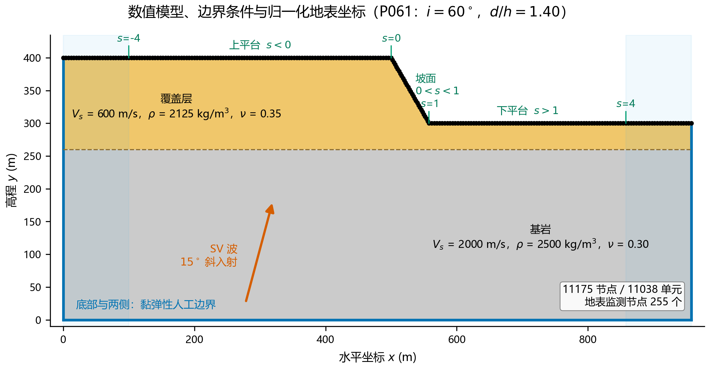

图1 数值模型、材料分区、人工边界及归一化地表坐标

Fig. 1 Numerical model and normalized surface coordinate

在上述参数水平上进行$4\times4\times4$全因子组合，共形成64个成层工况P001—P064，用于参数规律分析、代理训练和五折验证；另设置4个同坡角均质坡H001—H004作为基线。V001—V004分别改变网格、尾段时长、侧向净空和基底深度，用于核对关键计算设置；3组X比较采用Abaqus与SPECFEM2D计算H004、P061及P061加密谱元模型，用于检查代表工况PGA空间分布的一致性。V组和X组不进入参数统计或代理训练。

近场波动分析通常需要在有限计算域的截断边界处设置人工边界，以吸收向外传播的散射波。本文在模型侧边和底边设置黏弹性人工边界[32]，并将总波场分解为自由场与散射场。根据边界节点在自由场中的位移、速度和应力，地震动可转换为施加于人工边界的等效节点力[33]：

$$
\mathbf F_l=\mathbf K_l\mathbf u_l^{\mathrm{ff}}+\mathbf C_l\dot{\mathbf u}_l^{\mathrm{ff}}+\boldsymbol\sigma_l^{\mathrm{ff}}\mathbf n_l A_l \tag{1}
$$

式中：$\mathbf K_l$和$\mathbf C_l$分别为边界节点的刚度矩阵和阻尼矩阵；$\mathbf u_l^{\mathrm{ff}}$、$\dot{\mathbf u}_l^{\mathrm{ff}}$和$\boldsymbol\sigma_l^{\mathrm{ff}}$分别为自由场位移、速度和应力；$\mathbf n_l$和$A_l$分别为外法向和节点代表长度。三条截断边界均采用与相应工况材料剖面一致的左侧上平台一维自由场，并根据各节点的真实坐标计算等效荷载。上述自由场用于计算边界等效荷载，并直接参与有限元模型求解。

模型主体采用CPE4R单元，覆盖层基准单元尺寸为4 m，基岩深部逐级放宽。最软覆盖层在10 Hz时的最短剪切波长为60 m，标准网格约包含15个单元/波长。输入采用峰值0.1g的宽频多正弦信号G1b，有效持时为8.191 s，随后附加6 s尾段；固定时间步长为0.001 s，分析频带取0.5～10 Hz。G1b在该频带内的谱幅有效性结合复频响提取在3.1节说明。地表响应首先在有限元原生节点处输出，随后确定性插值至161个公共$s$坐标，用于不同坡角和参数组合之间的逐位置比较。

### 2.2 数值结果校核

以参数域角点工况P061（$i=60^\circ$、$d/h=1.40$、$r_v=0.30$）为基准，设置4个单因素对比工况：V001将标准分级网格加密为全局1 m均匀网格，V002将尾段由6 s延长至12 s，V003将左右侧向净空由$1h$扩大至$2h$，V004将坡脚以下基底由$3h$加深至$6h$。除指定变量外，其余建模、输入和后处理设置保持一致，对比结果列于表1。

表1 P061数值设置敏感性结果

Table 1 Numerical-setting sensitivity results for P061

| 工况 | 坡顶主峰频率误差/Hz | 坡面中部峰值变化/% | 全场$\ln|G_h|$ RMSE | 加权复场误差 | 圆周相位RMSE/(°) |
| :--: | :-----------------: | :----------------: | :-------------------: | :----------: | :---------------: |
| V001 |         0.0         |       +0.572       |        0.0227        |    0.0510    |       2.958       |
| V002 |         0.0         |       +0.001       |        0.0001        |    0.0001    |       0.006       |
| V003 |         0.1         |       +1.508       |        0.1824        |    0.2605    |      10.792      |
| V004 |         0.0         |       +0.891       |        0.0324        |    0.0490    |       2.408       |

注：坡顶主峰频率误差和坡面中部峰值变化分别以0.2 Hz和5%为参考；V003的复场与相位指标扣除了水平坐标平移产生的0.0129 s理论传播时差，峰频和峰值指标未作修正。

表1显示，4个扰动工况的坡顶主峰频率误差均不超过0.1 Hz，坡面中部$s=0.5$处的峰值变化不超过1.51%；其中网格加密和尾段延长后的结果与标准工况最为接近。计算域变化对完整复场和局部极值的影响相对较大：V003的加权复场误差为0.2605，圆周相位RMSE为10.792°，差异主要集中于远平台；V004的坡顶局部峰值由2.015降至1.868，变化约7.3%。因此，这组对比仅说明标准设置下坡顶峰频和坡面中部峰值等代表性指标较为稳定，不能据此认为完整频率—空间复场已经收敛，也不能替代其余参数组合的计算域检查。

另采用SPECFEM2D[34]计算60°均质坡H004和同坡角软厚成层坡P061，输入统一采用4 Hz Ricker脉冲。图2给出了Abaqus与SPECFEM2D计算的地表水平、竖向PGA空间曲线，归一化均方根误差（NRMSE）和峰位差见表2。

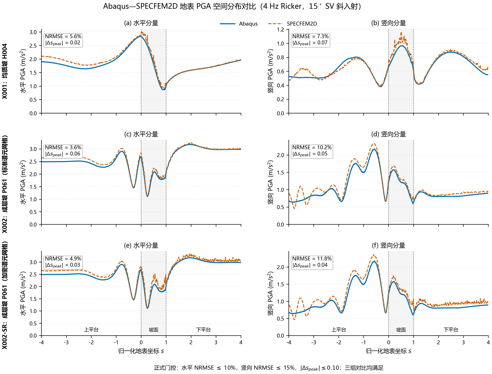

图2 Abaqus与SPECFEM2D地表PGA对比

Fig. 2 Cross-software comparison of surface PGA

表2 跨软件比较结果

Table 2 Cross-software comparison

|       比较       | 水平NRMSE | 竖向NRMSE | 水平/竖向峰位差 |
| :--------------: | :-------: | :-------: | :-------------: |
|   H004标准网格   |   5.63%   |   7.27%   |    0.02/0.07    |
|   P061标准网格   |   3.62%   |  10.17%  |    0.06/0.05    |
| P061加密谱元网格 |   4.85%   |  11.75%  |    0.03/0.04    |

由图2可见，两种方法得到的PGA沿地表变化趋势及主要峰位基本一致。表2显示，3组水平NRMSE均低于10%，竖向NRMSE均低于15%，水平和竖向峰位差均不超过0.10。P061采用加密谱元网格后与Abaqus的差异未进一步减小，说明剩余偏差还可能与时间推进、阻尼和吸收边界的实现方式有关。上述比较仅表明H004和P061在Ricker波有效频带内的PGA主要分布特征基本一致，尚未覆盖其余参数组合和完整复频响。

## 3 复频响函数与参数影响规律

### 3.1 复频响定义与总体特征

为了同时描述地表响应的幅值和相位，将宽频输入与输出进行傅里叶变换，并以左侧上平台一维自由场作为全地表统一参考。该参考只用于二维结果的后处理归一化，不改变有限元模型求解。地表水平复频响函数定义为

$$
G_h(f,s) = \frac{\hat{a}_h^{\mathrm{2D}}(f,s)}{\hat{a}_{h,\mathrm{left}}^{\mathrm{1D}}(f)} \tag{2}
$$

$$
A_h = |G_h| \tag{3}
$$

$$
\Phi_h = \mathrm{unwrap}_f [\arg G_h] \tag{4}
$$

式中：$\hat{a}_h^{\mathrm{2D}}$和$\hat{a}_{h,\mathrm{left}}^{\mathrm{1D}}$分别为二维地表水平加速度复谱和左侧一维自由场复谱；$A_h$和$\Phi_h$分别为复频响幅值和沿频率展开的相位。群时延按$\tau_g = -(2\pi)^{-1}\partial\Phi_h/\partial f$计算。有效频点要求参考谱幅不低于候选频带峰值的5%，并将结果统一到96个频点和161个地表点。图3给出了从输入时程、复谱到$G_h$的提取过程。

G1b在0.5～10 Hz内的归一化谱幅中位数为0.921，5%分位数为0.533，在分析频带内未出现连续的近零谱谷。因此，该频带可用于复数相除及相位分析。计算时先检查频点有效性，再进行复数相除、相位展开和群时延求导，以减小分母弱谱点对结果的影响。

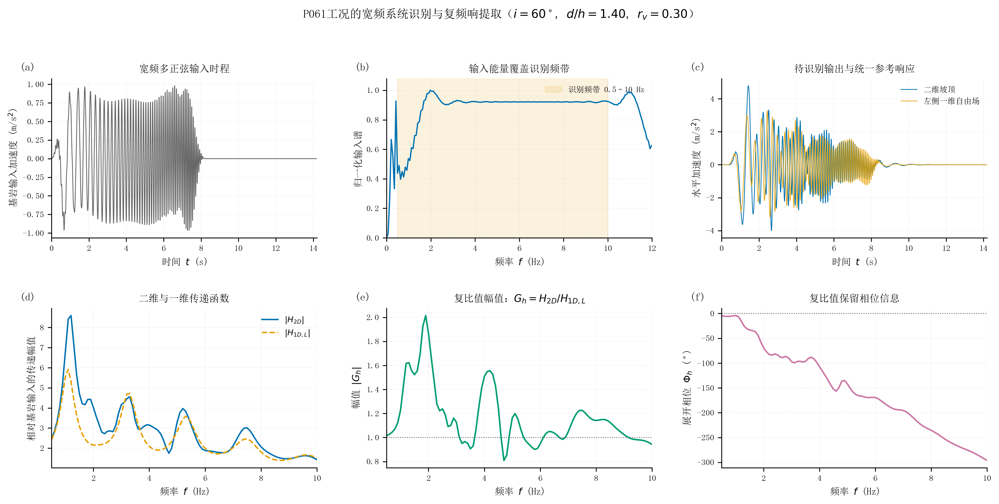

图3 P061宽频系统识别与复频响提取

Fig. 3 Broadband identification of the complex FRF

从图3可以看出，P061坡顶二维响应和左侧一维自由场相对基岩输入的传递函数峰值分别位于1.2 Hz和1.1 Hz，而二者逐频相除后，$G_h$在1.9 Hz达到峰值2.015。三个峰值对应的频率并不相同，说明二维地形响应并非在一维场地放大基础上乘以常数。

若直接用二维与一维时程峰值4.796和3.275 m/s²相除，所得比值仅为1.464，明显小于复频响峰值2.015。时程峰值由不同频率分量在不同时刻叠加形成，因而不能代替相同频点上的复数谱比。复频响保留的幅值和相位关系是后续分析与时程重构的基础。

为了比较不同地表区段和频带的响应，将上平台A段、坡面B段和下平台C段分别定义为$-4\leq s\leq0$、$0<s\leq1$和$1<s\leq4$，低、中、高频分别取$[0.5,3)$、$[3,6)$和$[6,10]$ Hz。主要复频响指标及其含义列于表3。

表3 复频响主要指标

Table 3 Main complex-FRF descriptors

|      指标      |         含义         |        限制        |
| :------------: | :------------------: | :----------------: |
|    $A_h$    |       相对幅值       |    不含到时信息    |
|   $\Phi_h$   |       展开相位       |  不跨无效频带拼接  |
|   $\tau_g$   |     相位频率导数     |    谱谷附近慎用    |
|    全场峰值    | 最大幅值及峰频、峰位 | 10 Hz峰标作上界峰 |
| 分区、分带统计 |  A/B/C段与低中高频  | 网格点不作独立样本 |

图5给出了均质坡H004和成层坡P061的幅值、相位与群时延场。H004的全场峰值为1.638，位于3.2 Hz、$s=0$；P061的峰值增至4.012，位于4.0 Hz、$s=3.2$，群时延1%～99%宽度由0.174 s增至0.853 s。与均质坡相比，成层坡形成了更多连续的幅值条带和更大的相位变化范围，说明覆盖层传播与地形散射共同改变了频率—空间响应。

图6比较了1、3、5、7和9 Hz下的地表空间分布。H004在各频率下的空间最大值均位于坡顶，控制位置较为稳定；P061的控制位置依次位于$s=0$、$-3.40$、1.65、$-0.65$和1.20，在上平台、坡顶邻域和下平台之间发生换位。与此同时，P061的全地表相位跨度由1 Hz时的41.4°增至9 Hz时的575.0°，明显大于H004的24.3°～161.2°。

图7给出了P061不同地表位置的复频响谱。上平台、坡顶、坡面中部、坡脚和下平台的局部峰频分别约为4.5、1.9、6.5、$\geq 10$和3.8 Hz，其中下平台$s=2$处的峰值2.310比坡顶高14.6%。坡脚在10 Hz处尚未出现峰后回落，因此该值按频带上界峰处理。下平台最负群时延出现在1.1 Hz，接近覆盖层一维基频，而幅值峰位于3.8 Hz，表明一维特征频率与二维幅值峰频并不完全对应。

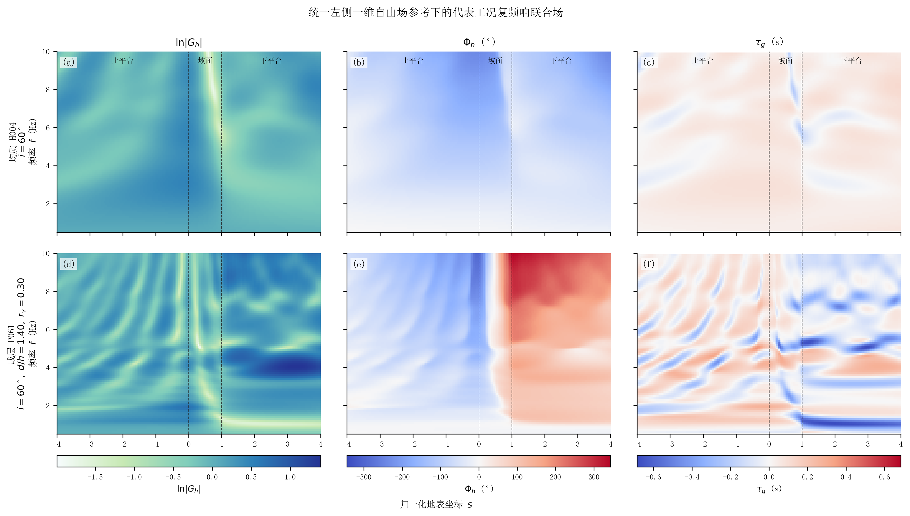

图5 H004与P061的幅值、相位和群时延场

Fig. 5 Joint complex-FRF fields of H004 and P061

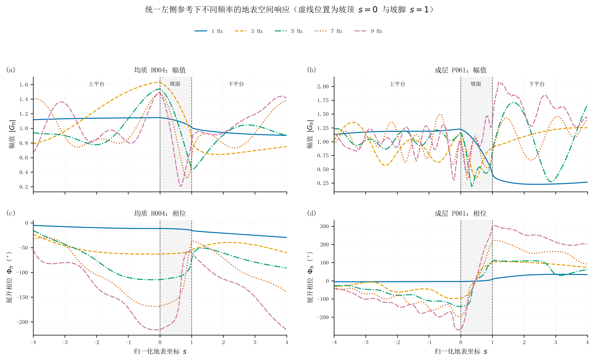

图6 H004与P061固定频率地表响应

Fig. 6 Surface responses at selected frequencies

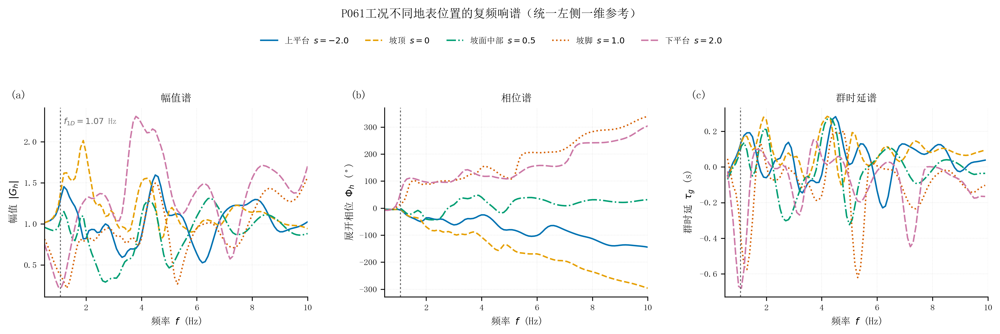

图7 P061代表位置复频响谱

Fig. 7 Complex-FRF spectra at selected locations

### 3.2 参数作用与覆盖层修正

图8给出了均质坡以及固定$d/h=1.00$、$r_v=0.45$时成层坡的坡角效应。均质坡峰值随坡角增大由1.269升至1.638，但主峰频率依次为2.2、9.9、8.1和3.2 Hz，控制位置也在坡顶邻域与下平台之间变化。加入覆盖层后，4种坡角的峰值分别为1.734、1.898、1.669和1.651，30°坡达到最大值。由此可见，坡角增大使均质坡峰值总体升高，而成层坡的变化还受到覆盖层干涉和主峰换位影响。

图9比较了固定$i=45^\circ$、$r_v=0.30$时的覆盖层厚度效应。随着$d/h$由0.20增至1.40，峰值依次为1.861、2.148、1.958和3.904，主峰频率依次为9.3、4.3、8.8和4.0 Hz，均呈非单调变化。在全部64个成层工况中，$d/h=0.20$和0.60的32个工况均由上平台控制，$d/h=1.00$时有3个工况转至坡面，$d/h=1.40$时有15/16个工况由下平台控制。最厚层的峰值增大主要来自下平台形成新的控制峰，16条厚度序列中有9条表现为非单调变化。

图10给出了固定$i=45^\circ$、$d/h=0.60$时的波速比效应。4个工况的控制位置均在坡顶，峰值随$r_v$增大总体由2.148降至1.572。对全部参数组合统计，16条波速比序列中有13条峰值单调降低，另3条出现局部反转；相应主峰频率仅有5条单调升高。波速比提高总体上削弱软覆盖层强峰，但主峰频率仍随坡角和厚度组合发生变化。

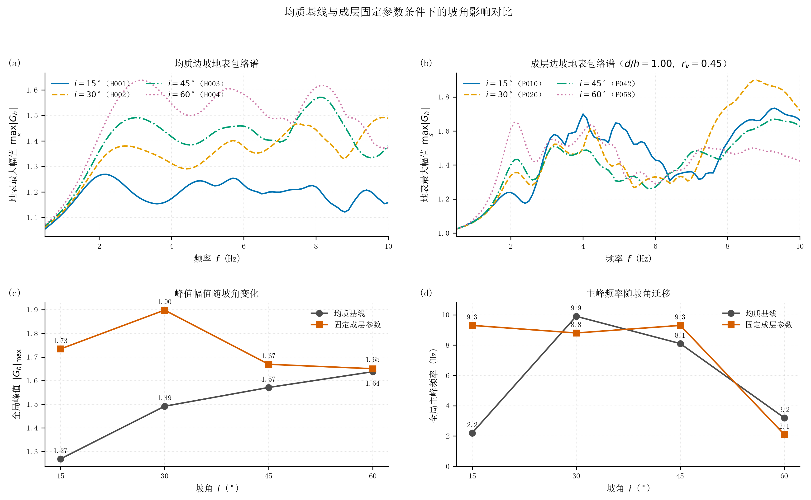

图8 均质坡及$d/h = 1.00$、$r_v = 0.45$成层坡的坡角效应

Fig. 8 Effect of slope angle

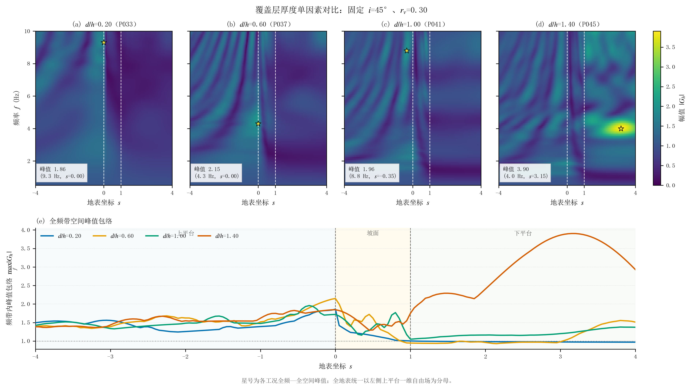

图9 $i = 45^\circ$、$r_v = 0.30$时的厚度比效应

Fig. 9 Effect of cover-layer thickness ratio

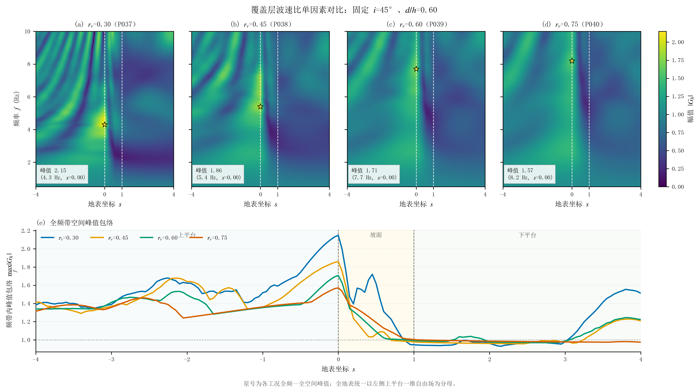

图10 $i = 45^\circ$、$d/h = 0.60$时的波速比效应

Fig. 10 Effect of velocity ratio

图11和表4进一步给出了64个成层工况在不同参数水平下的峰值幅值和主峰频率分布。

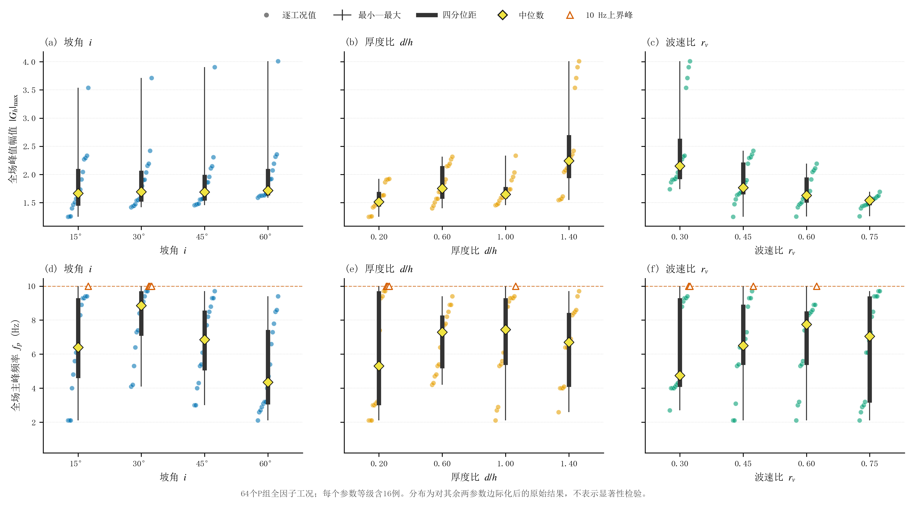

图11 三参数水平下的峰值幅值与峰频分布

Fig. 11 Marginal effects of the three parameters

表4 三参数边际中位数

Table 4 Marginal medians of peak response

|                     参数水平                     |        峰值幅值中位数        |       峰频中位数/Hz       |
| :-----------------------------------------------: | :---------------------------: | :-----------------------: |
| $i = 15^\circ / 30^\circ / 45^\circ / 60^\circ$ | 1.665 / 1.694 / 1.688 / 1.718 | 6.40 / 8.85 / 6.85 / 4.35 |
|        $d/h = 0.20 / 0.60 / 1.00 / 1.40$        | 1.517 / 1.754 / 1.647 / 2.245 | 5.30 / 7.30 / 7.45 / 6.70 |
|        $r_v = 0.30 / 0.45 / 0.60 / 0.75$        | 2.152 / 1.767 / 1.628 / 1.541 | 4.75 / 6.50 / 7.75 / 7.05 |

由图11和表4可见，4种坡角下的峰值中位数仅相差3.15%，说明坡角对一般工况峰值的影响相对较小，但各坡角组的最大值仍由3.539增至4.012。厚度比增大时，峰值中位数呈先升高、后降低、再升高的变化；波速比由0.30增至0.75时，峰值中位数由2.152降至1.541，降低28.39%，其变化方向最为稳定。各参数水平下主峰频率的分布范围均有较大重叠，表明峰频还受到参数组合和候选峰换位的共同影响。

图12显示，64个工况的峰值范围为1.249～4.012。峰值超过3.0的P013、P029、P045和P061均满足$d/h=1.40$、$r_v=0.30$，其主峰集中在4.0～4.1 Hz，峰位位于下平台$s=3.15\sim 3.25$。在这一软厚组合中，坡角增大使峰值由3.539升至4.012；当厚度减小或波速比提高后，控制峰则可能返回坡顶或转至其他频带。

图13给出了不同空间区段和频带内的参数效应。厚度对坡面低、中、高频响应的最大跨度分别为1.14、1.30和1.74倍，对下平台则为1.33、1.96和2.02倍，而上平台各频带均不超过1.10倍。最厚覆盖层主要增强下平台的中、高频响应，低频区域中位数并未同步增大。坡角和波速比在不同频带也可表现出相反的变化方向，因此仅采用全场最大值难以反映各地表区段的典型响应。代表性参数序列列于表5。

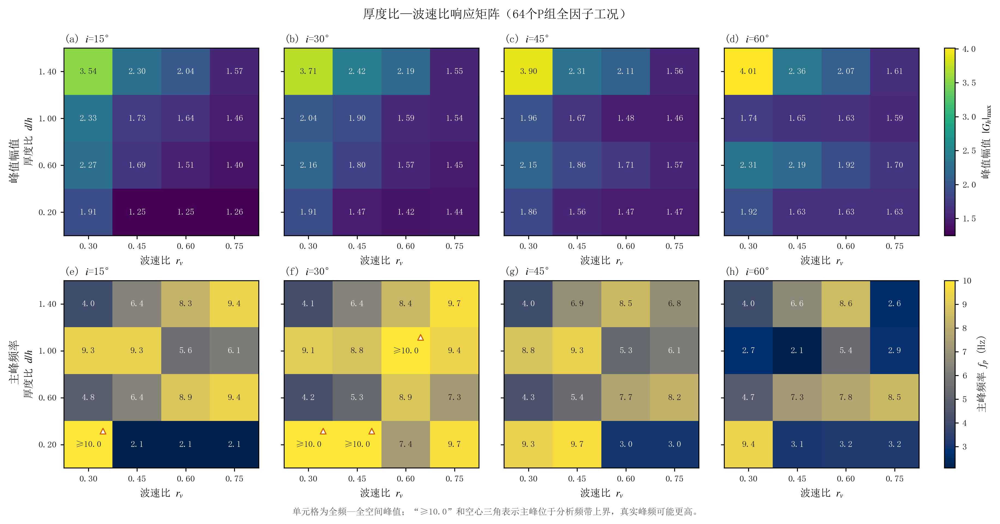

图12 四种坡角的厚度比—波速比响应矩阵

Fig. 12 Thickness–velocity response matrices

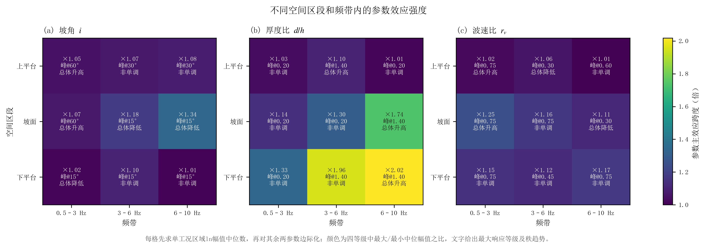

图13 分空间区段、分频带的参数效应

Fig. 13 Parameter effects by segment and frequency band

表5 代表性参数序列

Table 5 Representative parameter sequences

|        比较        |          峰值幅值          |    主峰频率/Hz    |     主要特征     |
| :----------------: | :------------------------: | :----------------: | :--------------: |
| 均质坡角15°→60° |        1.269→1.638        | 2.2→9.9→8.1→3.2 |     峰位换位     |
|    成层坡角序列    | 1.734→1.898→1.669→1.651 | 9.3→8.8→9.3→2.1 |      非单调      |
|     厚度比序列     | 1.861→2.148→1.958→3.904 | 9.3→4.3→8.8→4.0 | 最厚层转至下平台 |
|     波速比序列     |        2.148→1.572        |      4.3→8.2      |   峰值总体降低   |

图14给出了三参数对峰值幅值和主峰频率的相对贡献。峰值幅值差异主要来自$r_v$、$d/h$及二者交互，贡献率分别为39.65%、34.21%和21.72%；主峰频率的二阶交互贡献合计为66.19%。例如，固定$i=15^\circ$、$r_v=0.75$时，主峰频率随厚度变化依次为2.1、9.4、6.1和9.4 Hz，最大跨度为7.3 Hz，说明主峰变化主要表现为不同候选峰的强弱换位，而非单一峰连续移动。

主峰频率由离散频率点中的最大值确定，对相邻候选峰的强弱交换较为敏感。P001、P017、P018和P027的最大值均位于10 Hz，本文将其记为“$\geq 10$ Hz”边界峰，不作频带外推。上述贡献率用于描述当前全因子参数域内的相对变异，不表示随机样本意义上的显著性。

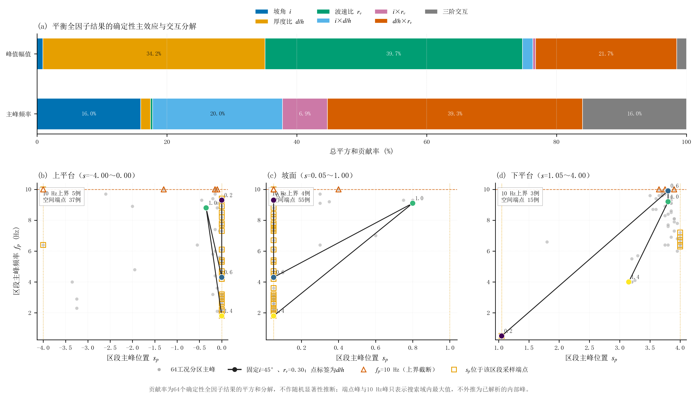

图14 参数交互贡献与分区主峰迁移

Fig. 14 Parameter interactions and peak migration

以同坡角均质坡为基准，覆盖层复数修正及特征频率定义为

$$
C_G = \frac{G_h^{\mathrm{layer}}}{G_h^{\mathrm{homo}}} = C_A e^{\mathrm{i}\Delta_\Phi} \tag{5}
$$

$$
C_A = |C_G| \tag{6}
$$

$$
\Delta_\Phi = \arg C_G \tag{7}
$$

$$
\Delta_A = \ln C_A \tag{8}
$$

$$
\Delta_\tau = -\frac{1}{2\pi}\frac{\partial \Delta_\Phi}{\partial f} \tag{9}
$$

$$
\chi = \frac{r_v}{4(d/h)} \tag{10}
$$

图15给出了覆盖层复数修正与特征频率$\chi$的关系。64个工况中，$\chi$与中位绝对相位修正和中位绝对群时延修正的Spearman相关系数分别为−0.940和−0.922，而与净幅值修正幅度$|\mathrm{median}(\Delta_A)|$的相关系数仅为−0.300。相位修正与群时延修正的跨工况排序较为一致，二者的Spearman相关系数为0.983。由此可见，$\chi$对相位和时延修正具有较好的排序作用，但对幅值净增强或净削弱的表征较弱。

以参数域中部工况P039（$i=45^\circ$、$d/h=0.60$、$r_v=0.60$）为例，最强局部负修正$\Delta_A = -1.627$，对应幅值比约0.197，而其全场中位修正仅为−0.0783。64个工况中有53个的全场中位$\Delta_A$为负、11个为正，说明多数工况的典型频率—空间网格表现为轻微净削弱，但局部仍可产生明显增强或削弱。相同$\chi$可由不同的厚度比和波速比组合得到，且式（3）未包含坡角和阻抗差，因此具体幅值、频带和位置仍需由完整复频响场确定。

综合图8～图15可知，坡角主要改变均质地形的放大基线并影响极端响应，覆盖层厚度与强响应向下平台转移有关，波速比则主要控制软厚覆盖层强峰的幅值。波速比提高时多数工况的峰值降低，而坡角和厚度对主峰频率的影响随参数组合而变化。因此，成层坡地震响应应同时结合频带和地表区段进行评价。

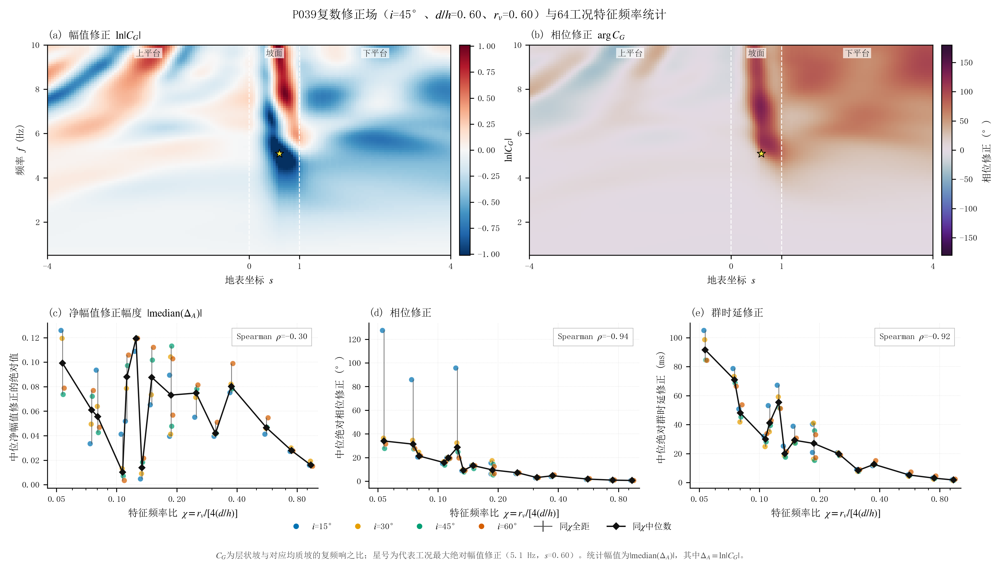

图15 覆盖层复数修正及其与特征频率的关系

Fig. 15 Complex correction versus characteristic frequency

## 4 机器学习代理模型的构建与验证

### 4.1 样本与代理方法

代理模型以坡角、厚度比和波速比$[i, d/h, r_v]$为输入，以96×161复频响场的实部和虚部为输出。64个P组工况用于五折选模和最终拟合，12个B组中间参数工况用于检验训练网格之间的插值，10个C组组合用于真实地震波闭环，均质坡H组不进入代理，各样本池的用途见表6。

训练集和验证集按完整物理工况划分，同一工况的频率点和空间点不拆分到不同数据集。每一折的缺失值处理、标准化和本征正交分解（POD）均只利用该折训练工况拟合；完成模型选择后，再用全部P组工况拟合最终模型，B组和C组始终不参与训练和调参。

表6 代理样本池

Table 6 Surrogate sample pools

| 样本池 | 数量 |        用途        |
| :----: | :--: | :----------------: |
|   P   |  64  | 五折选模与最终拟合 |
|   B   |  12  | 训练外域内组合评价 |
|   C   |  10  |     真实波闭环     |
|   H   |  4  | 均质参照，不进代理 |

复频响采用实部—虚部表示，以避免相位主值在$\pm\pi$处产生近$2\pi$的数值跳变。标准化后的输出矩阵先经POD压缩，再分别采用最近邻、岭回归和高斯过程回归（GPR）预测模态系数。图16给出了参数样本分布、POD累计能量及前三阶模态，主要模型配置列于表7。

由图16可见，POD取12、24和36阶时的累计能量分别为86.139%、97.087%和99.5066%。本文以12阶作为主模型，并用24阶和36阶检验截断敏感性；B组和C组均采用固定的12阶模型。POD模态反映频率和空间响应随参数共同变化的统计结构，不与单一物理振型逐一对应。

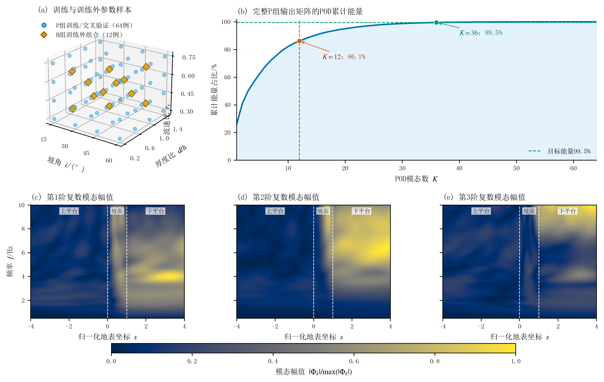

图16 样本空间、POD累计能量与前三阶模态

Fig. 16 Sample space and POD modes

表7 代理模型配置

Table 7 Surrogate configuration

|   项目   |              配置              |
| :-------: | :-----------------------------: |
| 输入/输出 |      3参数；30 912维实向量      |
| 外层验证 | 5折整工况划分，固定种子20260801 |
| POD主模型 |        12阶，能量86.139%        |
| POD敏感性 |    24阶97.087%；36阶99.5066%    |
| 候选回归 |   最近邻、POD-Ridge、POD-GPR   |
|    GPR    | 各向异性Matérn-5/2核+白噪声核 |

为了同时评价幅值与相位预测误差，定义共同有效掩码$M$内、按输入频率能量$w(f)$加权的复数相对误差为

$$
E_{\mathrm{complex},w} = \left[ \frac{\sum_{f,s} M w |G_h^{\mathrm{pred}} - G_h^{\mathrm{true}}|^2}{\sum_{f,s} M w |G_h^{\mathrm{true}}|^2} \right]^{1/2}
$$

式中：$G_h^{\mathrm{pred}}$和$G_h^{\mathrm{true}}$分别为代理预测和直接有限元真值；$M$为二者共同有效的频率—空间掩码；$w(f)$为输入能量归一化权重。各项误差先按完整工况计算，再统计中位数P50和90%分位数P90。最近邻、POD-Ridge和POD-GPR分别代表局部复制、线性系数映射和非线性系数映射，模型选择以全场加权复数误差为主，并同时检查峰值、峰频和峰位。

### 4.2 交叉验证与训练外组合

图17和表8给出了3种候选模型的五折验证结果。POD-GPR的加权复数误差中位数为0.2708，低于最近邻的0.3895和POD-Ridge的0.4271，较最近邻降低30.5%；其相位RMSE中位数也由最近邻的20.60°降至13.22°。因此，后续预测采用POD-GPR模型。

不同指标下3种模型的排序并不完全一致。POD-GPR的峰频误差中位数为2.25 Hz，高于最近邻的1.15 Hz，对数幅值误差P90也略高于最近邻。最近邻能够保留已有工况中的局部尖峰，而GPR对整体复数场的恢复较好，但可能改变相邻候选峰的高低次序。POD阶数由12阶增至24阶后，加权复数误差中位数由0.271降至0.247，P90由0.490降至0.489；继续增至36阶时二者仍为0.247和0.490，说明24阶以后误差基本不再降低。

按参数分组统计，$r_v=0.30$、0.45、0.60和0.75时的五折复数误差中位数分别为0.409、0.326、0.191和0.171；$d/h$由0.20增至1.40时，中位误差由0.186增至0.333。代理误差随覆盖层变软、变厚总体增大，与第3章中窄带峰谷和主峰换位较明显的参数区相对应。POD-GPR适用于当前参数域内的近似预测，软厚覆盖层工况仍需重点检验；其后验方差尚未校准，不作为单个工况的置信区间。

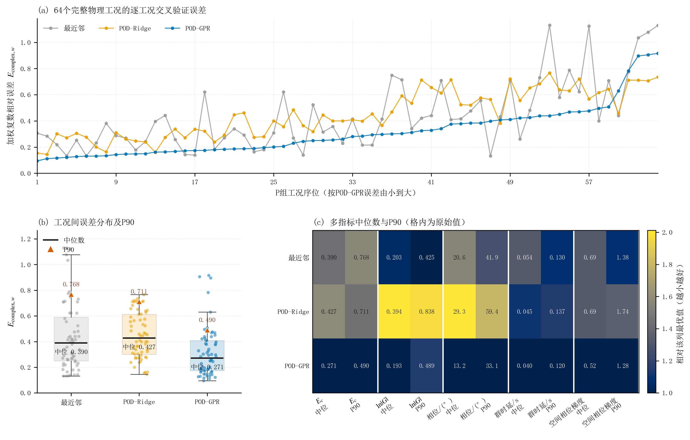

图17 候选模型五折交叉验证误差

Fig. 17 Five-fold cross-validation errors

表8 候选模型误差（中位数/P90）

Table 8 Candidate-model errors (median/P90)

|   模型   |  加权复数误差  |  对数幅值RMSE  | 相位RMSE/(°) |    峰值误差    | 峰频误差/Hz |
| :-------: | :-------------: | :-------------: | :-----------: | :-------------: | :---------: |
|  最近邻  | 0.3895 / 0.7675 | 0.2032 / 0.4248 | 20.60 / 41.94 | 6.85% / 31.96% | 1.15 / 5.14 |
| POD-Ridge | 0.4271 / 0.7114 | 0.3939 / 0.8385 | 29.26 / 59.40 | 17.68% / 40.40% | 3.10 / 7.04 |
|  POD-GPR  | 0.2708 / 0.4903 | 0.1928 / 0.4886 | 13.22 / 33.05 | 11.40% / 27.87% | 2.25 / 6.47 |

图18和表9给出了POD-GPR误差随频带和地表区段的分布。低、中、高频的对数幅值误差中位数分别为0.0659、0.1716和0.2556，误差随频率升高而增大；上平台、坡面和下平台的复数误差中位数分别为0.1801、0.3325和0.3006，较大误差主要分布在坡面和下平台。

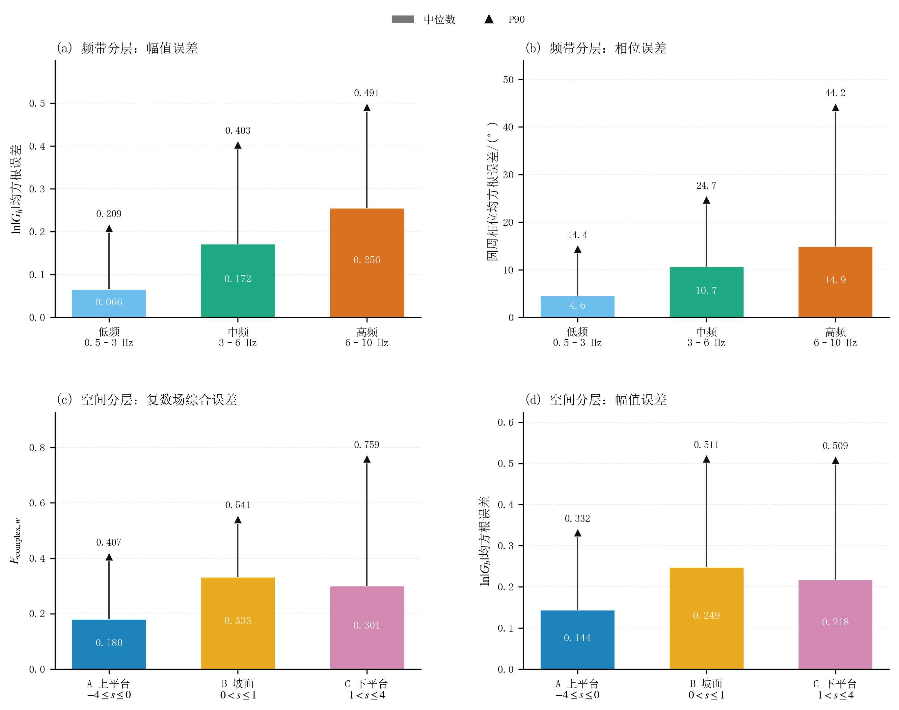

图18 代理误差的频带与空间分层

Fig. 18 Errors by frequency band and surface segment

表9 POD-GPR分层误差（中位数/P90）

Table 9 Stratified POD-GPR errors

|               分层               |  对数幅值RMSE  | 相位RMSE/(°) |    复数误差    |
| :-------------------------------: | :-------------: | :-----------: | :-------------: |
|     $[0.5, 3)\ \mathrm{Hz}$     | 0.0659 / 0.2087 | 4.61 / 14.40 |       —       |
|      $[3, 6)\ \mathrm{Hz}$      | 0.1716 / 0.4032 | 10.72 / 24.73 |       —       |
|     $[6, 10]\ \mathrm{Hz}$     | 0.2556 / 0.4911 | 14.88 / 44.20 |       —       |
| 上平台A段（$-4 \leq s \leq 0$） | 0.1439 / 0.3320 |      —      | 0.1801 / 0.4066 |
|    坡面B段（$0 < s \leq 1$）    | 0.2486 / 0.5115 |      —      | 0.3325 / 0.5412 |
|   下平台C段（$1 < s \leq 4$）   | 0.2178 / 0.5088 |      —      | 0.3006 / 0.7594 |

图19和表10给出了12个B组中间参数工况的预测结果。B组复数误差中位数为0.2641，P90为0.6543，其中9/12个工况未超过P组五折误差P90；B001、B011和B004超过该值，B004的误差最大，为0.7358。按波速比分组，$r_v=0.375$、0.525和0.675时的误差中位数分别为0.5966、0.2641和0.1394，表明低波速比组合总体上更难预测。

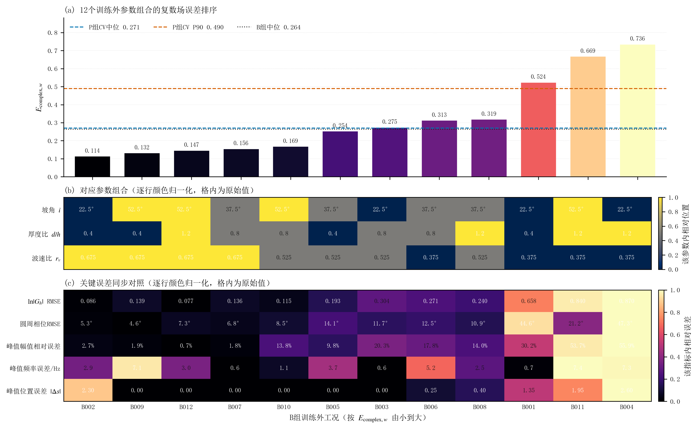

图19 训练外组合误差排序与参数对照

Fig. 19 Errors of training-excluded combinations

表10 训练外组合预测误差

Table 10 Prediction errors for B cases

| 工况 | $i$ | $d/h$ | $r_v$ | 复数误差 | 峰值误差 | 峰频误差/Hz | 峰位误差 |
| :--: | :----: | :-----: | :-----: | :------: | :------: | :---------: | :------: |
| B001 | 22.5° |  0.40  |  0.375  |  0.5245  |  30.15%  |     0.7     |   1.35   |
| B002 | 22.5° |  0.40  |  0.675  |  0.1143  |  2.68%  |     2.9     |   2.30   |
| B003 | 22.5° |  0.80  |  0.525  |  0.2745  |  20.34%  |     0.6     |   0.00   |
| B004 | 22.5° |  1.20  |  0.375  |  0.7358  |  55.89%  |     7.3     |   2.60   |
| B005 | 37.5° |  0.40  |  0.525  |  0.2536  |  9.77%  |     3.7     |   0.00   |
| B006 | 37.5° |  0.80  |  0.375  |  0.3133  |  17.82%  |     5.2     |   0.25   |
| B007 | 37.5° |  0.80  |  0.675  |  0.1557  |  1.82%  |     0.6     |   0.00   |
| B008 | 37.5° |  1.20  |  0.525  |  0.3193  |  13.98%  |     2.5     |   0.40   |
| B009 | 52.5° |  0.40  |  0.675  |  0.1322  |  1.90%  |     7.1     |   0.00   |
| B010 | 52.5° |  0.80  |  0.525  |  0.1687  |  13.82%  |     1.1     |   0.00   |
| B011 | 52.5° |  1.20  |  0.375  |  0.6687  |  53.73%  |     7.4     |   1.95   |
| B012 | 52.5° |  1.20  |  0.675  |  0.1466  |  0.68%  |     3.0     |   0.00   |

图20比较了B002、B003和B004的真值、预测值及残差场。B004的较大误差主要集中在高频下平台，其C段复数误差达到0.947；B002的整体复数误差仅为0.1143，但峰位误差达到2.30，说明整体场误差较小并不保证全局峰位同时准确。B组参数仍位于P组训练范围内，以上结果反映训练参数网格之间的域内插值能力，不代表参数域外的外推精度。

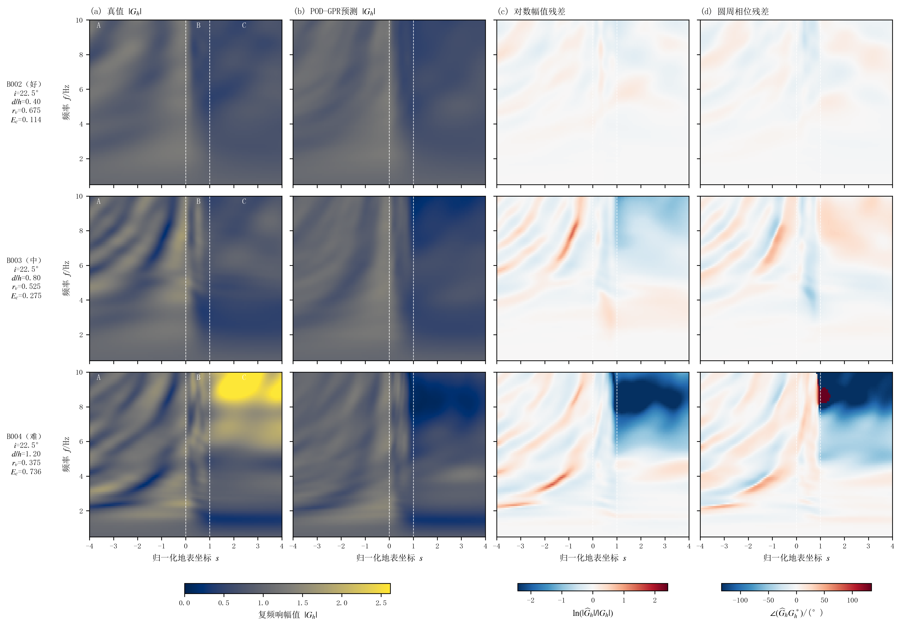

图20 B002、B003和B004的真值、预测与残差场

Fig. 20 Truth, prediction and residual fields for B cases

### 4.3 真实地震波闭环

为了检验代理复频响重构真实地震动的能力，选取4个坡地体系和El Centro、Kobe、Chi-Chi 3条地震记录，组成10个体系—记录闭环工况。每个工况均另行进行二维直接有限元计算作为真值，不参与代理训练和调参。预测时将代理复频响与左侧一维自由场复谱逐频相乘，再经逆傅里叶变换得到地表时程。

图21给出了3条记录的一维自由场时程及能量谱。各记录均缩放至0.1g，El Centro、Kobe和Chi-Chi在6 Hz以下的能量占比分别为93.4%、90.1%和80.6%，本组闭环主要反映低频能量占优条件下的重构效果。由于时程叠加同时取决于幅值和相位，重构采用完整复数频响；预测与直接有限元结果均取0.5～10 Hz带限。

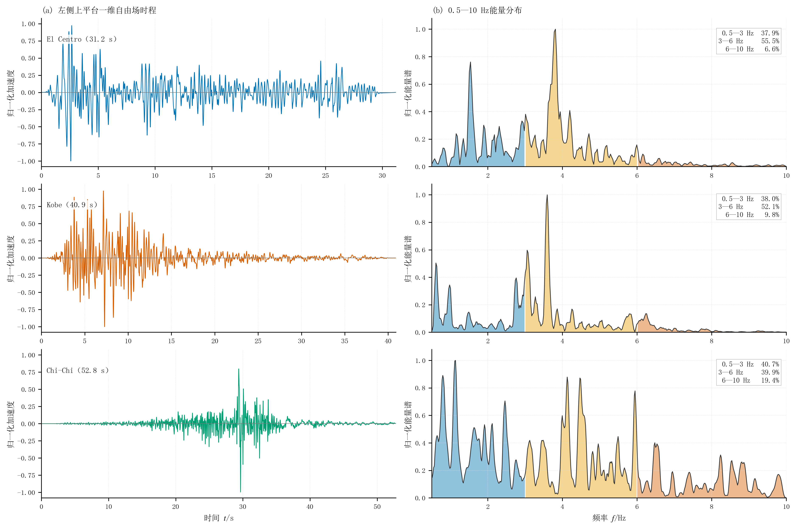

图21 El Centro、Kobe和Chi-Chi记录的一维自由场时程与能量谱

Fig. 21 Free-field time histories and spectra of the El Centro, Kobe and Chi-Chi records

逐位置时程误差定义为

$$
E_t(s) = \frac{\| a_h^{\mathrm{pred}}(t,s) - a_h^{\mathrm{FE}}(t,s) \|_2}{\| a_h^{\mathrm{FE}}(t,s) \|_2} \tag{11}
$$

式中：$a_h^{\mathrm{pred}}$ 为代理重构的水平加速度，$a_h^{\mathrm{FE}}$ 为直接有限元（FE）计算结果。反应谱误差采用5%阻尼、0.1～2.0 s的40个对数间隔周期，并在每个位置取周期中位数。表11列出了各工况161个地表位置的中位指标及10个工况的总体中位数。

由表11可见，10个工况的总体中位时程NRMSE为9.75%，相关系数为0.9955，PGA误差为2.49%，峰值时刻误差为0.0015 s，5%阻尼反应谱误差为2.01%。C001、C002、C008和C010的NRMSE超过10%，其余6个工况低于10%；10个工况的相关系数均高于0.95，PGA误差均低于10%，峰时误差均低于0.02 s。NRMSE反映全持时累计误差，而PGA和峰时主要反映极值特征，因此二者的变化并不完全一致。

表11 真实波闭环指标（每例取161个地表位置的中位数）

Table 11 Closed-loop metrics (median over 161 surface locations in each case)

| 工况 |   体系/记录   | 时程NRMSE | 相关系数 | PGA误差 | 峰时误差/s | 5%阻尼反应谱误差 |
| :--: | :------------: | :-------: | :------: | :-----: | :--------: | :--------------: |
| C001 | P007/El Centro |  20.73%  |  0.9789  |  6.09%  |   0.002   |      1.86%      |
| C002 |   P007/Kobe   |  22.47%  |  0.9784  |  3.70%  |   0.005   |      2.43%      |
| C003 | P039/El Centro |   8.11%   |  0.9967  |  1.43%  |   0.001   |      0.65%      |
| C004 |   P039/Kobe   |   9.40%   |  0.9958  |  2.45%  |   0.001   |      0.91%      |
| C005 | P061/El Centro |   9.52%   |  0.9955  |  1.26%  |   0.001   |      2.37%      |
| C006 |   P061/Kobe   |   9.66%   |  0.9957  |  3.76%  |   0.001   |      2.42%      |
| C007 | B007/El Centro |   9.84%   |  0.9955  |  1.80%  |   0.002   |      2.30%      |
| C008 |   B007/Kobe   |  11.56%  |  0.9937  |  4.89%  |   0.002   |      1.83%      |
| C009 |  P039/Chi-Chi  |   8.35%   |  0.9967  |  1.16%  |   0.001   |      0.67%      |
| C010 |  B007/Chi-Chi  |  10.98%  |  0.9940  |  2.53%  |   0.002   |      2.16%      |
| 中位 |       —       |   9.75%   |  0.9955  |  2.49%  |   0.0015   |      2.01%      |

图22比较了低、中、高误差代表工况。C003的NRMSE为8.11%，预测时程与直接有限元结果整体接近；C008的NRMSE为11.56%，误差水平介于C003和C001之间，差异主要分布于坡面和下平台；C001的NRMSE达到20.73%，但PGA误差仅为6.09%、峰时误差为0.002 s，较大误差主要来自次峰和后续波列的累积。由此可见，主要峰值及其发生时刻较为接近时，全持时波形仍可能存在较大差异。

图23汇总了10个工况共1610个地表位置的误差。逐点统计中52.8%的NRMSE超过10%，最大值77.2%出现在C002坡面$s=0.45$；上平台、坡面和下平台的超阈值比例分别为29.8%、77.5%和75.7%，逐点中位数分别为8.8%、18.9%和12.3%。由于每个工况的161个位置中上平台占81点，逐工况中位数更容易受上平台较低误差影响。P061在El Centro和Kobe下的NRMSE分别为9.52%和9.66%，可能与两条记录约九成能量集中在6 Hz以下有关。这说明真实波重构误差还受到输入地震波能量分布的影响，高频能量较丰富的地震动仍需进一步验证。

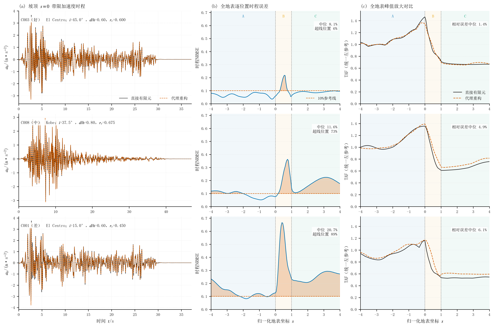

图22 闭环重构低、中、高误差代表工况

Fig. 22 Representative closed-loop cases

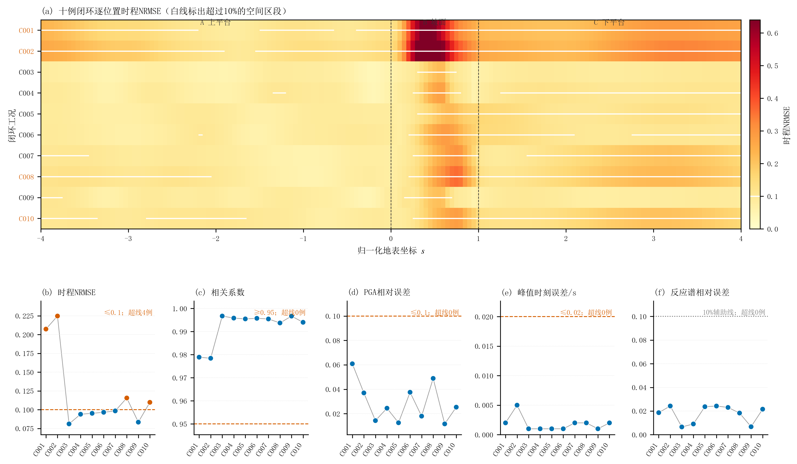

图23 十例闭环的逐位置误差与综合指标

Fig. 23 Position-wise and integrated closed-loop errors

## 5 结 论

本文采用黏弹性人工边界和等效节点力方法，建立了地震波斜入射下的二维线弹性成层坡地模型，并通过关键计算设置复核及Abaqus—SPECFEM2D对比检查代表工况的主要响应。在此基础上，利用宽频复频响识别研究坡角、覆盖层厚度比和波速比对地表地震动的影响，进一步构建POD-GPR代理模型并开展训练外组合评价和真实地震波闭环验证，主要得出以下结论：

1）全地表统一采用左侧一维自由场复谱作为参考，可显著削弱坡脚处与分母切换同步的非物理分界。H004和P061坡脚复数跳变量中位数分别由25.9%降至4.7%和由71.0%降至8.6%。该修正只改变既有二维时程的后处理结果，不改变有限元解；统一后保留的局部梯度仍可能来自几何散射和成层干涉。

2）坡角、覆盖层厚度比和波速比均会改变成层坡地复频响的幅值、控制频带和控制位置。均质坡峰值随坡角增大总体升高，但这一规律在成层坡中不再保持；峰值幅值差异主要受波速比、厚度比及二者交互控制，其贡献率分别为39.65%、34.21%和21.72%。当$d/h=1.40$、$r_v=0.30$时，各坡角均在约4 Hz的下平台形成强响应，坡角主要提高该软厚组合的响应上尾。

3）成层坡地的全场最大响应表现为不同频带和空间位置的候选峰换位。16条厚度序列中有9条峰值呈非单调变化，主峰频率最大跨度为7.3 Hz。特征量$\chi$与中位绝对相位和群时延修正的相关较强，而与净幅值修正幅度的相关较弱。因此，单一特征频率或全场放大系数不足以概括成层坡地响应，工程评价还应同时考虑频带和地表区段。

4）在整工况五折验证和训练外参数组合评价中，POD-GPR的中位复数误差分别为27.1%和26.4%，能够近似恢复当前参数域内的主要复频响结构。误差主要集中在软厚覆盖层、高频、坡面和下平台，且整体场误差较小并不表示主峰频率和峰位同时准确。B组结果仅反映训练参数网格之间的域内插值能力，不宜解释为参数域外的预测精度。

5）真实地震波闭环的总体中位时程NRMSE为9.75%，但仍有4/10个组合超过10%，10个组合共1610个位置样本中有52.8%超过10%，其中坡面和下平台的误差较为集中。代理模型在当前二维线性参数域及本组以6 Hz以下能量占优的输入条件下，可用于带限时程和PGA的辅助预测；对于软厚覆盖层组合的高频与下平台响应、高频能量富集输入以及非线性或三维问题，仍需采用直接数值分析。

## 参考文献：

[1] DAVIS L L, WEST L R. Observed effects of topography on ground motion[J]. Bulletin of the Seismological Society of America, 1973, 63(1): 283-298.

[2] ÇELEBI M. Topographical and geological amplifications determined from strong-motion and aftershock records of the 3 March 1985 Chile earthquake[J]. Bulletin of the Seismological Society of America, 1987, 77(4): 1147-1167.

[3] GELI L, BARD P Y, JULLIEN B. The effect of topography on earthquake ground motion: a review and new results[J]. Bulletin of the Seismological Society of America, 1988, 78(1): 42-63.

[4] 胡聿贤, 孙平善, 章在墉, 等. 场地条件对震害和地震动的影响[J]. 地震工程与工程振动, 1980(0): 34-41.
HU Yu-xian, SUN Ping-shan, ZHANG Zai-yong, et al. Influence of site conditions on earthquake damage and ground motion[J]. Earthquake Engineering and Engineering Vibration, 1980(0): 34-41.

[5] European Committee for Standardization. Eurocode 8: design of structures for earthquake resistance[S]. Brussels: CEN, 2004.

[6] 中华人民共和国住房和城乡建设部. 建筑抗震设计规范: GB 50011—2010（2016年版）[S]. 北京: 中国建筑工业出版社, 2016.
Ministry of Housing and Urban-Rural Development of the People's Republic of China. Code for seismic design of buildings: GB 50011—2010 (2016 edition)[S]. Beijing: China Architecture and Building Press, 2016.

[7] LI H, LIU Y, LIU L, et al. Numerical evaluation of topographic effects on seismic response of single-faced rock slopes[J]. Bulletin of Engineering Geology and the Environment, 2019, 78(3): 1873-1891.

[8] SHEN H, LIU Y, LI H, et al. Numerical evaluation of ground motion amplification of rock slopes under obliquely incident seismic waves[J]. Soil Dynamics and Earthquake Engineering, 2024, 178: 108488.

[9] 赵仕兴, 杨姝姮, 唐元旭, 等. 四川泸定6.8级地震震中区域建筑震害考察与思考[J]. 建筑结构, 2023, 53(7): 1-8.
ZHAO Shi-xing, YANG Shu-heng, TANG Yuan-xu, et al. Investigation and analysis of building damage in the epicentral area of the Luding Ms 6.8 earthquake in Sichuan[J]. Building Structure, 2023, 53(7): 1-8.

[10] 王鹏程, 罗永红, 刘红枫, 等. “9·5”四川泸定Ms6.8级地震诱发磨西台地地震响应分析[J]. 山地学报, 2024, 42(4): 576-590.
WANG Peng-cheng, LUO Yong-hong, LIU Hong-feng, et al. Seismic response of the Moxi terrace induced by the “9·5” Luding Ms 6.8 earthquake, Sichuan[J]. Journal of Mountain Science, 2024, 42(4): 576-590.

[11] 潘毅, 任靖哲, 任宇, 等. 考虑台地效应的泸定6.8级地震某框架结构震害调查与分析[J]. 土木工程学报, 2024, 57(6): 136-151.
PAN Yi, REN Jing-zhe, REN Yu, et al. Seismic damage investigation and analysis of a frame structure considering the terrace effect in the Luding Ms 6.8 earthquake[J]. China Civil Engineering Journal, 2024, 57(6): 136-151.

[12] BOUCKOVALAS G D, PAPADIMITRIOU A G. Numerical evaluation of slope topography effects on seismic ground motion[J]. Soil Dynamics and Earthquake Engineering, 2005, 25(7-10): 547-558.

[13] ZHANG Z, FLEURISSON J A, PELLET F. The effects of slope topography on acceleration amplification and interaction between slope topography and seismic input motion[J]. Soil Dynamics and Earthquake Engineering, 2018, 113: 420-431.

[14] GALLIPOLI M R, BIANCA M, MUCCIARELLI M, et al. Topographic versus stratigraphic amplification: mismatch between code provisions and observations during the L'Aquila (Italy, 2009) sequence[J]. Bulletin of Earthquake Engineering, 2013, 11(5): 1325-1336.

[15] HAILEMIKAEL S, LENTI L, MARTINO S, et al. Ground-motion amplification at the Colle di Roio ridge, central Italy: a combined effect of stratigraphy and topography[J]. Geophysical Journal International, 2016, 206(1): 1-18.

[16] TRIPE R, KONTOE S, WONG T K C. Slope topography effects on ground motion in the presence of deep soil layers[J]. Soil Dynamics and Earthquake Engineering, 2013, 50: 72-84.

[17] ASSIMAKI D, KAUSEL E, GAZETAS G. Soil-dependent topographic effects: a case study from the 1999 Athens Earthquake[J]. Earthquake Spectra, 2005, 21(4): 929-966.

[18] SHEN H, LIU Y, LI X, et al. The combined amplification effects of topography and stratigraphy of layered rock slopes under vertically and obliquely incident seismic waves[J]. Soil Dynamics and Earthquake Engineering, 2025, 193: 109331.

[19] RIZZITANO S, CASCONE E, BIONDI G. Coupling of topographic and stratigraphic effects on seismic response of slopes through 2D linear and equivalent linear analyses[J]. Soil Dynamics and Earthquake Engineering, 2014, 67: 66-84.

[20] PELEKIS P, BATILAS A, PEFANI E, et al. Surface topography and site stratigraphy effects on the seismic response of a slope in the Achaia-Ilia (Greece) 2008 Mw6.4 earthquake[J]. Soil Dynamics and Earthquake Engineering, 2017, 100: 538-554.

[21] LUO Y, FAN X, HUANG R, et al. Topographic and near-surface stratigraphic amplification of the seismic response of a mountain slope revealed by field monitoring and numerical simulations[J]. Engineering Geology, 2020, 271: 105607.

[22] VAHDANI S, WIKSTROM S. Response of the Tarzana strong motion site during the 1994 Northridge earthquake[J]. Soil Dynamics and Earthquake Engineering, 2002, 22(9): 837-848.

[23] ASHFORD S A, SITAR N. Analysis of topographic amplification of inclined shear waves in a steep coastal bluff[J]. Bulletin of the Seismological Society of America, 1997, 87(3): 692-700.

[24] 申辉, 刘亚群, 刘博, 等. 地震波斜入射下岩质边坡放大效应的数值模拟研究[J]. 岩土力学, 2023, 44(7): 2129-2142.
SHEN Hui, LIU Ya-qun, LIU Bo, et al. Numerical study on the amplification effect of rock slopes under oblique incidence of seismic waves[J]. Rock and Soil Mechanics, 2023, 44(7): 2129-2142.

[25] 陈咏珊. 基于卷积神经网络预测下哈特盆地地表地震动放大特征[D]. 广州: 广东工业大学, 2023.
CHEN Yong-shan. Prediction of surface ground motion amplification characteristics of the Lower Hutt Basin based on convolutional neural network[D]. Guangzhou: Guangdong University of Technology, 2023.

[26] 赵嘉玮. 基于机器学习算法的复杂场地地震动放大效应和非线性效应预测模型研究[D]. 天津: 天津城建大学, 2024.
ZHAO Jia-wei. Research on prediction models of ground motion amplification and nonlinear effects in complex sites based on machine learning algorithms[D]. Tianjin: Tianjin Chengjian University, 2024.

[27] 罗麒锐, 赵仕兴, 吴启红, 等. 基于地形参数的地震动放大系数数值分析与预测方法[J]. 建筑结构, 2025, 55(2): 50-57, 35.
LUO Qi-rui, ZHAO Shi-xing, WU Qi-hong, et al. Numerical analysis and prediction method of ground motion amplification factor based on topographic parameters[J]. Building Structure, 2025, 55(2): 50-57, 35.

[28] 周红, 常莹. 利用BP神经网络技术建立自贡地区地震动地形效应模型及其在汶川地震中的效验[J]. 地球物理学报, 2022, 65(6): 2022-2034.
ZHOU Hong, CHANG Ying. A ground motion topographic effect model for the Zigong area based on BP neural network and its validation in the Wenchuan earthquake[J]. Chinese Journal of Geophysics, 2022, 65(6): 2022-2034.

[29] ZHOU H, LI J, CHEN X. Establishment of a seismic topographic effect prediction model in the Lushan Ms 7.0 earthquake area[J]. Geophysical Journal International, 2020, 221(1): 273-288.

[30] TAVAKOLI H, SOLEIMANI KUTANAEI S. Evaluation of effect of soil characteristics on the seismic amplification factor using the neural network and reliability concept[J]. Arabian Journal of Geosciences, 2015, 8(6): 3881-3891.

[31] Dassault Systèmes. Abaqus 2021 documentation[CP/OL]. Providence (RI): Dassault Systèmes SIMULIA Corp., 2021.

[32] 刘晶波, 谷音, 杜义欣. 粘弹性人工边界及粘弹性边界单元[J]. 土木工程学报, 2006, 39(2): 31-36.
LIU Jing-bo, GU Yin, DU Yi-xin. Viscoelastic artificial boundary and viscoelastic boundary element[J]. China Civil Engineering Journal, 2006, 39(2): 31-36.

[33] BIELAK J, LOUKAS K, HISADA Y, et al. Domain reduction method for computing earthquake ground motions in localized regions. Part I: Theory[J]. Bulletin of the Seismological Society of America, 2003, 93(2): 817-824.

[34] SPECFEM2D Development Team. SPECFEM2D Cartesian user guide (v8.1.0)[CP/OL]. [2026-08-24]. https://github.com/geodynamics/specfem2d.
