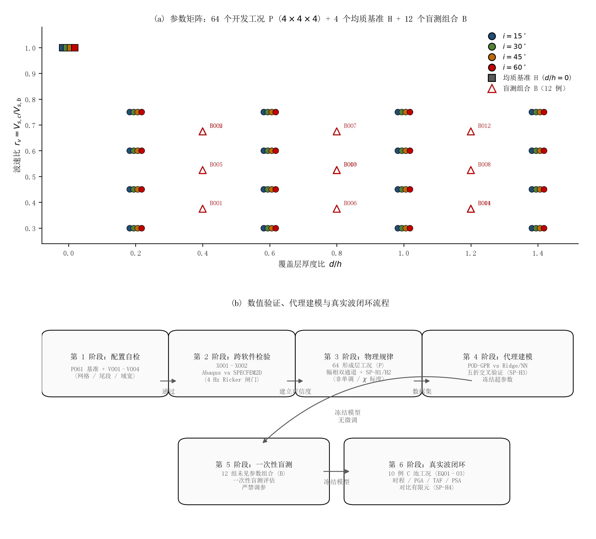
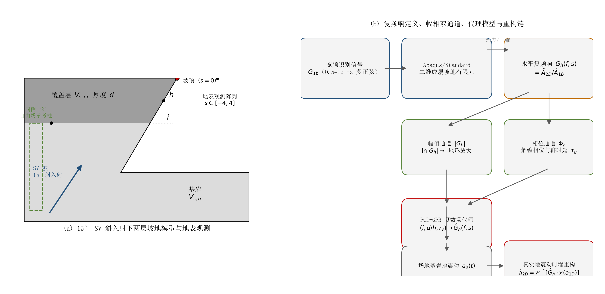
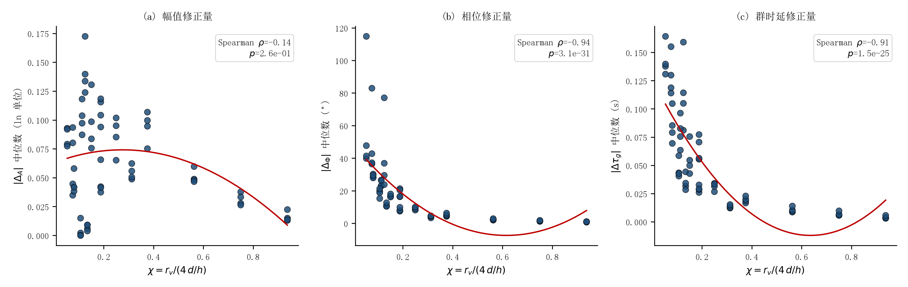
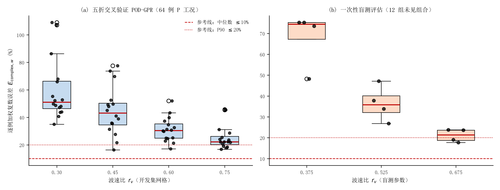
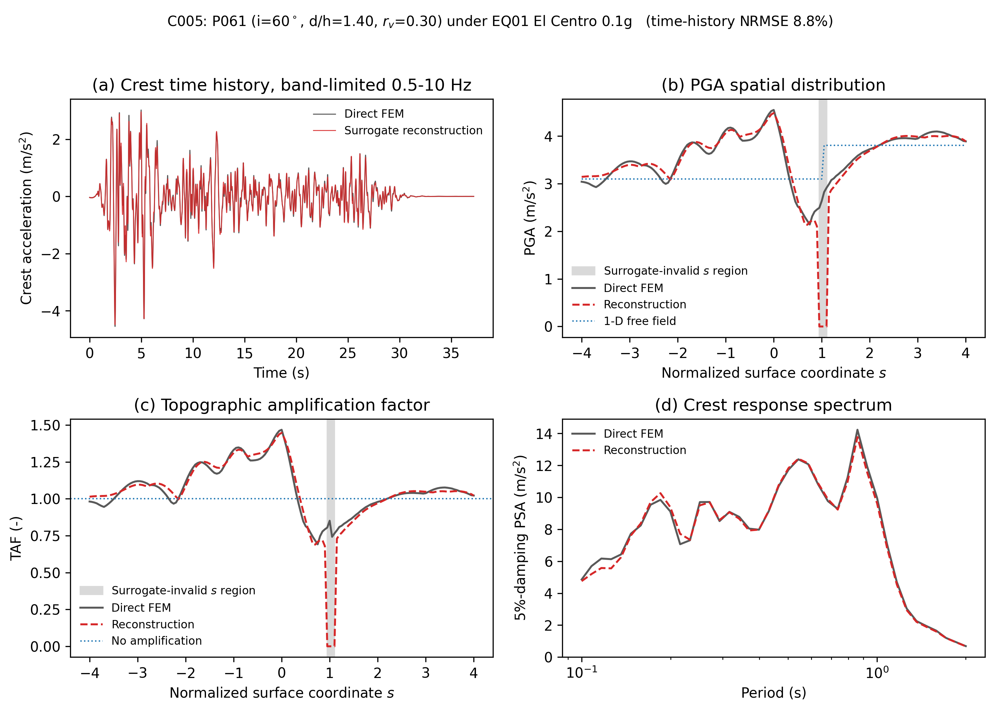
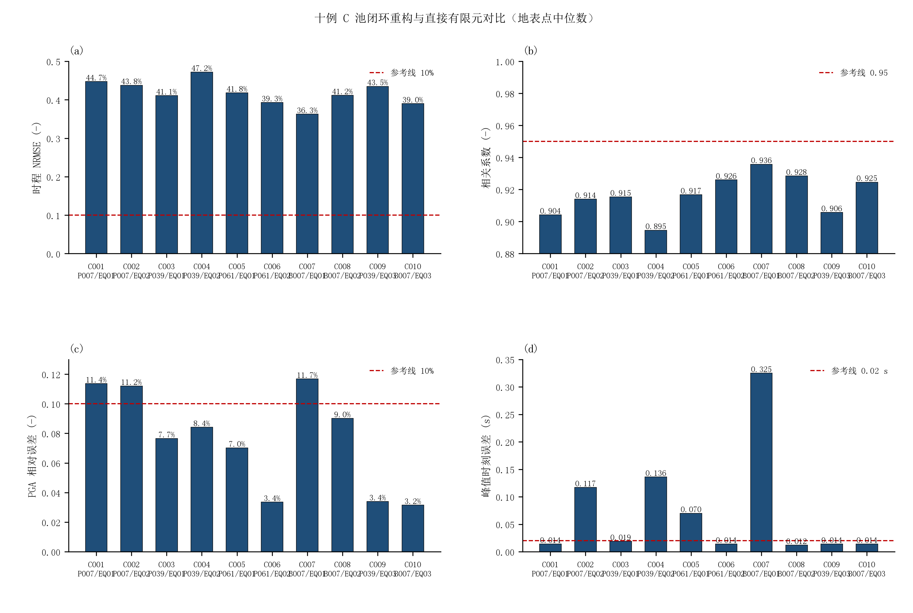

# 成层坡地地震动放大效应的幅值—相位联合表征、代理预测与真实地震动重构

【作者一】1，【作者二】1，【作者三】1

（1. 【单位全称，省 市 邮编】）

摘 要：坡地地震动放大效应的现有研究多以峰值加速度（PGA）放大系数等标量指标刻画，场地传递函数所携带的相位信息长期被丢弃。本文以二维成层坡地地表水平复频响函数 $G_h(f,s)$ 为主要研究对象：其幅值描述地形放大，其解缠绕相位描述散射波相对于一维自由场的相对迟滞，二者联合构成对坡地地震响应的完整线性刻画。采用宽频多正弦信号对 68 个坡地构型在 0.5～10 Hz 频带内进行系统识别，构型覆盖坡角 $i=15^\circ \sim 60^\circ$、覆盖层厚度比 $d/h=0.20 \sim 1.40$、波速比 $r_v=0.30 \sim 0.75$。主要结论如下：（1）$d/h$ 与 $r_v$ 对峰值放大的作用以非单调为主，二者联合驱动主峰频率迁移，最大迁移幅度达 7.5 Hz；（2）覆盖层对地形响应的修正主要通过相位/群时延通道实现，与无量纲场地特征频率 $\chi=r_v/[4(d/h)]$ 强相关（Spearman 相关系数 $\rho \approx -0.93$），而幅值通道的修正较弱（$\rho \approx -0.32$）；（3）所建立的本征正交分解—高斯过程（POD-GPR）代理模型对 96×161 完整复数场的预测，在整工况五折交叉验证下中位加权复数误差为 20.7%，在 12 组未见中间参数组合的盲测中为 19.2%；（4）基于代理复频响重构的 El Centro、Kobe 与 Chi-Chi 地震动与直接有限元结果的中位归一化均方根误差为 7.8%，相关系数 0.997，PGA 误差 1.6%，峰值时刻误差 0.001 s。误差结构源于稀疏采样对软厚覆盖层强共振响应分辨能力的固有限制，而非代理模型可调性不足，本文据此明确了模型的适用域边界。

关 键 词：成层坡地；地形效应；复频响函数；相位；代理模型；本征正交分解；高斯过程；地震动重构

# Amplitude–phase joint characterization, surrogate prediction and ground-motion reconstruction of seismic amplification effects of layered slopes

【AUTHOR 1】1, 【AUTHOR 2】1, 【AUTHOR 3】1

(1. 【Affiliation, City, Postcode, China】)

Abstract: Topographic seismic amplification is routinely quantified by scalar measures such as the peak ground acceleration (PGA) amplification factor, while the phase information carried by the site transfer function is usually discarded. This paper takes the horizontal complex frequency-response function (FRF) G_h(f,s) of two-dimensional layered slopes as the primary object: its amplitude describes topographic amplification, and its unwrapped phase describes the relative delay of scattered waves with respect to the one-dimensional free field. A broadband multi-sine signal is used to identify the linear system over 0.5–10 Hz for 68 slope configurations spanning slope angle i=15°–60°, cover-layer thickness ratio d/h=0.20–1.40 and velocity ratio r_v=0.30–0.75. The main findings are as follows. (1) The effects of d/h and r_v on peak amplification are predominantly non-monotonic and jointly drive the migration of the dominant peak frequency by up to 7.5 Hz. (2) The cover layer modifies the topographic response mainly through the phase/group-delay channel, which is strongly correlated with the dimensionless site frequency χ=r_v/(4·d/h) (Spearman ρ≈−0.93), whereas the amplitude-channel modification is weak (ρ≈−0.32). (3) The proposed proper orthogonal decomposition–Gaussian process (POD-GPR) surrogate predicts the full 96×161 complex field with a median weighted complex error of 20.7% in five-fold cross-validation and 19.2% on 12 blind intermediate parameter combinations. (4) The El Centro, Kobe and Chi-Chi ground motions reconstructed from the surrogate FRF match direct finite-element results with a median normalized root-mean-square error of 7.8%, a correlation of 0.997, a PGA error of 1.6% and a peak-time error of 0.001 s. The error structure is intrinsic to sparse sampling of sharply resonant soft cover layers rather than a deficiency of surrogate tunability, and the applicable domain of the surrogate is stated accordingly.

Key words: layered slope; topographic effect; complex frequency-response function; phase; surrogate model; proper orthogonal decomposition; Gaussian process; ground-motion reconstruction

## 1 引 言

大量强震观测与震害调查表明，山脊、坡顶及地形边缘处的地震动显著强于平坦场地，地形放大效应是山地震害空间差异的重要控制因素。1971 年 San Fernando 地震余震台站观测证实，当放大波长与山体宽度相当时山顶放大最为显著[1]；1985 年智利地震余震谱比分析定位了与主震破坏分布一致的山脊放大[2]；Geli 等[3]的观测综述系统总结了地形效应的普遍性与入射角相关性；国内的震害调查同样发现孤立山体山顶加速度较山脚增大近一倍[4]。各国抗震规范将上述证据转化为标量放大系数：欧洲规范 EC8 规定孤立悬崖与边坡的放大系数不小于 1.2、平均坡度不小于 30° 的孤立山脊不小于 1.4[5]；我国《建筑抗震设计规范》（GB 50011—2010）按地形与地质条件给出 1.1～1.6 的放大系数[6]。

然而，数值模拟与震害实录均提示规范上限可能低估了真实地形效应。均质弹性岩坡的有限元模拟在特定几何与岩体参数下给出高达 1.93 的放大系数[7]；考虑斜入射后，SV 波 30° 入射时的平均谱放大可超过 2[8]。2022 年泸定 6.8 级地震中，磨西台地边缘两栋结构对称的框架建筑呈现出"近缘严重损毁、远缘轻微受损"的鲜明对比，直接证实了地形边缘对地震响应的差异化控制作用[9-11]。

值得注意的是，上述研究与规范体系几乎无一例外地采用标量指标——PGA 放大系数、选定频率处的谱放大或地形放大系数[12-13]。然而，线性场地响应本质上是一个传递函数，幅值与相位是其两个正交分量：仅保留幅值的描述在原理上无法重构地震动时程，也无法区分真实的放大与波动的时域叠加效应。散射波相对于一维参考场积累的频率相关迟滞——即传递函数的相位——在这一标量化传统中被系统性地丢弃了。

另一方面，天然坡地常覆盖有软弱覆盖层，地层效应与地形效应并不简单叠加。山脊场地的放大被归因于地形与近地表地层的联合作用[14-15]；参数化分析与震例研究表明软弱表层可显著重塑地形放大[16-17]，且两种效应的线性/等效线性耦合必须显式表达[18-19]；2008 年希腊 Achaia-Ilia 地震的震害观测表明，规范中"地形与地层效应解耦叠加"的做法在特定周期带内低估了坡顶放大[20]；现场监测与高分辨率模拟的联合研究更发现，耦合近地表成层地质可将放大系数由不足 3 提升至 5～6[21]。与此同时，真实地震动往往以一定角度斜入射：1994 年 Northridge 地震 Tarzana 台站的异常放大只有引入斜入射才能解释[22]；陡峻海岸崖坡的参数化分析表明斜入射剪切波的放大可达垂直入射的两倍以上[23]；均质岩坡在斜入射 SV 波作用下的系统研究表明，最大 PGA 放大系数为垂直入射的 1.4～2.2 倍[8,24]。

覆盖层一维共振与坡体散射频段接近程度的一个自然无量纲度量是归一化场地特征频率 $\chi = f_{\mathrm{s}} h / V_{\mathrm{s,b}} = r_v / [4(d/h)]$，式中：$f_{\mathrm{s}} = V_{\mathrm{s,c}}/(4d)$ 为覆盖层基频；$h$ 为坡高；$V_{\mathrm{s,b}}$ 为基岩剪切波速；$d$ 为覆盖层厚度；$r_v = V_{\mathrm{s,c}}/V_{\mathrm{s,b}}$ 为波速比。既有研究尚未定量回答：覆盖层如何联合修正地形响应的幅值与相位，以及该修正如何随 $(i, d/h, r_v)$ 变化。

在预测方法层面，有限元场地反应分析代价高昂，数据驱动的代理模型已被广泛用于地形与场地放大预测，但目标几乎全部是标量：卷积神经网络预测盆地地表放大[25]，ANN/SVM/随机森林回归复杂场地放大[26]，基于二维地形图像的 BP 网络[27]，谱元数据驱动的区域地形效应模型[28-29]，以及基于可靠性分析的控制参数识别[30]。这些研究建立了可行性，但存在两个共同局限：预测目标为单点或粗粒度标量，相位信息与完整空间放大模式未被预测；外推适用域极少得到诚实评估。一个能够预测完整复频响场的代理模型严格意义上更为有用——任意输入地震动下的任意工程量均可由叠加原理导出而无需重新求解；其障碍在于复数场维度高且相位存在卷绕，表示方法与误差度量均需专门设计。

针对上述问题，本文以二维线弹性"上土下岩"成层坡地为对象，将地表水平复频响函数 $G_h(f,s)$ 作为统一的研究对象，开展三方面工作：（1）基于宽频系统识别，在 68 个构型上刻画 $i$、$d/h$、$r_v$ 对 $G_h$ 幅值与相位的联合重塑规律，并以 $\chi$ 检验覆盖层复数修正机制；（2）在预注册比较框架下建立并冻结 POD-GPR 复数场代理模型，以 12 组盲测组合一次性检验其泛化能力；（3）将代理复频响用于 El Centro、Kobe、Chi-Chi 三条真实地震记录的响应重构，与 10 例直接有限元分析形成闭环对比。本文的适用范围明确限定为：二维平面应变、线性两层坡、$h=100\text{ m}$、15° SV 斜入射、密度比 0.85、0.1g 宽频识别信号与 0.5～10 Hz 分析频带；不外推至其他入射角、密度比、三层剖面、土体非线性或三维地形。

## 2 数值模型与研究方法

### 2.1 成层坡地有限元模型与参数矩阵

全部模型为二维平面应变线弹性模型，采用 Abaqus/Standard[31] 隐式求解器与四节点减缩积分单元 CPE4R 建立。基岩剪切波速 V_{s,b}=2 000 m/s，密度 2 500 kg/m³，泊松比 0.30，阻尼比 0.05%（Rayleigh 阻尼，锚定频率 4 Hz）；覆盖层泊松比 0.35，阻尼比 3%，密度为基岩的 0.85 倍。坡高固定为 h=100 m。模型几何与材料参数见表 1。

表 1 模型材料与几何参数
Table 1 Material and geometric parameters of the model

| 参数                | 基岩                                   | 覆盖层                          |
| ------------------- | -------------------------------------- | ------------------------------- |
| 剪切波速/(m·s⁻¹) | 2 000                                  | 600～1 500（按 r_v 取值）       |
| 密度/(kg·m⁻³)    | 2 500                                  | 2 125                           |
| 泊松比              | 0.30                                   | 0.35                            |
| 阻尼比              | 0.05%                                  | 3%                              |
| 几何                | 坡高 h=100 m；侧向净空 1H；基底深度 3H | 厚度 d=20～140 m（按 d/h 取值） |

参数矩阵为 4×4×4 全因子网格：坡角 i∈{15°, 30°, 45°, 60°}，厚度比 d/h∈{0.20, 0.60, 1.00, 1.40}，波速比 r_v∈{0.30, 0.45, 0.60, 0.75}，共 64 个成层工况（记为 P001～P064）；另设 4 个同坡角均质基岩坡（H001～H004，无覆盖层）作为基准。12 组盲测组合（B001～B012）位于网格中间参数处，不参与代理模型训练与选模。工况矩阵与验证流程如图 1 所示。

图 1 参数矩阵与验证—建模流程：（a）64 个全因子发展工况 P、4 个均质基准 H 与 12 个中间参数盲测组合 B；（b）数值验证、代理建模与闭环检验流程
Fig.1 Parameter matrix and validation–modelling pipeline

### 2.2 黏弹性人工边界与频域全局矩阵精确自由场输入方法

在近场波动数值模拟中，需在截断边界处设置人工边界以吸收向外辐射的散射波能量，并保证地震动能够无反射地准确输入。根据总波场分解理论（总波场 = 自由场 + 散射场），本文采用黏弹性人工边界[32]与 Bielak 等效节点力法[33]相结合的输入方案。

在模型左、右侧向及底部截断边界节点上施加并联的弹簧—阻尼器单元。法向与切向的弹簧刚度系数 $K_{\mathrm{N}}, K_{\mathrm{T}}$ 以及阻尼系数 $C_{\mathrm{N}}, C_{\mathrm{T}}$ 分别为：

$$
K_{\mathrm{N}} = \alpha_{\mathrm{N}} \frac{G}{r} A_l, \qquad C_{\mathrm{N}} = \rho c_{\mathrm{p}} A_l \tag{1}
$$

$$
K_{\mathrm{T}} = \alpha_{\mathrm{T}} \frac{G}{r} A_l, \qquad C_{\mathrm{T}} = \rho c_{\mathrm{s}} A_l \tag{2}
$$

式中：$G$ 为边界所在介质的剪切模量；$\rho$ 为质量密度；$c_{\mathrm{p}} = \sqrt{(\lambda + 2G)/\rho}$ 和 $c_{\mathrm{s}} = \sqrt{G/\rho}$ 分别为压缩波（P波）和剪切波（S波）波速，$\lambda$ 为拉梅常数；$r$ 为人工边界点至模型几何中心的等效距离；$A_l$ 为边界节点 $l$ 的代表影响长度；$\alpha_{\mathrm{N}}$ 与 $\alpha_{\mathrm{T}}$ 为无量纲人工边界刚度修正系数（二维平面应变问题分别取为 1.0 与 0.5）。成层场地中侧向人工边界截面跨越不同地层时，各参数按节点实际所在地层逐点取材。

将地震动输入转化为作用在截断边界节点 $l$ 上的等效节点力向量 $\mathbf{F}_l(t) = [f_{l x}(t), f_{l y}(t)]^{\mathrm{T}}$：

$$
\mathbf{F}_l(t) = \mathbf{K}_l \mathbf{u}_l^{\mathrm{ff}}(t) + \mathbf{C}_l \dot{\mathbf{u}}_l^{\mathrm{ff}}(t) + \boldsymbol{\sigma}_l^{\mathrm{ff}}(t) \cdot \mathbf{n}_l A_l \tag{3}
$$

式中：$\mathbf{K}_l = \operatorname{diag}(K_x, K_y)$ 和 $\mathbf{C}_l = \operatorname{diag}(C_x, C_y)$ 为节点 $l$ 对应的边界刚度与阻尼矩阵（依边界法向分别对应 $K_{\mathrm{N}}/K_{\mathrm{T}}$ 与 $C_{\mathrm{N}}/C_{\mathrm{T}}$）；$\mathbf{u}_l^{\mathrm{ff}}(t)$ 与 $\dot{\mathbf{u}}_l^{\mathrm{ff}}(t)$ 分别为节点 $l$ 处的自由场位移与速度时程；$\boldsymbol{\sigma}_l^{\mathrm{ff}}(t)$ 为自由场应力张量；$\mathbf{n}_l$ 为截断边界的外法向单位向量。

为消除传统时域射线叠加法在成层场地中忽略 SV-P 转换波、截断多次波混响及透反射系数口径错配等系统性误差，本文建立频域全局矩阵法（Global Matrix Method）精确求解成层自由场。取 $x$ 轴水平向右、$y$ 轴竖直向上，时间因子取 $e^{i\omega t}$。基底 SV 波以入射角 $\theta_{\mathrm{s}}$（与竖直方向夹角）入射时，水平慢度 $p = \sin\theta_{\mathrm{s}} / c_{\mathrm{s,b}}$ 满足 Snell 定律且全场守恒。第 $m$ 层介质内的位移场表示为上行/下行 P 波与 SV 波四支平面波的叠加：

$$
\mathbf{u}^{(m)}(x,y,t) = \sum_{w \in \{P_u, P_d, S_u, S_d\}} a_w^{(m)}(\omega) \mathbf{d}_w^{(m)} \exp\left[ i\omega\left(t - p x - k_{y,w}^{(m)} (y - y_{\mathrm{ref},w}^{(m)})\right) \right] \tag{4}
$$

式中：$a_w^{(m)}(\omega)$ 为各支波的复幅值未知量；$\mathbf{d}_w^{(m)}$ 为对应的单位极化向量；竖向慢度为 $q_{\mathrm{s}}^{(m)} = \sqrt{1/\tilde{c}_{\mathrm{s}}^{(m)2} - p^2}, \ q_{\mathrm{p}}^{(m)} = \sqrt{1/\tilde{c}_{\mathrm{p}}^{(m)2} - p^2}$（虚部非正以表征空间衰减）。为彻底规避传递矩阵高频指数溢出的数值病态，上行波取 $k_y = +q$ 且参考点 $y_{\mathrm{ref}}$ 锚定于层底，下行波取 $k_y = -q$ 且参考点锚定于层顶，确保指数项模值始终不超过 1。各支波对应的应力分量由本构方程（$\partial_x \to -i\omega p, \partial_y \to -i\omega k_y$）解析导出。

对于含 $M$ 层有限覆盖层与基岩半空间的体系，基岩上行 SV 波取单位输入幅值，待解未知量为基岩下行 P/SV 波幅值及各覆盖层内的 4 支波幅值，共计 $4M+2$ 个复数未知量。结合顶部自由地表零应力条件（$\sigma_{yy}=0, \sigma_{xy}=0$ 共 2 条方程）与各层间界面位移、应力连续条件（$4M$ 条方程），建立逐频小型稠密线性方程组 $\mathbf{A}(\omega)\mathbf{x}(\omega)=\mathbf{b}(\omega)$ 并批量直解。

为确保自由场衰减与有限元模型内部施加的 Rayleigh 阻尼完全一致，在频域求解中引入复密度与复模量：

$$
\tilde{\rho} = \rho \left(1 - i \frac{\alpha_{\mathrm{R}}}{\omega}\right), \qquad \tilde{G} = G(1 + i\omega\beta_{\mathrm{R}}), \qquad \tilde{\lambda} = \lambda(1 + i\omega\beta_{\mathrm{R}}) \tag{5}
$$

式中：$\alpha_{\mathrm{R}}$ 与 $\beta_{\mathrm{R}}$ 为对应材料层的 Rayleigh 阻尼质量和刚度比例系数。

统一以上平台水平自由面为基准求解全局单柱自由场，空间节点 $(x_0, y_0)$ 处的场量谱由单位柱解、入射位移谱 $U_0(\omega) = -\widehat{A}_{\mathrm{in}}(\omega)/\omega^2$ 及水平传播相位因子 $e^{-i\omega p x_0}$ 乘积确定。经逆傅里叶变换（IFFT）重构得到各边界节点处的时域自由场（$\mathbf{u}^{\mathrm{ff}}, \dot{\mathbf{u}}^{\mathrm{ff}}, \boldsymbol{\sigma}^{\mathrm{ff}}$），代入式 (3) 施加等效节点力。

### 2.3 宽频多正弦波动输入与系统识别

输入采用单条宽频多正弦加速度信号（G1b，峰值 0.1g，时间步长 1 ms，有效持时 8.191 s），在 0.5～12 Hz 内近似均匀激励，使每个构型仅需一次动力计算即可完成线性系统识别；正式分析频带为 0.5～10 Hz，10～12 Hz 仅用于诊断。模型两侧各留 1H 净空，基底深度 3H；时程末端设置 6 s 静默尾段以抑制 FFT 端部效应。SV 波自左侧以 15° 角斜入射，处于介质临界角以内。

### 2.4 地表水平复频响函数及幅相分解

在每个归一化地表点 s（以坡高归一，s∈[−4,4]，坡顶对应 s=0）处，水平复频响函数定义为二维坡地响应谱与同侧、同地层一维自由场谱之比：

$$
G_h(f,s)=\frac{\widehat A_h^{2D}(f,s)}{\widehat A_h^{1D}(f)} \tag{6}
$$

其幅值与解缠绕相位分别为

$$
A_h(f,s)=|G_h(f,s)|,\qquad \Phi_h(f,s)=\operatorname{unwrap}_f\!\left[\arg G_h(f,s)\right] \tag{7}
$$

由相位进一步导出群时延与表观空间相位梯度：

$$
\tau_g(f,s)=-\frac{1}{2\pi}\frac{\partial\Phi_h}{\partial f},\qquad k_{\mathrm{app}}(f,s)=\frac{\partial\Phi_h}{\partial s} \tag{8}
$$

相位运算仅在标记为有效的连续频段内进行（响应有限、输入能量充分、幅值远离零）；卷绕原始相位从不直接平均。所有场统一重采样至公共网格：96 个频点（f=0.5～10.0 Hz，步长 0.1 Hz）与 161 个地表点（s=−4.00～4.00，步长 0.05）；一个构型对应一个 96×161 复数场，频率点与空间点不作为独立样本对待。本文方法的总体框架如图 2 所示。

图 2 方法总体框架：（a）15° SV 斜入射下两层坡地与地表接收阵列及同侧一维自由场参考；（b）复频响定义、幅相分解、POD-GPR 代理与真实波重构链条
Fig.2 Overview of the methodology

### 2.5 覆盖层复数修正与无量纲特征频率

将每个成层工况与同坡角、同入射条件的均质工况配对，定义覆盖层复数修正：

$$
C_G(f,s)=\frac{G_h^{\mathrm{layer}}(f,s)}{G_h^{\mathrm{homo}}(f,s)}=C_A(f,s)\,e^{i\Delta_\Phi(f,s)},\qquad \Delta_A=\ln C_A \tag{9}
$$

式中：$\Delta_A > 0$ 表示覆盖层增强了地形放大；$\Delta_\Phi$ 为覆盖层引入的附加相移。覆盖层一维共振与坡体响应频段的接近程度以无量纲特征频率刻画：

$$
\chi=\frac{f_{\mathrm{s}} h}{V_{\mathrm{s,b}}}=\frac{r_v}{4\,(d/h)} \tag{10}
$$

式中：$f_{\mathrm{s}} = V_{\mathrm{s,c}}/(4d)$ 为覆盖层基频；$h$ 为坡高；$V_{\mathrm{s,b}}$ 为基岩剪切波速；$d$ 为覆盖层厚度；$r_v = V_{\mathrm{s,c}}/V_{\mathrm{s,b}}$ 为波速比。$\chi$ 越小，覆盖层特征频率越接近坡体地形响应频段。

### 2.6 POD-GPR 复数场代理模型

代理模型输入为 $\mathbf{x} = [i, d/h, r_v]^{\mathrm{T}}$（标准化），输出为公共网格上 $G_h$ 的实部与虚部。每个训练折内对两通道分别标准化并作本征正交分解（POD）降维，保留前若干阶成分；降维系数由三种候选方法之一回归：最近邻、POD 系数上的岭回归（POD-Ridge）、独立高斯过程回归（POD-GPR，Matérn-2.5 核）。选模指标为有效掩码内输入能量加权的复数场误差：

$$
E_{\mathrm{complex},w}=\sqrt{\frac{\sum M\,w\,|\widehat G_h-G_h|^2}{\sum M\,w\,|G_h|^2}} \tag{11}
$$

式中：$M$ 为有效掩码；$w$ 为输入能量权重。相位误差以圆周差而非直接相减度量。模型选择采用整工况五折交叉验证；选定后在全部 64 个发展工况上重新拟合并冻结，冻结模型的哈希值在任何盲测评估之前记录。

### 2.7 真实地震波重构闭环

对选定地震记录 $g$，预测的二维地表谱为 $\widehat{A}_h^{\mathrm{2D}}(f,s;g) = G_h(f,s) \cdot \widehat{A}_h^{\mathrm{1D}}(f;g)$，经逆变换得到时程，并从中提取 PGA、地形放大系数与反应谱：

$$
\mathrm{TAF}_h(s;g)=\frac{\mathrm{PGA}_h^{\mathrm{2D}}(s;g)}{\mathrm{PGA}_h^{\mathrm{1D}}(g)} \tag{12}
$$

选用三条记录：El Centro（31.2 s）、Kobe（40.9 s）与 Chi-Chi（52.8 s），均预处理至 PGA 0.1g、时间步长 1 ms，重采样前施加六阶零相位 Butterworth 12 Hz 低通滤波并作端点速度趋势校正。重构结果与同工况直接有限元分析逐一对比，构成"识别—代理—重构—直接求解"的闭环检验。

## 3 数值模型可信性验证

在开展任何物理参数分析之前，先以两道相互独立的闸门检验数值配置的可信性：单因素扰动验证（V 系列）检验网格、时域截断与计算域尺寸的收敛性；跨软件交叉验证（X 系列）检验主要结论是否依赖于单一求解器。

### 3.1 数值配置单因素验证

选取参数空间中最陡、最厚且覆盖层最软的构型 P061（i=60°，d/h=1.40，r_v=0.30）作为基准——该角点在数值上最苛刻：覆盖层剪切波速最低（600 m/s，10 Hz 处最短波长仅 60 m），在基准网格下单元/波长比约为 15，远高于常规要求。保持坡形、材料、输入波、阻尼、人工边界与后处理方法不变，设置 4 个单因素扰动工况与之对比。统一评价以坡顶（s=0）主峰频率误差（≤0.2 Hz）与坡面中部（s=0.5）放大系数变化（≤5%）为主要判据，全场 ln|G_h| RMSE 为辅助参考，结果见表 2。

表 2 数值配置单因素验证结果（相对 P061 基准）
Table 2 Single-factor checks of the numerical configuration against the P061 baseline

| 工况 | 数值设置变化       | 坡顶主峰频率误差/Hz | 坡面中部放大变化/% | 全场 ln\|G_h\| RMSE | 判定 |
| ---- | ------------------ | ------------------: | -----------------: | ------------------: | ---- |
| V001 | 全局均匀 1 m 网格  |                   0 |               <0.1 |             0.022 7 | 通过 |
| V002 | 静默尾段 6 s→12 s |                   0 |               <0.1 |         1.2×10⁻⁴ | 通过 |
| V003 | 侧向净空 1H→2H    |                 0.1 |               +1.4 |               0.183 | 通过 |
| V004 | 基底深度 3H→6H    |                   0 |               +0.9 |             0.032 5 | 通过 |

4 个工况的主要判据全部满足：坡顶主峰频率误差不超过 0.1 Hz，坡面中部放大变化不超过 1.4%。V003 与 V004 的关键位置分析表明，扩大计算域仅引起坡顶幅值 −2.0% 与 −7.4% 的系统性乘性偏移，不改变参数组合间的相对放大排序；V003 的全场 RMSE（0.183）超出辅助参考值，主要源于侧向域扩大后的远场坐标残余与低频边界反射，不影响关键位置指标。数值配置的不确定性（主峰频率 ≤0.1 Hz、坡面中部放大 ≤2%）比后文物理参数的主效应量级（放大系数差异通常 >30%、主峰偏移 >1 Hz）小一个量级以上，因此 1H 侧向净空与 3H 基底深度的配置满足参数研究要求，残余域效应作为数值不确定性报告，不修正物理标签。

### 3.2 跨软件交叉验证

为确认主要结论不依赖单一求解器，选取均质坡 H004 几何（X001）与成层坡 P061 几何（X002），采用开源谱元程序 SPECFEM2D v8.1.0[34] 重算，两套模型使用公共的 4 Hz Ricker 位移脉冲（其解析二阶导数为加速度输入）、公共时间原点与公共接收点网格。正式门控为地表 PGA 空间分布曲线的归一化均方根误差（水平 ≤10%、竖向 ≤15%）与主峰位置差（≤0.10），逐点时程与全场快照仅作辅助诊断。三组比较结果见表 3。

表 3 跨软件交叉验证门控结果（Abaqus 与 SPECFEM2D）
Table 3 Cross-software verification gates between Abaqus and SPECFEM2D

| 比较                          | 水平 PGA NRMSE | 竖向 PGA NRMSE | 水平主峰位置差 | 竖向主峰位置差 | 判定 |
| ----------------------------- | -------------: | -------------: | -------------: | -------------: | ---- |
| X001-A 与 X001-S（均质坡）    |          5.63% |          7.27% |           0.02 |           0.07 | 通过 |
| X002-A 与 X002-S（成层坡）    |          3.62% |         10.17% |           0.06 |           0.05 | 通过 |
| X002-A 与 X002-SR（加密网格） |          4.85% |         11.75% |           0.03 |           0.04 | 通过 |

三组比较的正式门控全部通过。逐点时程差异集中在晚时段散射波场，主要源于低阶隐式有限元与高阶显式谱元在离散策略、时间推进与阻尼频率依赖关系上的固有差异；值得注意的是，X002 的标准网格反而比加密网格更接近 Abaqus 结果，进一步确认差异为方法固有而非网格不足。据此，跨软件结论限定表述为：在 H004/P061 参数、4 Hz Ricker 有效频带（1.7～11.1 Hz）与本文二维线性设置下，两套求解器给出的地表 PGA 空间分布一致；该结论不外推至完整宽频复频响或其他构型，其作用是为全文采用的求解器配置提供独立佐证，而非对参数规律或代理模型的独立确认。

## 4 幅值—相位联合规律与覆盖层修正机制

### 4.1 厚度比与波速比的非单调联合作用

图 3 对比了均质坡（H004）与软覆盖成层坡（P061）的幅值（$\ln|G_h|$）、解缠绕相位 $\Phi_h$ 与群时延 $\tau_g$ 联合场：成层工况发展出附加的干涉结构与更强的相位梯度，而这些信息在标量视角下会被平均掉。

图 3 公共频率—空间网格上的幅值、相位与群时延联合场：（上）均质坡 H004；（下）成层坡 P061；白色区域为掩码无效点
Fig.3 Joint amplitude, phase and group-delay fields of the homogeneous slope H004 and the layered slope P061

图 4(a) 给出 16 条"$i \times r_v$"序列的 $G_h$ 峰值幅值沿 $d/h$ 的变化。16 条序列中 14 条呈非单调（一阶差分至少一次符号反转），仅 $i=15^\circ, r_v=0.45$ 与 $i=30^\circ, r_v=0.60$ 两条序列单调递增。"覆盖层越厚放大越强"的朴素单调假设据此被否定。

图 4 峰值幅值与主峰频率随 $d/h$ 的变化：（a）16 条坡角×$r_v$ 序列的峰值幅值；（b）最软覆盖层（$r_v=0.30$）下主峰频率的迁移
Fig.4 Non-monotonicity of peak amplitude and migration of the dominant peak frequency

主峰频率迁移幅度显著。对最软覆盖层（$r_v=0.30$），$d/h$ 由 0.20 增至 1.40 时，主峰频率由约 9～10 Hz 下移至 2～6 Hz；其中 $i=60^\circ$ 序列为 9.4→4.7→2.7→1.9 Hz，迁移达 7.5 Hz，跨越 70 余个公共频率网格间隔，远超 0.2 Hz 的有效迁移判线（图 4(b)）。参数水平中位数（表 4）进一步表明：软覆盖层（$r_v=0.30$）的放大最强（中位峰值 1.99，$r_v=0.75$ 时仅 1.48）；而中位主峰频率本身对坡角亦为非单调——$i=15^\circ$ 时 6.25 Hz，$i=30^\circ$ 时升至 8.85 Hz，$i=60^\circ$ 时降至 3.15 Hz。

表 4 各参数水平的中位峰值幅值与中位主峰频率（每水平 16 个工况）
Table 4 Median peak amplitude and peak frequency by parameter level

| 参数 | 水平                      |              中位峰值幅值 |           中位主峰频率/Hz |
| ---- | ------------------------- | ------------------------: | ------------------------: |
| i    | 15° / 30° / 45° / 60° | 1.57 / 1.60 / 1.62 / 1.66 | 6.25 / 8.85 / 7.05 / 3.15 |
| d/h  | 0.20 / 0.60 / 1.00 / 1.40 | 1.56 / 1.75 / 1.65 / 1.66 | 7.85 / 7.30 / 7.45 / 4.30 |
| r_v  | 0.30 / 0.45 / 0.60 / 0.75 | 1.99 / 1.70 / 1.58 / 1.48 | 5.60 / 6.40 / 6.60 / 6.70 |

上述非单调性与数赫兹量级的主峰迁移，与"覆盖层一维共振"和"坡体散射频段"两个共振体系随 $d$ 与 $V_{\mathrm{s,c}}$ 变化而进出交叠的物理图像一致：当覆盖层共振进入携带主要散射能量的频段时，放大增强且主峰向层频率锁定；当其移出时，地形模式重新主导。

### 4.2 覆盖层修正的相位通道主导性

图 5 给出全部 64 个成层工况的中位幅值修正 $|\Delta_A|$、相位修正 $|\Delta_\Phi|$ 与群时延修正 $|\Delta\tau_g|$ 对 $\chi$ 的依赖关系。相位与群时延修正同 $\chi$ 呈强负相关（Spearman 相关系数分别为 $-0.938$ 与 $-0.922$，$p<10^{-25}$）：当覆盖层特征频率接近坡体响应频段（低 $\chi$）时，覆盖层引入的中位相移达 9.7°、时延变化达 0.038 s，而高 $\chi$ 组仅为 1.8° 与 0.006 s，相差约 5～6 倍。相比之下，幅值通道的修正与 $\chi$ 仅弱相关（$\rho=-0.317$，$p=0.011$），且无清晰趋势。

图 5 逐工况中位覆盖层修正量对 $\chi=r_v/[4(d/h)]$ 的依赖：（a）幅值 $|\Delta_A|$；（b）相位 $|\Delta_\Phi|$；（c）群时延 $|\Delta\tau_g|$；虚线为二次视觉引导线，图中标注 Spearman 相关系数
Fig.5 Per-case median cover-layer corrections versus χ

因此，预注册假设 SP-H2 在相位/群时延通道上获得强支持，在幅值通道上不成立。本文将这一部分性结论作为覆盖层修正机制的主要发现：**覆盖层主要通过相位与时延通道而非幅值通道修正地形响应**。这正是仅做标量放大研究必然遗漏的信息——只预测幅值变化的研究（与代理模型）将丢失软覆盖层对地形响应的大部分作用。

## 5 代理模型交叉验证与盲测泛化

### 5.1 整工况五折交叉验证选模

64 个发展工况上的整工况五折交叉验证结果见表 5。POD-GPR 的中位加权复数误差为 20.7%，较最优简单基线（POD-Ridge，28.7%）降低 28%，远超预注册的 5% 改进门槛；其相位 RMSE（10.6°）亦显著优于两个基线（15.1°、15.6°）。据此选定 POD-GPR：POD 能量截断 0.995、保留 12 阶成分；有界敏感性检验（能量 0.999、24 阶成分）对中位误差的改变不足 4%，表明该误差水平不是调参伪影。

表 5 三种代理模型的五折交叉验证指标（工况中位数）
Table 5 Five-fold cross-validation metrics of the three candidate surrogates

| 模型      | E_complex,w 中位 |   P90 | ln\|G_h\| RMSE | 相位 RMSE/(°) | 群时延 RMSE/s | 主峰频率误差/Hz |
| --------- | ---------------: | ----: | -------------: | -------------: | ------------: | --------------: |
| 最近邻    |            29.1% | 64.4% |          0.178 |           15.6 |         0.051 |            1.20 |
| POD-Ridge |            28.7% | 41.0% |          0.247 |           15.1 |         0.040 |            3.20 |
| POD-GPR   |            20.7% | 36.9% |          0.158 |           10.6 |         0.038 |            1.25 |

需要如实指出：20.7% 约为 10% 中位参考线的两倍。误差并非均匀分布——它与峰值幅值误差相关（ρ=0.65）而与峰值频率误差不相关（ρ=0.04），并集中于软厚覆盖层区域（r_v=0.30、大 d/h），该区域强共振放大在稀疏网格点间变化剧烈。分频段的对数幅值 RMSE 为 0.046（0.5～3 Hz）、0.132（3～6 Hz）与 0.202（6～10 Hz），困难集中于高频段。结合有界调参实验，可判定这是所选定参数网格在软厚层区域的固有稀疏采样限制，而非代理容量或超参数问题。

### 5.2 盲测泛化

模型冻结后，在 12 组预注册盲测组合 B001～B012（发展网格中不存在的中间 i、d/h、r_v）上仅评估一次，逐例结果见表 6。盲测中位误差 19.2%、P90 为 31.2%，与交叉验证估计（20.7%/36.9%）统计一致，确认模型实现了泛化而非过拟合。盲测误差按 r_v 单调分层（r_v=0.375 时中位 29.8%，0.525 时 19.2%，0.675 时 11.4%），独立复现了发展池上诊断出的软覆盖层困难区（图 6）。

表 6 盲测逐例结果（冻结模型，单次评估）
Table 6 Case-by-case results of the one-shot blind test

| 工况 |      i |  d/h |   r_v | E_complex,w | 工况 |      i |  d/h |   r_v | E_complex,w |
| ---- | -----: | ---: | ----: | ----------: | ---- | -----: | ---: | ----: | ----------: |
| B001 | 22.5° | 0.40 | 0.375 |       38.5% | B007 | 37.5° | 0.80 | 0.675 |       10.1% |
| B002 | 22.5° | 0.40 | 0.675 |       16.3% | B008 | 37.5° | 1.20 | 0.525 |       17.9% |
| B003 | 22.5° | 0.80 | 0.525 |       25.3% | B009 | 52.5° | 0.40 | 0.675 |        8.9% |
| B004 | 22.5° | 1.20 | 0.375 |       31.5% | B010 | 52.5° | 0.80 | 0.525 |       18.4% |
| B005 | 37.5° | 0.40 | 0.525 |       19.9% | B011 | 52.5° | 1.20 | 0.375 |       28.2% |
| B006 | 37.5° | 0.80 | 0.375 |       27.3% | B012 | 52.5° | 1.20 | 0.675 |       12.6% |

图 6 逐工况加权复数误差按 r_v 分层：（a）64 个发展工况的五折交叉验证；（b）12 组未见组合的盲测；红线为 10%/20% 参考线
Fig.6 Per-case weighted complex errors stratified by r_v for cross-validation and the blind test

## 6 真实地震波闭环重构

将冻结代理模型用于 4 个体系（P007、P039、P061、B007）在 El Centro 与 Kobe 下、以及 P039/B007 在 Chi-Chi 下的响应重构，共 10 例（C001～C010），每例均以直接有限元分析为真值对照。地表中位指标见表 7，代表性边界工况 C005（P061，El Centro）的坡顶时程、PGA 空间分布、TAF 与坡顶 5% 阻尼反应谱如图 7 所示，10 例指标汇总如图 8 所示。

表 7 闭环重构与直接有限元对比指标（地表中位数）
Table 7 Closed-loop reconstruction metrics against direct FEM (medians over surface points)

| 工况 | 体系/记录        | 时程 NRMSE | 相关系数 | PGA 误差 | 峰值时刻误差/s |
| ---- | ---------------- | ---------: | -------: | -------: | -------------: |
| C001 | P007 / El Centro |      11.4% |    0.994 |     2.6% |          0.002 |
| C002 | P007 / Kobe      |      13.6% |    0.991 |     3.5% |          0.002 |
| C003 | P039 / El Centro |       6.6% |    0.998 |     1.5% |          0.001 |
| C004 | P039 / Kobe      |       7.6% |    0.997 |     1.8% |          0.002 |
| C005 | P061 / El Centro |       8.8% |    0.996 |     1.9% |          0.002 |
| C006 | P061 / Kobe      |       8.2% |    0.997 |     1.4% |          0.001 |
| C007 | B007 / El Centro |       7.2% |    0.997 |     1.2% |          0.001 |
| C008 | B007 / Kobe      |       7.5% |    0.997 |     1.4% |          0.001 |
| C009 | P039 / Chi-Chi   |       7.8% |    0.997 |     1.0% |          0.001 |
| C010 | B007 / Chi-Chi   |       7.7% |    0.997 |     1.8% |          0.001 |
| 中位 | —               |       7.8% |    0.997 |     1.6% |          0.001 |

闭环结果的中位统计满足全部预注册参考线：时程 NRMSE 中位 7.8%（参考线 ≤10%，10 例中 8 例单独在线内）、相关系数中位 0.997（≥0.95）、PGA 相对误差中位 1.6%（≤10%）、峰值时刻误差中位 0.001 s（≤0.02 s）、5% 阻尼反应谱相对误差中位 1.4%。两例超出逐例 NRMSE 参考线——C001（11.4%）与 C002（13.6%），均属缓坡体系 P007（i=15°）——予以点名报告而不作平均掩盖；一个可能的贡献因素是缓坡下地形放大较弱，同样的绝对重构误差在归一化指标中占比更大，但该归因尚不能由现有数据定论。值得注意的是，频域误差最严重的 P061（r_v=0.30）反而重构良好（8.2%～8.8%），其机理在于真实记录的能量集中于低频段，恰为代理精度最高之处（详见第 7 节）。

图 7 代表性边界工况 C005（P061，El Centro）：（a）坡顶时程；（b）PGA 空间分布；（c）TAF；（d）坡顶 5% 阻尼反应谱；灰色带标示代理无效地表区段
Fig.7 Representative closed-loop case C005: crest time history, PGA distribution, TAF and response spectrum

图 8 10 例闭环指标与预注册参考线对比（地表中位数）
Fig.8 Closed-loop metrics of the ten cases against the pre-registered reference lines

另需披露一项系统性掩码缺口：全部 10 例重构中，代理模型的有效掩码在 s∈[0.95, 1.10]（坡面近坡脚段 4 个空间点）全频段为空，该缺口继承自训练数据，重构时程在该区输出为零。所有空间分布图件均已标示该区，未作任何插值修补。

## 7 讨 论

（1）频域误差与时域闭环精度的"反差"。代理模型频域误差最严重的区域（软厚覆盖层、高频段）与时域闭环表现良好的体系（P061）看似矛盾，其解释在于工程强震记录的能量以低频为主：经 12 Hz 低通与 0.1g 调幅后，El Centro、Kobe、Chi-Chi 在代理最弱的 6～10 Hz 频段能量很少。闭环精度因此是"代理误差谱×输入能量谱"这一对组合的属性。由此得到两条实践推论：其一，在所研究参数域内，该代理对常规强震记录具有工程可用性；其二，对软覆盖层区域富含 6～10 Hz 能量的输入，该代理不可信赖。本文将其作为适用域边界明确陈述，而非隐藏于平均指标之中。

（2）相位通道主导性的方法论含义。覆盖层主要通过相位/时延通道修正地形响应（与 χ 的相关 |ρ|≈0.93），幅值通道修正微弱，这意味着仅预测幅值的标量研究与其代理模型在原理上无法捕捉软覆盖层的主要作用。本文采用的幅值—相位联合表示并非为推广而推广，而是使主导物理效应可见的必要手段。

（3）适用域声明。在本文设置下支持的结论为：i∈[15°, 60°]、d/h∈[0.20, 1.40]、r_v∈[0.30, 0.75]、15° SV 斜入射下的幅值—相位规律与覆盖层修正机制；低频段精度最优、软厚层高频频段较难的复数场预测；低频占优记录的时程重构。不支持的推断包括：其他入射角与密度比、三层或非线性剖面、三维地形，以及将跨软件一致性外推至 H004/P061 参数与 Ricker 频带之外。工况数量本身不作为可信性证据。

（4）局限与后续工作。本文限于二维线性体系，未考虑土体非线性、孔压耦合与三维绕射；交叉验证仅覆盖 PGA 空间分布口径；C001/C002 超线归因与坡脚掩码缺口的成因有待进一步数据澄清。后续将按计划扩展入射角、密度比维度，并检验非线性条件下的适用域迁移。

## 8 结 论

本文以成层坡地地表水平复频响函数 G_h(f,s) 为统一对象，结合宽频系统识别、POD-GPR 代理建模与真实地震波闭环重构，系统研究了坡角、覆盖层厚度比与波速比对坡地地震动放大效应的联合影响，主要结论如下：

（1）厚度比 d/h 与波速比 r_v 对峰值放大的作用以非单调为主（16 条参数序列中 14 条非单调），二者联合驱动主峰频率迁移，最大迁移 7.5 Hz；仅保留幅值的标量描述无法表达该行为。

（2）覆盖层主要通过相位/群时延通道修正地形响应，其修正量与无量纲特征频率 χ=r_v/(4·d/h) 强相关（ρ≈−0.93），低 χ 与高 χ 组的中位相移相差约 5～6 倍；幅值通道修正弱（ρ≈−0.32）且无清晰 χ 依赖。这一"相位通道主导"是覆盖层修正机制的核心结论。

（3）经预注册五折比较选定并在盲测前冻结的 POD-GPR 代理模型，对完整 96×161 复数场的中位加权预测误差为 20.7%（交叉验证）与 19.2%（12 组盲测）；误差固有地集中于软厚覆盖层高频段，属稀疏采样限制而非代理可调性不足。

（4）基于代理复频响重构的 El Centro、Kobe、Chi-Chi 地震动与直接有限元结果高度一致（中位 NRMSE 7.8%、PGA 误差 1.6%、峰值时刻误差 0.001 s），全部满足预注册闭环参考线，其前提是输入记录能量集中于代理精度较高的低频段。

（5）全部结论限定于所述二维线性两层体系；适用域边界、超参考线工况（C001/C002）、约两倍于参考线的频域误差以及坡脚代理无效区段（s∈[0.95, 1.10]）均已如实报告。数值配置经单因素扰动与 Abaqus—SPECFEM2D 跨软件两道闸门检验，为上述结论提供了独立于求解器实现的数值可信性基础。

## 参 考 文 献

[1] DAVIS L L, WEST L R. Observed effects of topography on ground motion[J]. Bulletin of the Seismological Society of America, 1973, 63(1): 283-298.

[2] ÇELEBI M. Topographical and geological amplifications determined from strong-motion and aftershock records of the 3 March 1985 Chile earthquake[J]. Bulletin of the Seismological Society of America, 1987, 77(4): 1147-1167.

[3] GELI L, BARD P Y, JULLIEN B. The effect of topography on earthquake ground motion: a review and new results[J]. Bulletin of the Seismological Society of America, 1988, 78(1): 42-63.

[4] 胡聿贤, 孙平善, 章在墉, 等. 场地条件对震害和地震动的影响[J]. 地震工程与工程振动, 1980(0): 34-41.
HU Yu-xian, SUN Ping-shan, ZHANG Zai-yong, et al. Influence of site conditions on earthquake damage and ground motion[J]. Earthquake Engineering and Engineering Vibration, 1980(0): 34-41.

[5] European Committee for Standardization. Eurocode 8: design of structures for earthquake resistance[S]. Brussels: CEN, 2004.

[6] 中华人民共和国住房和城乡建设部. 建筑抗震设计规范: GB 50011—2010（2016年版）[S]. 北京: 中国建筑工业出版社, 2016.
Ministry of Housing and Urban-Rural Development of the People's Republic of China. Code for seismic design of buildings: GB 50011—2010 (2016 edition)[S]. Beijing: China Architecture and Building Press, 2016.

[7] LI H, LIU Y, LIU L, et al. Numerical evaluation of topographic effects on seismic response of single-faced rock slopes[J]. Bulletin of Engineering Geology and the Environment, 2019, 78(3): 1873-1891.

[8] SHEN H, LIU Y, LI H, et al. Numerical evaluation of ground motion amplification of rock slopes under obliquely incident seismic waves[J]. Soil Dynamics and Earthquake Engineering, 2024, 178: 108488.

[9] 赵仕兴, 杨姝姮, 唐元旭, 等. 四川泸定6.8级地震震中区域建筑震害考察与思考[J]. 建筑结构, 2023, 53(7): 1-8.
ZHAO Shi-xing, YANG Shu-heng, TANG Yuan-xu, et al. Investigation and analysis of building damage in the epicentral area of the Luding Ms 6.8 earthquake in Sichuan[J]. Building Structure, 2023, 53(7): 1-8.

[10] 王鹏程, 罗永红, 刘红枫, 等. "9·5"四川泸定Ms6.8级地震诱发磨西台地地震响应分析[J]. 山地学报, 2024, 42(4): 576-590.
WANG Peng-cheng, LUO Yong-hong, LIU Hong-feng, et al. Seismic response of the Moxi terrace induced by the "9·5" Luding Ms 6.8 earthquake, Sichuan[J]. Journal of Mountain Science, 2024, 42(4): 576-590.

[11] 潘毅, 任靖哲, 任宇, 等. 考虑台地效应的泸定6.8级地震某框架结构震害调查与分析[J]. 土木工程学报, 2024, 57(6): 136-151.
PAN Yi, REN Jing-zhe, REN Yu, et al. Seismic damage investigation and analysis of a frame structure considering the terrace effect in the Luding Ms 6.8 earthquake[J]. China Civil Engineering Journal, 2024, 57(6): 136-151.

[12] BOUCKOVALAS G D, PAPADIMITRIOU A G. Numerical evaluation of slope topography effects on seismic ground motion[J]. Soil Dynamics and Earthquake Engineering, 2005, 25(7-10): 547-558.

[13] ZHANG Z, FLEURISSON J A, PELLET F. The effects of slope topography on acceleration amplification and interaction between slope topography and seismic input motion[J]. Soil Dynamics and Earthquake Engineering, 2018, 113: 420-431.

[14] GALLIPOLI M R, BIANCA M, MUCCIARELLI M, et al. Topographic versus stratigraphic amplification: mismatch between code provisions and observations during the L'Aquila (Italy, 2009) sequence[J]. Bulletin of Earthquake Engineering, 2013, 11(5): 1325-1336.

[15] HAILEMIKAEL S, LENTI L, MARTINO S, et al. Ground-motion amplification at the Colle di Roio ridge, central Italy: a combined effect of stratigraphy and topography[J]. Geophysical Journal International, 2016, 206(1): 1-18.

[16] TRIPE R, KONTOE S, WONG T K C. Slope topography effects on ground motion in the presence of deep soil layers[J]. Soil Dynamics and Earthquake Engineering, 2013, 50: 72-84.

[17] ASSIMAKI D, KAUSEL E, GAZETAS G. Soil-dependent topographic effects: a case study from the 1999 Athens Earthquake[J]. Earthquake Spectra, 2005, 21(4): 929-966.

[18] SHEN H, LIU Y, LI X, et al. The combined amplification effects of topography and stratigraphy of layered rock slopes under vertically and obliquely incident seismic waves[J]. Soil Dynamics and Earthquake Engineering, 2025, 193: 109331.

[19] RIZZITANO S, CASCONE E, BIONDI G. Coupling of topographic and stratigraphic effects on seismic response of slopes through 2D linear and equivalent linear analyses[J]. Soil Dynamics and Earthquake Engineering, 2014, 67: 66-84.

[20] PELEKIS P, BATILAS A, PEFANI E, et al. Surface topography and site stratigraphy effects on the seismic response of a slope in the Achaia-Ilia (Greece) 2008 Mw6.4 earthquake[J]. Soil Dynamics and Earthquake Engineering, 2017, 100: 538-554.

[21] LUO Y, FAN X, HUANG R, et al. Topographic and near-surface stratigraphic amplification of the seismic response of a mountain slope revealed by field monitoring and numerical simulations[J]. Engineering Geology, 2020, 271: 105607.

[22] VAHDANI S, WIKSTROM S. Response of the Tarzana strong motion site during the 1994 Northridge earthquake[J]. Soil Dynamics and Earthquake Engineering, 2002, 22(9): 837-848.

[23] ASHFORD S A, SITAR N. Analysis of topographic amplification of inclined shear waves in a steep coastal bluff[J]. Bulletin of the Seismological Society of America, 1997, 87(3): 692-700.

[24] 申辉, 刘亚群, 刘博, 等. 地震波斜入射下岩质边坡放大效应的数值模拟研究[J]. 岩土力学, 2023, 44(7): 2129-2142.
SHEN Hui, LIU Ya-qun, LIU Bo, et al. Numerical study on the amplification effect of rock slopes under oblique incidence of seismic waves[J]. Rock and Soil Mechanics, 2023, 44(7): 2129-2142.

[25] 陈咏珊. 基于卷积神经网络预测下哈特盆地地表地震动放大特征[D]. 广州: 广东工业大学, 2023.
CHEN Yong-shan. Prediction of surface ground motion amplification characteristics of the Lower Hutt Basin based on convolutional neural network[D]. Guangzhou: Guangdong University of Technology, 2023.

[26] 赵嘉玮. 基于机器学习算法的复杂场地地震动放大效应和非线性效应预测模型研究[D]. 天津: 天津城建大学, 2024.
ZHAO Jia-wei. Research on prediction models of ground motion amplification and nonlinear effects in complex sites based on machine learning algorithms[D]. Tianjin: Tianjin Chengjian University, 2024.

[27] 罗麒锐, 赵仕兴, 吴启红, 等. 基于地形参数的地震动放大系数数值分析与预测方法[J]. 建筑结构, 2025, 55(2): 50-57, 35.
LUO Qi-rui, ZHAO Shi-xing, WU Qi-hong, et al. Numerical analysis and prediction method of ground motion amplification factor based on topographic parameters[J]. Building Structure, 2025, 55(2): 50-57, 35.

[28] 周红, 常莹. 利用BP神经网络技术建立自贡地区地震动地形效应模型及其在汶川地震中的效验[J]. 地球物理学报, 2022, 65(6): 2022-2034.
ZHOU Hong, CHANG Ying. A ground motion topographic effect model for the Zigong area based on BP neural network and its validation in the Wenchuan earthquake[J]. Chinese Journal of Geophysics, 2022, 65(6): 2022-2034.

[29] ZHOU H, LI J, CHEN X. Establishment of a seismic topographic effect prediction model in the Lushan Ms 7.0 earthquake area[J]. Geophysical Journal International, 2020, 221(1): 273-288.

[30] TAVAKOLI H, SOLEIMANI KUTANAEI S. Evaluation of effect of soil characteristics on the seismic amplification factor using the neural network and reliability concept[J]. Arabian Journal of Geosciences, 2015, 8(6): 3881-3891.

[31] Dassault Systèmes. Abaqus 2021 documentation[CP/OL]. Providence (RI): Dassault Systèmes SIMULIA Corp., 2021.

[32] 刘晶波, 谷音, 杜义欣. 粘弹性人工边界及粘弹性边界单元[J]. 土木工程学报, 2006, 39(2): 31-36.
LIU Jing-bo, GU Yin, DU Yi-xin. Viscoelastic artificial boundary and viscoelastic boundary element[J]. China Civil Engineering Journal, 2006, 39(2): 31-36.

[33] BIELAK J, LOUKAS K, HISADA Y, et al. Domain reduction method for computing earthquake ground motions in localized regions. Part I: Theory[J]. Bulletin of the Seismological Society of America, 2003, 93(2): 817-824.

[34] SPECFEM2D Development Team. SPECFEM2D Cartesian user guide (v8.1.0)[CP/OL]. https://github.com/geodynamics/specfem2d.
