# 成层坡地地震动放大效应的幅值—相位联合表征、代理预测与真实地震动重构

【作者一】1，【作者二】1，【作者三】1

（1. 【单位全称，省 市 邮编】）

摘 要：成层坡地地震动放大同时受地形散射、覆盖层传播和斜入射相位差控制，传统峰值加速度（PGA）等标量指标难以保留频率—空间响应中的相位关系。基于黏弹性人工边界、频域自由场输入和宽频多正弦系统识别，建立了15° SV波斜入射下的二维线弹性成层坡地模型。总波场响应函数 $G_h(f,s)$ 采用统一的左侧上平台自由场幅值基准，并扣除平面入射波沿水平方向的确定性传播相位。针对4个均质坡、64个成层坡及12个训练外中间参数组合，研究坡角、覆盖层厚度比和波速比的影响，并构建本征正交分解—高斯过程代理模型。结果表明，16条厚度序列中有9条峰值放大呈非单调变化，固定坡角和波速比时主峰频率最大跨度为7.3 Hz；无量纲特征频率与中位绝对相位、群时延修正的Spearman相关系数分别为−0.940和−0.922，明显强于其与净幅值修正幅度的相关（−0.300）。代理模型在五折交叉验证和训练外组合上的中位加权复数误差分别为21.6%和23.0%。采用El Centro、Kobe和Chi-Chi记录开展的10个体系—记录闭环表明，重构时程的中位归一化均方根误差为10.8%，相关系数为0.994，PGA误差为2.7%，峰值时刻误差为0.002 s；但10个组合中有7个、全部地表位置中有62.9%的时程误差超过10%。软厚覆盖层、坡面—下平台及高频区域仍需有限元复核。

关键词：成层坡地；地形效应；总波场响应函数；水平传播相位；代理模型；地震动重构

**Amplitude–phase joint characterization, surrogate prediction and ground-motion reconstruction of seismic amplification effects of layered slopes**

【AUTHOR 1】1, 【AUTHOR 2】1, 【AUTHOR 3】1

(1. 【Affiliation, City, Postcode, China】)

**Abstract:** Seismic amplification of layered slopes is jointly controlled by topographic scattering, cover-layer propagation and oblique-incidence phase differences, whereas scalar measures such as peak ground acceleration (PGA) cannot retain the phase relation within the frequency–space response. A two-dimensional linear-elastic model under 15° SV-wave incidence was developed using viscous-spring boundaries, frequency-domain free-field input and broadband system identification. The total-wavefield response function $G_h(f,s)$ uses the left upper-platform free field as a common amplitude reference and removes the deterministic horizontal propagation phase of the obliquely incident plane wave. Four homogeneous and 64 layered configurations, together with 12 training-excluded intermediate combinations, were used to examine three governing parameters and construct a proper orthogonal decomposition–Gaussian process regression surrogate. Nine of the 16 thickness sequences showed non-monotonic peak amplification, with a maximum dominant-frequency span of 7.3 Hz. The characteristic frequency was strongly correlated with the median absolute phase and group-delay corrections (Spearman coefficients −0.940 and −0.922), but weakly correlated with the absolute magnitude of the net amplitude correction (−0.300). Median weighted complex errors were 21.6% in five-fold cross-validation and 23.0% for the training-excluded combinations. Ten closed-loop system–record combinations involving El Centro, Kobe and Chi-Chi motions yielded a median time-history normalized root-mean-square error of 10.8%, a correlation of 0.994, a PGA error of 2.7% and a peak-time error of 0.002 s. Nevertheless, the time-history error exceeded 10% in seven combinations and at 62.9% of surface locations. Direct finite-element checks remain necessary for soft-thick cover, slope and lower-platform regions, and high frequencies.

**Keywords:** layered slope; topographic effect; total-wavefield response function; horizontal propagation phase; surrogate model; ground-motion reconstruction

## 1 引 言

大量强震观测与震害调查表明，山脊、坡顶及地形边缘处的地震动显著强于平坦场地，地形放大效应是山地震害空间差异的重要控制因素。1971 年 San Fernando 地震余震台站观测证实，当放大波长与山体宽度相当时山顶放大最为显著[1]；1985 年智利地震余震谱比分析定位了与主震破坏分布一致的山脊放大[2]；Geli 等[3]的观测综述系统总结了地形效应的普遍性与入射角相关性；国内的震害调查同样发现孤立山体山顶加速度较山脚增大近一倍[4]。各国抗震规范将上述证据转化为标量放大系数：欧洲规范 EC8 规定孤立悬崖与边坡的放大系数不小于 1.2、平均坡度不小于 30° 的孤立山脊不小于 1.4[5]；我国《建筑抗震设计规范》（GB 50011—2010）按地形与地质条件给出 1.1～1.6 的放大系数[6]。

然而，数值模拟与震害实录均提示规范上限可能低估了真实地形效应。均质弹性岩坡的有限元模拟在特定几何与岩体参数下给出高达 1.93 的放大系数[7]；考虑斜入射后，SV 波 30° 入射时的平均谱放大可超过 2[8]。2022 年泸定 6.8 级地震中，磨西台地边缘两栋结构对称的框架建筑呈现出“近缘严重损毁、远缘轻微受损”的鲜明对比，直接证实了地形边缘对地震响应的差异化控制作用[9-11]。

值得注意的是，上述研究与规范体系几乎无一例外地采用标量指标——PGA 放大系数、选定频率处的谱放大或地形放大系数[12-13]。然而，线性场地响应本质上是一个传递函数，幅值与相位是其两个正交分量：仅保留幅值的描述在原理上无法重构地震动时程，也无法区分真实的放大与波动的时域叠加效应。散射波相对于一维参考场积累的频率相关迟滞——即传递函数的相位——在这一标量化传统中被系统性地丢弃了。

另一方面，天然坡地常覆盖有软弱覆盖层，地层效应与地形效应并不简单叠加。山脊场地的放大被归因于地形与近地表地层的联合作用[14-15]；参数化分析与震例研究表明软弱表层可显著重塑地形放大[16-17]，且两种效应的线性或等效线性耦合必须显式表达[18-19]；2008 年希腊 Achaia-Ilia 地震的震害观测表明，规范中“地形与地层效应解耦叠加”的做法在特定周期带内低估了坡顶放大[20]；现场监测与高分辨率模拟的联合研究更发现，耦合近地表成层地质可将放大系数由不足 3 提升至 5～6[21]。与此同时，真实地震动往往以一定角度斜入射：1994 年 Northridge 地震 Tarzana 台站的异常放大只有引入斜入射才能解释[22]；陡峻海岸崖坡的参数化分析表明斜入射剪切波的放大可达垂直入射的两倍以上[23]；均质岩坡在斜入射 SV 波作用下的系统研究表明，最大 PGA 放大系数为垂直入射的 1.4～2.2 倍[8,24]。

覆盖层一维共振与坡体散射频段接近程度的一个自然无量纲度量是归一化场地特征频率 $\chi = f_{\mathrm{s}}h/V_{\mathrm{s,b}} = r_v/[4(d/h)]$，式中：$f_{\mathrm{s}} = V_{\mathrm{s,c}}/(4d)$ 为覆盖层基频；$h$ 为坡高；$V_{\mathrm{s,b}}$ 为基岩剪切波速；$d$ 为覆盖层厚度；$r_v = V_{\mathrm{s,c}}/V_{\mathrm{s,b}}$ 为波速比。既有研究尚未定量回答覆盖层如何联合修正地形响应的幅值与相位，以及该修正如何随 $(i,d/h,r_v)$ 变化。

在预测方法层面，有限元场地反应分析代价高昂，数据驱动的代理模型已被用于地形与场地放大预测，但目标几乎全部是标量：卷积神经网络预测盆地地表放大[25]，人工神经网络、支持向量机和随机森林回归复杂场地放大[26]，基于二维地形图像的 BP 网络[27]，谱元数据驱动的区域地形效应模型[28-29]，以及基于可靠性分析的控制参数识别[30]。这些研究建立了可行性，但完整空间模式和相位信息较少被同时预测，训练域之外的适用边界也缺少独立检验。

针对上述问题，本文以二维线弹性“上土下岩”成层坡地为对象，将扣除斜入射水平传播相位后的地表总波场响应函数 $G_h(f,s)$ 作为统一研究对象。首先采用宽频系统识别，在4个均质坡和64个成层坡上分析 $i$、$d/h$、$r_v$ 对幅值、相位与峰位的影响；随后建立 POD-GPR 复数场代理，以12个未参与训练和选模的中间参数组合检验域内插值能力；最后将代理响应用于 El Centro、Kobe 和 Chi-Chi 地震动重构，并与10例直接有限元结果闭环比较。研究范围限定为二维平面应变、线性两层坡、$h=100$ m、15° SV斜入射、密度比0.85和0.5～10 Hz频带，不外推至其他入射角、非线性介质或三维地形。

## 2 数值模型建立与验证

本章说明后续参数分析所依据的数值样本如何产生，以及这些样本在何种范围内可信。模型建立部分固定几何、材料、网格、边界和输入口径，使任一P组参数构型可由三个研究参数唯一确定；验证部分先在同一求解器内逐项扰动网格、时窗和计算域，再以另一种离散方法重算代表性均质坡与成层坡。前者检验关键响应对数值设置是否敏感，后者检验地表响应的主要空间分布是否依赖 Abaqus 这一单一求解器。总波场响应函数、覆盖层复数修正和代理建模方法均在其首次使用的后续章节介绍。

### 2.1 数值模型与计算方案

#### 2.1.1 模型几何、材料及工况

研究对象为 SV 波斜入射下的二维“上土下岩”坡地。全部模型采用平面应变假定，并在小变形线弹性范围内求解。该假定有意排除了材料屈服、模量随应变退化、孔压发展及坡体失稳，使本研究可以把频率—空间响应的变化归因于坡形、覆盖层厚度和波速差异，而不把本构非线性引入的强度依赖混入参数效应。计算采用 Abaqus/Standard 2021 隐式动力求解器[31]，主体以四节点减缩积分平面应变单元 CPE4R 离散；成层界面或坡面附近无法保持规则映射时，网格以自由四边形为主并允许少量三节点平面应变单元 CPE3 过渡。模型单位制统一为 m、kg、s，后处理不再进行隐含的长度或加速度单位换算。

坡高固定为 $h=100\ \mathrm{m}$，坡角记为 $i$。取 $x$ 轴水平向右、$y$ 轴竖直向上，坡顶与坡脚的水平坐标分别为 $x_{\mathrm{c}}$ 和 $x_{\mathrm{t}}$。上平台观测窗向坡顶后方延伸 $4h$，下平台观测窗从坡脚向前延伸 $3h$；观测窗外的左右两侧各保留 $1h$ 边界净空，坡脚地表以下保留 $3h$ 基底深度。因此，上平台、坡面和下平台三段的建模长度以及模型总长满足

$$
L_{\mathrm{A}}=(4+1)h=5h,\qquad
L_{\mathrm{B}}=\frac{h}{\tan i},\qquad
L_{\mathrm{C}}=(3+1)h=4h,\qquad
L=(9+\cot i)h. \tag{1}
$$

式（1）将观测范围与人工边界净空明确分开：改变坡角只改变坡面的水平投影，不改变坡顶后方和坡脚前方用于统计的物理范围。以模型底边为 $y=0$ 时，坡脚地表高程为 $3h$，坡顶地表高程为 $4h$，故模型竖向总尺寸为 $4h$。对于 $i=15^\circ$、$30^\circ$、$45^\circ$ 和 $60^\circ$，坡面水平投影分别约为 $3.73h$、$1.73h$、$1.00h$ 和 $0.58h$；这种随坡角变化的真实几何差异被保留，而两侧观测窗始终具有相同的归一化长度。

按 $h=100\ \mathrm m$ 换算，四种坡角的模型总长分别为 1273.2、1073.2、1000.0 和 957.7 m，竖向高度均为 400 m。这样处理有两个作用：缓坡因坡面投影较长而自然拥有更大的总计算域，不会为了统一总长而压缩其上、下平台；陡坡虽具有较短坡面，观测点仍通过式（2）映射到同一 $0<s<1$ 区间。因而，共同 $s$ 坐标表达的是相对地貌位置，而不是把不同坡角的水平距离误认为相等。后文在固定 $s$ 处进行比较时，比较对象是“同一坡段位置”，并不意味着各点具有相同的绝对 $x$ 坐标或相同的水平传播时间。

为把不同坡角下的折线地表映射到共同空间坐标，本文采用三段归一化坐标 $s$。上平台以坡高归一化水平距离，坡面以坡顶至坡脚的沿段进程归一化，下平台继续以坡高为尺度：

$$
s=\begin{cases}
(x-x_{\mathrm{c}})/h, & x\le x_{\mathrm{c}},\\[3pt]
(x-x_{\mathrm{c}})/(x_{\mathrm{t}}-x_{\mathrm{c}}), & x_{\mathrm{c}}<x<x_{\mathrm{t}},\\[3pt]
1+(x-x_{\mathrm{t}})/h, & x\ge x_{\mathrm{t}}.
\end{cases} \tag{2}
$$

由此，正式观测范围统一为 $s\in[-4,4]$，其中 $s=0$ 为坡顶，$0<s<1$ 为坡面，$s=1$ 为坡脚，$1<s\le4$ 为下平台。左右各 $1h$ 的净空只服务于人工边界与坡体散射区的空间隔离，不纳入统计坐标。坡顶、坡面中部和坡脚的代表位置分别取 $s=0$、0.5 和 1，坡顶后方与坡脚前方的远场检查位置可取 $s=-1$ 和 2。图1同时给出了几何尺度、材料分区、三段坐标和地表接收点布置。

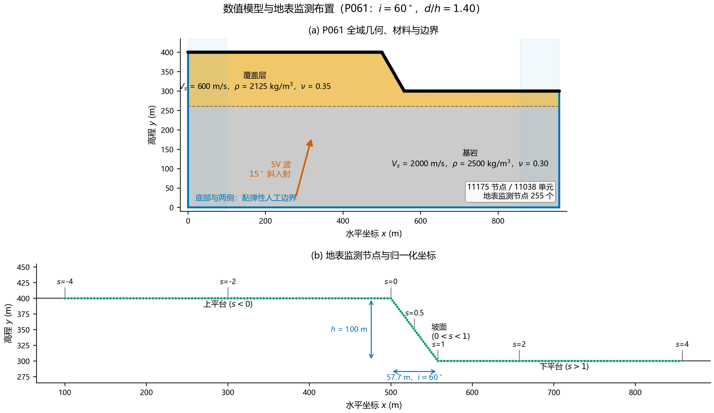

图1 二维成层坡地数值模型与监测布置。（a）P061 全域几何、水平材料界面和三侧黏弹性人工边界，浅蓝区域为观测窗外的左右边界净空；该模型含 11175 个节点、11038 个单元和 255 个地表监测节点。（b）地表监测节点与三段归一化坐标，$s=0$、0.5 和 1 分别对应坡顶、坡面中部和坡脚。全部地表点在后处理中使用同一左侧一维自由场参考。

Fig. 1 Numerical model and surface monitoring layout of the two-dimensional layered slope

成层工况采用水平覆盖层—基岩界面。参数 $d$ 表示从上平台地表向下量取的覆盖层厚度，因此 $d/h<1$ 时水平界面会在坡面出露，坡脚一侧可由基岩直接出露；$d/h>1$ 时覆盖层越过坡脚，下平台处的局部厚度为 $d-h$。这一几何口径不同于“沿地表保持等厚”的随地形成层，能够用同一水平界面表达覆盖层由坡顶向坡脚逐渐变薄并可能出露的概化地质。均质 H 工况不设置材料界面，整个域均取基岩参数，因而可作为同坡角条件下剥离覆盖层影响的几何基线。

四个厚度水平还对应不同的材料拓扑。$d/h=0.20$ 和 0.60 时，界面分别位于坡顶地表以下 20 m 和 60 m，并在坡面内部出露，下平台属于基岩地表；$d/h=1.00$ 时界面恰好到达坡脚高程；$d/h=1.40$ 时界面低于坡脚 40 m，覆盖层连续跨过整个坡面并延伸至下平台。厚度变化因此不仅改变一维传播距离，也改变材料界面与坡面交点的位置。本文把这种界面出露状态视为 $d/h$ 所代表的真实几何效应，而没有通过保持下平台覆盖层厚度不变来人为消除它。相应地，后文观察到的厚度效应应理解为这一水平成层模型中的综合效应，不能直接外推到沿坡面等厚覆盖层。

基岩剪切波速为 $V_{\mathrm{s,b}}=2000\ \mathrm{m/s}$，密度为 $2500\ \mathrm{kg/m^3}$，泊松比为 0.30；覆盖层密度固定为基岩的 0.85 倍，即 $2125\ \mathrm{kg/m^3}$，泊松比为 0.35，剪切波速由速度比 $r_v=V_{\mathrm{s,c}}/V_{\mathrm{s,b}}$ 控制。材料的剪切模量、弹性模量和压缩波速均由波速、密度与泊松比一致换算，而非彼此独立指定：

$$
G=\rho V_{\mathrm{s}}^2,\qquad
E=2G(1+\nu),\qquad
V_{\mathrm{p}}=V_{\mathrm{s}}\sqrt{\frac{2(1-\nu)}{1-2\nu}}. \tag{3}
$$

式（3）保证改变 $r_v$ 时材料刚度与波速定义相容。覆盖层与基岩的阻尼分别取 3% 和 0.05%，均通过 Rayleigh 质量与刚度比例项实现。目标阻尼比与圆频率的关系为

$$
\xi(\omega)=\frac{\alpha_{\mathrm R}}{2\omega}+\frac{\beta_{\mathrm R}\omega}{2}, \tag{4}
$$

其中 $\alpha_{\mathrm R}$ 和 $\beta_{\mathrm R}$ 采用双频等阻尼拟合。令 $\omega_j=2\pi f_j$，则 $\alpha_{\mathrm R}=2\xi\omega_1\omega_2/(\omega_1+\omega_2)$、$\beta_{\mathrm R}=2\xi/(\omega_1+\omega_2)$，$f_c$ 为由G1b输入谱估计的主频。基岩取 $f_1=0.5f_c$、$f_2=2.5f_c$；覆盖层另以 $f_s=V_{\mathrm{s,c}}/(4d)$ 约束标定带，取 $f_1=\min(0.5f_c,f_s)$、$f_2=\max(2.5f_c,3f_s)$。例如P061的 $f_c=1.953125$ Hz、$f_s=1.07143$ Hz，基岩 $\alpha_{\mathrm R}=0.005113$ s$^{-1}$、$\beta_{\mathrm R}=2.716\times10^{-5}$ s，覆盖层分别为0.306796 s$^{-1}$和$1.630\times10^{-3}$ s。本文研究的是低阻尼基岩上的软覆盖层线性波动，3% 覆盖层阻尼用于抑制不现实的无限尖锐共振，但不代表强震下随应变变化的等效阻尼。模型的材料、几何与输入参数汇总于表2。

由式（3）可得，基岩剪切模量和弹性模量分别为 10.0 GPa 和 26.0 GPa，压缩波速约为 3742 m/s。覆盖层在 $r_v=0.30$—0.75 范围内的剪切模量为 0.765—4.781 GPa，弹性模量为 2.066—12.909 GPa，压缩波速约为 1249—3122 m/s。即使在最硬覆盖层水平，其密度、泊松比和波阻抗仍与基岩不同；$r_v=0.75$ 不能被视为均质退化工况。真正的均质参照必须使用 H 组，因为只有 H 组同时消除了速度、密度、泊松比、阻尼及材料界面差异。

表2 数值模型的材料、几何与输入参数

Table 2 Material, geometric and input parameters of the numerical model

| 类别 | 参数                                      |       基岩或固定值 |     覆盖层或变化范围 |
| ---- | ----------------------------------------- | -----------------: | -------------------: |
| 几何 | 坡高$h$/m                               |                100 |                  100 |
| 几何 | 坡角$i$/(°)                            |     15、30、45、60 |         与基岩域一致 |
| 几何 | 上平台观测窗/边界净空                     |          $4h/1h$ |         与基岩域一致 |
| 几何 | 下平台观测窗/边界净空                     |          $3h/1h$ |         与基岩域一致 |
| 几何 | 坡脚以下基底深度                          |             $3h$ |         与基岩域一致 |
| 材料 | 剪切波速$V_{\mathrm s}$/(m·s$^{-1}$) |               2000 | 600、900、1200、1500 |
| 材料 | 密度$\rho$/(kg·m$^{-3}$)             |               2500 |  2125（密度比 0.85） |
| 材料 | 泊松比$\nu$                             |               0.30 |                 0.35 |
| 材料 | 阻尼比$\xi$                             |              0.05% |                   3% |
| 地层 | 上平台覆盖层厚度$d$/m                   |                 — |     20、60、100、140 |
| 输入 | SV 波入射角/(°)                          | 15（相对竖直方向） |   15（相对竖直方向） |
| 输入 | 宽频识别信号峰值                          |               0.1g |                 0.1g |

物理参数矩阵由坡角 $i$、厚度比 $d/h$ 与速度比 $r_v$ 三个维度构成。P 组在 $i\in\{15^\circ,30^\circ,45^\circ,60^\circ\}$、$d/h\in\{0.20,0.60,1.00,1.40\}$ 和 $r_v\in\{0.30,0.45,0.60,0.75\}$ 上进行 $4\times4\times4$ 全因子组合，共 64 个成层工况 P001—P064。H 组由四个同坡角均质基岩坡 H001—H004 构成，与 P 组共享坡高、计算域、入射角和输入信号。因坡高、密度比和入射角均固定，P 组内部任意两个工况的差异只来自三个研究参数，避免了把尺寸效应、密度变化或入射方向变化混入覆盖层参数比较。

除 H/P 主工况外，本章使用V组和X组分别检查数值设置敏感性与跨软件一致性。V组以P061为共同基准，每次只改变一项数值设置；X组使用独立求解器重建H004与P061。用于代理训练外评价的B组和用于真实波闭环的C组不参与本章的数值模型验证，其样本组织和隔离关系在第4章首次使用处说明。表3汇总本章涉及的建模与验证工况。

表3 数值建模与验证工况的数量及用途

Table 3 Numerical-model and verification case pools used in this chapter

| 工况组 |                            数量 | 参数或对象                         | 本文中的用途                 | 是否用于 H/P 参数规律 |
| ------ | ------------------------------: | ---------------------------------- | ---------------------------- | --------------------- |
| H      |                               4 | 四个坡角的均质基岩坡               | 提供同坡角几何基线           | 是                    |
| P      |                              64 | $4\times4\times4$ 成层全因子网格 | 参数规律分析与代理模型发展池 | 是                    |
| V      | 4 个扰动工况，另含共同基准 P061 | 网格、尾段、侧向净空、基底深度     | 单因素数值设置敏感性         | 否                    |
| X      |     5 个求解模型，形成 3 组比较 | H004、P061；Abaqus 与 SPECFEM2D    | 跨软件独立数值佐证           | 否                    |

H/P工况回答二维坡形与水平成层组合产生何种响应，V/X工况只判断关键响应是否可能由数值设置或求解器选择造成。V或X的比较结果不增加参数规律的样本量，P工况数量也不能替代验证证据。

#### 2.1.2 网格、边界与地震动输入

空间离散由正式分析频带内的最短剪切波长控制。本文分析上限为 10 Hz，最软覆盖层的 $V_{\mathrm{s,c}}=600\ \mathrm{m/s}$，对应最短剪切波长 $\lambda_{\min}=60\ \mathrm{m}$。标准工况以 4 m 为覆盖层基准单元尺寸，最不利情况下每个最短波长约含 15 个单元，高于预设网格准则中每波长不少于 10 个单元的控制值。成层模型采用分层渐变网格：最软层保持 4 m 级尺寸，较高波速介质可按波速比放宽，但最粗与最细尺寸之比不超过 4，同时要求每一有限层厚度方向至少布置 6 个单元。该策略把计算量集中在短波长覆盖层和界面附近，并避免基岩深部沿用不必要的等尺寸细网格。V001 另以全局均匀 1 m 网格重算最不利工况，用于直接检查标准分级网格是否改变关键响应。

P061 的实际网格含 11038 个单元和 11175 个节点，地表原始监测节点为 255 个。图1中的材料界面与坡面交点均由几何分区显式生成，覆盖层和基岩分别赋予截面，不依赖积分点坐标的运行时判断；边界节点的材料参数则按其所属地层逐点读取。采用 CPE4R 时，减缩积分可能产生的非物理零能模式由 Abaqus 沙漏控制处理，计算记录同时保留人工应变能与总能量用于异常诊断。本文没有把“单元数量多”本身当作充分性证据，网格可接受性仍以图2的波长分辨率和 V001 的响应对比共同判断。

动力输入采用 G1b 宽频多正弦加速度信号。原始记录由 8192 个采样点组成，时间为 0—8.191 s，采样间隔为 0.001 s，峰值统一调幅至 0.1g。信号在 0.5—12 Hz 内提供近似连续激励，0.5—10 Hz 用于正式分析，10—12 Hz 仅作为频带边缘诊断。在线性体系中，一次宽频计算能够同时激发多个频率成分，从而避免为每一单频重复建模；本章只说明这种输入的数值实现，系统识别及复数响应的提取将在第3章定义。输入结束后附加 6 s 零输入尾段，使标准分析总时长达到约 14.191 s；隐式动力步采用与输入一致的 0.001 s 固定增量，并保存地表节点逐步加速度。图2给出了输入时程、幅值谱及最短波长与网格尺度的对应关系。

G1b并非天然地震记录或人为任意绘制的时程，而是为线性体系总波场响应函数识别确定性构造的人工激励。令 $N=8192$、$\Delta t=0.001\ \mathrm{s}$、$t_n=n\Delta t$，离散频率为 $f_k=k/(N\Delta t)$，相邻频率间隔为 $\Delta f=0.12207\ \mathrm{Hz}$。未经首尾和漂移处理的信号由 $M=100$ 个离散频率分量叠加得到：

$$
a_0(t_n)=\frac{2}{N}\sum_{r=0}^{M-1}E(f_{k_r})
\cos\!\left(2\pi f_{k_r}t_n+\phi_r\right),
\qquad n=0,1,\ldots,N-1. \tag{4a}
$$

式中，$f_{k_r}$ 为频谱包络非零的离散频率，实际范围为0.3662～12.4512 Hz。频率分量的相对幅值采用带余弦肩部的平顶包络：

$$
E(f)=
\begin{cases}
0, & f<0.35,\\
\dfrac{1}{2}-\dfrac{1}{2}\cos\!\left[\pi\dfrac{f-0.35}{0.50-0.35}\right],
&0.35\leq f<0.50,\\
1, &0.50\leq f\leq12.0,\\
\dfrac{1}{2}+\dfrac{1}{2}\cos\!\left[\pi\dfrac{f-12.0}{12.5-12.0}\right],
&12.0<f\leq12.5,\\
0, &f>12.5,
\end{cases} \tag{4b}
$$

其中频率单位均为Hz。0.5～12 Hz平顶段使不同频率获得近似均匀的激励能量，两侧余弦肩部则避免频带边缘发生幅值突变。各分量采用确定性的Schroeder相位：

$$
\phi_r=-\frac{\pi r(r-1)}{M},
\qquad r=0,1,\ldots,M-1. \tag{4c}
$$

该相位设计使不同频率分量的峰值在时间上错开，降低多频同相叠加造成的瞬时尖峰；最终采用的G1b-A信号峰均比为1.777。为使输入由零平滑建立并在末端回到零，式（4a）所得时程首尾各施加0.75 s半余弦渐入—渐出窗；随后利用端点为零的平滑基函数消除离散积分残差及速度线性趋势，记处理后的信号为 $a_c(t_n)$。最终输入按下式统一缩放：

$$
a_{\mathrm{in}}(t_n)=a_{\mathrm{PGA}}
\frac{a_c(t_n)}{\max_n\lvert a_c(t_n)\rvert},
\qquad a_{\mathrm{PGA}}=0.1g=0.981\ \mathrm{m/s^2}. \tag{4d}
$$

因此，G1b的时程形态由频率集合、幅值包络和Schroeder相位共同唯一确定，首尾渐变和漂移校正只用于保证有限时长输入的连续性与积分稳定性，不改变其作为0.5～10 Hz宽频系统识别信号的用途。按与后处理一致的四倍补零频谱及5%输入谱阈值检查，0.5～10 Hz内候选频点的有效覆盖率为100%。

固定增量使输入、自由场等效力与有限元输出共享同一时间轴，避免可变步插值在相位计算前额外引入时间误差。10 Hz 成分的周期为 0.1 s，一个周期包含 100 个增量；即使将 12 Hz 存储上限纳入检查，也仍约含 83 个增量。地表全时程每步输出，内部场量则按较低频率保存以控制Abaqus输出数据库（output database，ODB）规模。后处理先核对时轴单调性、通道有限性和输入记录身份，再提取公共频带；公共 161 点地表网格由原始节点曲线插值获得，而不是把插值后的每个点当成新的有限元自由度。

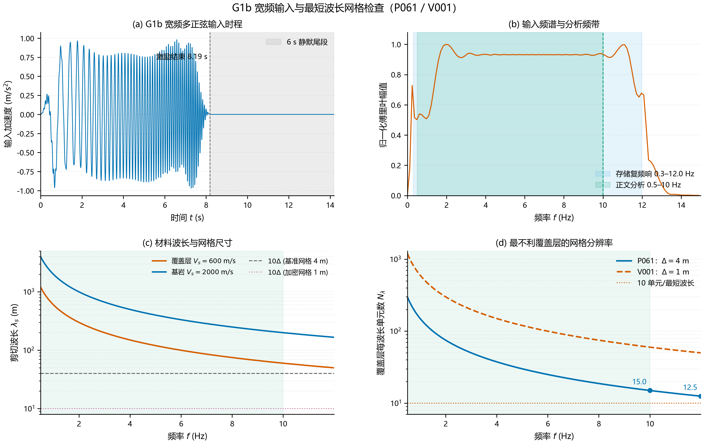

图2 G1b 宽频多正弦输入与网格分辨率。（a）0—8.191 s 激励时程及其后的 6 s 静默尾段；（b）归一化输入频谱、0.3—12 Hz 存储频带和 0.5—10 Hz 正式分析带；（c）覆盖层与基岩剪切波长随频率的变化，并以水平线标出 4 m 与 1 m 网格的 10 单元/波长控制尺度；（d）P061 标准网格和 V001 加密网格在各频率下的每波长单元数。最软覆盖层在 10 Hz 时的最短波长为 60 m，P061 与 V001 分别约含 15 个和 60 个单元。

Fig. 2 Broadband excitation and mesh resolution within the analysis frequency band

有限元模型只截取坡体附近的有限区域，因此地震动输入需要同时解决两个问题：一是让坡体产生的散射波离开计算域时尽量不发生反射，二是把原本存在于无限场地中的斜入射自由场准确施加到截断边界。本文分别用黏弹性人工边界和自由场等效节点力完成这两项工作。前者负责吸收散射场，后者负责恢复被截断域外介质所传入的地震波；二者使用相同的节点材料、影响长度和时间基准。

左、右和底部边界均设置并联的法向、切向弹簧—阻尼器，地表保持自由。对边界节点 $l$，节点弹簧刚度和阻尼系数为

$$
\begin{aligned}
K_{\mathrm N,l}&=\alpha_{\mathrm N}\frac{\lambda_l+2G_l}{R}A_l,
&C_{\mathrm N,l}&=\beta_{\mathrm N}\rho_l V_{\mathrm p,l}A_l,\\
K_{\mathrm T,l}&=\alpha_{\mathrm T}\frac{G_l}{R}A_l,
&C_{\mathrm T,l}&=\beta_{\mathrm T}\rho_l V_{\mathrm s,l}A_l.
\end{aligned} \tag{5}
$$

式中，$A_l$ 为二维单位厚度模型中节点的代表边界长度；$\lambda_l$、$G_l$、$\rho_l$、$V_{\mathrm p,l}$ 和 $V_{\mathrm s,l}$ 按节点所在覆盖层或基岩逐点取值。线性单元边界上的内部节点取两侧相邻边长之和的一半，端点取单侧相邻边长的一半，成层界面处不跨材料平均。本文取 $\alpha_{\mathrm N}=\alpha_{\mathrm T}=1/[2(1+0.8)]=0.27778$、$\beta_{\mathrm N}=\beta_{\mathrm T}=1.1$，其余弹簧、阻尼器缩放系数均为1。阻尼器近似吸收向外传播的P、S波，弹簧则补偿截断介质的低频恢复作用[32]。

参考距离 $R$ 采用半对角线模式（half_diagonal），即取计算域包络矩形半对角线的长度：

$$
R=\sqrt{\left(\frac{L}{2}\right)^2+\left(\frac{H}{2}\right)^2}. \tag{5a}
$$

标准H/P模型满足 $L=(9+\cot i)h$、$H=4h$，四种坡角对应的 $R$ 分别为667.3、572.7、538.5和519.0 m。同一模型的所有边界节点共用一个 $R$，但不同坡角或计算域采用各自的几何值；V004加深基底后取 $H=7h$，得到 $R=593.1$ m。

为说明等效节点力的来源，将总波场分解为无坡成层场地中的自由场和由坡体引起的散射场：

$$
\mathbf u=\mathbf u^{\mathrm{ff}}+\mathbf u^{\mathrm{sc}},\qquad
\boldsymbol\sigma=\boldsymbol\sigma^{\mathrm{ff}}+\boldsymbol\sigma^{\mathrm{sc}}.
$$

人工边界的弹簧—阻尼器用于吸收散射场；把上述分解代入边界平衡关系后，需要在节点 $l$ 处补加自由场引起的Bielak等效力[33]：

$$
\mathbf F_l(t)=\mathbf K_l\mathbf u_l^{\mathrm{ff}}(t)
+\mathbf C_l\dot{\mathbf u}_l^{\mathrm{ff}}(t)
+A_l\boldsymbol\sigma_l^{\mathrm{ff}}(t)\mathbf n_l. \tag{6}
$$

式中，$\mathbf n_l$ 为外法向，$\mathbf K_l$ 和 $\mathbf C_l$ 将式（5）的法向、切向系数映射到全局水平和竖直自由度。式（6）表明，每个边界节点都需要同一自由场的位移、速度和应力，而不是只在底边输入一条加速度时程。这样既保留了15°斜入射在不同坐标处的到时差，也使入射波与三侧吸收边界采用一致的介质参数。

式（6）所需的自由场不是另建平地Abaqus模型获得，而是用频域全局矩阵法直接求解对应的一维成层柱。设基岩半空间为第0层，其上有 $M$ 个有限覆盖层，时间因子取 $e^{\mathrm i\omega t}$。基岩中给定单位幅值上行SV波，其相对竖直方向的入射角为 $\theta_{\mathrm s}=15^\circ$；各层共享水平慢度 $p=\sin\theta_{\mathrm s}/V_{\mathrm{s,b}}$。第 $m$ 层同时保留上、下行P波和SV波，位移与应力统一写成

$$
\mathbf z^{(m)}(x,y,\omega)=
\mathbf H^{(m)}(y,\omega)\mathbf a^{(m)}(\omega)
e^{-\mathrm i\omega px},\qquad
\mathbf a^{(m)}=
\begin{bmatrix}a_{P_u}^{(m)}&a_{P_d}^{(m)}&a_{S_u}^{(m)}&a_{S_d}^{(m)}\end{bmatrix}^{\mathrm T}. \tag{7}
$$

其中，$\mathbf z^{(m)}=[u_x,u_y,\sigma_{xx},\sigma_{yy},\sigma_{xy}]^{\mathrm T}$，$\mathbf H^{(m)}$ 是由波的极化关系、材料参数和竖向传播相位组成的状态矩阵。P波和SV波的竖向慢度为

$$
q_{\mathrm p}^{(m)}=\sqrt{\frac{1}{\widetilde V_{\mathrm p}^{(m)2}}-p^2},\qquad
q_{\mathrm s}^{(m)}=\sqrt{\frac{1}{\widetilde V_{\mathrm s}^{(m)2}}-p^2}. \tag{7a}
$$

上、下行波分别使用正、负竖向慢度，复平方根选取 $\operatorname{Im}(q)\leq0$ 的衰减分支。上行波的竖向相位从层底计算，下行波从层顶计算，避免厚软层中的指数项无界增长。

基岩入射上行SV波的幅值固定为1，基岩中的下行P、SV反射波以及每个有限层中的四支波作为未知量。各层界面满足 $u_x$、$u_y$、$\sigma_{xy}$ 和 $\sigma_{yy}$ 连续，最上部自由表面满足 $\sigma_{yy}=\sigma_{xy}=0$，逐频组成

$$
\mathbf A(\omega)\mathbf x(\omega)=\mathbf b(\omega),\qquad
\left.\sigma_{yy}\right|_{\mathrm{surface}}=
\left.\sigma_{xy}\right|_{\mathrm{surface}}=0,\qquad
\llbracket u_x,u_y,\sigma_{xy},\sigma_{yy}\rrbracket=\mathbf 0. \tag{8}
$$

含 $M$ 个有限层时，$\mathbf x$ 共包含 $4M+2$ 个复波幅。本文双层工况有 $M=1$，每个频点求解一个 $6\times6$ 复线性方程组；均质H工况取 $M=0$，退化为 $2\times2$ 自由面反射问题。所有上、下行P/SV波在界面处同时联立，因此不需要预先规定反射次数，P—SV转换、界面透反射及任意阶层间多次波均包含在逐频解中。

为使一维自由场与Abaqus域内材料具有相同的Rayleigh阻尼，频域求解采用

$$
\widetilde\rho=\rho\left(1-\mathrm i\frac{\alpha_{\mathrm R}}{\omega}\right),\qquad
\widetilde G=G(1+\mathrm i\omega\beta_{\mathrm R}),\qquad
\widetilde\lambda=\lambda(1+\mathrm i\omega\beta_{\mathrm R}). \tag{9}
$$

其中 $\alpha_{\mathrm R}$ 和 $\beta_{\mathrm R}$ 与式（4）中的逐层参数相同，复波速由 $\widetilde V_{\mathrm s}=\sqrt{\widetilde G/\widetilde\rho}$ 和 $\widetilde V_{\mathrm p}=\sqrt{(\widetilde\lambda+2\widetilde G)/\widetilde\rho}$ 得到。这样，自由场与有限元域在同一频率下具有一致的衰减和相位速度，避免边界内外阻尼口径不同而引入附加反射。

实际输入从加速度时程开始。程序先对 $a_{\mathrm{in}}(t)$ 作四倍补零快速傅里叶变换，并由 $U_0(\omega)=-\widehat a_{\mathrm{in}}(\omega)/\omega^2$ 得到入射位移谱。只对输入幅值高于谱峰值 $10^{-7}$ 倍的非零频率求解式（8）。随后在每个边界节点的真实高程 $y_l$ 处评价单位入射状态，并乘输入位移谱和水平传播相位：

$$
\widehat{\mathbf z}_l(\omega)=
\mathbf z_{\mathrm{unit}}(y_l,\omega)U_0(\omega)
\exp[-\mathrm i\omega p(x_l-x_{\mathrm{ref}})],\qquad
\widehat{\mathbf v}_l(\omega)=\mathrm i\omega\widehat{\mathbf u}_l(\omega). \tag{9a}
$$

本文取统一相位原点 $x_{\mathrm{ref}}=0$。频域相位与时域延迟满足

$$
\widehat g(\omega)e^{-\mathrm i\omega\tau}
\overset{\mathcal F^{-1}}{\longleftrightarrow}g(t-\tau),\qquad
\tau_{x,l}=p(x_l-x_{\mathrm{ref}}). \tag{9b}
$$

因此，式（9a）的水平相位直接给出入射波传播到节点 $l$ 的水平到时差。竖向到时包含在状态矩阵的传播相位中，界面透反射和多次往返的到时则包含在式（8）所求复波幅的相位中。频域方法不再逐条枚举 $\Delta t_1,\Delta t_2,\ldots$；全部传播路径的幅值和到时统一保存在逐频复数解中，再通过逆变换恢复时程。无阻尼时，相位因子等价于确定的时间平移；计入阻尼后，复波速和复波幅随频率变化，传播同时包含延迟、衰减和频散，不能再用单一常数延迟表示。

将 $\widehat{\dot{\mathbf u}}_l^{\mathrm{ff}}=\mathrm i\omega\widehat{\mathbf u}_l^{\mathrm{ff}}$ 代入式（6），等效节点力的频域表达为

$$
\widehat{\mathbf F}_l(\omega)=
\left(\mathbf K_l+\mathrm i\omega\mathbf C_l\right)
\widehat{\mathbf u}_l^{\mathrm{ff}}(\omega)
+A_l\widehat{\boldsymbol\sigma}_l^{\mathrm{ff}}(\omega)\mathbf n_l. \tag{9c}
$$

由此，位移、速度、应力和传播延迟使用同一频率、节点坐标和相位基准，不需要在时域单独移动各条波。整套计算链可概括为：输入加速度时程经傅里叶变换得到频谱，成层柱在单位入射条件下逐频求解，各边界节点的自由场由节点坐标和传播相位确定，再经逆变换恢复为时程并组装成等效节点力，最终以集中力幅值输入Abaqus。具体而言，程序把位移、速度和应力谱分别补回完整共轭频谱并作逆快速傅里叶变换；随后按增量初态扣除 $u_l(0)+\dot u_l(0)t$、$\dot u_l(0)$ 和 $\sigma_l(0)$，再在每个时间增量按式（6）组装水平、竖直节点力。两个方向的力时程作为Abaqus集中力幅值施加。左、右边界的外法向牵引分别为 $(-\sigma_{xx},-\sigma_{xy})$ 和 $(\sigma_{xx},\sigma_{xy})$，底边界为 $(-\sigma_{xy},-\sigma_{yy})$；角点同时累加相邻两条边界的贡献。

本文采用全局上平台柱作为建模阶段的背景自由场：左、右和底部三条截断边界共享自由面高程为 $4h$ 的同一成层柱，但自由场仍在每个节点的真实 $(x_l,y_l)$ 坐标处求值。这一设置决定式（6）的边界荷载，会直接影响有限元解。后处理中“全地表统一除以左侧自由场”只决定总波场响应函数的幅值参考，不会改变已经得到的有限元总波场时程；随后扣除的水平传播相位同样只是单位模后处理变换，两者都不能与建模自由场混为一谈。

数值实现中，四倍补零用于减弱循环卷绕，输入谱阈值用于跳过无有效激励的频点，层顶—层底局部相位和全局矩阵整体求解用于避免厚软层中的指数上溢。建模前还自动执行均质半空间和单层解析退化自检，任一相对误差超过 $10^{-3}$ 即中止；P061记录的两项误差分别为 $1.11\times10^{-16}$ 和 $3.55\times10^{-16}$。这些措施用于检查自由场引擎的代数实现和数值稳定性，不改变0.1g输入标定，也不对二维结果作事后缩放。

后处理参考场取自上平台成层柱自由表面的水平响应，并用于全部地表位置。该参考场只确定总波场响应函数的幅值和相位基准，不改变有限元求得的地表加速度时程。第3章在此基础上定义并分析扣除斜入射水平传播相位后的总波场响应函数。

表4列出标准 H/P 工况的数值计算设置。参数表同时保留了 V 组单因素扰动的基准值，使网格、时窗和计算域的验证对象可从正文直接复现。地表输出先保存在原有限元节点上，后续比较才确定性插值至公共 $s$ 网格；因此，公共网格并非求解阶段人为设置的 161 个独立节点样本。

表4 标准工况的数值计算设置

Table 4 Numerical settings of the standard simulations

| 项目             |                                      标准设置 | 选择依据或说明                                  |
| ---------------- | --------------------------------------------: | ----------------------------------------------- |
| 求解器与单元     | Abaqus/Standard 2021；CPE4R为主、少量CPE3过渡 | 二维平面应变、隐式线性动力                      |
| 覆盖层基准网格   |                                           4 m | 10 Hz、$V_s=600$ m/s 时约 15 单元/波长        |
| 分层网格         |                 启用；最粗/最细尺寸比不超过 4 | 软层细、基岩深部渐粗；每层厚度方向不少于 6 单元 |
| 时间增量         |                              0.001 s 固定增量 | 与输入采样间隔一致；10 Hz 周期含 100 个增量     |
| 输入有效持时     |                                       8.191 s | G1b 宽频多正弦，8192 点                         |
| 静默尾段         |                                           6 s | 降低记录截断与晚时残余的影响                    |
| 总分析时长       |                                   约 14.191 s | 输入时段与静默尾段之和                          |
| 正式分析频带     |                                    0.5—10 Hz | 10—12 Hz 仅用于边缘诊断                        |
| 侧向净空         |                                左、右各$1h$ | 位于正式观测窗之外                              |
| 基底深度         |                                坡脚以下$3h$ | 配合底部黏弹性边界                              |
| 人工边界         |                          左、右、底黏弹性边界 | 地表为自由边界                                  |
| 人工边界参考尺度 | $R=\sqrt{(L/2)^2+(H/2)^2}$，标准工况为519.0～667.3 m | half_diagonal模式，随坡角和计算域尺寸变化 |
| 人工边界公式系数 | $\alpha_{\mathrm N}=\alpha_{\mathrm T}=0.27778$；$\beta_{\mathrm N}=\beta_{\mathrm T}=1.1$ | 弹簧、阻尼器附加缩放系数均为1 |
| 波动输入         |                频域全局矩阵自由场与等效节点力 | 15° SV 斜入射，包含 P—SV 转换与多次波         |
| 自由场参考模式   |                                  全局上平台柱 | 三边界统一上平台成层柱定义；按节点真实坐标取值  |

### 2.2 数值模型验证

数值验证围绕两类不同风险展开。V 组针对 Abaqus 模型内部设置：若减小网格、延长尾段或扩大计算域便显著改变坡体关键位置的主峰，则参数规律可能只是离散或边界产物。X 组针对求解方法：即使同一 Abaqus 设置内部稳定，低阶有限元的空间离散、隐式时间推进和人工边界实现仍可能形成系统偏差，因此需要由高阶谱元程序在公共输入和公共接收点上提供独立比较。这两道验证共享“先固定比较口径、再查看结果”的原则，但承担的证明责任不同，不能用其中一道代替另一道。

#### 2.2.1 数值设置敏感性

V 组选择 P061 作为共同基准。该工况取 $i=60^\circ$、$d/h=1.40$ 和 $r_v=0.30$，同时具有研究域内最陡坡面、最厚覆盖层和最低覆盖层剪切波速。其 10 Hz 最短剪切波长仅 60 m，坡面水平投影约 57.7 m，覆盖层共振和坡体散射均可能形成较陡的空间—频率变化，因而比缓坡或较硬覆盖层更容易暴露网格与边界不足。V001 将标准分级网格改为全局均匀 1 m 网格；V002 仅把静默尾段由 6 s 延长至 12 s；V003 仅把左右侧向净空由 $1h$ 扩大到 $2h$；V004 仅把坡脚以下基底深度由 $3h$ 加深至 $6h$。除指定变量外，几何、材料、阻尼、输入、边界算法和后处理流程均与 P061 相同。

验证关注两个直接决定后续物理判读的主要量：坡顶 $s=0$ 处主峰频率误差不超过 0.2 Hz，坡面中部 $s=0.5$ 处峰值幅值相对变化的绝对值不超过 5%。全场对数幅值均方根误差、加权复场误差和圆周相位误差作为辅助指标，用于识别关键位置判据可能遗漏的空间差异。P061 与 V001—V004 的上平台、坡面和下平台均以左侧上平台一维自由场为参考，不对坡脚邻域做桥接或平滑。式（13）给出 $G_h$ 的计算式、有效掩码和相位处理。若以 $G_0$ 和 $G_{\mathrm{var}}$ 表示基准与扰动工况在公共频率—空间网格上的归一化复响应，则主要指标和辅助对数幅值误差写为

$$
\begin{aligned}
e_f&=\left|f_{\mathrm{pk,var}}(s=0)-f_{\mathrm{pk},0}(s=0)\right|,\\
e_A&=\frac{A_{\mathrm{pk,var}}(s=0.5)-A_{\mathrm{pk},0}(s=0.5)}{A_{\mathrm{pk},0}(s=0.5)}\times100\%,\\
E_{\ln A}&=\sqrt{\frac{1}{N}\sum_{(f,s)\in\Omega}
\left[\ln|G_{\mathrm{var}}(f,s)|-\ln|G_0(f,s)|\right]^2}.
\end{aligned} \tag{10}
$$

式（10）中的 $\Omega$ 为 0.5—10 Hz、$s=-4$—4 公共网格上的共同有效点，$N$ 为 $\Omega$ 内的网格点数。$e_A$ 保留正负号以说明增减方向，幅值主判据实际采用 $\lvert e_A\rvert\leq5\%$。主要判据以关键位置的峰频与幅值为对象，辅助指标则同时受远平台、频带边缘和相位基准影响。主要判据满足只说明预定研究量对设置变化稳定，并不等于全场每一点已经收敛；辅助指标较大时仍需保留数值不确定性。

V003 扩大侧向净空后，保持相同 $s$ 值会使相应地表点的实际 $x$ 坐标整体平移 100 m。15° 斜入射波在两坐标间存在确定的水平传播时差，若直接比较复相位，会把几何坐标原点变化误认为计算域误差。为此只对 V003 的复场辅助指标扣除理论平移相位：

$$
\Delta t_x=\frac{\Delta x\sin\theta_{\mathrm s}}{V_{\mathrm{s,b}}},\qquad
G_{\mathrm{var,align}}(f,s)=G_{\mathrm{var}}(f,s)\exp(\mathrm{i}2\pi f\Delta t_x). \tag{11}
$$

本工况 $\Delta x=100\ \mathrm m$，故 $\Delta t_x=0.01294095\ \mathrm s$。式（11）不缩放幅值，也不消除由侧边距离、吸收边界或散射传播路径变化产生的真实差异；峰值幅值和峰频主要判据均由原数据直接计算。V003只改变水平坐标，地表对应点的竖向坐标未变，因此这里只扣除水平传播相位，不另作高度修正。

图3从坡顶与坡面中部的频谱曲线、全地表频带峰值空间分布以及归一化判据四个层面展示数值设置敏感性，精确数值列于表5。四个扰动工况的坡顶主峰频率误差为 0、0、0.1 和 0 Hz，坡面中部峰值幅值变化分别为 0.572%、0.001%、1.508% 和 0.891%，全部低于预定的 0.2 Hz 与 5% 参考线。主要研究量没有因网格加密、尾段加长或计算域扩大而发生量级上的改变。

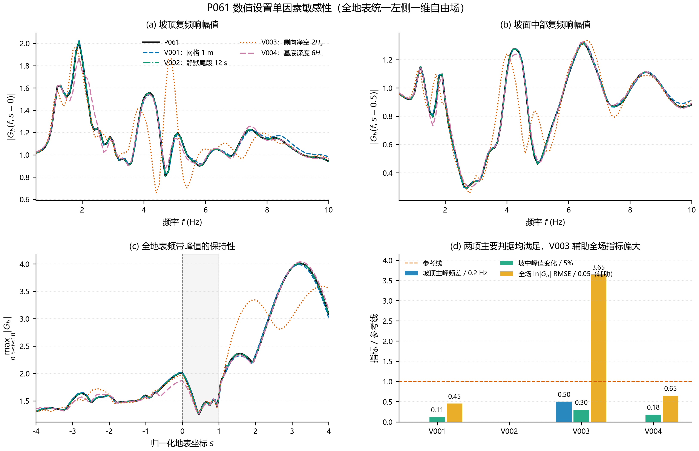

图3 P061 基准与 V001—V004 数值设置敏感性比较。（a）坡顶 $s=0$ 处总波场响应函数幅值；（b）坡面中部 $s=0.5$ 处总波场响应函数幅值；（c）各地表位置在 0.5—10 Hz 内的幅值最大值；（d）坡顶主峰频率误差、坡面中部峰值变化和全场 $\ln\lvert G_h\rvert$ RMSE 分别除以 0.2 Hz、5% 和 0.05 参考线后的结果。RMSE 为均方根误差。全部地表统一采用左侧自由场分母；V003 的复场辅助指标已扣除理论横向传播相位。

Fig. 3 Sensitivity of the P061 response to mesh, record tail and computational-domain settings

表5 P061 基准下的 V001—V004 数值设置敏感性结果

Table 5 Numerical-setting sensitivity results against the P061 baseline

| 工况 | 单因素变化                       | 坡顶主峰频率误差/Hz | 坡面中部峰值变化/% | 全场$\ln\lvert G_h\rvert$ RMSE | 加权复场误差 | 圆周相位 RMSE/(°) | 局部主判据满足情况 |
| ---- | -------------------------------- | ------------------: | -----------------: | -------------------------------: | -----------: | -----------------: | ------------------ |
| V001 | 标准分级网格改为全局均匀 1 m     |                 0.0 |             +0.572 |                           0.0227 |       0.0510 |              2.958 | 满足               |
| V002 | 静默尾段 6 s 延长至 12 s         |                 0.0 |             +0.001 |                         0.000102 |     0.000119 |              0.006 | 满足               |
| V003 | 左右侧向净空$1h$ 扩大至 $2h$ |                 0.1 |             +1.508 |                           0.1824 |       0.2605 |             10.792 | 满足；全场差异明显 |
| V004 | 基底深度$3h$ 加深至 $6h$     |                 0.0 |             +0.891 |                           0.0324 |       0.0490 |              2.408 | 满足；坡顶幅值敏感 |

V001 的全场 $\ln|G_h|$ RMSE 为 0.0227，圆周相位 RMSE 为 2.958°；相较于 1 m 均匀网格，标准 4 m 分级网格仍保持相同坡顶峰频，坡面中部峰值只变化 0.572%。这说明以最短波长为依据的 15 单元/波长分辨率足以稳定当前关键位置响应。该比较的含义是标准网格与更细网格差异较小，而不是证明任意更粗网格均可接受，也不能替代对更高分析频率或更低波速材料重新检查最短波长。

V002 与 P061 几乎重合，其全场对数幅值 RMSE 为 $1.02\times10^{-4}$，圆周相位 RMSE 仅 0.006°。延长尾段后，末 10% 时程的95%分位数（P95）残余比为 $1.77\times10^{-6}$，表明标准 6 s 尾段已经使末端残余降至很低水平。因而，正式频带中的差异不可能主要由 8.191 s 输入在分析终点被突然截断造成；将尾段继续加倍会显著增加隐式求解步数，却没有带来可辨识的关键响应变化。

V003 的结果需要分层解读。坡顶主峰由 1.9 Hz 移至 1.8 Hz，坡面中部主峰由 6.5 Hz 移至 6.6 Hz，坡面峰值变化只有 1.508%，两项主要判据均通过；但其全场 $\ln|G_h|$ RMSE 为 0.1824，加权复场误差为 0.2605，即使扣除了 0.01294 s 理论水平传播时差，圆周相位 RMSE 仍为 10.792°。分区对数幅值 RMSE 从上平台的 0.1156、坡面的 0.1558 增至下平台的 0.2501，圆周相位 RMSE 也由 6.83°、9.20° 增至 14.80°。这说明 $1h$ 与 $2h$ 侧向净空在坡体关键位置给出稳定主峰，但远平台和完整复场仍存在不可忽略的域尺寸残余。本文据此接受 $1h$ 作为当前参数研究的成本—精度折中，同时把 V003 的全场差异作为数值不确定性保留；不能据此声称整个 $s=-4$—4 区间已对侧向域尺寸完全收敛。

V004 的全场 $\ln|G_h|$ RMSE 为 0.0324、加权复场误差为 0.0490，坡顶主峰频率保持 1.9 Hz，坡面中部峰值只增加 0.891%。需要注意，坡顶峰值幅值由 2.015 降为 1.868，变化约为 $-7.3\%$，高于坡面中部的变化；这一局部峰值差异说明加深基底仍会改变部分反射与干涉叠加，却没有造成坡顶峰频迁移或大范围幅值场改变。因此，$3h$ 基底深度足以维持本文预先选定的坡顶峰频和坡面峰值判据，但坡顶峰值的深度敏感性应在解释极值时计入，而不应被全场 RMSE 的较小数值掩盖。

综合四项单因素比较，标准设置在预定关键响应上表现稳定，且最敏感的 P061 角点已经覆盖最低波速、最大厚度与最大坡角的组合。不过，该设计一次只改变一个数值因素，不能排除侧向净空与基底深度同时变化时的交互误差；P061 的通过也不等同于对参数空间每一个工况逐一完成收敛试验。本文因而把 V 组结论限定为：在二维线性、15° SV 入射、G1b 输入和 0.5—10 Hz 频带内，4 m 分级网格、6 s 尾段、$1h$ 侧向净空与 $3h$ 基底深度足以支撑坡顶峰频及坡面中部峰值的参数比较，而完整复场特别是远下平台仍带有以 V003 为代表的域尺寸不确定性。

#### 2.2.2 Abaqus—SPECFEM2D 对比

跨软件验证选取均质坡 H004 和成层坡 P061 两个代表体系。前者对应 $i=60^\circ$ 的均质基岩坡，用于检验坡形散射而不引入材料界面；后者同时包含陡坡、软厚覆盖层和水平界面，用于检验更复杂的透反射与地表散射组合。Abaqus 工况记为 X001-A、X002-A，SPECFEM2D v8.1.0[34] 工况记为 X001-S、X002-S；成层坡另设置加密谱元网格 X002-SR，以区分跨方法差异与谱元网格不足。三组正式比较分别为 X001-A/X001-S、X002-A/X002-S 和 X002-A/X002-SR。

两套求解器采用同一 4 Hz 位移 Ricker 脉冲定义。SPECFEM2D 的初始场以单位位移 Ricker 表示，Abaqus 端施加其解析二阶导数，并统一把 SV 偏振方向的加速度矢量峰值调至 $0.1g=0.980665\ \mathrm{m/s^2}$。单位位移脉冲的解析加速度峰值为 $6\pi^2f_0^2=947.4820\ \mathrm{m/s^2}$，故公共幅值系数为 $0.980665/947.4820=0.0010350223$。公共脉冲含 2001 个点，采样间隔为 0.001 s，峰值时刻为 0.300 s；按加速度幅值谱不低于峰值 5% 的规则，有效频带为 1.6972—11.0916 Hz。SPECFEM2D 输出只乘上述公共系数一次，结果生成后不允许按测点、分量或时段再次移时、缩放或翻转符号。公共地表坐标为 $s=-4.00$—4.00、间隔 0.01 的 801 点，Abaqus 原生地表节点以确定性插值映射到该网格。

SPECFEM2D 采用自由地表以及左、右、底 Stacey 吸收边界，并在三条非自由边界开启 Bielak 入射修正。X001-S 含 5123 个谱元，实际时间步为 0.0001 s；X002-S 含 5232 个谱元，时间步为 0.00005 s；X002-SR 加密至 20398 个谱元，保持与 X002-S 相同的时间步，使加密比较只改变空间离散。三个基岩诊断点用于核对传播方向、偏振与时间原点：X001-S 的主峰时刻误差均小于 0.002 s，实测 $a_z/a_x$ 为 $-0.2648$—$-0.2692$，与理论值 $-\tan15^\circ=-0.26795$ 一致。成层工况中靠近界面的诊断点受透射波影响，不用于深部入射门控；远离界面的两个基岩点主峰时刻误差不超过 0.003 s、偏振比误差不超过 0.019、峰值相对误差不超过 2.6%。这些检查先确认两软件比较的是同一入射波，而不是用地表结果的事后缩放掩盖输入差异。

正式比较针对地表 PGA 空间曲线。对公共 $N_s=801$ 个位置，曲线归一化均方根误差（normalized root-mean-square error，NRMSE）定义为

$$
E_{\mathrm{PGA}}=
\frac{\sqrt{N_s^{-1}\sum_{j=1}^{N_s}
\left[P_{\mathrm A}(s_j)-P_{\mathrm S}(s_j)\right]^2}}
{\sqrt{N_s^{-1}\sum_{j=1}^{N_s}P_{\mathrm A}^2(s_j)}},\qquad
\Delta s_{\mathrm{pk}}=\left|s_{\mathrm{pk,A}}-s_{\mathrm{pk,S}}\right|, \tag{12}
$$

其中 $P_{\mathrm A}$ 与 $P_{\mathrm S}$ 分别为 Abaqus 和 SPECFEM2D 的水平或竖向 PGA 曲线。冻结的主要参考线为水平 $E_{\mathrm{PGA}}\le10\%$、竖向 $E_{\mathrm{PGA}}\le15\%$，两分量均要求 $\Delta s_{\mathrm{pk}}\le0.10$。逐点全时程、公共时刻波场快照和频谱差异保留为辅助诊断，不与 PGA 曲线平权决定“通过”。这是因为地表散射晚时段对有限元与谱元的时间推进、阻尼频率依赖和吸收边界实现更敏感，而本文此处要验证的是支撑参数比较的主要空间分布，不是要求两个离散程序逐采样点完全相同。

图4比较了三组水平、竖向地表 PGA 空间曲线，正式门控与另行计算的频域辅助指标列于表6。X001 的水平、竖向 PGA 曲线 NRMSE 分别为 5.63% 和 7.27%，峰值位置差为 0.02 和 0.07；X002 标准谱元网格的相应结果为 3.62%、10.17%、0.06 和 0.05；X002 加密谱元网格为 4.85%、11.75%、0.03 和 0.04。三组比较均满足预定参考线，说明均质与成层代表工况的地表 PGA 主体空间形态没有随求解器改变。

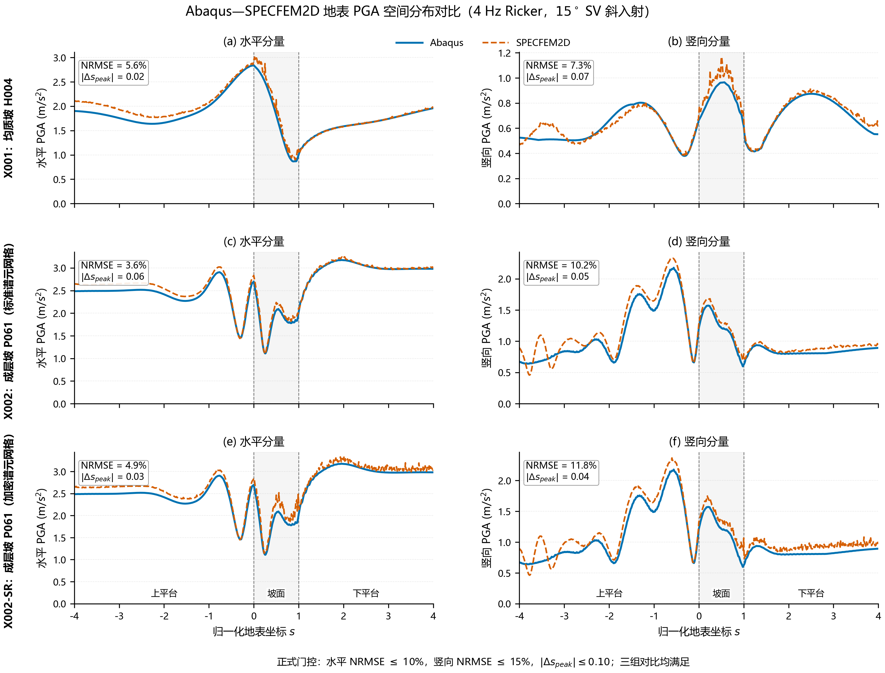

图4 Abaqus 与 SPECFEM2D 的地表 PGA 空间分布对比。（a）、（b）X001 均质坡的水平与竖向分量；（c）、（d）X002 成层坡标准谱元网格的水平与竖向分量；（e）、（f）X002 成层坡加密谱元网格的水平与竖向分量。灰色区域为坡面 $0\le s\le1$，面板内标注曲线归一化均方根误差（NRMSE）与 PGA 峰值位置差；三组对比均满足水平 NRMSE 不超过 10%、竖向 NRMSE 不超过 15% 且峰位差不超过 0.10 的正式门控。

Fig. 4 Cross-software verification between Abaqus and SPECFEM2D for H004 and P061

表6 Abaqus 与 SPECFEM2D 跨软件比较结果

Table 6 Cross-software comparison between Abaqus and SPECFEM2D

| 比较                             | 水平 PGA NRMSE/% | 竖向 PGA NRMSE/% | 水平峰位差$\Delta s$ | 竖向峰位差$\Delta s$ | 水平直接谱 NRMSE 范围 | 水平$G_h$ 型谱比 NRMSE 范围 | PGA空间曲线判据 |
| -------------------------------- | ---------------: | ---------------: | ---------------------: | ---------------------: | --------------------: | ----------------------------: | --------------- |
| X001-A / X001-S（均质坡）        |             5.63 |             7.27 |                   0.02 |                   0.07 |          0.093—0.189 |                  0.184—0.283 | 满足            |
| X002-A / X002-S（成层坡）        |             3.62 |            10.17 |                   0.06 |                   0.05 |          0.157—0.289 |                  0.571—0.725 | 满足            |
| X002-A / X002-SR（成层坡、加密） |             4.85 |            11.75 |                   0.03 |                   0.04 |          0.157—0.289 |                  0.572—0.723 | 满足            |

在 1.7—10 Hz 有效比较频带内，三个固定地表位置的水平直接幅值谱 NRMSE 均不超过 0.289。X001 坡顶、坡面中部和坡脚前方分别为 0.132、0.189 和 0.093；X002 两套谱元网格的三点结果均为 0.289、0.225 和 0.157。水平谱主峰频率偏差总体不超过 0.85 Hz，多数点位不超过 0.12 Hz。直接谱比较表明两种数值方法捕获了相近的主要频谱内容，但 0.5—1.7 Hz 低于 Ricker 有效激励下限，不纳入这一结论。

辅助谱比比直接谱更敏感。均质 X001 三个点的谱比 NRMSE 为 0.184—0.283，成层 X002 则增至 0.571—0.725；X002-S 与 X002-SR 的差别小于 0.01。比值误差同时包含地表响应差异和远场代理差异，成层界面散射又会放大两种离散方法在局部频谱上的偏差，因此不能把 0.57—0.73 解释为完整总波场响应已经高精度吻合。X组谱比仅用于两种求解器之间的幅值诊断，不作为第3章 $G_h$ 的独立验证证据。

逐点时程也揭示了正式门控之外的差异。X001 坡顶水平时程 NRMSE 为 18.79%，相关系数为 0.9822，而坡面中部和坡脚水平时程 NRMSE 分别达到 54.31% 和 60.90%；0.30 s 公共早期波场的水平、竖向 NRMSE 仅为 3.26% 和 3.93%，到 0.60 s 增至 28.05% 和 31.83%。差异随地表相互作用和晚时散射发展而扩大，说明有限元与谱元在离散、阻尼及吸收边界上的方法差异真实存在。X002-S 标准网格反而比 X002-SR 加密网格更接近 Abaqus 的 PGA 曲线，也表明剩余偏差不能简单归因于谱元网格过粗；加密不保证不同数值方法的结果向 Abaqus 单调靠近。

因此，跨软件证据所支持的是一个边界清楚的判断：在本文二维线性、15° SV 入射设置下，对于 H004 均质坡和 P061 成层坡，两套求解器在 4 Hz Ricker 有效频带及地表 PGA 空间分布上给出一致的主要模式，水平直接幅值谱误差处于 0.29 以内。它没有验证 0.5—1.7 Hz 低频段，没有证明逐点晚时散射时程一致，也没有对 96×161 扣除水平传播相位后的总波场响应之相位和群时延提供独立确认。该结论更不能外推到其余坡角、覆盖层组合、真实地震记录、非线性材料或三维地形。V 组与 X 组共同排除了“关键响应完全由标准网格、时窗或单一求解器造成”的主要疑虑，同时保留了 V003 全场域效应和 X002 成层谱比差异这两项明确的不确定性；后续参数规律与代理模型的表述均应在这一证据边界内展开。

## 3 总波场响应函数与参数影响规律

### 3.1 扣除斜入射水平传播相位后的总波场响应函数

坡地表面的地震响应同时随频率和位置变化。若只比较若干时程峰值，同一个放大系数可能对应完全不同的频带结构和到时关系，也无法判断某处峰值是由稳定的场地传递特性造成，还是由特定输入波的瞬时叠加造成。为把输入波的偶然性与坡地本身的线性响应分开，本文采用宽频多正弦信号 G1b 对每个构型进行一次系统识别。该信号的峰值加速度为 0.980 m/s²，主要激励持续至 8.190 s，随后保留 6 s 静默尾段，总计算时长为 14.191 s。原始总波场响应函数存储范围为 0.305～11.994 Hz，正文分析限制在 0.5～10 Hz；10～12 Hz 只用于观察频带边缘，不作为参数规律的正式统计区间。

这套识别首先解决的是“用什么输入把所关心的频带照亮”。如果逐个频率施加稳态正弦波，单个频点容易解释，但每个参数组合都要重复许多次计算；若直接选取一条天然地震波，又会因为其能量集中在少数频带，使弱能量区的传递关系难以稳定辨认。G1b把多个频率成分置于同一次计算中，且所有工况保持相同幅值、相位编排和持续时间，因而既保留逐频分析的频率坐标，又把每个构型的识别压缩为一次宽频计算。此处比较的是同一输入下的线性系统响应，不是用宽频波替代后文真实地震波的工程检验；真实波闭环仍需在时域另行完成。

8.190 s之后的静默段也属于识别设计的一部分。输入停止并不意味着坡体响应立即结束，覆盖层内往返传播、坡顶和坡脚散射以及平台间干涉仍会在一段时间内继续。若在激励结束处截断记录，晚到响应会被硬切入频谱，输入结束时刻附近的残余振动还可能扩散到相邻频率。保留6 s尾段的作用，是把这些由模型产生的后续响应纳入同一记录，并为频域变换提供完整一些的衰减过程；它没有向系统补充新的激励能量，也不会把尾段的自由振动另算成一个工况。总记录长14.191 s对应约0.0705 Hz的倒数时间尺度，随后统一到0.1 Hz分析网格，频率分辨率与跨工况对齐由此分开控制。

识别频带的上下限还与数值模型的可信范围相互约束。下限过低时，有限记录内包含的周期数很少，峰形容易受记录长度影响；上限过高时，输入谱、网格波长分辨率和相位导数的误差会同时变得敏感。本文没有针对每个工况单独挑选“看起来最好”的频段，而是先固定0.5～10 Hz，再用频带外的原始存储结果检查边缘走势。这样，一个工况在10 Hz取得最大值时会被如实标为上界峰，而不会因为临时延长频带得到一个与其他工况口径不同的所谓主频。

图5(a)、(b)给出了 G1b 的时程和归一化输入谱。0.5～10 Hz 内归一化谱幅的中位数为 0.921，5%分位数仍为 0.533，说明该频带不存在长距离的近零输入谱谷。宽频覆盖是总波场响应函数可辨识的前提：当输入谱接近零时，输出与输入的复数相除会放大数值噪声，即使所得幅值很大，也不能解释为真实共振。后处理先在0.3 Hz以上、预设频带上限以内确定候选频点，再要求参考输入谱幅值不低于候选带内峰值的5%，同时要求输出复谱实部和虚部有限；不满足条件的点写为无效值。采用单条宽频输入还使 68 个 H/P 构型在完全相同的输入条件下比较，避免逐频扫频带来的工况数膨胀。

这里所说的“系统识别”不是把一条地震动时程拆成若干彼此独立的单频工况，而是在本文线性计算框架内，利用同一次响应中各个频率分量同时估计输入—输出关系。由于二维坡体和一维参考场接受同一条 G1b 输入，输入波的共同谱形在复数比值中被约去，保留下来的是两种传播体系在幅值和相位上的相对差异。因而，宽频输入的作用是提高一次计算可识别的频率覆盖，而不是把不同频率的最大响应在时域中人为叠加。对于参数对比而言，这种做法还有一个直接好处：各构型不需要分别选择“最有利”的输入频率，所有峰值都在同一个预先规定的分析频带内搜索，减少了输入选择对峰值排序的干扰。

存储频带和正式分析频带被有意区分。原始结果在低频侧比 0.5 Hz 多保留 0.195 Hz，在高频侧比 10 Hz 多保留 1.994 Hz，相当于在用于比较的 96 个频点之外留出检查区间。这样做不是认为 0.305～0.5 Hz 或 10～11.994 Hz 的结果没有物理意义，而是避免把靠近谱端、窗函数过渡段和数值分辨率边界的起伏直接当作参数规律。正文中的峰值搜索、分区统计和工况排序均使用固定的 0.5～10 Hz 口径，频带外数据只承担边界核查作用。尤其当曲线在 10 Hz 仍未回落时，额外存储频点能够帮助判断它属于“触及正文上界”还是整个可用频带内都没有稳定峰形，但正文仍按统一规则报告为边界峰，不能临时扩大某一工况的搜索区间。

有效掩码不仅保护幅值比，也决定相位是否可以连续解释。复数除法在分母很小时会同时污染模和辐角；若只删除异常大的幅值而保留这些频点的相位，后续相位展开仍可能把一个噪声点传递成整段 $2\pi$ 分支偏移，群时延求导还会进一步放大该误差。因此，输入谱5%阈值和复谱有限性检查均在相位展开之前完成，幅值、相位及其导数使用同一套有效频点；相位只在相邻有效频点组成的连续区间内分别展开，不跨无效区间拼接分支。本文把分析网格统一为 0.1 Hz 间隔，也使不同工况的相位条带和峰位能够逐点比较，而不必把某一工况的缺失频点误认为主峰迁移。

从原始时程到图5(f)可按一条不可颠倒的链条理解。先对基岩输入、总波场响应和自由场响应作傅里叶变换，再在同一频率上形成总波场与自由场的复谱比；随后按式（13）乘以单位模相位因子，扣除斜入射的水平传播相位，最后才提取模、展开相位及其导数。有效性检查位于复数相除和相位展开之前。若先对时程取峰、分别在两条曲线上寻找最大值后相除，或在相位扣除前丢掉复数辐角，频率间原有的一一对应关系都会丢失。

这条顺序还说明输入谱为何需要单独展示。只看输出谱无法区分某一频带的高响应究竟来自模型传递特性，还是输入本身在该处能量较大；只看复比值又容易忽略分母接近零时的不稳定性。图5(b)先证明正式频带内持续具有可识别的输入，图5(c)再说明二维坡顶与一维柱在同一输入下确实产生不同的时程，图5(d)把共同输入从两条响应中分别约去，图5(e)、(f)才给出两种传播体系之间的幅值和相位差。六幅子图并非重复展示同一结果，而是逐层回答“能否识别、识别什么以及结果如何解释”。

对68个H/P构型执行同一流程时，0.1 Hz网格上的每个点都具有相同含义，但相邻点并非独立试验。频域识别把一次宽频记录展开为一条连续响应曲线，曲线的峰、谷和相位转折要结合邻域形状判断，而不能把某个孤立频点当成一次额外验证。采用统一有效掩码和统一搜索区间的价值，正在于把判断规则固定在分析之前：模型参数可以改变曲线，却不能改变用于挑选曲线特征的标尺。

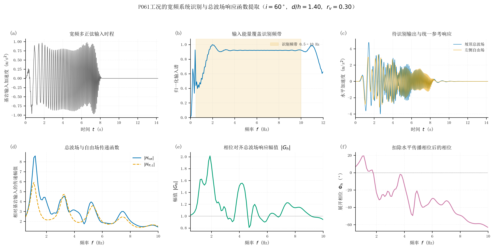

图5 P061 工况的宽频系统识别与总波场响应函数提取：（a）G1b 输入时程；（b）输入能量覆盖；（c）坡顶总波场与左侧自由场响应；（d）两者相对基岩输入的传递函数；（e）$G_h$ 幅值；（f）扣除水平传播相位后的展开相位

Fig. 5 Broadband identification of the phase-aligned total-wavefield response for P061

图5(c)～(f)用 P061 说明 $G_h$ 的形成过程。基岩输入、坡顶总波场和左侧自由场的峰值加速度分别为 0.980、4.796 和 3.275 m/s²；这些时程峰值不能直接相除后当作响应函数，因为不同频率分量在峰值时刻并不同相。作傅里叶变换后，坡顶总波场相对基岩输入的传递函数幅值在 1.2 Hz 达到 8.596，左侧自由场在 1.1 Hz 达到 5.918；二者在相同频点作复数相除并扣除水平传播相位后，$|G_h|$ 在1.9 Hz达到2.015。单位模相位修正不改变这三个幅值及其峰频，只使图5(f)表示相对于当地入射相位的散射与成层干涉。

这一差别也可以从数值上直观看出。若直接用两个时程峰值相除，P061 坡顶相对左侧自由场的比值仅为 1.464；而总波场响应函数的最大幅值为 2.015，且出现在 1.9 Hz。前者把发生在不同时刻、由不同频率组合形成的两个峰强行配对，既没有明确的频率坐标，也丢失了相位信息；后者则在每个频率上先完成复谱配对，再从所得曲线中寻找峰值。即使把总波场和自由场传递函数各自的最大值 8.596 与 5.918 相除，所得比值也不能代替 $G_h$，因为两个最大值分别位于 1.2 和 1.1 Hz，而 $G_h$ 的最大值位于 1.9 Hz。复数相除必须在相同频点进行，这正是图5从时程、单独传递函数到复比值逐层展示的原因。

由此，本文所用“放大”始终是带参考条件的相对概念。$G_h$ 不是总波场相对基岩的绝对传递函数，而是总波场相对当地相位一致自由场的复数响应。工程上若需恢复总波场，必须把 $G_h$ 与左侧自由场复谱以及式（13a）的水平传播相位共同相乘，不能只把幅值峰值相乘。

图5中的三个峰进一步表明，这一约分不是简单“消去一个数字”。二维传递函数在1.2 Hz取8.596，一维传递函数在1.1 Hz取5.918，而二者复比值在1.9 Hz取2.015；三个峰不在同一频率，说明分子和分母在频率轴上的相对起伏共同塑造了最终结果。某频率处即使二维传递幅值很高，只要一维自由场也同步放大，$G_h$未必很大；反之，二维传递函数不在自身峰值处，也可能因相对一维场偏离更明显而形成$G_h$局部峰。相位差同样来自同频复数商，不能由两条幅值曲线推回。

因此，宽频识别的产物不是一张“峰值排行表”，而是一组在频率和空间上保持复数关系的场。后文从场中摘取全场峰、固定频率剖面和固定位置谱，是对同一数据作不同方向的切片：全场峰回答最不利组合在哪里，固定频率剖面回答同一时刻尺度下响应怎样沿地表重新分配，固定位置谱回答某一工程位置受哪些频带控制。三类读法必须共同使用，才能避免把某个偶然极值等同于完整的坡体规律。

采用式（2）沿折线地表分段定义归一化坐标 $s\in[-4,4]$。令 $x(s)$ 为该位置的物理横坐标，$x_{\mathrm{ref}}$ 为自由场相位原点。对基岩中以入射角 $\theta$ 传播的 SV 平面波，水平慢度为

$$
p=\frac{\sin\theta}{V_{\mathrm{s,b}}},
$$

其从 $x_{\mathrm{ref}}$ 传播至 $x(s)$ 所产生的确定性水平相位为 $\exp[-\mathrm{i}2\pi fp(x(s)-x_{\mathrm{ref}})]$。本文先用左侧上平台自由场复谱 $\widehat a_{h,L}^{\mathrm{ff}}(f)$ 构造各位置的相位一致参考：

$$
\widehat a_{h,\mathrm{ref}}^{\mathrm{ff}}(f,s)
=\widehat a_{h,L}^{\mathrm{ff}}(f)
\exp\!\left[-\mathrm{i}2\pi fp\bigl(x(s)-x_{\mathrm{ref}}\bigr)\right]. \tag{13a}
$$

扣除斜入射水平传播相位后的总波场响应函数定义为

$$
G_h(f,s)=
\frac{\widehat a_h^{\mathrm{tot}}(f,s)}
{\widehat a_{h,\mathrm{ref}}^{\mathrm{ff}}(f,s)}
=\frac{\widehat a_h^{\mathrm{tot}}(f,s)}{\widehat a_{h,L}^{\mathrm{ff}}(f)}
\exp\!\left[+\mathrm{i}2\pi fp\bigl(x(s)-x_{\mathrm{ref}}\bigr)\right]. \tag{13}
$$

式中，$\widehat a_h^{\mathrm{tot}}$ 是 Abaqus 计算得到的地表总波场复谱，包含自由场和坡体散射场；$\widehat a_{h,L}^{\mathrm{ff}}$ 是频域全局矩阵法得到的左侧上平台自由场复谱。式（13）右侧的指数项只用于消除斜入射平面波随 $x$ 线性累积的背景相位，其模恒为1，因此

$$
\lvert G_h(f,s)\rvert
=\left\lvert\frac{\widehat a_h^{\mathrm{tot}}(f,s)}{\widehat a_{h,L}^{\mathrm{ff}}(f)}\right\rvert .
$$

指数项的模恒为1，因此式（13）不改变总波场相对左侧自由场的幅值，只将各位置的相位统一到当地入射波相位。相位和群时延由此主要表征坡体散射、覆盖层透反射及多波干涉，而不包含平面入射波沿水平方向传播的确定性走时。本文工况取 $\theta=15^\circ$、$V_{\mathrm{s,b}}=2000$ m/s，故 $p=1.2941\times10^{-4}$ s/m。80个H/P/B工况中，单位模运算的最大幅值数值误差为 $1.33\times10^{-15}$，式（13）的最大复数恒等残差为 $6.04\times10^{-15}$。

建模自由场与式（13）的自由场参考承担不同作用。前者用于计算三侧人工边界的等效节点力并参与有限元求解；后者用于表述已经得到的地表总波场。式（13）不会改变Abaqus时程、边界荷载或幅值结果。全地表均采用左侧上平台自由场幅值基准，并按各测点物理横坐标扣除水平传播相位；相位展开和群时延求导均基于同一个 $G_h$。

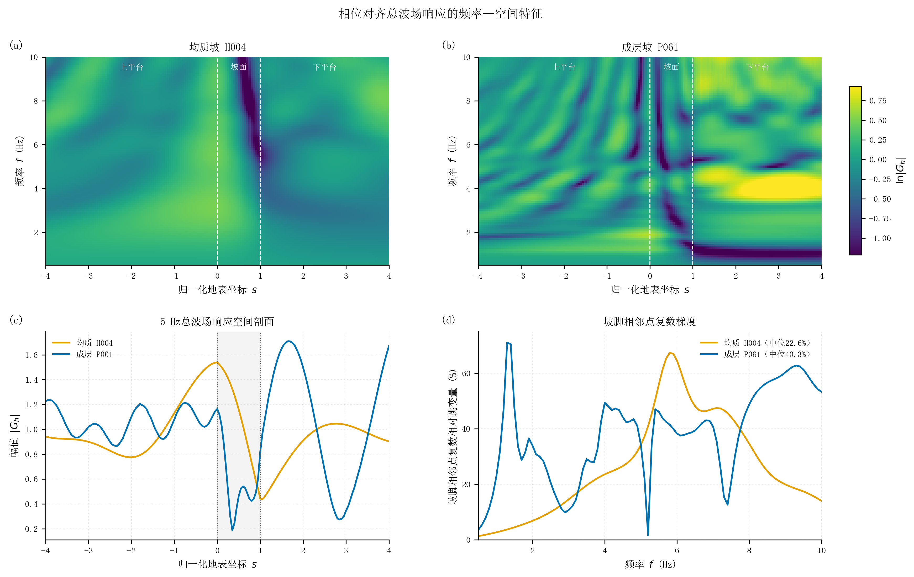

图6 相位对齐总波场响应的频率—空间特征：（a）均质坡H004对数幅值场；（b）成层坡P061对数幅值场；（c）5 Hz空间剖面；（d）H004与P061坡脚邻点复数梯度；虚线标出坡顶和坡脚

Fig. 6 Frequency–space characteristics of the phase-aligned total-wavefield response

图6仅展示式（13）对应的总波场响应。H004的对数幅值场较平滑，P061则在坡脚和下平台形成更密集的弯曲条带，反映成层干涉和地形散射的共同作用。5 Hz时，P061在$s=2$处的幅值为1.496，其下平台响应明显高于同频均质坡。

图6(d)采用复数对称相对变化量描述坡脚左邻点与坡脚点的差异，即两点复数差的模除以两点幅值之和。H004与P061在0.5～10 Hz内的中位值分别为22.6%和40.3%，90%分位数分别为50.4%和58.9%。该量同时包含幅值与相位变化，用于刻画几何折点附近的局部梯度；P061较大的数值与其更复杂的散射和成层干涉结构一致。图7—图17均沿用式（13）的总波场响应函数及相同的频率—空间网格。

总波场响应函数的幅值和频率展开相位定义为

$$
A_h(f,s)=\lvert G_h(f,s)\rvert,\qquad
\Phi_h(f,s)=\operatorname{unwrap}_f\!\left[\arg G_h(f,s)\right]. \tag{14}
$$

$A_h>1$ 表示总波场相对当地相位一致自由场放大，$A_h<1$ 表示相对削弱。相位不是另一个“放大系数”，而是扣除已知水平走时后仍由散射和成层干涉产生的频率相关超前或迟滞。P061坡顶相位在0.5～10 Hz内约由 $6.7^\circ$ 演化至 $-63.2^\circ$。相位只在每个连续有效频段内沿频率展开；跨越无效频段的两段相位不强行连接，也不直接对卷绕角作算术平均。

幅值场在热图中采用 $\ln A_h$ 表示，是为了让相对放大和相对削弱以 $A_h=1$ 为共同零点展开，而不是改变总波场响应函数的定义。直接使用线性幅值时，大幅值峰会占据大部分色阶，小于 1 的削弱区容易被压缩；取对数后，互为倒数的放大与削弱在数值上大小相同、符号相反，更适合比较成层前后的相对变化。不过，正文报告的全场峰值仍使用 $A_h$ 本身，以保留直观的倍数意义。图中颜色、峰值表和公式三者分别服务于场形识别、工程量级判断和复数运算，不能混用为同一统计量。

相位展开解决的是表示分支，而不是“修正”物理相位。对一个连续频段整体加减 $360^\circ$ 不会改变该段内的群时延，因为常数分支的导数为零；真正会污染群时延的是在相邻频点间错误跳到另一分支，或跨越无效谱谷强行连接两段相位。因而，展开过程以频率方向为主，并以连续有效段为单位。空间比较时则关注同一频率下各位置的相对相位变化，不能把每个位置独立展开后的任意常数分支直接拼成空间梯度。本文将频率展开、空间分段和有效掩码按固定顺序执行，就是为了使图中的相位条带与式（15）的导数来自同一套连续关系。

相位对角频率的负导数给出群时延，沿地表坐标的导数给出表观空间相位梯度：

$$
\tau_g(f,s)=-\frac{1}{2\pi}\frac{\partial\Phi_h}{\partial f},\qquad
k_{\mathrm{app}}(f,s)=\frac{\partial\Phi_h}{\partial s}. \tag{15}
$$

式（15）求导时 $\Phi_h$ 以弧度表示，图中相位和相位RMSE再换算为度。群时延反映窄频带包络相对于左侧一维参考的到时变化，其正负不能简单解释为波的绝对传播时间；负值可能来自干涉结构和参考场相位，并不意味着违反因果性。表观空间相位梯度用于识别相位沿平台、坡面和下平台变化的快慢。由于地表几何在 $s=0$ 和 $s=1$ 处改变，空间展开和求导分别在 A、B、C 三段内进行，不跨区段用一个差分模板。第3章物理统计对每段连续有效相位采用9点、二阶Savitzky–Golay滤波；连续区间不足9点时取不超过区间长度的最大奇数窗，少于5点则不平滑，边界采用多项式外插模式。随后计算数值梯度，连续区间首、末点不纳入统计，以避免边缘导数放大噪声。

群时延之所以比相位本身更敏感，是因为它刻画相位曲线的局部斜率，而不是累计转角。两条曲线即使在某个频率具有相同相位，只要邻域内斜率不同，其窄频带包络相对到时仍会不同；反之，一条相位曲线可以累计跨越数百度，但若变化平缓，群时延并不一定很大。短窗二次多项式平滑用于抑制逐频微小摆动被微分放大，而非抹去跨越若干频点的稳定条带。本文因此用群时延的分位范围比较整体复杂程度，对孤立极值保持谨慎，并将其与幅值谱谷、相位转折和频带边界共同核对。第4章代理误差评价采用5点滑动平均，因此两章导数型指标分别在各自固定算子下比较，不将其绝对值交叉混用。

空间分区同样不是排版上的方便。上平台 A 段、坡面 B 段和下平台 C 段具有不同的地表切向方向与散射环境；在 $s=0$ 和 $s=1$ 处跨段差分，会把坐标方向变化和局部响应变化混在一个导数里。特别是坡面仅占 $0<s<1$ 的有限弧长，若直接用全地表统计，其高梯度可能被两侧长平台的大量网格点稀释。分段计算后，空间相位梯度回答的是“各几何区段内部相位怎样变化”，全场热图则保留区段之间的整体关系。两者配合，既不会把坡顶、坡脚的物理转折误当作数值异常，也不会因平台点数较多而掩盖坡面局部效应。

全部工况被重采样到相同的 96×161 网格，频率为 0.5～10.0 Hz、间隔 0.1 Hz，空间坐标为 $-4.00$～4.00、间隔 0.05。一个 96×161 复数场对应一个物理工况；频率点和地表点用于描述场内结构，不被当作 15 456 个彼此独立的样本。后文使用的主要指标列于表7。全场峰值能够显示最强响应，却容易被频带上界或空间端点控制，因此同时报告峰值频率、峰值位置、分区峰值和频带统计。位于 10 Hz 的峰统一标为“$\geq10$ Hz”，位于 $s=-4$ 或 $s=4$ 的峰标为搜索域端点，均不外推为已经解析的内部极值。

统一网格的意义在于使场形比较具有相同坐标，而不是把插值后的网格扩充为更多独立证据。同一工况内相邻频点来自同一条时程，相邻地表点也由同一个有限元波场耦合，其相关性很强；若把 15 456 个网格值直接作为独立样本计算显著性，样本量会被严重夸大。本文以“物理工况”为参数比较的基本单位，以网格值描述每个工况内部的峰、分区和条带。这样既保留二维场的信息量，又不把空间分辨率误写成试验重复数。

边界峰的标记还关系到参数规律的解释。内部峰意味着曲线在搜索区间内经历了上升和回落，峰频与峰位可以作为局部特征量；上界峰或端点峰只表明在当前观察域内最大，真正极值可能位于域外。把 10 Hz 直接写成精确主频，会使后续参数变化看起来像“频率稳定在 10 Hz”，实际上它可能只是多个尚未回落的谱支被同一上界截断。同理，远平台端点峰不能未经核查就归因于坡体局部放大。因此，本文在比较幅值大小的同时保留边界标签，参数导致的峰值升高只有在峰形、峰位和分区结果相互支持时才解释为稳定的响应增强。

这里还需区分“几何分界点”和“搜索域端点”。$s=0$的坡顶与$s=1$的坡脚虽然是地表几何分段位置，却都位于$[-4,4]$搜索域内部；峰值落在这两处，可以精确报告其坐标，但要结合折角散射解释。真正的空间端点是$s=-4$或$s=4$，在该处取最大只能说明曲线到观测边界仍未回落。频率端点同理，10 Hz是正文搜索上界，而4.0 Hz或3.2 Hz等在频带内部形成并回落的峰，其频率定位证据更完整。边界标签评价的是搜索域是否截断峰形，不是否定边界处响应本身。

“全场峰”还包含频率和空间两个方向，因而需要分别检查两类边界。一个点可能在频率方向是内部峰，却位于远平台空间端点；也可能像图9的坡脚谱那样，空间位置$s=1$在模型内部，频率最大值却触及10 Hz。只有两个方向都未被截断，且相邻频点、相邻位置呈现相应回落，才适合称为已解析的内部峰。本文保留峰值幅度用于风险筛查，同时以“$\geq10$ Hz”和端点标记降低对峰频、峰位的过度解释。

表7 相位对齐总波场响应的主要描述指标及解释

Table 7 Main descriptors of the phase-aligned total-wavefield response

| 指标                             | 定义或计算口径                            | 主要用途                           | 使用时的限制                       |
| -------------------------------- | ----------------------------------------- | ---------------------------------- | ---------------------------------- |
| 幅值$A_h$                      | $\lvert G_h\rvert$                      | 描述相对当地相位一致自由场的放大或削弱 | 不包含到时与波形信息               |
| 展开相位$\Phi_h$               | 有效连续频段内展开$\arg G_h$            | 描述频率相关超前或迟滞             | 不跨无效频段拼接分支               |
| 群时延$\tau_g$                 | $-(2\pi)^{-1}\partial\Phi_h/\partial f$ | 识别相位随频率快速变化的频带       | 导数对谱谷和频带边缘敏感           |
| 空间相位梯度$k_{\mathrm{app}}$ | A/B/C段内$\partial\Phi_h/\partial s$    | 比较平台、坡面和下平台的相位变化   | 不跨坡顶、坡脚差分                 |
| 全场峰值                         | 有效网格内$\max A_h$ 及其 $(f_p,s_p)$ | 定位最强响应与主控频带             | 需标记频带和空间端点峰             |
| 分区、分带统计                   | A/B/C段及低、中、高频分别汇总             | 避免全场峰值掩盖局部规律           | 各区段点数不同，不作样本显著性推断 |

为分离覆盖层和纯地形的作用，每个成层工况与相同坡角的均质工况配对，定义覆盖层复数修正

$$
C_G(f,s)=\frac{G_h^{\mathrm{layer}}(f,s)}{G_h^{\mathrm{homo}}(f,s)}
=C_A(f,s)e^{\mathrm{i}\Delta_\Phi(f,s)},\qquad
\Delta_A(f,s)=\ln C_A(f,s). \tag{16}
$$

$\Delta_A>0$ 表示覆盖层使该频率、该位置的相对幅值增大，$\Delta_A<0$ 表示削弱；$\Delta_\Phi$ 和相应的群时延差反映覆盖层引入的附加相位结构。这里的配对比值不是把“地层效应”和“地形效应”假定为可线性相加，而是以同坡角均质坡为对照，观察覆盖层加入后完整复数场怎样变化。

采用复数比值而不是分别相减幅值和相位，可以保持两类信息的耦合关系。$C_G$ 先在同一频率、同一位置对成层场和均质场做复数相除，再提取 $C_A$ 与 $\Delta_\Phi$；这样，相位差天然位于同一个复数商中，避免两条独立展开相位因分支常数不同而产生虚假的整周差。对幅值取对数则把成层相对均质的增大与减小放到同一加法尺度上，便于跨频带汇总。但 $\Delta_A$ 的正负只说明覆盖层相对同坡角均质坡的净修正，不等于某位置的最终 $A_h$ 必然大于或小于 1：一个原本被地形削弱的位置，经覆盖层增强后仍可能低于一维参考，反之亦然。为检验覆盖层尺度与二维响应变化能否对应，再以覆盖层四分之一波长频率构造相对于坡高尺度频率的无量纲比值：

$$
\chi=\frac{f_s h}{V_{\mathrm{s,b}}}=\frac{r_v}{4(d/h)},\qquad
f_s=\frac{V_{\mathrm{s,c}}}{4d}. \tag{17}
$$

$\chi$ 小表示覆盖层特征频率相对坡高尺度频率较低，可能进入本文主要分析频带；$\chi$ 大则表示覆盖层特征频率相对较高。式（17）只提供频率尺度，不预先规定二维坡体的主峰一定等于 $f_s$。坡角散射、平台干涉和斜入射水平相位差都会使局部主峰偏离一维四分之一波长频率。后文因此先比较完整频率—空间场，再检验各类修正指标是否随 $\chi$ 呈稳定变化，避免用一条一维频率公式替代二维结果。

### 3.2 总波场响应函数的总体分布特征

图7以均质陡坡 H004 和成层陡坡 P061 建立总体认识。两者坡角均为 $60^\circ$，区别在于 P061 含 $d/h=1.40$、$r_v=0.30$ 的软厚覆盖层。H004 的 $\ln\lvert G_h\rvert$ 场较平滑，显著变化主要集中在坡顶和坡面附近；其全场峰值为 1.638，位于 3.2 Hz、$s=0$。扣除水平传播相位后，群时延的1%～99%范围为 $-0.142$～0.053 s。该结果说明，即便没有覆盖层，陡坡几何仍会产生频带选择性放大和相对时延，但不再把平面入射波的已知水平走时计入坡体响应。

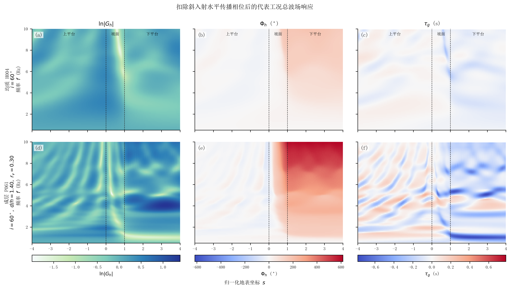

图7 扣除斜入射水平传播相位后的代表工况总波场响应：（a）～（c）H004 的对数幅值、展开相位和群时延；（d）～（f）P061 对应结果；虚线为坡顶与坡脚

Fig. 7 Phase-aligned total-wavefield responses of representative homogeneous and layered slopes

加入软厚覆盖层后，P061 场内出现多条弯曲的高低幅值条带，相位在坡脚前后形成不同分支，群时延也出现交替的正负条带。其全场峰值为 4.012，位于 4.0 Hz、下平台 $s=3.2$，是 H004 的 2.45 倍；群时延1%～99%范围扩大为 $-0.676$～0.202 s，绝对极值由 H004 的 0.294 s 增至 0.781 s。峰值从坡顶移至下平台以及时延范围的显著增大共同表明，覆盖层带来的变化不只是“坡顶放大系数提高”，而是主控位置、主控频带和散射相位结构同时重组。

若把两个工况放在同一坐标下比较，全场最大幅值由1.638增至4.012，峰频由3.2 Hz移至4.0 Hz，空间位置由坡顶 $s=0$ 移到下平台 $s=3.2$；群时延1%～99%覆盖宽度则由0.194 s扩大到0.879 s，约为均质坡的4.53倍。幅值、峰位和相位导数同时重组，因此不能只用“成层后放大2.45倍”概括P061。

图7中 P061 在 $s=1$ 右侧具有较强梯度。1～2 Hz 的低频条带、约 4 Hz 的下平台强响应以及 5～8 Hz 的多组干涉结构以不同形态穿过坡脚，与图6展示的频率相关空间变化一致。这些局部梯度由坡脚散射和覆盖层干涉共同形成，后处理中不对 $s=1$ 邻域进行平滑，以保留真实的相位梯度和峰位迁移。

从群时延分位范围还能看出，P061的复杂性主要向负时延一侧扩展。H004的1%下限和99%上限分别为$-0.142$ s与0.053 s，P061则为$-0.676$ s与0.202 s；负侧绝对范围扩大约4.78倍，正侧约3.85倍。由于确定性水平走时已被扣除，这种不对称扩展不能再解释为测点横坐标不同，而应归因于部分频带内更陡的散射相位转折和成层干涉。

幅值峰的位置变化与群时延展宽应合在一起阅读。H004的1.638峰位于坡顶、3.2 Hz；P061的4.012峰位于下平台$s=3.2$、4.0 Hz。后者不是把H004坡顶峰原位放大2.45倍，而是另一组频率—位置组合成为全场最大。与此同时，群时延分位宽度扩大4.53倍，表明峰位迁移伴随更强的散射相位频散。

频率—空间热图适合观察整体结构，但不易读出单一频率上各位置的相对关系。图8因而截取1、3、5、7和9 Hz的地表空间剖面。均质H004在五个频率下的幅值最大值都位于坡顶，依次为1.147、1.633、1.540、1.489和1.490。扣除水平传播相位后，其全地表相位跨度依次为13.0°、80.3°、126.7°、170.1°和201.1°；该跨度表示不同位置相对当地入射相位的散射差异，而不是入射波从左向右传播的走时。

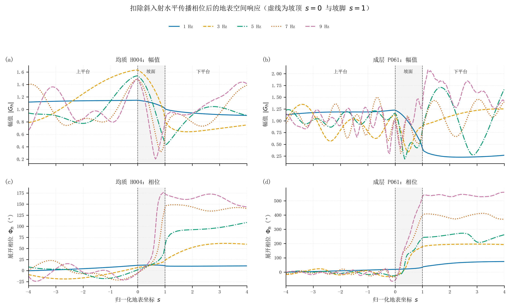

图8 H004 与 P061 在1、3、5、7和9 Hz固定频率下的地表空间响应：（a）、（b）幅值；（c）、（d）展开相位；灰带为坡面，虚线为坡顶和坡脚

Fig. 8 Surface response profiles at selected frequencies for H004 and P061

P061 的空间剖面对频率更敏感。1 Hz时坡顶幅值为1.227，而下平台$s=2$仅为0.232；到5 Hz，空间最大值移至$s=1.65$并达到1.710，9 Hz时又移至$s=1.20$并增至2.079。其扣除水平传播相位后的全地表相位跨度由1 Hz的74.8°扩大到9 Hz的625.0°，明显高于H004，说明高频成层干涉主要体现在散射相位快速变化及其伴随的局部幅值重分配。

五条剖面把图7中的弯曲条带转化为一组可追踪的空间迁移。P061在1、3、5、7和9 Hz的空间最大值依次为1.227、1.349、1.710、1.502和2.079，对应位置依次为$s=0$、$-3.40$、1.65、$-0.65$和1.20。控制位置由坡顶转到远上平台，再跨过坡面进入下平台，随后回到上平台并再次落到坡脚右侧，未形成“频率越高，峰值越沿同一方向移动”的简单规律。这里3 Hz的$s=-3.40$仍在搜索域内部，不应标为空间端点，但它距坡体较远，解释时要与坡体邻域的分区统计区分；5 Hz和9 Hz的峰则明确位于下平台内部。

相位剖面给出的迁移比幅值更连续。H004在1、3、5、7和9 Hz的相位跨度分别为13.0°、80.3°、126.7°、170.1°和201.1°，P061对应为74.8°、227.6°、299.2°、447.2°和625.0°。相位跨度增大并不要求每个位置的幅值同步上升，而意味着沿地表更容易出现相长与相消位置交替。

两类坡在固定频率下的差异并非所有频率都同样显著。H004五条剖面的最大值在1.147～1.633之间，控制位置始终为坡顶；P061在5 Hz和9 Hz的空间最大值分别比H004同频最大值高11.0%和39.5%，且两次都落在坡脚右侧。相位对齐后，1 Hz时P061的全地表相位跨度为H004的5.76倍，9 Hz时为3.11倍；从1 Hz到9 Hz，H004相位跨度增至原来的15.49倍，P061增至8.36倍。这些数值只描述扣除背景走时后的相对散射相位，不再包含平面波沿水平方向的线性相位项。

固定频率剖面也给出了理解工程“坡顶放大”的边界。对于 H004，坡顶作为几何突变位置在本文频带内持续控制幅值，使用坡顶谱能够概括主要趋势；对于 P061，强响应可以出现在坡顶、坡脚邻域或下平台，单独报告坡顶会漏掉 5 Hz 和 9 Hz 的空间最大值。本文后续参数统计因此同时保留全场峰值和 A/B/C 分区结果。全场峰值用于识别最不利频率—位置组合，分区统计则判断峰值是否只是远平台端点或某个局部窄带造成。

H004的五个固定频率最大值全部位于$s=0$，但幅值由1 Hz的1.147升至3 Hz的1.633后，又在5～9 Hz维持于1.489～1.540，并非随频率持续增加。这说明“坡顶控制”指控制位置稳定，不等于坡顶放大系数单调随频率增大。与之相比，P061的幅值和位置同时变化，9 Hz最大值2.079虽比H004同频高39.5%，却仍低于P061完整场在4.0 Hz、$s=3.2$处的4.012。固定频率剖面只负责说明所选切片的空间格局，不能用五条切片中的最大值替代96个频率组成的全场搜索。

图7和图8由此形成“全场—横切片”的对应关系。热图中的斜向或弯曲条带意味着峰位随频率移动，固定频率剖面正好给出条带与某一水平截线的交点。P061的主要结构表现为随频率迁移的弯曲条带，说明空间起伏属于频率相关的二维响应。将两种图并列，可以避免凭单幅热图色差判断局部变化，也避免凭少数剖面遗漏条带的整体走向。

图9从另一方向截取 P061：固定上平台 $s=-2$、坡顶 $s=0$、坡面中部 $s=0.5$、坡脚 $s=1$ 和下平台 $s=2$，比较幅值、相位和群时延随频率的变化。五个位置的幅值峰分别在4.5 Hz处达到1.595、在1.9 Hz处达到2.015、在6.5 Hz处达到1.316、在10 Hz分析上界达到1.571，以及在3.8 Hz处达到2.310。覆盖层一维四分之一波长频率为1.07 Hz，但除坡顶1.9 Hz峰相对接近外，其余位置峰频分布在3.8 Hz至不低于10 Hz，未出现全地表统一锁定于1.07 Hz的现象。这说明一维覆盖层频率只能作为耦合尺度，不能直接代替二维局部主峰。

用 $f_s=1.07$ Hz 对五个局部峰频归一化，可得到上平台、坡顶、坡面中部、坡脚和下平台的 $f_p/f_s$ 分别约为 4.21、1.78、6.07、$\geq9.35$ 和 3.55。若覆盖层仅以一维驻波形式整体控制地表，这些比值应在各位置附近集中；实际结果却跨越至少 1.78～9.35，并且最大幅值 2.310 出现在 $s=2$、3.8 Hz，而不是最接近 $f_s$ 的坡顶峰。下平台峰值还比坡顶高 14.6%，坡面中部峰值仅为下平台的 57.0%。这些对比表明，同一覆盖层尺度进入二维坡体后，会因位置不同而与坡顶散射、坡脚绕射及平台传播形成不同组合。

固定位置谱是图8的正交读法。图8在每个选定频率沿$s$横向观察，图9则在每个选定位置沿$f$纵向追踪；二者交叉处必须来自同一复数场。例如，图8显示1 Hz下平台$s=2$幅值仅0.232，图9则显示该位置随频率继续演化并在3.8 Hz形成2.310的内部峰。若只看1 Hz剖面，会把下平台概括为持续削弱；若只看3.8 Hz的局部峰，又会遗漏同一位置在低频的显著削弱。二维场的核心正在于同一位置和同一频率都不能脱离另一坐标单独概括。

五个位置的展开相位跨度也没有按幅值峰值大小排序。上平台、坡顶、坡面中部、坡脚和下平台在0.5～10 Hz内的相位跨度分别约为57.0°、82.5°、270.5°、592.3°和603.2°。水平背景相位被扣除后，坡面中部、坡脚和下平台仍表现出明显更大的频率累积转角，说明其相位复杂性来自坡体散射和成层干涉，而非单纯传播距离。

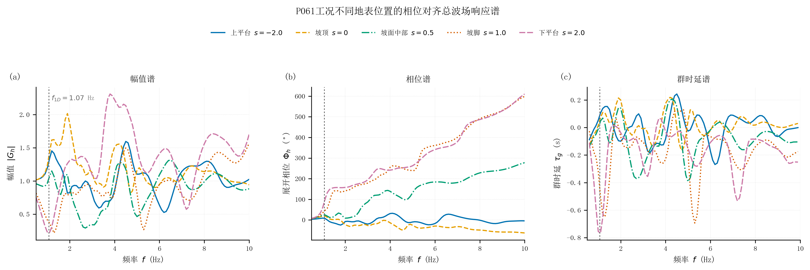

图9 P061在上平台 $s=-2$、坡顶 $s=0$、坡面中部 $s=0.5$、坡脚 $s=1$ 和下平台 $s=2$ 的相位对齐总波场响应谱：（a）幅值；（b）展开相位；（c）群时延；竖虚线为覆盖层一维四分之一波长频率

Fig. 9 Phase-aligned total-wavefield response spectra at selected surface locations of P061

坡脚幅值在10 Hz分析上界仍呈上升趋势，其峰值只能写作“$\geq10$ Hz”。坡脚和下平台的负群时延极值分别达到$-0.693$ s和$-0.765$ s，远大于坡顶的$-0.165$ s。这些极值集中在幅值快速变化的频带，既反映强干涉，也对相位导数和频带边缘敏感，不能解释为某条波以负时间传播。

群时延极值所在频率进一步揭示幅值峰与相位转折并不重合。上平台、坡顶、坡面中部、坡脚和下平台的最小群时延分别约为$-0.268$、$-0.165$、$-0.393$、$-0.693$和$-0.765$ s，对应频率仍为6.2、4.7、5.0、5.3和1.1 Hz；各位置幅值峰频则为4.5、1.9、6.5、$\geq10$和3.8 Hz。尤其下平台最负群时延出现在1.1 Hz，接近覆盖层特征频率1.07 Hz，但幅值最大值在3.8 Hz，二者不能相互替代。

上述负极值也要与分位范围区分。极值只对应单个或少数频点，适合定位需要核查的相位急转；1%～99%范围舍去最外侧少量值，更适合比较一整幅场的常见变化程度。图7用分位范围说明P061总体比H004复杂，图9再用极值指出复杂性集中在哪些位置和频带。若只报告极值，可能把微分对局部起伏的放大写成全场特征；若只报告分位范围，又会看不到坡脚和下平台的局部强干涉。两种统计承担不同任务，并不相互替代。

坡脚这一边界结果尤其说明“最大值”和“已识别主峰”不能等同。$s=1$ 的幅值在当前频带上界取到 1.571，只能确认截至10 Hz仍存在上升谱支；若把它与下平台3.8 Hz处2.310的内部峰按同一种精度报告，就会掩盖两者证据等级的差别。群时延亦然：坡脚和下平台的负极值绝对值分别约为坡顶的6.21倍和6.80倍，但这些数值来自相位导数，不能脱离相邻幅值与相位曲线单独排序。本文保留它们，是为了标记高干涉频带和后续参数比较的重点，而不是把负号解释成绝对到时提前。

下平台3.8 Hz峰、P061全场4.0 Hz峰和图8的5 Hz空间峰可以连成一条清楚的证据链。$s=2$位置谱在3.8 Hz达到2.310，说明下平台内部确有可解析的频带峰；完整场又在邻近4.0 Hz、$s=3.2$达到4.012，说明沿下平台继续变化后出现更强局部响应；到5 Hz，空间最大值移到$s=1.65$并降为1.710，表明该强峰不是贯穿中频的整段高台，而是一组具有明确频率和空间范围的干涉结构。三幅图对同一结构的不同切片相互吻合，比单独引用4.012这一最大值更能说明其物理含义。

相反，坡脚10 Hz结果目前只有“达到搜索上界”这一层证据。它的空间坐标$s=1$并非观测端点，坡脚处的响应值得关注；但频率方向尚未看到峰后回落，因此可以比较其截至10 Hz的最大幅值，却不宜用10 Hz参与内部主峰迁移的精确拟合。若后续需要判断真实坡脚峰频，应扩大可信分析频带并同步核查输入能量、网格分辨率和相位连续性，而不是只在现有曲线上外插。本文采取边界标签，正是把当前数据能回答的问题与尚不能回答的问题分开。

综合图6—图9，相位对齐总波场响应的判读可以落到一条可复核的证据顺序上。首先确认输入在目标频带可识别，并保证总波场分子和全地表自由场分母采用同一复数定义；其次观察热图中的异常是否固定在参考切换位置、是否贯穿全部频带，以排除后处理标尺造成的整齐分界；然后用固定频率剖面核对响应在上平台、坡面和下平台之间怎样分配，再用固定位置谱判断峰形是否在频率方向闭合；最后才比较全场峰、相位跨度和群时延。按此顺序，H004可以概括为控制位置较稳定但幅值随频率起伏的坡顶型响应，P061则表现为频率、位置和相位结构共同迁移的成层响应。这个结论来自多种切片之间的相互印证，而不是由某一个最大值或某一条色带单独决定。

三组图从互补角度给出同一结论：均质坡的主要特征是坡顶附近较稳定的频带放大，成层坡则呈现位置随频率迁移、频带随位置变化的二维响应。完整复数场保留了这种对应关系，而全场单一峰值只能给出其中一个最不利点。后续比较坡角、厚度比和波速比时，若某参数使全场峰值升高，还需同时检查峰位是否由坡顶转到下平台、主峰是否碰到10 Hz上界、相位和群时延是否同步变化；只有这些信息合并起来，才能判断参数改变的是响应强度、主控频带，还是空间干涉格局。

### 3.3 坡角及覆盖层参数的影响

上一节表明，成层坡地的最大响应可能在坡顶、坡面或下平台之间迁移。参数比较若只取坡顶单点，容易把“峰值减小”与“峰值移到别处”混为一谈。本节采用两种互补口径：控制变量序列用于观察完整谱形怎样改变，64 个全因子工况的边际分布用于判断该变化在其余参数组合下是否仍然存在。边际分布中的每个参数水平含16个确定性工况，图中的中位数和四分位距只用于概括离散结果，不作随机抽样意义上的显著性推断。

坡角的影响先由 H001～H004 四个均质坡建立基线。图10(a)显示，随着坡角由15°增至60°，地表最大幅值包络整体抬升；全频—全空间峰值依次为1.269、1.492、1.571和1.638，增幅为29.1%，表现为单调增强。这个趋势与地形突变变陡后坡顶散射加强的认识一致，但峰频并不随坡角单调移动：四个均质坡的主峰频率依次为2.2、9.9、8.1和3.2 Hz。30°坡的控制峰靠近分析高频端，60°坡又回到3.2 Hz，说明几何变陡同时改变了多个散射模态的相对强弱，而不是把同一个峰连续推向高频或低频。

峰值位置进一步说明，均质坡幅值的单调抬升并不等于同一空间峰被连续放大。H001、H002、H003和H004的峰位依次为 $s=0.05$、$-0.05$、3.90和0，其中45°坡的8.1 Hz控制峰落在下平台远端，而其余三例位于坡顶邻域。也就是说，均质基线中较稳定的是“最大幅值随坡角总体增大”，并非“峰频和峰位都由坡角唯一决定”。这种区别很重要：若只记录四个峰值大小，会得到清楚的单调曲线；把峰频和峰位一并保留后，看到的却是不同空间—频率峰之间的换位。后文判断覆盖层效应时，因此以同坡角均质场作复数配对，而不把某一个均质峰当作所有成层坡共同的固定模态。

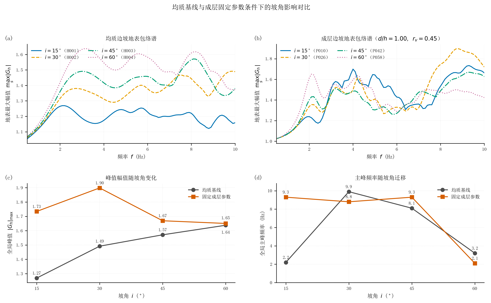

图10 坡角对地表最大幅值包络及全场峰值的影响：（a）均质坡；（b）固定 $d/h=1.00$、$r_v=0.45$ 的成层坡；（c）峰值幅值；（d）主峰频率

Fig. 10 Effect of slope angle on the surface-envelope spectrum and global peak response

加入固定覆盖层后，坡角趋势发生改变。在 $d/h=1.00$、$r_v=0.45$ 条件下，15°、30°、45°和60°坡的峰值分别为1.734、1.898、1.669和1.651，最大值出现在30°而非最陡的60°，主峰频率则为9.3、8.8、9.3和2.1 Hz。15°至30°时幅值提高9.5%，继续增至60°反而较30°降低13.0%。均质结果和成层结果并不矛盾：均质坡只包含几何散射，成层坡还叠加了覆盖层频带与坡角模态的相对位置；坡角改变后，覆盖层共振附近的增强带可能与地形强响应重合，也可能错开。图10因此给出一个重要限制——“坡越陡放大越强”在本文均质基线的峰值幅值上成立，却不能直接推广到任意成层组合。

均质坡幅值随坡角总体抬升，与既有均质岩坡及斜入射参数研究中“坡形和入射方向共同改变放大水平”的趋势一致[7-8,24]；但这些研究多以PGA或若干频率处的谱比评价，本文的 $G_h$ 又以统一左侧一维自由场为复数分母，数值大小不宜直接横向比较。加入覆盖层后出现的非单调坡角序列，则与已有研究关于地形—地层耦合不能由两个独立系数简单叠加的认识相符[16-20]。本文在这一趋势基础上进一步指出，非单调变化同时伴随峰频和控制位置换位，而不仅是峰值系数改变。

同坡角逐一相除可以看出这条限制从何而来。上述四个成层坡相对对应均质坡的峰值比分别为1.366、1.273、1.062和1.008，即固定覆盖层使15°坡的全场峰值提高36.6%，对60°坡却只提高0.8%；同时，成层峰位依次位于 $s=0.75$、$-0.10$、$-0.45$ 和0。15°组的控制点由均质坡坡顶邻域移到坡面，45°组则由均质坡下平台远端回到上平台，而60°组峰位保持在坡顶、峰频由3.2 Hz降至2.1 Hz。因而，固定覆盖层并不是在四条均质曲线上施加相同倍数的修正，而是对每个坡角已有的频率—空间结构作不同重排。这里的比值只服务于这条控制变量序列，不能据此推断覆盖层在陡坡中普遍无效；软厚组合中的P061恰好给出相反情形。

64 个成层工况的坡角边际分布进一步限定了这一结论。图13(a)中四个坡角水平的峰值中位数为1.665、1.694、1.688和1.718，最大差仅3.15%；而各水平的最大值由3.539逐步增至4.012。坡角对典型工况的中位响应影响较弱，却会抬高分布上尾。换言之，坡角更像是困难组合的放大器：覆盖层参数不利时，陡坡能达到更高的极端响应；覆盖层参数取其他水平时，这种几何增强可能被频带错开所抵消。主峰频率中位数随坡角为6.40、8.85、6.85和4.35 Hz，仍呈显著非单调，且60°组整体偏低频。

边际分布的离散宽度也支持“中位影响弱、组合影响强”的判断。15°、30°、45°和60°组峰值的四分位区间分别为1.447～2.101、1.520～2.067、1.538～1.996和1.629～2.103，四组高度重叠；但全距上限随坡角由3.539增至4.012，下限也由1.249增至1.590。把64例按固定 $d/h$ 和 $r_v$ 划成16条坡角序列，其中仅7条峰值单调增加，1条单调降低，另外8条至少出现一次方向反转；主峰频率更有14条为非单调，只有各1条单调升高或降低。这组计数说明，坡角对最不利软厚组合的增强是清晰的，而把它写成覆盖整个参数域的一维单调函数则不成立。图10给出物理基线，图13给出跨组合的适用范围，两者缺一不可。

四组全距的变化还揭示了坡角作用的另一面。坡角从15°增至60°时，峰值下限由1.249提高到1.590，增幅为27.3%，而中位数只提高3.15%；这说明陡坡并非只把少数极端值向上拉长，也在一定程度上抬高了最弱组合的响应底部。然而，30°和45°组的中位数、四分位区间及上四分位数互有交叉，参数排序在分布中部并不稳定。对设计比较而言，坡角的影响因所问指标而异：若关注同一类软厚覆盖层的最不利峰值，四种坡角给出连续增大的序列；若关注覆盖全部厚度和波速比后的典型工况，四组差异远小于组内离散；若关注主峰频率，则连总体方向也会因候选峰换位而改变。把这三种口径分开，能避免用一个“坡角效应”同时代替基线、典型值和上尾风险。

空间—频带分层进一步解释了中位数为何接近。上平台低频区域的幅值中位数随坡角由1.078、1.105、1.118增至1.132，呈温和而稳定的增加；但同一区域的中频序列为1.014、1.046、1.005和0.977，高频序列为1.021、1.078、1.046和1.002，均在30°达到局部最大后回落。坡面则出现更明确的频带分化：低频由0.981增至1.047，随坡角升高而上升，中频由0.935降至0.794，高频由1.043降至0.780，后两者均随坡角升高而降低。下平台的坡角跨度只有1.01～1.10倍，远小于坡面高频的1.34倍。由此可见，陡坡提高全场上尾并不要求所有地表区段、所有频带同步提高；它可以在坡顶附近形成更局部的尖峰，同时使坡面中高频的区域典型值降低。这种空间压缩和局部集中，正是全场最大值与区域中位数方向不同的直接原因。

覆盖层厚度的控制变量结果见图11。固定 $i=45^\circ$、$r_v=0.30$ 时，$d/h=0.20$、0.60、1.00和1.40的全场峰值为1.861、2.148、1.958和3.904，顺序为“升高—降低—再显著升高”；最厚层相对最薄层提高109.8%。相应主峰频率为9.3、4.3、8.8和4.0 Hz，同样发生两次方向反转。厚度增加并非只是使峰值沿一条曲线平滑左移，而是在约4 Hz和约9 Hz两组响应之间改变控制权。

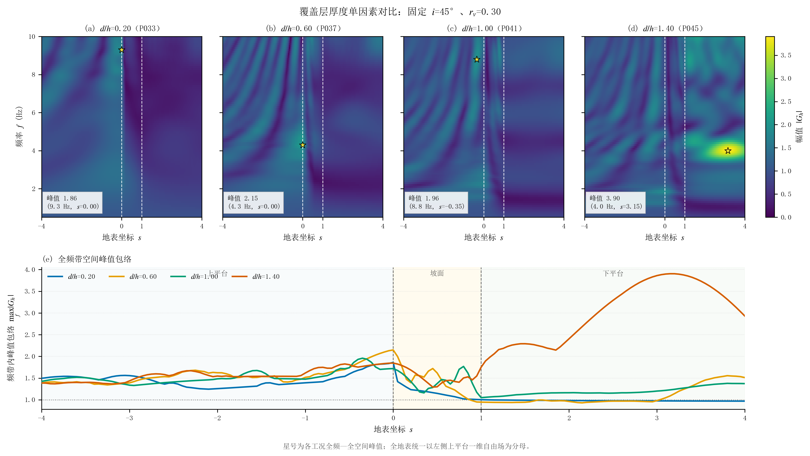

图11 固定 $i=45^\circ$、$r_v=0.30$ 时覆盖层厚度比的单因素对比：（a）～（d）频率—空间幅值场；（e）全频带空间峰值包络；星号为全场峰值

Fig. 11 Single-factor comparison of cover-layer thickness ratio at fixed slope angle and velocity ratio

图11还显示峰值位置随厚度改变。前三个厚度的峰位分别为 $s=0$、$s=0$ 和 $s=-0.35$，仍由坡顶邻域或上平台控制；$d/h=1.40$ 时峰位跃迁至下平台 $s=3.15$。若只读取坡顶曲线，最厚层的全场峰值会被漏掉，并可能得到完全不同的厚度趋势。图11(e)中的空间包络表明，最厚层在上平台并未处处显著高于其他曲线，其主要增量集中于下平台约 $s=2$～4。厚度既改变局部一维传播，也改变上下平台之间的相位关系，因此“厚层更强”需要同时说明强在哪里、出现在哪个频带。

把其他坡角和波速比纳入后，16条“坡角×波速比”厚度序列中有9条至少发生一次相邻差分变号，表现为非单调；另外7条在四个离散厚度水平上单调递增。该统计说明非单调不是图11特选序列的孤例，也不是全参数域唯一规律。图13(b)的厚度边际中位数分别为1.517、1.754、1.647和2.245：$d/h=0.60$高于1.00，1.40又达到最高，保留了与代表序列相同的转折。最厚组相对最薄组的中位峰值提高47.96%，但这一净增量不能被解释为线性厚度效应。

厚度对控制位置的作用比其对中位峰值的作用更具分段性。$d/h=0.20$ 和0.60的32个工况全部由上平台控制；$d/h=1.00$ 时有13例由上平台控制、3例转到坡面；$d/h=1.40$ 时则有15例转由下平台控制，仅P064仍在坡顶取得全场峰值。由此可见，最厚组的高边际中位数不是各区段同步按同一比例抬升，而主要来自下平台响应成为新的控制量。与幅值序列的“7条递增、9条非单调”相比，16条厚度—峰频序列无一在四个水平上保持单调，说明厚度对频率的影响更适合描述为候选频带换位，而不是连续的频移率。这个结论在离散的四水平网格内成立；它揭示了转折存在，却不能确定两相邻厚度水平之间的精确转折点。

按低、中、高三个频带统计控制峰，可看到位置迁移与频带迁移并非同一步骤。$d/h=0.20$ 的16例中，低、中、高频控制峰分别有3、5和8例；$d/h=0.60$ 时变为0、6和10例；$d/h=1.00$ 时为3、3和10例；$d/h=1.40$ 时则为1、4和11例。最厚组虽然有4个最软工况在约4 Hz形成显著下平台峰，但其余较硬工况多由6～10 Hz控制，所以该组主峰频率中位数仍为6.70 Hz。换言之，“最厚层出现4 Hz强响应”与“最厚层多数工况的控制峰位于高频”可以同时成立：前者描述幅值最大的软厚分支，后者描述16例的数量构成。若仅报告峰频中位数，软厚分支的工程重要性会被多数中等响应的高频工况掩盖；若只展示P061，又会误以为最厚层必然由4 Hz控制。

四个坡角下的软厚序列为这一分支提供了重复证据。固定 $d/h=1.40$、$r_v=0.30$，P013、P029、P045和P061的峰值由3.539、3.714、3.904增至4.012，峰频为4.0、4.1、4.0和4.0 Hz，峰位集中在 $s=3.15$～3.25。这里稳定的是控制频带、控制区段及随坡角抬升的幅值次序，而不是所有厚层工况都共享同一峰。当波速比提高到0.75时，同一厚度下四坡角峰值降至1.572、1.547、1.557和1.610，峰频分别为9.4、9.7、6.8和2.6 Hz，60°组甚至重新由坡顶控制。覆盖层厚度决定了下平台分支出现的可能性，足够低的波速比才使该分支在全场竞争中取得控制；二者必须同时满足，单独用“厚层”概括会扩大结论的适用范围。

波速比序列提供了更稳定的方向性。固定 $i=45^\circ$、$d/h=0.60$ 时，$r_v$ 从0.30增至0.75，峰值由2.148依次降至1.860、1.707和1.572，首尾下降26.8%；主峰频率则由4.3 Hz依次升至5.4、7.7和8.2 Hz，净上移3.9 Hz。四个峰都位于坡顶 $s=0$，说明这条序列主要改变响应强度和主控频带，没有触发控制位置迁移。

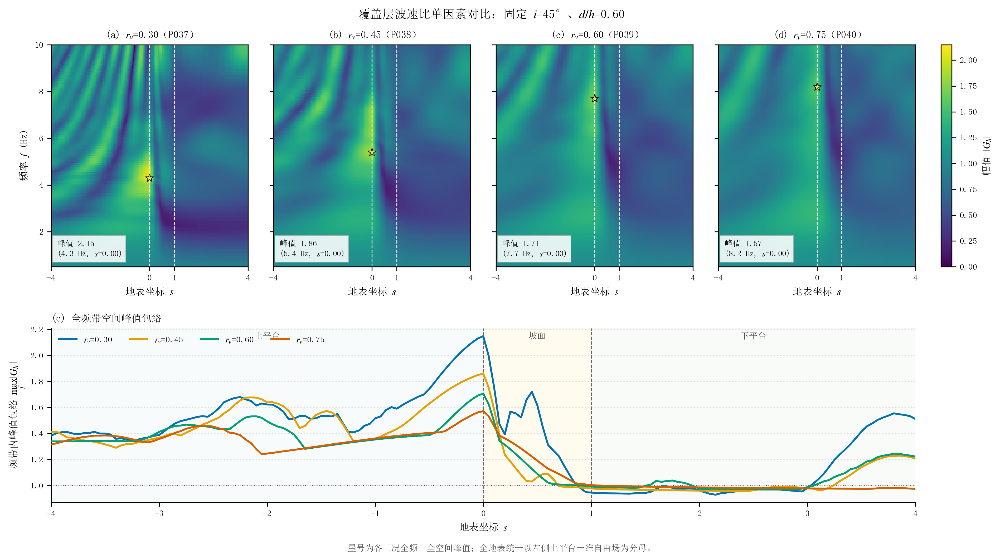

图12 固定 $i=45^\circ$、$d/h=0.60$ 时覆盖层波速比的单因素对比：（a）～（d）频率—空间幅值场；（e）全频带空间峰值包络

Fig. 12 Single-factor comparison of cover-layer velocity ratio at fixed slope angle and thickness ratio

随着 $r_v$ 增大，覆盖层与基岩的波阻抗和波速差减小，图12中的低频强条带逐渐减弱并向高频移动。这里的“软覆盖层更强”是指本文固定密度比、线性阻尼和给定厚度下的相对结果，不能直接推广到密度、阻尼或非线性同步改变的天然土层。就64例边际结果而言，$r_v=0.30$、0.45、0.60和0.75的峰值中位数为2.152、1.767、1.628和1.541，首尾下降28.39%，与代表序列一致；主峰频率中位数则为4.75、6.50、7.75和7.05 Hz，在最高波速比处略有回落。幅值的总体方向比峰频更稳定，峰频仍受厚度和坡角交互影响。

逐组合检查给出了这种“更稳定”究竟稳定到什么程度。固定坡角和厚度形成的16条波速比序列中，有13条峰值随 $r_v$ 单调降低，另3条存在局部反转，没有一条单调升高；相应峰频只有5条单调升高，10条非单调，另1条单调降低。峰值分布也随 $r_v$ 增大而明显收缩：$r_v=0.30$ 组的四分位区间为1.920～2.636、最大值为4.012，$r_v=0.75$ 组缩小为1.454～1.576、最大值仅1.696。因而，波速比提高不仅降低了典型峰值，也压低了极端上尾，这一幅值方向可视为当前参数域内最稳健的单参数结论。至于主峰向高频移动，只能作为多数代表序列和边际中位数的总体倾向，不能保证每一个厚度—坡角组合均按此顺序变化。

波速比作用的稳定性还体现在其对分布不同位置的同步压低。$r_v=0.30$ 组的峰值最小值、中位数和最大值分别为1.739、2.152和4.012；到 $r_v=0.75$ 时分别降为1.257、1.541和1.696。极差由2.273收缩到0.439，说明材料反差减小时，软厚角点形成的长上尾基本消失，64例之间的幅值差异也更接近几何差异本身。相反，峰频四分位区间没有按相同方式收缩：四个波速比水平的中位数由4.75升至6.50、7.75后回落至7.05 Hz，最低与最高频率在多数水平仍跨越多个频带。幅值分布的收缩来自强峰被压低，不意味着谱形随波速比变得单峰或峰频变得容易预测。

代表序列中峰位固定在 $s=0$，使图12清楚呈现波速比对频带和幅值的作用，但全域结果仍包含空间换位。最厚层四个坡角下，$r_v=0.30$ 的峰都落在下平台；当 $r_v$ 增至0.75后，15°、30°和45°组仍在下平台远端取得峰值，60°组却回到坡顶。也就是说，波速比提高通常削弱下平台强峰，却不必在同一阈值上触发所有坡角的区段切换。波速比主效应的“稳定”只针对全场峰值大小的下降方向；峰位是否保持、主峰越过哪个频带以及区段内典型响应怎样变化，仍受厚度和坡角共同控制。把这一限定写清，能够避免从图12单条坡顶序列误推到全部64例。

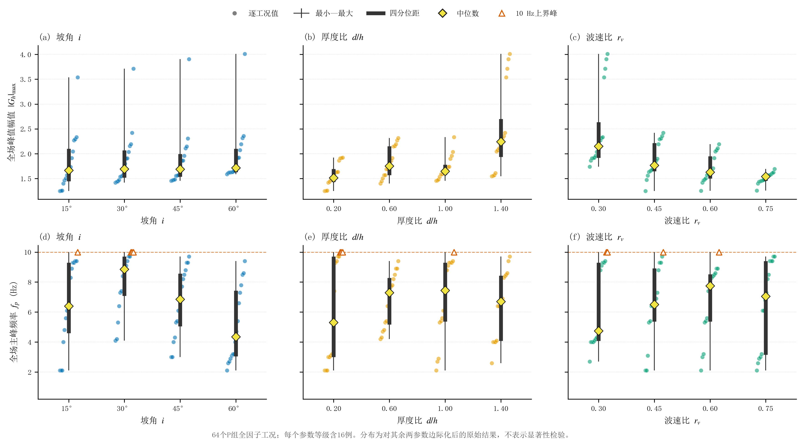

图13 64 个全因子成层工况按参数水平汇总的全场峰值幅值和主峰频率：（a）～（c）峰值幅值；（d）～（f）主峰频率；黄色菱形为中位数，粗线为四分位距，空心三角为10 Hz上界峰

Fig. 13 Marginal distributions of peak amplitude and dominant frequency for the three parameters

表8汇总了三参数水平的边际中位数。坡角四水平的峰值中位数相近，不能据此说坡角“没有作用”，因为图10的均质序列和图13的上尾都显示几何影响存在；它只说明在覆盖层参数跨越全域后，坡角主效应被更强的厚度、波速比及交互变化遮蔽。厚度比的中位数非单调，波速比的幅值中位数近似单调下降，也不能把中位数趋势套到每个单独组合。边际统计的作用是给出全域方向，控制变量图则负责展示具体响应怎样转折。

频率分布尤其需要结合四分位区间阅读。四个厚度水平的峰频四分位区间依次为3.00～9.70、5.18～8.28、5.38～9.30和4.08～8.43 Hz，区间大幅重叠，且各自跨度都明显大于相邻中位数差；4个10 Hz上界峰中，3例出现在 $d/h=0.20$，另1例出现在1.00。薄层组5.30 Hz的峰频中位数因此不能解释为稳定的“薄层主频”，它只是低频内部峰与高频截断峰共同形成的排序中心。幅值边际更容易形成可读方向，是因为峰值大小在换位前后仍为连续量；峰频由取最大值操作返回某一个离散频点，对候选峰的强弱次序更敏感。表8保留两类指标，正是为了避免把幅值趋势误写成峰频趋势。

表8 三参数各水平的全场峰值与主峰频率中位数

Table 8 Median global peak amplitude and dominant frequency at each parameter level

| 参数          | 水平                      |                峰值幅值中位数 |         主峰频率中位数/Hz |
| ------------- | ------------------------- | ----------------------------: | ------------------------: |
| 坡角$i$     | 15° / 30° / 45° / 60° | 1.665 / 1.694 / 1.688 / 1.718 | 6.40 / 8.85 / 6.85 / 4.35 |
| 厚度比$d/h$ | 0.20 / 0.60 / 1.00 / 1.40 | 1.517 / 1.754 / 1.647 / 2.245 | 5.30 / 7.30 / 7.45 / 6.70 |
| 波速比$r_v$ | 0.30 / 0.45 / 0.60 / 0.75 | 2.152 / 1.767 / 1.628 / 1.541 | 4.75 / 6.50 / 7.75 / 7.05 |

厚度—波速比响应矩阵把边际趋势还原到具体组合。图14上排为峰值幅值，下排为主峰频率，每一列坡角对应完整的4×4厚度—波速比网格。64例中的最大值为 P061（$i=60^\circ$、$d/h=1.40$、$r_v=0.30$）的4.012，最小值为 P002（$i=15^\circ$、$d/h=0.20$、$r_v=0.45$）的1.249，前者为后者的3.21倍。高响应集中在“厚层—低波速比”一角，但并非每一行、每一列都严格单调。

矩阵中的极端高响应具有比边际中位数更明确的参数指纹。64例中有19例峰值不低于2.0，但只有4例超过3.0；这4例恰好都是 $d/h=1.40$、$r_v=0.30$，对应15°、30°、45°和60°坡的P013、P029、P045和P061。其峰值依次为3.539、3.714、3.904和4.012，峰频集中在4.0～4.1 Hz，峰位集中在下平台 $s=3.15$～3.25。换言之，软厚组合先把主控频带和位置锁定在约4 Hz的下平台区域，坡角再对该高响应状态作近似单调增幅。这个局部规律跨四个坡角重复出现，可以作为稳定的困难组合描述；它并不否定其他区域的非单调性，因为一旦离开 $d/h=1.40$、$r_v=0.30$ 这个角点，控制峰就可能重新回到坡顶或高频带。

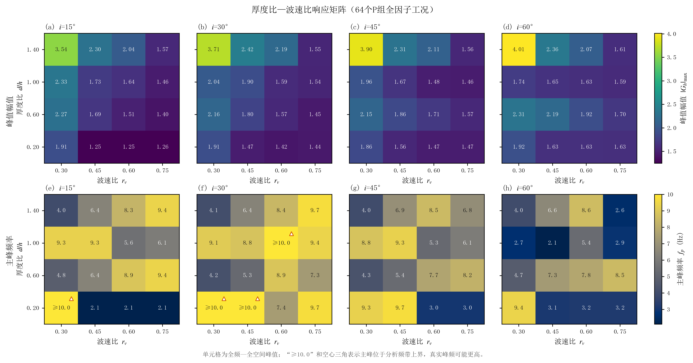

图14 四种坡角下厚度比—波速比响应矩阵：（a）～（d）全场峰值幅值；（e）～（h）主峰频率；“$\geq10.0$”表示分析频带上界峰

Fig. 14 Thickness-ratio–velocity-ratio response matrices at four slope angles

厚层条件下波速比的控制最清楚。$d/h=1.40$ 时，$r_v$ 从0.30增至0.75使15°、30°、45°和60°坡的峰值分别降低55.6%、58.4%、60.1%和59.9%，四种坡角给出相近降幅。薄层 $d/h=0.20$ 时，部分行在 $r_v=0.45$～0.75间变化很小，说明覆盖层过薄或特征频率移出主要频带后，继续增大波速比的边际影响有限。主峰频率矩阵比幅值矩阵更零散：P001、P017、P018和P027的峰位落在10 Hz上界，图中以“$\geq10.0$”和空心三角表示；这些工况的真实峰频可能更高，不能参与内部峰迁移的线性拟合。

把每个厚度水平下 $r_v=0.30$ 与0.75的首尾降幅在四个坡角间取中位数，可得到22.85%、29.86%、25.12%和59.11%。前三个厚度的波速比效应虽有差别，但均远小于 $d/h=1.40$ 时约59%的降幅，这正是“厚度改变了波速比作用强度”的直接证据。反过来看，在最软的 $r_v=0.30$ 列，厚度增加也不是平滑放大：不同坡角下 $d/h=0.60$ 或1.00可能出现局部回落，直到1.40才共同跃入下平台4 Hz强响应。图14因而比三条边际曲线多回答了一层问题：厚度和波速比不仅各自改变峰值，它们还共同决定某个强响应分支是否进入当前0.5～10 Hz观察窗。

矩阵的行列比较还能区分“强度交互”和“频率交互”。在 $d/h=1.40$ 行，四个坡角的峰值随 $r_v$ 增大都大幅下降，方向高度一致，说明该角点的强度交互具有跨坡角可重复性；但对应峰频由约4 Hz逐步转向6～10 Hz后，60°、$r_v=0.75$ 又回落到2.6 Hz，频率序列并不共享统一方向。在 $d/h=0.20$ 行，15°坡从P001的1.911、10 Hz变为P002的1.249、2.1 Hz，波速比仅从0.30增至0.45便发生高、低频控制峰换位；随后P003和P004的幅值只由1.253增至1.257，峰频保持2.1 Hz附近。这里首个相邻步长包含“分支切换”，后两个步长则是在同一低频分支上的小幅变化。若把四点强行拟合成一条平滑响应曲线，既会把峰频突跳写成连续漂移，也会高估高波速比区间的幅值斜率。

全场峰值仍可能被某一空间区段主导。图15将地表分为上平台、坡面和下平台，并将频率分为0.5～3、3～6和6～10 Hz。每个格先求单工况在该区段、该频带的对数幅值中位数，再用四个参数水平中最大与最小中位数之比表示效应跨度。上平台的三参数跨度仅为1.01～1.10倍，说明远离坡体突变后，各参数对区域中位响应的影响相对有限；显著差异主要出现在坡面和下平台。

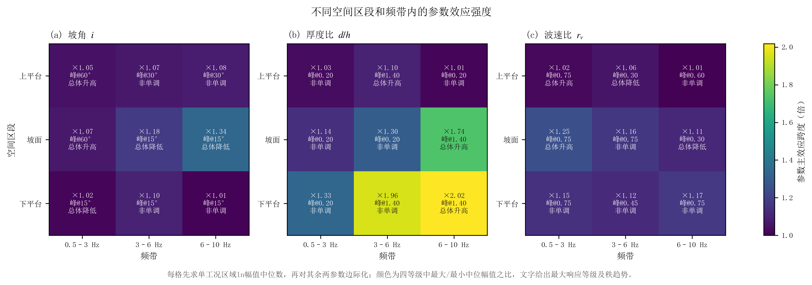

图15 不同空间区段和频带内的参数效应跨度及方向：（a）坡角；（b）厚度比；（c）波速比。每格先求单工况区域 $\ln\lvert G_h\rvert$ 中位数，再对其余两参数边际化；颜色为四参数水平中最大与最小中位幅值之比，文字给出最大响应所在水平。“总体升高/降低”表示四水平秩相关系数不小于0.8/不大于$-0.8$，其余标为非单调

Fig. 15 Parameter-effect strength stratified by surface segment and frequency band

厚度比在下平台作用最强，低、中、高频的效应跨度分别为1.33、1.96和2.02倍，中高频最大响应均对应 $d/h=1.40$；在坡面6～10 Hz，厚度效应仍达1.74倍。相比之下，坡角在坡面高频的最大跨度为1.34倍，且区域中位响应总体随坡角降低，最大值出现在15°，这与全场极值上尾随坡角升高并不冲突：缓坡可能在较长坡面上形成较高的区域平均值，陡坡则在更局部的位置形成更高尖峰。波速比在坡面低频的跨度为1.25倍，区域中位值随 $r_v$ 升高；这一方向也不同于全场峰值随 $r_v$ 升高而降低，表明“局部平均抬升”和“最大峰减弱”可以同时发生。

分区矩阵还揭示了效应随频带转移的过程。厚度比在坡面低、中、高频的跨度依次为1.14、1.30和1.74倍，在下平台则由1.33增至1.96和2.02倍，表现为越接近中高频、越靠近下平台，厚度差异越容易被放大。坡角在坡面低频仅相差1.07倍，到中频和高频扩大为1.18和1.34倍，而下平台三个频带均不超过1.10倍。波速比的最大分区效应出现在坡面低频，为1.25倍；坡面中、高频降至1.16和1.11倍，下平台三个频带为1.12～1.17倍。由这些完整格值可以看出，图13中波速比对全场峰值最强，并不意味着它对任意区域中位响应也最强；区域中高频差异反而更多由厚度控制。

每格对应的最大响应水平使方向差异更容易理解。坡面高频对坡角表现为总体降低，15°水平的区域中位值最高；对厚度则总体升高，$d/h=1.40$ 最高；对波速比则总体降低，$r_v=0.30$ 最高。坡面低频的波速比方向恰好相反，$r_v=0.75$ 的区域中位值最高。下平台中频对厚度虽有1.96倍跨度，但四级序列为先降、再升并在1.40达到最大，仍属非单调。这样的符号变化不是统计口径冲突，而是频率—空间场被压缩成不同指标后的必然结果：全场峰值追踪随参数移动的最强点，分区中位数则固定观察区域和频带，能够显示原控制点之外的整体抬升或降低。

将图15中的对数中位数还原为幅值比，可以更直观地看到这种分层。上平台对三参数总体不敏感，但频带方向并不完全相同：厚度增加时，中频区域中位值由0.942升至1.034，跨度1.10倍，而低频由1.133降至1.095后在最厚层回到1.106；波速比提高时，上平台低频由1.096缓慢升至1.123，中频由1.025降至0.970，高频始终维持在1.030～1.037。这里所有变化都不超过10%，却已经包含升高、降低和非单调三种形态。因而，“上平台影响小”应理解为效应幅度小，而不能理解为三个参数在该区段没有频带选择性。

坡面上的方向反转更强。厚度四水平的低频区域中位值为1.083、0.986、0.950和0.980，总体降低但末级略有回升；中频为0.940、0.723、0.810和0.871，先降后升；高频则由0.543、0.845、0.891增至0.942，最厚与最薄之比达到1.74。波速比四水平在坡面低频由0.847升至1.057，在高频却由0.871降至0.783；一个参数在同一空间区段内即可同时抬高低频背景、压低高频响应。坡角也呈相似分裂，低频随坡角由0.981升至1.047，中高频则持续下降。以上数值说明，频带合并后的单一“坡面放大系数”会把方向相反的变化互相抵消，难以反映参数改变后的谱形重排。

下平台的突出特点是厚度效应集中在中高频。厚度四水平的高频区域中位值由0.683、0.746、0.873升至1.378，呈连续上升；中频则为0.787、0.649、0.720和1.270，先降低再显著上升。最厚层对中、高频的抬升不仅改变区段中位数，也为全场控制点转移到下平台创造条件。低频序列0.837、0.716、0.627和0.695反而总体下降，说明P013、P029、P045和P061约4 Hz的强峰不能概括为整个0.5～3 Hz低频区段同步增强。它们属于中频窄带内的局部强响应，而不是下平台全频背景的均匀抬升。这样的分带结果把“强峰出现”与“区域整体增强”区分开来，也为图14中软厚角点为何集中在约4 Hz提供了更具体的空间证据。

比较三个空间区段还可看出参数信息沿地表的传递方式。上平台保留较平缓的基线，三参数最大跨度均不超过1.10；坡面是方向变化最频繁的过渡区，坡角和波速比在低频与高频给出相反符号；下平台对坡角不敏感，却对最厚覆盖层的中高频响应最敏感。这不是从左到右逐级放大的简单传播图景，而是不同区段对频率和参数的选择性不同。对沿线工程，使用坡顶一个测点代表整条地表会同时漏掉坡面高频的参数效应和下平台软厚组合的控制峰；反过来，只用下平台最不利峰代表上平台，也会高估大多数薄层工况的典型响应。

表9把控制变量、边际分布和分区结果放在一起。可见，三个参数并不对应三条简单的一维规律。坡角主要抬高均质基线和极端响应上尾；厚度比最容易引起频带与位置跳转，非单调最明显；波速比对全场峰值的方向最稳定，但对不同区段的中位响应仍可能相反。后续的交互分解不再试图用一条经验曲线概括全部工况，而是判断哪些参数组合控制峰值强度，哪些组合控制主峰频率和峰位迁移。

三类证据相互对照后，可以把结论分成稳定规律与条件规律。稳定规律包括：均质峰值随坡角提高而增大；波速比提高时绝大多数成层组合的全场峰值降低；$d/h=1.40$、$r_v=0.30$ 在四种坡角下都形成约4 Hz的下平台强响应；厚度增至1.40后全场控制位置几乎统一转到下平台。条件规律则包括：成层坡峰值随坡角变化的方向、厚度增加造成的峰频迁移方向、以及波速比对坡面低频区域中位值的影响符号。控制变量序列负责展示这些转折的具体过程，边际分布判断其在全域中是否占主导，分区分带统计解释全场峰值以外的空间差异。将三者合并，才不会把一个特定切片写成普遍规律，也不会因全域中位数接近而忽略工程上最不利的局部组合。

从响应强度看，三参数并非处在同一层级。坡角先决定均质地形的散射基线，对成层工况分布中部的改变量较小，却能继续抬高软厚角点的上尾；厚度决定控制响应是否有条件从上平台转到下平台；波速比决定这一潜在分支能否发展为显著强峰。因而，图10中的坡角基线、图11和图12中的两个材料切片以及图14中的二维矩阵并不是彼此独立的参数展示，而是从基线到分支出现、再到分支强弱的连续证据链。

从频率和空间看，参数作用又呈另一种层级。厚度最容易改变控制区段，波速比在部分固定切片内能使峰频顺序上移，但全域峰频主要由交互决定；坡角则通过改变坡面长度和地形折点附近的空间分布，使同一覆盖层组合在不同频带获得不同竞争优势。图15显示的频带符号反转表明，峰值换位并非只从图11～14的少数极值中推测出来，在固定区段的区域统计中也有对应变化。全场、分区和频带三个尺度给出的结论由此能够相互约束。

这些结果也限定了参数排序的使用方式。进行绝对峰值初筛时，可优先关注低 $r_v$ 与大 $d/h$ 的组合，再用坡角区分上尾；需要确定设施所在区段的输入时，则必须回到对应的空间—频带场，因为上平台、坡面和下平台的参数方向可能不同。尤其在 $d/h=1.40$ 条件下，把下平台控制峰写成全坡同步放大会高估上平台，而在薄层条件下沿用同一判断又会把实际由上平台控制的多数工况错分。参数效应只有附带空间位置和频带才具备明确工程含义。

表9 代表性参数序列和分区效应的定量对比

Table 9 Quantitative comparison of representative parameter sequences and segment-wise effects

| 比较对象   | 固定条件                | 参数变化   | 峰值幅值变化                 | 主峰频率变化          | 主要空间特征                             |
| ---------- | ----------------------- | ---------- | ---------------------------- | --------------------- | ---------------------------------------- |
| 坡角—均质 | 无覆盖层                | 15°→60° | 1.269→1.638                 | 2.2→9.9→8.1→3.2 Hz | 峰位发生换位，45°组位于下平台$s=3.90$ |
| 坡角—成层 | $d/h=1.00,r_v=0.45$   | 15°→60° | 1.734→1.898→1.669→1.651   | 9.3→8.8→9.3→2.1 Hz | 30°幅值最大，趋势非单调                 |
| 厚度比     | $i=45^\circ,r_v=0.30$ | 0.20→1.40 | 1.861→2.148→1.958→3.904   | 9.3→4.3→8.8→4.0 Hz | 最厚层峰位迁至下平台$s=3.15$           |
| 波速比     | $i=45^\circ,d/h=0.60$ | 0.30→0.75 | 2.148→1.572                 | 4.3→8.2 Hz           | 四例峰位均为坡顶$s=0$                  |
| 厚度比分区 | 64例边际                | 四水平     | 下平台中高频跨度1.96～2.02倍 | —                    | 影响集中于坡面高频和下平台               |

### 3.4 参数耦合与响应机制

#### 3.4.1 交互作用、非单调变化与主峰迁移

控制变量曲线能够说明一个参数变化时响应怎样演化，却不能量化三个参数对全域差异的相对贡献。本文利用4×4×4平衡全因子网格作确定性平方和分解。对峰值幅值和主峰频率分别计算总体均值、三个主效应、三个二阶交互和一个三阶交互；各项效应在64个组合上的平方和占总平方和的比例作为贡献率。该分解穷举了当前离散参数网格，不依赖随机误差项，因此只能描述本文数值结果中的确定性变异构成，不能套用随机试验的 $p$ 值或“显著性”表述。

平衡网格使各主效应和交互项在当前四水平设计上可以正交分开，但“正交”不等于物理过程彼此独立。这里被分解的响应量已经经过全频—全空间取最大值，峰值所在的频率和位置会随参数改变。某一参数水平上的效应均值，可能由多个不同控制分支共同构成；二阶交互既包含同一分支幅值对参数的非加性变化，也包含控制权从一个分支移到另一个分支造成的突变。平方和分解的价值在于比较这些变化在64例总变异中的相对份额，而不是把每一项直接对应为一种可单独观测的波动机制。

峰值幅值与主峰频率使用同一组工况，却是两种性质不同的统计量。峰值幅值在两个候选峰换位时通常仍连续：一个候选峰减弱、另一个候选峰增强，两者相等处的最大值不会出现很大跳跃；主峰频率返回的却是获胜峰所在横坐标，一旦强弱次序交换便可能跨越数赫兹。因而，幅值贡献率更接近各参数对响应强度的综合作用，峰频贡献率则同时记录谱峰竞争的分区结果。后者出现较高交互贡献，并不表示频率数值本身比幅值更“非线性”，而是取最大值后的峰标识对细小强弱变化更敏感。

图16(a)显示，峰值幅值的差异主要由波速比、厚度比及二者交互控制，贡献率分别为39.65%、34.21%和21.72%，三项合计95.58%。坡角主效应仅占0.88%，其余含坡角交互和三阶项也较小。这与图13并不冲突：坡角能改变均质坡放大并抬高成层结果上尾，但在覆盖层参数跨越较宽范围时，软硬程度、厚度及其组合产生的幅值差异更大。特别是图14中 $d/h=1.40$ 行随 $r_v$ 的大幅下降，正是 $d/h\times r_v$ 交互贡献达到21.72%的直接表现。

其余幅值贡献率分别为 $i\times d/h$ 的1.59%、$i\times r_v$ 的0.43%和三阶交互的1.51%，连同坡角主效应合计仅4.42%。因此，在当前网格内概括全场峰值大小时，优先保留厚度、波速比及二者交互已经能够解释绝大部分确定性差异；但这并不授权删除坡角。P013、P029、P045和P061在同一软厚角点仍随坡角由3.539升至4.012，说明坡角对最不利组合的工程排序有实际影响，只是相对于整个64例的巨大覆盖层差异，其平方和占比较小。贡献率回答的是“全参数域总变异由谁主导”，而不是“某参数在任意切片上能否改变结果”。

$d/h\times r_v$ 的幅值贡献可以由图14的首尾降幅直接验证。四个厚度水平下，波速比从0.30增至0.75造成的峰值降幅中位数分别为22.85%、29.86%、25.12%和59.11%，最厚层的敏感性约为前三组的两倍。若厚度和波速比只以相互独立的加性方式作用，这四个降幅应大致相近；实际结果却在 $d/h=1.40$ 行突然扩大。相同的交互也可从厚度方向观察：在 $r_v=0.30$ 列，最厚层四坡角均进入约4 Hz下平台强峰，而在 $r_v=0.75$ 列，厚度变化只产生1.25～1.70量级的峰值。两种读法指向同一事实——软化程度决定厚层分支能否显著增强，厚度又决定软化作用能否在下平台积累为控制峰。

坡角相关项占比较小的原因也可以从分区结果理解。坡角对下平台三个频带的区域中位跨度均不超过1.10倍，对上平台也不超过1.08倍，主要变化集中在坡面中高频；而全场最大值在多数薄、中厚工况由上平台控制，在最厚工况又多由下平台控制。坡面虽对坡角较敏感，却只在3例中成为全场控制区，因此其区域变化对全场峰值总平方和的贡献有限。软厚角点中坡角仍能使下平台局部峰连续提高，表现为明确但覆盖范围较窄的条件效应。这样的空间分布说明，小贡献率并非数值上“没有坡角效应”，而是坡角的强作用没有像厚度和波速比那样覆盖多数控制区段。

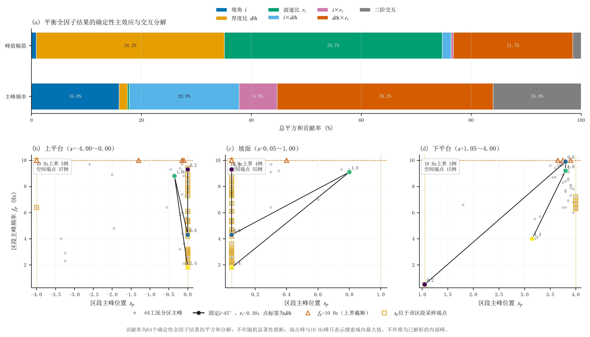

图16 参数交互和分区主峰迁移：（a）峰值幅值与主峰频率的确定性平方和分解；（b）上平台、（c）坡面和（d）下平台的分区主峰位置—频率分布；黑线为固定 $i=45^\circ$、$r_v=0.30$ 的厚度序列

Fig. 16 Deterministic interaction decomposition and migration of segment-wise dominant peaks

主峰频率的变异构成完全不同。$d/h\times r_v$、$i\times d/h$ 和 $i\times r_v$ 三个二阶交互的贡献率分别为39.28%、20.00%和6.91%，合计66.19%；三阶交互占16.01%，坡角主效应占15.97%，厚度比和波速比单独主效应都很小。主峰频率不是任一参数的单值函数，而是多个候选峰竞争后的离散结果。当两个相近峰的幅值次序发生很小变化，最大值搜索就可能从一个频带跳到另一个频带，因此峰频对交互比峰值幅值更敏感。图11中9.3→4.3→8.8→4.0 Hz的往复迁移，以及图10中60°成层坡突然转到2.1 Hz，都是这种“控制峰换位”，不宜用连续单调回归线解释。

这里所称峰频跨度，是固定坡角和波速比后，四个厚度水平主峰频率的最大值与最小值之差。16条厚度序列中，最大跨度出现在 $i=15^\circ$、$r_v=0.75$：$d/h=0.20$、0.60、1.00和1.40时主峰依次为2.1、9.4、6.1和9.4 Hz，跨度为7.3 Hz。该序列既给出了摘要中最大迁移量的直接数据，也说明“迁移”并非一个峰连续平移7.3 Hz，而是低频与高频候选峰多次交换控制权。

厚度比和波速比的峰频主效应分别只有1.51%和0.32%，二者相加甚至低于任一主要二阶交互。这与图12代表序列中4.3→8.2 Hz的顺序上移并不矛盾：该序列只固定在 $i=45^\circ$、$d/h=0.60$，属于16条波速比切片中的一条；一旦把其他厚度和坡角合并，峰频上移会被高低频峰换位所打断。64个全场峰中，7例位于0.5～3 Hz，18例位于3～6 Hz，39例位于6～10 Hz，其中4例恰在10 Hz上界。高频控制的工况数量最多，但低、中、高三个频带均有峰值，进一步表明用全域统一的连续峰频公式会掩盖频带之间的离散迁移。

薄层序列给出了峰频交互最直观的例子。15°、$d/h=0.20$ 时，$r_v=0.30$ 的P001在10 Hz上界、$s=-1.30$取得1.911；波速比增至0.45后，P002的控制峰改在2.1 Hz、$s=-0.10$，幅值降至1.249；继续增至0.60和0.75，P003、P004仍在约2.1 Hz控制，幅值仅变化到1.253和1.257。同一波速比步长在第一段触发近8 Hz的峰频换位，在后两段却几乎不改变峰频。换成30°坡，P017和P018在前两个波速比水平都落于10 Hz上界，P019、P020再回到7.4和9.7 Hz。坡角改变了分支切换发生在哪个波速比区间，正对应 $i\times r_v$ 和更高阶交互，而不是一个全域固定的波速比频移率。

中等厚度同样存在“幅值平缓、峰频跳变”的情况。60°、$d/h=1.00$ 时，四个波速比水平的峰值仅由1.739依次降至1.651、1.626和1.590，首尾相差8.6%，控制位置均在坡顶；主峰频率却为2.7、2.1、5.4和2.9 Hz，先降、再升、再降。由于空间控制点未换区，这一序列说明频率突变不一定伴随峰位迁移，也不要求幅值发生同等级变化，而可由同一坡顶附近多个谱峰的强弱次序改变造成。相反，45°、$d/h=0.60$ 序列的幅值和频率均平稳按相反方向变化，代表在该切片内控制分支连续。两种行为并存，解释了波速比幅值主效应很强而峰频主效应很弱的组合。

按厚度统计频带数量也能看到交互而非单参数平移。$d/h=0.60$ 的16例没有低频控制峰，主要分布在中、高频；增加到1.00后重新出现3例低频峰；增至1.40后仍有11例位于高频，同时最软的4例在约4 Hz形成数据集中最强的中频峰。厚度并未把所有峰从高频整齐推向低频，而是改变不同分支的占比和幅值排序。峰频边际中位数5.30、7.30、7.45和6.70 Hz只是这种混合分布的排序中心，不能画成某个连续模态随厚度的运动轨迹。

全场峰值还混合了三个空间区段。图16(b)～(d)分别在上平台、坡面和下平台内搜索峰值，并显式标记频带上界与空间端点。64个工况中，上平台、坡面和下平台分别有5、4和3例峰频落在10 Hz上界；相应的空间端点峰为37、55和15例。坡面端点峰最多，是因为该区段只有 $s=0.05$～1.00，局部响应常在坡顶或坡脚邻近达到最大；此时端点并非计算错误，而是提示真正极值可能位于相邻区段或地形折点。本文不把区段端点峰当作区段内部已经解析的驻点，也不根据这些点外推峰位移动速度。

若按全场控制点而非分区独立峰分类，64例中有46例由上平台控制、3例由坡面控制、15例由下平台控制。这个比例看似以上平台为主，实际上受厚度强烈分层：$d/h=0.20$ 和0.60的32例全部由上平台控制，$d/h=1.00$ 的16例中有3例转到坡面，而 $d/h=1.40$ 的16例中有15例转到下平台。坡面只在少数过渡组合中成为全场控制区，更多时候充当上、下平台控制状态之间的连接带。这个统计与图11的单条轨迹、图14的厚度—波速比矩阵以及图15的下平台中高频厚度效应彼此吻合，使“厚层导致控制位置向下平台重组”的判断不再依赖某一个代表工况。

这里的“迁移”是对离散控制状态变化的概括，不意味着峰值沿地表连续行走。$d/h=0.20$ 和0.60时，全场峰虽都归入上平台，其坐标可以位于坡顶 $s=0$，也可以在上平台远处达到最大；$d/h=1.00$ 出现的3个坡面控制峰标志着过渡状态，但并不是每条厚度序列都必须依次经历“上平台—坡面—下平台”。图11所示45°、$r_v=0.30$ 序列从 $s=0$、$s=0$、$s=-0.35$ 直接跳到 $s=3.15$，就跨过了坡面控制状态。故峰位图应作为不同候选分支的分类结果阅读，不宜对四个离散点计算连续迁移速度。

区段边界的定义也会影响“由谁控制”的标签，却不会改变原始场。坡顶和坡脚正是几何与材料传播条件发生变化的位置，分区搜索时大量峰落在空间端点并不意外。本文把坡顶归入上平台、坡面从 $s=0.05$ 开始、下平台从 $s=1.05$ 开始，使全场控制分类具有唯一口径；与此同时，图16用端点符号提示某一分区峰可能实质上由相邻折点控制。这样处理避免了同一节点在两个区段重复计数，也提醒读者不要把“坡面端点峰”误解为坡面内部新出现了一个已经充分解析的极值。

三个区段自身的峰值分布又提醒我们，不应把“控制次数”理解为整个区段始终较强。上平台、坡面和下平台的分区峰值中位数分别为1.639、1.573和1.235，分区峰频中位数分别为5.40、5.35和8.00 Hz；上平台的典型峰幅最大，下平台的典型峰频更高。可是，下平台峰值范围为0.982～4.012，上限远高于上平台的2.315和坡面的2.334。也就是说，下平台在大多数薄层工况中响应并不突出，一旦软厚组合形成相干增强，却会产生全数据集最高峰。这种“多数温和、少数极强”的分布特征正是只看平均值或控制次数容易漏掉的风险信息。

固定 $i=45^\circ$、$r_v=0.30$ 的厚度轨迹进一步展示空间峰和频率峰可不同步。上平台主峰频率随 $d/h=0.20$、0.60、1.00和1.40依次为9.3、4.3、8.8和1.8 Hz，峰位大多靠近坡顶端；坡面主峰在相同序列中也发生高低频切换。下平台则从最薄层的 $(s_p,f_p)=(1.05,0.5\,\mathrm{Hz})$，迁至 $(3.80,9.9\,\mathrm{Hz})$、$(3.80,9.2\,\mathrm{Hz})$，最终到最厚层的 $(3.15,4.0\,\mathrm{Hz})$。这条路径说明，厚度增加会同时改变覆盖层相位积累和平台间干涉条件，峰位不是沿坡面连续向下移动，而可能在不同平台模态之间跃迁。

把幅值同时放回这条轨迹，换位过程更为清楚。四个厚度下，上平台分区峰值为1.861、2.148、1.958和1.846，最厚层并未继续增大；坡面分区峰值为1.419、1.996、1.768和1.823，同样没有形成单调上升；下平台则由1.000、1.555、1.378跃升至3.904。$d/h=1.40$ 的全场增量几乎全部来自下平台新峰取得控制权，而不是原坡顶峰持续长大。由此也能解释为什么图13的厚度中位数在1.00处回落、到1.40又显著升高：不同厚度水平汇总的不是同一个响应分支，最后一级的统计量已经由另一空间区段主导。

三个区段在最厚层并非同步增强，构成判断分支换位的关键证据。相对于 $d/h=0.60$，$d/h=1.40$ 时上平台峰由2.148降至1.846，坡面峰由1.996降至1.823，只有下平台由1.555增至3.904。如果全场峰值增加来自整个地表等比例放大，三个区段应给出同方向、近比例变化；实际结果恰好相反。控制峰换位伴随上平台和坡面响应减弱，说明非单调主要来自能量在频率和空间上的重新分配，而不是单一峰无界增长。

从应用角度看，控制峰换位意味着参数敏感性必须依附于观测对象。对坡顶设施，45°、$r_v=0.30$ 序列的上平台峰在 $d/h=0.60$ 最大，继续增厚反而降低；对下平台设施，同一序列在 $d/h=1.40$ 才出现决定性增加；对全场最不利指标，最终由下平台分支接管而呈现最厚层最大。三种结论都来自同一组相位对齐总波场响应，区别只在空间功能区。若将全场结论直接用于坡顶，会把下平台强峰误当作坡顶输入；若只分析坡顶，又会漏掉整条地表真正的最不利位置。

从波动角度看，非单调性至少涉及三类频率尺度：覆盖层厚度控制的竖向往返尺度、坡高和坡面长度控制的地形散射尺度，以及斜入射造成的水平传播相位尺度。当这些尺度接近时，某一位置可能由相长干涉转为相消干涉，局部峰值减弱而另一位置的新峰增强；当尺度错开时，响应又可能接近均质坡的宽缓模式。现有全因子结果支持“频带交叠与控制峰换位”这一解释，但没有独立的模态分解或能流计算来唯一证明每条亮带的波型来源。因此，本文把它作为与数值现象一致的物理解释，而不把每个峰都命名为某一确定阶次的共振模态。

这种交互结构也解释了为何参数边际规律有时方向相反。波速比提高使全场峰值中位数下降，但坡面低频区域中位响应可能升高；坡角提高使均质峰值和成层上尾增大，但坡面高频区域中位响应反而降低。全场最大值关注一个最不利网格点，区域中位数关注一片地表的典型水平，两者本来就回答不同问题。工程使用中，若关心局部设施或坡顶建筑，应查看相应位置的频谱；若关心沿线设施或大范围地表输入，应使用分区包络或区域统计，不能用一个全场峰值替代所有空间位置。

从数据形态看，这些转折也不能简单归为数值离散造成的随机波动。每条控制序列采用相同频率网格、空间网格和归一化参考，非单调峰频往往伴随热图中一条亮带减弱、另一条亮带取得控制，而不是单个孤立网格点无规律跳动；软厚角点的约4 Hz下平台强响应又在四种坡角下重复出现。需要保持谨慎的是，0.1 Hz频率间隔只能把峰频定位到当前采样精度，4个全场上界峰也尚未闭合到频带外。因而，本文将“存在频带换位”和“软厚组合形成下平台强响应”视为已有数据支持的稳定现象，却不对相邻频点间的精确共振频率或10 Hz以外的峰形作推断。

4个10 Hz上界峰的处理体现了这种证据边界。P001、P017、P018和P027在当前频带内只能判定为“峰频不低于10 Hz附近的搜索上界”，不能与内部峰一样用于讨论导数、插值或连续迁移。它们仍可参与峰值幅值比较，因为0.5～10 Hz内的最大幅值是已观测量；但其峰频数值10 Hz是截断标记，不是已闭合的真实局部最大。图13和图14用空心符号单独标出，图16的贡献分解保留原搜索结果并在解释中剔除频带外推，避免把数据边界误写成参数规律。

#### 3.4.2 覆盖层特征频率与相位—时延修正

图17以 P039（$i=45^\circ$、$d/h=0.60$、$r_v=0.60$）展示覆盖层相对同坡角均质坡 H003 的复数修正。幅值修正场 $\ln\lvert C_G\rvert$ 同时存在红、蓝区域，说明覆盖层在不同频率和位置上既可增强也可削弱。最大绝对对数幅值修正位于5.1 Hz、$s=0.60$，其值为 $-1.627$，对应局部幅值比约0.197，即该位置该频率被显著削弱。相位修正在相近的坡面频带形成强梯度，并向下平台扩展；这说明局部幅值谷与相位快速变化共同出现，而不是两个互不相关的后处理量。

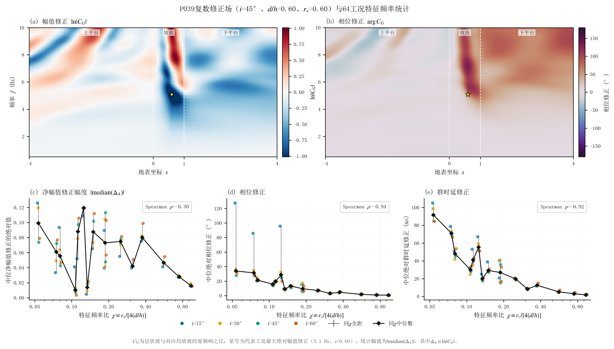

图17 覆盖层复数修正及其与无量纲特征频率的关系：（a）、（b）P039 的对数幅值和相位修正场；（c）64例净幅值修正幅度 $\lvert\operatorname{median}(\Delta_A)\rvert$；（d）中位绝对相位修正；（e）中位绝对群时延修正。彩色散点为64个P工况，颜色区分坡角，黑线连接相同 $\chi$ 组的中位数；多数 $\chi$ 组含4个坡角工况，$\chi=0.1875$ 组含两套厚度—波速比组合共8例

Fig. 17 Cover-layer complex correction and its relation to the dimensionless characteristic frequency

P039 全场的 $\Delta_A$ 中位数为 $-0.0783$，对应净幅值比0.925；中位绝对相位修正为7.43°，中位绝对群时延修正为18.69 ms。净幅值只有约7.5%的下降，并不意味着场内幅值修正处处很小，因为正负局部修正会在中位统计中部分抵消。为回答“覆盖层是否使全场典型幅值产生一致的净偏移”，图17(c)采用逐工况 $\lvert\operatorname{median}(\Delta_A)\rvert$；它与逐像素修正强度的 $\operatorname{median}(\lvert\Delta_A\rvert)$ 不是同一个量。前者关注净增强或净削弱，后者会把空间重分配中的正负变化都计为强修正。本文沿用预定的净修正口径，避免在看到结果后改变研究问题。

对数幅值使局部增强和削弱具有对称解释。P039最强局部修正 $-1.627$ 对应幅值比约0.197；若另一位置出现 $+1.627$，则对应约5.09倍增强，两者在对数尺度上的绝对强度相同。中位数 $-0.0783$ 位于这类局部极值之间，描述的是有效频率—空间网格中一半以上位置所处的整体偏移，而不是全场能量守恒量或峰值变化率。因此，局部幅值比0.197和净幅值比0.925并不矛盾：前者说明某个坡面频点发生强相消，后者说明这种强削弱没有覆盖大部分地表与频带。

P039被选作修正场示例，也正因为它不是全域极端角点。其参数 $d/h=0.60$、$r_v=0.60$ 位于设计域中部，主峰为1.707、7.7 Hz且位于坡顶；即便在这样一个全场峰值并不突出的工况中，坡面5.1 Hz仍出现强局部削弱和相位梯度。由此可知，是否存在明显局部复数修正不能只由全场峰值大小判断。图14负责识别最不利幅值组合，图17的代表场则说明中等峰值工况也可能包含对时程重构重要的局部幅相变化。

64例的有符号统计为这一口径提供了直观参照：53例的 $\operatorname{median}(\Delta_A)$ 为负，11例为正，说明在“全场典型位置”的意义下，覆盖层净削弱比净增强更常见；但其绝对值中位数仅0.0549，四分位区间为0.0380～0.0841。相位修正的中位数为10.16°、四分位区间3.75°～19.95°，群时延修正的中位数为25.14 ms、四分位区间11.03～43.50 ms。幅值净偏移较小而相位、时延仍有可观变化，再次说明“总波场响应接近”不能只凭幅值中位数判断。P013在三项统计中均达到全域最大，净幅值修正幅度为0.1260，相位和群时延修正分别为127.55°和105.10 ms；它也正是图14中软厚组合的一员，极端幅值与强相位重组在该工况中同时出现。

按坡角汇总时，有符号净幅值中位数从15°组的 $-0.0396$ 依次变为30°组的 $-0.0440$、45°组的 $-0.0473$ 和60°组的 $-0.0557$，只呈温和增加；相位修正组中位数为11.14°、11.62°、9.31°和10.85°，群时延为28.66、22.74、22.96和26.03 ms，均未随坡角单调变化。坡角对绝对全场峰值上尾的作用清晰，却不是复数修正典型强度的首要排序变量。原因在于 $C_G$ 已用同坡角均质坡作配对基线，纯几何差异在相除时被部分消去，留下的主要是覆盖层相对该几何基线引入的变化及其耦合。

P013与P061的差别也说明“绝对响应最大”和“相对修正最大”不是同一问题。P061在64例中取得最高全场峰值4.012，而P013的峰值为3.539；P013却在净幅值、相位和群时延三项修正统计中达到最大。前者含有60°坡本身较高的几何基线，后者比较成层坡与同角度均质坡之间的复数差异。工程上若关心最终地表输入，应读取相位对齐总波场响应；若关心覆盖层相对于裸岩坡改变了多少，则应读取复数修正。不能用P061的绝对峰值排序替代修正强度排序，也不能把P013的最大修正直接写成最大绝对放大。

有符号幅值的两个端点也表明取绝对值的必要性。P013的净修正为 $+0.1260$，而P037为 $-0.1199$，二者方向相反、绝对强度却接近；若直接对有符号中位数与 $\chi$ 求相关，增强和削弱会相互抵消，若只报告绝对值又会丢失方向。本文因此在代表场中保留 $\Delta_A$ 的正负颜色，在跨工况统计中使用净修正幅度，并在文字中另行说明53例净削弱、11例净增强。三种信息分别回答修正发生在哪里、整体偏移有多强、偏移方向是否一致，不能由其中任一项完全替代。

两个端点还处在不同的控制状态。P013属于15°、最厚、最软组合，其约4 Hz下平台峰相对于H001表现为净增强；P037属于45°、$d/h=0.60$、$r_v=0.30$，虽然全场峰值达到2.148，其全场典型网格相对于H003却以净削弱为主。全场峰值关注少数最强点，有符号中位修正关注多数网格的方向，所以“峰值增大”可以与“典型位置净削弱”同时发生。正是这种局部增强和广域削弱并存，使幅值净修正与特征频率的排序比相位、时延更离散。

64个成层工况中，净幅值修正幅度与 $\chi$ 的 Spearman 相关系数为 $-0.3005$，只表现为弱负相关；中位绝对相位和群时延修正与 $\chi$ 的相关系数分别为 $-0.9403$ 和 $-0.9223$，呈稳定强负相关。按相同 $\chi$ 分组，$\chi$ 从0.0536增至0.9375时，净幅值修正幅度的组中位数由0.0993降至0.0160，相位修正由33.97°降至0.60°，群时延修正由91.62 ms降至1.76 ms。三个通道都随覆盖层特征频率升高而减弱，但幅值点云离散大、局部反转多，$\chi$ 对其净效应的排序能力明显弱于相位和时延。

相位与群时延之间也存在很强的一致排序，两项跨64例的Spearman相关系数为0.9834。相位修正衡量给定频点上的相位偏离，群时延修正反映展开相位随频率变化的局部斜率，二者并非重复指标；但当覆盖层使相位随频率积累得更快时，绝对相位偏离和时延偏离通常会同时增大。其Pearson相关系数为0.7935，低于秩相关，说明总体大小次序稳定而数值比例并不恒定。因而，图17(d)、(e)共同支持的是相位积累与特征频率尺度显著关联，而不是相位角与群时延之间存在固定线性换算。

有符号净幅值与相位、群时延的Spearman相关系数分别仅为 $-0.0433$ 和 $-0.0625$，接近无秩相关。这个结果补充了幅值与 $\chi$ 的弱相关：相位扰动很强的工况，净幅值可能增强也可能削弱，方向取决于各位置的相长和相消分布；相位扰动较弱的工况，也不保证每个局部幅值都接近均质基线。因此，三个复数通道不应被压缩成一个共同修正系数。幅值用于描述响应强弱，相位和时延用于描述传播与波形时序，它们共享同一复数频响来源，却保留不同的参数信息。

按坡角分别计算后，这种差别仍然存在。15°、30°、45°和60°组内，净幅值修正幅度与 $\chi$ 的相关系数依次为 $-0.424$、$-0.313$、$-0.196$ 和 $-0.187$，且随坡角增大总体变弱；相位修正的组内相关系数位于 $-0.929$～$-0.970$，群时延位于 $-0.904$～$-0.965$，四个坡角下均保持强负相关。因此，相位—时延关系不是由某一个坡角组偶然拉出来的总体趋势。与此同时，相同 $\chi$ 的组中位数并非逐级严格下降，例如 $\chi=0.1071$、0.1125和0.1250时相位修正中位数依次为15.71°、19.64°和28.55°。Spearman系数描述的是跨64例的总体排序，不应被误读为一条没有反转、没有坡角离散的确定曲线。

同一 $\chi$ 内的全距显示了坡角与具体参数组合留下的差异。在最低的 $\chi=0.0536$ 组，相位修正为27.71°～127.55°，群时延为84.44～105.10 ms；到最高的 $\chi=0.9375$ 组，相应范围收缩为0.54°～0.69°和1.39～2.46 ms。低 $\chi$ 端不仅修正中位数更大，坡角间离散也更明显；高 $\chi$ 端则四种坡角都接近均质基线。这个现象支持把 $\chi$ 用作“修正强弱尺度”，同时也指出软厚覆盖层下坡角耦合更不能忽略。图17的黑色中位线表达总体尺度，彩色散点和同组全距保留了不能被一维尺度解释的剩余结构。

图中的15个不同 $\chi$ 水平通常各含4个坡角工况，只有 $\chi=0.1875$ 同时由两组厚度—波速比组合构成，共含8例。因此，黑色组中位线不是等间距参数扫描的连续响应曲线，各横坐标的物理组成也不完全相同。最低和最高 $\chi$ 组的全距主要反映坡角差异，而0.1875组还同时包含不同阻抗反差与厚度组合的差异。读取黑线时应看整体数量级和排序，不宜把相邻组中位数差直接解释为对 $\chi$ 的局部导数。

$\chi=r_v/[4(d/h)]$ 把厚度与波速比压缩为无量纲频率比：在其他量不变时，增厚覆盖层使 $\chi$ 反比降低，提高波速比则使其正比升高。对相位和群时延，两个参数沿等 $\chi$ 方向的组合能够较好归并总体修正强度；对幅值，等 $\chi$ 组合仍可能因波阻抗反差、坡角和峰位不同而给出相反净符号。这种差异说明特征频率尺度抓住了相位积累的主要次序，却没有消除材料界面反射和二维散射造成的幅值重分配。

这里的“相位—时延通道更稳定”不能简化为“覆盖层不影响幅值”。图11和图14已显示软厚覆盖层能使峰值超过4，图17(a)也存在幅值比降至约0.197的局部区域。更准确的表述是：$\chi$ 对覆盖层引入的典型相位和时延扰动强弱具有较好的排序能力，却不能单独决定幅值修正在全地表上是净增强还是净削弱。幅值受局部相长、相消干涉和峰位迁移影响，正负效应容易抵消；相位积累与传播尺度的关系更具一致性。只报告幅值峰值会漏掉这一稳定关系，也无法为后续同一线性条件和适用频带内的不同输入提供完整复数乘子。

相位修正采用圆周相位差，群时延则由连续相位随频率的变化获得，两者的统计都依赖有效频点和相位连续性。本文在相同有效掩码内比较成层与对应均质场，并以中位绝对值降低局部相位突变对全场概括的支配；即便如此，低幅值附近的相位仍可能比幅值更敏感。因此，相关系数用于说明64例总体排序，不用于认定每个频率—空间网格的相位均可同等精度解释。图17(a)、(b)把幅值谷和相位梯度并列展示，正是为了让统计关系始终与原始场的有效区域相互核对。

将图17与主峰迁移结果对照，可以形成更完整的因果边界。低 $\chi$ 工况通常具有较大的相位和时延修正，也更容易在软厚角点出现下平台强峰，但相关并不证明相位修正单独“造成”了峰值换位。峰值竞争还取决于均质坡基线、局部幅值反射和不同空间路径的叠加。现有数据能够支持“低特征频率比伴随更强相位积累，并与部分强峰组合共同出现”，却不能把相关关系反演为唯一传播路径或能量转移机制。保持这一层限制，有助于避免把图17的统计尺度写成超出数值证据的机理定律。

$\chi$ 将厚度比和波速比压缩为一个频率尺度，有助于解释图11、图12的共同趋势。增大 $d/h$ 或减小 $r_v$ 都会降低 $\chi$，使覆盖层特征频率进入较低频段，相位和时延修正随之增大；但相同 $\chi$ 可来自不同的厚度—波速比组合，坡角和阻抗差也未包含在式（17）中。例如，$d/h=0.60,r_v=0.45$ 与 $d/h=1.00,r_v=0.75$ 均给出 $\chi=0.1875$，加上四个坡角后同一横坐标包含8个物理工况，而它们的相位和群时延修正仍有可见全距。因此，图17同一 $\chi$ 的竖向离散不能被当作噪声删去，也不能把相关曲线当作三参数响应的替代模型。它是一条机制尺度，用于归纳相位修正强弱，不是预测完整场的单参数经验公式。

综合图10～17，坡角、厚度比和波速比对总波场响应的作用可按“基线—频带—耦合”理解。坡角改变纯地形散射基线并影响极端响应上尾；厚度和波速比确定覆盖层频率尺度及阻抗反差；三者的交互决定哪个空间—频率峰取得控制权。峰值幅值主要受厚度、波速比及其交互控制，主峰频率和峰位则更依赖多参数交互。覆盖层对幅值的局部重分配很强，但其全场净幅值修正不随 $\chi$ 稳定排序；相位和群时延修正随 $\chi$ 的变化更一致。由此，对成层坡响应的概括不能停留在单一峰值，还应同时保留控制峰换位和连续相位场。

这一归纳同时保留了“典型响应”和“最不利响应”的差别。边际中位数描述参数跨域后的常见水平，软厚角点及全场峰值描述局部最不利状态，复数修正则描述相对于同坡角均质基线的改变。三类指标数值排序不同并非相互冲突，而是观测对象不同；只有把幅值、频率、位置和相位放回同一频率—空间场，才能说明参数究竟改变了响应大小，还是改变了控制峰的身份。

上述规律的证据边界与数值模型的设计范围一致。它们适用于二维平面应变、线性两层坡、坡高100 m、15° SV斜入射、固定密度比0.85以及本文给定阻尼与0.5～10 Hz频带。4个频带上界峰、较多分区空间端点峰已经明确标记，不能用于频带外或空间域外的峰值外推。本文没有改变入射角、密度比、地层数、材料非线性或三维地形，因而图中的交互贡献率也不应被当作天然坡地的一般常数。它们给出的是当前参数域内可复核的相对排序，以及完整复数场相较单一放大系数所揭示的额外信息。

## 4 机器学习代理模型的构建与验证

前述参数分析表明，成层坡地的总波场响应随坡角、覆盖层厚度和波速比变化时，会在频率—空间平面上同时出现幅值峰谷迁移、相位条带转折和坡脚附近的局部陡梯度，单一标量难以概括这些变化。因此，本章将式（13）定义的相位对齐总波场响应作为机器学习目标，建立由坡角、厚度比和波速比到复数场的代理映射。代理模型用于在现有参数域内压缩并恢复主要幅相结构，其误差和适用范围依次通过交叉验证、训练外组合和时域闭环检验。

这里选择预测完整场，而不是只预测全局峰值、坡顶放大系数或若干固定频点，直接服务于本文的研究目标。第3章已经表明，同一参数变化可能使峰值在频率轴和空间轴上同时迁移；如果只把“最大值”作为标签，两个形态差异很大的相位对齐总波场响应可能得到相近的标量标签，而峰值发生位置之外的相位和次峰信息将全部丢失。完整场目标虽然显著增加了输出维数，却保留了从宽频系统识别到输入时程重构所需的信息。代理模型在本章中的作用因此不是给有限元结果附加一条经验拟合曲线，而是在统一物理定义下建立一个可重复调用的降阶输入—输出关系。其是否可用，既取决于整体场误差，也取决于误差是否集中在工程关注的频带、坡面区段和极值附近。

### 4.1 样本构建与代理方法

代理输入写为 $\boldsymbol{x}=[i,d/h,r_v]^{\mathrm T}$。其中，$i$ 为坡角，$d/h$ 为覆盖层厚度与坡高之比，$r_v=V_{\mathrm{s,c}}/V_{\mathrm{s,b}}$ 为覆盖层与基岩剪切波速之比。样本按研究问题预先分为不同功能池。P组由 $i=15^\circ$、$30^\circ$、$45^\circ$、$60^\circ$，$d/h=0.20$、0.60、1.00、1.40，以及 $r_v=0.30$、0.45、0.60、0.75 的全因子组合构成，共64例，用于候选模型训练和整工况五折交叉验证。B组包含12个训练网格之间的中间水平组合，坡角取22.5°、37.5°和52.5°，厚度比取0.40、0.80和1.20，波速比取0.375、0.525和0.675；这些工况不参与标准化、POD、回归器拟合或模型选择，仅用于检查模型在参数范围内部但离开训练节点后的泛化。B组位于P组参数包络内部，检验的是“网格间预测”，不属于超出取值范围的外推。H组4个均质坡用于第3章的地形基准与覆盖层复数修正，不进入代理训练；C组10个体系—地震记录组合则用于第4.3节由频域预测到时域响应的闭环检验。各样本池的功能见表10。

表10 代理研究中各样本池的组成与用途

Table 10 Composition and purpose of each sample pool in the surrogate study

| 样本池 | 工况数 | 参数或记录组成                           | 在本章中的用途                       | 是否参与选模 |
| ------ | -----: | ---------------------------------------- | ------------------------------------ | ------------ |
| H组    |      4 | $i=15^\circ$、30°、45°、60°的均质坡 | 提供地形基准和覆盖层修正参照         | 否           |
| P组    |     64 | $4\times4\times4$全因子成层坡          | 训练、整工况五折交叉验证及最终重拟合 | 是           |
| B组    |     12 | 参数域内部的中间水平组合                 | 检查训练网格之间的组合泛化           | 否           |
| C组    |     10 | 4个体系与3条真实记录的不平衡组合         | 频域预测—时域重构—直接有限元闭环   | 否           |

这种分池方式把“参数域覆盖”“模型选择”和“最终用途检验”分开处理。P组的规则全因子设计保证每个单因素水平都与另外两项参数完整组合，便于模型同时学习主效应和交互变化；B组则故意落在相邻训练水平之间，使评价对象从已见节点的复现变为三维参数空间内的插值。B组不是从P组随机抽出的12例，因此它比普通随机留出更能暴露规则网格中间的弯曲响应，但仍不能代表参数包络之外的外推能力。C组进一步更换输入地震记录并比较时域量，回答的是代理误差经过特定输入频谱加权以后会产生多大响应偏差。三个层次不能互相替代：交叉验证适合选模型，B组适合检查网格间组合，C组只检验已选模型的端到端重构表现。

数据隔离的边界以“物理工况”为单位，而不是以频率点或空间点为单位。一个工况中的30 912个实数输出来自同一次数值计算，频率相邻点共享同一条时程，空间相邻点也受同一波场控制；若把这些点随机分到训练集和验证集，模型实际上可以从同一工况的其余网格点间接识别待验证点，所得误差会严重偏低。更隐蔽的泄漏还可能来自全样本标准化和全样本POD：即使回归器没有读取验证标签，只要验证工况参与了输出均值、方差或模态基底的计算，其场形态就已经进入训练流程。本文因此把有效掩码、缺失值填补量、输入输出尺度和POD基底都限定在各折训练工况内计算，验证折只执行既定变换。最终重拟合可以使用全部P组，是因为模型选择已经结束；B组和C组仍保持在这一过程之外。

每个工况的目标为公共网格上扣除斜入射水平传播相位后的水平总波场响应

$$
G_h(f,s;\boldsymbol{x})=
\frac{\widehat a_h^{\mathrm{tot}}(f,s;\boldsymbol{x})}
{\widehat a_{h,L}^{\mathrm{ff}}(f;\boldsymbol{x})}
\exp\!\left[+\mathrm{i}2\pi fp\bigl(x(s)-x_{\mathrm{ref}}\bigr)\right]. \tag{18}
$$

其中，全地表的幅值均以同一左侧上平台自由场为参考，相位则进一步扣除斜入射平面波从$x_{\mathrm{ref}}$传播到$x(s)$的确定性水平项。频率范围为0.5～10.0 Hz、间隔0.1 Hz，共96个频点；归一化地表坐标范围为$-4\leq s\leq4$、间隔0.05，共161个空间点。因此，一个工况包含$96\times161=15\,456$个复数输出。该目标保留散射和成层干涉产生的幅相结构，同时减轻代理模型学习已知线性相位斜坡的负担。真实波重构时必须按式（22）把该相位乘回。

公共网格不仅便于组成矩阵，也保证每一输出维度在不同工况间具有相同的物理含义。例如，固定列对应同一归一化位置和同一频率，而不是某个工况的“第若干个表面节点”。所有区段共用左侧自由场幅值基准，并以各位置的当地入射相位为相位参考，因此$s=1$两侧的输出差别表征坡体散射和成层干涉。坡脚附近的快速变化是模型需要学习的物理结构。本章预测的是总波场相对于当地相位一致自由场参考的完整空间响应。

为避免复数相位在 $-\pi$ 与 $\pi$ 处跳变，模型不直接回归幅值和相位，而是将有效网格点的实部、虚部依次拼接为输出向量

$$
\boldsymbol{y}_n=
[\operatorname{Re}(G_{h,n,1}),\ldots,\operatorname{Re}(G_{h,n,m}),
\operatorname{Im}(G_{h,n,1}),\ldots,\operatorname{Im}(G_{h,n,m})],
$$

式中 $m=15\,456$。在每个外层训练折内部，先根据训练样本计算共同有效像素；某像素在不少于95%的训练工况中有效时才进入模型，偶发非有限值仅用该训练折相应输出维度的均值填补。随后分别以训练折均值和标准差对每个实、虚输出维度进行中心化和尺度化，输入的三个参数同样只用该训练折的均值和标准差标准化。最终64个P工况重拟合时，15 456个复数网格点全部满足有效率要求。上述处理均在折内重新计算，没有使用验证折或B组的信息，因而避免了将待评价工况的均值、尺度或空间基底泄漏给模型。

实部—虚部表示的主要好处是消除相位主值的人为断点。若直接回归相位，真实相位从 $179^\circ$ 连续变化到 $181^\circ$ 时，保存为主值后会从 $179^\circ$ 跳到 $-179^\circ$，普通回归损失会把本来只有2°的差别看成358°。把复数写成直角坐标后，这一变化在输出空间仍然连续，幅值与相位也通过同一对分量共同决定。直接回归对数幅值和解缠相位虽然也可避免部分问题，但二维频率—空间场的相位解缠路径并不唯一，低幅值区的相位还会对微小数值扰动异常敏感。实虚表示不要求先人为指定解缠方向，更适合在所有工况上执行一致的机械处理。

按输出维度标准化同样是必要的。未经标准化时，少数高幅值频率—空间点会主导平方损失，POD首先追踪的是绝对幅值最大的区域，小幅但稳定的相位结构容易被忽略；标准化后，各网格维度先按P组内部变异尺度进入分解，使模态反映“随参数改变的相对变化”。这种处理并不意味着每个物理区域在最终评价中权重相同，因为预测还要逆变换回原始复数场，并按输入频率能量计算式（21）。因此，POD累计能量描述的是标准化训练输出的方差压缩程度，而不是地震输入能量或工程误差的直接占比。区分这三种“能量”是解释后续12、24和36阶结果的前提。

标准化后的输出矩阵记为 $\mathbf{Y}$，采用奇异值分解

$$
\mathbf{Y}=\mathbf{U}\boldsymbol{\Sigma}\mathbf{V}^{\mathrm T},\qquad
\eta_K=\frac{\sum_{k=1}^{K}\sigma_k^2}{\sum_{k=1}^{r}\sigma_k^2}. \tag{19}
$$

式（19）中，$\sigma_k$ 为第 $k$ 个奇异值，$r=\operatorname{rank}(\mathbf{Y})$。将完整场投影到前 $K$ 个POD模态，得到每个工况的低维系数 $\boldsymbol{z}=\mathbf{Y}\mathbf{V}_K$。图18(a)表明，B组参数点分布在P组规则网格之间，能够检验模型是否只会复现最近训练节点；图18(c)～(e)给出的前三阶复数模态同时编码了坡面邻域的窄带结构、下平台的中高频响应及跨区段连续条带，而非某一位置的单个峰值。前三阶累计能量为49.96%，说明场变化不由一两个模态支配。

POD适用于这里的根本原因，是64个工况虽然各有30 912维输出，但这些输出并非彼此独立。相邻频点和相邻地表位置由同一传播、反射和干涉过程联系起来，参数改变时常表现为整条峰谷带的平移、增强或减弱，因此高维场可以由较少的协同变化方向近似表示。经过中心化后，64个样本构成的矩阵秩至多为63，POD先把可学习对象从数万个网格量降到至多63个样本方向，再由回归器预测其中前若干个系数。这种降维并没有预设某一频率或位置最重要，模态也不对应单独的物理振型；它只是从P组观测到的参数变化中提取正交统计基底。图18的前三阶模态跨越多个空间段，正说明“一个模态等于一个峰”并不成立。

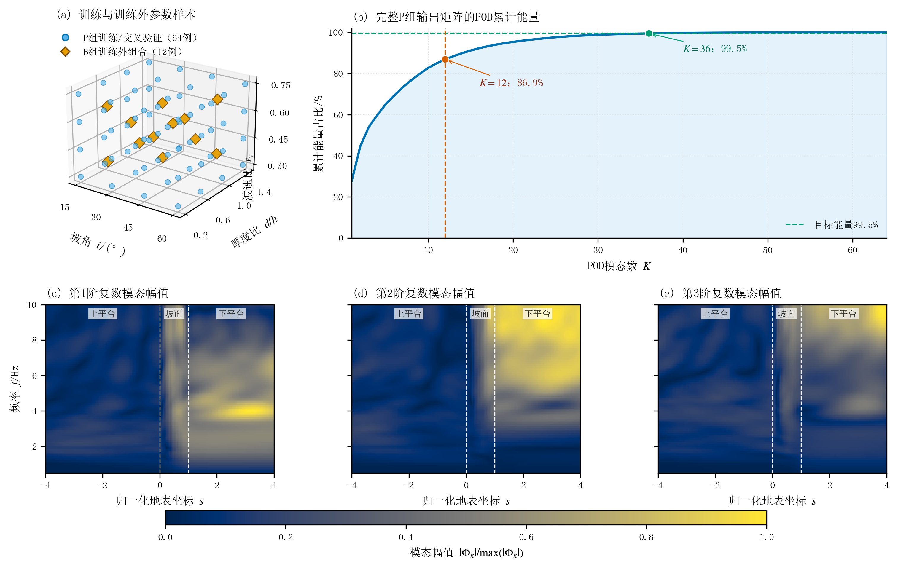

图18 训练与训练外参数样本、POD累计能量及前三阶复数模态：（a）64个P组训练参数点与12个B组训练外参数点；（b）64个P工况相位对齐输出矩阵的累计能量，12、24和36阶分别为86.906%、97.282%和99.523%；（c）～（e）按输出标准差还原后的前三阶复数模态幅值

Fig. 18 Training and training-excluded parameter samples, cumulative POD energy, and the first three complex modes

训练配置把累计能量目标设为0.995，同时把最多保留阶数限制为12。按完整P组重新分解后，12阶保留86.906%的标准化输出能量；达到99.5%需要36阶，此时实际累计能量为99.523%。因此，主模型不能写成“12阶保留99.5%能量”。在标准化实—虚空间中，12阶之后仍有13.094%的平方能量被截去。

能量目标与阶数上限共同决定模型容量。12、24和36阶未保留的标准化方差分别为13.094%、2.718%和0.477%。累计能量是训练矩阵上的重构量，而式（21）是在验证工况、原始复数尺度和输入谱权重下计算，两者的损失空间不同，不能把未保留能量直接解释为预测误差，也不能用能量接近100%推出训练外预测必然准确。

POD系数分别交由三种候选方法预测。最近邻方法在标准化参数空间中寻找欧氏距离最近的P组样本，并直接复制其完整相位对齐总波场响应，用于衡量稀疏规则网格下最简单的局部基线。POD-Ridge以岭回归建立三个输入与POD系数之间的线性映射，正则化系数从 $10^{-5}$～$10^5$ 的21个对数等距候选值中经训练折内部交叉验证确定。POD-GPR则对每一个POD系数独立建立高斯过程，核函数采用各向异性的Matérn-5/2核与白噪声核之和：

$$
k(\boldsymbol{x},\boldsymbol{x}')=
\sigma_f^2 k_{\mathrm{Mat\acute ern},\nu=5/2}
(\boldsymbol{x},\boldsymbol{x}';\ell_i,\ell_{d/h},\ell_{r_v})
+\sigma_n^2\delta_{\boldsymbol{x},\boldsymbol{x}'} . \tag{20}
$$

式（20）中，$\sigma_f^2$ 和 $\sigma_n^2$ 分别为信号方差和噪声方差，$\delta_{\boldsymbol{x},\boldsymbol{x}'}$ 为Kronecker符号。三个方向的长度尺度分别优化，初值均为1，搜索范围为0.01～100；信号常数范围为 $10^{-3}$～$10^3$，白噪声范围为 $10^{-10}$～$10^{-1}$。系数回归采用标准化目标，优化器不作额外随机重启，以固定随机种子20260801保证重复性。现阶段只保存和评价高斯过程的预测均值，没有对后验方差进行校准，因而本文不把GPR输出解释为可信区间。候选方法与主要超参数汇总于表11。

三种候选方法分别对应不同的结构假设。最近邻完全不估计参数间的连续变化，因此不会产生新的峰谷形态，但预测随参数跨过最近节点分界而跳变；它适合作为“只利用已有数值库、不学习插值规律”的下限基线。Ridge假定每个POD系数对三个标准化参数近似线性，能够检验低维压缩后是否只需简单趋势即可恢复场。第3章已观察到厚度—波速比交互和主峰迁移，单一线性映射很可能不足，但保留Ridge有助于判断GPR的改善是否确由非线性映射带来。POD-GPR面向的则是样本数仅64、输入维数只有3的情形；Matérn-5/2核允许系数随参数平滑变化，又不强制其无限光滑，各向异性长度尺度可分别适应坡角、厚度比和波速比方向的变化速度。

独立预测各POD系数是一项有意的简化。POD使训练样本上的系数在二阶统计意义下正交，但未知参数处的系数并不必然相互独立；当峰值迁移需要多个模态按特定比例共同叠加时，逐系数GPR可能给出各自合理、组合后却偏平滑的场。当前方法仍选用这一形式，是因为它在64例小样本下参数较少、训练过程可复现，并便于逐模态查看长度尺度。其代价是没有显式学习模态间联合分布，也没有校准预测方差。故本章把GPR视为候选均值预测器，而不借助“高斯过程自带不确定性”的一般印象扩大结论。

表11 候选代理模型与训练配置

Table 11 Candidate surrogate models and training configurations

| 项目          | 配置                                                                                                                                    |
| ------------- | --------------------------------------------------------------------------------------------------------------------------------------- |
| 输入          | $[i,d/h,r_v]$，在每个外层训练折内标准化                                                                                               |
| 输出          | 96×161完整复数场，实部—虚部拼接为30 912维实向量                                                                                       |
| 有效像素      | 训练折内有效率不低于95%；最终P组拟合保留15 456个复数像素                                                                                |
| POD主配置     | 能量目标0.995；硬上限12阶；实际累计能量86.906%                                                                                          |
| POD有界敏感性 | 24阶：能量97.282%，$E_{\mathrm{complex},w}$ 中位/P90为0.2078/0.3704；36阶：能量99.523%，中位/P90为0.2066/0.3690 |
| 最近邻        | 标准化输入空间欧氏距离；复制最近完整场                                                                                                  |
| POD-Ridge     | $\alpha=10^{-5}$～$10^5$，21个候选；由训练折内交叉验证选择                                                                          |
| POD-GPR       | 独立系数回归；各向异性Matérn-5/2核与白噪声核；模态系数目标标准化                                                                       |
| GPR边界       | $\ell\in[10^{-2},10^2]$，信号常数 $[10^{-3},10^3]$，噪声 $[10^{-10},10^{-1}]$                                                     |
| 外层验证      | 5折整工况划分，打乱后固定随机种子20260801；每折验证12～13例                                                                             |
| 模型选择      | POD-GPR相对最优简单基线的$E_{\mathrm{complex},w}$ 中位数至少降低5%                                                                    |

全部P组重拟合后，12个POD系数对应的优化长度尺度在标准化参数空间内分别落在0.557～3.83（坡角）、0.0899～2.82（厚度比）和0.0869～2.29（波速比）之间；第一系数的白噪声水平为0.00351，其余系数收敛到 $10^{-6}$。高阶系数在厚度比或波速比方向出现较短长度尺度，与总波场响应条带随覆盖层参数快速移动的现象相符。不过，每个POD系数混合了多个频率和空间位置，长度尺度仅用于描述回归映射的变化快慢，不直接等同于第3章的物理主效应。

长度尺度跨度本身也提示同一套固定采样网格对不同模态并不等价。坡角方向的最短尺度仍为0.557，而厚度比和波速比方向分别低至0.0899和0.0869，说明至少部分高阶系数在后两个方向上变化得更急；当相邻训练水平之间存在这种快速变化时，GPR只能依据两端样本推断中间形态，局部峰值便可能被平滑。另一方面，多数白噪声收敛到很小的数值，与有限元数据本身基本确定的性质一致，误差不应被简单解释为随机观测噪声。第一系数保留较高白噪声，更可能是在当前核形式下吸收未被平稳协方差充分描述的变化。由于没有重复数值试验用于独立估计噪声，该参数只作为拟合项解释，不赋予测量噪声的物理含义。

评价以有效掩码内、按输入频率能量加权的复数相对误差为主：

$$
E_{\mathrm{complex},w}=\left[
\frac{\sum_{f,s}M(f,s)w(f)\lvert\widehat{G}_h(f,s)-G_h(f,s)\rvert^2}
{\sum_{f,s}M(f,s)w(f)\lvert G_h(f,s)\rvert^2}
\right]^{1/2} . \tag{21}
$$

其中，$M$ 为真值与预测共同有效的掩码，$w(f)$ 为该工况宽频输入在对应频点的能量权重。该指标同时惩罚幅值和相位偏差，但一个总数不能说明误差发生在哪里，因此另行计算对数幅值均方根误差、圆周相位均方根误差、群时延误差、空间相位梯度误差，以及全场最大幅值、峰值频率和峰值位置的偏差。圆周相位误差通过 $\angle(\widehat{G}_hG_h^*)$ 计算，避免跨越 $\pm\pi$ 时直接相减产生假大误差；群时延在连续有效频段内由解缠相位对频率的导数获得。频率分层采用0.5～3 Hz、3～6 Hz和6～10 Hz三个频带，空间分层采用上平台A段、坡面B段和下平台C段。所有指标先逐工况计算，再汇总工况中位数与P90；这种做法使少数困难工况不会被平均值掩盖。

这些指标分别对应不同的失真方式。对数幅值误差把放大一倍和缩小一半处理为方向相反、量级相当的偏差，避免高放大区以绝对差值压倒其余区域；圆周相位误差关注同一频点的相位对齐；群时延与空间相位梯度又进一步放大相位沿频率和位置变化的不一致。峰值幅值、峰频和峰位则只追踪全场极值，可能对一个网格点的轻微竞争非常敏感。因而本文以 $E_{\mathrm{complex},w}$ 选定总体模型，同时保留局部和导数型指标检查代价。若一个模型综合误差较低而峰频误差较大，应解释为它恢复了大部分能量加权场，却没有稳定识别竞争峰中的全局最大者，不能把两项结果看成互相矛盾。

外层交叉验证以完整物理工况为最小划分单元，同一工况的全部频率和空间点只能同时出现在训练折或验证折中，不能把单个网格点随机拆分。每一折均重新拟合输入标准化、输出填补与标准化、POD基底及回归器，模型选择完成后才用全部64个P工况重新拟合并冻结主模型。P组和B组均按式（13）计算 $G_h$，12个B工况始终不参与训练和模型选择。由于B组并非严格一次性启封的盲测集，本文将其称为训练外组合验证。

五折划分的验证对象仍位于P组四级规则网格上，所以它检验的是“缺少部分节点时能否恢复这些节点”，而不是任意连续参数上的完全独立泛化。随机种子固定可以保证三种模型面对相同难度的折，但不能消除某一折恰好聚集较多软厚覆盖层工况造成的波动。本文因此不把某一折的结果单独作为优劣依据，而看64例汇总分布，并用B组补充训练水平之间的组合。对参数域外输入，标准化距离、核相关性和POD基底都可能离开训练依据，现有验证没有提供可量化的可靠性保证。

### 4.2 代理模型精度与泛化能力

#### 4.2.1 模型选择与交叉验证

图19比较三种候选方法在64个P组工况上的整工况五折结果。最近邻、POD-Ridge和POD-GPR的 $E_{\mathrm{complex},w}$ 中位数分别为0.2877、0.3887和0.2165，P90分别为0.7262、0.6491和0.3672。POD-GPR相对误差较小的简单基线最近邻降低24.8%，超过5%的选模门槛，因此选定POD-GPR作为后续冻结模型。不过，21.6%的中位误差和36.7%的P90仍表明它只能用于近似恢复主要模式，不能作为无误差的有限元替代。

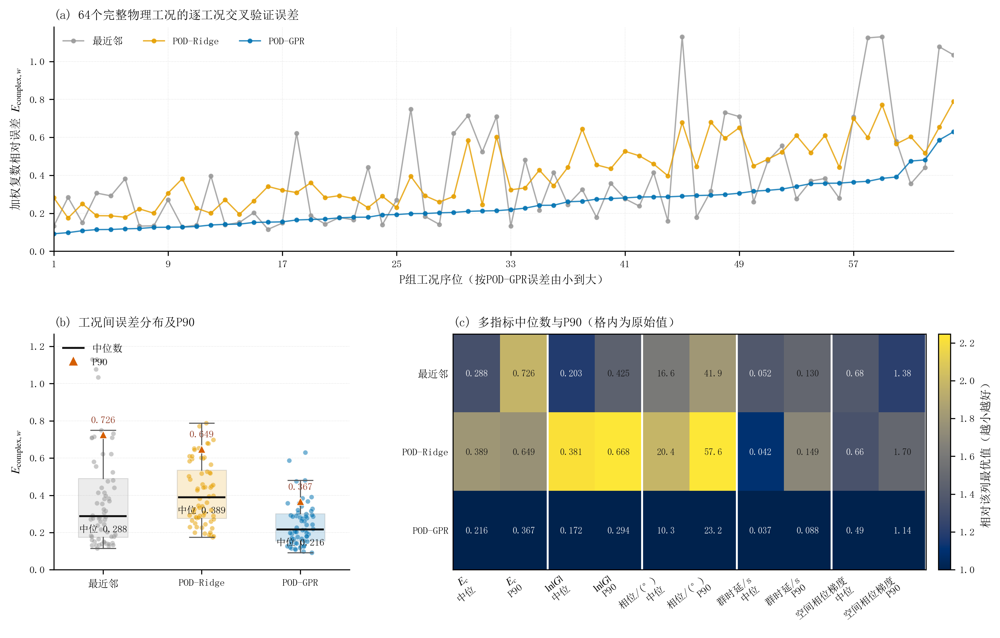

图19 三种候选代理模型的五折交叉验证结果：（a）64个P组工况逐工况加权复数误差；（b）该误差的分布、中位数与90%分位数（P90）；（c）对数幅值、圆周相位、群时延、空间相位梯度、峰值幅值、峰频和峰位误差的中位数与P90

Fig. 19 Five-fold cross-validation of the three candidate surrogates: case-wise complex errors, error distributions, and field metrics

表12给出与图19一致的精确统计。POD-GPR的对数幅值误差中位数为0.1719，圆周相位误差中位数为10.28°，群时延和空间相位梯度中位误差分别为0.0374 s和0.490 rad/单位归一化坐标，均优于两种基线。其主峰频率误差中位数仍为2.15 Hz，高于最近邻的1.15 Hz，说明按全场复数误差选模并不保证最不利峰的位置同时最优。

最近邻在部分极值指标上的优势有明确的算法含义。它复制一个真实计算过的完整场，因而保留了尖锐峰值和网格级极值，不会像低阶基底与连续回归那样把竞争峰平均化；代价是所复制的峰可能来自错误的参数节点，场的整体相位和区域结构因而偏差较大。POD-Ridge的综合误差中位数甚至高于最近邻，且对数幅值与相位误差同时增大，说明POD压缩本身并不能保证有效预测，三个参数到模态系数的线性关系不足以描述第3章发现的交互和迁移。POD-GPR最显著的改善出现在相位、群时延及空间相位梯度，说明连续非线性映射较好地恢复了场的整体传播关系；但其幅值上尾和峰频仍受平滑影响。选用POD-GPR是基于预先规定的综合误差标准，而不是宣称它在所有用途上支配另外两种方法。

表12 三种候选代理的五折交叉验证指标（中位数/P90）

Table 12 Five-fold cross-validation metrics of the three candidate surrogates (median/P90)

| 模型      | $E_{\mathrm{complex},w}$ | $\ln\lvert G_h\rvert$ RMSE | 相位RMSE/(°) |  群时延RMSE/s | 空间相位梯度RMSE/(rad/单位归一化坐标) | 峰值幅值误差/% | 峰频误差/Hz | 峰位误差$\lvert\Delta s\rvert$ |
| --------- | -------------------------: | ---------------------------: | ------------: | ------------: | ------------------------------------: | -------------: | ----------: | -------------------------------: |
| 最近邻    |              0.2877/0.7262 |                0.2032/0.4248 |   16.57/41.88 | 0.0520/0.1299 |                           0.682/1.383 |     6.85/31.96 |   1.15/5.14 |                      0.075/2.890 |
| POD-Ridge |              0.3887/0.6491 |                0.3811/0.6683 |   20.36/57.58 | 0.0417/0.1490 |                           0.657/1.699 |    17.39/40.63 |   3.40/7.07 |                      0.050/3.885 |
| POD-GPR   |              0.2165/0.3672 |                0.1719/0.2943 |   10.28/23.19 | 0.0374/0.0876 |                           0.490/1.141 |     9.54/27.18 |   2.15/6.74 |                      0.050/1.970 |

五个外层验证折的POD-GPR误差中位数依次为0.2990、0.2045、0.2857、0.1795和0.2620，相应P90为0.3898、0.3148、0.4519、0.2423和0.3389。按物理参数回看，$r_v=0.30$、0.45、0.60和0.75四组的误差中位数分别为0.331、0.284、0.189和0.141；$d/h=0.20$、0.60、1.00和1.40四组依次为0.161、0.236、0.262和0.245。误差总体随覆盖层变软而增大，厚度方向则仍受峰带换位影响而非严格单调。

波速比两端的差异尤其明显：$r_v=0.30$ 组的中位误差约为 $r_v=0.75$ 组的2.39倍；厚度比从0.20增至1.40时，中位误差约增至原来的1.79倍。这些数值是按单参数分组后的条件分布，不能被解释为彼此独立的因果贡献，因为每组仍混合了其余两项参数。它们的价值在于把统计误差重新连接到总波场响应的物理特征：软、厚覆盖层产生更多窄带峰谷和频率迁移，同样的四级采样间距需要表达更高的局部曲率。折间起伏与参数分组给出了一致方向，因此困难上尾更像结构性的采样问题，而非一次随机划分异常。

为区分POD截断与系数回归误差，在相同样本划分下进行了24阶、36阶敏感性复算。24阶累计能量为97.282%，中位误差由12阶的0.2165降至0.2078，P90由0.3672变为0.3704；36阶累计能量达到99.523%，中位误差为0.2066，P90为0.3690。增加模态使中位误差小幅改善，却没有降低误差上尾，说明困难工况主要受模态系数映射、样本密度和局部峰值迁移控制。后文仍使用预先冻结的12阶主模型，24阶和36阶只作容量诊断。

从12阶提高到24阶，中位误差绝对降低0.0086，而P90反而增加0.0032；24阶到36阶中位误差只再降低0.0012。由此可见，继续增加模态的收益已明显趋缓，后续资源应优先用于软厚区域加密，而不是把模态数当成唯一旋钮。

阶数提高还会增加需要独立学习的系数数量，而样本总数仍为64。越靠后的模态训练方差越小、空间形态越细，系数对参数的局部变化反而可能更难由稀疏样本识别。因此，“真值重构能力增加”和“未知工况预测能力增加”并不同步，36阶接近能量目标却没有继续降低验证误差，正是二者分离的直接表现。

图20进一步把POD-GPR误差按频带和空间区段拆开。低、中、高频对数幅值误差中位数分别为0.0631、0.1488和0.2203，高频约为低频的3.49倍；相位误差中位数依次为5.30°、8.82°和12.54°，高频约为低频的2.37倍，P90达到26.33°。模型对高频窄条带和快速相位转折的预测仍明显更困难。

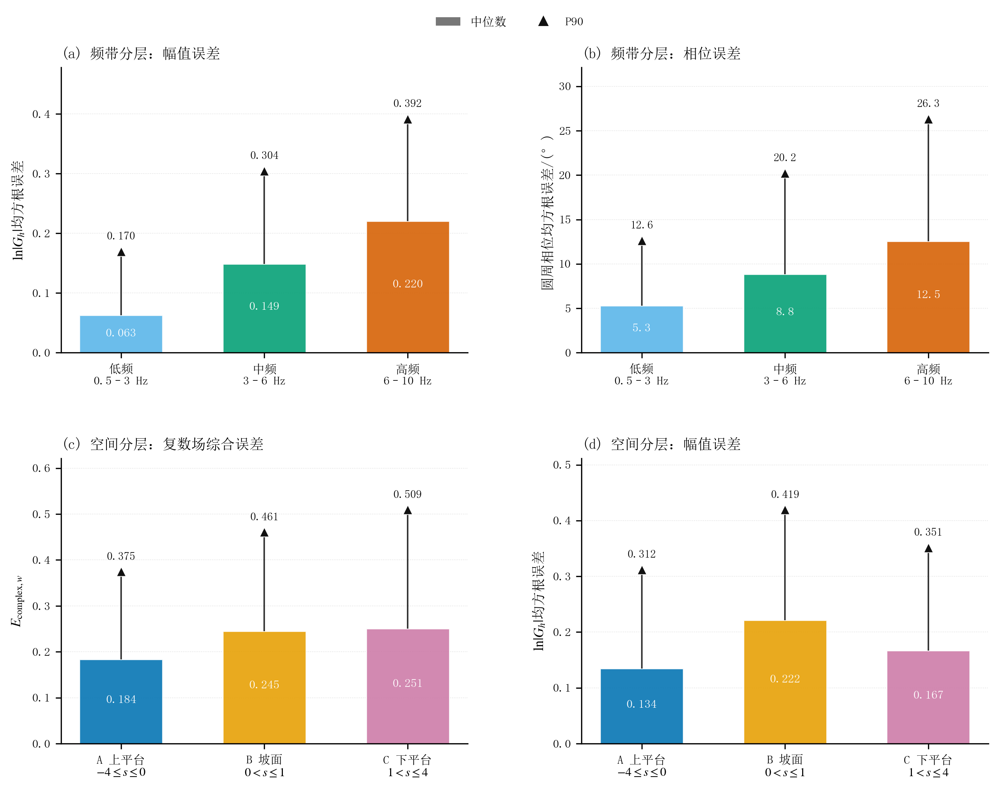

图20 POD-GPR交叉验证误差分层：（a）、（b）低频0.5～3 Hz、中频3～6 Hz和高频6～10 Hz的对数幅值与圆周相位误差；（c）、（d）上平台A段（$-4\le s\le0$）、坡面B段（$0<s\le1$）和下平台C段（$1<s\le4$）的复数综合误差与对数幅值误差；柱高为工况中位数，三角形为P90

Fig. 20 POD-GPR cross-validation errors stratified by frequency band and surface segment

表13给出了空间分层差异。上平台A段的复数误差中位数为0.180，坡面B段增至0.333，下平台C段为0.301；坡面中位误差较上平台高84.6%。下平台的P90达到0.759，为三个区段最高，说明少数困难工况的误差会沿坡脚散射后向下平台扩展。结合图18的POD模态可见，坡面和下平台的中高频结构分散在多个模态中，不受单一模态控制；24/36阶敏感性进一步表明，增加模态只能改善典型工况，难以消除C段的上尾误差。

B段和C段的复数误差中位数分别为0.2450和0.2506，均高于上平台A段的0.1836；C段P90达到0.5095，为三个区段最高。高频对数幅值和相位中位误差分别为低频的3.49倍和2.37倍，说明误差仍集中在高频、坡面和下平台，而非均匀散布于全场。

表13 POD-GPR误差的频带与空间分层（中位数/P90）

Table 13 Frequency-band and spatial-segment errors of POD-GPR (median/P90)

| 分层类型 | 范围      | $\ln\lvert G_h\rvert$ RMSE | 相位RMSE/(°) | $E_{\mathrm{complex},w}$ |
| -------- | --------- | ---------------------------: | ------------: | -------------------------: |
| 频带     | 0.5～3 Hz |                0.0631/0.1695 |    5.30/12.64 |                         — |
| 频带     | 3～6 Hz   |                0.1488/0.3045 |    8.82/20.23 |                         — |
| 频带     | 6～10 Hz  |                0.2203/0.3916 |   12.54/26.33 |                         — |
| 空间段   | A，上平台 |                0.1344/0.3120 |            — |              0.1836/0.3747 |
| 空间段   | B，坡面   |                0.2216/0.4194 |            — |              0.2450/0.4609 |
| 空间段   | C，下平台 |                0.1668/0.3513 |            — |              0.2506/0.5095 |

#### 4.2.2 训练外组合预测与误差分布

在确定POD-GPR后，用全部64个P组工况重新拟合12阶主模型，并对B001～B012逐例预测。B组误差中位数为0.2304，与P组五折交叉验证中位数0.2165接近；B组P90为0.6674，明显高于交叉验证P90的0.3672。12例中有9例不超过0.3672，B001、B011和B004超过该值，最大误差B004为0.7437。这说明相位对齐改善了典型工况的学习难度，却没有消除软覆盖层组合的误差上尾。

中心值接近而上尾分离，是B组最重要的信息。B组使用中间参数水平，更容易落在响应曲面弯曲而两端样本不足的位置。12例规模较小，P90不能用于估计连续参数域的失效概率；但三个超出交叉验证P90的工况均属于低波速比组合，使上尾升高具有物理一致性。

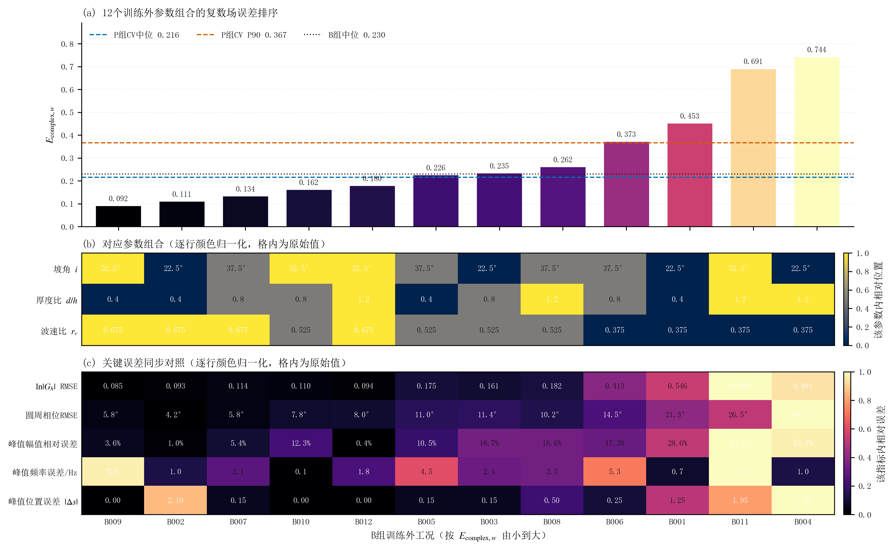

图21 训练外组合的逐例误差与参数对照：（a）按输入谱加权复数误差排序的12个B组工况；（b）对应坡角、厚度比和波速比；（c）对数幅值RMSE、圆周相位RMSE、峰值幅值相对误差、峰频误差和峰位误差

Fig. 21 Case-wise errors and parameters of the 12 training-excluded combinations

训练外结果仍呈清晰的波速比分层。$r_v=0.375$、0.525和0.675三组的复数误差中位数分别为0.5720、0.2304和0.1223，P90分别为0.7279、0.2537和0.1662。最困难的B001、B011和B004均属于$r_v=0.375$，其中B011和B004同时具有较大厚度比1.20。不过，低波速比并不必然导致失败，B006同为$r_v=0.375$，误差为0.3729，仍低于另外三例。

三档波速比的中位误差相差约4.68倍。B006提供了必要反例：低波速比提高急剧响应变化的可能性，但较大厚度比和特定坡角进一步决定条带是否落在难以插值的位置，因此不能把单一波速比阈值直接写成失效判据。

12个训练外组合的逐例数值结果见表14。

表14 12个训练外中间参数组合的预测误差

Table 14 Prediction errors for the 12 training-excluded intermediate parameter combinations

| 工况 | $i$/(°) | $d/h$ | $r_v$ | $E_{\mathrm{complex},w}$ | $\ln\lvert G_h\rvert$ RMSE | 相位RMSE/(°) | 峰值幅值误差/% | 峰频误差/Hz | 峰位误差$\lvert\Delta s\rvert$ |
| ---- | ---------: | ------: | ------: | -------------------------: | ---------------------------: | ------------: | -------------: | ----------: | -------------------------------: |
| B001 |       22.5 |    0.40 |   0.375 |                     0.4527 |                       0.5461 |         21.32 |          28.61 |         0.7 |                             1.25 |
| B002 |       22.5 |    0.40 |   0.675 |                     0.1106 |                       0.0929 |          4.24 |           0.99 |         1.0 |                             2.10 |
| B003 |       22.5 |    0.80 |   0.525 |                     0.2348 |                       0.1612 |         11.43 |          18.73 |         2.4 |                             0.15 |
| B004 |       22.5 |    1.20 |   0.375 |                     0.7437 |                       0.8812 |         46.86 |          52.44 |         1.0 |                             2.45 |
| B005 |       37.5 |    0.40 |   0.525 |                     0.2261 |                       0.1750 |         11.05 |          10.47 |         4.5 |                             0.15 |
| B006 |       37.5 |    0.80 |   0.375 |                     0.3729 |                       0.4129 |         14.54 |          17.31 |         5.3 |                             0.25 |
| B007 |       37.5 |    0.80 |   0.675 |                     0.1339 |                       0.1144 |          5.83 |           5.42 |         2.1 |                             0.15 |
| B008 |       37.5 |    1.20 |   0.525 |                     0.2618 |                       0.1824 |         10.20 |          18.61 |         2.5 |                             0.50 |
| B009 |       52.5 |    0.40 |   0.675 |                     0.0918 |                       0.0852 |          5.78 |           3.59 |         7.1 |                             0.00 |
| B010 |       52.5 |    0.80 |   0.525 |                     0.1623 |                       0.1103 |          7.81 |          12.32 |         0.1 |                             0.00 |
| B011 |       52.5 |    1.20 |   0.375 |                     0.6913 |                       0.9296 |         26.47 |          54.07 |         7.3 |                             1.95 |
| B012 |       52.5 |    1.20 |   0.675 |                     0.1800 |                       0.0942 |          7.95 |           0.37 |         1.8 |                             0.00 |

表14还揭示综合误差与峰值指标不等价。B009的复数误差最低，仅0.0918，峰频误差却达到7.1 Hz；B002的复数误差为0.1106，峰位误差仍为2.10。一个窄区域内的竞争峰换位可能只占少量网格，不足以显著抬高全场综合误差，因此代理用于极值搜索时必须同时读取峰频和峰位误差。

B002与B009还说明，全局最大点可能由两个幅值接近的局部峰竞争产生。代理只要使次峰略高于原主峰，峰频或峰位指标便会发生很大跳变，而其余绝大多数网格仍可保持接近。反过来，峰位为零也不保证场形态正确，B003正是这种情形。用于参数筛查时，综合误差适合判断整体相位对齐总波场响应能否用于谱加权重构，极值指标则适合回答“最不利频率和位置是否找对”。二者应并列报告，工程复核应由实际用途决定侧重点。

图22选取B002、B003和B004作为好、中、难三类代表。B002三个空间段的复数误差分别为0.103、0.107和0.132；B003为0.239、0.204和0.239，主要表现为中高频条带被平滑；B004差异最显著，A、B、C段误差依次为0.296、0.542和0.947，高频对数幅值RMSE和相位RMSE分别为1.307和66.72°，真值最大幅值处相位误差为162.8°。困难组合的误差集中于高频坡面和下平台，而不是全场随机噪声。

三幅残差场把统计量背后的失真过程区分开来。B002误差零散，B003表现为条带被平滑和下平台逐步低估，B004则在相同频段同时出现幅值低估和相位偏离。B004的C段复数误差0.947高于全场0.744，验证了下平台困难端。

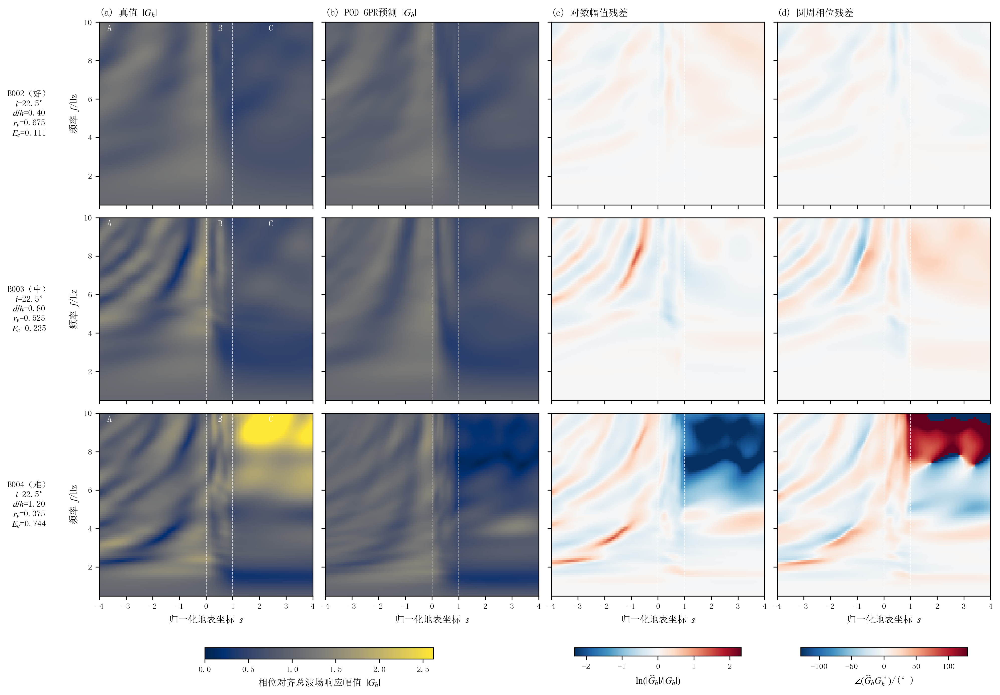

图22 训练外好、中、难工况的相位对齐总波场响应真值、POD-GPR预测及残差：（上）B002，$i=22.5^\circ$、$d/h=0.40$、$r_v=0.675$；（中）B003，$i=22.5^\circ$、$d/h=0.80$、$r_v=0.525$；（下）B004，$i=22.5^\circ$、$d/h=1.20$、$r_v=0.375$。三例的真值幅值与预测幅值共用同一色标，残差场也分别共用色标；对数幅值残差定义为 $\ln(\lvert G_h^{\mathrm{pred}}\rvert/\lvert G_h^{\mathrm{true}}\rvert)$，正值表示高估，圆周相位残差取预测相位减真值相位；虚线为A/B/C空间段边界

Fig. 22 Complex-FRF truth, POD-GPR prediction, and residual fields for representative easy, intermediate, and difficult training-excluded cases

综合交叉验证和训练外组合结果，当前12阶POD-GPR的中位复数误差分别为21.6%和23.0%，P90分别为36.7%和66.7%。它能够恢复参数域内部的主要结构，但低波速比、较大厚度比及下平台高频响应仍需直接有限元复核。24阶和36阶只小幅降低中位误差，未降低上尾，因此后续改进应优先在软厚区域加密样本。

就当前证据而言，更合适的使用方式是先由代理生成参数域内的相位对齐总波场响应全图，再依据频带、空间段和覆盖层组合判断是否需要有限元复核，而不是给所有预测套用同一个误差百分数。交叉验证与B组给出的是群体误差分布，尚未形成对单个新工况可靠度经过校准的预测区间；GPR后验方差也未完成校准，不能替代这一判断。图20～图22已经把优先复核区域收敛到软厚覆盖层的坡面及下平台中高频结构，后续增样可针对这些残差集中的参数—输出区域进行，而无需均匀扩充整个三维网格。这样的定位既承认代理在低频和典型组合上的计算价值，也保留了对困难工况直接求解的必要性。

因此，本节得到的是适用范围受训练域约束的降阶预测工具及其误差地图，而不是脱离样本域和输入条件仍然成立的通用公式。POD用于压缩高维场，高斯过程用于学习参数到模态系数的映射，这种组合与既有降阶建模和代理学习的基本思路一致[25-30]；本文的区别在于同时报告复数场、极值位置和训练外上尾误差。后续闭环验证据此采用多记录、多位置评价，而不只展示单个坡顶时程。

### 4.3 真实地震波闭环验证

交叉验证和训练外组合评价所回答的是代理模型能否复现宽频相位对齐总波场响应，尚不能直接说明其重构工程地震动的能力。为此，本文进一步设置“真实记录输入—自由场计算—代理响应预测—水平传播相位还原—地表总波场时程重构—直接有限元对照”的闭环。闭环共包括 C001～C010 十个算例，涉及四种坡地体系：P007（$i=15^\circ$、$d/h=0.60$、$r_v=0.45$）、P039（$i=45^\circ$、$d/h=0.60$、$r_v=0.60$）、P061（$i=60^\circ$、$d/h=1.40$、$r_v=0.30$）和训练外中间组合 B007（$i=37.5^\circ$、$d/h=0.80$、$r_v=0.675$）。P007、P039、P061 和 B007 分别在 El Centro 与 Kobe 记录下计算，P039 和 B007 另在 Chi-Chi 记录下计算。每个 C 算例均重新进行二维直接有限元分析，后者只作为闭环真值，不参与代理训练、模型选择或参数调整。

四种体系中，P007、P039和P061属于代理训练参数节点，B007则位于训练网格之间。因此，前三者的闭环主要检验“已覆盖节点的频响经新输入重构时程”，B007还叠加了参数插值这一层困难。十例不是按四体系与三记录的完整全因子配置，比较记录效应时必须保留这种不平衡性；但这种安排能够同时观察训练节点、训练外组合以及从较硬覆盖层到软厚覆盖层的不同响应条件。

三条记录均采用水平分量，预处理后峰值加速度为 0.1g，时间步长为 0.001 s；El Centro、Kobe 和 Chi-Chi 的有效持时分别为 31.2、40.9 和 52.8 s。原始记录在重采样前经过六阶零相位 Butterworth 12 Hz 低通滤波，并进行端点速度趋势校正，以降低高频混叠和积分漂移。对每条记录及相应坡地剖面，建模阶段同步计算左侧上平台高度处的自由场时程 $a_{h,L}^{\mathrm{ff}}(t)$。该时程不是后处理中人为缩放出的参考曲线，而是与坡地模型采用相同入射波、介质参数和阻尼设置的成层自由场传播结果。闭环重构先由左侧自由场复谱形成相位对齐响应，预测后再乘回各位置的水平传播相位。

图23给出了三条左侧一维自由场时程及其在本文分析频带内的能量构成。能量占比由有效持时内的傅里叶能量在各频带积分得到，并以 0.5～10 Hz 总能量归一化。El Centro 在 0.5～3、3～6 和 6～10 Hz 的能量占比分别为 37.9%、55.5% 和 6.6%；Kobe 分别为 38.0%、52.1% 和 9.8%；Chi-Chi 分别为 40.7%、39.9% 和 19.4%。因此，El Centro 与 Kobe 有 93.4% 和 90.1% 的频带能量集中在 6 Hz 以下，而 Chi-Chi 的相应比例为 80.6%。这里更准确的说法不是三条记录都“只含低频”，而是它们在代理误差较大的 6～10 Hz 频段所占权重有限，其中 Chi-Chi 的高频权重明显高于前两条记录。该差别为后文解释频域误差与时域误差之间的关系提供了直接依据。

三条记录都缩放到0.1g只统一了峰值量级，并没有统一频谱形状。El Centro与Kobe的中频能量均超过一半，二者的主要差别体现在高频占比由6.6%增至9.8%；Chi-Chi的中频占比降至39.9%，高频占比则升至19.4%，其高频权重分别约为前两者的2.9倍和2.0倍。代理总波场预测谱的误差会按输入谱逐频加权，同一处响应偏差只有与记录的能量频带重合时，才会明显进入时域平方误差。因而图23不是一般性的地震动强弱比较，而是闭环误差传递所需的输入条件说明；峰值相同的记录仍可能对代理的高频薄弱区施加不同权重。

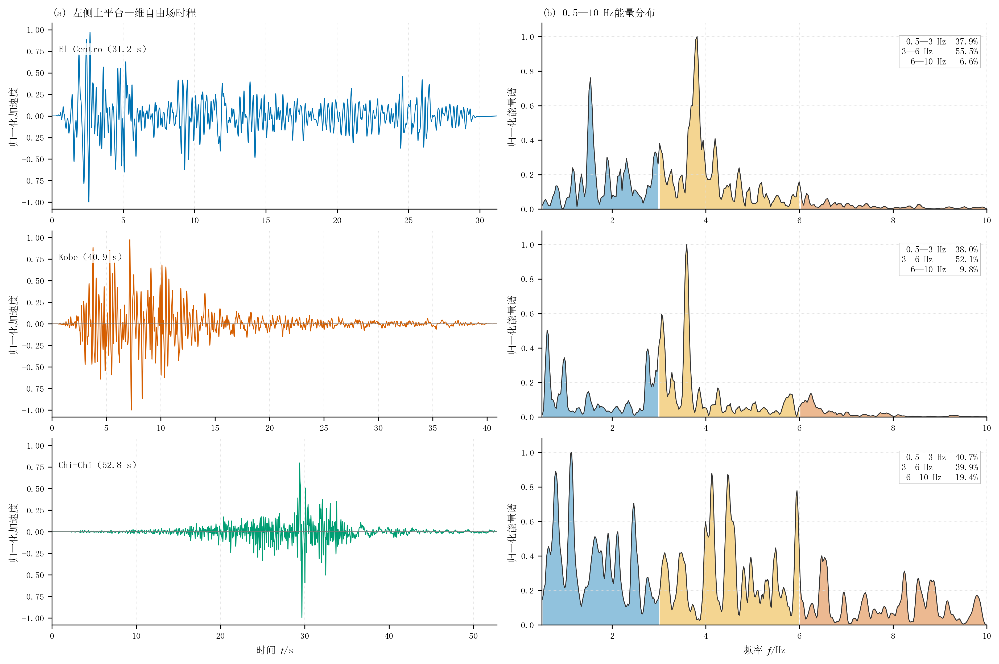

图23 三条真实记录对应的左侧上平台一维自由场：（a）归一化加速度时程；（b）0.5～10 Hz 归一化能量谱及0.5～3、3～6、6～10 Hz频带能量占比

Fig. 23 Left upper-platform one-dimensional free fields of the three real records: normalized time histories and energy spectra

对给定参数组合 $\boldsymbol{\theta}=(i,d/h,r_v)$ 和地震记录 $g$，冻结后的 POD-GPR 模型先预测公共网格上的相位对齐总波场响应 $\widehat{G}_h(f,s;\boldsymbol{\theta})$。随后，将左侧自由场时程变换至频域，并把式（13）中扣除的水平传播相位乘回，得到地表总波场预测谱：

$$
\widehat a_h^{\mathrm{tot}}(f,s;g)=
\widehat G_h(f,s;\boldsymbol{\theta})\,
\widehat a_{h,L}^{\mathrm{ff}}(f;g)\,
\exp\!\left[-\mathrm{i}2\pi fp\bigl(x(s)-x_{\mathrm{ref}}\bigr)\right]. \tag{22}
$$

模型在 0.5～10 Hz、0.1 Hz 间隔的 96 个频点上给出相位对齐总波场响应，重构时分别对其实部和虚部插值至地震记录的快速傅里叶变换（fast Fourier transform，FFT）频率网格，并在频带两端施加 0.2 Hz 余弦渐变窗。随后按式（22）乘回当地水平传播相位和左侧自由场复谱。这样既恢复总波场的物理相位，又避免在 0.5 和 10 Hz 处硬截断产生明显振铃。补足共轭频谱后进行IFFT，得到 161 个公共地表位置的预测加速度时程 $a_h^{\mathrm{pred}}(t,s)$。直接有限元时程采用完全相同的时间范围和 0.5～10 Hz 频带窗处理后再参与比较，因而表中误差反映的是“代理总波场响应驱动的重构”与“同频带直接有限元响应”之间的差别，而不是一个经过带限、另一个保留全频所造成的口径差。

这里必须使用复数预测而不能只把幅值谱乘回输入。幅值决定各频率成分的强弱，相位决定这些成分在时域何时叠加；幅值接近但相位存在系统偏差时，PGA仍可能偶然接近，整段波形却会错位。实部和虚部在同一FFT网格上插值，再通过共轭对称恢复实值时程，使第4.2节的相位、群时延误差能够真实传递到闭环指标。预测与有限元采用同一带限和渐变窗，则把比较范围限定在代理实际覆盖的0.5～10 Hz内。由此得到的良好结果不能推广到0.5 Hz以下或10 Hz以上，而带外误差也不会被混入对代理的评价。

闭环评价在每个地表位置分别计算时程归一化均方根误差、相关系数、PGA 相对误差和峰值时刻误差。以 $a_h^{\mathrm{pred}}$ 表示代理预测时程，以 $a_h^{\mathrm{FE}}$ 表示直接有限元（finite element，FE）时程，时程误差定义为

$$
E_t(s)=\frac{\left\|a_h^{\mathrm{pred}}(t,s)-a_h^{\mathrm{FE}}(t,s)\right\|_2}{\left\|a_h^{\mathrm{FE}}(t,s)\right\|_2}. \tag{23}
$$

相关系数用于区分整体波形一致性与单纯幅值偏移，PGA 误差为预测峰值与有限元峰值之差相对有限元峰值的绝对值，峰值时刻误差则比较两条时程绝对峰值出现的时间。反应谱采用 5% 阻尼、0.1～2.0 s 的 40 个对数间隔周期，先逐周期求相对误差，再对每个地表位置取周期中位。地形放大系数统一定义为 $\mathrm{TAF}(s)=\mathrm{PGA}_{h}^{\mathrm{tot}}(s)/\mathrm{PGA}_{h,L}^{\mathrm{ff}}$。由于同一算例的预测和真值共用同一个左侧自由场分母，TAF 相对误差与 PGA 相对误差数值相同，故表中不再重复设置一列。表中各项均为一个算例 161 个地表位置的中位数；时程 NRMSE 10%、相关系数 0.95、PGA/TAF 误差 10%和峰值时刻误差 0.02 s为预先设定的判读参考线。反应谱图中的10%线仅作为与PGA同量级的辅助视觉参照，并非新增的强制门槛。

五项指标观察的是不同层次。NRMSE累计全持时内每个采样点的差值，对次峰和尾波的持续偏差敏感；相关系数先去除均值并按方差归一，波形形状相近时即使幅值存在比例差也可能保持较高；PGA和峰值时刻只关注一个极值及其位置；反应谱误差则把时程通过一组单自由度振子重新加权。每个算例先在161个位置上取中位，是为了给出该体系—记录组合的典型空间表现，并不表示最差位置满足同一数值。随后再对十个工况中位取总体中位，又是第二层汇总。后文的逐位置超线比例保留了第一层汇总丢失的空间范围，二者回答的问题不同。十例逐工况结果见表15。

表15 十例真实地震波闭环重构指标（161个地表位置的中位数）

Table 15 Closed-loop reconstruction metrics of the ten real-ground-motion cases (median over 161 surface positions)

| 工况     | 坡地体系/记录    | 时程NRMSE | 相关系数 | PGA/TAF误差 | 峰值时刻误差/s | 5%阻尼反应谱误差 |
| -------- | ---------------- | --------: | -------: | ----------: | -------------: | ---------------: |
| C001     | P007 / El Centro |    25.71% |   0.9665 |       4.83% |          0.083 |            3.00% |
| C002     | P007 / Kobe      |    28.57% |   0.9584 |       7.10% |          0.124 |            4.17% |
| C003     | P039 / El Centro |     9.37% |   0.9956 |       2.65% |          0.001 |            1.33% |
| C004     | P039 / Kobe      |    10.40% |   0.9946 |       2.74% |          0.002 |            1.06% |
| C005     | P061 / El Centro |     9.80% |   0.9958 |       1.82% |          0.002 |            1.95% |
| C006     | P061 / Kobe      |    10.69% |   0.9955 |       4.25% |          0.002 |            2.32% |
| C007     | B007 / El Centro |     9.48% |   0.9957 |       1.99% |          0.001 |            0.87% |
| C008     | B007 / Kobe      |    10.97% |   0.9941 |       1.73% |          0.002 |            1.20% |
| C009     | P039 / Chi-Chi   |    11.22% |   0.9940 |       1.77% |          0.002 |            0.86% |
| C010     | B007 / Chi-Chi   |    11.11% |   0.9939 |       2.86% |          0.001 |            0.75% |
| 十例中位 | —               |    10.83% |   0.9944 |       2.69% |          0.002 |            1.27% |

十例逐工况中位数再取总体中位后，时程NRMSE为10.83%，相关系数为0.9944，PGA/TAF相对误差为2.69%，峰值时刻误差为0.002 s，5%阻尼反应谱相对误差为1.27%。C001、C002、C004、C006、C008、C009和C010的时程NRMSE超过10%，只有3例在线内；C001和C002的峰值时刻误差也分别达到0.083 s和0.124 s。十例相关系数仍均高于0.95，PGA/TAF误差均低于10%。因此，代理能较好保持峰值量级，却尚不能稳定恢复所有组合的完整波列和峰值发生时间。

NRMSE与其余指标出现这种分离并不异常。预测和真值若能对齐主震段的符号、主峰时刻和总体包络，相关系数、PGA及峰时可以同时良好；但大量幅值不高的次峰若持续存在小偏差，平方和仍会把NRMSE推高。反应谱中位误差在十例中为0.65%～2.43%，也说明对当前周期范围内多数振子的需求量，误差小于逐点时程差所显示的程度。不过，反应谱使用周期中位，不能排除个别周期误差较大。表15因此支持的是“主要工程量较稳定、全波形仍有薄弱工况”，不能用四项较好指标抵消NRMSE超线的事实。

图24选取C003、C008和C001代表好、中、差重构水平。三例的时程NRMSE中位数分别为9.4%、11.0%和25.7%，相关系数为0.996、0.994和0.966，PGA误差为2.6%、1.7%和4.8%，峰值时刻误差为0.001、0.002和0.083 s。C001说明PGA仍接近并不保证主峰时刻和完整波列同时正确。

三例的排序依据是当前十例中的时程NRMSE表现，并非把参数域划分成固定的“好、中、差”类别。C003在当前组合下同时保持了波形和TAF，C008说明总体相关仍高时，坡面和下平台可以先出现连续超线；C001则把“峰值基本正确而波列累计误差较大”的情形显示得最清楚。图24把代表位置时程与全地表曲线放在一起，目的正是避免用坡顶单点替代整个表面，也避免由一次峰值吻合推断全部时刻均吻合。

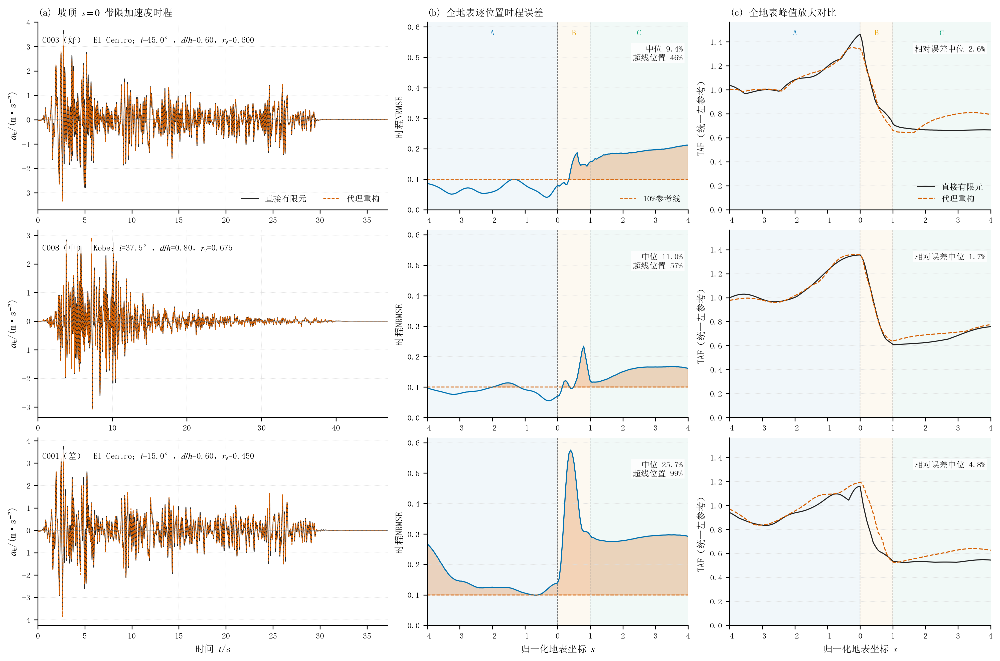

图24 真实地震波闭环好、中、差代表工况：C003为P039/El Centro，C008为B007/Kobe，C001为P007/El Centro；（a）坡顶带限加速度时程；（b）全地表逐位置时程NRMSE；（c）以统一左侧一维自由场为分母的TAF对比

Fig. 24 Representative good, intermediate, and poor real-ground-motion closed-loop cases

C001和C002同属缓坡体系P007，其NRMSE分别为25.71%和28.57%，PGA误差为4.83%和7.10%，峰值时刻误差却达到0.083和0.124 s。现有结果表明两例不仅存在波形累积误差，还出现显著峰时偏差；但十个算例仍不足以把原因唯一归结为坡角较小。C008和C010属于训练外组合B007，NRMSE分别为10.97%和11.11%，也不能仅凭“位于训练网格内部”就视为可靠。

图25将十例的161个位置合并成$10\times161$误差矩阵。逐点计数表明，62.9%的地表位置时程NRMSE超过10%，最大值为0.667。上平台A段、坡面B段和下平台C段的超线比例分别为36.8%、81.0%和92.0%，对应逐点NRMSE中位数为0.090、0.150和0.167。总体中位10.83%不能掩盖坡面和下平台成片的波形误差。

这一差别还与空间采样构成有关。每个工况的161点中，上平台A段有81点，坡面B段20点，下平台C段60点；逐工况中位排序时，上平台占全部位置的一半以上，因而即使坡面和下平台存在连续超线区，也未必把该工况中位显著推高。相反，1610点合并统计逐点保留了每个位置是否超线的信息，所以能够显示坡面和下平台成片偏差。中位数具有抑制极端值的作用，却不保存超线区域的长度；超线比例保存空间范围，却不反映误差超过阈值后的大小。本文逐点总超线比例为62.9%，最大NRMSE为0.667；A、B、C三段的超线比例分别为36.8%、81.0%和92.0%。三者合看，才能同时描述典型水平、影响范围和局部最差值。

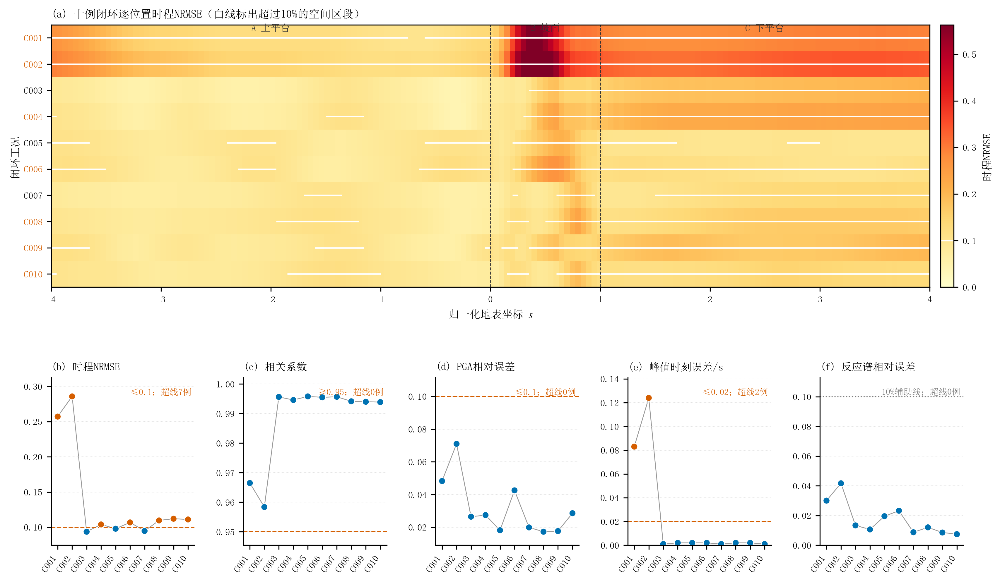

图25 十例真实波闭环结果：（a）$10\times161$逐位置时程NRMSE，白线标出超过10%的连续空间区段；（b）～（f）各指标均先在每个工况的161个地表位置上取中位，依次为时程NRMSE、相关系数、PGA相对误差、峰值时刻误差和5%阻尼反应谱相对误差；虚线分别表示10%、0.95、10%、0.02 s和10%的判读参考线，其中反应谱线仅为辅助视觉参照

Fig. 25 Position-wise errors and integrated metrics of the ten real-ground-motion closed-loop cases

P061 是频域代理评价中较困难的软厚覆盖层体系，但其 El Centro 和 Kobe 闭环 NRMSE 分别为9.80%和10.69%，仍未成为十例时域重构的最差组合。这一现象并不表示高频总波场响应误差可以忽略，而是说明时域闭环误差受到输入能量谱加权。代理误差较集中的6～10 Hz频段在 El Centro 和 Kobe 中仅承载6.6%和9.8%的分析频带能量，其对总时程平方误差的贡献受到了限制；与此同时，0.5～6 Hz承载约九成能量，而代理在该频段总体更稳定。因此，相位对齐总波场响应的未加权误差和特定记录下的时程误差不必保持相同排序。工程应用时应把“代理误差谱”和“输入能量谱”作为一对联合条件判断，而不能只用一个全频平均误差决定是否可用。

Chi-Chi 在6～10 Hz的能量占比为19.4%，约为El Centro的2.9倍、Kobe的2.0倍。其两个闭环算例 C009 和 C010 的 NRMSE 分别为11.22%和11.11%，均略高于10%参考线，但不能据此推导重构误差会随高频占比单调增加。C组的体系—记录组合并不平衡：El Centro和Kobe各覆盖四种体系，而Chi-Chi只覆盖P039与B007；同一记录效应与体系参数效应无法由现有十例完全分离。尤其是Chi-Chi没有在频域困难的P061及高误差的P007上计算，因而缺少检验“高频输入与困难体系叠加”所需的关键组合。本文据此只支持较窄的结论：对于当前参数域、当前三条记录和0.5～10 Hz带限条件，代理重构的总体中位NRMSE略高于10%参考线，峰值和反应谱误差仍较小，但逐例和逐位置的波形误差必须明确报告；对于6～10 Hz能量更强的输入，特别是与软厚覆盖层或其他误差敏感体系组合时，应重新进行直接数值抽查，不宜直接沿用本节的总体中位精度。

还应区分闭环验证与数值模型物理真实性验证。这里的真值是按相同介质、边界和输入条件直接计算的坡地有限元总波场时程，闭环能够检验从参数输入、相位对齐总波场响应预测、水平相位还原、频谱插值到IFFT重构的整条计算链是否与该有限元结果一致，也能够暴露频域场误差在真实记录作用下的工程后果。它不能证明有限元模型已经无偏地代表真实边坡，更不能代替第2章的网格、边界和跨软件验证。由于预测和真值共用同一个左侧自由场，闭环也不会独立检验该参考场本身是否正确；它验证的是在既定参考定义下，代理能否恢复地表总波场响应。

同样，十例结果不能给出参数域外、其他持时和其他频谱记录的普遍误差概率，也没有校准单个预测的置信区间。它能支持的应用结论是分层的：在已覆盖参数域和带限条件内，代理可用于恢复多数工况的主要波形与工程峰值；出现缓坡P007、训练外B007，或输入能量与已知高频薄弱区明显重合时，应查看全地表NRMSE而不是只看坡顶PGA；进入软厚覆盖层下平台高频敏感区时，应安排直接有限元复核。这样的证据边界明确了降阶预测与高保真求解各自承担的环节。

## 5 结 论

本文采用黏弹性人工边界和等效节点力方法，建立了地震波斜入射下的二维线弹性成层坡地模型，并通过关键计算设置复核及Abaqus—SPECFEM2D对比检查代表工况的主要响应。在此基础上，利用宽频激励识别扣除斜入射水平传播相位后的总波场响应函数，研究坡角、覆盖层厚度比和波速比对地表地震动的影响，进一步构建POD-GPR代理模型并开展训练外组合评价和真实地震波闭环验证，主要得出以下结论：

1）总波场响应函数以左侧上平台自由场作为全地表幅值基准，并以各位置的当地入射波作为相位参考。水平传播相位因子的模为1，不改变幅值或有限元总波场解；所得相位和群时延主要反映坡体散射、覆盖层透反射及多波干涉。80个H/P/B工况的最大幅值数值误差为$1.33\times10^{-15}$，复数恒等残差为$6.04\times10^{-15}$。

2）坡角、覆盖层厚度比和波速比均会改变成层坡地总波场响应函数的幅值、控制频带和控制位置。均质坡峰值随坡角增大总体升高，但这一规律在成层坡中不再保持；峰值幅值差异主要受波速比、厚度比及二者交互控制，其贡献率分别为39.65%、34.21%和21.72%。当$d/h=1.40$、$r_v=0.30$时，各坡角均在约4 Hz的下平台形成强响应，坡角主要提高该软厚组合的响应上尾。

3）成层坡地的全场最大响应表现为不同频带和空间位置的候选峰换位。16条厚度序列中有9条峰值呈非单调变化，主峰频率最大跨度为7.3 Hz。特征量$\chi$与中位绝对相位和群时延修正的相关较强，而与净幅值修正幅度的相关较弱。因此，单一特征频率或全场放大系数不足以概括成层坡地响应，工程评价还应同时考虑频带和地表区段。

4）在整工况五折验证和训练外参数组合评价中，POD-GPR对相位对齐总波场响应的中位复数误差分别为21.6%和23.0%，能够近似恢复当前参数域内的主要响应结构。误差主要集中在软厚覆盖层、高频、坡面和下平台，且整体场误差较小并不表示主峰频率和峰位同时准确。B组结果仅反映训练参数网格之间的域内插值能力，不宜解释为参数域外的预测精度。

5）真实地震波闭环的总体中位时程NRMSE为10.83%，10个组合中有7个超过10%，1610个位置样本中有62.9%超过10%，其中坡面和下平台的误差较为集中；总体中位相关系数为0.9944、PGA/TAF误差为2.69%，说明峰值量级较稳定，但完整波列尚未在所有组合下可靠恢复。代理模型在当前二维线性参数域及本组以6 Hz以下能量占优的输入条件下，可用于带限时程和PGA的辅助预测；对于软厚覆盖层组合的高频与下平台响应、高频能量富集输入以及非线性或三维问题，仍需采用直接数值分析。

## 参 考 文 献

[1] DAVIS L L, WEST L R. Observed effects of topography on ground motion[J]. Bulletin of the Seismological Society of America, 1973, 63(1): 283-298.

[2] ÇELEBI M. Topographical and geological amplifications determined from strong-motion and aftershock records of the 3 March 1985 Chile earthquake[J]. Bulletin of the Seismological Society of America, 1987, 77(4): 1147-1167.

[3] GELI L, BARD P Y, JULLIEN B. The effect of topography on earthquake ground motion: a review and new results[J]. Bulletin of the Seismological Society of America, 1988, 78(1): 42-63.

[4] 胡聿贤, 孙平善, 章在墉, 等. 场地条件对震害和地震动的影响[J]. 地震工程与工程振动, 1980(0): 34-41.
HU Yu-xian, SUN Ping-shan, ZHANG Zai-yong, et al. Influence of site conditions on earthquake damage and ground motion[J]. Earthquake Engineering and Engineering Vibration, 1980(0): 34-41.

[5] European Committee for Standardization. Eurocode 8: design of structures for earthquake resistance[S]. Brussels: CEN, 2004.

[6] 中华人民共和国住房和城乡建设部. 建筑抗震设计规范: GB 50011—2010（2016年版）[S]. 北京: 中国建筑工业出版社, 2016.
Ministry of Housing and Urban-Rural Development of the People's Republic of China. Code for seismic design of buildings: GB 50011—2010 (2016 edition)[S]. Beijing: China Architecture and Building Press, 2016.

[7] LI H, LIU Y, LIU L, et al. Numerical evaluation of topographic effects on seismic response of single-faced rock slopes[J]. Bulletin of Engineering Geology and the Environment, 2019, 78(3): 1873-1891.

[8] SHEN H, LIU Y, LI H, et al. Numerical evaluation of ground motion amplification of rock slopes under obliquely incident seismic waves[J]. Soil Dynamics and Earthquake Engineering, 2024, 178: 108488.

[9] 赵仕兴, 杨姝姮, 唐元旭, 等. 四川泸定6.8级地震震中区域建筑震害考察与思考[J]. 建筑结构, 2023, 53(7): 1-8.
ZHAO Shi-xing, YANG Shu-heng, TANG Yuan-xu, et al. Investigation and analysis of building damage in the epicentral area of the Luding Ms 6.8 earthquake in Sichuan[J]. Building Structure, 2023, 53(7): 1-8.

[10] 王鹏程, 罗永红, 刘红枫, 等. "9·5"四川泸定Ms6.8级地震诱发磨西台地地震响应分析[J]. 山地学报, 2024, 42(4): 576-590.
WANG Peng-cheng, LUO Yong-hong, LIU Hong-feng, et al. Seismic response of the Moxi terrace induced by the "9·5" Luding Ms 6.8 earthquake, Sichuan[J]. Journal of Mountain Science, 2024, 42(4): 576-590.

[11] 潘毅, 任靖哲, 任宇, 等. 考虑台地效应的泸定6.8级地震某框架结构震害调查与分析[J]. 土木工程学报, 2024, 57(6): 136-151.
PAN Yi, REN Jing-zhe, REN Yu, et al. Seismic damage investigation and analysis of a frame structure considering the terrace effect in the Luding Ms 6.8 earthquake[J]. China Civil Engineering Journal, 2024, 57(6): 136-151.

[12] BOUCKOVALAS G D, PAPADIMITRIOU A G. Numerical evaluation of slope topography effects on seismic ground motion[J]. Soil Dynamics and Earthquake Engineering, 2005, 25(7-10): 547-558.

[13] ZHANG Z, FLEURISSON J A, PELLET F. The effects of slope topography on acceleration amplification and interaction between slope topography and seismic input motion[J]. Soil Dynamics and Earthquake Engineering, 2018, 113: 420-431.

[14] GALLIPOLI M R, BIANCA M, MUCCIARELLI M, et al. Topographic versus stratigraphic amplification: mismatch between code provisions and observations during the L'Aquila (Italy, 2009) sequence[J]. Bulletin of Earthquake Engineering, 2013, 11(5): 1325-1336.

[15] HAILEMIKAEL S, LENTI L, MARTINO S, et al. Ground-motion amplification at the Colle di Roio ridge, central Italy: a combined effect of stratigraphy and topography[J]. Geophysical Journal International, 2016, 206(1): 1-18.

[16] TRIPE R, KONTOE S, WONG T K C. Slope topography effects on ground motion in the presence of deep soil layers[J]. Soil Dynamics and Earthquake Engineering, 2013, 50: 72-84.

[17] ASSIMAKI D, KAUSEL E, GAZETAS G. Soil-dependent topographic effects: a case study from the 1999 Athens Earthquake[J]. Earthquake Spectra, 2005, 21(4): 929-966.

[18] SHEN H, LIU Y, LI X, et al. The combined amplification effects of topography and stratigraphy of layered rock slopes under vertically and obliquely incident seismic waves[J]. Soil Dynamics and Earthquake Engineering, 2025, 193: 109331.

[19] RIZZITANO S, CASCONE E, BIONDI G. Coupling of topographic and stratigraphic effects on seismic response of slopes through 2D linear and equivalent linear analyses[J]. Soil Dynamics and Earthquake Engineering, 2014, 67: 66-84.

[20] PELEKIS P, BATILAS A, PEFANI E, et al. Surface topography and site stratigraphy effects on the seismic response of a slope in the Achaia-Ilia (Greece) 2008 Mw6.4 earthquake[J]. Soil Dynamics and Earthquake Engineering, 2017, 100: 538-554.

[21] LUO Y, FAN X, HUANG R, et al. Topographic and near-surface stratigraphic amplification of the seismic response of a mountain slope revealed by field monitoring and numerical simulations[J]. Engineering Geology, 2020, 271: 105607.

[22] VAHDANI S, WIKSTROM S. Response of the Tarzana strong motion site during the 1994 Northridge earthquake[J]. Soil Dynamics and Earthquake Engineering, 2002, 22(9): 837-848.

[23] ASHFORD S A, SITAR N. Analysis of topographic amplification of inclined shear waves in a steep coastal bluff[J]. Bulletin of the Seismological Society of America, 1997, 87(3): 692-700.

[24] 申辉, 刘亚群, 刘博, 等. 地震波斜入射下岩质边坡放大效应的数值模拟研究[J]. 岩土力学, 2023, 44(7): 2129-2142.
SHEN Hui, LIU Ya-qun, LIU Bo, et al. Numerical study on the amplification effect of rock slopes under oblique incidence of seismic waves[J]. Rock and Soil Mechanics, 2023, 44(7): 2129-2142.

[25] 陈咏珊. 基于卷积神经网络预测下哈特盆地地表地震动放大特征[D]. 广州: 广东工业大学, 2023.
CHEN Yong-shan. Prediction of surface ground motion amplification characteristics of the Lower Hutt Basin based on convolutional neural network[D]. Guangzhou: Guangdong University of Technology, 2023.

[26] 赵嘉玮. 基于机器学习算法的复杂场地地震动放大效应和非线性效应预测模型研究[D]. 天津: 天津城建大学, 2024.
ZHAO Jia-wei. Research on prediction models of ground motion amplification and nonlinear effects in complex sites based on machine learning algorithms[D]. Tianjin: Tianjin Chengjian University, 2024.

[27] 罗麒锐, 赵仕兴, 吴启红, 等. 基于地形参数的地震动放大系数数值分析与预测方法[J]. 建筑结构, 2025, 55(2): 50-57, 35.
LUO Qi-rui, ZHAO Shi-xing, WU Qi-hong, et al. Numerical analysis and prediction method of ground motion amplification factor based on topographic parameters[J]. Building Structure, 2025, 55(2): 50-57, 35.

[28] 周红, 常莹. 利用BP神经网络技术建立自贡地区地震动地形效应模型及其在汶川地震中的效验[J]. 地球物理学报, 2022, 65(6): 2022-2034.
ZHOU Hong, CHANG Ying. A ground motion topographic effect model for the Zigong area based on BP neural network and its validation in the Wenchuan earthquake[J]. Chinese Journal of Geophysics, 2022, 65(6): 2022-2034.

[29] ZHOU H, LI J, CHEN X. Establishment of a seismic topographic effect prediction model in the Lushan Ms 7.0 earthquake area[J]. Geophysical Journal International, 2020, 221(1): 273-288.

[30] TAVAKOLI H, SOLEIMANI KUTANAEI S. Evaluation of effect of soil characteristics on the seismic amplification factor using the neural network and reliability concept[J]. Arabian Journal of Geosciences, 2015, 8(6): 3881-3891.

[31] Dassault Systèmes. Abaqus 2021 documentation[CP/OL]. Providence (RI): Dassault Systèmes SIMULIA Corp., 2021.

[32] 刘晶波, 谷音, 杜义欣. 粘弹性人工边界及粘弹性边界单元[J]. 土木工程学报, 2006, 39(2): 31-36.
LIU Jing-bo, GU Yin, DU Yi-xin. Viscoelastic artificial boundary and viscoelastic boundary element[J]. China Civil Engineering Journal, 2006, 39(2): 31-36.

[33] BIELAK J, LOUKAS K, HISADA Y, et al. Domain reduction method for computing earthquake ground motions in localized regions. Part I: Theory[J]. Bulletin of the Seismological Society of America, 2003, 93(2): 817-824.

[34] SPECFEM2D Development Team. SPECFEM2D Cartesian user guide (v8.1.0)[CP/OL]. [2026-08-24]. https://github.com/geodynamics/specfem2d.
