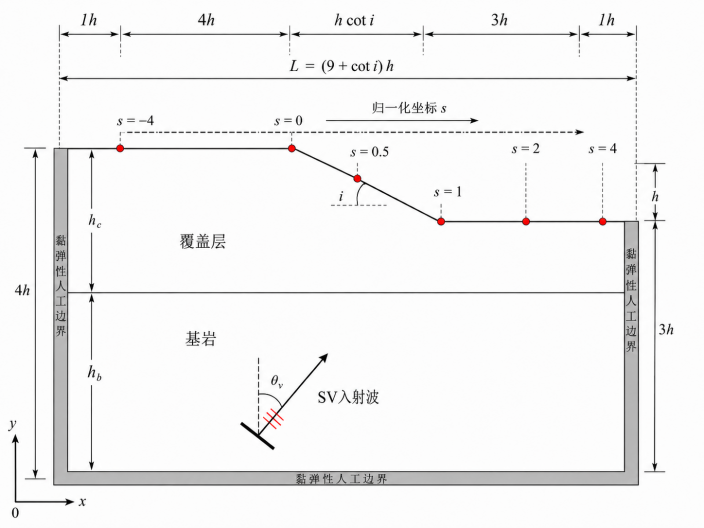
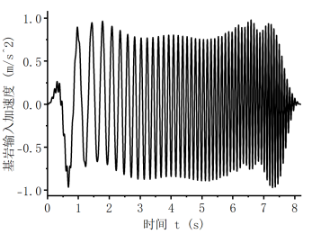
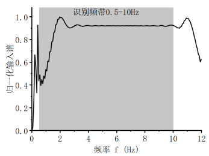
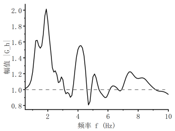
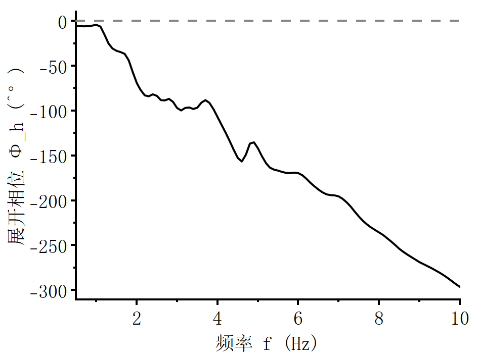
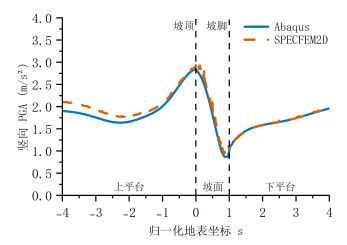
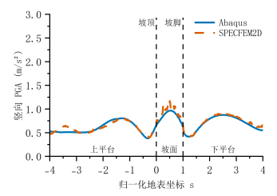
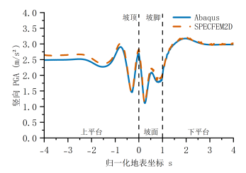
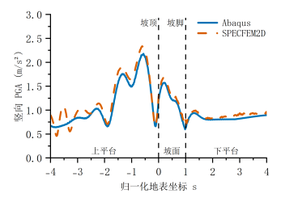

# 成层坡地地震动放大效应的幅值—相位联合表征、代理预测与真实地震动重构

【作者一】1，【作者二】1，【作者三】1

（1. 【单位全称，省 市 邮编】）

摘 要：成层坡地地震动放大同时受地形散射、覆盖层传播和斜入射相位差控制，传统峰值加速度（PGA）等标量指标难以保留频率—空间响应中的相位关系。基于黏弹性人工边界、频域自由场输入和宽频多正弦系统识别，建立了15° SV波斜入射下的二维线弹性成层坡地模型。总波场响应函数 $G_h(f,s)$ 采用统一的左侧上平台自由场幅值基准，并扣除平面入射波沿水平方向的确定性传播相位。针对4个均质坡、64个成层坡及12个训练外中间参数组合，研究坡角、覆盖层厚度比和波速比的影响，并构建本征正交分解—高斯过程代理模型。结果表明，16条厚度序列中有9条峰值放大呈非单调变化，固定坡角和波速比时主峰频率最大跨度为7.3 Hz；无量纲特征频率与中位绝对相位、群时延修正的Spearman相关系数分别为−0.940和−0.922，明显强于其与净幅值修正幅度的相关（−0.300）。代理模型在五折交叉验证和训练外组合上的中位加权复数误差分别为21.6%和23.0%。采用El Centro、Kobe和Chi-Chi记录开展的10个体系—记录闭环表明，重构时程的中位归一化均方根误差为10.8%，相关系数为0.994，PGA误差为2.7%，峰值时刻误差为0.002 s；但10个组合中有7个、全部地表位置中有62.9%的时程误差超过10%。软厚覆盖层、坡面—下平台及高频区域仍需有限元复核。

关键词：成层坡地；地形效应；总波场响应函数；水平传播相位；代理模型；地震动重构

**Amplitude–phase joint characterization, surrogate prediction and ground-motion reconstruction of seismic amplification effects of layered slopes**

【AUTHOR 1】1, 【AUTHOR 2】1, 【AUTHOR 3】1

(1. 【Affiliation, City, Postcode, China】)

**Abstract:** Seismic amplification of layered slopes is jointly controlled by topographic scattering, cover-layer propagation and oblique-incidence phase differences, whereas scalar measures such as peak ground acceleration (PGA) cannot retain the phase relation within the frequency–space response. A two-dimensional linear-elastic model under 15° SV-wave incidence was developed using viscous-spring boundaries, frequency-domain free-field input and broadband system identification. The total-wavefield response function $G_h(f,s)$ uses the left upper-platform free field as a common amplitude reference and removes the deterministic horizontal propagation phase of the obliquely incident plane wave. Four homogeneous and 64 layered configurations, together with 12 training-excluded intermediate combinations, were used to examine three governing parameters and construct a proper orthogonal decomposition–Gaussian process regression surrogate. Nine of the 16 thickness sequences showed non-monotonic peak amplification, with a maximum dominant-frequency span of 7.3 Hz. The characteristic frequency was strongly correlated with the median absolute phase and group-delay corrections (Spearman coefficients −0.940 and −0.922), but weakly correlated with the absolute magnitude of the net amplitude correction (−0.300). Median weighted complex errors were 21.6% in five-fold cross-validation and 23.0% for the training-excluded combinations. Ten closed-loop system–record combinations involving El Centro, Kobe and Chi-Chi motions yielded a median time-history normalized root-mean-square error of 10.8%, a correlation of 0.994, a PGA error of 2.7% and a peak-time error of 0.002 s. Nevertheless, the time-history error exceeded 10% in seven combinations and at 62.9% of surface locations. Direct finite-element checks remain necessary for soft-thick cover, slope and lower-platform regions, and high frequencies.

**Keywords:** layered slope; topographic effect; total-wavefield response function; horizontal propagation phase; surrogate model; ground-motion reconstruction

## 1 引 言

大量强震观测与震害调查表明，山脊、坡顶及地形边缘处的地震动显著强于平坦场地，地形放大效应是山地震害空间差异的重要控制因素。1971 年 San Fernando 地震余震台站观测证实，当放大波长与山体宽度相当时山顶放大最为显著[1]；1985 年智利地震余震谱比分析定位了与主震破坏分布一致的山脊放大[2]；Geli 等[3]的观测综述系统总结了地形效应的普遍性与入射角相关性；国内的震害调查同样发现孤立山体山顶加速度较山脚增大近一倍[4]。各国抗震规范将上述证据转化为标量放大系数：欧洲规范 EC8 规定孤立悬崖与边坡的放大系数不小于 1.2、平均坡度不小于 30° 的孤立山脊不小于 1.4[5]；我国《建筑抗震设计规范》（GB 50011—2010）按地形与地质条件给出 1.1～1.6 的放大系数[6]。

然而，数值模拟与震害实录均提示规范上限可能低估了真实地形效应。均质弹性岩坡的有限元模拟在特定几何与岩体参数下给出高达 1.93 的放大系数[7]；考虑斜入射后，SV 波 30° 入射时的平均谱放大可超过 2[8]。2022 年泸定 6.8 级地震中，磨西台地边缘两栋结构对称的框架建筑呈现出“近缘严重损毁、远缘轻微受损”的鲜明对比，直接证实了地形边缘对地震响应的差异化控制作用[9-11]。

值得注意的是，上述研究与规范体系几乎无一例外地采用标量指标——PGA 放大系数、选定频率处的谱放大或地形放大系数[12-13]。然而，线性场地响应本质上是一个传递函数，幅值与相位是其两个正交分量：仅保留幅值的描述在原理上无法重构地震动时程，也无法区分真实的放大与波动的时域叠加效应。散射波相对于一维参考场积累的频率相关迟滞——即传递函数的相位——在这一标量化传统中被系统性地丢弃了。

另一方面，天然坡地常覆盖有软弱覆盖层，地层效应与地形效应并不简单叠加。山脊场地的放大被归因于地形与近地表地层的联合作用[14-15]；参数化分析与震例研究表明软弱表层可显著重塑地形放大[16-17]，且两种效应的线性或等效线性耦合必须显式表达[18-19]；2008 年希腊 Achaia-Ilia 地震的震害观测表明，规范中“地形与地层效应解耦叠加”的做法在特定周期带内低估了坡顶放大[20]；现场监测与高分辨率模拟的联合研究更发现，耦合近地表成层地质可将放大系数由不足 3 提升至 5～6[21]。与此同时，真实地震动往往以一定角度斜入射：1994 年 Northridge 地震 Tarzana 台站的异常放大只有引入斜入射才能解释[22]；陡峻海岸崖坡的参数化分析表明斜入射剪切波的放大可达垂直入射的两倍以上[23]；均质岩坡在斜入射 SV 波作用下的系统研究表明，最大 PGA 放大系数为垂直入射的 1.4～2.2 倍[8,24]。

覆盖层一维共振与坡体散射频段接近程度的一个自然无量纲度量是归一化场地特征频率 $\chi = f_{\mathrm{s}}h/V_{\mathrm{s,b}} = r_v/[4(d/h)]$，式中：$f_{\mathrm{s}} = V_{\mathrm{s,c}}/(4d)$ 为覆盖层基频；$h$ 为坡高；$V_{\mathrm{s,b}}$ 为基岩剪切波速；$d$ 为覆盖层厚度；$r_v = V_{\mathrm{s,c}}/V_{\mathrm{s,b}}$ 为波速比。既有研究尚未定量回答覆盖层如何联合修正地形响应的幅值与相位，以及该修正如何随 $(i,d/h,r_v)$ 变化。

在预测方法层面，有限元场地反应分析代价高昂，数据驱动的代理模型已被用于地形与场地放大预测，但目标几乎全部是标量：卷积神经网络预测盆地地表放大[25]，人工神经网络、支持向量机和随机森林回归复杂场地放大[26]，基于二维地形图像的 BP 网络[27]，谱元数据驱动的区域地形效应模型[28-29]，以及基于可靠性分析的控制参数识别[30]。这些研究建立了可行性，但完整空间模式和相位信息较少被同时预测，训练域之外的适用边界也缺少独立检验。

针对上述问题，本文以二维线弹性“上土下岩”成层坡地为对象，将扣除斜入射水平传播相位后的地表总波场响应函数 $G_h(f,s)$ 作为统一研究对象。首先采用宽频系统识别，在4个均质坡和64个成层坡上分析 $i$、$d/h$、$r_v$ 对幅值、相位与峰位的影响；随后建立 POD-GPR 复数场代理，以12个未参与训练和选模的中间参数组合检验域内插值能力；最后将代理响应用于 El Centro、Kobe 和 Chi-Chi 地震动重构，并与10例直接有限元结果闭环比较。研究范围限定为二维平面应变、线性两层坡、$h=100$ m、15° SV斜入射、密度比0.85和0.5～10 Hz频带，不外推至其他入射角、非线性介质或三维地形。

## 2 数值模型与结果校核

### 2.1 成层坡地地震动输入方法

#### 2.1.1 黏弹性人工边界

本文采用Abaqus/Standard 2021[31]建立二维有限元模型，模型仅截取无限场地中的局部区域。为减小外行波在截断边界处的非物理反射，本文在模型左右两侧及底部采用刘晶波等[32]提出的黏弹性人工边界，地表保持自由。按照该方法，边界节点 $l$ 处的法向、切向弹簧刚度及阻尼系数分别为：

$$
\begin{bmatrix}K_{\mathrm N}\\K_{\mathrm T}\end{bmatrix}
=\frac{1}{2r(1+A)}
\begin{bmatrix}\lambda+2G\\G\end{bmatrix}. \tag{1}
$$

$$
\begin{bmatrix}C_{\mathrm N}\\C_{\mathrm T}\end{bmatrix}
=B\rho
\begin{bmatrix}c_{\mathrm p}\\c_{\mathrm s}\end{bmatrix}. \tag{2}
$$

式中，$K_{\mathrm N}$、$K_{\mathrm T}$ 和 $C_{\mathrm N}$、$C_{\mathrm T}$ 分别为法向、切向弹簧及阻尼参数；$\lambda$、$G$、$\rho$、$c_{\mathrm p}$ 和 $c_{\mathrm s}$ 按边界节点所在介质取值；$r=\sqrt{(L/2)^2+(H/2)^2}$ 为计算域包络矩形的半对角线。本文取修正系数 $A=0.8$、$B=1.1$。

#### 2.1.2 成层自由场与等效节点力输入

仅设置吸收边界只能减小外行波在截断边界处的反射，不能引入原无限场地中的斜入射波。参考Bielak等[33]关于背景自由场与局部残余场的分解，将有限元总波场写为自由场与散射场之和：

$$
\mathbf u=\mathbf u^{\mathrm f}+\mathbf u^{\mathrm s}. \tag{3}
$$

其中，$\mathbf u^{\mathrm f}$ 为不存在坡地局部不规则性时的自由场，$\mathbf u^{\mathrm s}$ 为坡地及材料界面引起的散射场。黏弹性人工边界用于吸收向计算域外传播的散射波，而自由场则通过附加等效节点力引入有限元模型。人工边界节点 $l$ 处的等效节点力可写为：

$$
\mathbf F_l^{\mathrm{eq}}(t)=A_l\left[\mathbf K_l\mathbf u_l^{\mathrm f}(t)+\mathbf C_l\dot{\mathbf u}_l^{\mathrm f}(t)+\boldsymbol\sigma_l^{\mathrm f}(t)\mathbf n_l\right]. \tag{4}
$$

式中，$A_l$ 为二维单位厚度下节点的代表边界长度，$\mathbf n_l$ 为边界外法向，$\mathbf K_l$ 和 $\mathbf C_l$ 为式（1）和式（2）在全局坐标下的参数矩阵；$\mathbf u_l^{\mathrm f}$、$\dot{\mathbf u}_l^{\mathrm f}$ 和 $\boldsymbol\sigma_l^{\mathrm f}$ 分别为节点自由场位移、速度和应力。弹簧项和阻尼项补偿人工边界对自由场运动的作用，应力项恢复原无限介质作用于截断面的自由场牵引。因此，地震动输入问题归结为求取各边界节点的自由场位移、速度和应力。

本文参考张季等[34]采用的“频域求解成层自由场—生成边界等效节点力”总体流程：由加速度时程作傅里叶变换并换算为入射位移谱，随后逐频求解单位SV波斜入射下的水平成层自由场，恢复各节点的实际自由场，最后组装节点力谱并逆变换至时域。与张季以层间界面位移为未知量组装精确动力刚度矩阵不同，本文直接以覆盖层内上、下行P波和SV波以及基岩中的反射P波、SV波复幅值为未知量：

$$
\mathbf a(\omega)=\begin{bmatrix}A_{\mathrm{P,c}}^{\uparrow}&A_{\mathrm{P,c}}^{\downarrow}&A_{\mathrm{SV,c}}^{\uparrow}&A_{\mathrm{SV,c}}^{\downarrow}&A_{\mathrm{P,b}}^{\downarrow}&A_{\mathrm{SV,b}}^{\downarrow}\end{bmatrix}^{\mathrm T}. \tag{5}
$$

式中，下标c、b分别表示覆盖层和基岩；基岩上行SV波为已知单位入射波，不列入未知向量。这样可在求解后直接恢复任意深度处的位移与应力响应，无需由界面位移进一步重构层内波场，因而更便于计算不同位置人工边界节点的自由场量及等效节点力。

为求解这些未知量，以 $U_x$、$U_y$、$\Sigma_{yy}$ 和 $\Sigma_{xy}$ 表示频域位移及应力复幅值，覆盖层—基岩界面 $y=y_{\mathrm I}$ 满足4个完全黏结条件：

$$
\begin{cases}
U_x^{\mathrm c}=U_x^{\mathrm b},\\
U_y^{\mathrm c}=U_y^{\mathrm b},\\
\Sigma_{yy}^{\mathrm c}=\Sigma_{yy}^{\mathrm b},\\
\Sigma_{xy}^{\mathrm c}=\Sigma_{xy}^{\mathrm b}.
\end{cases}\qquad y=y_{\mathrm I} \tag{6}
$$

覆盖层自由表面 $y=y_{\mathrm s}$ 满足2个零牵引条件：

$$
\begin{cases}
\Sigma_{yy}^{\mathrm c}=0,\\
\Sigma_{xy}^{\mathrm c}=0.
\end{cases}\qquad y=y_{\mathrm s} \tag{7}
$$

将各P-SV波分量的位移和应力表达式代入式（6）和式（7），6个边界条件对应6个未知波幅，逐频组装为

$$
\underset{6\times6}{\mathbf A(\omega)}\,
\underset{6\times1}{\mathbf a(\omega)}
=\underset{6\times1}{\mathbf b(\omega)}. \tag{8}
$$

式中，$\mathbf A(\omega)$ 由材料参数、覆盖层厚度、频率和入射角确定，各波分量的竖向传播关系包含在其系数中；$\mathbf b(\omega)$ 为已知单位上行SV波在界面处产生的位移和应力项。自由场按线弹性无阻尼介质求解。逐频求解式（8）即可获得各P-SV波分量的复幅值，进而直接计算任意深度处的单位自由场位移、速度和应力，无需先求界面位移再恢复层内响应。所得复数解已包含界面反射、透射、P-SV波型转换及层内多次传播。

得到频域等效节点力

$$
\widehat{\mathbf F}_l^{\mathrm{eq}}(\omega)=A_l\left[\left(\mathbf K_l+\mathrm i\omega\mathbf C_l\right)\widehat{\mathbf u}_l^{\mathrm f}(\omega)+\widehat{\boldsymbol\sigma}_l^{\mathrm f}(\omega)\mathbf n_l\right]. \tag{9}
$$

最后，对节点力谱作逆傅里叶变换，得到各节点水平和竖向等效力时程，并作为集中力施加于Abaqus。左、右及底部边界采用同一上平台水平成层自由场，但均按节点实际坐标、外法向和代表边界长度分别计算。至此，输入时程经“位移谱—单位自由场—节点自由场—节点力谱—节点力时程”完成三侧人工边界输入。

### 2.2 数值模型与研究方案

#### 2.2.1 模型几何、材料及工况

研究对象为SV波斜入射下的二维“上土下岩”坡地，采用平面应变、小变形线弹性假定。SV 波入射角固定为15°。

坡高固定为 $h=100\ \mathrm{m}$，坡角记为 $i$。取 $x$ 轴水平向右、$y$ 轴竖直向上，坡顶与坡脚的水平坐标分别为 $x_{\mathrm c}$ 和 $x_{\mathrm t}$。上、下平台观测窗分别延伸 $4h$ 和 $3h$，左右两侧各保留 $1h$ 边界净空，坡脚以下保留 $3h$ 基底深度。模型底边取 $y=0$，坡脚和坡顶地表高程分别为 $3h$ 和 $4h$；不同坡角下的地表位置采用式（10）映射至共同坐标。

为把不同坡角下的折线地表映射到共同空间坐标，本文采用三段归一化坐标 $s$。上平台以坡高归一化水平距离，坡面以坡顶至坡脚的沿段进程归一化，下平台继续以坡高为尺度：

$$
s=\begin{cases}
(x-x_{\mathrm c})/h, & x\le x_{\mathrm c},\\[3pt]
(x-x_{\mathrm c})/(x_{\mathrm t}-x_{\mathrm c}), & x_{\mathrm c}<x<x_{\mathrm t},\\[3pt]
1+(x-x_{\mathrm t})/h, & x\ge x_{\mathrm t}.
\end{cases} \tag{10}
$$

观测范围为 $s\in[-4,4]$，其中 $s=0$、0.5和1分别对应坡顶、坡面中部和坡脚；左右各 $1h$ 的边界净空不纳入统计。模型布置见图1。

图1 二维成层坡地数值模型

Fig. 1

基岩剪切波速为 $V_{\mathrm{s,b}}=2000\ \mathrm{m/s}$，密度为 $2500\ \mathrm{kg/m^3}$，泊松比为0.30；覆盖层密度固定为基岩的0.85倍，即 $2125\ \mathrm{kg/m^3}$，泊松比为0.35，剪切波速由波速比 $s=V_{\mathrm{s,c}}/V_{\mathrm{s,b}}$ 控制。材料的剪切模量、弹性模量和压缩波速均由波速、密度与泊松比一致换算，而非彼此独立指定。

材料、几何与输入参数见表1。L组由坡角 $i$、厚度比 $d/h$ 和波速比 $r_v$ 的 $4\times4\times4$ 全因子组合构成，共64例；H组含4个同坡角均质基岩坡。坡高、密度比、入射角及输入信号均保持不变。

表1 工况参数表

| 参数 | H 组（均质坡，4 例） | L 组（成层坡，64 例） |
|:---:|:---:|:---:|
| 坡角 $i$ (°) | 15、30、45、60 | 15、30、45、60 |
| 覆盖层厚度 $h_{\mathrm c}$ (m) | — | 20、60、100、140 |
| 覆盖层厚度比 $d=h_{\mathrm c}/h$ | — | 0.2、0.6、1.0、1.4 |
| 覆盖层剪切波速 $V_{\mathrm{s,c}}$ (m/s) | — | 600、900、1200、1500 |
| 覆盖层波速比 $s=V_{\mathrm{s,c}}/V_{\mathrm{s,b}}$ | — | 0.3、0.45、0.6、0.75 |

为便于表述与检索，工况编号采用“组别字母—参数串”规则命名。组别字母标明工况类别：H、L分别为均质坡（homogeneous）、成层坡（layered）。参数串中的字母 $i$、$h$、$a$、$d$、$s$ 依次表示坡角、坡高、SV 波入射角、厚度比 $h_{\mathrm c}/h$ 与波速比 $V_{\mathrm{s,c}}/V_{\mathrm{s,b}}$。均质坡 H 组标注 $i$、$h$、$a$；成层坡 L 组及 T、V 组标注 $i$、$d$、$s$（坡高与入射角为全体工况常量，仅在 H 组标出）。例如，H-i15h100a15 表示坡角 15°、坡高 100 m、入射角 15° 的均质坡；L-i60d1.4s0.3 表示坡角 60°、厚度比 1.4、波速比 0.3 的成层坡。

#### 2.2.2 宽频输入与地表响应识别方法

G1b在0.5～10 Hz内的归一化谱幅中位数为0.921，5%分位数为0.533，在分析频带内未出现连续的近零谱谷。因此，该频带可用于复数相除及相位分析。计算时先检查频点有效性，再进行复数相除、相位展开和群时延求导，以减小分母弱谱点对结果的影响。

|  |  |
|:---:|:---:|
| （a）宽频多正弦输入时程 | （b）输入能量覆盖识别频带 |
|  |  |
| （c）复比值幅值 | （d）复比值保留相位信息 |

图3 P061宽频系统识别与复频响提取

Fig. 3 Broadband identification of the complex FRF

为了比较不同地表区段和频带的响应，将上平台A段、坡面B段和下平台C段分别定义为 $-4\le s\le 0$、$0<s\le 1$ 和 $1<s\le 4$，低、中、高频分别取 $[0.5,3)$、$[3,6)$ 和 $[6,10]$ Hz。

### 2.3 数值结果校核

采用SPECFEM2D[35]计算60°均质坡H004和同坡角软厚成层坡P061，输入统一采用4 Hz Ricker脉冲。图2给出了Abaqus与SPECFEM2D计算的地表水平、竖向PGA空间曲线，归一化均方根误差（NRMSE）和峰位差见表2。

|  |  |
|:---:|:---:|
| （a）X001：H004水平分量 | （b）X001：H004竖向分量 |
|  |  |
| （c）X002：P061水平分量 | （d）X002：P061竖向分量 |

图2 Abaqus与SPECFEM2D地表PGA对比

Fig. 2 Cross-software comparison of surface PGA

结果显示，两套软件计算的地表PGA空间曲线总体吻合：均质坡H004的水平与竖向PGA曲线NRMSE分别为5.6%和7.3%，软厚成层坡P061分别为3.6%和10.2%；PGA峰值位置的归一化坐标偏差不超过0.07。Abaqus与SPECFEM2D在单元离散、波动输入与边界实现上相互独立，上述量级的偏差主要来自网格离散与散射波细节的差异，不改变坡顶放大、坡面振荡与下平台干涉等主要空间特征。据此认为，本文模型的黏弹性人工边界与等效节点力输入可为后续宽频复频响分析提供可靠的数值基础。

## 3 成层坡地地震动放大特征与参数影响规律

### 3.1 成层坡地地震动放大的总体特征

### 3.2 坡角及覆盖层参数的影响

#### 3.2.1 坡角的影响

#### 3.2.2 覆盖层厚度的影响

#### 3.2.3 覆盖层波速比的影响

### 3.3 参数耦合与放大机制

#### 3.3.1 参数交互作用与主控因素

#### 3.3.2 非单调放大与主峰迁移

## 4 基于POD-GPR的成层坡地地震动放大预测

### 4.1 代理模型的构建

#### 4.1.1 样本构建与数据预处理

#### 4.1.2 POD降阶与GPR预测

### 4.2 代理模型的预测精度

#### 4.2.1 交叉验证结果

#### 4.2.2 训练外组合预测与误差分布

### 4.3 真实地震波作用下的幅值谱预测验证

#### 4.3.1 地表幅值谱预测方法

#### 4.3.2 预测结果与误差分析

## 5 结 论

本文采用黏弹性人工边界和等效节点力方法，建立了地震波斜入射下的二维线弹性成层坡地模型，利用宽频激励识别扣除斜入射水平传播相位后的总波场响应函数，研究坡角、覆盖层厚度比和波速比对地表地震动的影响，进一步构建POD-GPR代理模型并开展训练外组合评价和真实地震波闭环验证，主要得出以下结论：

1）

## 参 考 文 献

[1] DAVIS L L, WEST L R. Observed effects of topography on ground motion[J]. Bulletin of the Seismological Society of America, 1973, 63(1): 283-298.

[2] ÇELEBI M. Topographical and geological amplifications determined from strong-motion and aftershock records of the 3 March 1985 Chile earthquake[J]. Bulletin of the Seismological Society of America, 1987, 77(4): 1147-1167.

[3] GELI L, BARD P Y, JULLIEN B. The effect of topography on earthquake ground motion: a review and new results[J]. Bulletin of the Seismological Society of America, 1988, 78(1): 42-63.

[4] 胡聿贤, 孙平善, 章在墉, 等. 场地条件对震害和地震动的影响[J]. 地震工程与工程振动, 1980(0): 34-41.
HU Yu-xian, SUN Ping-shan, ZHANG Zai-yong, et al. Influence of site conditions on earthquake damage and ground motion[J]. Earthquake Engineering and Engineering Vibration, 1980(0): 34-41.

[5] European Committee for Standardization. Eurocode 8: design of structures for earthquake resistance[S]. Brussels: CEN, 2004.

[6] 中华人民共和国住房和城乡建设部. 建筑抗震设计规范: GB 50011—2010（2016年版）[S]. 北京: 中国建筑工业出版社, 2016.
Ministry of Housing and Urban-Rural Development of the People's Republic of China. Code for seismic design of buildings: GB 50011—2010 (2016 edition)[S]. Beijing: China Architecture and Building Press, 2016.

[7] LI H, LIU Y, LIU L, et al. Numerical evaluation of topographic effects on seismic response of single-faced rock slopes[J]. Bulletin of Engineering Geology and the Environment, 2019, 78(3): 1873-1891.

[8] SHEN H, LIU Y, LI H, et al. Numerical evaluation of ground motion amplification of rock slopes under obliquely incident seismic waves[J]. Soil Dynamics and Earthquake Engineering, 2024, 178: 108488.

[9] 赵仕兴, 杨姝姮, 唐元旭, 等. 四川泸定6.8级地震震中区域建筑震害考察与思考[J]. 建筑结构, 2023, 53(7): 1-8.
ZHAO Shi-xing, YANG Shu-heng, TANG Yuan-xu, et al. Investigation and analysis of building damage in the epicentral area of the Luding Ms 6.8 earthquake in Sichuan[J]. Building Structure, 2023, 53(7): 1-8.

[10] 王鹏程, 罗永红, 刘红枫, 等. "9·5"四川泸定Ms6.8级地震诱发磨西台地地震响应分析[J]. 山地学报, 2024, 42(4): 576-590.
WANG Peng-cheng, LUO Yong-hong, LIU Hong-feng, et al. Seismic response of the Moxi terrace induced by the "9·5" Luding Ms 6.8 earthquake, Sichuan[J]. Journal of Mountain Science, 2024, 42(4): 576-590.

[11] 潘毅, 任靖哲, 任宇, 等. 考虑台地效应的泸定6.8级地震某框架结构震害调查与分析[J]. 土木工程学报, 2024, 57(6): 136-151.
PAN Yi, REN Jing-zhe, REN Yu, et al. Seismic damage investigation and analysis of a frame structure considering the terrace effect in the Luding Ms 6.8 earthquake[J]. China Civil Engineering Journal, 2024, 57(6): 136-151.

[12] BOUCKOVALAS G D, PAPADIMITRIOU A G. Numerical evaluation of slope topography effects on seismic ground motion[J]. Soil Dynamics and Earthquake Engineering, 2005, 25(7-10): 547-558.

[13] ZHANG Z, FLEURISSON J A, PELLET F. The effects of slope topography on acceleration amplification and interaction between slope topography and seismic input motion[J]. Soil Dynamics and Earthquake Engineering, 2018, 113: 420-431.

[14] GALLIPOLI M R, BIANCA M, MUCCIARELLI M, et al. Topographic versus stratigraphic amplification: mismatch between code provisions and observations during the L'Aquila (Italy, 2009) sequence[J]. Bulletin of Earthquake Engineering, 2013, 11(5): 1325-1336.

[15] HAILEMIKAEL S, LENTI L, MARTINO S, et al. Ground-motion amplification at the Colle di Roio ridge, central Italy: a combined effect of stratigraphy and topography[J]. Geophysical Journal International, 2016, 206(1): 1-18.

[16] TRIPE R, KONTOE S, WONG T K C. Slope topography effects on ground motion in the presence of deep soil layers[J]. Soil Dynamics and Earthquake Engineering, 2013, 50: 72-84.

[17] ASSIMAKI D, KAUSEL E, GAZETAS G. Soil-dependent topographic effects: a case study from the 1999 Athens Earthquake[J]. Earthquake Spectra, 2005, 21(4): 929-966.

[18] SHEN H, LIU Y, LI X, et al. The combined amplification effects of topography and stratigraphy of layered rock slopes under vertically and obliquely incident seismic waves[J]. Soil Dynamics and Earthquake Engineering, 2025, 193: 109331.

[19] RIZZITANO S, CASCONE E, BIONDI G. Coupling of topographic and stratigraphic effects on seismic response of slopes through 2D linear and equivalent linear analyses[J]. Soil Dynamics and Earthquake Engineering, 2014, 67: 66-84.

[20] PELEKIS P, BATILAS A, PEFANI E, et al. Surface topography and site stratigraphy effects on the seismic response of a slope in the Achaia-Ilia (Greece) 2008 Mw6.4 earthquake[J]. Soil Dynamics and Earthquake Engineering, 2017, 100: 538-554.

[21] LUO Y, FAN X, HUANG R, et al. Topographic and near-surface stratigraphic amplification of the seismic response of a mountain slope revealed by field monitoring and numerical simulations[J]. Engineering Geology, 2020, 271: 105607.

[22] VAHDANI S, WIKSTROM S. Response of the Tarzana strong motion site during the 1994 Northridge earthquake[J]. Soil Dynamics and Earthquake Engineering, 2002, 22(9): 837-848.

[23] ASHFORD S A, SITAR N. Analysis of topographic amplification of inclined shear waves in a steep coastal bluff[J]. Bulletin of the Seismological Society of America, 1997, 87(3): 692-700.

[24] 申辉, 刘亚群, 刘博, 等. 地震波斜入射下岩质边坡放大效应的数值模拟研究[J]. 岩土力学, 2023, 44(7): 2129-2142.
SHEN Hui, LIU Ya-qun, LIU Bo, et al. Numerical study on the amplification effect of rock slopes under oblique incidence of seismic waves[J]. Rock and Soil Mechanics, 2023, 44(7): 2129-2142.

[25] 陈咏珊. 基于卷积神经网络预测下哈特盆地地表地震动放大特征[D]. 广州: 广东工业大学, 2023.
CHEN Yong-shan. Prediction of surface ground motion amplification characteristics of the Lower Hutt Basin based on convolutional neural network[D]. Guangzhou: Guangdong University of Technology, 2023.

[26] 赵嘉玮. 基于机器学习算法的复杂场地地震动放大效应和非线性效应预测模型研究[D]. 天津: 天津城建大学, 2024.
ZHAO Jia-wei. Research on prediction models of ground motion amplification and nonlinear effects in complex sites based on machine learning algorithms[D]. Tianjin: Tianjin Chengjian University, 2024.

[27] 罗麒锐, 赵仕兴, 吴启红, 等. 基于地形参数的地震动放大系数数值分析与预测方法[J]. 建筑结构, 2025, 55(2): 50-57, 35.
LUO Qi-rui, ZHAO Shi-xing, WU Qi-hong, et al. Numerical analysis and prediction method of ground motion amplification factor based on topographic parameters[J]. Building Structure, 2025, 55(2): 50-57, 35.

[28] 周红, 常莹. 利用BP神经网络技术建立自贡地区地震动地形效应模型及其在汶川地震中的效验[J]. 地球物理学报, 2022, 65(6): 2022-2034.
ZHOU Hong, CHANG Ying. A ground motion topographic effect model for the Zigong area based on BP neural network and its validation in the Wenchuan earthquake[J]. Chinese Journal of Geophysics, 2022, 65(6): 2022-2034.

[29] ZHOU H, LI J, CHEN X. Establishment of a seismic topographic effect prediction model in the Lushan Ms 7.0 earthquake area[J]. Geophysical Journal International, 2020, 221(1): 273-288.

[30] TAVAKOLI H, SOLEIMANI KUTANAEI S. Evaluation of effect of soil characteristics on the seismic amplification factor using the neural network and reliability concept[J]. Arabian Journal of Geosciences, 2015, 8(6): 3881-3891.

[31] Dassault Systèmes. Abaqus 2021 documentation[CP/OL]. Providence (RI): Dassault Systèmes SIMULIA Corp., 2021.

[32] 刘晶波, 谷音, 杜义欣. 粘弹性人工边界及粘弹性边界单元[J]. 土木工程学报, 2006, 39(2): 31-36.
LIU Jing-bo, GU Yin, DU Yi-xin. Viscoelastic artificial boundary and viscoelastic boundary element[J]. China Civil Engineering Journal, 2006, 39(2): 31-36.

[33] BIELAK J, LOUKAKIS K, HISADA Y, et al. Domain reduction method for three-dimensional earthquake modeling in localized regions, Part I: Theory[J]. Bulletin of the Seismological Society of America, 2003, 93(2): 817-824.

[34] 张季, 谭灿星, 叶国涛, 等. SV波超临界角斜入射时层状地基地震动输入在ABAQUS中的实现[J]. 工程力学, 2021, 38(4): 200-210.
ZHANG Ji, TAN Can-xing, YE Guo-tao, et al. Realization of ground motion input in ABAQUS for layered foundation under SV wave of oblique incidence over critical angle[J]. Engineering Mechanics, 2021, 38(4): 200-210.

[35] SPECFEM2D Development Team. SPECFEM2D Cartesian user guide (v8.1.0)[CP/OL]. [2026-08-24]. https://github.com/geodynamics/specfem2d.
