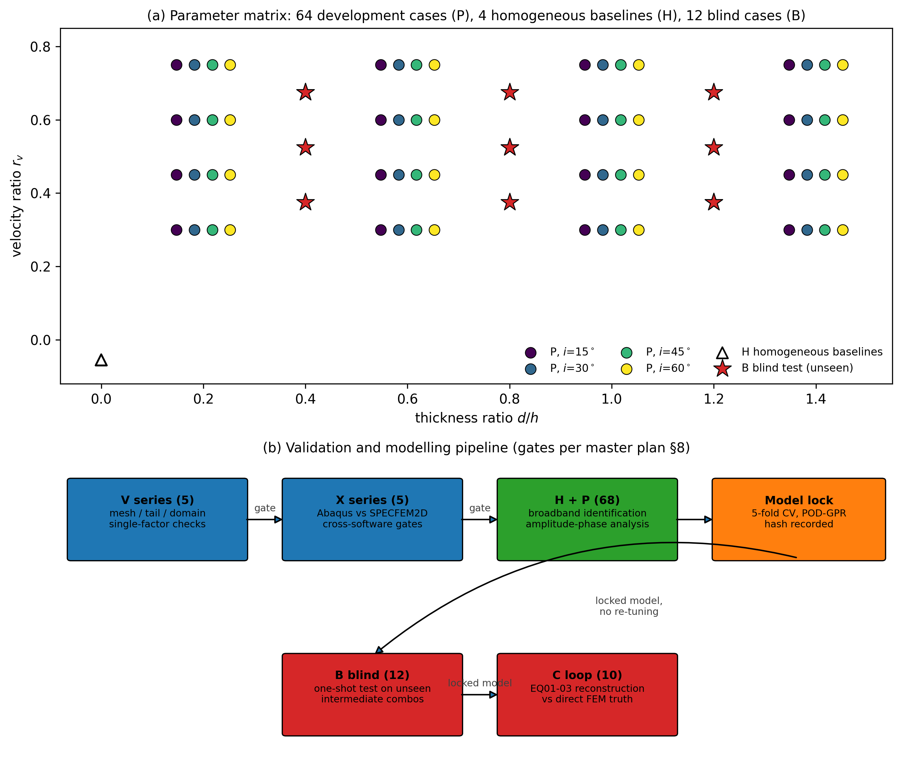
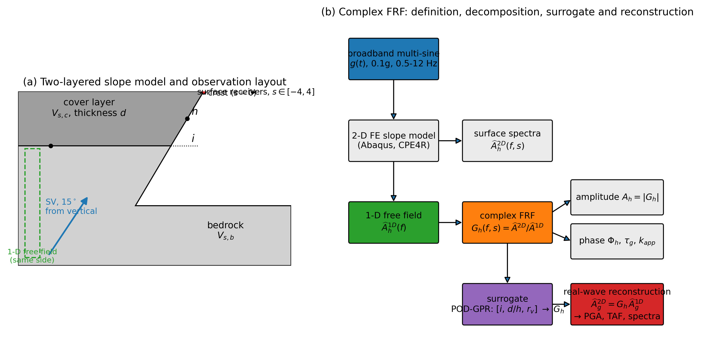
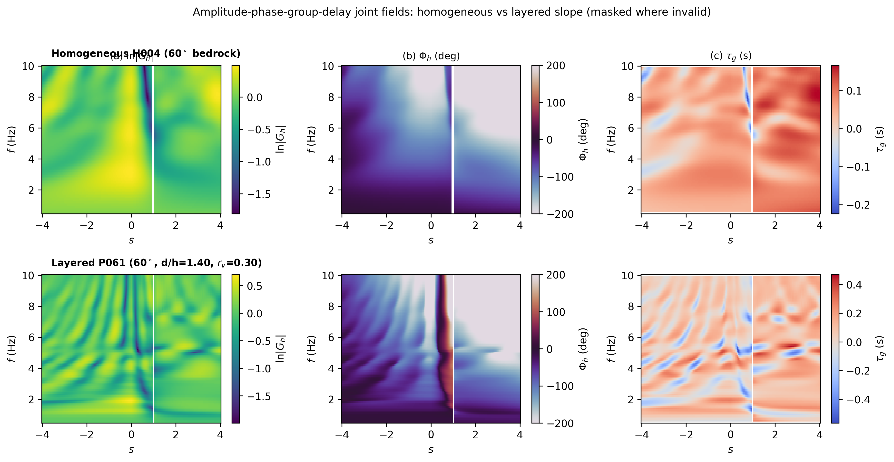
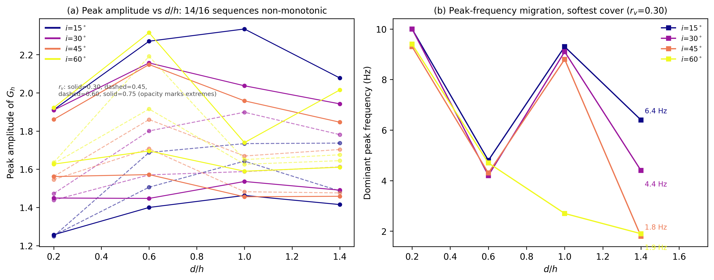
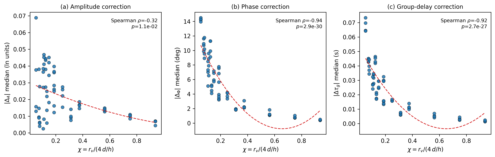
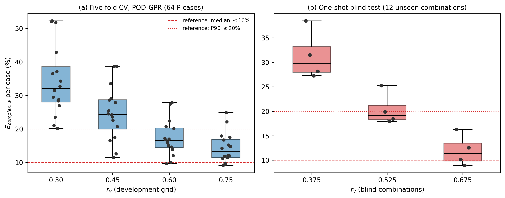
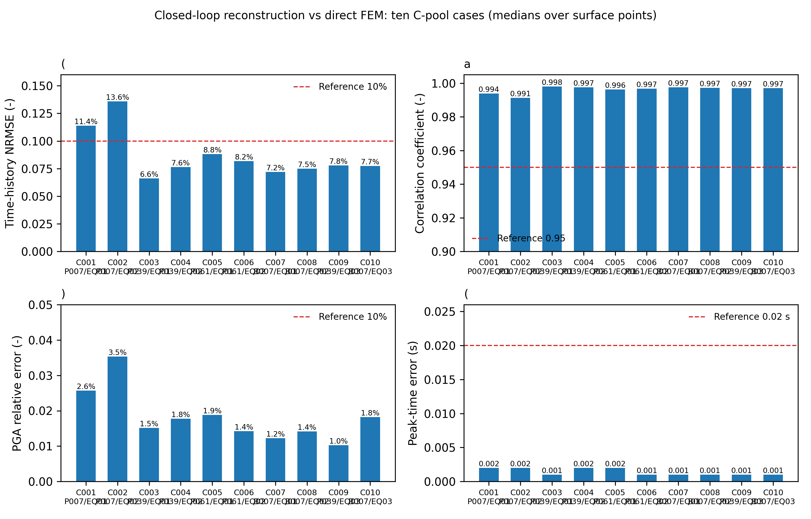

# Amplitude–Phase Joint Complex Frequency-Response Surrogates for Two-Layered Slopes: Broadband Identification, Blind Generalization, and Real-Earthquake Reconstruction

_First draft, 2026-08-05; Introduction populated with literature on 2026-08-06. Prepared per 《小论文物理判读与英文初稿写作大纲》. All numerical values traceable to `Run/` products listed in §7. Reference numbers reuse the numbering of 《毕业论文分章节MD/参考文献.md》 where available; entries [133]–[134] are software citations added for this paper._

---

## Abstract

Topographic seismic amplification is routinely quantified by scalar measures such as peak ground acceleration (PGA) or topographic amplification factors, while the phase information carried by the site transfer function is usually discarded. This paper treats the horizontal complex frequency-response function (FRF) of two-layered slopes, $G_h(f,s)$, as the primary object: its amplitude describes amplification and its unwrapped phase describes relative delay, jointly. A broadband multi-sine signal identifies the linear system over 0.5–10 Hz for 68 slope configurations spanning slope angle $i=15^\circ$–$60^\circ$, cover-layer thickness ratio $d/h=0.20$–$1.40$, and velocity ratio $r_v=0.30$–$0.75$. Three findings emerge. (1) The effects of $d/h$ and $r_v$ on peak amplification are predominantly non-monotonic and jointly shift the dominant peak frequency by up to 7.5 Hz. (2) The cover layer modifies the topographic response mainly through the phase/group-delay channel — strongly correlated with the dimensionless site frequency $\chi=r_v/(4\,d/h)$ ($\rho\approx-0.93$) — while its amplitude-channel modification is weak ($\rho\approx-0.32$). (3) A POD–Gaussian-process surrogate predicts the full $96\times161$ complex field with median weighted complex error 20.7% in five-fold cross-validation and 19.2% on 12 blind intermediate combinations; reconstructed El Centro, Kobe, and Chi-Chi time histories match direct finite-element results with median NRMSE 7.8%, correlation 0.997, PGA error 1.6%, and peak-time error 0.001 s. The error structure is intrinsic to sparse sampling of sharply resonant soft cover layers, not surrogate tunability, and the applicable domain is stated accordingly.

_Keywords:_ topographic amplification; complex frequency response; phase; surrogate model; proper orthogonal decomposition; Gaussian process; ground-motion reconstruction

---

## 1. Introduction

### 1.1 Topographic amplification: observations, code treatment, and the scalar habit

Strong-motion records and post-earthquake damage surveys consistently show that slope geometry amplifies ground motion near crests, ridges, and slope tops. Instrumented studies of the 1971 San Fernando aftershocks documented crest amplification strongest when the amplified wavelength is comparable to the hill width [91]; aftershock spectral ratios of the 1985 Chile earthquake located ridge amplification consistent with the mainshock damage pattern [93]; and damage surveys from the Athens, Düzce, and other events repeatedly identify crest-proximate structures as disproportionately damaged [1–3], as consolidated in the observational review of Geli et al. [92]. Chinese surveys report the same trend, with crest accelerations nearly double those at the toe on isolated hills [95]. Seismic design codes translate this evidence into scalar amplification factors: Eurocode 8 prescribes factors no smaller than 1.2 for isolated cliffs and slopes and 1.4 for ridges with mean slopes of at least 30° [4], while the Chinese code GB 50011 assigns factors between 1.1 and 1.6 depending on terrain and geology [5].

Numerical and field evidence, however, suggests that these code ceilings can understate real topographic effects. Finite-element simulations of homogeneous elastic rock slopes report amplification factors up to 1.93 for particular geometries and rock parameters [6], and average spectral amplification exceeding 2 when SV waves arrive at 30° from vertical [7]. The 2022 Luding Ms 6.8 earthquake supplied a striking field example: two structurally symmetric frame buildings near the Moxi terrace edge suffered sharply different damage, the building closer to the terrace edge severely destroyed while the farther one was only lightly affected — direct evidence of the differential response imposed by terrain edges [8–10].

Nearly all of these studies quantify the effect with scalar measures — PGA ratios, spectral amplification at selected frequencies, or topographic amplification factors, as in the widely used parametric formulations of [23,24] — and the codes inherit this scalar view. Yet the site response is a linear transfer function, of which amplitude and phase are the two quadrature components: a description that keeps only amplitude cannot, in principle, reconstruct a time history, and cannot separate a genuine amplification from a temporal superposition effect. The frequency-dependent delay that scattered waves accumulate relative to a one-dimensional (1-D) reference — the phase of the transfer function — is routinely discarded.

### 1.2 Cover layers and oblique incidence: two coupled modifiers

Natural slopes are frequently mantled by a soft cover layer over bedrock, and field and numerical studies show that stratigraphic and topographic effects do not simply superpose. Ridge-site amplification has been attributed to the joint action of topography and near-surface stratigraphy [62,63]; parametric and case-history analyses demonstrate that soft surface layers can substantially reshape topographic amplification [45,46] and that linear/equivalent-linear coupling between the two effects must be represented explicitly [65,66]; the code practice of decoupled superposition of topographic and stratigraphic factors was shown to under-predict crest amplification in certain period bands during the 2008 Achaia-Ilia earthquake [67]; and combined field monitoring and high-resolution simulation found that coupling with near-surface layered geology can raise amplification factors from below 3 to 5–6 [68].

Real incidence is moreover oblique rather than vertical. The anomalous amplification recorded at the Tarzana station during the 1994 Northridge earthquake cannot be explained without inclined incidence [52]; parametric analyses of steep coastal bluffs show oblique shear waves amplifying motion by more than a factor of two relative to vertical incidence [48]; and systematic finite-element studies of rock slopes under obliquely incident SV waves report maximum PGA amplifications 1.4–2.2 times the vertical-incidence values [7].

A natural dimensionless measure of the proximity between the cover layer's 1-D resonance and the topographic scattering band is the normalized site frequency
$$\chi = \frac{f_s h}{V_{s,b}} = \frac{r_v}{4\,(d/h)},$$
where $f_s=V_{s,c}/(4d)$ is the fundamental frequency of the cover layer, $h$ the slope height, $V_{s,b}$ the bedrock shear-wave velocity, $d$ the cover thickness, and $r_v=V_{s,c}/V_{s,b}$. Existing studies have quantified neither how the cover layer modifies the *complex* topographic response — its amplitude and phase jointly — nor how that modification scales with $(i,\,d/h,\,r_v)$.

### 1.3 Surrogates for topographic effects: from scalars to complete fields

Finite-element site-response analysis is expensive, so data-driven surrogates have been developed to predict topographic and site amplification, almost exclusively as scalar outputs: convolutional networks for basin surface amplification [85]; comparisons of ANN/SVM/random-forest regressors for complex-site amplification [86]; BP networks trained on 2-D terrain images with test RMSE of 0.06 [87]; spectral-element-derived BP models of regional topographic effects validated against Wenchuan records [88]; reliability-based identification of shear-wave velocity and layer thickness as the controlling parameters [89]; and SEM+BP models achieving sub-10% prediction RMSE in the Lushan earthquake area with pure topographic amplification of 1.5–2.0 [90].

These studies establish feasibility but share two limitations. Their targets are single-point or coarse scalar amplification measures, so phase information and the full spatial amplification pattern are not predicted; and their extrapolation domain is rarely assessed honestly. A surrogate that predicts the *complete complex FRF* would be strictly more useful: any engineering quantity for any input motion can then be derived by superposition, without re-running the model. The obstacle is that complex fields are high-dimensional and phase wraps; both the representation and the error metrics must be designed accordingly.

### 1.4 Contributions and scope

This paper makes three contributions, each tied to a pre-registered hypothesis:

1. **Amplitude–phase joint laws (SP-H1, SP-H2).** Using broadband system identification on 68 configurations, we characterize how $i$, $d/h$, and $r_v$ jointly reshape the amplitude and phase of $G_h$, including non-monotonicity, peak-frequency migration, and the cover-layer complex correction, tested against $\chi$.
2. **A validated complex-field surrogate (SP-H3).** We compare nearest-neighbor, POD-Ridge, and POD-GPR surrogates under whole-case five-fold cross-validation, lock the selected model before any blind evaluation, and test it once on 12 unseen intermediate combinations.
3. **Real-earthquake closed loop (SP-H4).** We reconstruct El Centro, Kobe, and Chi-Chi responses from the surrogate FRF and compare against 10 direct finite-element analyses, covering time histories, peak times, PGA, TAF, and 5%-damping response spectra.

Scope is deliberately restricted and is part of the claim: two-dimensional plane strain, linear two-layer slopes, $h=100$ m, SV incidence at $15^\circ$ from vertical, density ratio 0.85, one broadband identification signal at 0.1g, and analysis band 0.5–10 Hz. We do not claim applicability to other incidence angles, density ratios, three-layer profiles, nonlinear soil behavior, or three-dimensional topography; those belong to the follow-up study described in our companion plan.

---

## 2. Methodology

### 2.1 Model, parameter matrix, and input

All models are two-dimensional plane-strain, linear-elastic, built with Abaqus/Standard using CPE4R elements [133]. The bedrock has $V_s=2000$ m/s, $\rho=2500$ kg/m³, $\nu=0.30$, damping ratio $\xi=0.05\%$ (Rayleigh, anchored at 4 Hz); the cover layer has $\nu=0.35$, $\xi=3\%$, and density $0.85$ times the bedrock density. Slope height is fixed at $h=100$ m. The parameter matrix is a full $4\times4\times4$ grid: $i\in\{15^\circ,30^\circ,45^\circ,60^\circ\}$, $d/h\in\{0.20,0.60,1.00,1.40\}$, $r_v\in\{0.30,0.45,0.60,0.75\}$ (cases P001–P064), plus four homogeneous bedrock slopes H001–H004 ($i=15^\circ$–$60^\circ$, no cover) used as same-angle baselines.

The input is a single broadband multi-sine acceleration signal (G1b, peak 0.1g, $\Delta t=1$ ms, effective duration 8.191 s) that excites 0.5–12 Hz quasi-uniformly, so that the linear system is identified by one run per configuration. The analysis band is 0.5–10 Hz; 10–12 Hz is retained only for diagnostics. Lateral clearance is $1H$ per side and base depth $3H$, with Stacey absorbing boundaries and Bielak incident-field correction; an anechoic tail of 6 s suppresses end effects in the FFT. Fig. 2(a) shows the resulting parameter matrix together with the homogeneous baselines and the blind combinations; the staged validation pipeline of §3–§4 is summarized in Fig. 2(b).

**Fig. 2.** (a) Parameter matrix: 64 development cases P on the full $4\times4\times4$ grid (colors mark slope angle, horizontally dodged for visibility), 4 homogeneous baselines H at $d/h=0$, and 12 blind combinations B at intermediate positions. (b) Validation and modelling pipeline with the gates of the master plan.

### 2.2 Complex frequency response and derived quantities

At each surface point $s$ (normalized by $h$, $s\in[-4,4]$), the horizontal complex FRF is the 2-D response divided by the same-side, same-layer 1-D free-field spectrum:
$$G_h(f,s)=\frac{\widehat A_h^{2D}(f,s)}{\widehat A_h^{1D}(f)}.\tag{1}$$
Its amplitude and unwrapped phase are
$$A_h(f,s)=|G_h(f,s)|,\qquad \Phi_h(f,s)=\operatorname{unwrap}_f\!\left[\arg G_h(f,s)\right],\tag{2}$$
and the phase-derived quantities are the group delay and the apparent spatial phase gradient,
$$\tau_g(f,s)=-\frac{1}{2\pi}\frac{\partial\Phi_h}{\partial f},\qquad k_{\mathrm{app}}(f,s)=\frac{\partial\Phi_h}{\partial s}.\tag{3}$$
Phase operations are restricted to contiguous frequency runs that are marked valid (finite response, sufficient input energy, amplitude bounded away from zero); wrapped raw phase is never averaged directly.

The cover-layer correction is defined by pairing each layered case with the homogeneous case of the same slope angle and incidence:
$$C_G(f,s)=\frac{G_h^{\mathrm{layer}}(f,s)}{G_h^{\mathrm{homo}}(f,s)}=C_A(f,s)\,e^{i\Delta_\Phi(f,s)},\qquad \Delta_A=\ln C_A.\tag{4}$$
$\Delta_A>0$ means the cover enhances topographic amplification; $\Delta_\Phi$ is the additional phase shift introduced by the layer.

All fields are resampled onto a common grid: 96 frequencies $f=0.5:0.1:10.0$ Hz and 161 surface points $s=-4.00:0.05:4.00$. One configuration therefore maps to one $96\times161$ complex field; frequency and space points are never treated as independent samples.

### 2.3 Surrogate model

Inputs are $\mathbf x=[i, d/h, r_v]$ (standard-scaled); outputs are the real and imaginary parts of $G_h$ on the common grid. Inside each training fold both channels are standardized and reduced by proper orthogonal decomposition (POD) retaining the leading components; the reduced coefficients are regressed by one of three candidates: nearest neighbor, ridge regression on POD coefficients, or independent Gaussian-process regressors with Matérn-2.5 kernels. The selection metric is the input-energy-weighted complex-field error inside the valid mask,
$$E_{\mathrm{complex},w}=\sqrt{\frac{\sum M\,w\,|\widehat G_h-G_h|^2}{\sum M\,w\,|G_h|^2}},\tag{5}$$
with phase error measured by circular differences rather than direct subtraction. Model selection uses whole-case five-fold cross-validation; after selection, the model is refit on all 64 development cases and locked — its hash is recorded before any blind evaluation.

### 2.4 Real-earthquake reconstruction

For a selected record $g$, the predicted 2-D spectrum is $\widehat A_h^{2D}(f,s;g)=G_h(f,s)\,\widehat A_h^{1D}(f;g)$, inverse-transformed to a time history, from which PGA, TAF, and spectra are extracted:
$$\mathrm{TAF}_h(s;g)=\frac{\mathrm{PGA}_h^{2D}(s;g)}{\mathrm{PGA}_h^{1D}(g)}.\tag{6}$$
Three records are used, each preprocessed to 0.1g PGA, $\Delta t=1$ ms, with a sixth-order zero-phase Butterworth low-pass at 12 Hz applied before resampling and endpoint velocity-trend correction: El Centro (31.2 s), Kobe (40.9 s), and Chi-Chi (52.8 s). Fig. 1 summarizes the model layout and the definition–decomposition–surrogate–reconstruction chain.

**Fig. 1.** Method overview. (a) Two-layered slope under 15° SV incidence with the surface receiver array $s\in[-4,4]$ and the same-side 1-D free-field reference. (b) Complex FRF definition $G_h=\widehat A^{2D}/\widehat A^{1D}$, its amplitude/phase decomposition, the POD-GPR surrogate, and real-wave reconstruction.

---

## 3. Numerical validation

### 3.1 Numerical configuration checks (V series)

Before any physical run, the steepest, thickest, softest configuration (P061: $i=60^\circ$, $d/h=1.40$, $r_v=0.30$) was computed with the standard setup as a baseline, and four single-factor variants were compared against it (Table 1). All variants pass: peak-frequency shifts are $\le0.1$ Hz and mid-face amplification changes $\le1.4\%$, well inside the judgment lines. Increasing the lateral clearance to $2H$ (V003) or the base depth to $6H$ (V004) produces only a systematic multiplicative shift of crest amplitudes ($-2.0\%$ and $-7.4\%$) without changing the relative ordering among parameter combinations, so the $1H$/$3H$ domain is adequate for the parametric study and the residual domain effect is recorded as numerical uncertainty.

**Table 1.** Numerical configuration checks against the P061 baseline. RMSE is over the full field of $\ln|G_h|$; the two primary criteria are crest peak-frequency error ($\le0.2$ Hz) and mid-face amplification change ($\le5\%$).

| Case | Change | Crest freq. error (Hz) | Mid-face change (%) | $\ln|G_h|$ RMSE | Verdict |
|---|---|---:|---:|---:|---|
| V001 | uniform 1 m mesh | 0 | $<0.1$ | 0.0227 | pass |
| V002 | anechoic tail 6→12 s | 0 | $<0.1$ | $1.2\times10^{-4}$ | pass |
| V003 | lateral clearance 1H→2H | 0.1 | $+1.4$ | 0.183 | pass |
| V004 | base depth 3H→6H | 0 | $+0.9$ | 0.0325 | pass |

### 3.2 Cross-software verification (X series)

To confirm that the main conclusions do not depend on a single solver, two configurations (homogeneous H004 geometry and layered P061 geometry) were recomputed with SPECFEM2D v8.1.0 (spectral elements) [134] using a common 4 Hz Ricker displacement pulse, common time origin, and common receiver grid. The formal gates — spatial PGA-curve NRMSE and peak-location shift — are satisfied in all three comparisons (Table 2); point-by-point time-history differences are larger in the late scattered wave field and are attributed to the expected discretization and attenuation-model differences between low-order implicit FEM and high-order explicit SEM. The cross-software statement is therefore limited to: *for the H004/P061 parameters, a 4 Hz Ricker pulse, and the present 2-D linear setup, the two solvers agree on the spatial PGA distribution*; it is not extrapolated to the full broadband FRF or to other configurations.

**Table 2.** Cross-software gates (Abaqus vs SPECFEM2D). Thresholds: horizontal NRMSE $\le10\%$, vertical $\le15\%$, peak-location shift $\le0.10$.

| Comparison | Horiz. PGA NRMSE | Vert. PGA NRMSE | Horiz. peak shift | Vert. peak shift | Verdict |
|---|---:|---:|---:|---:|---|
| X001-A vs X001-S | 5.63% | 7.27% | 0.02 | 0.07 | pass |
| X002-A vs X002-S | 3.62% | 10.17% | 0.06 | 0.05 | pass |
| X002-A vs X002-SR | 4.85% | 11.75% | 0.03 | 0.04 | pass |

---

## 4. Results

### 4.1 Amplitude–phase joint laws (SP-H1)

Fig. 3 contrasts the joint amplitude–phase–group-delay fields of the homogeneous slope (H004) and the soft-cover layered slope (P061): the layered case develops additional interference structure and stronger phase gradients, which the scalar view would average out.

**Fig. 3.** Amplitude ($\ln|G_h|$), unwrapped phase $\Phi_h$, and group delay $\tau_g$ fields on the common frequency–space grid for (top) homogeneous H004 and (bottom) layered P061; white regions are masked invalid points.

Fig. 4 shows the median peak amplitude of $G_h$ along each $d/h$ sequence, split by $r_v$ and slope angle. Of the 16 such sequences, **14 are non-monotonic** in $d/h$ (at least one sign reversal of the first difference); the only two monotone-increasing exceptions occur at $i=15^\circ$ with $r_v=0.45$ and $i=30^\circ$ with $r_v=0.60$. The pre-registered hypothesis that thickness ratio and velocity ratio act non-monotonically and jointly is therefore supported.

**Fig. 4.** (a) Peak amplitude of $G_h$ vs $d/h$ for the 16 slope-angle × $r_v$ sequences (colors: slope angle; extremes of $r_v$ emphasized). (b) Dominant peak frequency vs $d/h$ for the softest cover ($r_v=0.30$): up to 7.5 Hz of migration.

Peak-frequency migration is large. For the softest cover ($r_v=0.30$), increasing $d/h$ from 0.20 to 1.40 moves the dominant peak from about 9–10 Hz down to 2–6 Hz; at $i=60^\circ$ the sequence is 9.4 → 4.7 → 2.7 → 1.9 Hz, a shift of 7.5 Hz spanning more than 70 common-grid intervals — far above the 0.2 Hz judgment line for a meaningful shift. Parameter-level medians (Table 3) show that softer covers ($r_v=0.30$) amplify most (median peak 1.99 vs 1.48 at $r_v=0.75$), while the median peak frequency is itself non-monotonic in slope angle: 6.25 Hz at $i=15^\circ$, rising to 8.85 Hz at $30^\circ$ and falling to 3.15 Hz at $60^\circ$.

**Table 3.** Median peak amplitude and peak frequency by parameter level (16 cases per level, development pool).

| Parameter | Level | Median peak amplitude | Median peak freq. (Hz) |
|---|---:|---:|---:|
| $i$ | 15° / 30° / 45° / 60° | 1.57 / 1.60 / 1.62 / 1.66 | 6.25 / 8.85 / 7.05 / 3.15 |
| $d/h$ | 0.20 / 0.60 / 1.00 / 1.40 | 1.56 / 1.75 / 1.65 / 1.66 | 7.85 / 7.30 / 7.45 / 4.30 |
| $r_v$ | 0.30 / 0.45 / 0.60 / 0.75 | 1.99 / 1.70 / 1.58 / 1.48 | 5.60 / 6.40 / 6.60 / 6.70 |

### 4.2 Cover-layer complex correction (SP-H2)

Fig. 5 plots the median amplitude correction $|\Delta_A|$, phase correction $|\Delta_\Phi|$, and group-delay correction $|\Delta\tau_g|$ of Eq. (4) against $\chi$ for all 64 layered cases. Phase and group-delay corrections are strongly anti-correlated with $\chi$ (Spearman $\rho=-0.938$ and $-0.922$, $p<10^{-25}$): when the cover's characteristic frequency approaches the topographic response band (low $\chi$), the layer introduces median phase shifts of 9.7° and delay changes of 0.038 s, versus 1.8° and 0.006 s at high $\chi$ — a factor of about five to six. The amplitude-channel correction is weakly correlated ($\rho=-0.317$, $p=0.011$) and shows no clear $\chi$ trend.

**Fig. 5.** Per-case median cover-layer corrections vs $\chi=r_v/(4\,d/h)$: (a) amplitude $|\Delta_A|$, (b) phase $|\Delta_\Phi|$, (c) group delay $|\Delta\tau_g|$; dashed curves are quadratic visual guides, Spearman $\rho$ annotated.

**The pre-registered SP-H2 is thus supported for the phase/group-delay channel and not for the amplitude channel.** We state this partial result as the main correction-mechanism finding: *the cover layer modifies the topographic response predominantly through phase and delay, not through amplitude*. This is precisely the information a scalar-amplification study would miss.

### 4.3 Surrogate selection and blind generalization (SP-H3)

Five-fold cross-validation on the 64 development cases selects POD-GPR (Table 4): its median weighted complex error (20.7%) reduces the best simple baseline (POD-Ridge, 28.7%) by 28%, well beyond the pre-registered 5% improvement threshold, and it is also best on phase RMSE (10.6° vs 15.1°/15.6°). The locked model uses POD energy 0.995 with 12 components; a bounded sensitivity check (energy 0.999, and 24 components) changes the median by $<4\%$, so the error level is not a tuning artifact.

**Table 4.** Five-fold cross-validation, median over cases. Reference lines: $E_{\mathrm{complex},w}$ median $\le10\%$, P90 $\le20\%$.

| Model | $E_{\mathrm{complex},w}$ median | P90 | $\ln|G_h|$ RMSE | Phase RMSE (°) | Group-delay RMSE (s) | Peak-freq. err. (Hz) |
|---|---:|---:|---:|---:|---:|---:|
| Nearest neighbor | 29.1% | 64.4% | 0.178 | 15.6 | 0.051 | 1.20 |
| POD-Ridge | 28.7% | 41.0% | 0.247 | 15.1 | 0.040 | 3.20 |
| **POD-GPR** | **20.7%** | **36.9%** | **0.158** | **10.6** | **0.038** | **1.25** |

We report candidly that 20.7% is about twice the 10% reference median line. The error is not uniformly distributed: it correlates with peak-amplitude error ($\rho=0.65$) but not with peak-frequency error ($\rho=0.04$), and it concentrates in the soft, thick cover region ($r_v=0.30$, large $d/h$), where sharply resonant amplification varies rapidly between the sparse grid points. Error by band is 0.046 (0.5–3 Hz), 0.132 (3–6 Hz), and 0.202 (6–10 Hz) in log-amplitude RMSE, so the difficulty is concentrated at high frequencies. The bounded tuning experiment indicates this is an intrinsic sparse-sampling limitation of the chosen grid in that region, not a surrogate-capacity or hyperparameter issue.

After locking, the model was evaluated **once** on the 12 pre-registered blind combinations B001–B012 (intermediate $i$, $d/h$, $r_v$ not present in the development grid). The median blind error is 19.2% with P90 31.2% — statistically consistent with the cross-validation estimate (20.7%/36.9%), confirming generalization rather than overfitting. The blind errors stratify monotonically by $r_v$ (median 29.8% at $r_v=0.375$, 19.2% at 0.525, 11.4% at 0.675), independently reproducing the soft-cover difficulty diagnosed on the development pool (Fig. 6).

**Fig. 6.** Per-case weighted complex error $E_{\mathrm{complex},w}$ stratified by $r_v$: (a) five-fold CV on the 64 development cases; (b) one-shot blind test on the 12 unseen combinations; red lines mark the 10%/20% reference lines.

**Table 5.** Blind test on unseen intermediate combinations (locked model, single evaluation).

| Case | $i$ | $d/h$ | $r_v$ | $E_{\mathrm{complex},w}$ | Case | $i$ | $d/h$ | $r_v$ | $E_{\mathrm{complex},w}$ |
|---|---:|---:|---:|---:|---|---:|---:|---:|---:|
| B001 | 22.5° | 0.40 | 0.375 | 38.5% | B007 | 37.5° | 0.80 | 0.675 | 10.1% |
| B002 | 22.5° | 0.40 | 0.675 | 16.3% | B008 | 37.5° | 1.20 | 0.525 | 17.9% |
| B003 | 22.5° | 0.80 | 0.525 | 25.3% | B009 | 52.5° | 0.40 | 0.675 | 8.9% |
| B004 | 22.5° | 1.20 | 0.375 | 31.5% | B010 | 52.5° | 0.80 | 0.525 | 18.4% |
| B005 | 37.5° | 0.40 | 0.525 | 19.9% | B011 | 52.5° | 1.20 | 0.375 | 28.2% |
| B006 | 37.5° | 0.80 | 0.375 | 27.3% | B012 | 52.5° | 1.20 | 0.675 | 12.6% |

### 4.4 Real-earthquake closed loop (SP-H4)

The locked surrogate was used to reconstruct the response of four systems (P007, P039, P061, B007) to El Centro and Kobe, and of P039/B007 to Chi-Chi — 10 cases in total (C001–C010), each also computed by direct finite-element analysis as ground truth. Table 6 reports the median-over-surface comparison; Fig. 7 shows the representative boundary case C005 (P061, El Centro).

On their median statistics, the closed-loop results meet every pre-registered reference line: time-history NRMSE median 7.8% (line $\le10\%$; 8 of 10 cases individually within the line), correlation median 0.997 (line $\ge0.95$), PGA relative error median 1.6% (line $\le10\%$), peak-time error median 0.001 s (line $\le0.02$ s), and 5%-damping response-spectrum relative error median 1.4%. Two cases exceed the per-case NRMSE line — C001 (11.4%) and C002 (13.6%), both the mild $i=15^\circ$ system P007 — and are reported by name rather than averaged away; a plausible contributing factor is that at such mild slopes the topographic amplification is weak, so the same absolute reconstruction error weighs more heavily in a normalized metric, but this attribution is not resolved by the present data. Notably, P061 ($r_v=0.30$, the region of worst *frequency-domain* error) reconstructs well (8.2–8.8%), because the real records concentrate their energy at low frequencies where the surrogate is accurate (§5.3).

**Table 6.** Closed-loop reconstruction vs direct FEM (medians over surface points). Lines: NRMSE $\le10\%$, correlation $\ge0.95$, PGA $\le10\%$, peak time $\le0.02$ s.

| Case | System / record | NRMSE | Corr. | PGA err. | Peak-time err. (s) |
|---|---|---:|---:|---:|---:|
| C001 | P007 / El Centro | 11.4% | 0.994 | 2.6% | 0.002 |
| C002 | P007 / Kobe | 13.6% | 0.991 | 3.5% | 0.002 |
| C003 | P039 / El Centro | 6.6% | 0.998 | 1.5% | 0.001 |
| C004 | P039 / Kobe | 7.6% | 0.997 | 1.8% | 0.002 |
| C005 | P061 / El Centro | 8.8% | 0.996 | 1.9% | 0.002 |
| C006 | P061 / Kobe | 8.2% | 0.997 | 1.4% | 0.001 |
| C007 | B007 / El Centro | 7.2% | 0.997 | 1.2% | 0.001 |
| C008 | B007 / Kobe | 7.5% | 0.997 | 1.4% | 0.001 |
| C009 | P039 / Chi-Chi | 7.8% | 0.997 | 1.0% | 0.001 |
| C010 | B007 / Chi-Chi | 7.7% | 0.997 | 1.8% | 0.001 |
| **Median** | — | **7.8%** | **0.997** | **1.6%** | **0.001** |

A systematic mask gap must be disclosed: in all ten reconstructions the surrogate's valid mask is empty at $s\in[0.95,1.10]$ (four points on the lower face, near the toe), a full-band invalidity inherited from the training data. The reconstruction is zero there and is marked in all spatial figures; no interpolation is applied to fill it.

**Fig. 7.** Representative boundary case C005 (P061, El Centro): (a) crest time history, (b) PGA spatial distribution, (c) TAF, (d) crest 5%-damping response spectrum; grey band marks the surrogate-invalid surface region.

**Fig. 8.** Closed-loop metrics of the ten C cases against the reference lines (medians over surface points). Supplementary Fig. S1 shows the crest time-history grid of all ten cases (`小论文C池闭环插图/figS1_crest_timehist_grid.png`).

---

## 5. Discussion

### 5.1 Non-monotonicity and peak migration

The non-monotonic dependence of peak amplification on $d/h$, and the several-hertz migration of the dominant peak, are consistent with two resonant systems — the cover layer's 1-D resonance and the topographic scattering band — moving in and out of overlap as $d$ and $V_{s,c}$ change. When the cover resonance enters the band that carries most of the scattered energy, amplification rises and the dominant frequency locks toward the layer frequency; when it moves out, the topographic modes reassert themselves. This interpretation is supported by the $\chi$-ordering of the corrections (§4.2) and should be read as a mechanism hypothesis consistent with the data, not as an isolated modal analysis.

### 5.2 Phase-channel dominance

The strongest quantitative finding is that the cover layer acts primarily through the phase channel: $|\Delta_\Phi|$ and $|\Delta\tau_g|$ track $\chi$ with $|\rho|\approx0.93$, while $|\Delta_A|$ barely does. Practically, this means that studies (and surrogates) that predict only amplitude changes will miss most of what a soft cover layer does to a topographic response. The amplitude–phase joint representation used here is therefore not a generalization for its own sake; it is what makes the dominant physical effect visible.

### 5.3 Error structure and the frequency-domain/time-domain contrast

The surrogate's worst frequency-domain errors occur for soft thick covers at high frequency, yet the same system (P061) reconstructs real motions well. The resolution is that engineering records are low-frequency-dominated: after 12 Hz low-pass and 0.1g scaling, El Centro/Kobe/Chi-Chi put little energy where the surrogate is weakest. The closed-loop accuracy is therefore a property of the *pair* (surrogate error spectrum × input energy spectrum). Two consequences follow: (1) the surrogate is engineering-usable for ordinary strong-motion records within the studied parameter domain; (2) it must not be trusted for inputs rich in 6–10 Hz energy in the soft-cover region. This is stated as the practical applicability boundary rather than hidden in an average.

### 5.4 Applicable domain

Within this study's setup, we support: amplitude–phase laws and cover corrections for $i\in[15^\circ,60^\circ]$, $d/h\in[0.20,1.40]$, $r_v\in[0.30,0.75]$ at 15° SV incidence; complex-field prediction whose accuracy is best at low frequency and harder for soft thick covers at high frequency; and time-history reconstruction for low-frequency-dominated records. We do **not** support: other incidence angles or density ratios, three-layer or nonlinear profiles, three-dimensional topography, or extrapolation of the cross-software agreement beyond the H004/P061 Ricker-band statement. The number of cases itself is not offered as evidence of reliability.

### 5.5 Relation to the cross-software evidence

The Abaqus–SPECFEM2D agreement (Table 2) underwrites the solver configuration used throughout, but only within its stated scope. It is supporting evidence for the numerical method, not an independent confirmation of the parametric laws or of the surrogate.

---

## 6. Conclusions

1. Treating the horizontal complex FRF as the primary object reveals that thickness ratio and velocity ratio act non-monotonically on peak amplification and jointly migrate the dominant peak by up to 7.5 Hz; scalar-only descriptions cannot represent this.
2. The cover layer modifies the topographic response predominantly through the phase/group-delay channel (correlation with $\chi$ of $\rho\approx-0.93$); its amplitude-channel effect is weak. This phase-channel dominance is the central correction-mechanism result.
3. A POD-GPR surrogate, selected by pre-registered five-fold comparison and locked before testing, predicts the full complex field with median weighted error 20.7% (cross-validation) and 19.2% on a one-shot blind test of 12 intermediate combinations; errors concentrate intrinsically in soft thick covers at high frequency.
4. Reconstructed El Centro/Kobe/Chi-Chi responses match direct finite-element results (median NRMSE 7.8%, PGA error 1.6%, peak-time error 0.001 s), meeting all pre-registered closed-loop lines, for records whose energy lies where the surrogate is accurate.
5. All claims are restricted to the stated two-dimensional linear two-layer setup; the applicable domain, the twice-reference-line frequency-domain error, the named above-line cases (C001/C002), and the surrogate-invalid surface region $s\in[0.95,1.10]$ are reported explicitly.

---

## 7. Reproducibility pointers (internal, strip before submission)

| Claim | Source product |
|---|---|
| §3.1 V checks | `Run/ch4_sp_01_V/evaluation/`, `docs/论文材料/V001-V004与P061数值对比验证.md` |
| §3.2 X gates | `Run/cross_solver_X/abaqus/X00*/comparison/`, `docs/论文材料/X001跨软件交叉验证.md` |
| §4.1–4.2 physics | `Run/ch4_sp_analysis_dev/` (`case_metrics.csv`, `layer_correction_metrics.csv`, `parameter_effects.csv`) |
| §4.3 selection/blind | `Run/ch4_sp_surrogate_dev/`, `Run/ch4_sp_blind_B/` (model hash `0850708a…`) |
| §4.4 closed loop | `Run/ch4_sp_reconstruction/C00*/reconstruction_metrics.json` |
| Figures 7/8/S1 | `docs/论文材料/小论文C池闭环插图/` (script + PNG) |

## Figure file map (all figures generated, inserted above)

| Figure | File | Generator |
|---|---|---|
| Fig. 1 | `小论文物理与模型插图/fig1_method_schematic.png` | `小论文物理与模型插图/make_physics_model_figures.py` |
| Fig. 2 | `小论文物理与模型插图/fig2_case_matrix_pipeline.png` | 同上 |
| Fig. 3 | `小论文物理与模型插图/fig3_fields_homo_vs_layered.png` | 同上 |
| Fig. 4 | `小论文物理与模型插图/fig4_sp_h1_nonmonotonicity.png` | 同上 |
| Fig. 5 | `小论文物理与模型插图/fig5_sp_h2_chi_scaling.png` | 同上 |
| Fig. 6 | `小论文物理与模型插图/fig6_cv_blind_error_by_rv.png` | 同上 |
| Fig. 7 | `小论文C池闭环插图/fig7_c005_representative_panels.png` | `小论文C池闭环插图/make_c_closure_figures.py` |
| Fig. 8 | `小论文C池闭环插图/fig8_ten_case_metrics_summary.png` | 同上 |
| Fig. S1 | `小论文C池闭环插图/figS1_crest_timehist_grid.png` | 同上 |

## References

_Numbers [1]–[95] reuse the entry text of 《毕业论文分章节MD/参考文献.md》; only items cited in this draft are listed. Entries [133]–[134] are software citations added for this paper._

[1] ASSIMAKI D, KAUSEL E, GAZETAS G. Wave propagation and soil–structure interaction on a cliff crest during the 1999 Athens Earthquake[J]. Soil Dynamics and Earthquake Engineering, 2005, 25(7): 513-527.

[2] WASOWSKI J, KEEFER D K, LEE C T. Toward the next generation of research on earthquake-induced landslides: Current issues and future challenges[J]. Engineering Geology, 2011, 122(1): 1-8.

[3] RATHJE E M, STEWART J P, BATURAY M B, et al. Strong ground motions and damage patterns from the 1999 Duzce earthquake in Turkey[J]. Journal of Earthquake Engineering, 2006, 10(05): 693-724.

[4] European Committee for Standardization. EC8: Design provisions for earthquake resistance of structures[S]. Brussels, 2004.

[5] 中华人民共和国住房和城乡建设部. 建筑抗震设计规范: GB 50011—2010（2016年版）[S]. 北京, 2016.

[6] LI H, LIU Y, LIU L, et al. Numerical evaluation of topographic effects on seismic response of single-faced rock slopes[J]. Bulletin of Engineering Geology and the Environment, 2019, 78(3): 1873-1891.

[7] SHEN H, LIU Y, LI H, et al. Numerical evaluation of ground motion amplification of rock slopes under obliquely incident seismic waves[J]. Soil Dynamics and Earthquake Engineering, 2024, 178: 108488.

[8] 赵仕兴, 杨姝姮, 唐元旭, 等. 四川泸定6.8级地震震中区域建筑震害考察与思考[J]. 建筑结构, 2023, 53(7): 1-8.

[9] 王鹏程, 罗永红, 刘红枫, 等. “9·5”四川泸定Ms6.8级地震诱发磨西台地地震响应分析[J]. 山地学报, 2024, 42(4): 576-590.

[10] 潘毅, 任靖哲, 任宇, 等. 考虑台地效应的泸定6.8级地震某框架结构震害调查与分析[J]. 土木工程学报, 2024, 57(6): 136-151.

[23] BOUCKOVALAS G D, PAPADIMITRIOU A G. Numerical evaluation of slope topography effects on seismic ground motion[J]. Soil Dynamics and Earthquake Engineering, 2005, 25(7): 547-558.

[24] ZHANG Z, FLEURISSON J A, PELLET F. The effects of slope topography on acceleration amplification and interaction between slope topography and seismic input motion[J]. Soil Dynamics and Earthquake Engineering, 2018, 113: 420-431.

[45] TRIPE R, KONTOE S, WONG T K C. Slope topography effects on ground motion in the presence of deep soil layers[J]. Soil Dynamics and Earthquake Engineering, 2013, 50: 72-84.

[46] ASSIMAKI D, KAUSEL E, GAZETAS G. Soil-dependent topographic effects: A case study from the 1999 Athens Earthquake[J]. Earthquake Spectra, 2005, 21(4): 929-966.

[48] ASHFORD S A, SITAR N. Analysis of topographic amplification of inclined shear waves in a steep coastal bluff[J]. Bulletin of the Seismological Society of America, 1997, 87(3): 692-700.

[52] VAHDANI S, WIKSTROM S. Response of the Tarzana strong motion site during the 1994 Northridge earthquake[J]. Soil Dynamics and Earthquake Engineering, 2002, 22(9): 837-848.

[62] GALLIPOLI M R, BIANCA M, MUCCIARELLI M, et al. Topographic versus stratigraphic amplification: mismatch between code provisions and observations during the L'Aquila (Italy, 2009) sequence[J]. Bulletin of Earthquake Engineering, 2013, 11(5): 1325-1336.

[63] HAILEMIKAEL S, LENTI L, MARTINO S, et al. Ground-motion amplification at the Colle di Roio ridge, central Italy: a combined effect of stratigraphy and topography[J]. Geophysical Journal International, 2016, 206(1): 1-18.

[65] SHEN H, LIU Y, LI X, et al. The combined amplification effects of topography and stratigraphy of layered rock slopes under vertically and obliquely incident seismic waves[J]. Soil Dynamics and Earthquake Engineering, 2025, 193: 109331.

[66] RIZZITANO S, CASCONE E, BIONDI G. Coupling of topographic and stratigraphic effects on seismic response of slopes through 2D linear and equivalent linear analyses[J]. Soil Dynamics and Earthquake Engineering, 2014, 67: 66-84.

[67] PELEKIS P, BATILAS A, PEFANI E, et al. Surface topography and site stratigraphy effects on the seismic response of a slope in the Achaia-Ilia (Greece) 2008 Mw6.4 earthquake[J]. Soil Dynamics and Earthquake Engineering, 2017, 100: 538-554.

[68] LUO Y, FAN X, HUANG R, et al. Topographic and near-surface stratigraphic amplification of the seismic response of a mountain slope revealed by field monitoring and numerical simulations[J]. Engineering Geology, 2020, 271: 105607.

[85] 陈咏珊. 基于卷积神经网络预测下哈特盆地地表地震动放大特征[D]. 广东工业大学, 2023.

[86] 赵嘉玮. 基于机器学习算法的复杂场地地震动放大效应和非线性效应预测模型研究[D]. 天津城建大学, 2024.

[87] 罗麒锐, 赵仕兴, 吴启红, 等. 基于地形参数的地震动放大系数数值分析与预测方法[J]. 建筑结构, 2025, 55(2): 50-57, 35.

[88] 周红, 常莹. 利用BP神经网络技术建立自贡地区地震动地形效应模型及其在汶川地震中的效验[J]. 地球物理学报, 2022, 65(6): 2022-2034.

[89] TAVAKOLI H, SOLEIMANI KUTANAEI S. Evaluation of effect of soil characteristics on the seismic amplification factor using the neural network and reliability concept[J]. Arabian Journal of Geosciences, 2015, 8(6): 3881-3891.

[90] ZHOU H, LI J, CHEN X. Establishment of a seismic topographic effect prediction model in the Lushan Ms 7.0 earthquake area[J]. Geophysical Journal International, 2020, 221(1): 273-288.

[91] DAVIS L L, WEST L R. Observed effects of topography on ground motion[J]. Bulletin of the Seismological Society of America, 1973, 63(1): 283-298.

[92] GELI L, BARD P Y, JULLIEN B. The effect of topography on earthquake ground motion: A review and new results[J]. Bulletin of the Seismological Society of America, 1988, 78(1): 42-63.

[93] ÇELEBI M. Topographical and geological amplifications determined from strong-motion and aftershock records of the 3 March 1985 Chile earthquake[J]. Bulletin of the Seismological Society of America, 1987, 77(4): 1147-1167.

[95] 胡聿贤, 孙平善, 章在墉, 等. 场地条件对震害和地震动的影响[J]. 地震工程与工程振动, 1980(0): 34-41.

[133] Dassault Systèmes. Abaqus 2021 documentation[CP/OL]. Providence (RI): Dassault Systèmes SIMULIA Corp., 2021.

[134] SPECFEM2D Development Team. SPECFEM2D Cartesian user guide (v8.1.0)[CP/OL]. https://github.com/geodynamics/specfem2d.
