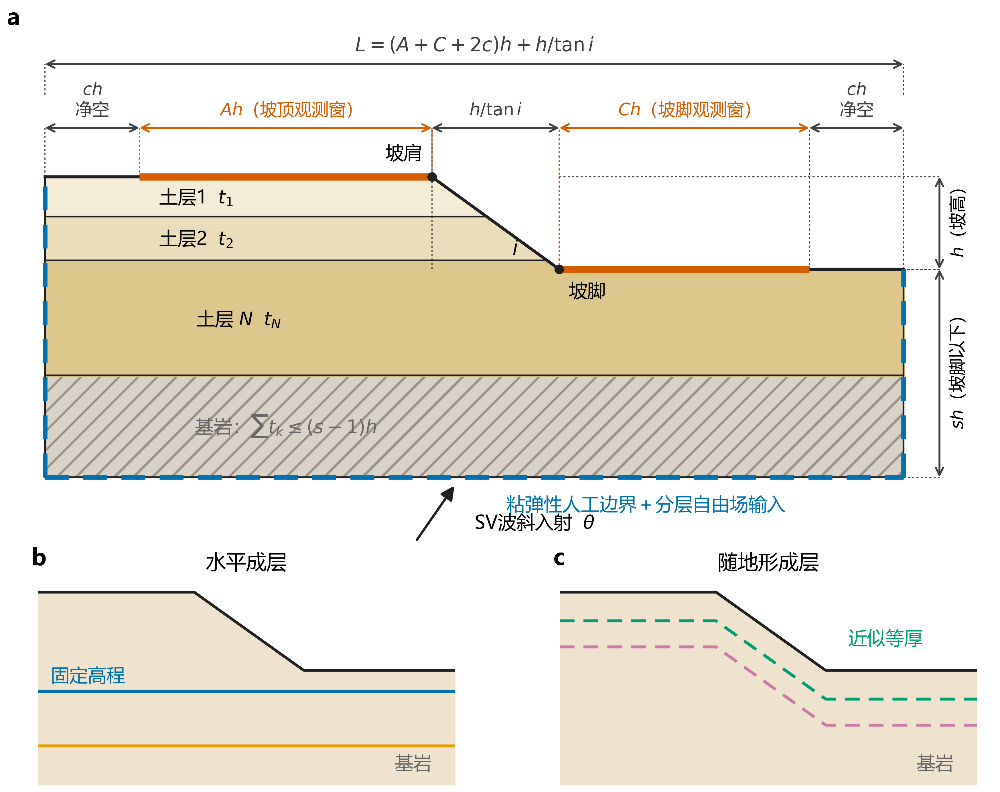

# 边坡地震响应数值模型尺寸设计

本文档给出第三章参数化有限元模型的尺寸定义、取值逻辑与验证边界。正文采用的不是一组对所有工况通用的固定尺寸，而是“无量纲参数化定义—控制工况收敛验证—超出验证域时复核”的三级设计方法。几何换算与 `Modeling/slope_frame_ssi_full_v2.py` 一致；论文正式计算以各工况 `case_config.json` 为准，脚本顶部参数只是可被工况覆盖的配置基底，不能替代论文工况表。

## 1 无量纲尺寸与参数角色

以坡高 $h$ 为几何归一化尺度，坡角记为 $i$，坡顶和坡脚观测窗系数分别记为 $A$ 和 $C$，单侧边界净空系数记为 $c$，坡脚地表以下深度系数记为 $s$。坡顶平台、坡面水平投影、坡脚平台、模型总长和坡脚以下深度分别为

$$
L_A=(A+c)h,qquad L_B=\frac{h}{\tan i},qquad L_C=(C+c)h,
$$

$$
L=L_A+L_B+L_C,qquad D=sh.
$$

这六个参数的作用并不相同。$h$ 和 $i$ 描述真实坡形，是物理研究变量；$A$ 和 $C$ 决定进入统一地表响应数据集的观测范围，是输出域参数；$c$ 和 $s$ 控制人工边界到观测区的距离，是数值截断参数。把三类参数分开，可以避免把扩大边界、增加测点范围或改变坡形误认为同一种“模型尺寸变化”。

图1 参数化坡地计算域与成层方式：（a）计算域尺寸、观测窗、人工边界与入射方向；（b）水平成层；（c）随地形成层。图中长度均以坡高 $h$ 归一化，仅表示参数定义，不对应某一具体算例。

表1 参数化尺寸的作用与取值规则

| 参数 | 参数属性 | 几何含义 | 取值规则 |
|---|---|---|---|
| $h$ | 物理研究变量 | 坡顶与坡脚地表高差 | 按研究对象或工况矩阵给定 |
| $i$ | 物理研究变量 | 坡面与水平面的夹角 | 按工况矩阵给定，并由 $h/\tan i$ 推得坡面水平投影 |
| $A$ | 输出域参数 | 坡肩向坡顶侧的有效观测窗为 $Ah$ | 覆盖需要比较的地表响应范围；不含左侧边界净空 |
| $C$ | 输出域参数 | 坡脚向右侧的有效观测窗为 $Ch$ | 覆盖需要比较的地表响应范围；不含右侧边界净空 |
| $c$ | 数值截断参数 | 观测窗外缘至左右人工边界的净空为 $ch$ | 通过近、中、远侧域比较确定，不作为固定经验常数 |
| $s$ | 数值截断参数 | 坡脚地表至底部人工边界的深度为 $sh$ | 通过浅、中、深底域比较确定，并满足基岩净空约束 |

## 2 平面观测范围与侧向净空

坡顶和坡脚平台均由“有效观测窗＋边界净空”组成。观测窗内的地表节点用于构造统一空间坐标和比较放大曲线，净空段只承担将坡体散射波传至侧边人工边界的数值过渡作用，原则上不进入后续统计样本。坡地效应的空间影响范围随坡形、波长和材料对比而变化[23]，因此不能仅凭某一文献算例把 $A$、$C$ 固定为普适常数。正式分析应先根据研究所需的空间范围给定 $A$ 和 $C$，再检查观测窗外缘处响应是否已趋于稳定；必要时扩大观测窗。

侧向净空 $c$ 也不宜由“最长波长的固定比例”单独决定。本文侧边采用粘弹性人工边界并逐节点施加分层自由场等效荷载[41]，侧边界主要吸收坡体散射产生的外行波，但边界离散、入射角和材料对比仍可能产生残余影响。因此，$c$ 的最终取值由侧域收敛比较确认，而不是由人工边界类型直接宣称充分。

第三章 V3 控制工况取 $h=25\ \mathrm{m}$、$i=30^\circ$、$A=C=2$，侧向净空设置为 $4h$、$6h$ 和 $8h$。中档 $6h$ 相对于远档 $8h$ 的整条地表放大曲线相对误差为 0.197%，峰值相对误差为 0.061%，99% 近峰区重叠率为 1.000，满足 2% 验收线。因此，$6h$ 是该控制工况及其验证域内的基准侧向净空；该结论不是对任意更低波速、更高频率或更强材料对比工况的无条件外推。

## 3 竖向尺寸、地层与基岩净空

模型底边取为 $y=0$，坡脚地表高程为 $sh$，坡顶地表高程为 $(s+1)h$。有限土层从坡顶地表自上而下逐层给定厚度 $t_k$，其余深度归入基岩。若要求基岩顶面至底部人工边界的净空不小于 $2h$，则

$$
(s+1)h-\sum_{k=1}^{N}t_k\geq 2h,
$$

即

$$
\sum_{k=1}^{N}t_k\leq (s-1)h.
$$

这一约束在建模前自动检查；超限时应加深底域或调整不合理的地层概化，不能让程序静默压缩基岩层。$N=0$ 时模型退化为均质基岩坡。水平成层与随地形成层是两种不同的地质概化：前者按固定高程划分界面，后者近似保持覆盖层沿地表的厚度；同一组参数比较必须保持成层方式一致。

V3 控制工况的底部深度设置为 $3h$、$5h$ 和 $7h$。中档 $5h$ 相对于深档 $7h$ 的曲线相对误差为 0.200%，峰值相对误差为 0.033%，99% 近峰区重叠率为 1.000，因而 $5h$ 被接受为该验证域内的基准底部深度。浅档 $3h$ 仅用于显示收敛方向，不承担最终通过判定。

## 4 网格、时间采样与分析时窗

计算域足够大并不等于数值解可信。空间离散还需满足最短有效剪切波长控制。四节点平面应变减缩积分单元 CPE4R 的目标特征尺寸按

$$
\Delta l\leq \frac{V_{s,\min}}{N_\lambda f_{\max}},\qquad N_\lambda=10
$$

进行约束，并参考波动有限元离散的经典讨论[131]。程序同时检查薄层厚度方向的离散数和层内控制频带，防止薄软层虽在几何上存在、却无法被网格解析。输入和输出时间采样按

$$
\Delta t\leq \frac{1}{20f_{\max}}
$$

进行诊断；该条件用于保证时程和频谱采样精度，不替代 Abaqus/Explicit 根据最小单元特征长度确定的稳定时间增量。分析时窗由有效输入时段和静默尾段组成，静默尾段长度应以响应衰减和频谱泄漏检查为依据，不预先固定为 2～3 s。

## 5 适用边界与复核要求

尺寸收敛结论只覆盖实际验证过的参数域。第三章 V3 的控制工况为 20 m 厚软覆盖层、覆盖层与基岩剪切波速分别为 800 m/s 和 2000 m/s、4 Hz Ricker 输入、15° 斜入射和 1% 材料阻尼。后续工况若出现更低的 $V_{s,\min}$、更高的 $f_{\max}$、更大的入射角、更强的阻抗对比、更宽的观测范围或不同边界参数，应至少对网格、时间步、侧向净空和底部深度中的受影响项重新进行单因素复核。

正式论文中的尺寸论证应形成闭环：先在工况表中列出实际 $A$、$C$、$c$、$s$ 和网格、时间参数，再报告中档解相对于更细或更大模型的曲线误差、峰值误差和空间稳定性指标。不得用“已有算例均小于某误差”替代可追溯的工况编号和结果表，也不得把脚本默认配置写成所有论文算例的统一取值。

## 参考文献

[23] BOUCKOVALAS G D, PAPADIMITRIOU A G. Numerical evaluation of slope topography effects on seismic ground motion[J]. Soil Dynamics and Earthquake Engineering, 2005, 25(7): 547-558.

[41] 刘晶波, 谷音, 杜义欣. 一致粘弹性人工边界及粘弹性边界单元[J]. 岩土工程学报, 2006(9): 1070-1075.

[131] KUHLEMEYER R L, LYSMER J. Finite element method accuracy for wave propagation problems[J]. Journal of the Soil Mechanics and Foundations Division, 1973, 99(5): 421-427.
