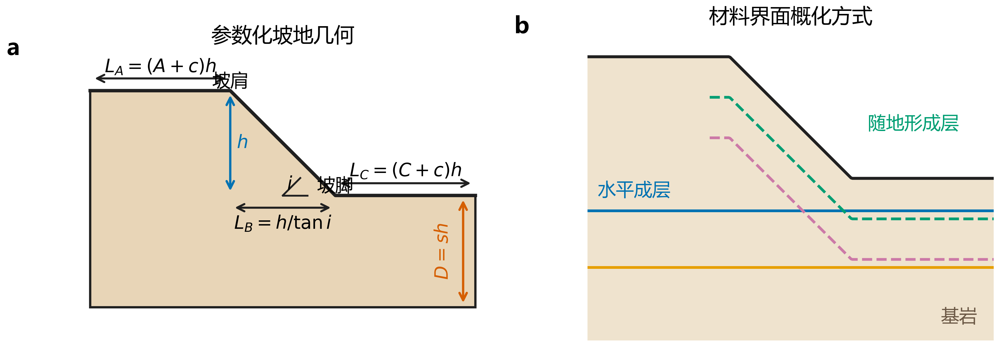

# 第3章 斜入射成层坡地有限元模型与可信性验证

## 3.1 本章任务与论证边界

第2章建立了斜入射波场、成层介质频域响应及黏弹性人工边界等效荷载的理论基础。本章在此基础上构建二维成层坡地有限元模型，并回答一个更为具体的问题：由该模型生成的地表响应，在哪些条件下可以作为后续坡地放大规律分析和数据驱动建模的可信数值样本。这里的“可信”不是笼统地宣称程序能够运行，而是要求几何与材料配置被正确实现、平场波动传递与独立理论解一致、离散误差处于预设容限内，并且结论的适用范围能够由现有证据清楚界定。

已有研究表明，坡地地震响应同时受入射角、波型、材料分层和地形尺度控制[7,65]；二维模型虽然适合开展机理分析和参数研究，但对三维绕射、坡向外传播及空间非均匀性的简化可能改变局部响应[15-17]。因此，本章采用二维平面应变、小变形线弹性模型，研究对象限定为指定频带内的面内 P–SV 波动问题。模型不包含土体屈服、循环退化、孔压耦合、裂隙张开和大变形，也不把本章结果直接解释为真实强震条件下的工程设计放大系数。

本章采用由弱到强的五级证据链。首先，通过几何—材料组合审计检查参数化建模、集合生成和数据导出是否正确；其次，以均质和成层平场为基准，将有限元传递函数与独立频域解定量比较；再次，对真实坡形分别扰动网格、时间步和计算域，并设置同材料人工分层退化试验，检验目标响应对数值设置与几何分区的稳定性；随后复现Shen等[7]公开的台阶坡地基准，以坡肩和坡脚的双分量时程检验坡形散射；最后以网格—波长比、时间采样和人工能量占比评估数值计算质量。各层证据回答的问题不同，后文不以实现核验替代动力验证，也不把单一坡形基准外推为全部地形和材料组合均已验证。

## 3.2 控制方程与基本假定

### 3.2.1 二维弹性动力学方程

在二维平面应变条件下，有限元模型求解的运动方程为

$$
\rho \ddot{\boldsymbol{u}}-\nabla\cdot\boldsymbol{\sigma}=\boldsymbol{b},
\tag{3.1}
$$

式中，$\rho$ 为密度，$\boldsymbol{u}$ 为位移向量，$\boldsymbol{\sigma}$ 为应力张量，$\boldsymbol{b}$ 为体力向量。材料采用各向同性线弹性本构：

$$
\boldsymbol{\varepsilon}=\frac{1}{2}\left(\nabla\boldsymbol{u}+\nabla\boldsymbol{u}^{\mathrm T}\right),\qquad
\boldsymbol{\sigma}=\lambda\,\mathrm{tr}(\boldsymbol{\varepsilon})\boldsymbol{I}+2G\boldsymbol{\varepsilon},
\tag{3.2}
$$

其中，$G=\rho V_s^2$ 为剪切模量，$\lambda$ 为拉梅常数，$V_s$ 为剪切波速。各材料带以 $V_s$、$\rho$、泊松比 $\nu$ 和厚度为基本输入，纵波速度由弹性参数换算得到。该参数化方式保证了有限元模型与第2章波动理论使用同一组材料物理量。

### 3.2.2 斜入射波场与人工边界

斜入射条件以水平慢度

$$
p=\frac{\sin\theta_j}{V_j}
\tag{3.3}
$$

描述，其中，$\theta_j$ 和 $V_j$ 分别为波在第 $j$ 层中的传播角和相应波速。同一水平慢度在各层保持不变，层间折射、临界角判断和 P–SV 耦合均按第2章式（2.10）—式（2.16）处理。有限元输入端采用一致黏弹性人工边界，在法向和切向弹簧—阻尼作用基础上施加自由场等效节点力，其基本形式见第2章式（2.17）—式（2.18）[41]。这样可以将自由场传播解转化为有限域边界上的时变荷载，而不需要在计算域内显式保留远场介质。

生产模型中的斜入射输入与用于验算的参考解相互独立。参考解由频域均质半空间解析关系及 Thomson–Haskell 类层状介质传播方法计算[127-130]，不调用有限元生产流程中的自由场差分结果。垂直入射时，面内耦合问题退化为解耦极限；斜入射时，则同时比较水平与竖向分量。该设计减少了“用同一算法验证同一算法”造成的同源误差。

### 3.2.3 阻尼处理与验证条件

一般计算可采用 Rayleigh 阻尼

$$
\boldsymbol{C}=\alpha\boldsymbol{M}+\beta\boldsymbol{K},\qquad
\xi(\omega)=\frac{1}{2}\left(\frac{\alpha}{\omega}+\beta\omega\right),
\tag{3.4}
$$

其中，$\boldsymbol{M}$、$\boldsymbol{K}$ 和 $\boldsymbol{C}$ 分别为质量、刚度和阻尼矩阵。为避免材料阻尼掩盖输入边界与层间传播误差，本章平场理论验算关闭材料阻尼，只保留人工边界所需的耗能机制。因此，验算结论针对无材料阻尼的线性传播链路；含阻尼坡地工况还应在后续分析中结合参数敏感性解释。

## 3.3 参数化有限元模型

### 3.3.1 几何定义与成层方式

坡地几何以坡高 $h$ 为基本尺度。设坡角为 $i$，坡顶和坡脚水平观测窗的无量纲长度分别为 $A$ 和 $C$，两侧附加净空为 $c$，模型底部深度系数为 $s$，则坡顶平台、坡面水平投影、坡脚平台、总宽度和底部深度分别为

$$
L_A=(A+c)h,\qquad L_B=\frac{h}{\tan i},\qquad
L_C=(C+c)h,
\tag{3.5}
$$

$$
L=L_A+L_B+L_C,\qquad D=sh.
\tag{3.6}
$$

表3-1给出了几何参数的物理含义。将计算域尺寸写成坡高的倍数，有利于在改变坡高和坡角时保持观测范围与边界距离的一致性，也便于以后单独检查计算域截断对坡地散射响应的影响。坡顶、坡面和坡脚共同构成连续地表节点集 `TOP_SURFACE`，坡肩和坡脚位置另设参考点，以保证不同坡形的空间坐标能够统一归一化。

表3-1 参数化坡地几何定义

| 参数 | 含义 | 尺度表达式 |
|---|---|---|
| $h$ | 坡高，也是几何归一化基准 | $h$ |
| $i$ | 坡面与水平面的夹角 | $L_B=h/\tan i$ |
| $A$ | 坡顶有效观测窗系数 | $Ah$ |
| $C$ | 坡脚有效观测窗系数 | $Ch$ |
| $c$ | 单侧附加净空系数 | $ch$ |
| $s$ | 底部深度系数 | $D=sh$ |

成层介质按自上而下的有限层列表定义，每层显式给出 $V_s$、$\rho$、$\nu$ 和厚度，列表以下的剩余深度归入基岩。模型支持两类材料界面：水平成层以固定高程划分材料带；随地形成层则按地表法向厚度近似生成界面。两种方式代表不同的地质概化，不能在同一组结果中混用。材料带先进行几何分区，再赋予截面属性，从而避免仅在后处理阶段按坐标“推断”材料归属。

图3-1将式（3.5）—式（3.6）的几何量与两类材料界面画法对应起来。水平成层适用于层界面近似水平且不随地表起伏的场地；随地形成层用于表达覆盖层厚度大体沿坡面保持的概化地质。该图是参数定义示意，不代表某一具体计算工况的实际尺寸。

图3-1 参数化坡地几何及材料界面概化方式：（a）无量纲几何参数；（b）水平成层与随地形成层

### 3.3.2 单元、网格与时间离散

二维域采用四节点平面应变减缩积分单元 CPE4R。基准网格根据最小剪切波速 $V_{s,\min}$ 和有效最高频率 $f_{\max}$ 自动约束，满足

$$
\Delta l\leq \frac{V_{s,\min}}{N_\lambda f_{\max}},\qquad N_\lambda=10,
\tag{3.7}
$$

式中，$\Delta l$ 为目标单元尺寸，$N_\lambda$ 为最短波长内的最少单元数。式（3.7）采用每个最短波长不少于10个单元的保守控制，并参考有限元波动分析中对网格色散的经典讨论[131]。对于薄软弱层，程序还比较层厚控制频率与输入频带，必要时进一步缩小局部网格，以避免材料层存在但不能被离散分辨的情况。

输入记录和输出结果的时间采样需满足

$$
\Delta t\leq \frac{1}{20f_{\max}},
\tag{3.8}
$$

即有效最高频率对应的一个周期至少包含20个采样点。式（3.8）是输入与输出采样诊断条件，不替代显式求解器依据最小单元特征长度确定的稳定时间增量。验算时以输出数据库中的实际时间轴为准，并将输入记录插值到同一时间轴后再计算频谱。

### 3.3.3 观测量与可追溯数据

地表响应沿 `TOP_SURFACE` 按横坐标排序输出，坡肩参考点由 `CREST_REF` 单独保存。坡地解验证采用水平地形放大系数 $R(s)=\mathrm{PGA}_h(s)/\mathrm{PGA}_{\mathrm{in}}$，其中 $s$ 为以坡肩和坡脚分别对应0和1的分段归一化地表坐标；原始节点结果统一插值到501个固定 $s$ 点。每个算例同时记录实际几何参数、材料表、网格尺寸、输入波标识、边界参数、输出时间间隔和结果文件校验信息。原始时程以结构化数组保存，频谱和放大指标由原始时程重新计算，而不是只保留绘图后的离散点。这样的数据协议使“模型配置—求解输入—原始响应—统计指标”之间保持可追溯关系，也避免因测点顺序或后处理版本变化造成样本标签漂移。

## 3.4 可信性评价方法

### 3.4.1 分层证据结构

本章不以单一误差指标概括全部可信度，而是按问题性质组织证据。按照计算固体力学V&V框架[132]，应区分“数值实现是否正确”的验证问题与“数学模型是否足以代表真实物理”的确认问题。几何—材料审计检查建模实现是否与配置一致；平场理论验算检查输入、人工边界、层间传播和地表输出组成的整体链路；坡地数值解验证检查离散、截断范围与同材界面是否改变目标响应；文献外部基准直接检查坡肩和坡脚散射时程；人工能量检查用于识别减缩积分单元的异常零能模态。由于本章没有现场或物理模型试验，后文统一将前四类工作称为实现核验、解验证和外部数值基准，不把它们扩大表述为针对真实边坡的充分物理确认。各类证据的支持范围见表3-2。

表3-2 本章可信性证据及其解释边界

| 证据 | 检查对象 | 已完成样本 | 可以支持的结论 | 不能替代的验证 |
|---|---|---:|---|---|
| 几何—材料组合审计 | 几何分区、材料带、节点集和网格生成 | 12组 | 参数化建模实现与配置一致 | 动力响应精度 |
| 平场频域理论验算 | 斜入射、成层传播、人工边界和输出链路 | 5组，每组3个测点 | 指定频带内的平场传递精度（A5条件通过） | 坡形散射及三维效应 |
| 坡地数值解验证 | 软覆盖层控制坡地的网格、时间步、侧向/底部域及同材界面退化 | 11组 | 控制性坡地目标曲线的解稳定性 | 其他坡形、材料和频率组合 |
| 文献坡地外部基准 | 坡肩A、坡脚B的水平与竖向时程 | 1组，4个通道 | 主脉冲峰值和坡肩响应的局部一致性；总体未通过 | 完整坡形散射、现场实测及广泛参数域 |
| 人工能量检查 | CPE4R零能模态及能量平衡 | 1组控制工况 | 该控制工况未出现异常人工能量 | 全参数域的能量稳定性 |

这种证据分层能够避免三种常见误判：一是把“模型成功生成”当作“动力结果准确”，二是把平场传播通过验算直接外推为坡形散射已经验证，三是把单个文献基准吻合解释为全部参数域均具有同一误差上界。

图3-2给出了本章从模型定义到结论边界的论证顺序。控制性坡地解验证补上了原版本缺失的离散与域尺寸证据；公开外部基准虽已执行，但四通道门槛未整体通过，因而在图中明确标为“未闭合”。二维、线弹性与单一外部算例的边界同样被保留。

图3-2 第三章可信性验证证据链及各层证据的解释边界

### 3.4.2 传递函数与误差指标

设 $a_q^{\mathrm{surf}}(t)$ 和 $a^{\mathrm{in}}(t)$ 分别为地表第 $q$ 个方向的加速度时程和输入加速度时程，则有限元传递函数定义为

$$
H_q^{\mathrm{FE}}(f)=\frac{A_q^{\mathrm{surf}}(f)}{A^{\mathrm{in}}(f)},
\tag{3.9}
$$

其中，$A(f)$ 表示去均值后完整记录的离散傅里叶谱。只在输入谱幅值大于其最大值1%的频点计算传递函数，以避免除以接近零的输入谱。目标频带统一取 $[0.5f_c,\,1.5f_c]$，$f_c$ 为 Ricker 波主频。

在目标频带 $\mathcal B$ 内，传递函数幅值的归一化均方根误差定义为

$$
e_{\mathrm{NRMSE},q}=
\frac{\left\|\left|H_q^{\mathrm{FE}}\right|-\left|H_q^{\mathrm{ref}}\right|\right\|_{2,\mathcal B}}
{\left\|\left|H_q^{\mathrm{ref}}\right|\right\|_{2,\mathcal B}},
\tag{3.10}
$$

主频处增益相对误差和输出谱峰频误差分别为

$$
e_{g,q}=\left|\frac{|H_q^{\mathrm{FE}}(f_c)|}{|H_q^{\mathrm{ref}}(f_c)|}-1\right|,
\tag{3.11}
$$

$$
e_{f,q}=\frac{|f_{p,q}^{\mathrm{FE}}-f_{p,q}^{\mathrm{ref}}|}{f_c}.
\tag{3.12}
$$

式（3.12）中的峰频由输入谱与传递函数乘积所对应的输出谱确定。频谱计算使用完整记录的矩形窗，并以8倍零填充提高峰频读取分辨率；零填充不改变原始信号幅值，也不被解释为新增信息。若某一理论分量在目标频带内接近零，则相对误差失去意义，此时仅报告该分量的最大数值泄漏增益。

对斜入射 P–SV 耦合算例，除分别比较水平和竖向幅值外，还定义合成传递谱

$$
H_{\mathrm{syn}}(f)=\sqrt{|H_x(f)|^2+|H_y(f)|^2}.
\tag{3.13}
$$

当单一分量出现局部分峰时，以式（3.13）的峰值作为面内耦合响应的总体主频判据，分量峰频仍作为诊断量完整报告。这样既不忽略分量耦合，又避免把能量较小分量中的局部峰误判为系统总体主频。

本研究为数值验算预先采用表3-3所列容限。它们是本研究用于控制数值误差的工程性判据，不是适用于所有波动问题的通用标准。幅值误差上限设置为5%，峰频误差上限设置为3%，目的是使验算误差显著小于后续参数研究中需要辨识的响应差异。

表3-3 平场频域验算判据

| 指标 | 通过阈值 | 评价范围 |
|---|---:|---|
| 频带幅值 $e_{\mathrm{NRMSE}}$ | $\leq 5\%$ | $0.5f_c$—$1.5f_c$ |
| 主频处增益 $e_g$ | $\leq 5\%$ | $f=f_c$ |
| 输出谱峰频 $e_f$ | $\leq 3\%$ | 目标频带内 |
| 理论零分量 | 报告泄漏，不计算相对误差 | 目标频带内 |

### 3.4.3 坡地数值解与外部基准指标

坡地数值解验证不只比较单个峰值，而是在统一的501点归一化地表坐标 $s$ 上比较水平地形放大系数曲线 $R(s)$。以更精细或更大计算域结果为参照，整曲线相对差和峰值相对差定义为

$$
e_L=\frac{\|R-R_{\mathrm{ref}}\|_2}{\|R_{\mathrm{ref}}\|_2},\qquad
e_p=\left|\frac{R_{\max}}{R_{\max,\mathrm{ref}}}-1\right|,
\tag{3.14}
$$

宽缓峰台上，数值差异很小也可能使最高离散点在多个近等值节点间跳变，因此单点 $s_{\max}$ 不作为正式通过量，而是完整保留为诊断。空间稳定性改用99%近峰区 $Z_{0.99}=\{s:R(s)\geq0.99R_{\max}\}$ 的重叠率

$$
O_{0.99}=\frac{|Z_{0.99}\cap Z_{0.99}^{\mathrm{ref}}|}
{\min\left(|Z_{0.99}|,|Z_{0.99}^{\mathrm{ref}}|\right)}.
\tag{3.15}
$$

网格、时间步、侧向域、底部域和同材退化五项正式比较规定 $e_L\leq2\%$、$e_p\leq2\%$ 且 $O_{0.99}\geq0.80$。该空间指标是在首轮单点argmax门槛暴露出峰台不适定性后冻结的第二版协议；首轮失败结果仍保留并在3.7.3节报告。原 $|s_{\max}-s_{\max,\mathrm{ref}}|\leq0.02h$ 只作为更严格的诊断项，不参与第二版总体通过判定。其中同材退化是将与基岩参数完全相同的两条材料界面加入同一坡体；若分区、节点连接或界面处理引入伪反射，其曲线将不能与无界面的均质模型重合。

外部坡地基准比较四个加速度通道。考虑文献只提供图像曲线而未提供原始数组，先由四通道归一化相关系数之和确定唯一公共时间平移，随后在0.4—0.9 s共同有效窗内计算波形归一化误差

$$
e_{w,q}=\frac{\|a_q^{\mathrm{FE}}-a_q^{\mathrm{lit}}\|_2}{\|a_q^{\mathrm{lit}}\|_2}
\tag{3.16}
$$

及绝对峰值误差

$$
e_{a,q}=\left|\frac{\max|a_q^{\mathrm{FE}}|}{\max|a_q^{\mathrm{lit}}|}-1\right|.
\tag{3.17}
$$

四通道均满足 $e_{w,q}\leq15\%$ 和 $e_{a,q}\leq15\%$，且人工能量占比和总能量残差同时低于5%时才判为通过。该阈值在求解前冻结，并显式包含曲线像素化、线宽和坐标标定带来的数字化不确定性；比较过程中不允许逐通道平移、幅值缩放或符号翻转，任一响应或能量门槛失败均不得由其他指标覆盖。

## 3.5 参数化建模的实现核验

几何—材料组合审计覆盖坡高25、50和100 m，坡角30°、45°和60°，以及均质、单层、双层、薄软弱层、同材人工分层等代表性配置；材料界面同时覆盖水平成层和随地形成层。12组模型均完成几何分区、材料赋值、边界集合、地表集合和网格非空检查。生成模型的节点数为206—2967，单元数为178—2860，随几何尺度、层数和网格要求变化，未出现材料带丢失、地表集合为空或同材界面造成区域遗漏的问题。

表3-4逐项列出了实现核验使用的全部工况。编号G01—G12仅用于本章图表对应，不改变原始配置名称。界面类型中的“水平”表示固定高程材料界面，“随地形”表示材料界面随地表起伏；有限层数不包括列表以下的基岩。

表3-4 几何—材料组合审计的全部工况

| 编号 | 坡高/m | 坡角 | 材料配置 | 界面类型 | 有限层数 | 节点数 | 单元数 | 主要核验内容 |
|---|---:|---:|---|---|---:|---:|---:|---|
| G01 | 25 | 30° | 均质 | 水平 | 0 | 252 | 220 | 小尺度缓坡与基础集合 |
| G02 | 50 | 45° | 均质 | 水平 | 0 | 792 | 735 | 中尺度基准坡形 |
| G03 | 100 | 60° | 均质 | 水平 | 0 | 2967 | 2855 | 大尺度陡坡及大网格 |
| G04 | 25 | 30° | 单层 | 随地形 | 1 | 231 | 200 | 小尺度随地形成层 |
| G05 | 50 | 45° | 单层 | 随地形 | 1 | 792 | 735 | 单层基准组合 |
| G06 | 100 | 60° | 单层 | 随地形 | 1 | 2911 | 2803 | 大尺度陡坡单层分区 |
| G07 | 25 | 30° | 双层 | 随地形 | 2 | 252 | 220 | 小尺度多材料带 |
| G08 | 50 | 45° | 双层 | 随地形 | 2 | 792 | 735 | 双层基准组合 |
| G09 | 100 | 60° | 双层 | 随地形 | 2 | 2967 | 2860 | 大尺度陡坡双层分区 |
| G10 | 50 | 45° | 薄软弱层 | 随地形 | 1 | 828 | 770 | 薄层保留与局部网格 |
| G11 | 100 | 60° | 同材人工分层 | 随地形 | 2 | 2961 | 2854 | 同材界面连续性 |
| G12 | 25 | 60° | 双层 | 水平 | 2 | 206 | 178 | 水平界面与陡坡组合 |

图3-3比较了12组模型的节点数和单元数。模型规模随坡高和材料分区复杂度增加，但所有工况均生成非空网格；图上方的H/T及数字分别标识水平/随地形界面和有限层数，可与表3-4逐项核对。

图3-3 十二组几何—材料审计工况的节点数与单元数

这组审计还专门设置了“相邻层材料完全相同”的人工分层工况。若程序错误地把材料界面当作物理自由面，该工况会产生不应有的几何断裂或集合异常；实际模型保持连续，说明材料分区与几何边界在实现层面得到区分。薄软弱层工况则用于检查局部分区和网格是否能够保留有限厚度材料带。上述结果证明参数化几何和材料映射能够按配置稳定生成，但其证据性质属于实现核验，不能单独证明动力响应准确。

所有正式验算均由固定配置生成，求解后保留结构化原始时程、配置清单和自动判定报告。测点坐标按实际网格读取，输入波在频谱分析前插值到有限元输出时间轴。因而，本章表格中的误差不是由图像量取，而是可由保存的原始数组和冻结指标公式重新计算。

## 3.6 平场频域理论验算

### 3.6.1 算例设计

平场验算在矩形计算域内进行，采用基岩 $V_s=2000$ m/s、$\rho=2500$ kg/m³、$\nu=0.30$；成层工况在地表设置厚20 m、$V_s=800$ m/s、$\rho=2000$ kg/m³、$\nu=0.30$ 的覆盖层。为减小有限域截断对验算的影响，计算域宽1125 m、深度500 m，三个地表测点位于 $x/L=0.25$、0.50和0.75。各算例关闭材料阻尼，采用同一组已冻结的人工边界系数，即阻尼比例系数为1.0、弹簧比例系数为2.0，不针对单个测点或单个算例重新拟合。该参数组是本节验算配置的一部分，不应被理解为任意生产工况均已验证的默认值。

五组算例由垂直入射均质基准逐步扩展到斜入射和成层高频工况。表3-5列出每一组的物理条件，表3-6列出相应的数值配置。A1—A4采用16 m网格，A5因覆盖层波长缩短而采用8 m网格。

表3-5 平场频域理论验算的物理工况

| 算例 | 验证几何 | 介质参数 | 入射角 | $f_c$/Hz | 目标频带/Hz | 验算目的 |
|---|---|---|---:|---:|---:|---|
| A1 | 平场 | 均质基岩：$V_s=2000$ m/s，$\rho=2500$ kg/m³，$\nu=0.30$ | 0° | 2 | 1—3 | 垂直入射基准及理论零分量泄漏 |
| A2 | 平场 | 同A1 | 15° | 2 | 1—3 | 小角度 P–SV 耦合 |
| A3 | 平场 | 同A1 | 30° | 2 | 1—3 | 较大角度 P–SV 耦合 |
| A4 | 平场 | 20 m覆盖层：$V_s=800$ m/s，$\rho=2000$ kg/m³，$\nu=0.30$；下伏基岩同A1 | 0° | 2 | 1—3 | 垂直入射成层传播 |
| A5 | 平场 | 覆盖层与基岩同A4 | 15° | 4 | 2—6 | 高频成层 P–SV 耦合 |

表3-6 平场频域理论验算的数值配置

| 算例 | 计算域（宽×深）/m | 单元 | 网格/m | 输出间隔/s | 测点位置 | 材料阻尼 | 边界比例系数（阻尼/弹簧） | 独立参考解 |
|---|---|---|---:|---:|---|---|---|---|
| A1 | 1125×500 | CPE4R | 16 | 0.000999928 | $x/L=0.25,0.50,0.75$ | 关闭 | 1.0/2.0 | 均质半空间解析解 |
| A2 | 1125×500 | CPE4R | 16 | 0.000999928 | $x/L=0.25,0.50,0.75$ | 关闭 | 1.0/2.0 | 均质 P–SV 解析解 |
| A3 | 1125×500 | CPE4R | 16 | 0.000999928 | $x/L=0.25,0.50,0.75$ | 关闭 | 1.0/2.0 | 均质 P–SV 解析解 |
| A4 | 1125×500 | CPE4R | 16 | 0.000999928 | $x/L=0.25,0.50,0.75$ | 关闭 | 1.0/2.0 | 独立SH层状传递解 |
| A5 | 1125×500 | CPE4R | 8 | 0.000999928 | $x/L=0.25,0.50,0.75$ | 关闭 | 1.0/2.0 | 独立P–SV层状传播解 |

### 3.6.2 均质半空间结果

A1为垂直入射均质基准。三个测点的水平传递函数在目标频带内基本重合，如图3-4（a）所示；理论自由表面水平传递幅值为2。三点的频带幅值误差为0.254%—0.324%，主频增益误差为0.096%—0.130%，输出峰频误差为0。理论竖向分量为零，图3-4（b）所示有限元数值泄漏增益最大为1.045%。这说明在垂直入射基准下，输入幅值、自由表面反射和横向空间一致性均得到较好保持。

A2和A3用于检查斜入射下的面内分量耦合。A2的水平、竖向频带幅值误差最大分别为0.373%和0.849%，主频增益误差最大分别为0.285%和1.062%；A3对应误差最大分别为0.357%、0.689%、0.327%和0.921%。两组算例的水平与竖向输出峰频均与参考解一致。误差未随入射角从15°增至30°而系统放大，表明在所验角度范围内，慢度相位、P–SV分量转换和地表输出没有出现可辨识的角度相关偏差。

图3-4 均质平场A1—A3三个测点的有限元传递函数与独立理论解：（a）（b）A1水平与竖向分量；（c）（d）A2水平与竖向分量；（e）（f）A3水平与竖向分量；点线表示各算例主频

### 3.6.3 成层介质结果

A4在均质基准上加入20 m覆盖层。三个测点的水平频带幅值误差为0.374%—0.450%，主频增益误差为0.149%—0.180%，峰频误差为0；理论竖向分量为零，数值泄漏增益最大为1.249%。与A1相比，误差仍处于同一数量级，说明覆盖层—基岩界面的反射透射及地表输出能够与独立层状介质参考解一致。

A5同时提高主频并引入15°斜入射，是五组算例中离散要求最高的工况。水平和竖向频带幅值误差最大分别为0.840%和1.949%，主频增益误差最大分别为0.795%和0.683%，均低于5%容限。水平分量峰频误差最大为2.50%，合成传递谱峰频误差为0，满足3%判据；但竖向分量因局部分峰产生3.12%—9.37%的峰频误差，未通过同一控制线。因此A5只按条件通过报告：幅值、主频增益、水平峰频和总体合成峰频得到支持，竖向局部分峰位置仍有明显差异。合成谱口径用于说明总体面内能量峰未偏移，不能覆盖单分量未通过项。

图3-5显示，A4和A5的有限元水平传递函数均跟随独立层状介质解的频率变化趋势。A4理论竖向分量为零，数值曲线直接反映泄漏水平；A5竖向曲线在4—6 Hz内出现测点相关的局部起伏，这正是需要同时报告分量峰频诊断量和合成谱主判据的原因。

图3-5 成层平场A4—A5三个测点的有限元传递函数与独立理论解：（a）（b）A4水平与竖向分量；（c）（d）A5水平与竖向分量；点线表示各算例主频

### 3.6.4 定量汇总与证据解释

表3-7列出每个算例三个测点中的最大误差。A1—A4的全部适用指标满足表3-3；A5的幅值、主频增益、水平峰频和合成谱峰频满足判据，但竖向分量局部峰频超过3%线，故按“条件通过”而不是“完全通过”报告。五组算例的最大频带幅值误差为1.949%，最大主频增益误差为1.062%。

表3-7 平场理论验算的最大误差

| 算例 | 水平幅值 NRMSE/% | 竖向幅值 NRMSE/% | 水平增益误差/% | 竖向增益误差/% | 峰频误差/% | 判定 |
|---|---:|---:|---:|---:|---|---|
| A1 | 0.324 | — | 0.130 | — | 水平0；竖向为理论零分量 | 通过 |
| A2 | 0.373 | 0.849 | 0.285 | 1.062 | 水平0；竖向0 | 通过 |
| A3 | 0.357 | 0.689 | 0.327 | 0.921 | 水平0；竖向0 | 通过 |
| A4 | 0.450 | — | 0.180 | — | 水平0；竖向为理论零分量 | 通过 |
| A5 | 0.840 | 1.949 | 0.795 | 0.683 | 水平2.50；合成0；竖向诊断最大9.37 | 条件通过 |

图3-6把表3-7中的误差与验收线直接比较。幅值和主频增益均明显低于5%容限；峰频图同时保留A5竖向分量的9.37%诊断误差，可见该指标未通过3%线。水平分量和合成谱主频满足既定要求，只能说明总体面内响应主频未偏移，不能消除竖向局部分峰的差异。

图3-6 F1验算最大误差及验收容限：（a）频带幅值与主频增益误差；（b）分量及合成谱峰频误差，A5竖向分量超过3%控制线

上述结果证明：在表3-5所覆盖的材料、频率和入射角条件下，有限元平场模型能够再现独立参考解给出的自由表面和成层传递特征。该结论直接支持生产流程中的斜入射加载、层间传播及地表响应提取，但不直接检验坡肩和坡脚附近的衍射、坡面转换波以及有限坡形引起的空间放大。

## 3.7 数值质量与误差来源

### 3.7.1 网格—波长比与时间采样

表3-8按目标验算频带上限 $1.5f_c$ 计算最短剪切波长。A1—A3的最短波长为666.7 m，对应每波长41.7个单元；A4和A5因覆盖层波速较低，最短波长分别为266.7 m和133.3 m，对应每波长均为16.7个单元，均高于式（3.7）的最低要求。五组算例的实际输出时间间隔约为0.001 s；即使在A5的6 Hz目标频带上限处，每个周期仍有约166.7个输出点，高于式（3.8）的要求。

表3-8 平场验算的空间与时间离散质量

| 算例 | 目标频带上限/Hz | $V_{s,\min}$/m·s⁻¹ | 最短波长/m | 单元尺寸/m | 单元数/最短波长 | 输出点数/最短周期 |
|---|---:|---:|---:|---:|---:|---:|
| A1—A3 | 3 | 2000 | 666.7 | 16 | 41.7 | 333.3 |
| A4 | 3 | 800 | 266.7 | 16 | 16.7 | 333.3 |
| A5 | 6 | 800 | 133.3 | 8 | 16.7 | 166.7 |

表3-8说明平场验算的离散密度足以解析目标频带，但它本身不是完整的网格收敛研究。坡地响应的三档网格、三档时间采样和三档侧向净空比较另见3.7.3节，本章不以波长经验判据替代实际解扰动证据。

### 3.7.2 人工能量与能量平衡

减缩积分单元可能产生零能模态，因此另以一组4 Hz均质平场控制工况检查人工应变能。该工况的人工能量占比为 $4.41\times10^{-7}$，总能量相对残差为 $3.25\times10^{-6}$，均远低于5%的控制线。结果表明该工况未发生由沙漏模式主导的异常响应，且能量收支具有良好一致性。

表3-9列出能量控制工况及两个验收指标。该工况使用平场矩形域、均质基岩、垂直入射4 Hz Ricker波和8 m CPE4R网格，材料阻尼关闭；模型共1482个节点和1400个单元。

表3-9 人工能量控制工况与验收结果

| 工况 | 几何与介质 | 入射角 | $f_c$/Hz | 计算域（宽×深）/m | 网格与单元 | 输出间隔/s | 指标 | 结果 | 控制线 | 判定 |
|---|---|---:|---:|---:|---|---:|---|---:|---:|---|
| E1 | 均质平场，$V_s=2000$ m/s，$\rho=2500$ kg/m³，$\nu=0.30$ | 0° | 4 | 450×200 | 8 m，CPE4R | 0.000999987 | 人工能量占比 | $4.41\times10^{-7}$ | 0.05 | 通过 |
| E1 | 同上 | 0° | 4 | 450×200 | 8 m，CPE4R | 0.000999987 | 总能量相对残差 | $3.25\times10^{-6}$ | 0.05 | 通过 |

图3-7将空间离散、时间采样和能量指标放在同一质量控制图中。A1—A5的单元数/最短波长和输出点数/最短周期均高于最低要求；E1的两项能量指标在对数坐标下仍比5%控制线低四个以上数量级。

图3-7 平场验算的数值质量：（a）最短波长内单元数；（b）最短周期内输出点数；（c）E1人工能量占比与总能量残差

该能量结果仅对应一个控制工况。由于坡形、软弱层厚度和局部网格畸变均可能改变人工能量占比，后续正式坡地算例仍需逐算例保留人工能量和能量残差检查，不能把单个控制工况的结果外推为整个参数空间的统一保证。

### 3.7.3 控制性软层坡地数值解验证

为避免在高波速均质介质上得到缺乏约束力的“容易通过”结果，正式数值解验证选用含软覆盖层的控制性坡地。坡高为25 m、坡角为30°，20 m厚覆盖层沿地形分布，覆盖层与基岩的剪切波速分别为800 m/s和2000 m/s，密度分别为2200 kg/m³和2500 kg/m³，泊松比均为0.30；输入为15°斜入射、4 Hz Ricker波，材料阻尼比为1%。程序按有效最高频率10 Hz诊断，覆盖层最短剪切波长为80 m，因此8 m基准网格恰好满足每波长10个单元，而12 m粗网格只有6.7个单元，仅用于显示收敛方向，不承担通过判定。

表3-10列出全部11组工况。M、T、D和B分别表示网格、时间步、侧向净空和底部深度扰动；S0为四类扰动共享的中档基准。H0和L1不含软层，二者材料完全相同，仅在L1中人为加入5 m和10 m厚的同材分区，用于检验材料界面退化。除表列单因素外，其他参数均与相应基准保持一致。

表3-10 控制性坡地数值解验证的全部工况

| 工况 | 介质与界面 | 网格/m | 目标时间步/ms | 侧向净空 | 底部深度 | 比较用途 | 判定角色 |
|---|---|---:|---:|---:|---:|---|---|
| M1 | 20 m软层，随地形 | 12.00 | 1.0 | 6h | 5h | 网格粗档 | 仅看趋势 |
| S0 | 20 m软层，随地形 | 8.00 | 1.0 | 6h | 5h | 网格/时间步/域共享中档 | 正式比较 |
| M3 | 20 m软层，随地形 | 5.33 | 1.0 | 6h | 5h | 网格细档 | 参考解 |
| T1 | 20 m软层，随地形 | 8.00 | 2.0 | 6h | 5h | 时间步粗档 | 仅看趋势 |
| T3 | 20 m软层，随地形 | 8.00 | 0.5 | 6h | 5h | 时间步细档 | 参考解 |
| D1 | 20 m软层，随地形 | 8.00 | 1.0 | 4h | 5h | 近侧边界 | 仅看趋势 |
| D3 | 20 m软层，随地形 | 8.00 | 1.0 | 8h | 5h | 远侧边界 | 参考解 |
| B1 | 20 m软层，随地形 | 8.00 | 1.0 | 6h | 3h | 浅底边界 | 仅看趋势 |
| B3 | 20 m软层，随地形 | 8.00 | 1.0 | 6h | 7h | 深底边界 | 参考解 |
| H0 | 均质基岩，无人工界面 | 8.00 | 1.0 | 6h | 5h | 同材退化基准 | 参考解 |
| L1 | 均质基岩，5 m+10 m同材界面 | 8.00 | 1.0 | 6h | 5h | 同材界面退化 | 正式比较 |

11组计算均正常完成，且求解日志与地表时程自动检查均未发现异常。S0、M3、T3、D3和B3的最大放大系数分别为1.2836、1.2667、1.2837、1.2843和1.2831。表3-11给出中档解相对于细网格、细时间步、扩大侧域和加深底域的定量差异；同材界面项则比较L1与H0。曲线相对误差和峰值相对误差均以2%为验收线，空间稳定性采用式（3.15）的99%近峰区重叠率，并以0.80为下限。

图3-8 控制性软层坡地表面放大曲线的单因素扰动：（a）网格尺寸；（b）时间步；（c）侧向净空；（d）底部深度

表3-11 控制性坡地数值解验证结果

| 比较项 | 曲线相对误差/% | 峰值相对误差/% | 99%近峰区重叠率 | 单点峰位偏移/h | 正式判定 |
|---|---:|---:|---:|---:|---|
| S0—M3，网格中档—细档 | 0.488 | 1.327 | 0.933 | 0.211 | 通过 |
| S0—T3，时间步中档—细档 | 0.013 | 0.013 | 1.000 | 0 | 通过 |
| S0—D3，侧向净空中档—远档 | 0.197 | 0.061 | 1.000 | 0 | 通过 |
| S0—B3，底部深度中档—深档 | 0.200 | 0.033 | 1.000 | 0 | 通过 |
| L1—H0，同材人工界面退化 | 0.156 | 0.308 | 1.000 | 0.640 | 通过 |

图3-8和表3-11表明，时间离散、侧向截断和底部截断对整条放大曲线的影响均不足0.20%；网格比较的误差相对较大，但中档与细档曲线误差仍仅0.488%，峰值误差为1.327%，且近峰区重叠率达到0.933。同材人工分层没有引入可辨识的虚假反射：L1与H0的曲线误差为0.156%，峰值误差为0.308%。这些结果说明后续参数研究所采用的8 m网格、1 ms时间步、6h侧向净空和5h底部深度，在该软弱层控制工况下已达到既定解稳定性要求。

图3-9 控制性坡地解验证：（a）H0与L1表面放大曲线；（b）五项比较的曲线误差与峰值误差，近峰区重叠率见表3-11

需要说明的是，初始协议曾把单个离散节点的最大值位置偏移不超过0.02h设为强制门槛。该协议下，网格比较和同材界面比较分别因0.211h和0.640h的单点峰位跳动而失败，失败报告已原样归档。进一步检查发现，两组曲线的整体误差分别只有0.488%和0.156%，而坡顶附近存在宽缓峰台；微小幅值扰动即可使离散`argmax`在平台内换点。因此，修订协议没有删除这一诊断量，而是将其降为辅助报告项，正式空间判据改为预先定义的99%近峰区重叠率。表3-11同时列出两种口径，避免以修改判据掩盖初始失败，也避免用病态的单点指标否定整体已收敛的曲线。

### 3.7.4 Shen等（2024）坡地外部基准

内部收敛只能说明离散解趋于稳定，不能排除控制方程、边界输入或坡形实现共同收敛到错误结果。因此，本章进一步复现Shen等[7]的第二个验证算例。该文以ABAQUS黏弹性边界方法和SPECFEM2D分别计算同一台阶坡地，并在其图9公开坡肩A与坡脚B的水平、竖向加速度时程。本文直接比较的是图9中标注“This study”的公开ABAQUS实线；原文已用SPECFEM2D虚线对其进行交叉验证，但因作者未公开原始数组，本文不把数字化实线冒充为SPECFEM2D原始数据。

表3-12给出复现工况。弹性模量20 GPa、泊松比0.30和密度2500 kg/m³换算得到剪切波速1754.12 m/s；总长8h、总厚3h和坡肩后方3h距离均按原文设置。8 m网格在8 Hz主频处约含27.4个单元/剪切波长，在12 Hz目标频带上限处仍含18.3个单元/波长。文献曲线由原图坐标标定后逐像素提取，A点和B点的纵轴量化分辨率分别约为0.0218 m/s²和0.00903 m/s²。

表3-12 Shen等（2024）台阶坡地外部基准工况

| 项目 | 取值 | 文献对应关系 |
|---|---|---|
| 几何 | h=200 m，坡角45°，总长1600 m，总厚600 m | 原文验证算例2与8h×3h模型 |
| 材料 | E=20 GPa，ν=0.30，ρ=2500 kg/m³，Vs=1754.12 m/s | 与原文验证算例1相同 |
| 输入 | 15°斜入射SV波；8 Hz Ricker波；峰值1 m/s² | 原文验证算例2 |
| 离散 | CPE4R；8 m均匀网格；0.5 ms输入采样；材料阻尼关闭 | 本文复现设置 |
| 边界 | 黏弹性人工边界；式（7）参数a=0.8、b=1.1，法向/切向系数分别换算 | 与Shen等[7]一致 |
| 观测 | 坡肩A、坡脚B；水平与竖向共4通道 | 原文图8—图9 |
| 比较窗与阈值 | 0.4—0.9 s；公共时间平移≤0.15 s；$e_w,e_a\leq15\%$ | 求解前冻结 |

复算采用四通道共同确定的时间平移量为−0.0655 s，平均归一化相关系数为0.899。表3-13和图3-10给出没有逐通道移相、缩放或符号翻转的直接比较。坡肩A竖向通道的波形误差与峰值误差分别为13.96%和13.31%，满足15%门槛；坡肩A水平通道的峰值误差为7.72%，但波形误差15.71%略高于控制线。坡脚B水平通道峰值接近文献，峰值误差仅3.56%，但后续散射波列存在相位与形状差异，波形误差为22.62%。坡脚B竖向响应幅值较小，本文结果与数字化文献曲线的波形误差和峰值误差分别达到105.88%和17.47%，均未通过。

表3-13 Shen等（2024）公开坡地算例复算结果

| 通道 | 本文绝对峰值/(m·s⁻²) | 文献图数字化峰值/(m·s⁻²) | 波形误差/% | 峰值误差/% | 判定 |
|---|---:|---:|---:|---:|---|
| 坡肩A—水平 | 2.815 | 3.051 | 15.71 | 7.72 | 未通过（波形） |
| 坡肩A—竖向 | 0.976 | 1.126 | 13.96 | 13.31 | 通过 |
| 坡脚B—水平 | 1.453 | 1.403 | 22.62 | 3.56 | 未通过（波形） |
| 坡脚B—竖向 | 0.295 | 0.251 | 105.88 | 17.47 | 未通过 |

图3-10 Shen等（2024）图9公开ABAQUS曲线与本文有限元结果：（a）（b）坡肩A水平与竖向；（c）（d）坡脚B水平与竖向；所有通道采用同一时间平移量

该工况的人工能量占比和能量残差分别为 $4.27\times10^{-6}$ 和 $4.63\times10^{-6}$，求解质量门槛通过。首轮数字化曾因图例屏蔽范围错误产生虚假平台；修正后坡脚水平波形误差由41.4%降至22.6%，旧失败报告仍保留。随后按原文式（7）精确换算法向、切向边界系数进行独立复算，结果变化很小，说明剩余差异不能归因于通用边界缩放量。由于原文没有提供原始数组，特别是坡脚竖向通道的幅值仅约0.25 m/s²，JPEG线宽、同色实线与虚线邻近会放大数字化不确定性；但这不足以把未通过项改判为通过。因此，本节只能支持主脉冲幅值和坡肩响应具有一定一致性，不能作为坡脚四通道散射时程已经外部验证的证据。

### 3.7.5 误差来源与当前控制水平

本章误差主要来自空间离散、时间轴对齐、有限记录频谱估计、有限计算域反射、人工边界近似和公开图像数字化。平场理论对照中，最不利频带幅值误差为1.949%，最不利主频增益误差为1.062%，均低于5%容限；A5水平分量峰频误差为2.50%，合成谱误差为0，但竖向局部分峰最大诊断误差为9.37%。坡地解验证中，网格、时间步、侧向净空和底部深度扰动的整曲线误差最大分别为0.488%、0.013%、0.197%和0.200%，相应峰值误差最大分别为1.327%、0.013%、0.061%和0.033%。因此，平场频率组成与坡地空间放大曲线已分别受到定量约束，不能再笼统表述为仅凭波长经验式判断网格充分。

这些误差不能简单相加为一个“总不确定度”，因为各误差源并非统计独立，评价对象和归一化尺度也不同。尤其是A5竖向局部分峰、宽峰曲线的单点`argmax`和公开图中的弱幅值通道，均说明单一相对误差在分母接近零或峰台宽缓时可能失稳。本章因而保留分项指标、失败诊断与证据边界，不构造缺乏样本基础的综合置信区间，也不以某一项通过覆盖另一项未通过。

## 3.8 适用范围与尚存限制

现有证据已经闭合四项关键问题：参数化几何和材料带能够按配置生成；均质与成层平场在表3-5所列5个离散组合下与独立频域解总体一致，其中A5按条件通过；控制性软层坡地在网格、时间步、侧向净空和底部深度扰动下的整曲线与峰值差异满足2%门槛；代表性工况未出现异常人工能量。这些结果足以支持后续章节把该流程用于已验参数邻域内的二维线性机理性数值试验，并采用同一数据协议进行相对比较。由于5组平场算例和1组软层坡地不是全因子组合，其通过结果不用于证明任意插值工况均具有相同误差上界。

证据边界同样明确。第一，公开坡地复算没有通过冻结的四通道波形门槛，尤其坡脚弱竖向通道差异明显；在作者未公开原始数组、本文又没有独立SPECFEM2D结果的条件下，坡形散射的外部数值基准尚未闭合。第二，V3只覆盖一组控制性软层坡地，尚未直接给出边界反射系数，也未证明更高频、更陡坡或更强阻抗反差下仍满足2%上界。第三，本章没有现场记录或振动台试验，不能完成针对真实边坡的物理确认。第四，二维平面应变模型忽略坡体沿走向变化和三维绕射，已有研究表明二维与三维地形响应可能存在不可忽略差异[15-17]；线弹性模型也不描述强震下的刚度退化、滞回耗能和永久变形。

因此，后续章节若使用本模型输出，应遵守两项解释原则：其一，结论表述为已验二维线性模型内的相对规律，不直接上升为场地实测预测或规范系数；其二，涉及幅值极值、坡脚弱分量、坡肩局部响应和材料软化敏感区时，应同步检查网格、能量与边界稳定性。只有在获得公开原始基准数组、独立求解器结果或现场/物理模型资料后，才能扩大模型的外推范围。

## 3.9 本章小结

本章建立了面向斜入射成层坡地问题的二维平面应变有限元模型。模型以坡高为几何归一化尺度，以材料层列表定义水平或随地形成层，通过一致黏弹性人工边界输入第2章得到的斜入射自由场，并以结构化原始时程维持配置、求解和后处理之间的可追溯性。网格尺寸由最小剪切波长控制，输入与输出采样采用统一的频带诊断条件。

可信性评价没有停留在定性波形对比。12组几何—材料组合完成实现核验；5组平场算例与独立均质或成层频域解比较，最大频带幅值误差为1.949%，最大主频增益误差为1.062%，其中A1—A4通过、A5因竖向局部分峰按条件通过；代表性能量工况的人工能量占比和能量残差分别为 $4.41\times10^{-7}$ 和 $3.25\times10^{-6}$。11组控制性软层坡地计算进一步给出网格、时间步、侧向域和底部域收敛证据，最不利整曲线误差为0.488%，最不利峰值误差为1.327%，99%近峰区重叠率不低于0.933；同材人工界面的曲线误差为0.156%。

同时，本章没有把公开算例的定性相似包装成验证通过。Shen等[7]工况的四通道统一对齐后，坡肩竖向满足15%门槛，另外三通道至少有一项未通过，故外部坡形基准判为未闭合。当前证据能够支持已验参数邻域内二维线性模型的相对参数研究，但不替代独立求解器原始数据、现场或振动台资料、直接边界反射评估、三维分析和非线性验证。后续章节据此限定结论层级，可避免把数值模型的内部稳定性过度外推为真实边坡的普遍规律。
