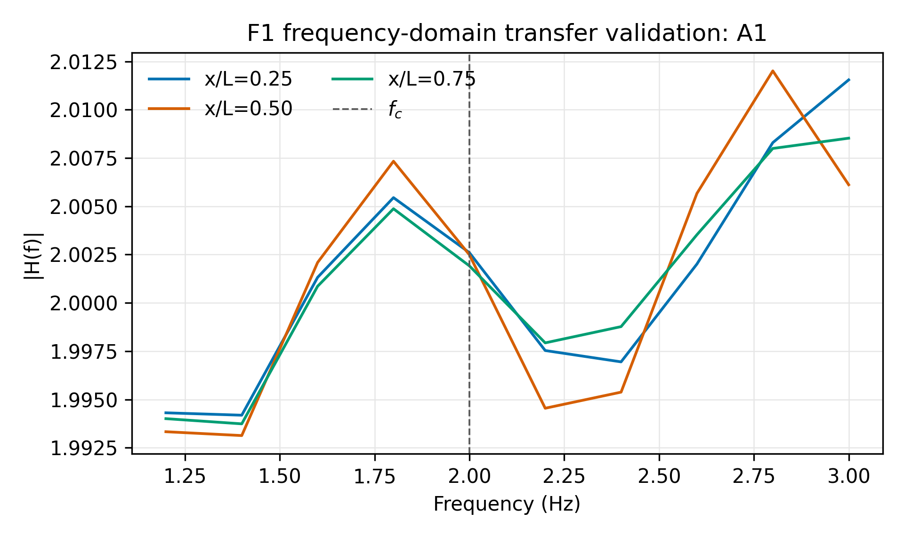

# 第3章 斜入射成层坡地有限元模型与可信性验证

*从论文 Word 工作稿提取，源文件：`边坡地震动放大效应研究论文初稿（第三章重构）.docx`。*

---

## 3.1 研究目标、验证问题与适用边界

本章的任务是建立可复现的二维平面应变有限元平台，并用分层递进的证据链说明该平台在指定频带、入射角和材料参数范围内能够正确传递地震波。验证对象不是某一个坡地放大系数，而是第4章参数分析和第6章机器学习标签所依赖的数值数据生成过程。为此，本章把实现验证、数值解验证、独立理论基准、边界与收敛检查以及外部二维基准分开报告。

本章需要回答四个问题：第一，配置中的几何、材料带、观测点和数据协议是否被有限元模型准确实现；第二，均质和成层平场的输入—输出传递函数是否与独立理论解一致；第三，网格、时间步、计算域和人工边界是否使目标响应具有数值稳定性；第四，在尚未引入现场或振动台标定时，哪些结论可以外推，哪些结论必须限制在二维线性模型内部。

本文的正式适用范围限定为二维平面应变、小应变线弹性、CPE4R 单元、指定 Ricker 波频带和有限入射角范围。当前证据不支持将线性结果直接解释为真实强震下任意边坡的绝对放大系数，也不支持在未完成非线性敏感性和外部二维基准前给出工程设计系数。

## 3.2 控制方程、基本假定与模型范围

有限元模型求解二维弹性动力学方程 ρ ü = div σ + b，其中 u 为位移，σ = C:ε，应变由小变形关系给出。材料采用各向同性线弹性本构，剪切波速、密度和泊松比由配置文件注入，纵波速由弹性参数换算得到。

输入波采用有限时长 Ricker 加速度记录。斜入射通过水平慢度 p = sin(θ) / Vs 引入传播相位，人工边界由弹簧—阻尼器和自由场等效节点力共同实现。独立参考解不调用生产有限差分自由场内核，而由 `reference_layered_psv_v1.py` 计算均质 P–SV 或成层传递函数；垂直入射成层退化另采用独立 SH 层状传递公式。

模型不包含塑性屈服、接触滑移、裂缝扩展、孔压耦合和大变形。因而本章结论只表示数值平台在小应变线性机制下的可信度，不能替代强震条件下的等效线性、显式非线性或现场观测验证。

## 3.3 有限元模型与数据协议

### 3.3.1 无量纲几何与成层介质

几何由坡高、坡角、坡顶和坡脚观测窗、侧向净空以及底部深度的无量纲倍数确定。生产坡地采用统一的坡肩、坡脚和 `TOP_SURFACE` 节点集；平场验证模式将地表退化为水平矩形，但保留坡高作为几何归一化参考，以便在同一数据协议下比较平场和坡地。

成层介质按从上到下的有限层列表注入，每层显式给出 Vs、密度、泊松比和厚度，剩余深度归入基岩。材料界面可按固定高程或沿地形等厚方式生成。V1 的 12 个几何—材料工况确认了均质、单层、双层、薄软层、同材人工分层和水平/沿坡分层均能生成非空材料带、边界集和观测面。

### 3.3.2 单元、网格、分析步和输出

基准单元为四节点双线性减缩积分平面应变单元 CPE4R。网格尺寸、时间增量和输出采样率均写入 `case_config.json`，Autorun 在运行后从 ODB、NPZ 和日志反查实际值，避免把名义配置误当作求解事实。分析步采用显式动力步，记录输入波、地表水平/竖向加速度、地下控制点和整体能量历史。

所有单工况数据首先形成 `surface_results.npz`，收集器直接读取 NPZ 并展开索引；CSV 只作为后处理运行期临时文件。NPZ 中同时保存原始时程、理论时程、误差数组、实际时间轴、脚本哈希和 QA JSON，确保图表和正文中的工况编号能够回指到具体运行目录。

### 3.3.3 斜入射等效输入与人工边界

自由场输入由独立频域柱解生成边界自由场位移、速度和应力，再按边界外法向组装等效节点力。侧边界分别施加法向和切向弹簧—阻尼器，底边界采用相应的切向/法向交换规则；人工边界的恢复系数在 F1 中预登记为标准 Liu 取值 `spring_scale=2.0`，阻尼器缩放为1.0。

V2 时域 pilot 表明，有限记录起点、斜入射传播相位和后期边界反射会使长时程逐点对拍产生非物理失败。因此正式 F1 改用输入—输出频域传递函数，采用内部测点和完整记录窗，先把输入波插值到 ODB 实际时间轴，再比较幅值和合成主频。

### 3.3.4 阻尼、观测坐标与响应指标

当前 F1 控制工况关闭材料阻尼，以便直接观察人工边界和层状反射的数值影响；后续生产分析的阻尼参数必须由 V5 收敛和能量检查共同冻结。地表观测点按有效地表 x 范围的 0.25、0.50 和 0.75 分位选取，不使用最靠近侧边界的节点。

地震动放大采用输入—输出传递函数 Hq(f) = Uq(surface)(f) / U(input)(f)。F1 的主指标为目标频带幅值 NRMSE、目标频率增益相对误差和合成 P–SV 传递谱峰频误差；竖向单分量峰频在斜入射成层问题中只作为辅助诊断。

## 3.4 可信性框架、工况选择与评价准则

### 3.4.1 实现验证、数值解验证与适用性的区分

实现验证关注“代码是否按预期建立模型”，例如几何尺寸、材料带、节点集、输入文件和 NPZ 字段；数值解验证关注“离散方程的结果是否逼近独立理论或一维解”，例如 F1 的频域传递函数；模型适用性则关注“该理想化模型能否支撑研究问题”，需要边界、收敛、外部二维基准和适用范围共同说明。三类证据不能互相替代。

因此，V1 的 12/12 通过只支撑参数化模型实现正确，不能证明响应幅值正确；F1 的 A1—A5 通过支撑平场输入—输出传递函数可靠，不能直接证明坡顶放大规律或真实强震响应。

### 3.4.2 代表性和控制性工况选择

工况矩阵同时覆盖均质退化、斜入射、成层阻抗差和频率变化。F1 预登记 A1—A5：均质介质取 0°、15°、30°和2 Hz，成层介质取0°/2 Hz与15°/4 Hz；每例固定三个内部测点。该设计把角度、层状传播和频带离散分别作为可识别因素，而不是依靠单一“看起来合理”的案例。

后续 V3 将增加独立一维成层矩阵和同材退化，V4 检查反射与方向对称，V5 检查网格、时间步、域尺寸、单元、阻尼和能量，V6—V7 再进行独立二维和外部文献基准。未完成的矩阵不提前计入本章正式通过数。

### 3.4.3 误差指标、事前门槛与误差预算

F1 的频带定义为 [0.5fc, 1.5fc]。幅值传递函数 NRMSE 和目标频率增益误差的事前门槛均为5%，合成 P–SV 传递谱主频相对误差门槛为3%。完整记录窗使用矩形窗；为减少离散频点量化误差，峰频估计采用8倍零填充，但不改变原始时程或幅值指标。

输入波与 ODB 输出的实际时间步必须先统一；理论为零的分量不使用相对误差，而报告目标频带数值泄漏。所有强制门槛取逻辑合取，任一门槛失败都必须保留原始 run、记录根因并进行最小修正，不能通过删除异常点或事后放宽阈值获得通过。

## 3.5 端到端实现验证

### 3.5.1 几何、材料与观测生成检查

V1 由 `Autorun_ch3_V1_geometry_material_v1.py` 串行建立12个只建模不求解的检查工况，覆盖坡高25/50/100 m、坡角30°/45°/60°、均质/单层/双层、薄软层、同材分层和不同界面口径。每例检查坡面高差、节点/单元数、三侧边界集、`TOP_SURFACE`、`CREST_REF`、材料层数和坡高换算。

12/12 工况通过，说明配置生成器可以稳定落地代表性几何和观测协议；该结果不承担响应幅值、人工边界反射或坡地放大规律验证。

### 3.5.2 均质半空间解析解对比

V2 原始时域逐点对拍经过 run-001—run-007 的相位原点、域尺寸和预滚诊断后归档，不作为正式解析验证。正式均质验证改为 F1 的频域传递函数比较。A1、A2、A3 分别采用0°、15°、30°均质基岩和2 Hz输入，底部深度20h，16 m网格，三个内部地表点同时参与验收。

A1 的水平传递函数幅值 NRMSE 为0.254%–0.324%，目标增益误差为0.096%–0.130%；A2 的水平/竖向 NRMSE 最大值为0.373%/0.849%；A3 对应最大值为0.357%/0.689%。三组工况主频均通过3%门槛，说明在本研究的目标频带内，均质平场模型能够正确传递斜入射 P–SV 波的主要幅值和频率特征。

*图形附件 1：由 Word 工作稿中的嵌入图形提取。*

图3-1 A1均质半空间三个内部测点的传递函数比较

### 3.5.3 平坦成层场地独立一维对比

A4 采用0°、20 m软层覆盖基岩、2 Hz输入。垂直入射成层退化采用独立 SH 层状传递函数，避免单位 SV 参考解的零水平分量陷阱；三点水平 NRMSE 为0.374%–0.450%，目标增益误差为0.149%–0.180%。A5 采用15°、同一20 m软层和4 Hz输入，4 Hz 工况将网格细化到8 m；三点水平 NRMSE 为0.360%–0.840%，竖向 NRMSE 为1.298%–1.949%，目标增益误差均低于0.8%。

A5 的竖向单分量峰频出现局部峰分裂，因此主频采用合成传递谱 sqrt(|Hh|² + |Hv|²) 评价，三点合成峰频误差均为0；竖向单分量峰频只作为辅助诊断。A4、A5 共同表明，当前数据链能够处理层间反射和 P–SV 分量转换，但尚不能替代 V3 计划中的更大独立一维矩阵。

### 3.5.4 方向镜像、同材退化与边界反射

本小节的正式矩阵属于 V4，尚未完成，当前不写入“边界验证通过”结论。V2 的正负15°坡地结果只作为方向性诊断，不能替代平场反射率和负对照。V4 将在 F1/V3 控制工况基础上设置方向镜像、同材退化和 `dashpot_scale=0` 反射负对照，并分别报告反射到时、频带反射谱和等效能量比。

## 3.6 数值解收敛与误差控制

### 3.6.1 控制工况与最短波长

网格和时间步必须由最高有效频率与最小剪切波速共同控制。F1 的2 Hz均质工况采用16 m网格，4 Hz软层工况采用8 m网格；相对于各自最短波长均保留足够单元数。该设置是 F1 的控制性离散参数，不代表 V5 多档收敛结果已经完成。

### 3.6.2 网格、时间步和单元类型

V5 将对均质、强阻抗差和薄软层三个控制场景开展四档网格、四档真实重采样时间步和单元类型对比。目前历史 U3a/U3b 结果已降级为预试验，不作为正式收敛证据；因此本章暂不把8 m或16 m写成对所有生产工况无条件适用的最终网格。

### 3.6.3 计算域、观测窗和边界影响

V2 诊断说明，域尺寸和比较窗必须与传播波长和到时共同设计。F1 使用频域传递函数并避开最靠边界测点，但域尺寸敏感性和反射到时仍需 V4/V5 的独立矩阵确认。

### 3.6.4 阻尼、能量与最终误差预算

F0-6 的平场控制工况给出人工能量比4.41×10⁻⁷、相对能量残差3.25×10⁻⁶，说明能量字段和 QA 链路可以工作；F1 仍采用无材料阻尼以突出传递函数。最终生产阻尼和总误差预算须在 V5 完成后冻结。

## 3.7 独立二维交叉验证与公开基准

### 3.7.1 独立二维方法或跨求解器对比

V6 尚未完成。当前环境未安装 SPECFEM2D，OpenSees 也不能作为完全独立二维波动方法；在外部方法可复现运行前，本章不把跨软件结果写成独立验证。

### 3.7.2 Shen 2024 均质坡地代表工况

Shen 2024 的外部基准矩阵已登记为后续任务，但当前尚未完成原始数据获取、坐标数字化和统一指标计算。本节只保留复现原则，不把文献趋势替代为本模型验证结果。

### 3.7.3 Shen 2025 成层坡地代表工况

Shen 2025 的成层代表工况需要与 V3 独立一维结果联合解释。若原始曲线不能获得，必须报告数字化误差和比较窗，不能只凭云图相似度下结论。

### 3.7.4 统一误差指标与外部一致性结论

外部基准应统一报告 NRMSE、峰值误差、峰位误差和主频误差，并区分同一物理量的尺度差异与模型定义差异。V6/V7 未完成前，本章不宣称具有跨方法或文献外部验证。

## 3.8 可复现性、适用范围与局限

### 3.8.1 配置、数据、脚本哈希与回归集

每个验证 run 保存 `case_config.json`、输入波、四个固定脚本哈希、独立参考程序哈希、ODB/NPZ、收集索引、图件和验收报告。F0-7 的清单哈希门禁和 F0-8 的非线性失败闭锁保证了结果不能在脚本版本或线性回退中被静默替换。

### 3.8.2 线性幅值缩放与非线性决策边界

当前第三章以线性机制为主，线性幅值缩放回归和非线性敏感性属于 V8。若后续机器学习标签只覆盖线性参数域，必须明确模型学习的是线性归一化响应；若要解释强震下放大削弱，则必须增加 EQL/非线性工况并保持失败闭锁，不能把线性结果外推为真实强震结论。

### 3.8.3 二维、频带、材料与工程外推限制

本章证据只覆盖二维平面应变、有限频带、指定材料和入射角。坡顶放大是几何散射、层状反射和边界实现共同作用的结果，不能直接转换成三维场地或工程设计系数。任何工程外推都需要现场、物理试验或独立二维/三维方法进一步验证。

## 3.9 本章小结

本章建立了二维斜入射成层坡地有限元模型、NPZ 数据协议和分级可信性工作流。V1 的12个几何—材料检查工况确认模型生成、观测点和材料带实现正确；F1 的A1—A5五个平场均质/成层工况在三个内部测点上通过频域传递函数门槛，说明固定四脚本链能够在指定频带内正确传递均质和代表性成层输入。

V2 时域逐点解析对拍被保留为误差来源诊断，不作为正式通过；V4 反射、V5 收敛、V6 独立二维方法和 V7 外部文献基准仍是后续必须完成的证据。因而本章当前结论是“平台在已验证的平场频带和参数范围内具备可追溯的数值可信度”，而不是“所有坡地放大结果已经完成最终方法有效性证明”。

【重构占位】V9 全回归通过后，只总结已经获得证据支持的平台能力。
