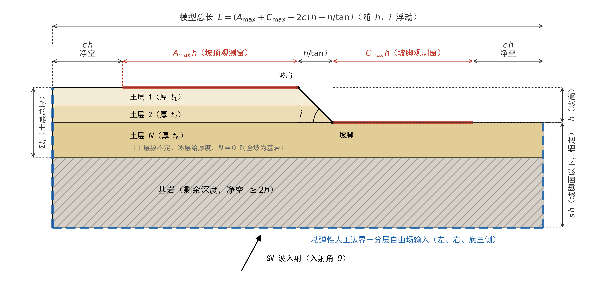

# 论文章节：数值模型尺寸设计（对齐 slope_frame_ssi_full_v1.py）

> **使用说明（本块不入论文正文）**
> 正文从下方分隔线开始，可直接粘贴进毕业论文，章节编号按论文实际层级替换（文中以"3.x"占位）。
> 图 3.x-1 在 `论文章节_模型尺寸设计_v1_figs/`（png/svg/pdf 三格式），由 `docs/draw_model_geometry_fig_v1.py` 生成，改参数后重跑即可更新。
> 数值取值与公式与 `Modeling/Hybrid/slope_frame_ssi_full_v1.py`（`geometry_cfg` / `_resolve_geometry_cfg` / `mesh_cfg` / `time_cfg`）当前实现一致。

---

## 3.x 数值模型尺寸设计

### 3.x.1 无量纲几何设计原则

斜坡地震动放大问题的控制因素是几何形状与波长的相对关系，而非模型的绝对尺寸。若将模型总长、平台长度等直接取为固定的绝对值，不同坡高、坡角的工况将无法保证一致的观测范围与边界净空，且参数化分析结果难以跨尺度推广。为此，本文采用无量纲几何设计：**以坡高 $h$（坡顶与坡脚地表的高程差）为唯一绝对尺度，模型其余各部位尺寸均表示为 $h$ 的倍数，由统一的换算关系导出**。模型总长度不预先固定，而是随坡高与坡角自然浮动。

该设计需给定的独立参数共 6 个：坡高 $h$、坡角 $i$、坡顶观测窗宽度系数 $A_{\max}$、坡脚观测窗宽度系数 $C_{\max}$、侧向边界净空系数 $c$ 以及坡脚面以下深度系数 $s$。其中 $h$、$i$ 为研究变量，其余 4 个为模型构造参数，取值论证见下节。值得强调的是，几何设计只负责模型外形：地层划分（土层数量、各层厚度与波速）不参与几何换算，由材料工况单独给定（见 3.x.3 节），因此改变地层配置不会引起模型外轮廓与网格总量的变化，保证了参数对比试验中变量的纯净性。

### 3.x.2 平面尺寸的确定

模型沿地表自左向右分为坡顶平台、坡面与坡脚平台三段，整体几何构成与各部位尺寸如图 3.x-1 所示。各段长度的设计原则为"观测窗＋边界净空"：观测窗（图中红色加粗地表段）为需要提取地表响应的范围；净空为观测窗外缘到人工边界的过渡距离，用于隔离人工边界残余反射对观测区的污染。各部位尺寸按表 3.x-1 确定。

**图 3.x-1 数值模型尺寸设计示意图**（长度均以坡高 $h$ 为单位；红色加粗段为坡顶/坡脚观测窗，蓝色虚线为粘弹性人工边界；坡脚面以下深度 $s\,h$ 恒定，土层数不定、逐层给厚度，剩余深度归基岩，$N=0$ 时全坡为基岩）

**表 3.x-1 模型各部位尺寸（以坡高 $h$ 为单位）**

| 部位                  | 计算式              | 说明                                                   |
| --------------------- | ------------------- | ------------------------------------------------------ |
| 坡顶平台长度$L_A$   | $(A_{\max}+c)\,h$ | 观测窗$A_{\max}h$ ＋ 左边界净空 $c\,h$，与坡角无关 |
| 坡面水平投影长$L_B$ | $h/\tan i$        | 由坡高与坡角唯一确定，随$i$ 浮动                     |
| 坡脚平台长度$L_C$   | $(C_{\max}+c)\,h$ | 观测窗$C_{\max}h$ ＋ 右边界净空 $c\,h$             |
| 模型总长$L$         | $L_A+L_B+L_C$     | 随$h$、$i$ 浮动，不固定                            |

观测窗宽度取 $A_{\max}=5$、$C_{\max}=4$。已有研究表明，坡体引起的地形放大效应在离开坡肩（或坡脚）约 $3h\sim4h$ 后即衰减至接近自由场水平（Bouckovalas & Papadimitriou, 2005），取 $5h$ 与 $4h$ 的观测窗已完整覆盖放大效应的空间分布并留有余量。

侧向净空取 $c=2$。本文模型的人工边界采用粘弹性人工边界（刘晶波等，2006），并配合逐节点施加的频域分层自由场输入：边界上的等效荷载由各边界节点所在土柱的一维分层自由场精确解给出，人工边界仅需吸收坡体散射产生的外行波，而非承担全部输入波的透射。因此侧向净空不必按最长入射波长设计，按 $2h$ 取值即可满足观测区不受边界污染的要求。对波长远大于坡高的低频工况（如 $h/\lambda\approx0.1$，即 $\lambda\approx10h$），以远场一维理论解为基准进行逐工况校核（见 3.x.6 节）：仅当远场台阶偏差超过 5% 时，才将该工况的侧向净空临时加大至 $\max(2h,\ 0.25\lambda_{\max})$，避免一刀切放大全部模型造成的计算浪费。

以典型工况 $h=200\ \mathrm{m}$、$i=45^{\circ}$、$A_{\max}=5$、$C_{\max}=4$、$c=2$ 为例：$L_A=7h=1400\ \mathrm{m}$，$L_B=h=200\ \mathrm{m}$，$L_C=6h=1200\ \mathrm{m}$，模型总长 $L=14h=2800\ \mathrm{m}$。当坡角减缓至 $i=30^{\circ}$ 时，坡面段自动伸长为 $L_B=h/\tan 30^{\circ}\approx1.73h$，总长相应浮动为 $\approx14.73h$，坡顶、坡脚观测窗保持不变。

### 3.x.3 竖向尺寸与地层划分

模型竖向尺寸由单一构造参数控制：**坡脚地表以下的模型深度固定取 $s\,h$（$s=3$），不随地层配置改变**。由此坡脚地表、坡顶地表到模型底边界的距离在所有工况中保持一致，模型总高度为

$$
H_{\mathrm{model}} = s\,h + h = (s+1)\,h ,
$$

典型工况（$h=200\ \mathrm{m}$，$s=3$）的模型总高为 $4h=800\ \mathrm{m}$。深度取 $3h$ 的依据与侧向净空同理：底部人工边界注入的入射波需在到达地层界面前充分发育为平面波场，坡体向下散射的波需在到达底边界前充分衰减，$s=3$ 在最不利地层配置下仍保证基岩段净空不小于 $2h$（见下）。

地层划分与几何设计完全解耦，在该固定深度范围内自上而下布置：土层 $1$、土层 $2$、……、土层 $N$（$N\ge 0$），每层显式给定厚度 $t_i$ 与材料参数；土层之下的全部剩余深度归为基岩半空间截断层。各土层界面取为水平面，自坡顶地表向下依次布置，因此存在两种自然退化情形：当土层总厚 $\sum t_i$ 小于坡高 $h$ 时，基岩顶面高于坡脚地表，基岩在坡面下段与坡脚平台出露（薄覆盖岩坡）；当 $N=0$ 时不设土层，整个坡体均为均质基岩。近地表薄层在坡面上出露、在坡脚平台一侧可能不存在（图 3.x-1）。

为保证底部人工边界的基岩净空，土层总厚受约束

$$
\sum_{i=1}^{N} t_i \le (s-1)\,h ,
$$

即基岩顶面到模型底边界的距离恒不小于 $2h$；该约束在建模时自动校验，超限工况直接报错拒绝。

### 3.x.4 网格尺寸设计

网格尺寸由波动数值模拟的空间采样要求控制，与模型绝对尺度无关。按 Kuhlemeyer & Lysmer（1973）判据，单元特征尺寸 $\Delta l$ 需满足每最短波长不少于 $n$ 个单元：

$$
\Delta l \le \frac{V_{s,\min}}{n\, f_{\max}},
$$

式中 $V_{s,\min}$ 为模型中最软土层的剪切波速；$n$ 取 10；$f_{\max}$ 为输入波有效频带上限，对中心频率为 $f_c$ 的 Ricker 子波取 $f_{\max}=2.5f_c$。

在此基础上，网格设计还包含以下三项细化措施：

（1）**分层渐变网格。** 网格需求由各层波速决定，深部硬层若沿用软层网格尺寸将造成计算量浪费。本文按各层剪切波速与最软层之比对单元尺寸分层缩放，软层细、硬层粗，层间以自由四边形网格平滑过渡；同时限制最粗层单元尺寸不超过最细层的 4 倍，以保证过渡区网格质量。

（2）**薄软层加密。** 含软弱表层的工况中，表层厚度方向的驻波形态（基频 $f_0=V_s/(4t)$，$t$ 为层厚）是地层放大的控制机制。为准确解析该机制，网格需同时满足：解析到各层共振基频的 3 次谐波所对应的波长要求；以及每一有限土层厚度方向不少于 6 个单元。二者取严者控制。

（3）**单元类型与尺寸下限。** 平面应变分析采用四节点缩减积分单元（CPE4R）；为防止极软层或高频工况下网格量失控，设置单元尺寸下限 0.2 m，触及下限的工况须相应下调截止频率并在工况记录中注明。

### 3.x.5 时间步长与分析时长

时间积分步长 $\Delta t$ 按采样定理校验：每个最高有效频率周期不少于 20 个时间步，即 $\Delta t \le 1/(20 f_{\max})$。输入地震动记录的采样间隔不满足该要求时予以重采样。

分析步总时长取"输入波持续时间＋静默尾段"。静默尾段（$2\sim3\ \mathrm{s}$）内输入荷载为零，用于让坡体内的混响充分衰减：本文后续采用频域方法从时程中提取传递函数 $H(f)$，若时窗在响应尚未归零时截断，频谱将产生泄漏误差，静默尾段是频域提取精度的必要保障。自由场输入的时窗与分析步同步延长，保证边界等效荷载在整个分析时段内自洽。

### 3.x.6 尺寸合理性的定量校核

上述尺寸设计的有效性不依赖经验判断，而由逐工况的自动化定量校核保证：远离坡体的模型左、右边界处，地表响应应退化为一维水平成层自由场。本文在每个工况建模时，同步以频域传递矩阵法（Thomson-Haskell 方法）计算左、右边界土柱的一维粘弹性自由场理论解，并写入工况元数据；后处理时将有限元远场台阶值与理论值对比，偏差超过 5% 的工况自动告警并排查（边界净空不足、阻尼标定偏差或网格不足均会在此暴露）。既有算例中该偏差均在 2% 以内，表明本节尺寸设计对观测区精度是充分的。

---

**参考文献（正文引用处按论文格式补全）**

- Kuhlemeyer R L, Lysmer J. Finite element method accuracy for wave propagation problems[J]. Journal of the Soil Mechanics and Foundations Division, 1973, 99(5): 421-427.
- Bouckovalas G D, Papadimitriou A G. Numerical evaluation of slope topography effects on seismic ground motion[J]. Soil Dynamics and Earthquake Engineering, 2005, 25(7-10): 547-558.
- 刘晶波, 谷音, 杜义欣. 一致粘弹性人工边界及粘弹性边界单元[J]. 岩土工程学报, 2006, 28(9): 1070-1075.
